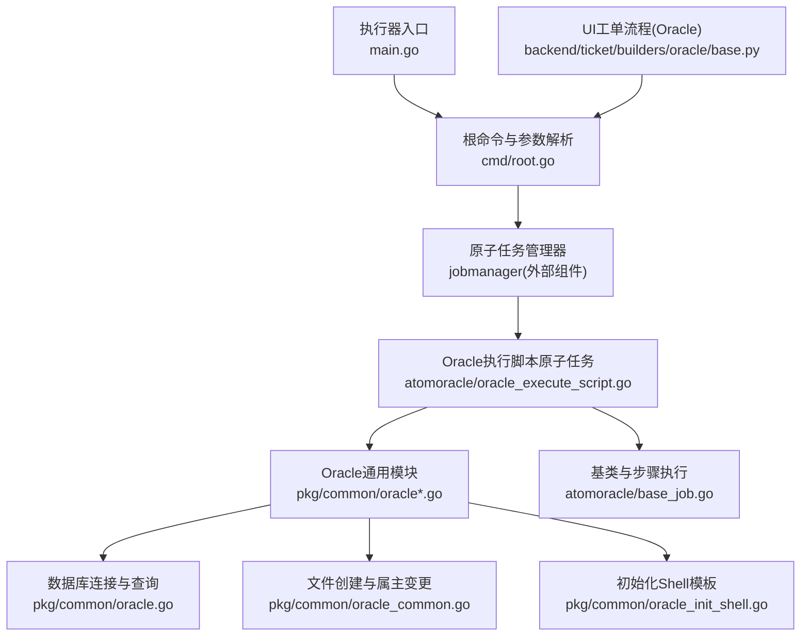
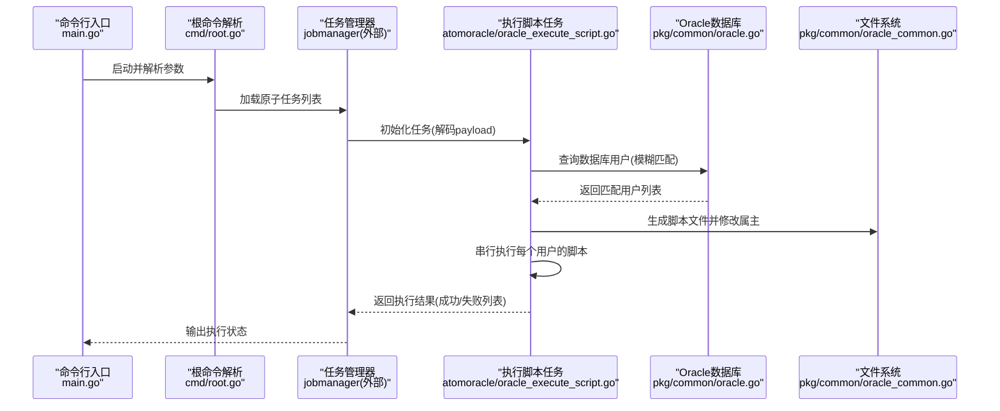
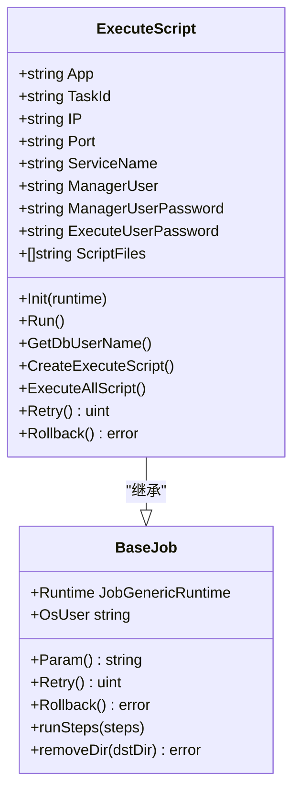
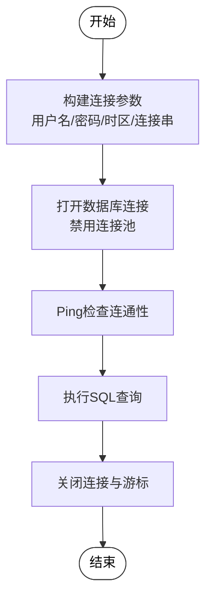
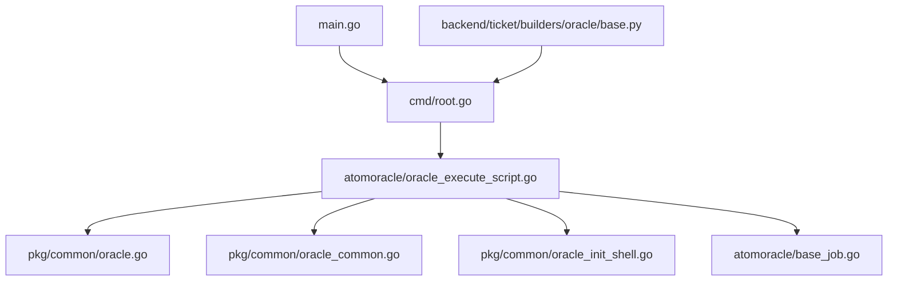

# Oracle配置管理

<cite>
**本文引用的文件**
- [main.go](file://dbm-services/oracle/db-tools/dbactuator/main.go)
- [root.go](file://dbm-services/oracle/db-tools/dbactuator/cmd/root.go)
- [oracle.go](file://dbm-services/oracle/db-tools/dbactuator/pkg/common/oracle.go)
- [oracle_common.go](file://dbm-services/oracle/db-tools/dbactuator/pkg/common/oracle_common.go)
- [oracle_init_shell.go](file://dbm-services/oracle/db-tools/dbactuator/pkg/common/oracle_init_shell.go)
- [base_job.go](file://dbm-services/oracle/db-tools/dbactuator/pkg/atomjobs/atomoracle/base_job.go)
- [oracle_execute_script.go](file://dbm-services/oracle/db-tools/dbactuator/pkg/atomjobs/atomoracle/oracle_execute_script.go)
- [base.py](file://dbm-ui/backend/ticket/builders/oracle/base.py)
</cite>

## 目录
1. [简介](#简介)
2. [项目结构](#项目结构)
3. [核心组件](#核心组件)
4. [架构总览](#架构总览)
5. [详细组件分析](#详细组件分析)
6. [依赖分析](#依赖分析)
7. [性能考虑](#性能考虑)
8. [故障排查指南](#故障排查指南)
9. [结论](#结论)
10. [附录](#附录)

## 简介
本文件面向Oracle数据库配置管理场景，基于仓库中的Oracle执行器与相关UI流程，系统化梳理Oracle配置下发、参数校验、脚本执行与结果回传的关键能力。重点覆盖以下方面：
- 通过原子任务框架统一编排Oracle配置变更流程
- 使用SQL查询与模板化脚本生成，实现对Oracle实例的参数调整与配置下发
- 提供参数校验、执行日志记录、失败回退提示与重试机制
- 结合UI工单流程，明确配置变更的影响范围与操作边界

说明：当前仓库未包含Oracle数据库参数调优（如SGA/PGA、共享池、缓冲区缓存等）的直接实现细节；本文在“Oracle特有配置项调优”部分以通用实践进行阐述，不直接映射到具体源码。

## 项目结构
Oracle配置管理由“执行器入口 + 原子任务框架 + Oracle通用模块 + UI工单流程”构成：
- 执行器入口负责解析参数、加载原子任务并执行
- 原子任务封装了参数校验、脚本生成、执行与结果统计
- Oracle通用模块提供数据库连接、文件创建与属主变更等基础能力
- UI侧定义Oracle集群类型与流程分组，确保配置变更在正确的集群类型上执行

图表来源
- [main.go:1-13](file://dbm-services/oracle/db-tools/dbactuator/main.go#L1-L13)
- [root.go:67-105](file://dbm-services/oracle/db-tools/dbactuator/cmd/root.go#L67-L105)
- [oracle_execute_script.go:32-121](file://dbm-services/oracle/db-tools/dbactuator/pkg/atomjobs/atomoracle/oracle_execute_script.go#L32-L121)
- [oracle.go:13-36](file://dbm-services/oracle/db-tools/dbactuator/pkg/common/oracle.go#L13-L36)
- [oracle_common.go:12-39](file://dbm-services/oracle/db-tools/dbactuator/pkg/common/oracle_common.go#L12-L39)
- [base_job.go:14-74](file://dbm-services/oracle/db-tools/dbactuator/pkg/atomjobs/atomoracle/base_job.go#L14-L74)
- [base.py:17-19](file://dbm-ui/backend/ticket/builders/oracle/base.py#L17-L19)

章节来源
- [main.go:1-13](file://dbm-services/oracle/db-tools/dbactuator/main.go#L1-L13)
- [root.go:67-105](file://dbm-services/oracle/db-tools/dbactuator/cmd/root.go#L67-L105)

## 核心组件
- 执行器入口与参数解析
  - 入口程序委托cmd包处理命令行参数与子命令
  - 支持payload、payload-file、atom-job-list、user/group等参数传递
- 原子任务框架
  - 通过jobmanager加载并运行指定原子任务列表
  - 提供调试命令列出可用任务、打印参数等辅助能力
- Oracle执行脚本原子任务
  - 参数模型包含应用标识、任务ID、IP、端口、服务名、模糊库名、管理员账号密码、执行用户密码与脚本文件列表
  - 校验参数后，按数据库用户生成脚本文件并串行执行
  - 记录成功/失败列表，失败时输出最后若干行日志
- Oracle通用模块
  - 数据库连接：使用godror驱动建立短连接，支持凭据与连接字符串拼接
  - 文件创建：创建脚本文件并修改属主，确保OS权限正确
  - 初始化Shell：提供安装目录、软链接与权限初始化模板

章节来源
- [root.go:67-105](file://dbm-services/oracle/db-tools/dbactuator/cmd/root.go#L67-L105)
- [root.go:142-172](file://dbm-services/oracle/db-tools/dbactuator/cmd/root.go#L142-L172)
- [oracle_execute_script.go:18-54](file://dbm-services/oracle/db-tools/dbactuator/pkg/atomjobs/atomoracle/oracle_execute_script.go#L18-L54)
- [oracle_execute_script.go:87-99](file://dbm-services/oracle/db-tools/dbactuator/pkg/atomjobs/atomoracle/oracle_execute_script.go#L87-L99)
- [oracle_execute_script.go:106-121](file://dbm-services/oracle/db-tools/dbactuator/pkg/atomjobs/atomoracle/oracle_execute_script.go#L106-L121)
- [oracle_execute_script.go:172-223](file://dbm-services/oracle/db-tools/dbactuator/pkg/atomjobs/atomoracle/oracle_execute_script.go#L172-L223)
- [oracle_execute_script.go:225-256](file://dbm-services/oracle/db-tools/dbactuator/pkg/atomjobs/atomoracle/oracle_execute_script.go#L225-L256)
- [oracle.go:13-36](file://dbm-services/oracle/db-tools/dbactuator/pkg/common/oracle.go#L13-L36)
- [oracle_common.go:12-39](file://dbm-services/oracle/db-tools/dbactuator/pkg/common/oracle_common.go#L12-L39)
- [oracle_init_shell.go:3-24](file://dbm-services/oracle/db-tools/dbactuator/pkg/common/oracle_init_shell.go#L3-L24)

## 架构总览
Oracle配置管理采用“命令行入口 + 原子任务 + 通用模块”的分层设计，核心流程如下：

图表来源
- [main.go:10-12](file://dbm-services/oracle/db-tools/dbactuator/main.go#L10-L12)
- [root.go:90-104](file://dbm-services/oracle/db-tools/dbactuator/cmd/root.go#L90-L104)
- [oracle_execute_script.go:56-85](file://dbm-services/oracle/db-tools/dbactuator/pkg/atomjobs/atomoracle/oracle_execute_script.go#L56-L85)
- [oracle_execute_script.go:123-170](file://dbm-services/oracle/db-tools/dbactuator/pkg/atomjobs/atomoracle/oracle_execute_script.go#L123-L170)
- [oracle_execute_script.go:172-223](file://dbm-services/oracle/db-tools/dbactuator/pkg/atomjobs/atomoracle/oracle_execute_script.go#L172-L223)
- [oracle_execute_script.go:225-256](file://dbm-services/oracle/db-tools/dbactuator/pkg/atomjobs/atomoracle/oracle_execute_script.go#L225-L256)
- [oracle.go:13-36](file://dbm-services/oracle/db-tools/dbactuator/pkg/common/oracle.go#L13-L36)
- [oracle_common.go:12-39](file://dbm-services/oracle/db-tools/dbactuator/pkg/common/oracle_common.go#L12-L39)

## 详细组件分析

### 组件A：Oracle执行脚本原子任务
该组件负责：
- 解析payload参数，构造执行目录与脚本格式
- 通过数据库查询获取目标数据库用户集合
- 为每个用户生成独立脚本文件与日志文件
- 串行执行脚本并收集结果，失败时输出最近日志行

图表来源
- [oracle_execute_script.go:18-54](file://dbm-services/oracle/db-tools/dbactuator/pkg/atomjobs/atomoracle/oracle_execute_script.go#L18-L54)
- [base_job.go:14-74](file://dbm-services/oracle/db-tools/dbactuator/pkg/atomjobs/atomoracle/base_job.go#L14-L74)

章节来源
- [oracle_execute_script.go:32-121](file://dbm-services/oracle/db-tools/dbactuator/pkg/atomjobs/atomoracle/oracle_execute_script.go#L32-L121)
- [oracle_execute_script.go:123-170](file://dbm-services/oracle/db-tools/dbactuator/pkg/atomjobs/atomoracle/oracle_execute_script.go#L123-L170)
- [oracle_execute_script.go:172-223](file://dbm-services/oracle/db-tools/dbactuator/pkg/atomjobs/atomoracle/oracle_execute_script.go#L172-L223)
- [oracle_execute_script.go:225-256](file://dbm-services/oracle/db-tools/dbactuator/pkg/atomjobs/atomoracle/oracle_execute_script.go#L225-L256)
- [base_job.go:14-74](file://dbm-services/oracle/db-tools/dbactuator/pkg/atomjobs/atomoracle/base_job.go#L14-L74)

### 组件B：Oracle通用模块
- 数据库连接
  - 使用godror驱动，构建连接参数（用户名、密码、时区、连接串），禁用连接池，建立短连接
  - 通过Ping校验连通性，再执行SQL查询
- 文件创建与属主变更
  - 创建文件并写入内容，随后执行chown修改属主与属组
- 初始化Shell模板
  - 提供安装目录创建、软链接与权限初始化的Shell脚本模板

图表来源
- [oracle.go:19-36](file://dbm-services/oracle/db-tools/dbactuator/pkg/common/oracle.go#L19-L36)

章节来源
- [oracle.go:13-36](file://dbm-services/oracle/db-tools/dbactuator/pkg/common/oracle.go#L13-L36)
- [oracle_common.go:12-39](file://dbm-services/oracle/db-tools/dbactuator/pkg/common/oracle_common.go#L12-L39)
- [oracle_init_shell.go:3-24](file://dbm-services/oracle/db-tools/dbactuator/pkg/common/oracle_init_shell.go#L3-L24)

### 组件C：UI工单流程与集群类型
- UI侧定义Oracle基础流程，限定在“主备架构”类型的集群上执行
- 与执行器配合，确保配置变更仅作用于正确的集群类型

章节来源
- [base.py:17-19](file://dbm-ui/backend/ticket/builders/oracle/base.py#L17-L19)

## 依赖分析
- 执行器入口依赖cmd包完成参数解析与任务调度
- 原子任务依赖Oracle通用模块进行数据库连接与文件操作
- UI工单流程约束Oracle集群类型，保证配置变更的适用范围

图表来源
- [main.go:8-12](file://dbm-services/oracle/db-tools/dbactuator/main.go#L8-L12)
- [root.go:90-104](file://dbm-services/oracle/db-tools/dbactuator/cmd/root.go#L90-L104)
- [oracle_execute_script.go:32-121](file://dbm-services/oracle/db-tools/dbactuator/pkg/atomjobs/atomoracle/oracle_execute_script.go#L32-L121)
- [oracle.go:13-36](file://dbm-services/oracle/db-tools/dbactuator/pkg/common/oracle.go#L13-L36)
- [oracle_common.go:12-39](file://dbm-services/oracle/db-tools/dbactuator/pkg/common/oracle_common.go#L12-L39)
- [base_job.go:14-74](file://dbm-services/oracle/db-tools/dbactuator/pkg/atomjobs/atomoracle/base_job.go#L14-L74)
- [base.py:17-19](file://dbm-ui/backend/ticket/builders/oracle/base.py#L17-L19)

## 性能考虑
- 连接策略
  - 当前实现为短连接模式，避免连接池带来的资源占用，适合一次性任务场景
  - 若频繁执行任务，可评估引入连接池或复用连接以降低握手开销
- 执行方式
  - 脚本串行执行，确保幂等与一致性；若需提升吞吐，可在业务允许前提下并行化（需注意锁与资源竞争）
- 日志与诊断
  - 失败时输出最后若干行日志，便于快速定位问题
  - 建议在生产环境增加更细粒度的超时控制与重试策略

## 故障排查指南
- 参数校验失败
  - 检查payload是否正确解码，必要时使用调试命令打印参数
  - 参考参数模型字段与必填项
- 数据库连接失败
  - 校验主机、端口、服务名与凭据
  - 使用短连接Ping验证连通性
- 文件创建/属主变更失败
  - 确认目标路径存在且具备写权限
  - 检查chown命令返回的错误信息
- 脚本执行失败
  - 查看对应日志文件的最后若干行
  - 确认脚本文件权限与执行环境

章节来源
- [root.go:174-189](file://dbm-services/oracle/db-tools/dbactuator/cmd/root.go#L174-L189)
- [oracle_execute_script.go:87-99](file://dbm-services/oracle/db-tools/dbactuator/pkg/atomjobs/atomoracle/oracle_execute_script.go#L87-L99)
- [oracle_execute_script.go:225-256](file://dbm-services/oracle/db-tools/dbactuator/pkg/atomjobs/atomoracle/oracle_execute_script.go#L225-L256)
- [oracle_common.go:12-39](file://dbm-services/oracle/db-tools/dbactuator/pkg/common/oracle_common.go#L12-L39)
- [oracle.go:13-36](file://dbm-services/oracle/db-tools/dbactuator/pkg/common/oracle.go#L13-L36)

## 结论
本项目通过原子任务框架与Oracle通用模块，提供了面向Oracle配置下发的标准化流程：参数校验、数据库用户发现、脚本生成与执行、结果统计与日志记录。结合UI工单流程，确保配置变更在正确的集群类型上执行。对于Oracle数据库参数调优（如SGA/PGA、共享池、缓冲区缓存等），建议在现有框架基础上扩展参数模型与脚本模板，以实现自动化调优与验证。

## 附录

### Oracle特有配置项调优（通用实践）
- SGA/PGA内存分配
  - SGA主要用于共享内存区域，包括共享池、缓冲区缓存、重做日志缓冲等
  - PGA用于每个进程的私有内存，包括UGA、堆栈与会话内存
  - 建议根据工作负载与实例规模逐步调整，观察命中率与等待事件
- 共享池大小
  - 关注Library Cache命中率与SQL Area内存使用
  - 避免过大导致内存压力，过小导致硬解析频繁
- 缓冲区缓存
  - 关注DB Block Gets与Physical Reads比值
  - 合理设置DB_CACHE_SIZE与相关LRU算法参数
- 日志文件配置
  - Redo Log组数与大小应满足并发事务需求
  - 合理设置归档策略与存储位置，避免I/O瓶颈
- 网络参数设置
  - 监听地址与端口、连接数限制、超时参数需与业务访问模式匹配
- 配置修改命令与验证
  - 使用动态参数在线调整（如SGA_TARGET、PGA_AGGREGATE_LIMIT）
  - 使用V$视图与AWR报告验证效果
- 影响范围与重启要求
  - 多数内存参数可在线调整；部分参数可能需要重启实例生效
  - 建议在维护窗口内执行重大变更，并做好回滚预案
- 最佳实践与案例
  - 以基准测试为依据，逐步加压验证
  - 结合业务高峰时段进行验证，关注响应时间与错误率

说明：上述为Oracle数据库调优的通用实践，不直接映射到当前仓库源码实现。