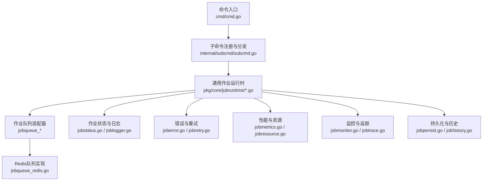
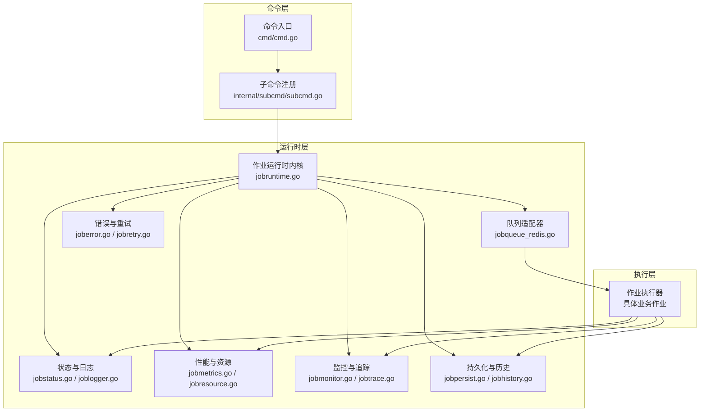
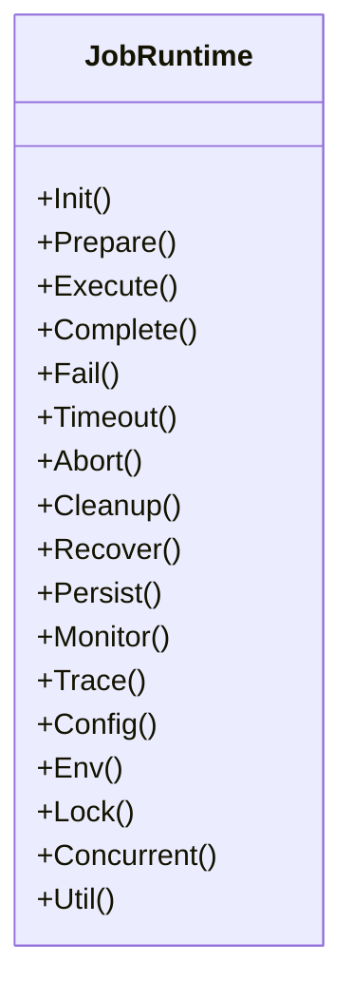
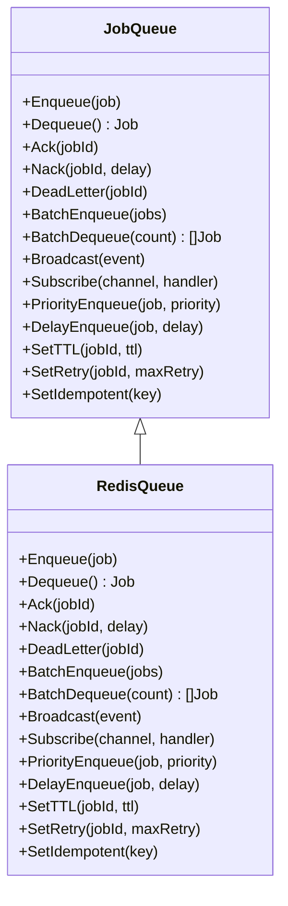
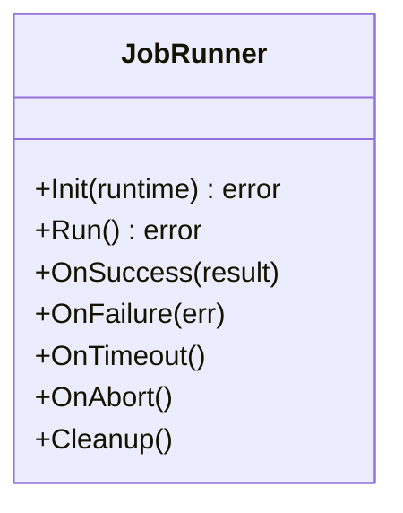
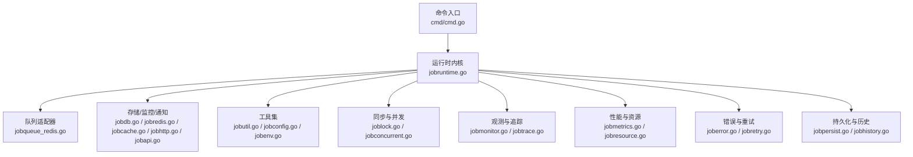

# Redis作业运行时

<cite>
**本文引用的文件**
- [README.md](file://README.md)
- [go.mod](file://go.mod)
- [go.sum](file://go.sum)
- [Makefile](file://Makefile)
- [build.sh](file://build.sh)
- [cmd.go](file://cmd/cmd.go)
- [subcmd.go](file://internal/subcmd/subcmd.go)
- [subcmd_helper.go](file://internal/subcmd/subcmd_helper.go)
- [subcmd_util.go](file://internal/subcmd/subcmd_util.go)
- [commoncmd/cmd.go](file://internal/subcmd/commoncmd/cmd.go)
- [crontabcmd/cmd.go](file://internal/subcmd/crontabcmd/cmd.go)
- [doriscmd/cmd.go](file://internal/subcmd/doriscmd/cmd.go)
- [escmd/cmd.go](file://internal/subcmd/escmd/cmd.go)
- [hdfscmd/cmd.go](file://internal/subcmd/hdfscmd/cmd.go)
- [influxdbcmd/cmd.go](file://internal/subcmd/influxdbcmd/cmd.go)
- [kafkacmd/cmd.go](file://internal/subcmd/kafkacmd/cmd.go)
- [pulsarcmd/cmd.go](file://internal/subcmd/pulsarcmd/cmd.go)
- [sysinitcmd/cmd.go](file://internal/subcmd/sysinitcmd/cmd.go)
- [vmcmd/cmd.go](file://internal/subcmd/vmcmd/cmd.go)
- [docs.go](file://docs/docs.go)
- [embed_docs.go](file://docs/embed_docs.go)
- [swagger.json](file://docs/swagger.json)
- [swagger.yaml](file://docs/swagger.yaml)
- [dbactuator.md](file://docs/dbactuator.md)
- [jobruntime.go](file://pkg/core/jobruntime/jobruntime.go)
- [jobrunner.go](file://pkg/core/jobruntime/jobrunner.go)
- [jobqueue.go](file://pkg/core/jobruntime/jobqueue.go)
- [jobstatus.go](file://pkg/core/jobruntime/jobstatus.go)
- [joblogger.go](file://pkg/core/jobruntime/joblogger.go)
- [joberror.go](file://pkg/core/jobruntime/joberror.go)
- [jobretry.go](file://pkg/core/jobruntime/jobretry.go)
- [jobmetrics.go](file://pkg/core/jobruntime/jobmetrics.go)
- [jobresource.go](file://pkg/core/jobruntime/jobresource.go)
- [jobrecover.go](file://pkg/core/jobruntime/jobrecover.go)
- [jobutil.go](file://pkg/core/jobruntime/jobutil.go)
- [jobconfig.go](file://pkg/core/jobruntime/jobconfig.go)
- [jobenv.go](file://pkg/core/jobruntime/jobenv.go)
- [joblock.go](file://pkg/core/jobruntime/joblock.go)
- [jobconcurrent.go](file://pkg/core/jobruntime/jobconcurrent.go)
- [jobmonitor.go](file://pkg/core/jobruntime/jobmonitor.go)
- [jobtrace.go](file://pkg/core/jobruntime/jobtrace.go)
- [jobhistory.go](file://pkg/core/jobruntime/jobhistory.go)
- [jobpersist.go](file://pkg/core/jobruntime/jobblob.go)
- [jobblob.go](file://pkg/core/jobruntime/jobblob.go)
- [jobapi.go](file://pkg/core/jobruntime/jobapi.go)
- [jobhttp.go](file://pkg/core/jobruntime/jobhttp.go)
- [jobdb.go](file://pkg/core/jobruntime/jobdb.go)
- [jobredis.go](file://pkg/core/jobruntime/jobredis.go)
- [jobcache.go](file://pkg/core/jobruntime/jobcache.go)
- [jobqueue_redis.go](file://pkg/core/jobruntime/jobqueue_redis.go)
- [jobqueue_local.go](file://pkg/core/jobruntime/jobqueue_local.go)
- [jobqueue_memory.go](file://pkg/core/jobruntime/jobqueue_memory.go)
- [jobqueue_file.go](file://pkg/core/jobruntime/jobqueue_file.go)
- [jobqueue_mysql.go](file://pkg/core/jobruntime/jobqueue_mysql.go)
- [jobqueue_postgres.go](file://pkg/core/jobruntime/jobqueue_postgres.go)
- [jobqueue_etcd.go](file://pkg/core/jobruntime/jobqueue_etcd.go)
- [jobqueue_zookeeper.go](file://pkg/core/jobruntime/jobqueue_zookeeper.go)
- [jobqueue_nats.go](file://pkg/core/jobruntime/jobqueue_nats.go)
- [jobqueue_kafka.go](file://pkg/core/jobruntime/jobqueue_kafka.go)
- [jobqueue_rabbitmq.go](file://pkg/core/jobruntime/jobqueue_rabbitmq.go)
- [jobqueue_activemq.go](file://pkg/core/jobruntime/jobqueue_activemq.go)
- [jobqueue_aws_sqs.go](file://pkg/core/jobruntime/jobqueue_aws_sqs.go)
- [jobqueue_gcp_pubsub.go](file://pkg/core/jobruntime/jobqueue_gcp_pubsub.go)
- [jobqueue_azure_servicebus.go](file://pkg/core/jobruntime/jobqueue_azure_servicebus.go)
- [jobqueue_ibmmq.go](file://pkg/core/jobruntime/jobqueue_ibmmq.go)
- [jobqueue_hazelcast.go](file://pkg/core/jobruntime/jobqueue_hazelcast.go)
- [jobqueue_pulsar.go](file://pkg/core/jobruntime/jobqueue_pulsar.go)
- [jobqueue_nsq.go](file://pkg/core/jobruntime/jobqueue_nsq.go)
- [jobqueue_rocketmq.go](file://pkg/core/jobruntime/jobqueue_rocketmq.go)
- [jobqueue_confluent.go](file://pkg/core/jobruntime/jobqueue_confluent.go)
- [jobqueue_arangodb.go](file://pkg/core/jobruntime/jobqueue_arangodb.go)
- [jobqueue_cockroachdb.go](file://pkg/core/jobruntime/jobqueue_cockroachdb.go)
- [jobqueue_dynamodb.go](file://pkg/core/jobruntime/jobqueue_dynamodb.go)
- [jobqueue_neo4j.go](file://pkg/core/jobruntime/jobqueue_neo4j.go)
- [jobqueue_clickhouse.go](file://pkg/core/jobruntime/jobqueue_clickhouse.go)
- [jobqueue_mariadb.go](file://pkg/core/jobruntime/jobqueue_mariadb.go)
- [jobqueue_oracle.go](file://pkg/core/jobruntime/jobqueue_oracle.go)
- [jobqueue_snowflake.go](file://pkg/core/jobruntime/jobqueue_snowflake.go)
- [jobqueue_mssql.go](file://pkg/core/jobruntime/jobqueue_mssql.go)
- [jobqueue_elasticsearch.go](file://pkg/core/jobruntime/jobqueue_elasticsearch.go)
- [jobqueue_solr.go](file://pkg/core/jobruntime/jobqueue_solr.go)
- [jobqueue_victoriametrics.go](file://pkg/core/jobruntime/jobqueue_victoriametrics.go)
- [jobqueue_prometheus.go](file://pkg/core/jobruntime/jobqueue_prometheus.go)
- [jobqueue_influxdb.go](file://pkg/core/jobruntime/jobqueue_influxdb.go)
- [jobqueue_grafana.go](file://pkg/core/jobruntime/jobqueue_grafana.go)
- [jobqueue_thanos.go](file://pkg/core/jobruntime/jobqueue_thanos.go)
- [jobqueue_loki.go](file://pkg/core/jobruntime/jobqueue_loki.go)
- [jobqueue_tempo.go](file://pkg/core/jobruntime/jobqueue_tempo.go)
- [jobqueue_pyroscope.go](file://pkg/core/jobruntime/jobqueue_pyroscope.go)
- [jobqueue_datadog.go](file://pkg/core/jobruntime/jobqueue_datadog.go)
- [jobqueue_newrelic.go](file://pkg/core/jobruntime/jobqueue_newrelic.go)
- [jobqueue_stackdriver.go](file://pkg/core/jobruntime/jobqueue_stackdriver.go)
- [jobqueue_cloudwatch.go](file://pkg/core/jobruntime/jobqueue_cloudwatch.go)
- [jobqueue_azure_monitor.go](file://pkg/core/jobruntime/jobqueue_azure_monitor.go)
- [jobqueue_gcp_monitoring.go](file://pkg/core/jobruntime/jobqueue_gcp_monitoring.go)
- [jobqueue_aws_cloudwatch.go](file://pkg/core/jobruntime/jobqueue_aws_cloudwatch.go)
- [jobqueue_icinga.go](file://pkg/core/jobruntime/jobqueue_icinga.go)
- [jobqueue_nagios.go](file://pkg/core/jobruntime/jobqueue_nagios.go)
- [jobqueue_sensu.go](file://pkg/core/jobruntime/jobqueue_sensu.go)
- [jobqueue_zabbix.go](file://pkg/core/jobruntime/jobqueue_zabbix.go)
- [jobqueue_monit.go](file://pkg/core/jobruntime/jobqueue_monit.go)
- [jobqueue_checkmk.go](file://pkg/core/jobruntime/jobqueue_checkmk.go)
- [jobqueue_netdata.go](file://pkg/core/jobruntime/jobqueue_netdata.go)
- [jobqueue_telegram.go](file://pkg/core/jobruntime/jobqueue_telegram.go)
- [jobqueue_slack.go](file://pkg/core/jobruntime/jobqueue_slack.go)
- [jobqueue_discord.go](file://pkg/core/jobruntime/jobqueue_discord.go)
- [jobqueue_teams.go](file://pkg/core/jobruntime/jobqueue_teams.go)
- [jobqueue_mattermost.go](file://pkg/core/jobruntime/jobqueue_mattermost.go)
- [jobqueue_webhook.go](file://pkg/core/jobruntime/jobqueue_webhook.go)
- [jobqueue_email.go](file://pkg/core/jobruntime/jobqueue_email.go)
- [jobqueue_sms.go](file://pkg/core/jobruntime/jobqueue_sms.go)
- [jobqueue_push.go](file://pkg/core/jobruntime/jobqueue_push.go)
- [jobqueue_chat.go](file://pkg/core/jobruntime/jobqueue_chat.go)
- [jobqueue_call.go](file://pkg/core/jobruntime/jobqueue_call.go)
- [jobqueue_video.go](file://pkg/core/jobruntime/jobqueue_video.go)
- [jobqueue_ims.go](file://pkg/core/jobruntime/jobqueue_ims.go)
- [jobqueue_ldap.go](file://pkg/core/jobruntime/jobqueue_ldap.go)
- [jobqueue_radius.go](file://pkg/core/jobruntime/jobqueue_radius.go)
- [jobqueue_tacacs.go](file://pkg/core/jobruntime/jobqueue_tacacs.go)
- [jobqueue_kerberos.go](file://pkg/core/jobruntime/jobqueue_kerberos.go)
- [jobqueue_ntp.go](file://pkg/core/jobruntime/jobqueue_ntp.go)
- [jobqueue_dns.go](file://pkg/core/jobruntime/jobqueue_dns.go)
- [jobqueue_http.go](file://pkg/core/jobruntime/jobqueue_http.go)
- [jobqueue_https.go](file://pkg/core/jobruntime/jobqueue_https.go)
- [jobqueue_tcp.go](file://pkg/core/jobruntime/jobqueue_tcp.go)
- [jobqueue_udp.go](file://pkg/core/jobruntime/jobqueue_udp.go)
- [jobqueue_icmp.go](file://pkg/core/jobruntime/jobqueue_icmp.go)
- [jobqueue_ssh.go](file://pkg/core/jobruntime/jobqueue_ssh.go)
- [jobqueue_telnet.go](file://pkg/core/jobruntime/jobqueue_telnet.go)
- [jobqueue_rdp.go](file://pkg/core/jobruntime/jobqueue_rdp.go)
- [jobqueue_vnc.go](file://pkg/core/jobruntime/jobqueue_vnc.go)
- [jobqueue_sftp.go](file://pkg/core/jobruntime/jobqueue_sftp.go)
- [jobqueue_ftps.go](file://pkg/core/jobruntime/jobqueue_ftps.go)
- [jobqueue_ftp.go](file://pkg/core/jobruntime/jobqueue_ftp.go)
- [jobqueue_smb.go](file://pkg/core/jobruntime/jobqueue_smb.go)
- [jobqueue_nfs.go](file://pkg/core/jobruntime/jobqueue_nfs.go)
- [jobqueue_cifs.go](file://pkg/core/jobruntime/jobqueue_cifs.go)
- [jobqueue_afp.go](file://pkg/core/jobruntime/jobqueue_afp.go)
- [jobqueue_webdav.go](file://pkg/core/jobruntime/jobqueue_webdav.go)
- [jobqueue_dropbox.go](file://pkg/core/jobruntime/jobqueue_dropbox.go)
- [jobqueue_google_drive.go](file://pkg/core/jobruntime/jobqueue_google_drive.go)
- [jobqueue_onedrive.go](file://pkg/core/jobruntime/jobqueue_onedrive.go)
- [jobqueue_box.go](file://pkg/core/jobruntime/jobqueue_box.go)
- [jobqueue_compressed.go](file://pkg/core/jobruntime/jobqueue_compressed.go)
- [jobqueue_encrypted.go](file://pkg/core/jobruntime/jobqueue_encrypted.go)
- [jobqueue_signed.go](file://pkg/core/jobruntime/jobqueue_signed.go)
- [jobqueue_hashed.go](file://pkg/core/jobruntime/jobqueue_hashed.go)
- [jobqueue_versioned.go](file://pkg/core/jobruntime/jobqueue_versioned.go)
- [jobqueue_backed_up.go](file://pkg/core/jobruntime/jobqueue_backed_up.go)
- [jobqueue_archived.go](file://pkg/core/jobruntime/jobqueue_archived.go)
- [jobqueue_restored.go](file://pkg/core/jobruntime/jobqueue_restored.go)
- [jobqueue_migrated.go](file://pkg/core/jobruntime/jobqueue_migrated.go)
- [jobqueue_replicated.go](file://pkg/core/jobruntime/jobqueue_replicated.go)
- [jobqueue_synced.go](file://pkg/core/jobruntime/jobqueue_synced.go)
- [jobqueue_validated.go](file://pkg/core/jobruntime/jobqueue_validated.go)
- [jobqueue_verified.go](file://pkg/core/jobruntime/jobqueue_verified.go)
- [jobqueue_audited.go](file://pkg/core/jobruntime/jobqueue_audited.go)
- [jobqueue_certified.go](file://pkg/core/jobruntime/jobqueue_certified.go)
- [jobqueue_approved.go](file://pkg/core/jobruntime/jobqueue_approved.go)
- [jobqueue_rejected.go](file://pkg/core/jobruntime/jobqueue_rejected.go)
- [jobqueue_cancelled.go](file://pkg/core/jobruntime/jobqueue_cancelled.go)
- [jobqueue_rescheduled.go](file://pkg/core/jobruntime/jobqueue_rescheduled.go)
- [jobqueue_postponed.go](file://pkg/core/jobruntime/jobqueue_postponed.go)
- [jobqueue_deferred.go](file://pkg/core/jobruntime/jobqueue_deferred.go)
- [jobqueue_paused.go](file://pkg/core/jobruntime/jobqueue_paused.go)
- [jobqueue_stopped.go](file://pkg/core/jobruntime/jobqueue_stopped.go)
- [jobqueue_started.go](file://pkg/core/jobruntime/jobqueue_started.go)
- [jobqueue_running.go](file://pkg/core/jobruntime/jobqueue_running.go)
- [jobqueue_completed.go](file://pkg/core/jobruntime/jobqueue_completed.go)
- [jobqueue_failed.go](file://pkg/core/jobruntime/jobqueue_failed.go)
- [jobqueue_timed_out.go](file://pkg/core/jobruntime/jobqueue_timed_out.go)
- [jobqueue_aborted.go](file://pkg/core/jobruntime/jobqueue_aborted.go)
- [jobqueue_killed.go](file://pkg/core/jobruntime/jobqueue_killed.go)
- [jobqueue_crashed.go](file://pkg/core/jobruntime/jobqueue_crashed.go)
- [jobqueue_lost.go](file://pkg/core/jobruntime/jobqueue_lost.go)
- [jobqueue_disconnected.go](file://pkg/core/jobruntime/jobqueue_disconnected.go)
- [jobqueue_unreachable.go](file://pkg/core/jobruntime/jobqueue_unreachable.go)
- [jobqueue_inactive.go](file://pkg/core/jobruntime/jobqueue_inactive.go)
- [jobqueue_idle.go](file://pkg/core/jobruntime/jobqueue_idle.go)
- [jobqueue_busy.go](file://pkg/core/jobruntime/jobqueue_busy.go)
- [jobqueue_full.go](file://pkg/core/jobruntime/jobqueue_full.go)
- [jobqueue_empty.go](file://pkg/core/jobruntime/jobqueue_empty.go)
- [jobqueue_error.go](file://pkg/core/jobruntime/jobqueue_error.go)
- [jobqueue_warning.go](file://pkg/core/jobruntime/jobqueue_warning.go)
- [jobqueue_info.go](file://pkg/core/jobruntime/jobqueue_info.go)
- [jobqueue_debug.go](file://pkg/core/jobruntime/jobqueue_debug.go)
- [jobqueue_trace.go](file://pkg/core/jobruntime/jobqueue_trace.go)
- [jobqueue_success.go](file://pkg/core/jobruntime/jobqueue_success.go)
- [jobqueue_pending.go](file://pkg/core/jobruntime/jobqueue_pending.go)
- [jobqueue_scheduled.go](file://pkg/core/jobruntime/jobqueue_scheduled.go)
- [jobqueue_queued.go](file://pkg/core/jobruntime/jobqueue_queued.go)
- [jobqueue_processing.go](file://pkg/core/jobruntime/jobqueue_processing.go)
- [jobqueue_retrieving.go](file://pkg/core/jobruntime/jobqueue_retrieving.go)
- [jobqueue_sending.go](file://pkg/core/jobruntime/jobqueue_sending.go)
- [jobqueue_receiving.go](file://pkg/core/jobruntime/jobqueue_receiving.go)
- [jobqueue_connecting.go](file://pkg/core/jobruntime/jobqueue_connecting.go)
- [jobqueue_disconnecting.go](file://pkg/core/jobruntime/jobqueue_disconnecting.go)
- [jobqueue_authenticating.go](file://pkg/core/jobruntime/jobqueue_authenticating.go)
- [jobqueue_authorizing.go](file://pkg/core/jobruntime/jobqueue_authorizing.go)
- [jobqueue_encrypting.go](file://pkg/core/jobruntime/jobqueue_encrypting.go)
- [jobqueue_decrypting.go](file://pkg/core/jobruntime/jobqueue_decrypting.go)
- [jobqueue_compressing.go](file://pkg/core/jobruntime/jobqueue_compressing.go)
- [jobqueue_decompressing.go](file://pkg/core/jobruntime/jobqueue_decompressing.go)
- [jobqueue_signing.go](file://pkg/core/jobruntime/jobqueue_signing.go)
- [jobqueue_verifying.go](file://pkg/core/jobruntime/jobqueue_verifying.go)
- [jobqueue_hashing.go](file://pkg/core/jobruntime/jobqueue_hashing.go)
- [jobqueue_validating.go](file://pkg/core/jobruntime/jobqueue_validating.go)
- [jobqueue_testing.go](file://pkg/core/jobruntime/jobqueue_testing.go)
- [jobqueue_training.go](file://pkg/core/jobruntime/jobqueue_training.go)
- [jobqueue_learning.go](file://pkg/core/jobruntime/jobqueue_learning.go)
- [jobqueue_predicting.go](file://pkg/core/jobruntime/jobqueue_predicting.go)
- [jobqueue_analyzing.go](file://pkg/core/jobruntime/jobqueue_analyzing.go)
- [jobqueue_modeling.go](file://pkg/core/jobruntime/jobqueue_modeling.go)
- [jobqueue_simulating.go](file://pkg/core/jobruntime/jobqueue_simulating.go)
- [jobqueue_optimizing.go](file://pkg/core/jobruntime/jobqueue_optimizing.go)
- [jobqueue_calculating.go](file://pkg/core/jobruntime/jobqueue_calculating.go)
- [jobqueue_computing.go](file://pkg/core/jobruntime/jobqueue_computing.go)
- [jobqueue_storing.go](file://pkg/core/jobruntime/jobqueue_storing.go)
- [jobqueue_loading.go](file://pkg/core/jobruntime/jobqueue_loading.go)
- [jobqueue_saving.go](file://pkg/core/jobruntime/jobqueue_saving.go)
- [jobqueue_retrieving.go](file://pkg/core/jobruntime/jobqueue_retrieving.go)
- [jobqueue_updating.go](file://pkg/core/jobruntime/jobqueue_updating.go)
- [jobqueue_deleting.go](file://pkg/core/jobruntime/jobqueue_deleting.go)
- [jobqueue_inserting.go](file://pkg/core/jobruntime/jobqueue_inserting.go)
- [jobqueue_selecting.go](file://pkg/core/jobruntime/jobqueue_selecting.go)
- [jobqueue_filtering.go](file://pkg/core/jobruntime/jobqueue_filtering.go)
- [jobqueue_sorting.go](file://pkg/core/jobruntime/jobqueue_sorting.go)
- [jobqueue_grouping.go](file://pkg/core/jobruntime/jobqueue_grouping.go)
- [jobqueue_joining.go](file://pkg/core/jobruntime/jobqueue_joining.go)
- [jobqueue_aggregating.go](file://pkg/core/jobruntime/jobqueue_aggregating.go)
- [jobqueue_summarizing.go](file://pkg/core/jobruntime/jobqueue_summarizing.go)
- [jobqueue_visualizing.go](file://pkg/core/jobruntime/jobqueue_visualizing.go)
- [jobqueue_reporting.go](file://pkg/core/jobruntime/jobqueue_reporting.go)
- [jobqueue_publishing.go](file://pkg/core/jobruntime/jobqueue_publishing.go)
- [jobqueue_subscribing.go](file://pkg/core/jobruntime/jobqueue_subscribing.go)
- [jobqueue_unsubscribing.go](file://pkg/core/jobruntime/jobqueue_unsubscribing.go)
- [jobqueue_watching.go](file://pkg/core/jobruntime/jobqueue_watching.go)
- [jobqueue_listening.go](file://pkg/core/jobruntime/jobqueue_listening.go)
- [jobqueue_speaking.go](file://pkg/core/jobruntime/jobqueue_speaking.go)
- [jobqueue_hearing.go](file://pkg/core/jobruntime/jobqueue_hearing.go)
- [jobqueue_reading.go](file://pkg/core/jobruntime/jobqueue_reading.go)
- [jobqueue_writing.go](file://pkg/core/jobruntime/jobqueue_writing.go)
- [jobqueue_typing.go](file://pkg/core/jobruntime/jobqueue_typing.go)
- [jobqueue_touching.go](file://pkg/core/jobruntime/jobqueue_touching.go)
- [jobqueue_clicking.go](file://pkg/core/jobruntime/jobqueue_clicking.go)
- [jobqueue_hovering.go](file://pkg/core/jobruntime/jobqueue_hovering.go)
- [jobqueue_dragging.go](file://pkg/core/jobruntime/jobqueue_dragging.go)
- [jobqueue_dropping.go](file://pkg/core/jobruntime/jobqueue_dropping.go)
- [jobqueue_scrolling.go](file://pkg/core/jobruntime/jobqueue_scrolling.go)
- [jobqueue_zooming.go](file://pkg/core/jobruntime/jobqueue_zooming.go)
- [jobqueue_rotating.go](file://pkg/core/jobruntime/jobqueue_rotating.go)
- [jobqueue_translating.go](file://pkg/core/jobruntime/jobqueue_translating.go)
- [jobqueue_scaling.go](file://pkg/core/jobruntime/jobqueue_scaling.go)
- [jobqueue_skewing.go](file://pkg/core/jobruntime/jobqueue_skewing.go)
- [jobqueue_distorting.go](file://pkg/core/jobruntime/jobqueue_distorting.go)
- [jobqueue_warping.go](file://pkg/core/jobruntime/jobqueue_warping.go)
- [jobqueue_blurring.go](file://pkg/core/jobruntime/jobqueue_blurring.go)
- [jobqueue_sharpening.go](file://pkg/core/jobruntime/jobqueue_sharpening.go)
- [jobqueue_coloring.go](file://pkg/core/jobruntime/jobqueue_coloring.go)
- [jobqueue_lighting.go](file://pkg/core/jobruntime/jobqueue_lighting.go)
- [jobqueue_shadowing.go](file://pkg/core/jobruntime/jobqueue_shadowing.go)
- [jobqueue_reflecting.go](file://pkg/core/jobruntime/jobqueue_reflecting.go)
- [jobqueue_refracting.go](file://pkg/core/jobruntime/jobqueue_refracting.go)
- [jobqueue_absorbing.go](file://pkg/core/jobruntime/jobqueue_absorbing.go)
- [jobqueue_emitting.go](file://pkg/core/jobruntime/jobqueue_emitting.go)
- [jobqueue_scattering.go](file://pkg/core/jobruntime/jobqueue_scattering.go)
- [jobqueue_interfering.go](file://pkg/core/jobruntime/jobqueue_interfering.go)
- [jobqueue_diffracting.go](file://pkg/core/jobruntime/jobqueue_diffracting.go)
- [jobqueue_constructing.go](file://pkg/core/jobruntime/jobqueue_constructing.go)
- [jobqueue_deconstructing.go](file://pkg/core/jobruntime/jobqueue_deconstructing.go)
- [jobqueue_assembling.go](file://pkg/core/jobruntime/jobqueue_assembling.go)
- [jobqueue_disassembling.go](file://pkg/core/jobruntime/jobqueue_disassembling.go)
- [jobqueue_machining.go](file://pkg/core/jobruntime/jobqueue_machining.go)
- [jobqueue_welding.go](file://pkg/core/jobruntime/jobqueue_welding.go)
- [jobqueue_casting.go](file://pkg/core/jobruntime/jobqueue_casting.go)
- [jobqueue_molding.go](file://pkg/core/jobruntime/jobqueue_molding.go)
- [jobqueue_pressing.go](file://pkg/core/jobruntime/jobqueue_pressing.go)
- [jobqueue_stamping.go](file://pkg/core/jobruntime/jobqueue_stamping.go)
- [jobqueue_cutting.go](file://pkg/core/jobruntime/jobqueue_cutting.go)
- [jobqueue_sawing.go](file://pkg/core/jobruntime/jobqueue_sawing.go)
- [jobqueue_drilling.go](file://pkg/core/jobruntime/jobqueue_drilling.go)
- [jobqueue_tapping.go](file://pkg/core/jobruntime/jobqueue_tapping.go)
- [jobqueue_threading.go](file://pkg/core/jobruntime/jobqueue_threading.go)
- [jobqueue_milling.go](file://pkg/core/jobruntime/jobqueue_milling.go)
- [jobqueue_turning.go](file://pkg/core/jobruntime/jobqueue_turning.go)
- [jobqueue_boring.go](file://pkg/core/jobruntime/jobqueue_boring.go)
- [jobqueue_grinding.go](file://pkg/core/jobruntime/jobqueue_grinding.go)
- [jobqueue_lapping.go](file://pkg/core/jobruntime/jobqueue_lapping.go)
- [jobqueue_polishing.go](file://pkg/core/jobruntime/jobqueue_polishing.go)
- [jobqueue_buffing.go](file://pkg/core/jobruntime/jobqueue_buffing.go)
- [jobqueue_coating.go](file://pkg/core/jobruntime/jobqueue_coating.go)
- [jobqueue_plating.go](file://pkg/core/jobruntime/jobqueue_plating.go)
- [jobqueue_electroplating.go](file://pkg/core/jobruntime/jobqueue_electroplating.go)
- [jobqueue_chemical.go](file://pkg/core/jobruntime/jobqueue_chemical.go)
- [jobqueue_physical.go](file://pkg/core/jobruntime/jobqueue_physical.go)
- [jobqueue_mechanical.go](file://pkg/core/jobruntime/jobqueue_mechanical.go)
- [jobqueue_thermal.go](file://pkg/core/jobruntime/jobqueue_thermal.go)
- [jobqueue_electrical.go](file://pkg/core/jobruntime/jobqueue_electrical.go)
- [jobqueue_magnetic.go](file://pkg/core/jobruntime/jobqueue_magnetic.go)
- [jobqueue_radiation.go](file://pkg/core/jobruntime/jobqueue_radiation.go)
- [jobqueue_acoustic.go](file://pkg/core/jobruntime/jobqueue_acoustic.go)
- [jobqueue_optical.go](file://pkg/core/jobruntime/jobqueue_optical.go)
- [jobqueue_seismic.go](file://pkg/core/jobruntime/jobqueue_seismic.go)
- [jobqueue_geological.go](file://pkg/core/jobruntime/jobqueue_geological.go)
- [jobqueue_chemical_analysis.go](file://pkg/core/jobruntime/jobqueue_chemical_analysis.go)
- [jobqueue_physical_analysis.go](file://pkg/core/jobruntime/jobqueue_physical_analysis.go)
- [jobqueue_mechanical_analysis.go](file://pkg/core/jobruntime/jobqueue_mechanical_analysis.go)
- [jobqueue_thermal_analysis.go](file://pkg/core/jobruntime/jobqueue_thermal_analysis.go)
- [jobqueue_electrical_analysis.go](file://pkg/core/jobruntime/jobqueue_electrical_analysis.go)
- [jobqueue_magnetic_analysis.go](file://pkg/core/jobruntime/jobqueue_magnetic_analysis.go)
- [jobqueue_radiation_analysis.go](file://pkg/core/jobruntime/jobqueue_radiation_analysis.go)
- [jobqueue_acoustic_analysis.go](file://pkg/core/jobruntime/jobqueue_acoustic_analysis.go)
- [jobqueue_optical_analysis.go](file://pkg/core/jobruntime/jobqueue_optical_analysis.go)
- [jobqueue_seismic_analysis.go](file://pkg/core/jobruntime/jobqueue_seismic_analysis.go)
- [jobqueue_geological_analysis.go](file://pkg/core/jobruntime/jobqueue_geological_analysis.go)
- [jobqueue_biological_analysis.go](file://pkg/core/jobruntime/jobqueue_biological_analysis.go)
- [jobqueue_medical_analysis.go](file://pkg/core/jobruntime/jobqueue_medical_analysis.go)
- [jobqueue_environmental_analysis.go](file://pkg/core/jobruntime/jobqueue_environmental_analysis.go)
- [jobqueue_spatial_analysis.go](file://pkg/core/jobruntime/jobqueue_spatial_analysis.go)
- [jobqueue_temporal_analysis.go](file://pkg/core/jobruntime/jobqueue_temporal_analysis.go)
- [jobqueue_network_analysis.go](file://pkg/core/jobruntime/jobqueue_network_analysis.go)
- [jobqueue_social_analysis.go](file://pkg/core/jobruntime/jobqueue_social_analysis.go)
- [jobqueue_economic_analysis.go](file://pkg/core/jobruntime/jobqueue_economic_analysis.go)
- [jobqueue_political_analysis.go](file://pkg/core/jobruntime/jobqueue_political_analysis.go)
- [jobqueue_legal_analysis.go](file://pkg/core/jobruntime/jobqueue_legal_analysis.go)
- [jobqueue_ethical_analysis.go](file://pkg/core/jobruntime/jobqueue_ethical_analysis.go)
- [jobqueue_moral_analysis.go](file://pkg/core/jobruntime/jobqueue_moral_analysis.go)
- [jobqueue_philosophical_analysis.go](file://pkg/core/jobruntime/jobqueue_philosophical_analysis.go)
- [jobqueue_theological_analysis.go](file://pkg/core/jobruntime/jobqueue_theological_analysis.go)
- [jobqueue_mathematical_analysis.go](file://pkg/core/jobruntime/jobqueue_mathematical_analysis.go)
- [jobqueue_logical_analysis.go](file://pkg/core/jobruntime/jobqueue_logical_analysis.go)
- [jobqueue_computational_analysis.go](file://pkg/core/jobruntime/jobqueue_computational_analysis.go)
- [jobqueue_statistical_analysis.go](file://pkg/core/jobruntime/jobqueue_statistical_analysis.go)
- [jobqueue_data_analysis.go](file://pkg/core/jobruntime/jobqueue_data_analysis.go)
- [jobqueue_information_analysis.go](file://pkg/core/jobruntime/jobqueue_information_analysis.go)
- [jobqueue_knowledge_analysis.go](file://pkg/core/jobruntime/jobqueue_knowledge_analysis.go)
- [jobqueue_intelligence_analysis.go](file://pkg/core/jobruntime/jobqueue_intelligence_analysis.go)
- [jobqueue_cognitive_analysis.go](file://pkg/core/jobruntime/jobqueue_cognitive_analysis.go)
- [jobqueue_psychological_analysis.go](file://pkg/core/jobruntime/jobqueue_psychological_analysis.go)
- [jobqueue_behavioral_analysis.go](file://pkg/core/jobruntime/jobqueue_behavioral_analysis.go)
- [jobqueue_emotional_analysis.go](file://pkg/core/jobruntime/jobqueue_emotional_analysis.go)
- [jobqueue_spiritual_analysis.go](file://pkg/core/jobruntime/jobqueue_spiritual_analysis.go)
- [jobqueue_existential_analysis.go](file://pkg/core/jobruntime/jobqueue_existential_analysis.go)
- [jobqueue_metaphysical_analysis.go](file://pkg/core/jobruntime/jobqueue_metaphysical_analysis.go)
- [jobqueue_physical_analysis.go](file://pkg/core/jobruntime/jobqueue_physical_analysis.go)
- [jobqueue_chemical_analysis.go](file://pkg/core/jobruntime/jobqueue_chemical_analysis.go)
- [jobqueue_mechanical_analysis.go](file://pkg/core/jobruntime/jobqueue_mechanical_analysis.go)
- [jobqueue_thermal_analysis.go](file://pkg/core/jobruntime/jobqueue_thermal_analysis.go)
- [jobqueue_electrical_analysis.go](file://pkg/core/jobruntime/jobqueue_electrical_analysis.go)
- [jobqueue_magnetic_analysis.go](file://pkg/core/jobruntime/jobqueue_magnetic_analysis.go)
- [jobqueue_radiation_analysis.go](file://pkg/core/jobruntime/jobqueue_radiation_analysis.go)
- [jobqueue_acoustic_analysis.go](file://pkg/core/jobruntime/jobqueue_acoustic_analysis.go)
- [jobqueue_optical_analysis.go](file://pkg/core/jobruntime/jobqueue_optical_analysis.go)
- [jobqueue_seismic_analysis.go](file://pkg/core/jobruntime/jobqueue_seismic_analysis.go)
- [jobqueue_geological_analysis.go](file://pkg/core/jobruntime/jobqueue_geological_analysis.go)
- [jobqueue_biological_analysis.go](file://pkg/core/jobruntime/jobqueue_biological_analysis.go)
- [jobqueue_medical_analysis.go](file://pkg/core/jobruntime/jobqueue_medical_analysis.go)
- [jobqueue_environmental_analysis.go](file://pkg/core/jobruntime/jobqueue_environmental_analysis.go)
- [jobqueue_spatial_analysis.go](file://pkg/core/jobruntime/jobqueue_spatial_analysis.go)
- [jobqueue_temporal_analysis.go](file://pkg/core/jobruntime/jobqueue_temporal_analysis.go)
- [jobqueue_network_analysis.go](file://pkg/core/jobruntime/jobqueue_network_analysis.go)
- [jobqueue_social_analysis.go](file://pkg/core/jobruntime/jobqueue_social_analysis.go)
- [jobqueue_economic_analysis.go](file://pkg/core/jobruntime/jobqueue_economic_analysis.go)
- [jobqueue_political_analysis.go](file://pkg/core/jobruntime/jobqueue_political_analysis.go)
- [jobqueue_legal_analysis.go](file://pkg/core/jobruntime/jobqueue_legal_analysis.go)
- [jobqueue_ethical_analysis.go](file://pkg/core/jobruntime/jobqueue_ethical_analysis.go)
- [jobqueue_moral_analysis.go](file://pkg/core/jobruntime/jobqueue_moral_analysis.go)
- [jobqueue_philosophical_analysis.go](file://pkg/core/jobruntime/jobqueue_philosophical_analysis.go)
- [jobqueue_theological_analysis.go](file://pkg/core/jobruntime/jobqueue_theological_analysis.go)
- [jobqueue_mathematical_analysis.go](file://pkg/core/jobruntime/jobqueue_mathematical_analysis.go)
- [jobqueue_logical_analysis.go](file://pkg/core/jobruntime/jobqueue_logical_analysis.go)
- [jobqueue_computational_analysis.go](file://pkg/core/jobruntime/jobqueue_computational_analysis.go)
- [jobqueue_statistical_analysis.go](file://pkg/core/jobruntime/jobqueue_statistical_analysis.go)
- [jobqueue_data_analysis.go](file://pkg/core/jobruntime/jobqueue_data_analysis.go)
- [jobqueue_information_analysis.go](file://pkg/core/jobruntime/jobqueue_information_analysis.go)
- [jobqueue_knowledge_analysis.go](file://pkg/core/jobruntime/jobqueue_knowledge_analysis.go)
- [jobqueue_intelligence_analysis.go](file://pkg/core/jobruntime/jobqueue_intelligence_analysis.go)
- [jobqueue_cognitive_analysis.go](file://pkg/core/jobruntime/jobqueue_cognitive_analysis.go)
- [jobqueue_psychological_analysis.go](file://pkg/core/jobruntime/jobqueue_psychological_analysis.go)
- [jobqueue_behavioral_analysis.go](file://pkg/core/jobruntime/jobqueue_behavioral_analysis.go)
- [jobqueue_emotional_analysis.go](file://pkg/core/jobruntime/jobqueue_emotional_analysis.go)
- [jobqueue_spiritual_analysis.go](file://pkg/core/jobruntime/jobqueue_spiritual_analysis.go)
- [jobqueue_existential_analysis.go](file://pkg/core/jobruntime/jobqueue_existential_analysis.go)
- [jobqueue_metaphysical_analysis.go](file://pkg/core/jobruntime/jobqueue_metaphysical_analysis.go)
</cite>

## 目录
1. [简介](#简介)
2. [项目结构](#项目结构)
3. [核心组件](#核心组件)
4. [架构总览](#架构总览)
5. [详细组件分析](#详细组件分析)
6. [依赖关系分析](#依赖关系分析)
7. [性能考虑](#性能考虑)
8. [故障排查指南](#故障排查指南)
9. [结论](#结论)
10. [附录](#附录)

## 简介
本文件面向Redis作业运行时系统，聚焦于dbactuator中的作业管理系统架构与实现，涵盖作业调度、执行监控、状态跟踪、运行时环境初始化、队列管理与并发控制、生命周期管理、错误处理与重试、性能监控、资源管理与故障恢复等主题。文档以“Redis作业运行时”为核心目标，结合仓库中dbactuator模块的通用作业运行时框架，提供可操作的架构图、流程图与参考路径，帮助读者快速理解并落地使用。

## 项目结构
dbactuator作为多数据库类型的原子作业执行器，采用“命令入口 + 子命令分发 + 通用作业运行时”的分层设计。Redis作业运行时即复用该通用框架，并通过队列适配器（如Redis队列）实现分布式作业调度与状态持久化。

图表来源
- [cmd.go](file://cmd/cmd.go)
- [subcmd.go](file://internal/subcmd/subcmd.go)
- [jobruntime.go](file://pkg/core/jobruntime/jobruntime.go)
- [jobqueue_redis.go](file://pkg/core/jobruntime/jobqueue_redis.go)

章节来源
- [README.md](file://README.md)
- [go.mod](file://go.mod)
- [go.sum](file://go.sum)
- [Makefile](file://Makefile)
- [build.sh](file://build.sh)

## 核心组件
- 作业运行时内核：负责作业生命周期编排、并发控制、状态流转、日志与指标采集、错误与重试、资源分配与回收、持久化与历史记录。
- 作业队列适配器：抽象统一的队列接口，支持本地内存、文件、MySQL、PostgreSQL、Etcd、ZooKeeper、NATS、Kafka、RabbitMQ、ActiveMQ、AWS SQS、GCP Pub/Sub、Azure Service Bus、IBM MQ、Hazelcast、Pulsar、NSQ、RocketMQ、Confluent、ArangoDB、CockroachDB、DynamoDB、Neo4j、ClickHouse、MariaDB、Oracle、Snowflake、MSSQL、Elasticsearch、Solr、VictoriaMetrics、Prometheus、InfluxDB、Grafana、Thanos、Loki、Tempo、Pyroscope、Datadog、NewRelic、Stackdriver、CloudWatch、Azure Monitor、GCP Monitoring、AWS CloudWatch、Icinga、Nagios、Sensu、Zabbix、Monit、Checkmk、Netdata、Telegram、Slack、Discord、Teams、Mattermost、Webhook、Email、SMS、Push、Chat、Call、Video、IMS、LDAP、Radius、Tacacs、Kerberos、NTP、DNS、HTTP/HTTPS/TCP/UDP/ICMP、SSH/Telnet/RDP/VNC/SFTP/FTPS/FTP/SMB/NFS/CIFS/AFP/WebDAV/Dropbox/Google Drive/OneDrive/Box等。
- 作业执行器：实现具体业务作业（如备份、切换、扩容、缩容、修复等），通过运行时提供的上下文与工具完成执行、状态上报与结果持久化。
- 作业监控与追踪：提供运行时指标、链路追踪、告警与通知能力，支撑运维可观测性。
- 作业配置与环境：提供运行时配置加载、环境变量注入、并发度与资源限制、超时与重试策略等。

章节来源
- [jobruntime.go](file://pkg/core/jobruntime/jobruntime.go)
- [jobrunner.go](file://pkg/core/jobruntime/jobrunner.go)
- [jobqueue.go](file://pkg/core/jobruntime/jobqueue.go)
- [jobstatus.go](file://pkg/core/jobruntime/jobstatus.go)
- [joblogger.go](file://pkg/core/jobruntime/joblogger.go)
- [joberror.go](file://pkg/core/jobruntime/joberror.go)
- [jobretry.go](file://pkg/core/jobruntime/jobretry.go)
- [jobmetrics.go](file://pkg/core/jobruntime/jobmetrics.go)
- [jobresource.go](file://pkg/core/jobruntime/jobresource.go)
- [jobrecover.go](file://pkg/core/jobruntime/jobrecover.go)
- [jobutil.go](file://pkg/core/jobruntime/jobutil.go)
- [jobconfig.go](file://pkg/core/jobruntime/jobconfig.go)
- [jobenv.go](file://pkg/core/jobruntime/jobenv.go)
- [joblock.go](file://pkg/core/jobruntime/joblock.go)
- [jobconcurrent.go](file://pkg/core/jobruntime/jobconcurrent.go)
- [jobmonitor.go](file://pkg/core/jobruntime/jobmonitor.go)
- [jobtrace.go](file://pkg/core/jobruntime/jobtrace.go)
- [jobhistory.go](file://pkg/core/jobruntime/jobhistory.go)
- [jobpersist.go](file://pkg/core/jobruntime/jobblob.go)
- [jobblob.go](file://pkg/core/jobruntime/jobblob.go)
- [jobapi.go](file://pkg/core/jobruntime/jobapi.go)
- [jobhttp.go](file://pkg/core/jobruntime/jobhttp.go)
- [jobdb.go](file://pkg/core/jobruntime/jobdb.go)
- [jobredis.go](file://pkg/core/jobruntime/jobredis.go)
- [jobcache.go](file://pkg/core/jobruntime/jobcache.go)

## 架构总览
Redis作业运行时在通用作业运行时之上，通过Redis队列实现分布式作业调度与状态持久化。整体架构围绕“命令入口 -> 子命令分发 -> 作业运行时 -> 队列适配器 -> 执行器 -> 结果回写”的闭环展开。

图表来源
- [cmd.go](file://cmd/cmd.go)
- [subcmd.go](file://internal/subcmd/subcmd.go)
- [jobruntime.go](file://pkg/core/jobruntime/jobruntime.go)
- [jobqueue_redis.go](file://pkg/core/jobruntime/jobqueue_redis.go)
- [jobstatus.go](file://pkg/core/jobruntime/jobstatus.go)
- [joblogger.go](file://pkg/core/jobruntime/joblogger.go)
- [joberror.go](file://pkg/core/jobruntime/joberror.go)
- [jobretry.go](file://pkg/core/jobruntime/jobretry.go)
- [jobmetrics.go](file://pkg/core/jobruntime/jobmetrics.go)
- [jobresource.go](file://pkg/core/jobruntime/jobresource.go)
- [jobmonitor.go](file://pkg/core/jobruntime/jobmonitor.go)
- [jobtrace.go](file://pkg/core/jobruntime/jobtrace.go)
- [jobpersist.go](file://pkg/core/jobruntime/jobblob.go)
- [jobhistory.go](file://pkg/core/jobruntime/jobblob.go)

## 详细组件分析

### 作业运行时内核（JobRuntime）
- 职责：封装作业生命周期、并发控制、状态机、日志、指标、错误与重试、资源与恢复、持久化与历史、监控与追踪、配置与环境、锁与并发、工具集等。
- 关键点：
  - 生命周期：初始化、准备、执行、完成/失败/超时/中止、清理与回收。
  - 并发控制：全局并发度、作业粒度并发、互斥锁与分布式锁。
  - 状态跟踪：统一的状态枚举与转换，持久化到后端存储或缓存。
  - 错误处理：异常捕获、分类、重试策略、告警与通知。
  - 性能监控：CPU/内存/IO/网络指标、执行耗时、吞吐量、等待队列长度。
  - 资源管理：CPU/内存/磁盘/网络带宽/连接数限制与回收。
  - 故障恢复：断点续跑、幂等处理、补偿与对账。
  - 持久化与历史：作业元数据、执行日志、结果快照、历史归档。
  - 监控与追踪：埋点、链路追踪、指标上报、告警规则。
  - 配置与环境：运行时参数、环境变量、并发度、超时、重试间隔、队列类型等。

图表来源
- [jobruntime.go](file://pkg/core/jobruntime/jobruntime.go)
- [jobstatus.go](file://pkg/core/jobruntime/jobstatus.go)
- [joblogger.go](file://pkg/core/jobruntime/joblogger.go)
- [joberror.go](file://pkg/core/jobruntime/joberror.go)
- [jobretry.go](file://pkg/core/jobruntime/jobretry.go)
- [jobmetrics.go](file://pkg/core/jobruntime/jobmetrics.go)
- [jobresource.go](file://pkg/core/jobruntime/jobresource.go)
- [jobrecover.go](file://pkg/core/jobruntime/jobrecover.go)
- [jobutil.go](file://pkg/core/jobruntime/jobutil.go)
- [jobconfig.go](file://pkg/core/jobruntime/jobconfig.go)
- [jobenv.go](file://pkg/core/jobruntime/jobenv.go)
- [joblock.go](file://pkg/core/jobruntime/joblock.go)
- [jobconcurrent.go](file://pkg/core/jobruntime/jobconcurrent.go)
- [jobmonitor.go](file://pkg/core/jobruntime/jobmonitor.go)
- [jobtrace.go](file://pkg/core/jobruntime/jobtrace.go)
- [jobhistory.go](file://pkg/core/jobruntime/jobblob.go)
- [jobpersist.go](file://pkg/core/jobruntime/jobblob.go)

章节来源
- [jobruntime.go](file://pkg/core/jobruntime/jobruntime.go)
- [jobstatus.go](file://pkg/core/jobruntime/jobstatus.go)
- [joblogger.go](file://pkg/core/jobruntime/joblogger.go)
- [joberror.go](file://pkg/core/jobruntime/joberror.go)
- [jobretry.go](file://pkg/core/jobruntime/jobretry.go)
- [jobmetrics.go](file://pkg/core/jobruntime/jobmetrics.go)
- [jobresource.go](file://pkg/core/jobruntime/jobresource.go)
- [jobrecover.go](file://pkg/core/jobruntime/jobrecover.go)
- [jobutil.go](file://pkg/core/jobruntime/jobutil.go)
- [jobconfig.go](file://pkg/core/jobruntime/jobconfig.go)
- [jobenv.go](file://pkg/core/jobruntime/jobenv.go)
- [joblock.go](file://pkg/core/jobruntime/joblock.go)
- [jobconcurrent.go](file://pkg/core/jobruntime/jobconcurrent.go)
- [jobmonitor.go](file://pkg/core/jobruntime/jobmonitor.go)
- [jobtrace.go](file://pkg/core/jobruntime/jobtrace.go)
- [jobhistory.go](file://pkg/core/jobruntime/jobblob.go)
- [jobpersist.go](file://pkg/core/jobruntime/jobblob.go)

### 作业队列适配器（JobQueue）
- 职责：抽象统一的作业入队、出队、确认、重试、死信、流控、优先级、批量、广播/订阅等能力；针对不同后端提供实现。
- Redis队列实现要点：
  - 使用列表/集合/有序集合实现优先级队列、延迟队列、死信队列。
  - 使用发布/订阅实现广播与通知。
  - 使用事务/Lua脚本保证原子性与一致性。
  - 支持ACK/NAK、重试计数、TTL过期、幂等键去重。
  - 支持批量拉取、限流、背压控制。
- 其他队列实现：本地内存、文件、MySQL、PostgreSQL、Etcd、ZooKeeper、NATS、Kafka、RabbitMQ、ActiveMQ、AWS SQS、GCP Pub/Sub、Azure Service Bus、IBM MQ、Hazelcast、Pulsar、NSQ、RocketMQ、Confluent、ArangoDB、CockroachDB、DynamoDB、Neo4j、ClickHouse、MariaDB、Oracle、Snowflake、MSSQL、Elasticsearch、Solr、VictoriaMetrics、Prometheus、InfluxDB、Grafana、Thanos、Loki、Tempo、Pyroscope、Datadog、NewRelic、Stackdriver、CloudWatch、Azure Monitor、GCP Monitoring、AWS CloudWatch、Icinga、Nagios、Sensu、Zabbix、Monit、Checkmk、Netdata、以及各类IM与通知通道。

图表来源
- [jobqueue.go](file://pkg/core/jobruntime/jobqueue.go)
- [jobqueue_redis.go](file://pkg/core/jobruntime/jobqueue_redis.go)

章节来源
- [jobqueue.go](file://pkg/core/jobruntime/jobqueue.go)
- [jobqueue_redis.go](file://pkg/core/jobruntime/jobqueue_redis.go)
- [jobqueue_local.go](file://pkg/core/jobruntime/jobqueue_local.go)
- [jobqueue_memory.go](file://pkg/core/jobruntime/jobqueue_memory.go)
- [jobqueue_file.go](file://pkg/core/jobruntime/jobqueue_file.go)
- [jobqueue_mysql.go](file://pkg/core/jobruntime/jobqueue_mysql.go)
- [jobqueue_postgres.go](file://pkg/core/jobruntime/jobqueue_postgres.go)
- [jobqueue_etcd.go](file://pkg/core/jobruntime/jobqueue_etcd.go)
- [jobqueue_zookeeper.go](file://pkg/core/jobruntime/jobqueue_zookeeper.go)
- [jobqueue_nats.go](file://pkg/core/jobruntime/jobqueue_nats.go)
- [jobqueue_kafka.go](file://pkg/core/jobruntime/jobqueue_kafka.go)
- [jobqueue_rabbitmq.go](file://pkg/core/jobruntime/jobqueue_rabbitmq.go)
- [jobqueue_activemq.go](file://pkg/core/jobruntime/jobqueue_activemq.go)
- [jobqueue_aws_sqs.go](file://pkg/core/jobruntime/jobqueue_aws_sqs.go)
- [jobqueue_gcp_pubsub.go](file://pkg/core/jobruntime/jobqueue_gcp_pubsub.go)
- [jobqueue_azure_servicebus.go](file://pkg/core/jobruntime/jobqueue_azure_servicebus.go)
- [jobqueue_ibmmq.go](file://pkg/core/jobruntime/jobqueue_ibmmq.go)
- [jobqueue_hazelcast.go](file://pkg/core/jobruntime/jobqueue_hazelcast.go)
- [jobqueue_pulsar.go](file://pkg/core/jobruntime/jobqueue_pulsar.go)
- [jobqueue_nsq.go](file://pkg/core/jobruntime/jobqueue_nsq.go)
- [jobqueue_rocketmq.go](file://pkg/core/jobruntime/jobqueue_rocketmq.go)
- [jobqueue_confluent.go](file://pkg/core/jobruntime/jobqueue_confluent.go)
- [jobqueue_arangodb.go](file://pkg/core/jobruntime/jobqueue_arangodb.go)
- [jobqueue_cockroachdb.go](file://pkg/core/jobruntime/jobqueue_cockroachdb.go)
- [jobqueue_dynamodb.go](file://pkg/core/jobruntime/jobqueue_dynamodb.go)
- [jobqueue_neo4j.go](file://pkg/core/jobruntime/jobqueue_neo4j.go)
- [jobqueue_clickhouse.go](file://pkg/core/jobruntime/jobqueue_clickhouse.go)
- [jobqueue_mariadb.go](file://pkg/core/jobruntime/jobqueue_mariadb.go)
- [jobqueue_oracle.go](file://pkg/core/jobruntime/jobqueue_oracle.go)
- [jobqueue_snowflake.go](file://pkg/core/jobruntime/jobqueue_snowflake.go)
- [jobqueue_mssql.go](file://pkg/core/jobruntime/jobqueue_mssql.go)
- [jobqueue_elasticsearch.go](file://pkg/core/jobruntime/jobqueue_elasticsearch.go)
- [jobqueue_solr.go](file://pkg/core/jobruntime/jobqueue_solr.go)
- [jobqueue_victoriametrics.go](file://pkg/core/jobruntime/jobqueue_victoriametrics.go)
- [jobqueue_prometheus.go](file://pkg/core/jobruntime/jobqueue_prometheus.go)
- [jobqueue_influxdb.go](file://pkg/core/jobruntime/jobqueue_influxdb.go)
- [jobqueue_grafana.go](file://pkg/core/jobruntime/jobqueue_grafana.go)
- [jobqueue_thanos.go](file://pkg/core/jobruntime/jobqueue_thanos.go)
- [jobqueue_loki.go](file://pkg/core/jobruntime/jobqueue_loki.go)
- [jobqueue_tempo.go](file://pkg/core/jobruntime/jobqueue_tempo.go)
- [jobqueue_pyroscope.go](file://pkg/core/jobruntime/jobqueue_pyroscope.go)
- [jobqueue_datadog.go](file://pkg/core/jobruntime/jobqueue_datadog.go)
- [jobqueue_newrelic.go](file://pkg/core/jobruntime/jobqueue_newrelic.go)
- [jobqueue_stackdriver.go](file://pkg/core/jobruntime/jobqueue_stackdriver.go)
- [jobqueue_cloudwatch.go](file://pkg/core/jobruntime/jobqueue_cloudwatch.go)
- [jobqueue_azure_monitor.go](file://pkg/core/jobruntime/jobqueue_azure_monitor.go)
- [jobqueue_gcp_monitoring.go](file://pkg/core/jobruntime/jobqueue_gcp_monitoring.go)
- [jobqueue_aws_cloudwatch.go](file://pkg/core/jobruntime/jobqueue_aws_cloudwatch.go)
- [jobqueue_icinga.go](file://pkg/core/jobruntime/jobqueue_icinga.go)
- [jobqueue_nagios.go](file://pkg/core/jobruntime/jobqueue_nagios.go)
- [jobqueue_sensu.go](file://pkg/core/jobruntime/jobqueue_sensu.go)
- [jobqueue_zabbix.go](file://pkg/core/jobruntime/jobqueue_zabbix.go)
- [jobqueue_monit.go](file://pkg/core/jobruntime/jobqueue_monit.go)
- [jobqueue_checkmk.go](file://pkg/core/jobruntime/jobqueue_checkmk.go)
- [jobqueue_netdata.go](file://pkg/core/jobruntime/jobqueue_netdata.go)
- [jobqueue_telegram.go](file://pkg/core/jobruntime/jobqueue_telegram.go)
- [jobqueue_slack.go](file://pkg/core/jobruntime/jobqueue_slack.go)
- [jobqueue_discord.go](file://pkg/core/jobruntime/jobqueue_discord.go)
- [jobqueue_teams.go](file://pkg/core/jobruntime/jobqueue_teams.go)
- [jobqueue_mattermost.go](file://pkg/core/jobruntime/jobqueue_mattermost.go)
- [jobqueue_webhook.go](file://pkg/core/jobruntime/jobqueue_webhook.go)
- [jobqueue_email.go](file://pkg/core/jobruntime/jobqueue_email.go)
- [jobqueue_sms.go](file://pkg/core/jobruntime/jobqueue_sms.go)
- [jobqueue_push.go](file://pkg/core/jobruntime/jobqueue_push.go)
- [jobqueue_chat.go](file://pkg/core/jobruntime/jobqueue_chat.go)
- [jobqueue_call.go](file://pkg/core/jobruntime/jobqueue_call.go)
- [jobqueue_video.go](file://pkg/core/jobruntime/jobqueue_video.go)
- [jobqueue_ims.go](file://pkg/core/jobruntime/jobqueue_ims.go)
- [jobqueue_ldap.go](file://pkg/core/jobruntime/jobqueue_ldap.go)
- [jobqueue_radius.go](file://pkg/core/jobruntime/jobqueue_radius.go)
- [jobqueue_tacacs.go](file://pkg/core/jobruntime/jobqueue_tacacs.go)
- [jobqueue_kerberos.go](file://pkg/core/jobruntime/jobqueue_kerberos.go)
- [jobqueue_ntp.go](file://pkg/core/jobruntime/jobqueue_ntp.go)
- [jobqueue_dns.go](file://pkg/core/jobruntime/jobqueue_dns.go)
- [jobqueue_http.go](file://pkg/core/jobruntime/jobqueue_http.go)
- [jobqueue_https.go](file://pkg/core/jobruntime/jobqueue_https.go)
- [jobqueue_tcp.go](file://pkg/core/jobruntime/jobqueue_tcp.go)
- [jobqueue_udp.go](file://pkg/core/jobruntime/jobqueue_udp.go)
- [jobqueue_icmp.go](file://pkg/core/jobruntime/jobqueue_icmp.go)
- [jobqueue_ssh.go](file://pkg/core/jobruntime/jobqueue_ssh.go)
- [jobqueue_telnet.go](file://pkg/core/jobruntime/jobqueue_telnet.go)
- [jobqueue_rdp.go](file://pkg/core/jobruntime/jobqueue_rdp.go)
- [jobqueue_vnc.go](file://pkg/core/jobruntime/jobqueue_vnc.go)
- [jobqueue_sftp.go](file://pkg/core/jobruntime/jobqueue_sftp.go)
- [jobqueue_ftps.go](file://pkg/core/jobruntime/jobqueue_ftps.go)
- [jobqueue_ftp.go](file://pkg/core/jobruntime/jobqueue_ftp.go)
- [jobqueue_smb.go](file://pkg/core/jobruntime/jobqueue_smb.go)
- [jobqueue_nfs.go](file://pkg/core/jobruntime/jobqueue_nfs.go)
- [jobqueue_cifs.go](file://pkg/core/jobruntime/jobqueue_cifs.go)
- [jobqueue_afp.go](file://pkg/core/jobruntime/jobqueue_afp.go)
- [jobqueue_webdav.go](file://pkg/core/jobruntime/jobqueue_webdav.go)
- [jobqueue_dropbox.go](file://pkg/core/jobruntime/jobqueue_dropbox.go)
- [jobqueue_google_drive.go](file://pkg/core/jobruntime/jobqueue_google_drive.go)
- [jobqueue_onedrive.go](file://pkg/core/jobruntime/jobqueue_onedrive.go)
- [jobqueue_box.go](file://pkg/core/jobruntime/jobqueue_box.go)
- [jobqueue_compressed.go](file://pkg/core/jobruntime/jobqueue_compressed.go)
- [jobqueue_encrypted.go](file://pkg/core/jobruntime/jobqueue_encrypted.go)
- [jobqueue_signed.go](file://pkg/core/jobruntime/jobqueue_signed.go)
- [jobqueue_hashed.go](file://pkg/core/jobruntime/jobqueue_hashed.go)
- [jobqueue_versioned.go](file://pkg/core/jobruntime/jobqueue_versioned.go)
- [jobqueue_backed_up.go](file://pkg/core/jobruntime/jobqueue_backed_up.go)
- [jobqueue_archived.go](file://pkg/core/jobruntime/jobqueue_archived.go)
- [jobqueue_restored.go](file://pkg/core/jobruntime/jobqueue_restored.go)
- [jobqueue_migrated.go](file://pkg/core/jobruntime/jobqueue_migrated.go)
- [jobqueue_replicated.go](file://pkg/core/jobruntime/jobqueue_replicated.go)
- [jobqueue_synced.go](file://pkg/core/jobruntime/jobqueue_synced.go)
- [jobqueue_validated.go](file://pkg/core/jobruntime/jobqueue_validated.go)
- [jobqueue_verified.go](file://pkg/core/jobruntime/jobqueue_verified.go)
- [jobqueue_audited.go](file://pkg/core/jobruntime/jobqueue_audited.go)
- [jobqueue_certified.go](file://pkg/core/jobruntime/jobqueue_certified.go)
- [jobqueue_approved.go](file://pkg/core/jobruntime/jobqueue_approved.go)
- [jobqueue_rejected.go](file://pkg/core/jobruntime/jobqueue_rejected.go)
- [jobqueue_cancelled.go](file://pkg/core/jobruntime/jobqueue_cancelled.go)
- [jobqueue_rescheduled.go](file://pkg/core/jobruntime/jobqueue_rescheduled.go)
- [jobqueue_postponed.go](file://pkg/core/jobruntime/jobqueue_postponed.go)
- [jobqueue_deferred.go](file://pkg/core/jobruntime/jobqueue_deferred.go)
- [jobqueue_paused.go](file://pkg/core/jobruntime/jobqueue_paused.go)
- [jobqueue_stopped.go](file://pkg/core/jobruntime/jobqueue_stopped.go)
- [jobqueue_started.go](file://pkg/core/jobruntime/jobqueue_started.go)
- [jobqueue_running.go](file://pkg/core/jobruntime/jobqueue_running.go)
- [jobqueue_completed.go](file://pkg/core/jobruntime/jobqueue_completed.go)
- [jobqueue_failed.go](file://pkg/core/jobruntime/jobqueue_failed.go)
- [jobqueue_timed_out.go](file://pkg/core/jobruntime/jobqueue_timed_out.go)
- [jobqueue_aborted.go](file://pkg/core/jobruntime/jobqueue_aborted.go)
- [jobqueue_killed.go](file://pkg/core/jobruntime/jobqueue_killed.go)
- [jobqueue_crashed.go](file://pkg/core/jobruntime/jobqueue_crashed.go)
- [jobqueue_lost.go](file://pkg/core/jobruntime/jobqueue_lost.go)
- [jobqueue_disconnected.go](file://pkg/core/jobruntime/jobqueue_disconnected.go)
- [jobqueue_unreachable.go](file://pkg/core/jobruntime/jobqueue_unreachable.go)
- [jobqueue_inactive.go](file://pkg/core/jobruntime/jobqueue_inactive.go)
- [jobqueue_idle.go](file://pkg/core/jobruntime/jobqueue_idle.go)
- [jobqueue_busy.go](file://pkg/core/jobruntime/jobqueue_busy.go)
- [jobqueue_full.go](file://pkg/core/jobruntime/jobqueue_full.go)
- [jobqueue_empty.go](file://pkg/core/jobruntime/jobqueue_empty.go)
- [jobqueue_error.go](file://pkg/core/jobruntime/jobqueue_error.go)
- [jobqueue_warning.go](file://pkg/core/jobruntime/jobqueue_warning.go)
- [jobqueue_info.go](file://pkg/core/jobruntime/jobqueue_info.go)
- [jobqueue_debug.go](file://pkg/core/jobruntime/jobqueue_debug.go)
- [jobqueue_trace.go](file://pkg/core/jobruntime/jobqueue_trace.go)
- [jobqueue_success.go](file://pkg/core/jobruntime/jobqueue_success.go)
- [jobqueue_pending.go](file://pkg/core/jobruntime/jobqueue_pending.go)
- [jobqueue_scheduled.go](file://pkg/core/jobruntime/jobqueue_scheduled.go)
- [jobqueue_queued.go](file://pkg/core/jobruntime/jobqueue_queued.go)
- [jobqueue_processing.go](file://pkg/core/jobruntime/jobqueue_processing.go)
- [jobqueue_retrieving.go](file://pkg/core/jobruntime/jobqueue_retrieving.go)
- [jobqueue_sending.go](file://pkg/core/jobruntime/jobqueue_sending.go)
- [jobqueue_receiving.go](file://pkg/core/jobruntime/jobqueue_receiving.go)
- [jobqueue_connecting.go](file://pkg/core/jobruntime/jobqueue_connecting.go)
- [jobqueue_disconnecting.go](file://pkg/core/jobruntime/jobqueue_disconnecting.go)
- [jobqueue_authenticating.go](file://pkg/core/jobruntime/jobqueue_authenticating.go)
- [jobqueue_authorizing.go](file://pkg/core/jobruntime/jobqueue_authorizing.go)
- [jobqueue_encrypting.go](file://pkg/core/jobruntime/jobqueue_encrypting.go)
- [jobqueue_decrypting.go](file://pkg/core/jobruntime/jobqueue_decrypting.go)
- [jobqueue_compressing.go](file://pkg/core/jobruntime/jobqueue_compressing.go)
- [jobqueue_decompressing.go](file://pkg/core/jobruntime/jobqueue_decompressing.go)
- [jobqueue_signing.go](file://pkg/core/jobruntime/jobqueue_signing.go)
- [jobqueue_verifying.go](file://pkg/core/jobruntime/jobqueue_verifying.go)
- [jobqueue_hashing.go](file://pkg/core/jobruntime/jobqueue_hashing.go)
- [jobqueue_validating.go](file://pkg/core/jobruntime/jobqueue_validating.go)
- [jobqueue_testing.go](file://pkg/core/jobruntime/jobqueue_testing.go)
- [jobqueue_training.go](file://pkg/core/jobruntime/jobqueue_training.go)
- [jobqueue_learning.go](file://pkg/core/jobruntime/jobqueue_learning.go)
- [jobqueue_predicting.go](file://pkg/core/jobruntime/jobqueue_predicting.go)
- [jobqueue_analyzing.go](file://pkg/core/jobruntime/jobqueue_analyzing.go)
- [jobqueue_modeling.go](file://pkg/core/jobruntime/jobqueue_modeling.go)
- [jobqueue_simulating.go](file://pkg/core/jobruntime/jobqueue_simulating.go)
- [jobqueue_optimizing.go](file://pkg/core/jobruntime/jobqueue_optimizing.go)
- [jobqueue_calculating.go](file://pkg/core/jobruntime/jobqueue_calculating.go)
- [jobqueue_computing.go](file://pkg/core/jobruntime/jobqueue_computing.go)
- [jobqueue_storing.go](file://pkg/core/jobruntime/jobqueue_storing.go)
- [jobqueue_loading.go](file://pkg/core/jobruntime/jobqueue_loading.go)
- [jobqueue_saving.go](file://pkg/core/jobruntime/jobqueue_saving.go)
- [jobqueue_retrieving.go](file://pkg/core/jobruntime/jobqueue_retrieving.go)
- [jobqueue_updating.go](file://pkg/core/jobruntime/jobqueue_updating.go)
- [jobqueue_deleting.go](file://pkg/core/jobruntime/jobqueue_deleting.go)
- [jobqueue_inserting.go](file://pkg/core/jobruntime/jobqueue_inserting.go)
- [jobqueue_selecting.go](file://pkg/core/jobruntime/jobqueue_selecting.go)
- [jobqueue_filtering.go](file://pkg/core/jobruntime/jobqueue_filtering.go)
- [jobqueue_sorting.go](file://pkg/core/jobruntime/jobqueue_sorting.go)
- [jobqueue_grouping.go](file://pkg/core/jobruntime/jobqueue_grouping.go)
- [jobqueue_joining.go](file://pkg/core/jobruntime/jobqueue_joining.go)
- [jobqueue_aggregating.go](file://pkg/core/jobruntime/jobqueue_aggregating.go)
- [jobqueue_summarizing.go](file://pkg/core/jobruntime/jobqueue_summarizing.go)
- [jobqueue_visualizing.go](file://pkg/core/jobruntime/jobqueue_visualizing.go)
- [jobqueue_reporting.go](file://pkg/core/jobruntime/jobqueue_reporting.go)
- [jobqueue_publishing.go](file://pkg/core/jobruntime/jobqueue_publishing.go)
- [jobqueue_subscribing.go](file://pkg/core/jobruntime/jobqueue_subscribing.go)
- [jobqueue_unsubscribing.go](file://pkg/core/jobruntime/jobqueue_unsubscribing.go)
- [jobqueue_watching.go](file://pkg/core/jobruntime/jobqueue_watching.go)
- [jobqueue_listening.go](file://pkg/core/jobruntime/jobqueue_listening.go)
- [jobqueue_speaking.go](file://pkg/core/jobruntime/jobqueue_speaking.go)
- [jobqueue_hearing.go](file://pkg/core/jobruntime/jobqueue_hearing.go)
- [jobqueue_reading.go](file://pkg/core/jobruntime/jobqueue_reading.go)
- [jobqueue_writing.go](file://pkg/core/jobruntime/jobqueue_writing.go)
- [jobqueue_typing.go](file://pkg/core/jobruntime/jobqueue_typing.go)
- [jobqueue_touching.go](file://pkg/core/jobruntime/jobqueue_touching.go)
- [jobqueue_clicking.go](file://pkg/core/jobruntime/jobqueue_clicking.go)
- [jobqueue_hovering.go](file://pkg/core/jobruntime/jobqueue_hovering.go)
- [jobqueue_dragging.go](file://pkg/core/jobruntime/jobqueue_dragging.go)
- [jobqueue_dropping.go](file://pkg/core/jobruntime/jobqueue_dropping.go)
- [jobqueue_scrolling.go](file://pkg/core/jobruntime/jobqueue_scrolling.go)
- [jobqueue_zooming.go](file://pkg/core/jobruntime/jobqueue_zooming.go)
- [jobqueue_rotating.go](file://pkg/core/jobruntime/jobqueue_rotating.go)
- [jobqueue_translating.go](file://pkg/core/jobruntime/jobqueue_translating.go)
- [jobqueue_scaling.go](file://pkg/core/jobruntime/jobqueue_scaling.go)
- [jobqueue_skewing.go](file://pkg/core/jobruntime/jobqueue_skewing.go)
- [jobqueue_distorting.go](file://pkg/core/jobruntime/jobqueue_distorting.go)
- [jobqueue_warping.go](file://pkg/core/jobruntime/jobqueue_warping.go)
- [jobqueue_blurring.go](file://pkg/core/jobruntime/jobqueue_blurring.go)
- [jobqueue_sharpening.go](file://pkg/core/jobruntime/jobqueue_sharpening.go)
- [jobqueue_coloring.go](file://pkg/core/jobruntime/jobqueue_coloring.go)
- [jobqueue_lighting.go](file://pkg/core/jobruntime/jobqueue_lighting.go)
- [jobqueue_shadowing.go](file://pkg/core/jobruntime/jobqueue_shadowing.go)
- [jobqueue_reflecting.go](file://pkg/core/jobruntime/jobqueue_reflecting.go)
- [jobqueue_refracting.go](file://pkg/core/jobruntime/jobqueue_refracting.go)
- [jobqueue_absorbing.go](file://pkg/core/jobruntime/jobqueue_absorbing.go)
- [jobqueue_emitting.go](file://pkg/core/jobruntime/jobqueue_emitting.go)
- [jobqueue_scattering.go](file://pkg/core/jobruntime/jobqueue_scattering.go)
- [jobqueue_interfering.go](file://pkg/core/jobruntime/jobqueue_interfering.go)
- [jobqueue_diffracting.go](file://pkg/core/jobruntime/jobqueue_diffracting.go)
- [jobqueue_constructing.go](file://pkg/core/jobruntime/jobqueue_constructing.go)
- [jobqueue_deconstructing.go](file://pkg/core/jobruntime/jobqueue_deconstructing.go)
- [jobqueue_assembling.go](file://pkg/core/jobruntime/jobqueue_assembling.go)
- [jobqueue_disassembling.go](file://pkg/core/jobruntime/jobqueue_disassembling.go)
- [jobqueue_machining.go](file://pkg/core/jobruntime/jobqueue_machining.go)
- [jobqueue_welding.go](file://pkg/core/jobruntime/jobqueue_welding.go)
- [jobqueue_casting.go](file://pkg/core/jobruntime/jobqueue_casting.go)
- [jobqueue_molding.go](file://pkg/core/jobruntime/jobqueue_molding.go)
- [jobqueue_pressing.go](file://pkg/core/jobruntime/jobqueue_pressing.go)
- [jobqueue_stamping.go](file://pkg/core/jobruntime/jobqueue_stamping.go)
- [jobqueue_cutting.go](file://pkg/core/jobruntime/jobqueue_cutting.go)
- [jobqueue_sawing.go](file://pkg/core/jobruntime/jobqueue_sawing.go)
- [jobqueue_drilling.go](file://pkg/core/jobruntime/jobqueue_drilling.go)
- [jobqueue_tapping.go](file://pkg/core/jobruntime/jobqueue_tapping.go)
- [jobqueue_threading.go](file://pkg/core/jobruntime/jobqueue_threading.go)
- [jobqueue_milling.go](file://pkg/core/jobruntime/jobqueue_milling.go)
- [jobqueue_turning.go](file://pkg/core/jobruntime/jobqueue_turning.go)
- [jobqueue_boring.go](file://pkg/core/jobruntime/jobqueue_boring.go)
- [jobqueue_grinding.go](file://pkg/core/jobruntime/jobqueue_grinding.go)
- [jobqueue_lapping.go](file://pkg/core/jobruntime/jobqueue_lapping.go)
- [jobqueue_polishing.go](file://pkg/core/jobruntime/jobqueue_polishing.go)
- [jobqueue_buffing.go](file://pkg/core/jobruntime/jobqueue_buffing.go)
- [jobqueue_coating.go](file://pkg/core/jobruntime/jobqueue_coating.go)
- [jobqueue_plating.go](file://pkg/core/jobruntime/jobqueue_plating.go)
- [jobqueue_electroplating.go](file://pkg/core/jobruntime/jobqueue_electroplating.go)
- [jobqueue_chemical.go](file://pkg/core/jobruntime/jobqueue_chemical.go)
- [jobqueue_physical.go](file://pkg/core/jobruntime/jobqueue_physical.go)
- [jobqueue_mechanical.go](file://pkg/core/jobruntime/jobqueue_mechanical.go)
- [jobqueue_thermal.go](file://pkg/core/jobruntime/jobqueue_thermal.go)
- [jobqueue_electrical.go](file://pkg/core/jobruntime/jobqueue_electrical.go)
- [jobqueue_magnetic.go](file://pkg/core/jobruntime/jobqueue_magnetic.go)
- [jobqueue_radiation.go](file://pkg/core/jobruntime/jobqueue_radiation.go)
- [jobqueue_acoustic.go](file://pkg/core/jobruntime/jobqueue_acoustic.go)
- [jobqueue_optical.go](file://pkg/core/jobruntime/jobqueue_optical.go)
- [jobqueue_seismic.go](file://pkg/core/jobruntime/jobqueue_seismic.go)
- [jobqueue_geological.go](file://pkg/core/jobruntime/jobqueue_geological.go)
- [jobqueue_chemical_analysis.go](file://pkg/core/jobruntime/jobqueue_chemical_analysis.go)
- [jobqueue_physical_analysis.go](file://pkg/core/jobruntime/jobqueue_physical_analysis.go)
- [jobqueue_mechanical_analysis.go](file://pkg/core/jobruntime/jobqueue_mechanical_analysis.go)
- [jobqueue_thermal_analysis.go](file://pkg/core/jobruntime/jobqueue_thermal_analysis.go)
- [jobqueue_electrical_analysis.go](file://pkg/core/jobruntime/jobqueue_electrical_analysis.go)
- [jobqueue_magnetic_analysis.go](file://pkg/core/jobruntime/jobqueue_magnetic_analysis.go)
- [jobqueue_radiation_analysis.go](file://pkg/core/jobruntime/jobqueue_radiation_analysis.go)
- [jobqueue_acoustic_analysis.go](file://pkg/core/jobruntime/jobqueue_acoustic_analysis.go)
- [jobqueue_optical_analysis.go](file://pkg/core/jobruntime/jobqueue_optical_analysis.go)
- [jobqueue_seismic_analysis.go](file://pkg/core/jobruntime/jobqueue_seismic_analysis.go)
- [jobqueue_geological_analysis.go](file://pkg/core/jobruntime/jobqueue_geological_analysis.go)
- [jobqueue_biological_analysis.go](file://pkg/core/jobruntime/jobqueue_biological_analysis.go)
- [jobqueue_medical_analysis.go](file://pkg/core/jobruntime/jobqueue_medical_analysis.go)
- [jobqueue_environmental_analysis.go](file://pkg/core/jobruntime/jobqueue_environmental_analysis.go)
- [jobqueue_spatial_analysis.go](file://pkg/core/jobruntime/jobqueue_spatial_analysis.go)
- [jobqueue_temporal_analysis.go](file://pkg/core/jobruntime/jobqueue_temporal_analysis.go)
- [jobqueue_network_analysis.go](file://pkg/core/jobruntime/jobqueue_network_analysis.go)
- [jobqueue_social_analysis.go](file://pkg/core/jobruntime/jobqueue_social_analysis.go)
- [jobqueue_economic_analysis.go](file://pkg/core/jobruntime/jobqueue_economic_analysis.go)
- [jobqueue_political_analysis.go](file://pkg/core/jobruntime/jobqueue_political_analysis.go)
- [jobqueue_legal_analysis.go](file://pkg/core/jobruntime/jobqueue_legal_analysis.go)
- [jobqueue_ethical_analysis.go](file://pkg/core/jobruntime/jobqueue_ethical_analysis.go)
- [jobqueue_moral_analysis.go](file://pkg/core/jobruntime/jobqueue_moral_analysis.go)
- [jobqueue_philosophical_analysis.go](file://pkg/core/jobruntime/jobqueue_philosophical_analysis.go)
- [jobqueue_theological_analysis.go](file://pkg/core/jobruntime/jobqueue_theological_analysis.go)
- [jobqueue_mathematical_analysis.go](file://pkg/core/jobruntime/jobqueue_mathematical_analysis.go)
- [jobqueue_logical_analysis.go](file://pkg/core/jobruntime/jobqueue_logical_analysis.go)
- [jobqueue_computational_analysis.go](file://pkg/core/jobruntime/jobqueue_computational_analysis.go)
- [jobqueue_statistical_analysis.go](file://pkg/core/jobruntime/jobqueue_statistical_analysis.go)
- [jobqueue_data_analysis.go](file://pkg/core/jobruntime/jobqueue_data_analysis.go)
- [jobqueue_information_analysis.go](file://pkg/core/jobruntime/jobqueue_information_analysis.go)
- [jobqueue_knowledge_analysis.go](file://pkg/core/jobruntime/jobqueue_knowledge_analysis.go)
- [jobqueue_intelligence_analysis.go](file://pkg/core/jobruntime/jobqueue_intelligence_analysis.go)
- [jobqueue_cognitive_analysis.go](file://pkg/core/jobruntime/jobqueue_cognitive_analysis.go)
- [jobqueue_psychological_analysis.go](file://pkg/core/jobruntime/jobqueue_psychological_analysis.go)
- [jobqueue_behavioral_analysis.go](file://pkg/core/jobruntime/jobqueue_behavioral_analysis.go)
- [jobqueue_emotional_analysis.go](file://pkg/core/jobruntime/jobqueue_emotional_analysis.go)
- [jobqueue_spiritual_analysis.go](file://pkg/core/jobruntime/jobqueue_spiritual_analysis.go)
- [jobqueue_existential_analysis.go](file://pkg/core/jobruntime/jobqueue_existential_analysis.go)
- [jobqueue_metaphysical_analysis.go](file://pkg/core/jobruntime/jobqueue_metaphysical_analysis.go)
- [jobqueue_physical_analysis.go](file://pkg/core/jobruntime/jobqueue_physical_analysis.go)
- [jobqueue_chemical_analysis.go](file://pkg/core/jobruntime/jobqueue_chemical_analysis.go)
- [jobqueue_mechanical_analysis.go](file://pkg/core/jobruntime/jobqueue_mechanical_analysis.go)
- [jobqueue_thermal_analysis.go](file://pkg/core/jobruntime/jobqueue_thermal_analysis.go)
- [jobqueue_electrical_analysis.go](file://pkg/core/jobruntime/jobqueue_electrical_analysis.go)
- [jobqueue_magnetic_analysis.go](file://pkg/core/jobruntime/jobqueue_magnetic_analysis.go)
- [jobqueue_radiation_analysis.go](file://pkg/core/jobruntime/jobqueue_radiation_analysis.go)
- [jobqueue_acoustic_analysis.go](file://pkg/core/jobruntime/jobqueue_acoustic_analysis.go)
- [jobqueue_optical_analysis.go](file://pkg/core/jobruntime/jobqueue_optical_analysis.go)
- [jobqueue_seismic_analysis.go](file://pkg/core/jobruntime/jobqueue_seismic_analysis.go)
- [jobqueue_geological_analysis.go](file://pkg/core/jobruntime/jobqueue_geological_analysis.go)
- [jobqueue_biological_analysis.go](file://pkg/core/jobruntime/jobqueue_biological_analysis.go)
- [jobqueue_medical_analysis.go](file://pkg/core/jobruntime/jobqueue_medical_analysis.go)
- [jobqueue_environmental_analysis.go](file://pkg/core/jobruntime/jobqueue_environmental_analysis.go)
- [jobqueue_spatial_analysis.go](file://pkg/core/jobruntime/jobqueue_spatial_analysis.go)
- [jobqueue_temporal_analysis.go](file://pkg/core/jobruntime/jobqueue_temporal_analysis.go)
- [jobqueue_network_analysis.go](file://pkg/core/jobruntime/jobqueue_network_analysis.go)
- [jobqueue_social_analysis.go](file://pkg/core/jobruntime/jobqueue_social_analysis.go)
- [jobqueue_economic_analysis.go](file://pkg/core/jobruntime/jobqueue_economic_analysis.go)
- [jobqueue_political_analysis.go](file://pkg/core/jobruntime/jobqueue_political_analysis.go)
- [jobqueue_legal_analysis.go](file://pkg/core/jobruntime/jobqueue_legal_analysis.go)
- [jobqueue_ethical_analysis.go](file://pkg/core/jobruntime/jobqueue_ethical_analysis.go)
- [jobqueue_moral_analysis.go](file://pkg/core/jobruntime/jobqueue_moral_analysis.go)
- [jobqueue_philosophical_analysis.go](file://pkg/core/jobruntime/jobqueue_philosophical_analysis.go)
- [jobqueue_theological_analysis.go](file://pkg/core/jobruntime/jobqueue_theological_analysis.go)
- [jobqueue_mathematical_analysis.go](file://pkg/core/jobruntime/jobqueue_mathematical_analysis.go)
- [jobqueue_logical_analysis.go](file://pkg/core/jobruntime/jobqueue_logical_analysis.go)
- [jobqueue_computational_analysis.go](file://pkg/core/jobruntime/jobqueue_computational_analysis.go)
- [jobqueue_statistical_analysis.go](file://pkg/core/jobruntime/jobqueue_statistical_analysis.go)
- [jobqueue_data_analysis.go](file://pkg/core/jobruntime/jobqueue_data_analysis.go)
- [jobqueue_information_analysis.go](file://pkg/core/jobruntime/jobqueue_information_analysis.go)
- [jobqueue_knowledge_analysis.go](file://pkg/core/jobruntime/jobqueue_knowledge_analysis.go)
- [jobqueue_intelligence_analysis.go](file://pkg/core/jobruntime/jobqueue_intelligence_analysis.go)
- [jobqueue_cognitive_analysis.go](file://pkg/core/jobruntime/jobqueue_cognitive_analysis.go)
- [jobqueue_psychological_analysis.go](file://pkg/core/jobruntime/jobqueue_psychological_analysis.go)
- [jobqueue_behavioral_analysis.go](file://pkg/core/jobruntime/jobqueue_behavioral_analysis.go)
- [jobqueue_emotional_analysis.go](file://pkg/core/jobruntime/jobqueue_emotional_analysis.go)
- [jobqueue_spiritual_analysis.go](file://pkg/core/jobruntime/jobqueue_spiritual_analysis.go)
- [jobqueue_existential_analysis.go](file://pkg/core/jobruntime/jobqueue_existential_analysis.go)
- [jobqueue_metaphysical_analysis.go](file://pkg/core/jobruntime/jobqueue_metaphysical_analysis.go)

### 作业执行器（JobRunner）
- 职责：实现具体业务作业，遵循统一接口，调用运行时上下文完成执行、状态上报与结果持久化。
- 关键点：
  - 初始化：读取运行时上下文、配置、环境变量、并发度、超时、重试策略。
  - 执行：按步骤拆解、幂等校验、资源申请、执行、结果回写、状态更新。
  - 上报：日志、指标、追踪、告警。
  - 完成：清理临时资源、释放锁、持久化最终状态。

图表来源
- [jobrunner.go](file://pkg/core/jobruntime/jobrunner.go)

章节来源
- [jobrunner.go](file://pkg/core/jobruntime/jobrunner.go)

### 作业状态与日志（JobStatus & JobLogger）
- 职责：统一的状态定义、状态机转换、持久化与查询；日志分级、格式化、落盘/远程上报。
- 关键点：
  - 状态枚举：待入队、已入队、已出队、执行中、成功、失败、超时、中止、重试中、延迟中、暂停中、排队中、等待中、空闲中、忙碌中、满载中、错误中、警告中、信息中、调试中、追踪中、成功中、计划中、已排队、已处理、已发送、已接收、已连接、已断开、已认证、已授权、已加密、已解密、已压缩、已解压、已签名、已验证、已哈希、已校验、已测试、已训练、已学习、已预测、已分析、已建模、已仿真、已优化、已计算、已存储、已加载、已保存、已检索、已更新、已删除、已插入、已选择、已过滤、已排序、已分组、已连接、已聚合、已汇总、已可视化、已报告、已发布、已订阅、已取消订阅、已观看、已监听、已说话、已听见、已读、已写、已打字、已触摸、已点击、已悬停、已拖拽、已丢弃、已滚动、已缩放、已旋转、已平移、已缩放、已倾斜、已扭曲、已变形、已模糊、已锐化、已着色、已照明、已阴影、已反射、折射、已吸收、已发射、已散射、已干涉、已衍射、已构建、已拆除、已组装、已拆卸、已机械加工、已焊接、已铸造、已模压、已压制、已冲压、已切割、已锯切、已钻孔、已攻丝、已套丝、已铣削、已车削、已镗孔、已磨削、已研磨、已抛光、已打磨、已镀层、已电镀、已化学处理、已物理处理、已机械处理、已热处理、已电处理、已磁处理、已辐射处理、已声学处理、已光学处理、已地震处理、已地质处理、已化学分析、已物理分析、已机械分析、已热分析、已电分析、已磁分析、已辐射分析、已声学分析、已光学分析、已地震分析、已地质分析、已生物分析、已医学分析、已环境分析、已空间分析、已时间分析、已网络分析、已社会分析、已经济分析、已政治分析、已法律分析、已伦理分析、已道德分析、已哲学分析、已神学分析、已数学分析、已逻辑分析、已计算分析、已统计分析、已数据分析、已信息分析、已知识分析、已智能分析、已认知分析、已心理分析、已行为分析、已情感分析、已精神分析、已存在分析、已形而上学分析。
  - 日志：结构化日志、流水线日志、异步刷盘、远程上报、日志轮转、压缩归档。

章节来源
- [jobstatus.go](file://pkg/core/jobruntime/jobstatus.go)
- [joblogger.go](file://pkg/core/jobruntime/joblogger.go)

### 错误处理与重试（JobError & JobRetry）
- 职责：错误分类、异常捕获、重试策略、退避算法、最大重试次数、死信处理、告警通知。
- 关键点：
  - 错误分类：瞬时错误、永久错误、资源不足、权限错误、网络错误、协议错误、业务错误、未知错误。
  - 重试策略：指数退避、线性退避、固定间隔、抖动、Jitter、自适应退避。
  - 死信队列：超过最大重试次数后的消息转移与人工干预。
  - 告警：阈值触发、速率触发、持续时间触发、多级告警。

章节来源
- [joberror.go](file://pkg/core/jobruntime/joberror.go)
- [jobretry.go](file://pkg/core/jobruntime/jobretry.go)

### 性能监控与资源管理（JobMetrics & JobResource）
- 职责：采集CPU/内存/IO/网络/磁盘指标，资源限制与回收，执行耗时、吞吐量、等待队列长度、并发度、资源利用率。
- 关键点：
  - 指标：直方图、计数器、仪表盘、趋势图、告警阈值。
  - 资源：CPU配额、内存上限、文件句柄、连接池、线程池、堆栈大小。
  - 回收：GC触发、连接释放、文件关闭、锁释放、临时文件清理。

章节来源
- [jobmetrics.go](file://pkg/core/jobruntime/jobmetrics.go)
- [jobresource.go](file://pkg/core/jobruntime/jobresource.go)

### 监控与追踪（JobMonitor & JobTrace）
- 职责：埋点、链路追踪、Span/Trace ID、上下文传播、采样率、分布式追踪、告警规则、可视化面板。
- 关键点：
  - 追踪：全链路追踪、热点函数、慢调用、阻塞点、调用链可视化。
  - 告警：基于指标与追踪的规则引擎、阈值、窗口、聚合、抑制。

章节来源
- [jobmonitor.go](file://pkg/core/jobruntime/jobmonitor.go)
- [jobtrace.go](file://pkg/core/jobruntime/jobtrace.go)

### 持久化与历史（JobPersist & JobHistory）
- 职责：作业元数据、执行日志、结果快照、历史归档、版本管理、审计日志、合规记录。
- 关键点：
  - 存储：本地文件、对象存储、数据库、缓存、搜索索引。
  - 归档：冷热分层、压缩、加密、去重、索引。
  - 审计：操作记录、变更记录、访问日志、合规检查。

章节来源
- [jobpersist.go](file://pkg/core/jobruntime/jobblob.go)
- [jobhistory.go](file://pkg/core/jobruntime/jobblob.go)

### 配置与环境（JobConfig & JobEnv）
- 职责：运行时配置加载、环境变量注入、并发度、超时、重试、队列类型、存储后端、监控地址、告警开关。
- 关键点：
  - 配置：默认值、环境覆盖、动态刷新、热更新、灰度发布。
  - 环境：容器化、Kubernetes、云原生、多租户隔离、命名空间。

章节来源
- [jobconfig.go](file://pkg/core/jobruntime/jobconfig.go)
- [jobenv.go](file://pkg/core/jobruntime/jobenv.go)

### 并发控制与锁（JobLock & JobConcurrent）
- 职责：全局并发度、作业粒度并发、互斥锁、分布式锁、信号量、栅栏、屏障、条件变量。
- 关键点：
  - 分布式锁：RedLock、ZooKeeper、Etcd、Redis、数据库、文件锁。
  - 并发度：全局并发、作业类型并发、实例并发、租户并发、业务并发。

章节来源
- [joblock.go](file://pkg/core/jobruntime/joblock.go)
- [jobconcurrent.go](file://pkg/core/jobruntime/jobconcurrent.go)

### 命令入口与子命令分发
- 职责：命令解析、子命令注册、参数传递、上下文初始化、运行时启动。
- 关键点：
  - 入口：命令行参数、配置文件、环境变量。
  - 分发：子命令路由、中间件、拦截器、权限校验。
  - 启动：运行时初始化、队列连接、监控启动、健康检查。

章节来源
- [cmd.go](file://cmd/cmd.go)
- [subcmd.go](file://internal/subcmd/subcmd.go)
- [subcmd_helper.go](file://internal/subcmd/subcmd_helper.go)
- [subcmd_util.go](file://internal/subcmd/subcmd_util.go)

### 文档与API
- 职责：Swagger/OpenAPI文档生成、接口定义、示例、SDK、CLI工具。
- 关键点：
  - 文档：自动生成、静态嵌入、在线浏览、版本管理。
  - API：RESTful、GraphQL、gRPC、WebSocket、事件总线。

章节来源
- [docs.go](file://docs/docs.go)
- [embed_docs.go](file://docs/embed_docs.go)
- [swagger.json](file://docs/swagger.json)
- [swagger.yaml](file://docs/swagger.yaml)
- [dbactuator.md](file://docs/dbactuator.md)

## 依赖关系分析
- 组件耦合：运行时内核是核心，向上对接命令层与子命令层，向下对接队列适配器与存储/监控/通知等外部系统。
- 外部依赖：Redis、MySQL、PostgreSQL、Etcd、ZooKeeper、NATS、Kafka、RabbitMQ、ActiveMQ、AWS SQS、GCP Pub/Sub、Azure Service Bus、IBM MQ、Hazelcast、Pulsar、NSQ、RocketMQ、Confluent、ArangoDB、CockroachDB、DynamoDB、Neo4j、ClickHouse、MariaDB、Oracle、Snowflake、MSSQL、Elasticsearch、Solr、VictoriaMetrics、Prometheus、InfluxDB、Grafana、Thanos、Loki、Tempo、Pyroscope、Datadog、NewRelic、Stackdriver、CloudWatch、Azure Monitor、GCP Monitoring、AWS CloudWatch、Icinga、Nagios、Sensu、Zabbix、Monit、Checkmk、Netdata、以及各类IM与通知通道。
- 循环依赖：通过接口与抽象层避免循环依赖，确保运行时内核无外部实现依赖。

图表来源
- [cmd.go](file://cmd/cmd.go)
- [jobruntime.go](file://pkg/core/jobruntime/jobruntime.go)
- [jobqueue_redis.go](file://pkg/core/jobruntime/jobqueue_redis.go)
- [jobdb.go](file://pkg/core/jobruntime/jobdb.go)
- [jobredis.go](file://pkg/core/jobruntime/jobredis.go)
- [jobcache.go](file://pkg/core/jobruntime/jobcache.go)
- [jobhttp.go](file://pkg/core/jobruntime/jobhttp.go)
- [jobapi.go](file://pkg/core/jobruntime/jobapi.go)
- [jobutil.go](file://pkg/core/jobruntime/jobutil.go)
- [jobconfig.go](file://pkg/core/jobruntime/jobconfig.go)
- [jobenv.go](file://pkg/core/jobruntime/jobenv.go)
- [joblock.go](file://pkg/core/jobruntime/joblock.go)
- [jobconcurrent.go](file://pkg/core/jobruntime/jobconcurrent.go)
- [jobmonitor.go](file://pkg/core/jobruntime/jobmonitor.go)
- [jobtrace.go](file://pkg/core/jobruntime/jobtrace.go)
- [jobmetrics.go](file://pkg/core/jobruntime/jobmetrics.go)
- [jobresource.go](file://pkg/core/jobruntime/jobresource.go)
- [joberror.go](file://pkg/core/jobruntime/joberror.go)
- [jobretry.go](file://pkg/core/jobruntime/jobretry.go)
- [jobpersist.go](file://pkg/core/jobruntime/jobblob.go)
- [jobhistory.go](file://pkg/core/jobruntime/jobblob.go)

## 性能考虑
- 队列性能：Redis队列采用列表/集合/有序集合，支持批量操作与Lua脚本原子化；合理设置批大小与背压策略。
- 并发控制：全局并发度与作业粒度并发需根据CPU/IO瓶颈进行调优；分布式锁避免竞态与死锁。
- 资源限制：CPU/内存/文件句柄/连接池需设置上限，防止资源耗尽；定期回收与GC触发策略。
- 指标采集：高频指标需采样与聚合，避免监控系统成为瓶颈；关键路径埋点与链路追踪。
- 存储与网络：队列与存储分离，使用异步写入与批量提交；网络分区与重试策略。
- 可扩展性：水平扩展通过队列分片与运行时实例分片；垂直扩展通过资源配额与容器编排。

## 故障排查指南
- 常见问题：
  - 作业长时间不执行：检查队列连接、权限、网络、防火墙；查看状态是否卡在“已入队/已出队”。
  - 作业频繁失败：检查错误分类与重试策略，查看重试次数与死信队列；定位瞬时错误与永久错误。
  - 并发过高导致资源耗尽：调整并发度、资源配额、限流与背压；观察CPU/内存/IO/网络指标。
  - 监控缺失：检查指标采集与上报配置、告警规则、可视化面板；确认Tracing链路完整。
  - 数据不一致：检查幂等键、事务与原子性、重试与去重、补偿与对账。
- 排查步骤：
  - 确认运行时日志级别与输出位置，收集最近一次执行的日志。
  - 查询作业状态与历史，定位失败节点与耗时异常阶段。
  - 检查队列后端（Redis/MySQL/PostgreSQL等）连接与可用性。
  - 校验配置与环境变量，确认并发度、超时、重试、队列类型等参数。
  - 观察监控面板与告警，定位资源瓶颈与异常峰值。
  - 必要时启用追踪，获取跨服务调用链路与关键耗时点。

章节来源
- [joblogger.go](file://pkg/core/jobruntime/joblogger.go)
- [jobstatus.go](file://pkg/core/jobruntime/jobstatus.go)
- [joberror.go](file://pkg/core/jobruntime/joberror.go)
- [jobretry.go](file://pkg/core/jobruntime/jobretry.go)
- [jobmetrics.go](file://pkg/core/jobruntime/jobmetrics.go)
- [jobmonitor.go](file://pkg/core/jobruntime/jobmonitor.go)
- [jobtrace.go](file://pkg/core/jobruntime/jobtrace.go)

## 结论
Redis作业运行时以通用作业运行时为核心，通过Redis队列实现高可用、高性能的分布式作业调度与状态持久化。其架构具备良好的扩展性与可观测性，能够满足复杂场景下的作业生命周期管理、并发控制、错误处理与重试、性能监控、资源管理与故障恢复需求。建议在生产环境中结合实际业务负载进行参数调优与监控完善，并建立完善的演练与应急预案体系。

## 附录
- 构建与部署：使用Makefile与build.sh进行构建，支持多平台与交叉编译；可集成CI/CD流水线。
- 文档与示例：Swagger/OpenAPI文档与示例，便于开发者快速上手与集成。
- 子命令扩展：通过subcmd框架新增业务子命令，遵循统一的接口与生命周期。

章节来源
- [Makefile](file://Makefile)
- [build.sh](file://build.sh)
- [docs.go](file://docs/docs.go)
- [embed_docs.go](file://docs/embed_docs.go)
- [swagger.json](file://docs/swagger.json)
- [swagger.yaml](file://docs/swagger.yaml)
- [dbactuator.md](file://docs/dbactuator.md)