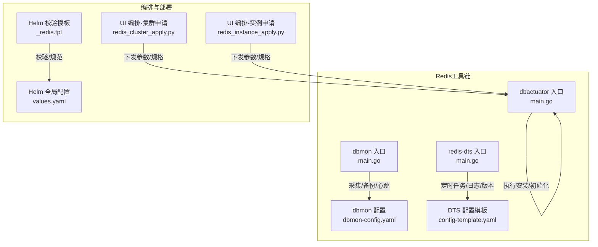
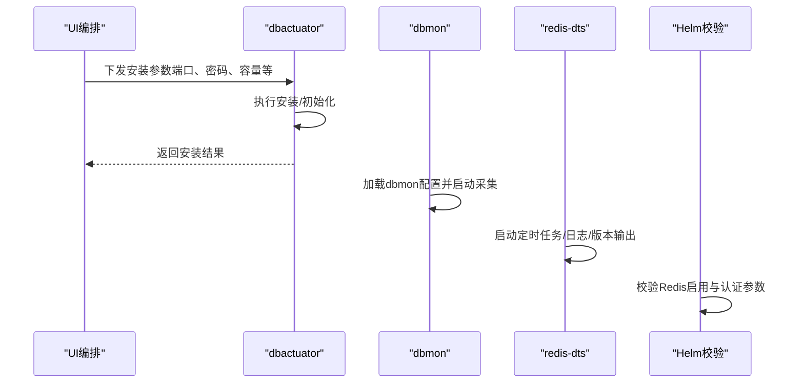
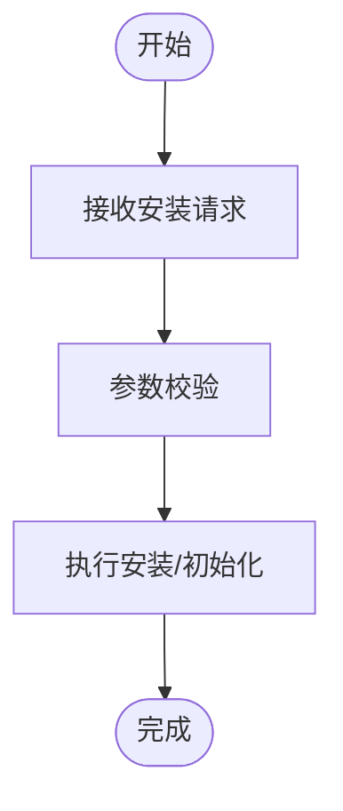
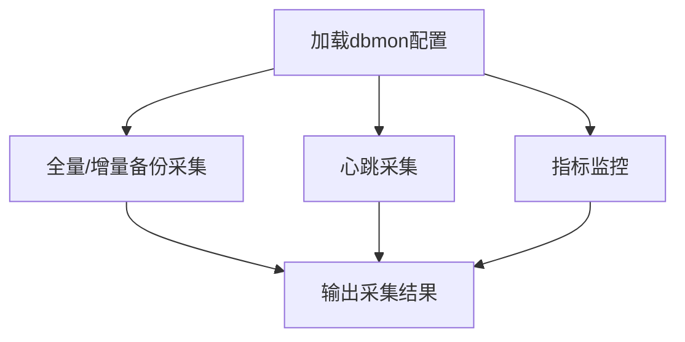
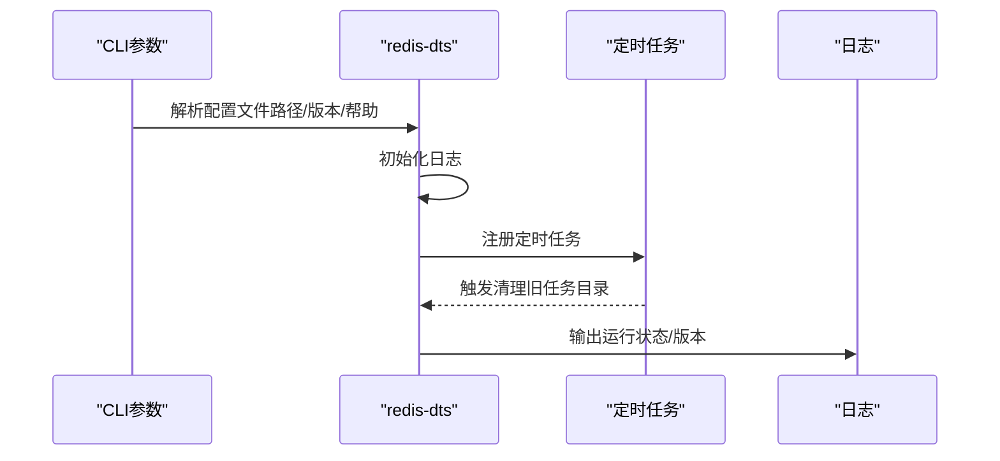
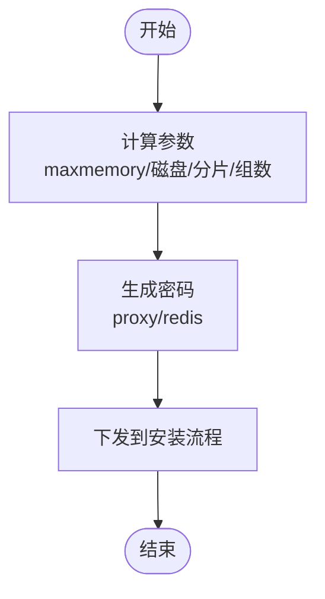
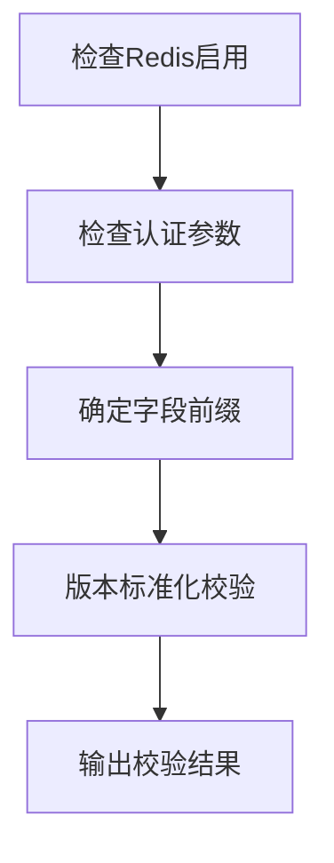
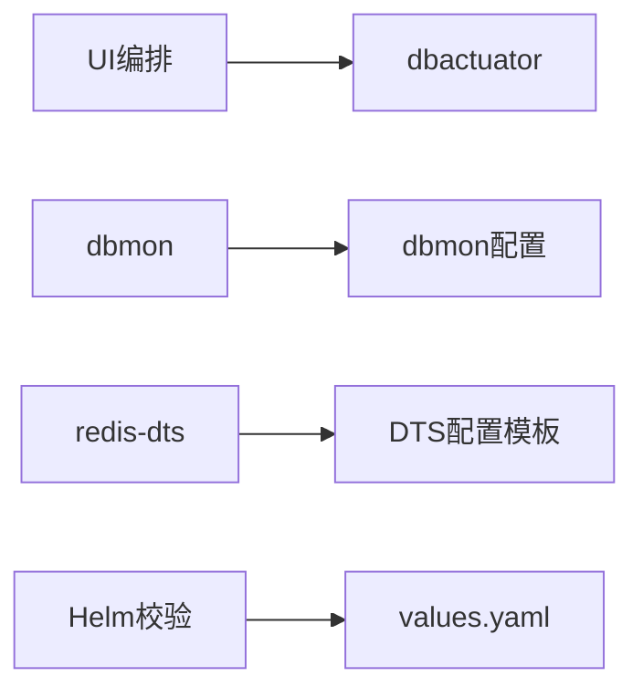

# Redis安装与配置

<cite>
**本文引用的文件**
- [dbactuator/main.go](file://dbm-services/redis/db-tools/dbactuator/main.go)
- [dbmon/main.go](file://dbm-services/redis/db-tools/dbmon/main.go)
- [redis-dts/main.go](file://dbm-services/redis/redis-dts/main.go)
- [dbmon-config.yaml](file://dbm-services/redis/db-tools/dbmon/dbmon-config.yaml)
- [config-template.yaml](file://dbm-services/redis/redis-dts/build/config-template.yaml)
- [redis_cluster_apply.py](file://dbm-ui/backend/ticket/builders/redis/redis_cluster_apply.py)
- [redis_instance_apply.py](file://dbm-ui/backend/ticket/builders/redis/redis_instance_apply.py)
- [_redis.tpl](file://helm-charts/bk-dbm/charts/grafana/charts/common/templates/validations/_redis.tpl)
- [values.yaml](file://helm-charts/bk-dbm/values.yaml)
</cite>

## 目录
1. [简介](#简介)
2. [项目结构](#项目结构)
3. [核心组件](#核心组件)
4. [架构总览](#架构总览)
5. [详细组件分析](#详细组件分析)
6. [依赖关系分析](#依赖关系分析)
7. [性能考虑](#性能考虑)
8. [故障排查指南](#故障排查指南)
9. [结论](#结论)
10. [附录](#附录)

## 简介
本文件面向Redis安装与配置场景，结合仓库中现有的Redis相关工具与UI编排能力，系统阐述安装流程、配置要点、部署模式（单机、主从、哨兵、集群）以及常见问题排查方法。内容覆盖软件包获取、解压、配置文件生成与初始化、参数调优、多部署形态最佳实践，以及通过自动化编排实现的安装与运维路径。

## 项目结构
围绕Redis的相关模块主要分布在以下位置：
- dbactuator：Redis安装与执行入口（命令入口）
- dbmon：监控采集与备份配置（监控项、备份项、心跳等）
- redis-dts：数据传输服务（定时任务、日志、版本信息）
- UI编排：Redis集群/实例申请流程，负责参数计算与资源规格下发
- Helm校验模板：Kubernetes环境下的Redis校验与参数规范
- values.yaml：Helm全局配置（含Redis启用开关与认证）

**图表来源**
- [dbactuator/main.go:1-13](file://dbm-services/redis/db-tools/dbactuator/main.go#L1-L13)
- [dbmon/main.go:1-15](file://dbm-services/redis/db-tools/dbmon/main.go#L1-L15)
- [redis-dts/main.go:1-111](file://dbm-services/redis/redis-dts/main.go#L1-L111)
- [dbmon-config.yaml](file://dbm-services/redis/db-tools/dbmon/dbmon-config.yaml)
- [config-template.yaml:1-50](file://dbm-services/redis/redis-dts/build/config-template.yaml#L1-L50)
- [redis_cluster_apply.py:182-305](file://dbm-ui/backend/ticket/builders/redis/redis_cluster_apply.py#L182-L305)
- [redis_instance_apply.py:147-174](file://dbm-ui/backend/ticket/builders/redis/redis_instance_apply.py#L147-L174)
- [_redis.tpl:22-76](file://helm-charts/bk-dbm/charts/grafana/charts/common/templates/validations/_redis.tpl#L22-L76)
- [values.yaml:672-680](file://helm-charts/bk-dbm/values.yaml#L672-L680)

**章节来源**
- [dbactuator/main.go:1-13](file://dbm-services/redis/db-tools/dbactuator/main.go#L1-L13)
- [dbmon/main.go:1-15](file://dbm-services/redis/db-tools/dbmon/main.go#L1-L15)
- [redis-dts/main.go:1-111](file://dbm-services/redis/redis-dts/main.go#L1-L111)
- [dbmon-config.yaml](file://dbm-services/redis/db-tools/dbmon/dbmon-config.yaml)
- [config-template.yaml:1-50](file://dbm-services/redis/redis-dts/build/config-template.yaml#L1-L50)
- [redis_cluster_apply.py:182-305](file://dbm-ui/backend/ticket/builders/redis/redis_cluster_apply.py#L182-L305)
- [redis_instance_apply.py:147-174](file://dbm-ui/backend/ticket/builders/redis/redis_instance_apply.py#L147-L174)
- [_redis.tpl:22-76](file://helm-charts/bk-dbm/charts/grafana/charts/common/templates/validations/_redis.tpl#L22-L76)
- [values.yaml:672-680](file://helm-charts/bk-dbm/values.yaml#L672-L680)

## 核心组件
- 安装执行器（dbactuator）：作为Redis安装与初始化的命令入口，负责接收并执行安装指令。
- 监控采集器（dbmon）：提供备份、心跳、监控等采集项配置，支撑运维可观测性。
- 数据传输服务（redis-dts）：提供定时任务、日志记录、版本信息输出等能力。
- UI编排（集群/实例申请）：根据业务需求自动计算参数（如maxmemory、磁盘上限、分片数、组数），并下发到安装流程。
- Helm校验与配置：在Kubernetes环境中对Redis启用、认证等进行校验与规范。

**章节来源**
- [dbactuator/main.go:1-13](file://dbm-services/redis/db-tools/dbactuator/main.go#L1-L13)
- [dbmon/main.go:1-15](file://dbm-services/redis/db-tools/dbmon/main.go#L1-L15)
- [redis-dts/main.go:1-111](file://dbm-services/redis/redis-dts/main.go#L1-L111)
- [dbmon-config.yaml](file://dbm-services/redis/db-tools/dbmon/dbmon-config.yaml)
- [config-template.yaml:1-50](file://dbm-services/redis/redis-dts/build/config-template.yaml#L1-L50)
- [redis_cluster_apply.py:278-303](file://dbm-ui/backend/ticket/builders/redis/redis_cluster_apply.py#L278-L303)
- [redis_instance_apply.py:160-176](file://dbm-ui/backend/ticket/builders/redis/redis_instance_apply.py#L160-L176)
- [_redis.tpl:22-76](file://helm-charts/bk-dbm/charts/grafana/charts/common/templates/validations/_redis.tpl#L22-L76)
- [values.yaml:672-680](file://helm-charts/bk-dbm/values.yaml#L672-L680)

## 架构总览
下图展示Redis安装与配置在系统中的关键交互：UI编排生成参数，dbactuator执行安装，dbmon提供监控与备份，redis-dts提供后台任务与日志，Helm模板进行环境校验与参数注入。

**图表来源**
- [redis_cluster_apply.py:182-305](file://dbm-ui/backend/ticket/builders/redis/redis_cluster_apply.py#L182-L305)
- [redis_instance_apply.py:147-174](file://dbm-ui/backend/ticket/builders/redis/redis_instance_apply.py#L147-L174)
- [dbactuator/main.go:1-13](file://dbm-services/redis/db-tools/dbactuator/main.go#L1-L13)
- [dbmon/main.go:1-15](file://dbm-services/redis/db-tools/dbmon/main.go#L1-L15)
- [redis-dts/main.go:1-111](file://dbm-services/redis/redis-dts/main.go#L1-L111)
- [_redis.tpl:22-76](file://helm-charts/bk-dbm/charts/grafana/charts/common/templates/validations/_redis.tpl#L22-L76)

## 详细组件分析

### 组件A：安装执行器（dbactuator）
- 角色定位：Redis安装与初始化的命令入口，负责接收安装请求并执行安装流程。
- 关键行为：作为可执行程序入口，承载安装脚本与初始化逻辑。
- 与UI编排的关系：UI侧计算出参数后，通过dbactuator执行落地。

**图表来源**
- [dbactuator/main.go:1-13](file://dbm-services/redis/db-tools/dbactuator/main.go#L1-L13)

**章节来源**
- [dbactuator/main.go:1-13](file://dbm-services/redis/db-tools/dbactuator/main.go#L1-L13)

### 组件B：监控采集器（dbmon）
- 角色定位：提供备份、心跳、监控等采集项配置，支撑运维可观测性。
- 配置要点：包含全量备份、二进制日志备份、心跳、监控等项；可按角色区分采集对象。

**图表来源**
- [dbmon-config.yaml](file://dbm-services/redis/db-tools/dbmon/dbmon-config.yaml)

**章节来源**
- [dbmon/main.go:1-15](file://dbm-services/redis/db-tools/dbmon/main.go#L1-L15)
- [dbmon-config.yaml](file://dbm-services/redis/db-tools/dbmon/dbmon-config.yaml)

### 组件C：数据传输服务（redis-dts）
- 角色定位：提供定时任务、日志记录、版本信息输出等能力。
- 关键行为：解析配置文件、初始化日志、注册定时任务（如清理旧任务目录）、启动后台工作线程。

**图表来源**
- [redis-dts/main.go:23-99](file://dbm-services/redis/redis-dts/main.go#L23-L99)
- [config-template.yaml:1-50](file://dbm-services/redis/redis-dts/build/config-template.yaml#L1-L50)

**章节来源**
- [redis-dts/main.go:1-111](file://dbm-services/redis/redis-dts/main.go#L1-L111)
- [config-template.yaml:1-50](file://dbm-services/redis/redis-dts/build/config-template.yaml#L1-L50)

### 组件D：UI编排（集群/实例申请）
- 角色定位：根据业务需求自动计算参数（如maxmemory、磁盘上限、分片数、组数），并下发到安装流程。
- 关键行为：
  - 集群申请：生成随机密码（proxy、redis），支持手动部署时从cap_key解析容量与分片信息。
  - 实例申请：按主机与实例分布计算端口、maxmemory等参数。

**图表来源**
- [redis_cluster_apply.py:182-305](file://dbm-ui/backend/ticket/builders/redis/redis_cluster_apply.py#L182-L305)
- [redis_instance_apply.py:147-174](file://dbm-ui/backend/ticket/builders/redis/redis_instance_apply.py#L147-L174)

**章节来源**
- [redis_cluster_apply.py:182-305](file://dbm-ui/backend/ticket/builders/redis/redis_cluster_apply.py#L182-L305)
- [redis_instance_apply.py:147-174](file://dbm-ui/backend/ticket/builders/redis/redis_instance_apply.py#L147-L174)

### 组件E：Helm校验与配置
- 角色定位：在Kubernetes环境中对Redis启用、认证等进行校验与规范。
- 关键行为：校验是否启用Redis、是否需要密码、字段路径前缀、版本标准化等。

**图表来源**
- [_redis.tpl:22-76](file://helm-charts/bk-dbm/charts/grafana/charts/common/templates/validations/_redis.tpl#L22-L76)
- [values.yaml:672-680](file://helm-charts/bk-dbm/values.yaml#L672-L680)

**章节来源**
- [_redis.tpl:22-76](file://helm-charts/bk-dbm/charts/grafana/charts/common/templates/validations/_redis.tpl#L22-L76)
- [values.yaml:672-680](file://helm-charts/bk-dbm/values.yaml#L672-L680)

## 依赖关系分析
- UI编排依赖dbactuator执行安装；
- dbmon依赖dbmon配置文件提供采集项；
- redis-dts依赖配置模板与日志初始化；
- Helm校验模板依赖values.yaml中的Redis配置项。

**图表来源**
- [redis_cluster_apply.py:182-305](file://dbm-ui/backend/ticket/builders/redis/redis_cluster_apply.py#L182-L305)
- [redis_instance_apply.py:147-174](file://dbm-ui/backend/ticket/builders/redis/redis_instance_apply.py#L147-L174)
- [dbactuator/main.go:1-13](file://dbm-services/redis/db-tools/dbactuator/main.go#L1-L13)
- [dbmon/main.go:1-15](file://dbm-services/redis/db-tools/dbmon/main.go#L1-L15)
- [dbmon-config.yaml](file://dbm-services/redis/db-tools/dbmon/dbmon-config.yaml)
- [redis-dts/main.go:1-111](file://dbm-services/redis/redis-dts/main.go#L1-L111)
- [config-template.yaml:1-50](file://dbm-services/redis/redis-dts/build/config-template.yaml#L1-L50)
- [_redis.tpl:22-76](file://helm-charts/bk-dbm/charts/grafana/charts/common/templates/validations/_redis.tpl#L22-L76)
- [values.yaml:672-680](file://helm-charts/bk-dbm/values.yaml#L672-L680)

**章节来源**
- [redis_cluster_apply.py:182-305](file://dbm-ui/backend/ticket/builders/redis/redis_cluster_apply.py#L182-L305)
- [redis_instance_apply.py:147-174](file://dbm-ui/backend/ticket/builders/redis/redis_instance_apply.py#L147-L174)
- [dbactuator/main.go:1-13](file://dbm-services/redis/db-tools/dbactuator/main.go#L1-L13)
- [dbmon/main.go:1-15](file://dbm-services/redis/db-tools/dbmon/main.go#L1-L15)
- [dbmon-config.yaml](file://dbm-services/redis/db-tools/dbmon/dbmon-config.yaml)
- [redis-dts/main.go:1-111](file://dbm-services/redis/redis-dts/main.go#L1-L111)
- [config-template.yaml:1-50](file://dbm-services/redis/redis-dts/build/config-template.yaml#L1-L50)
- [_redis.tpl:22-76](file://helm-charts/bk-dbm/charts/grafana/charts/common/templates/validations/_redis.tpl#L22-L76)
- [values.yaml:672-680](file://helm-charts/bk-dbm/values.yaml#L672-L680)

## 性能考虑
- 内存与容量规划：UI编排会基于主机内存/磁盘与分片/组数计算maxmemory与max_disk，建议结合业务峰值QPS与数据增长趋势预留冗余。
- 并发与线程：redis-dts配置模板包含导入并发、线程数等参数，可根据磁盘吞吐与CPU核数调整，避免IO瓶颈或CPU过载。
- 备份与日志：dbmon配置包含全量/增量备份与心跳，建议开启并合理设置周期，确保故障恢复与容量评估有据可依。

[本节为通用指导，无需列出章节来源]

## 故障排查指南
- 安装失败
  - 检查dbactuator入口是否正确执行，确认安装参数（端口、密码、容量）已下发。
  - 参考UI编排参数计算逻辑，核对maxmemory/max_disk与资源规格是否匹配。
- 监控异常
  - 检查dbmon配置文件项是否齐全，确认采集项与角色一致。
  - 关注dbmon日志输出，定位采集失败原因。
- DTS任务异常
  - 检查redis-dts配置文件是否存在且可读，确认定时任务是否注册成功。
  - 查看日志输出与版本信息，判断运行环境是否满足要求。
- Kubernetes环境校验失败
  - 检查values.yaml中Redis启用与认证配置，确保字段前缀与版本标准化符合模板要求。
  - 使用Helm校验模板提示修复缺失项。

**章节来源**
- [dbactuator/main.go:1-13](file://dbm-services/redis/db-tools/dbactuator/main.go#L1-L13)
- [dbmon/main.go:1-15](file://dbm-services/redis/db-tools/dbmon/main.go#L1-L15)
- [dbmon-config.yaml](file://dbm-services/redis/db-tools/dbmon/dbmon-config.yaml)
- [redis-dts/main.go:1-111](file://dbm-services/redis/redis-dts/main.go#L1-L111)
- [_redis.tpl:22-76](file://helm-charts/bk-dbm/charts/grafana/charts/common/templates/validations/_redis.tpl#L22-L76)
- [values.yaml:672-680](file://helm-charts/bk-dbm/values.yaml#L672-L680)

## 结论
通过UI编排、dbactuator安装执行、dbmon监控采集、redis-dts后台任务以及Helm校验模板的协同，可以形成一套完整的Redis安装与配置闭环。建议在部署前明确业务容量与可靠性需求，结合UI编排参数与配置模板进行精细化调优，并在生产环境严格执行校验与巡检流程。

[本节为总结性内容，无需列出章节来源]

## 附录

### A. 安装流程概览（步骤说明）
- 准备阶段：确认软件包来源与版本，准备安装参数（端口、密码、容量、分片/组数）。
- 执行安装：通过dbactuator入口执行安装与初始化。
- 配置生成：依据UI编排参数生成配置文件（如dbmon配置、DTS配置）。
- 启动服务：启动dbmon与redis-dts，验证采集与任务运行状态。
- 环境校验：在Kubernetes环境下使用Helm校验模板与values.yaml进行参数校验。

**章节来源**
- [redis_cluster_apply.py:182-305](file://dbm-ui/backend/ticket/builders/redis/redis_cluster_apply.py#L182-L305)
- [redis_instance_apply.py:147-174](file://dbm-ui/backend/ticket/builders/redis/redis_instance_apply.py#L147-L174)
- [dbactuator/main.go:1-13](file://dbm-services/redis/db-tools/dbactuator/main.go#L1-L13)
- [dbmon/main.go:1-15](file://dbm-services/redis/db-tools/dbmon/main.go#L1-L15)
- [redis-dts/main.go:1-111](file://dbm-services/redis/redis-dts/main.go#L1-L111)
- [_redis.tpl:22-76](file://helm-charts/bk-dbm/charts/grafana/charts/common/templates/validations/_redis.tpl#L22-L76)
- [values.yaml:672-680](file://helm-charts/bk-dbm/values.yaml#L672-L680)

### B. 配置文件关键项说明（基于现有配置）
- dbmon配置
  - 包含全量备份、二进制日志备份、心跳、监控等采集项，可按角色区分采集对象。
- redis-dts配置模板
  - 包含导出超时、导入并发、线程数、内存占用等参数，用于控制任务性能与稳定性。

**章节来源**
- [dbmon-config.yaml](file://dbm-services/redis/db-tools/dbmon/dbmon-config.yaml)
- [config-template.yaml:1-50](file://dbm-services/redis/redis-dts/build/config-template.yaml#L1-L50)

### C. 部署模式与最佳实践
- 单机（Standalone）
  - 适用于开发测试或小规模场景；注意maxmemory与磁盘上限设置，避免OOM与磁盘打满。
- 主从（Master-Slave）
  - 建议开启持久化与复制，合理设置复制带宽与延迟阈值，定期校验一致性。
- 哨兵（Sentinel）
  - 配置多个哨兵节点，确保故障切换可靠；监控健康状态与切换事件。
- 集群（Cluster）
  - 基于UI编排计算分片与组数，合理分配maxmemory与max_disk；关注槽位迁移与节点扩缩容。

**章节来源**
- [redis_cluster_apply.py:278-303](file://dbm-ui/backend/ticket/builders/redis/redis_cluster_apply.py#L278-L303)
- [redis_instance_apply.py:160-176](file://dbm-ui/backend/ticket/builders/redis/redis_instance_apply.py#L160-L176)