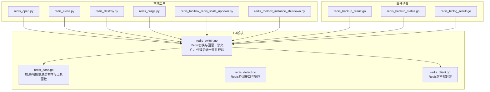
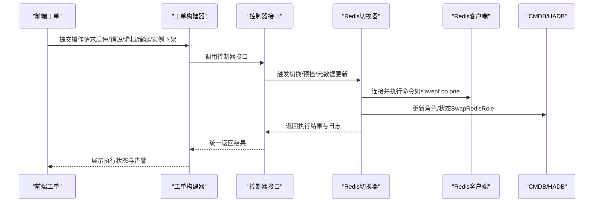
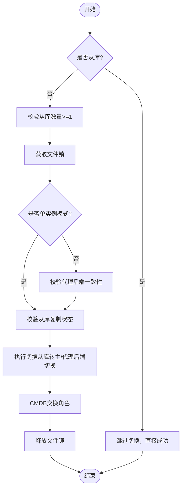
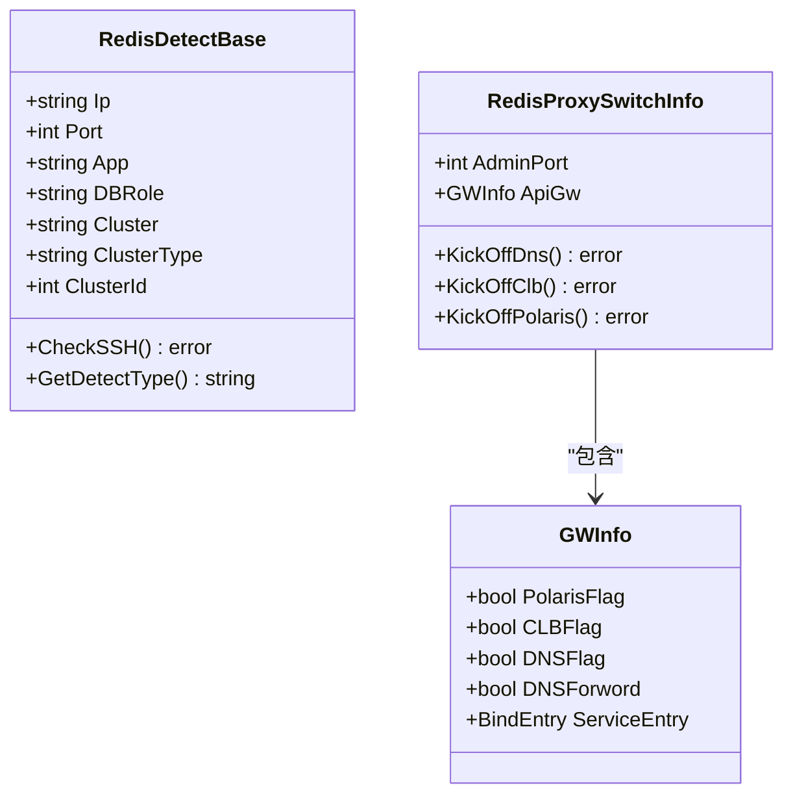
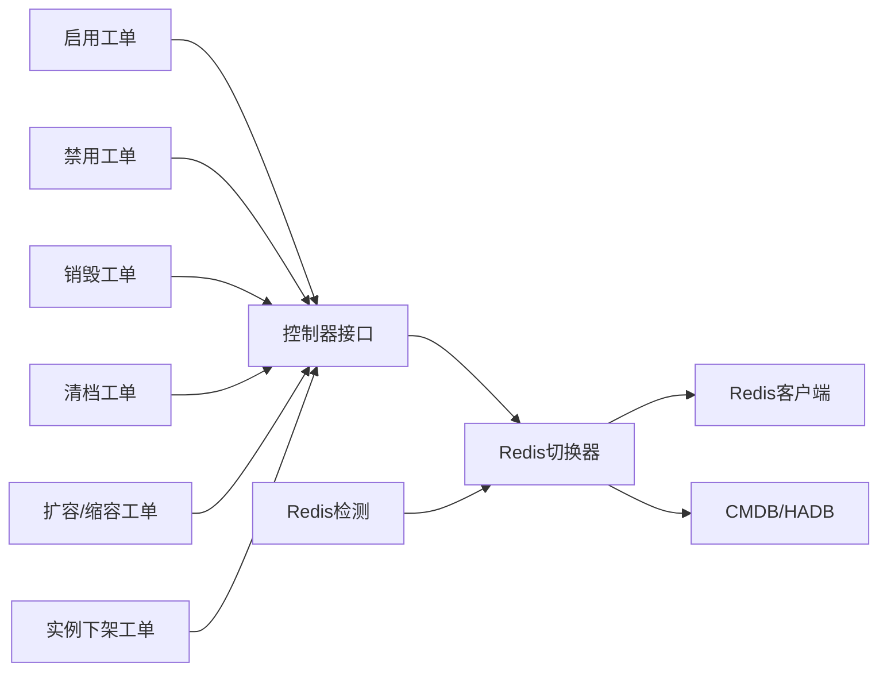

# Redis操作控制

<cite>
**本文引用的文件**   
- [redis_base.go](file://dbm-services/common/dbha/ha-module/dbmodule/redis/redis_base.go)
- [redis_switch.go](file://dbm-services/common/dbha/ha-module/dbmodule/redis/redis_switch.go)
- [redis_detect.go](file://dbm-services/common/dbha/ha-module/dbmodule/redis/redis_detect.go)
- [redis.go](file://dbm-services/common/dbha/ha-module/dbmodule/redis/redis.go)
- [redis_client.go](file://dbm-services/common/dbha/ha-module/client/redis_client.go)
- [redis_backup_result.go](file://dbm-services/common/db-event-consumer/pkg/model/redis_backup_result.go)
- [redis_backup_status.go](file://dbm-services/common/db-event-consumer/pkg/model/redis_backup_status.go)
- [redis_binlog_result.go](file://dbm-services/common/db-event-consumer/pkg/model/redis_binlog_result.go)
- [redis_open.py](file://dbm-ui/backend/ticket/builders/redis/redis_open.py)
- [redis_close.py](file://dbm-ui/backend/ticket/builders/redis/redis_close.py)
- [redis_destroy.py](file://dbm-ui/backend/ticket/builders/redis/redis_destroy.py)
- [redis_toolbox_redis_scale_updown.py](file://dbm-ui/backend/ticket/builders/redis/redis_toolbox_redis_scale_updown.py)
- [redis_purge.py](file://dbm-ui/backend/ticket/builders/redis/redis_purge.py)
- [redis_toolbox_instance_shutdown.py](file://dbm-ui/backend/ticket/builders/redis/redis_toolbox_instance_shutdown.py)
</cite>

## 目录
1. [简介](#简介)
2. [项目结构](#项目结构)
3. [核心组件](#核心组件)
4. [架构总览](#架构总览)
5. [详细组件分析](#详细组件分析)
6. [依赖关系分析](#依赖关系分析)
7. [性能考量](#性能考量)
8. [故障排查指南](#故障排查指南)
9. [结论](#结论)
10. [附录](#附录)

## 简介
本文件面向Redis操作控制能力，系统化梳理Redis实例的启动、停止、重启与状态检查等基础操作，覆盖集群与单实例两类场景，并结合HA模块的切换、检测与元数据更新能力，给出在不同操作模式下的执行流程、注意事项、环境检查、状态验证与异常处理机制。同时提供操作失败的诊断方法与恢复策略，帮助运维人员在生产环境中安全、可控地完成Redis操作。

## 项目结构
围绕Redis操作控制的相关代码主要分布在以下位置：
- HA模块：Redis检测、切换、元信息更新与网关解绑等逻辑
- 事件消费：Redis备份结果、备份状态、Binlog结果模型
- 前端工单构建器：Redis集群启停、销毁、清档、缩容/扩容、实例下架等流程定义



**图表来源**
- [redis_base.go:1-372](file://dbm-services/common/dbha/ha-module/dbmodule/redis/redis_base.go#L1-L372)
- [redis_switch.go:1-643](file://dbm-services/common/dbha/ha-module/dbmodule/redis/redis_switch.go#L1-L643)
- [redis_detect.go](file://dbm-services/common/dbha/ha-module/dbmodule/redis/redis_detect.go)
- [redis_client.go](file://dbm-services/common/dbha/ha-module/client/redis_client.go)
- [redis_backup_result.go:26-210](file://dbm-services/common/db-event-consumer/pkg/model/redis_backup_result.go#L26-L210)
- [redis_backup_status.go](file://dbm-services/common/db-event-consumer/pkg/model/redis_backup_status.go)
- [redis_binlog_result.go](file://dbm-services/common/db-event-consumer/pkg/model/redis_binlog_result.go)
- [redis_open.py:25-73](file://dbm-ui/backend/ticket/builders/redis/redis_open.py#L25-L73)
- [redis_close.py:25-73](file://dbm-ui/backend/ticket/builders/redis/redis_close.py#L25-L73)
- [redis_destroy.py:25-69](file://dbm-ui/backend/ticket/builders/redis/redis_destroy.py#L25-L69)
- [redis_purge.py:29-57](file://dbm-ui/backend/ticket/builders/redis/redis_purge.py#L29-L57)
- [redis_toolbox_redis_scale_updown.py:106-129](file://dbm-ui/backend/ticket/builders/redis/redis_toolbox_redis_scale_updown.py#L106-L129)
- [redis_toolbox_instance_shutdown.py:26-55](file://dbm-ui/backend/ticket/builders/redis/redis_toolbox_instance_shutdown.py#L26-L55)

**章节来源**
- [redis_base.go:1-372](file://dbm-services/common/dbha/ha-module/dbmodule/redis/redis_base.go#L1-L372)
- [redis_switch.go:1-643](file://dbm-services/common/dbha/ha-module/dbmodule/redis/redis_switch.go#L1-L643)
- [redis_detect.go](file://dbm-services/common/dbha/ha-module/dbmodule/redis/redis_detect.go)
- [redis_client.go](file://dbm-services/common/dbha/ha-module/client/redis_client.go)
- [redis_backup_result.go:26-210](file://dbm-services/common/db-event-consumer/pkg/model/redis_backup_result.go#L26-L210)
- [redis_backup_status.go](file://dbm-services/common/db-event-consumer/pkg/model/redis_backup_status.go)
- [redis_binlog_result.go](file://dbm-services/common/db-event-consumer/pkg/model/redis_binlog_result.go)
- [redis_open.py:25-73](file://dbm-ui/backend/ticket/builders/redis/redis_open.py#L25-L73)
- [redis_close.py:25-73](file://dbm-ui/backend/ticket/builders/redis/redis_close.py#L25-L73)
- [redis_destroy.py:25-69](file://dbm-ui/backend/ticket/builders/redis/redis_destroy.py#L25-L69)
- [redis_purge.py:29-57](file://dbm-ui/backend/ticket/builders/redis/redis_purge.py#L29-L57)
- [redis_toolbox_redis_scale_updown.py:106-129](file://dbm-ui/backend/ticket/builders/redis/redis_toolbox_redis_scale_updown.py#L106-L129)
- [redis_toolbox_instance_shutdown.py:26-55](file://dbm-ui/backend/ticket/builders/redis/redis_toolbox_instance_shutdown.py#L26-L55)

## 核心组件
- Redis检测与信息结构体：提供检测基类、代理信息、密码与超时配置、SSH连通性检查等能力，支撑后续切换与状态验证。
- Redis切换器：负责预检（从属数量、锁文件、代理后端一致性、同步状态）、执行切换（主从角色反转）、元数据交换（CMDB角色互换）、回滚与清理。
- Redis客户端：封装连接、认证、命令执行与资源释放，供切换器调用。
- 工单构建器（UI侧）：定义Redis集群启停、销毁、清档、缩容/扩容、实例下架等流程，统一通过控制器接口触发后端执行。

**章节来源**
- [redis_base.go:18-121](file://dbm-services/common/dbha/ha-module/dbmodule/redis/redis_base.go#L18-L121)
- [redis_switch.go:27-133](file://dbm-services/common/dbha/ha-module/dbmodule/redis/redis_switch.go#L27-L133)
- [redis_client.go](file://dbm-services/common/dbha/ha-module/client/redis_client.go)
- [redis_open.py:25-73](file://dbm-ui/backend/ticket/builders/redis/redis_open.py#L25-L73)
- [redis_close.py:25-73](file://dbm-ui/backend/ticket/builders/redis/redis_close.py#L25-L73)
- [redis_destroy.py:25-69](file://dbm-ui/backend/ticket/builders/redis/redis_destroy.py#L25-L69)
- [redis_purge.py:29-57](file://dbm-ui/backend/ticket/builders/redis/redis_purge.py#L29-L57)
- [redis_toolbox_redis_scale_updown.py:106-129](file://dbm-ui/backend/ticket/builders/redis/redis_toolbox_redis_scale_updown.py#L106-L129)
- [redis_toolbox_instance_shutdown.py:26-55](file://dbm-ui/backend/ticket/builders/redis/redis_toolbox_instance_shutdown.py#L26-L55)

## 架构总览
Redis操作控制由“前端工单”驱动，“后端HA模块”执行，贯穿“检测—预检—切换—元数据更新—状态验证—异常处理”的闭环。



**图表来源**
- [redis_switch.go:90-181](file://dbm-services/common/dbha/ha-module/dbmodule/redis/redis_switch.go#L90-L181)
- [redis_client.go](file://dbm-services/common/dbha/ha-module/client/redis_client.go)
- [redis_open.py:31-46](file://dbm-ui/backend/ticket/builders/redis/redis_open.py#L31-L46)
- [redis_close.py:31-46](file://dbm-ui/backend/ticket/builders/redis/redis_close.py#L31-L46)
- [redis_destroy.py:31-43](file://dbm-ui/backend/ticket/builders/redis/redis_destroy.py#L31-L43)
- [redis_purge.py:30-49](file://dbm-ui/backend/ticket/builders/redis/redis_purge.py#L30-L49)
- [redis_toolbox_redis_scale_updown.py:106-129](file://dbm-ui/backend/ticket/builders/redis/redis_toolbox_redis_scale_updown.py#L106-L129)
- [redis_toolbox_instance_shutdown.py:42-46](file://dbm-ui/backend/ticket/builders/redis/redis_toolbox_instance_shutdown.py#L42-L46)

## 详细组件分析

### Redis切换器（主从切换与元数据更新）
- 预检流程
  - 判断实例是否从库，若是则跳过切换。
  - 校验从库数量≥1，否则失败。
  - 文件锁（按集群+IP生成锁文件），避免并发冲突。
  - 若非单实例模式，校验代理后端一致性（Twemproxy），不一致则剔除异常代理。
  - 校验从库复制状态（角色、主地址、心跳延迟等），确保可安全切主。
- 执行切换
  - 通过客户端向目标实例发送“从库转主”命令。
  - 若为代理模式，逐个代理执行后端切换指令。
- 元数据更新
  - 在CMDB中交换主从角色，确保元数据与实际一致。
- 回滚与清理
  - 失败时释放文件锁；必要时支持回滚（当前实现为空，需结合业务补充）。



**图表来源**
- [redis_switch.go:39-133](file://dbm-services/common/dbha/ha-module/dbmodule/redis/redis_switch.go#L39-L133)
- [redis_switch.go:149-181](file://dbm-services/common/dbha/ha-module/dbmodule/redis/redis_switch.go#L149-L181)

**章节来源**
- [redis_switch.go:39-133](file://dbm-services/common/dbha/ha-module/dbmodule/redis/redis_switch.go#L39-L133)
- [redis_switch.go:149-181](file://dbm-services/common/dbha/ha-module/dbmodule/redis/redis_switch.go#L149-L181)

### Redis检测与信息结构体
- 检测基类与响应：封装IP、端口、应用、角色、集群类型、超时、SSH信息等。
- SSH连通性检查：通过远端脚本触达指定路径，验证节点可达性。
- 代理信息：DNS/Polaris/CLB绑定入口，用于切换时的网关解绑。
- 从CMDB解析实例信息：按集群类型筛选并构造检测对象。



**图表来源**
- [redis_base.go:18-70](file://dbm-services/common/dbha/ha-module/dbmodule/redis/redis_base.go#L18-L70)
- [redis_base.go:72-152](file://dbm-services/common/dbha/ha-module/dbmodule/redis/redis_base.go#L72-L152)

**章节来源**
- [redis_base.go:18-70](file://dbm-services/common/dbha/ha-module/dbmodule/redis/redis_base.go#L18-L70)
- [redis_base.go:72-152](file://dbm-services/common/dbha/ha-module/dbmodule/redis/redis_base.go#L72-L152)

### Redis客户端封装
- 初始化连接：设置地址、密码、超时、数据库索引。
- 命令执行：封装常用命令（如info、get等），并保证连接释放。
- 错误处理：对网络异常、认证失败、命令执行失败进行分类处理。

**章节来源**
- [redis_client.go](file://dbm-services/common/dbha/ha-module/client/redis_client.go)

### 前端工单与操作模式
- 启用/禁用集群：通过控制器接口触发集群级启停，支持强制参数。
- 实例启停：针对单实例场景，支持强制参数。
- 销毁/下架：销毁集群或实例，通常伴随资源回收与暂停节点。
- 清档：对集群执行清档操作，支持规则化配置。
- 缩容/扩容：针对特定集群类型（如Tendis+）计算关停主机并更新节点。
- 实例下架：批量关停实例，配合回收流程。

```mermaid
sequenceDiagram
participant UI as "前端"
participant Open as "启用工单"
participant Close as "禁用工单"
participant Destroy as "销毁工单"
participant Purge as "清档工单"
participant Scale as "扩容/缩容工单"
participant Shutdown as "实例下架工单"
UI->>Open : 提交启用请求
Open->>Open : 设置controller=redis_cluster_open_close_scene
UI->>Close : 提交禁用请求
Close->>Close : 设置controller=redis_cluster_open_close_scene
UI->>Destroy : 提交销毁请求
Destroy->>Destroy : 设置controller=redis_cluster_shutdown
UI->>Purge : 提交清档请求
Purge->>Purge : 设置controller=redis_cluster_open_close_scene
UI->>Scale : 提交容量变更请求
Scale->>Scale : 计算关停主机并更新节点
UI->>Shutdown : 提交实例下架请求
Shutdown->>Shutdown : 设置controller=redis_cluster_instance_shutdown
```

**图表来源**
- [redis_open.py:31-46](file://dbm-ui/backend/ticket/builders/redis/redis_open.py#L31-L46)
- [redis_close.py:31-46](file://dbm-ui/backend/ticket/builders/redis/redis_close.py#L31-L46)
- [redis_destroy.py:31-43](file://dbm-ui/backend/ticket/builders/redis/redis_destroy.py#L31-L43)
- [redis_purge.py:30-49](file://dbm-ui/backend/ticket/builders/redis/redis_purge.py#L30-L49)
- [redis_toolbox_redis_scale_updown.py:113-129](file://dbm-ui/backend/ticket/builders/redis/redis_toolbox_redis_scale_updown.py#L113-L129)
- [redis_toolbox_instance_shutdown.py:42-46](file://dbm-ui/backend/ticket/builders/redis/redis_toolbox_instance_shutdown.py#L42-L46)

**章节来源**
- [redis_open.py:25-73](file://dbm-ui/backend/ticket/builders/redis/redis_open.py#L25-L73)
- [redis_close.py:25-73](file://dbm-ui/backend/ticket/builders/redis/redis_close.py#L25-L73)
- [redis_destroy.py:25-69](file://dbm-ui/backend/ticket/builders/redis/redis_destroy.py#L25-L69)
- [redis_purge.py:29-57](file://dbm-ui/backend/ticket/builders/redis/redis_purge.py#L29-L57)
- [redis_toolbox_redis_scale_updown.py:106-129](file://dbm-ui/backend/ticket/builders/redis/redis_toolbox_redis_scale_updown.py#L106-L129)
- [redis_toolbox_instance_shutdown.py:26-55](file://dbm-ui/backend/ticket/builders/redis/redis_toolbox_instance_shutdown.py#L26-L55)

### 事件消费与备份/Binlog模型
- 备份结果模型：记录备份任务的实例角色、类型、备份目录与文件等字段，支持迁移与入库。
- 备份状态模型：用于追踪备份状态。
- Binlog结果模型：记录Binlog相关结果。

这些模型为操作后的状态验证与审计提供数据基础。

**章节来源**
- [redis_backup_result.go:26-210](file://dbm-services/common/db-event-consumer/pkg/model/redis_backup_result.go#L26-L210)
- [redis_backup_status.go](file://dbm-services/common/db-event-consumer/pkg/model/redis_backup_status.go)
- [redis_binlog_result.go](file://dbm-services/common/db-event-consumer/pkg/model/redis_binlog_result.go)

## 依赖关系分析
- 切换器依赖Redis客户端进行命令执行，依赖CMDB/HADB进行元数据更新。
- 工单构建器通过控制器接口与后端交互，形成前后端解耦。
- 检测模块为切换器提供前置保障，确保切换的安全性与一致性。



**图表来源**
- [redis_switch.go:90-181](file://dbm-services/common/dbha/ha-module/dbmodule/redis/redis_switch.go#L90-L181)
- [redis_client.go](file://dbm-services/common/dbha/ha-module/client/redis_client.go)
- [redis_open.py:31-46](file://dbm-ui/backend/ticket/builders/redis/redis_open.py#L31-L46)
- [redis_close.py:31-46](file://dbm-ui/backend/ticket/builders/redis/redis_close.py#L31-L46)
- [redis_destroy.py:31-43](file://dbm-ui/backend/ticket/builders/redis/redis_destroy.py#L31-L43)
- [redis_purge.py:30-49](file://dbm-ui/backend/ticket/builders/redis/redis_purge.py#L30-L49)
- [redis_toolbox_redis_scale_updown.py:113-129](file://dbm-ui/backend/ticket/builders/redis/redis_toolbox_redis_scale_updown.py#L113-L129)
- [redis_toolbox_instance_shutdown.py:42-46](file://dbm-ui/backend/ticket/builders/redis/redis_toolbox_instance_shutdown.py#L42-L46)

**章节来源**
- [redis_switch.go:90-181](file://dbm-services/common/dbha/ha-module/dbmodule/redis/redis_switch.go#L90-L181)
- [redis_client.go](file://dbm-services/common/dbha/ha-module/client/redis_client.go)
- [redis_open.py:31-46](file://dbm-ui/backend/ticket/builders/redis/redis_open.py#L31-L46)
- [redis_close.py:31-46](file://dbm-ui/backend/ticket/builders/redis/redis_close.py#L31-L46)
- [redis_destroy.py:31-43](file://dbm-ui/backend/ticket/builders/redis/redis_destroy.py#L31-L43)
- [redis_purge.py:30-49](file://dbm-ui/backend/ticket/builders/redis/redis_purge.py#L30-L49)
- [redis_toolbox_redis_scale_updown.py:113-129](file://dbm-ui/backend/ticket/builders/redis/redis_toolbox_redis_scale_updown.py#L113-L129)
- [redis_toolbox_instance_shutdown.py:42-46](file://dbm-ui/backend/ticket/builders/redis/redis_toolbox_instance_shutdown.py#L42-L46)

## 性能考量
- 并发控制：通过文件锁避免同一集群内多实例并发切换导致的状态不一致。
- 代理一致性：在代理模式下，先校验各代理后端一致性再执行切换，减少失败重试成本。
- 复制状态检查：严格校验主从复制状态与心跳延迟，避免在数据不同步时切换造成数据丢失。
- 超时与重试：对代理切换过程设置读写超时与有限次重试，平衡稳定性与性能。

[本节为通用指导，无需列出具体文件来源]

## 故障排查指南
- 切换失败
  - 检查从库数量是否满足≥1；若不足，补齐从库后再试。
  - 查看文件锁是否被占用，释放后重试。
  - 代理模式下检查各代理后端MD5一致性，剔除不一致代理。
  - 复制状态检查失败时，确认主从连接、认证与心跳延迟是否正常。
- 元数据不一致
  - 在CMDB/HADB中核对角色与状态，必要时手动修正。
- 网关解绑异常
  - 检查DNS/Polaris/CLB绑定入口状态，确认解绑流程是否成功。
- 事件消费与审计
  - 通过备份结果/状态与Binlog结果模型核对操作后状态，定位异常环节。

**章节来源**
- [redis_switch.go:39-133](file://dbm-services/common/dbha/ha-module/dbmodule/redis/redis_switch.go#L39-L133)
- [redis_switch.go:149-181](file://dbm-services/common/dbha/ha-module/dbmodule/redis/redis_switch.go#L149-L181)
- [redis_backup_result.go:26-210](file://dbm-services/common/db-event-consumer/pkg/model/redis_backup_result.go#L26-L210)
- [redis_backup_status.go](file://dbm-services/common/db-event-consumer/pkg/model/redis_backup_status.go)
- [redis_binlog_result.go](file://dbm-services/common/db-event-consumer/pkg/model/redis_binlog_result.go)

## 结论
Redis操作控制体系以“检测—预检—切换—元数据更新—状态验证—异常处理”为主线，结合前端工单与后端HA模块，实现了对Redis集群与单实例的启停、销毁、清档、缩容/扩容与实例下架等全生命周期操作。通过严格的前置检查、并发控制与网关解绑策略，确保操作在生产环境中的安全性与可靠性。建议在生产操作前完善回滚策略与自动化验证流程，持续优化监控与告警阈值，提升整体可观测性与可恢复性。

[本节为总结性内容，无需列出具体文件来源]

## 附录
- 操作模式与注意事项
  - 启用/禁用：适用于集群级启停，支持强制参数；注意代理后端一致性与DNS/Polaris/CLB解绑。
  - 销毁/下架：适用于集群或实例下架，需配合资源回收与暂停节点流程。
  - 清档：适用于集群清档，需按规则配置备份与清理策略。
  - 缩容/扩容：针对特定集群类型，需提前计算关停主机并更新节点。
  - 实例下架：批量关停实例，配合回收流程，确保无残留服务。

**章节来源**
- [redis_open.py:25-73](file://dbm-ui/backend/ticket/builders/redis/redis_open.py#L25-L73)
- [redis_close.py:25-73](file://dbm-ui/backend/ticket/builders/redis/redis_close.py#L25-L73)
- [redis_destroy.py:25-69](file://dbm-ui/backend/ticket/builders/redis/redis_destroy.py#L25-L69)
- [redis_purge.py:29-57](file://dbm-ui/backend/ticket/builders/redis/redis_purge.py#L29-L57)
- [redis_toolbox_redis_scale_updown.py:106-129](file://dbm-ui/backend/ticket/builders/redis/redis_toolbox_redis_scale_updown.py#L106-L129)
- [redis_toolbox_instance_shutdown.py:26-55](file://dbm-ui/backend/ticket/builders/redis/redis_toolbox_instance_shutdown.py#L26-L55)