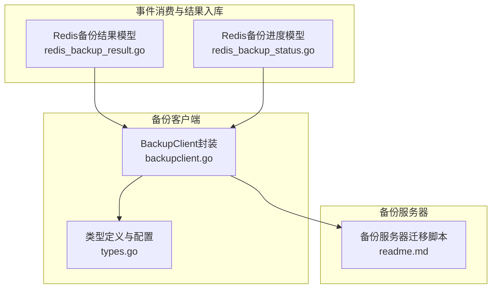
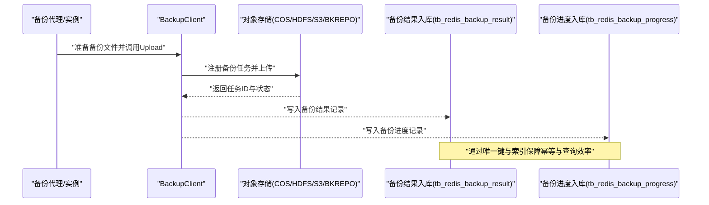
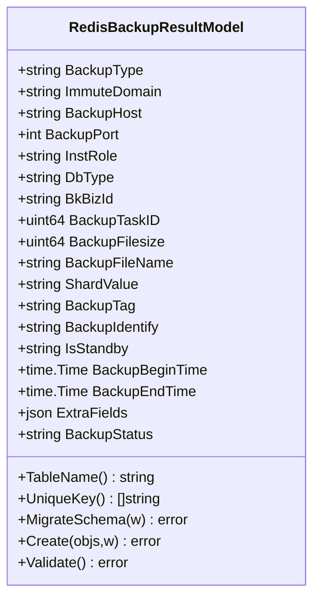
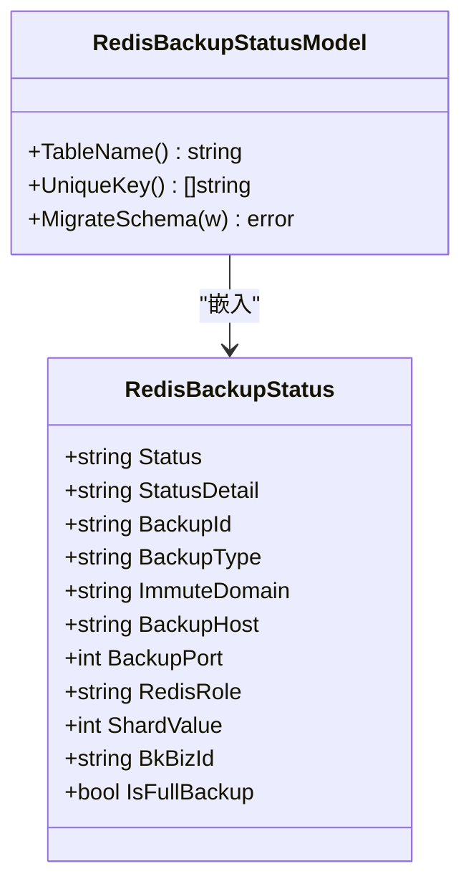
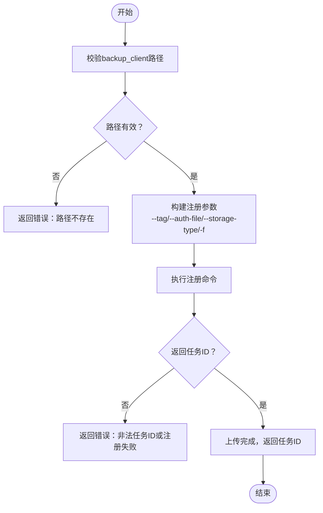
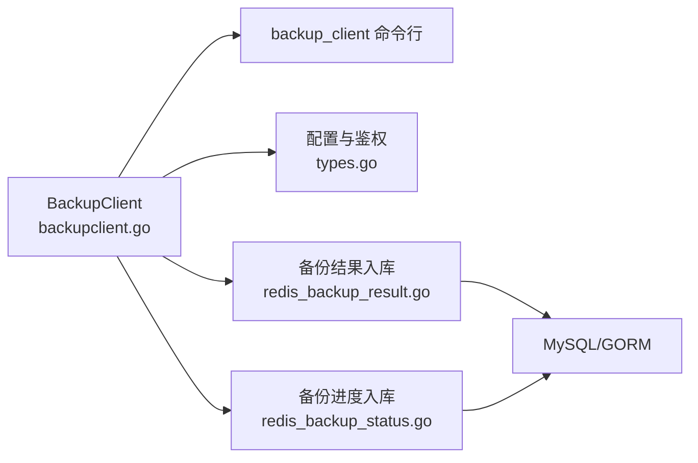

# Redis数据备份

<cite>
**本文引用的文件**
- [redis_backup_result.go](file://dbm-services/common/db-event-consumer/pkg/model/redis_backup_result.go)
- [redis_backup_status.go](file://dbm-services/common/db-event-consumer/pkg/model/redis_backup_status.go)
- [backupclient.go](file://dbm-services/common/go-pubpkg/backupclient/backupclient.go)
- [types.go](file://dbm-services/common/go-pubpkg/backupclient/types.go)
- [readme.md](file://dbm-services/common/dbm-backup-server/readme.md)
</cite>

## 目录
1. [简介](#简介)
2. [项目结构](#项目结构)
3. [核心组件](#核心组件)
4. [架构总览](#架构总览)
5. [详细组件分析](#详细组件分析)
6. [依赖关系分析](#依赖关系分析)
7. [性能考量](#性能考量)
8. [故障排查指南](#故障排查指南)
9. [结论](#结论)
10. [附录](#附录)

## 简介
本文件面向Redis数据备份与恢复场景，基于仓库中的事件消费模型、备份客户端与备份服务器迁移脚本，系统化梳理备份与恢复的完整流程、备份文件格式与存储位置、版本管理策略、恢复步骤与一致性校验方法，并给出备份策略制定、存储优化与灾难恢复的最佳实践建议。内容严格依据仓库现有实现进行归纳总结。

## 项目结构
围绕Redis备份的关键模块主要分布在以下路径：
- 事件消费与结果入库：common/db-event-consumer/pkg/model
- 备份客户端封装：common/go-pubpkg/backupclient
- 备份服务器迁移：common/dbm-backup-server/readme.md

图表来源
- [redis_backup_result.go:1-232](file://dbm-services/common/db-event-consumer/pkg/model/redis_backup_result.go#L1-L232)
- [redis_backup_status.go:1-85](file://dbm-services/common/db-event-consumer/pkg/model/redis_backup_status.go#L1-L85)
- [backupclient.go:1-150](file://dbm-services/common/go-pubpkg/backupclient/backupclient.go#L1-L150)
- [types.go:1-41](file://dbm-services/common/go-pubpkg/backupclient/types.go#L1-L41)
- [readme.md:1-23](file://dbm-services/common/dbm-backup-server/readme.md#L1-L23)

章节来源
- [redis_backup_result.go:1-232](file://dbm-services/common/db-event-consumer/pkg/model/redis_backup_result.go#L1-L232)
- [redis_backup_status.go:1-85](file://dbm-services/common/db-event-consumer/pkg/model/redis_backup_status.go#L1-L85)
- [backupclient.go:1-150](file://dbm-services/common/go-pubpkg/backupclient/backupclient.go#L1-L150)
- [types.go:1-41](file://dbm-services/common/go-pubpkg/backupclient/types.go#L1-L41)
- [readme.md:1-23](file://dbm-services/common/dbm-backup-server/readme.md#L1-L23)

## 核心组件
- Redis备份结果模型（tb_redis_backup_result）：用于持久化备份任务元数据、文件名、大小、时间戳、状态等，支持唯一键约束与索引优化。
- Redis备份进度模型（tb_redis_backup_progress）：用于记录备份任务状态、主机、端口、分片值、业务ID等，便于监控与查询。
- 备份客户端（BackupClient）：封装backup_client命令行工具，负责注册备份任务、查询上传状态、支持cos/hdfs/s3/bkrepo等存储类型。
- 类型与配置（CosAuth/AppAttr/CosInfo等）：定义认证与应用属性，支撑备份客户端的鉴权与配置。
- 备份服务器迁移：提供备份服务器数据库迁移的mysqldump导入导出参考脚本。

章节来源
- [redis_backup_result.go:45-113](file://dbm-services/common/db-event-consumer/pkg/model/redis_backup_result.go#L45-L113)
- [redis_backup_status.go:38-84](file://dbm-services/common/db-event-consumer/pkg/model/redis_backup_status.go#L38-L84)
- [backupclient.go:21-83](file://dbm-services/common/go-pubpkg/backupclient/backupclient.go#L21-L83)
- [types.go:3-41](file://dbm-services/common/go-pubpkg/backupclient/types.go#L3-L41)
- [readme.md:1-23](file://dbm-services/common/dbm-backup-server/readme.md#L1-L23)

## 架构总览
Redis备份与恢复的整体流程由“备份采集—上传—入库—查询—恢复—校验”构成，关键节点如下：

图表来源
- [backupclient.go:105-149](file://dbm-services/common/go-pubpkg/backupclient/backupclient.go#L105-L149)
- [redis_backup_result.go:115-203](file://dbm-services/common/db-event-consumer/pkg/model/redis_backup_result.go#L115-L203)
- [redis_backup_status.go:51-84](file://dbm-services/common/db-event-consumer/pkg/model/redis_backup_status.go#L51-L84)

## 详细组件分析

### 组件A：Redis备份结果模型（tb_redis_backup_result）
- 数据结构要点
  - 关键字段：集群域名、主机IP、端口、角色、实例类型、业务ID、备份任务ID、备份文件名、文件大小、分片值、标签、识别号、起止时间、额外字段、状态等。
  - 唯一键：backup_host、backup_port、backup_identify，避免重复入库。
  - 索引：uk_hostport、idx_clustertime、idx_backupid，提升查询与去重效率。
- 存储与迁移
  - 支持MySQL/GORM自动迁移，自定义索引创建与更新。
  - 写入时对时间字段做UTC转换，确保跨时区一致性。
- 验证与错误处理
  - 提供结构体校验入口，便于在入库前进行字段合法性检查。

图表来源
- [redis_backup_result.go:45-77](file://dbm-services/common/db-event-consumer/pkg/model/redis_backup_result.go#L45-L77)
- [redis_backup_result.go:79-113](file://dbm-services/common/db-event-consumer/pkg/model/redis_backup_result.go#L79-L113)
- [redis_backup_result.go:115-203](file://dbm-services/common/db-event-consumer/pkg/model/redis_backup_result.go#L115-L203)
- [redis_backup_result.go:205-209](file://dbm-services/common/db-event-consumer/pkg/model/redis_backup_result.go#L205-L209)

章节来源
- [redis_backup_result.go:45-209](file://dbm-services/common/db-event-consumer/pkg/model/redis_backup_result.go#L45-L209)

### 组件B：Redis备份进度模型（tb_redis_backup_progress）
- 数据结构要点
  - 字段：状态、状态详情、备份任务ID、备份类型、集群域名、主机、端口、角色、分片值、业务ID、是否全备标记。
  - 索引：按集群与状态、状态、主机、创建时间建立索引，便于实时监控与筛选。
- 迁移与写入
  - 支持MySQL/GORM自动迁移与索引维护。
  - 以事件UUID作为唯一键，避免重复写入。

图表来源
- [redis_backup_status.go:19-36](file://dbm-services/common/db-event-consumer/pkg/model/redis_backup_status.go#L19-L36)
- [redis_backup_status.go:38-41](file://dbm-services/common/db-event-consumer/pkg/model/redis_backup_status.go#L38-L41)
- [redis_backup_status.go:51-84](file://dbm-services/common/db-event-consumer/pkg/model/redis_backup_status.go#L51-L84)

章节来源
- [redis_backup_status.go:19-84](file://dbm-services/common/db-event-consumer/pkg/model/redis_backup_status.go#L19-L84)

### 组件C：备份客户端（BackupClient）
- 功能与职责
  - 封装backup_client命令行工具，支持注册备份任务、查询上传状态。
  - 支持存储类型：cos、hdfs、s3、bkrepo；文件标签：REDIS_BINLOG、INCREMENT_BACKUP、REDIS_FULL等。
  - 参数校验：路径绝对性、认证文件存在性、存储类型白名单。
- 关键流程
  - Upload：将本地备份文件注册为任务，返回任务ID。
  - QueryStatus：查询任务状态与消息，解析JSON响应。
- 错误处理
  - 对命令执行失败、JSON解析失败、非法任务ID等情况进行包装与返回。

图表来源
- [backupclient.go:51-83](file://dbm-services/common/go-pubpkg/backupclient/backupclient.go#L51-L83)
- [backupclient.go:85-108](file://dbm-services/common/go-pubpkg/backupclient/backupclient.go#L85-L108)

章节来源
- [backupclient.go:21-149](file://dbm-services/common/go-pubpkg/backupclient/backupclient.go#L21-L149)

### 组件D：类型与配置（CosAuth/AppAttr/CosInfo）
- CosAuth：对象存储服务端、区域、密钥、桶名等。
- AppAttr：业务ID、云区域ID等应用属性。
- CosInfo：组合上述两类信息，配合BackupClient进行鉴权与配置。
- BaseLimit/UploadConfig：块大小、并发限制等上传参数。

章节来源
- [types.go:3-41](file://dbm-services/common/go-pubpkg/backupclient/types.go#L3-L41)

### 组件E：备份服务器迁移（mysqldump导入导出）
- 提供从旧备份服务器数据库导出与新库导入的参考脚本，便于多环境数据迁移。

章节来源
- [readme.md:1-23](file://dbm-services/common/dbm-backup-server/readme.md#L1-L23)

## 依赖关系分析
- BackupClient依赖命令行工具与配置文件，向上游提供统一的上传与查询接口。
- 事件消费模块通过模型将备份结果与进度写入数据库，形成闭环。
- 存储类型与文件标签在BackupClient中集中校验，避免上游传参错误。

图表来源
- [backupclient.go:1-150](file://dbm-services/common/go-pubpkg/backupclient/backupclient.go#L1-L150)
- [types.go:1-41](file://dbm-services/common/go-pubpkg/backupclient/types.go#L1-L41)
- [redis_backup_result.go:1-232](file://dbm-services/common/db-event-consumer/pkg/model/redis_backup_result.go#L1-L232)
- [redis_backup_status.go:1-85](file://dbm-services/common/db-event-consumer/pkg/model/redis_backup_status.go#L1-L85)

## 性能考量
- 并发与限速
  - 通过BaseLimit中的块大小与本地并发限制控制上传速率，避免占用过多带宽与IO。
- 索引与查询
  - tb_redis_backup_result与tb_redis_backup_progress建立复合索引，加速按集群、状态、主机、时间等维度的查询。
- 时间字段
  - 统一使用UTC时间，减少跨时区查询与展示的复杂度。
- 任务幂等
  - 通过唯一键约束避免重复入库，降低写放大风险。

## 故障排查指南
- 上传失败
  - 检查backup_client路径与权限、认证文件是否存在、存储类型是否在白名单内。
  - 查看QueryStatus返回的状态码与消息，定位具体错误原因。
- 任务ID异常
  - 确认返回的任务ID格式符合预期（HDFS/COS格式），若非法需重新注册。
- 入库异常
  - 校验RedisBackupResultModel.Validate()与唯一键冲突；检查索引创建是否成功。
  - 若为MySQL写入，确认Replace/Insert语句构造正确且字段映射无误。
- 监控与追踪
  - 通过tb_redis_backup_progress按状态与集群维度检索任务状态，结合事件时间戳定位问题。

章节来源
- [backupclient.go:51-83](file://dbm-services/common/go-pubpkg/backupclient/backupclient.go#L51-L83)
- [backupclient.go:126-149](file://dbm-services/common/go-pubpkg/backupclient/backupclient.go#L126-L149)
- [redis_backup_result.go:115-203](file://dbm-services/common/db-event-consumer/pkg/model/redis_backup_result.go#L115-L203)
- [redis_backup_status.go:51-84](file://dbm-services/common/db-event-consumer/pkg/model/redis_backup_status.go#L51-L84)

## 结论
本方案通过事件模型沉淀备份结果与进度，借助BackupClient对接多种存储后端，形成可扩展、可观测、可审计的Redis备份体系。结合索引与唯一键约束，可有效保障数据一致性与查询性能。建议在生产环境中配套完善的备份策略、存储优化与灾备演练，持续提升可靠性与恢复效率。

## 附录

### 备份策略制定与最佳实践
- 策略维度
  - 全量备份：周期性生成全量快照，作为恢复基线。
  - 增量备份：结合Redis AOF/快照策略，按需补充增量数据。
  - 版本管理：以备份识别号与时间戳作为版本标识，保留多代备份。
- 存储优化
  - 合理设置上传块大小与并发，避免网络拥塞。
  - 分层存储：热数据优先落盘，冷数据归档至低频存储。
- 灾难恢复
  - 定期演练恢复流程，验证备份文件可用性与完整性。
  - 建立跨地域容灾，确保主备站点独立性与数据同步。

### 备份文件格式、存储位置与版本管理
- 文件命名与标签
  - 文件标签包含REDIS_FULL、INCREMENT_BACKUP等，便于分类与检索。
  - 命名中包含业务ID、实例类型、角色、主机、端口、时间戳等信息，便于定位与版本区分。
- 存储位置
  - 通过BackupClient的--storage-type与--auth-file指定存储后端与认证信息。
- 版本管理
  - 以backup_identify与backup_taskid作为版本标识，结合分片值与时间窗口进行版本演进。

### 数据恢复步骤与一致性校验
- 恢复步骤
  - 选择目标版本（按backup_identify与时间窗口）。
  - 下载对应备份文件至恢复节点，执行还原操作。
  - 启动实例并验证服务可用性。
- 一致性校验
  - 对比关键键值数量与哈希校验（如适用）。
  - 校验备份时间窗口内的变更是否完整。
  - 通过tb_redis_backup_result与tb_redis_backup_progress核对任务状态与时间线。