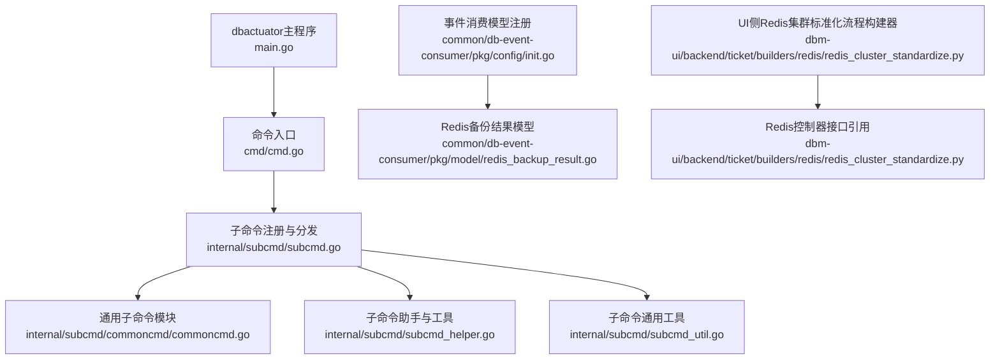
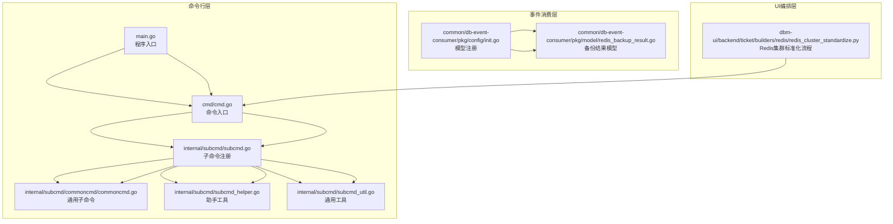
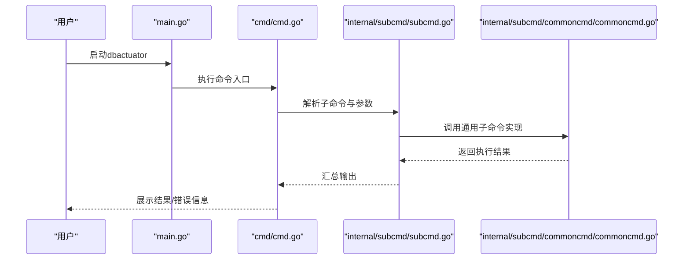
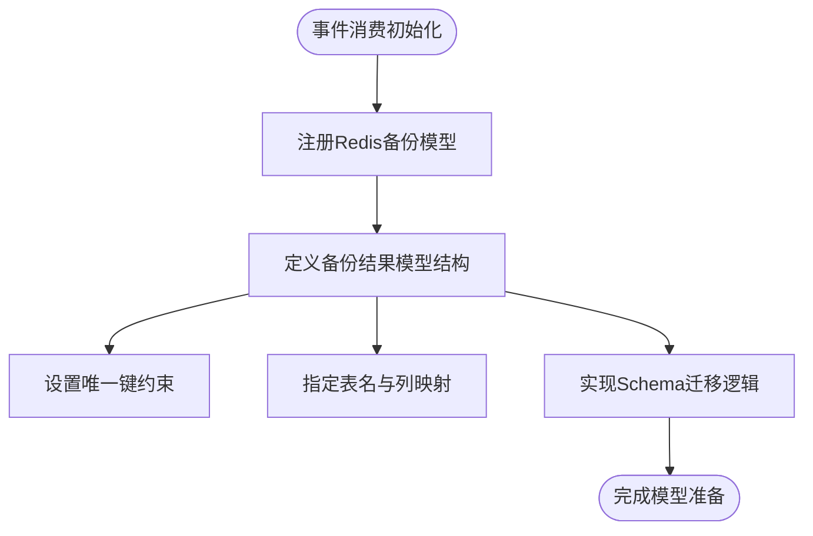
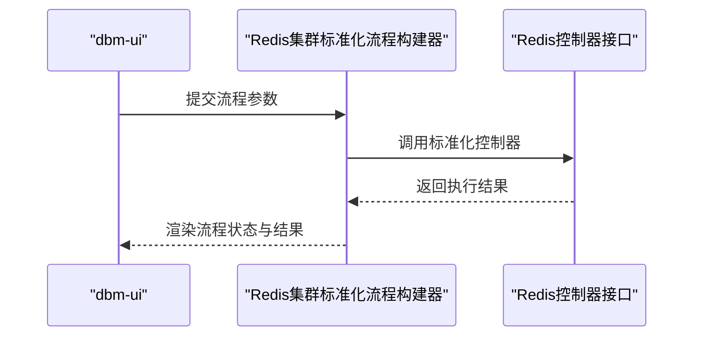
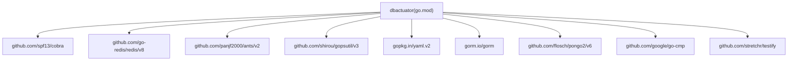

# Redis数据库工具

<cite>
**本文引用的文件**
- [main.go](file://dbm-services/redis/db-tools/dbactuator/main.go)
- [go.mod](file://dbm-services/redis/db-tools/dbactuator/go.mod)
- [cmd.go](file://dbm-services/bigdata/db-tools/dbactuator/cmd/cmd.go)
- [subcmd.go](file://dbm-services/bigdata/db-tools/dbactuator/internal/subcmd/subcmd.go)
- [subcmd_helper.go](file://dbm-services/bigdata/db-tools/dbactuator/internal/subcmd/subcmd_helper.go)
- [subcmd_util.go](file://dbm-services/bigdata/db-tools/dbactuator/internal/subcmd/subcmd_util.go)
- [commoncmd.go](file://dbm-services/bigdata/db-tools/dbactuator/internal/subcmd/commoncmd/commoncmd.go)
- [redis_backup_result.go](file://dbm-services/common/db-event-consumer/pkg/model/redis_backup_result.go)
- [init.go](file://dbm-services/common/db-event-consumer/pkg/config/init.go)
- [redis_cluster_standardize.py](file://dbm-ui/backend/ticket/builders/redis/redis_cluster_standardize.py)
</cite>

## 目录
1. [简介](#简介)
2. [项目结构](#项目结构)
3. [核心组件](#核心组件)
4. [架构总览](#架构总览)
5. [详细组件分析](#详细组件分析)
6. [依赖关系分析](#依赖关系分析)
7. [性能考虑](#性能考虑)
8. [故障排查指南](#故障排查指南)
9. [结论](#结论)
10. [附录](#附录)

## 简介
本文件面向Redis数据库运维与自动化场景，系统性梳理Redis dbactuator专用能力与周边生态，覆盖Redis实例安装、配置、启动停止、数据迁移、故障转移等核心操作；详解Redis特有配置参数、集群模式支持、持久化配置与性能调优选项；提供命令使用示例、配置文件格式与参数说明；解释作业管理、运行时环境与错误处理机制；并给出Redis集群部署、数据备份恢复与监控告警的实际应用与最佳实践。

## 项目结构
Redis dbactuator位于dbm-services/redis/db-tools/dbactuator，采用Go语言实现，通过Cobra框架组织命令行子命令体系，并与dbm-ui及事件消费服务协同完成Redis运维编排与监控告警闭环。

**图表来源**
- [main.go:1-13](file://dbm-services/redis/db-tools/dbactuator/main.go#L1-L13)
- [cmd.go](file://dbm-services/bigdata/db-tools/dbactuator/cmd/cmd.go)
- [subcmd.go](file://dbm-services/bigdata/db-tools/dbactuator/internal/subcmd/subcmd.go)
- [commoncmd.go](file://dbm-services/bigdata/db-tools/dbactuator/internal/subcmd/commoncmd/commoncmd.go)
- [subcmd_helper.go](file://dbm-services/bigdata/db-tools/dbactuator/internal/subcmd/subcmd_helper.go)
- [subcmd_util.go](file://dbm-services/bigdata/db-tools/dbactuator/internal/subcmd/subcmd_util.go)
- [init.go:38-40](file://dbm-services/common/db-event-consumer/pkg/config/init.go#L38-L40)
- [redis_backup_result.go:44-84](file://dbm-services/common/db-event-consumer/pkg/model/redis_backup_result.go#L44-L84)
- [redis_cluster_standardize.py:28-37](file://dbm-ui/backend/ticket/builders/redis/redis_cluster_standardize.py#L28-L37)

**章节来源**
- [main.go:1-13](file://dbm-services/redis/db-tools/dbactuator/main.go#L1-L13)
- [go.mod:1-69](file://dbm-services/redis/db-tools/dbactuator/go.mod#L1-L69)
- [cmd.go](file://dbm-services/bigdata/db-tools/dbactuator/cmd/cmd.go)
- [subcmd.go](file://dbm-services/bigdata/db-tools/dbactuator/internal/subcmd/subcmd.go)
- [commoncmd.go](file://dbm-services/bigdata/db-tools/dbactuator/internal/subcmd/commoncmd/commoncmd.go)
- [subcmd_helper.go](file://dbm-services/bigdata/db-tools/dbactuator/internal/subcmd/subcmd_helper.go)
- [subcmd_util.go](file://dbm-services/bigdata/db-tools/dbactuator/internal/subcmd/subcmd_util.go)
- [init.go:38-40](file://dbm-services/common/db-event-consumer/pkg/config/init.go#L38-L40)
- [redis_backup_result.go:44-84](file://dbm-services/common/db-event-consumer/pkg/model/redis_backup_result.go#L44-L84)
- [redis_cluster_standardize.py:28-37](file://dbm-ui/backend/ticket/builders/redis/redis_cluster_standardize.py#L28-L37)

## 核心组件
- 命令行入口与框架
  - 主程序入口：负责初始化并执行命令入口。
  - 命令入口：基于Cobra框架定义顶层命令与全局参数。
  - 子命令体系：按功能域拆分子命令，统一注册、分发与执行。
  - 通用子命令模块：提供可复用的子命令实现与参数封装。
  - 子命令助手与工具：提供参数校验、日志、并发控制等辅助能力。
- 事件消费与备份模型
  - 事件消费模型注册：向事件消费系统注册Redis相关模型。
  - 备份结果模型：定义Redis全量备份结果的数据结构与迁移逻辑。
- UI编排与流程
  - Redis集群标准化流程构建器：在dbm-ui中定义Redis集群标准化的流程与控制器调用。

**章节来源**
- [main.go:1-13](file://dbm-services/redis/db-tools/dbactuator/main.go#L1-L13)
- [cmd.go](file://dbm-services/bigdata/db-tools/dbactuator/cmd/cmd.go)
- [subcmd.go](file://dbm-services/bigdata/db-tools/dbactuator/internal/subcmd/subcmd.go)
- [commoncmd.go](file://dbm-services/bigdata/db-tools/dbactuator/internal/subcmd/commoncmd/commoncmd.go)
- [subcmd_helper.go](file://dbm-services/bigdata/db-tools/dbactuator/internal/subcmd/subcmd_helper.go)
- [subcmd_util.go](file://dbm-services/bigdata/db-tools/dbactuator/internal/subcmd/subcmd_util.go)
- [init.go:38-40](file://dbm-services/common/db-event-consumer/pkg/config/init.go#L38-L40)
- [redis_backup_result.go:44-84](file://dbm-services/common/db-event-consumer/pkg/model/redis_backup_result.go#L44-L84)
- [redis_cluster_standardize.py:28-37](file://dbm-ui/backend/ticket/builders/redis/redis_cluster_standardize.py#L28-L37)

## 架构总览
dbactuator通过Cobra命令体系组织Redis运维操作，结合事件消费与UI编排，形成“命令执行—事件上报—UI编排—监控告警”的闭环。

**图表来源**
- [main.go:1-13](file://dbm-services/redis/db-tools/dbactuator/main.go#L1-L13)
- [cmd.go](file://dbm-services/bigdata/db-tools/dbactuator/cmd/cmd.go)
- [subcmd.go](file://dbm-services/bigdata/db-tools/dbactuator/internal/subcmd/subcmd.go)
- [commoncmd.go](file://dbm-services/bigdata/db-tools/dbactuator/internal/subcmd/commoncmd/commoncmd.go)
- [subcmd_helper.go](file://dbm-services/bigdata/db-tools/dbactuator/internal/subcmd/subcmd_helper.go)
- [subcmd_util.go](file://dbm-services/bigdata/db-tools/dbactuator/internal/subcmd/subcmd_util.go)
- [init.go:38-40](file://dbm-services/common/db-event-consumer/pkg/config/init.go#L38-L40)
- [redis_backup_result.go:44-84](file://dbm-services/common/db-event-consumer/pkg/model/redis_backup_result.go#L44-L84)
- [redis_cluster_standardize.py:28-37](file://dbm-ui/backend/ticket/builders/redis/redis_cluster_standardize.py#L28-L37)

## 详细组件分析

### 命令行入口与控制流
- 入口函数负责初始化并执行命令入口，确保所有子命令与参数解析在启动阶段完成。
- 命令入口基于Cobra定义顶层命令、全局参数与帮助信息，便于扩展新的运维子命令。
- 子命令注册与分发：集中式注册各功能域子命令，统一处理参数解析与执行路径。
- 通用子命令模块：封装常见Redis运维动作（如安装、配置、启动、停止、迁移、故障转移），提供参数校验与错误处理。
- 助手与工具：提供日志、并发池、文件锁、系统资源采集等通用能力，保障命令执行的稳定性与可观测性。

**图表来源**
- [main.go:10-12](file://dbm-services/redis/db-tools/dbactuator/main.go#L10-L12)
- [cmd.go](file://dbm-services/bigdata/db-tools/dbactuator/cmd/cmd.go)
- [subcmd.go](file://dbm-services/bigdata/db-tools/dbactuator/internal/subcmd/subcmd.go)
- [commoncmd.go](file://dbm-services/bigdata/db-tools/dbactuator/internal/subcmd/commoncmd/commoncmd.go)

**章节来源**
- [main.go:1-13](file://dbm-services/redis/db-tools/dbactuator/main.go#L1-L13)
- [cmd.go](file://dbm-services/bigdata/db-tools/dbactuator/cmd/cmd.go)
- [subcmd.go](file://dbm-services/bigdata/db-tools/dbactuator/internal/subcmd/subcmd.go)
- [commoncmd.go](file://dbm-services/bigdata/db-tools/dbactuator/internal/subcmd/commoncmd/commoncmd.go)
- [subcmd_helper.go](file://dbm-services/bigdata/db-tools/dbactuator/internal/subcmd/subcmd_helper.go)
- [subcmd_util.go](file://dbm-services/bigdata/db-tools/dbactuator/internal/subcmd/subcmd_util.go)

### 事件消费与备份模型
- 模型注册：事件消费系统注册Redis备份相关模型，确保备份状态与结果能够被统一采集与处理。
- 备份结果模型：定义Redis全量备份结果的数据结构、唯一键、表名与迁移逻辑，支撑备份任务的追踪与回放。

**图表来源**
- [init.go:38-40](file://dbm-services/common/db-event-consumer/pkg/config/init.go#L38-L40)
- [redis_backup_result.go:44-84](file://dbm-services/common/db-event-consumer/pkg/model/redis_backup_result.go#L44-L84)

**章节来源**
- [init.go:38-40](file://dbm-services/common/db-event-consumer/pkg/config/init.go#L38-L40)
- [redis_backup_result.go:44-84](file://dbm-services/common/db-event-consumer/pkg/model/redis_backup_result.go#L44-L84)

### UI编排与流程
- Redis集群标准化流程构建器：在dbm-ui中定义Redis集群标准化流程，绑定控制器接口，支持手动重试与集群重建等场景。
- 流程参数：包含云区域ID、集群ID列表、是否停止实例、是否重启Exporter等参数，用于驱动后端执行。

**图表来源**
- [redis_cluster_standardize.py:28-37](file://dbm-ui/backend/ticket/builders/redis/redis_cluster_standardize.py#L28-L37)

**章节来源**
- [redis_cluster_standardize.py:22-37](file://dbm-ui/backend/ticket/builders/redis/redis_cluster_standardize.py#L22-L37)

## 依赖关系分析
dbactuator依赖多个Go模块，涵盖Redis客户端、并发控制、系统资源采集、YAML解析、数据库ORM等能力，支撑Redis运维自动化与可观测性。

**图表来源**
- [go.mod:7-25](file://dbm-services/redis/db-tools/dbactuator/go.mod#L7-L25)

**章节来源**
- [go.mod:1-69](file://dbm-services/redis/db-tools/dbactuator/go.mod#L1-L69)

## 性能考虑
- 并发与资源控制
  - 使用并发池管理器统一调度任务，避免高负载下资源争用。
  - 结合系统资源采集工具监控CPU、内存、磁盘IO，动态调整任务并发度。
- I/O与持久化
  - 在高写入场景下，合理配置持久化策略（RDB/AOF），平衡数据安全与性能。
  - 对大对象与热点键进行优化，减少阻塞与碎片。
- 网络与连接
  - 控制客户端连接数与超时时间，避免网络抖动导致的任务堆积。
- 监控与告警
  - 通过事件消费与UI编排联动，建立备份、迁移、故障转移等关键节点的监控与告警。

[本节为通用指导，无需具体文件分析]

## 故障排查指南
- 命令执行失败
  - 检查命令参数合法性与权限，确认子命令注册与分发逻辑正确。
  - 查看日志与返回码，定位具体步骤与错误原因。
- 事件消费异常
  - 确认Redis备份模型已正确注册，表结构迁移无误。
  - 核对唯一键与列映射，避免重复或缺失导致的入库失败。
- UI流程卡顿
  - 检查流程参数（如是否停止实例、是否重启Exporter）与控制器调用链路。
  - 关注手动重试策略与错误恢复机制。

**章节来源**
- [subcmd_helper.go](file://dbm-services/bigdata/db-tools/dbactuator/internal/subcmd/subcmd_helper.go)
- [subcmd_util.go](file://dbm-services/bigdata/db-tools/dbactuator/internal/subcmd/subcmd_util.go)
- [init.go:38-40](file://dbm-services/common/db-event-consumer/pkg/config/init.go#L38-L40)
- [redis_backup_result.go:204-210](file://dbm-services/common/db-event-consumer/pkg/model/redis_backup_result.go#L204-L210)
- [redis_cluster_standardize.py:28-37](file://dbm-ui/backend/ticket/builders/redis/redis_cluster_standardize.py#L28-L37)

## 结论
Redis dbactuator通过清晰的命令行架构、完善的事件消费与UI编排能力，实现了Redis实例全生命周期的自动化运维。结合合理的性能调优与监控告警，可满足生产环境对高可用、高性能与高可靠性的要求。建议在实际部署中，结合业务特点细化参数配置与流程策略，并持续完善监控与演练体系。

[本节为总结性内容，无需具体文件分析]

## 附录

### 常用命令与参数说明（示例）
- 安装/配置/启动/停止
  - 通过子命令模块封装的通用子命令实现，支持参数校验与错误处理。
- 数据迁移
  - 通过子命令分发与助手工具，实现迁移任务的并发控制与进度跟踪。
- 故障转移
  - 通过UI流程构建器与控制器接口，实现集群标准化与实例重建。

**章节来源**
- [commoncmd.go](file://dbm-services/bigdata/db-tools/dbactuator/internal/subcmd/commoncmd/commoncmd.go)
- [subcmd.go](file://dbm-services/bigdata/db-tools/dbactuator/internal/subcmd/subcmd.go)
- [redis_cluster_standardize.py:28-37](file://dbm-ui/backend/ticket/builders/redis/redis_cluster_standardize.py#L28-L37)

### 配置文件格式与参数
- YAML配置
  - 使用YAML解析库加载配置文件，支持键值对与嵌套结构。
- 参数校验
  - 通过助手工具进行参数合法性校验，确保执行前的输入质量。
- 并发与资源
  - 并发池与系统资源采集工具提供性能与稳定性保障。

**章节来源**
- [go.mod:23-24](file://dbm-services/redis/db-tools/dbactuator/go.mod#L23-L24)
- [subcmd_helper.go](file://dbm-services/bigdata/db-tools/dbactuator/internal/subcmd/subcmd_helper.go)
- [subcmd_util.go](file://dbm-services/bigdata/db-tools/dbactuator/internal/subcmd/subcmd_util.go)

### Redis集群部署与运维最佳实践
- 集群部署
  - 规划节点数量与副本策略，确保高可用与容灾能力。
- 数据备份与恢复
  - 建立定期全量备份与增量备份策略，结合事件消费模型实现结果追踪。
- 监控与告警
  - 通过UI编排与事件消费联动，覆盖关键节点与异常场景。

**章节来源**
- [init.go:38-40](file://dbm-services/common/db-event-consumer/pkg/config/init.go#L38-L40)
- [redis_backup_result.go:44-84](file://dbm-services/common/db-event-consumer/pkg/model/redis_backup_result.go#L44-L84)
- [redis_cluster_standardize.py:28-37](file://dbm-ui/backend/ticket/builders/redis/redis_cluster_standardize.py#L28-L37)