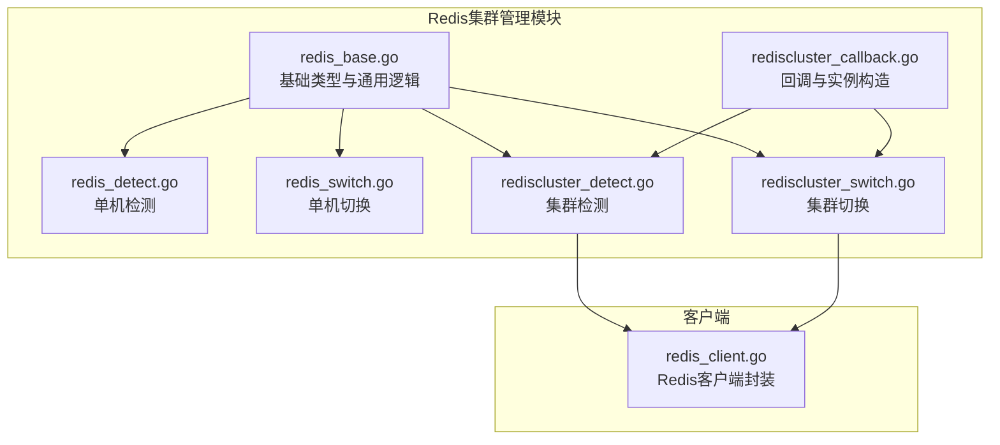
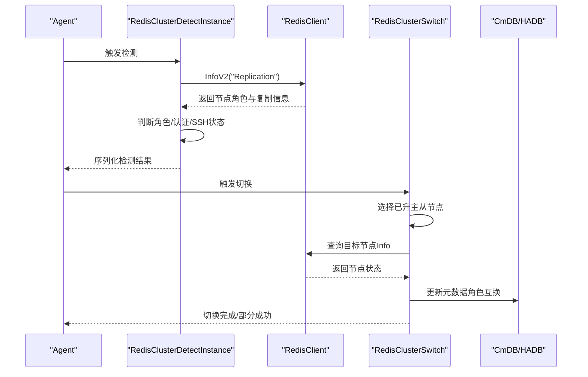
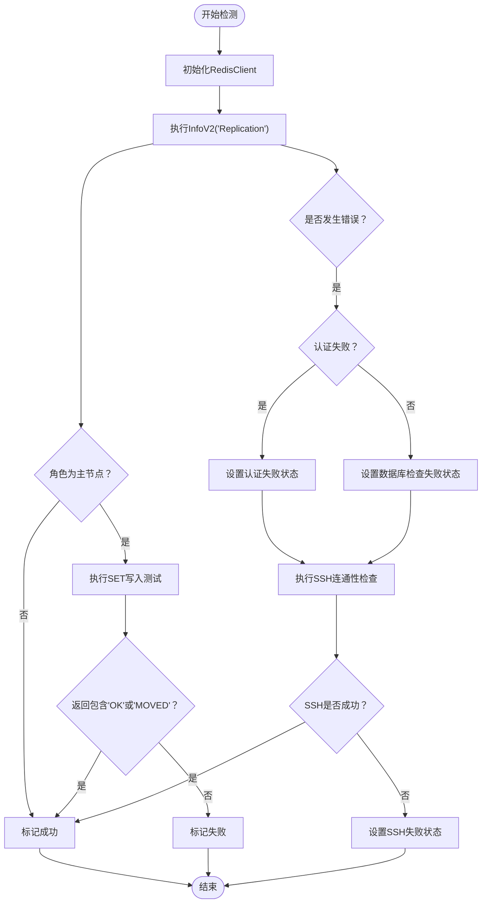
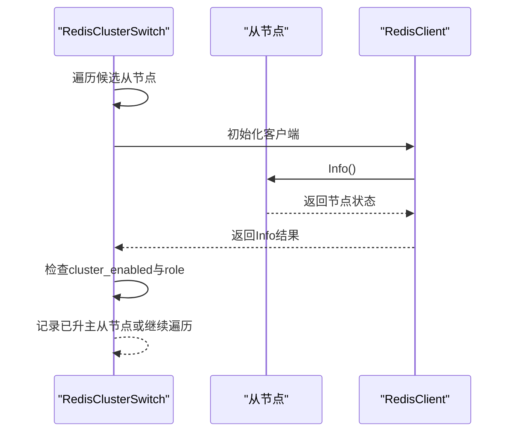
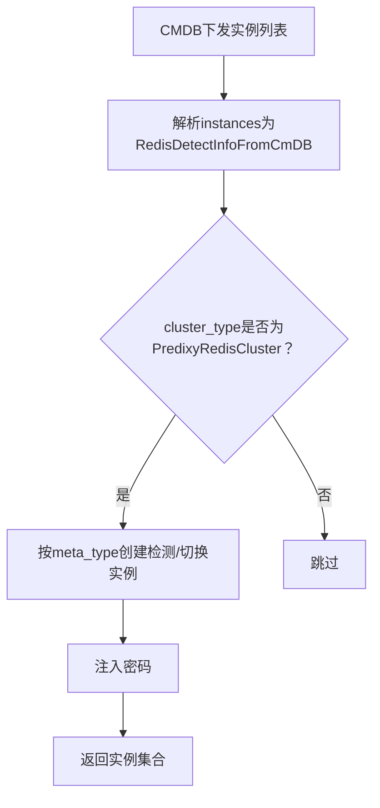
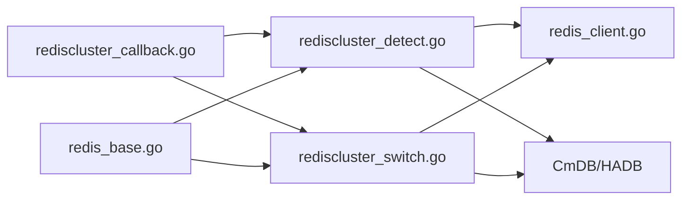

# Redis集群管理

<cite>
**本文档引用的文件**
- [rediscluster_detect.go](file://dbm-services/common/dbha/ha-module/dbmodule/redis/rediscluster_detect.go)
- [rediscluster_switch.go](file://dbm-services/common/dbha/ha-module/dbmodule/redis/rediscluster_switch.go)
- [rediscluster_callback.go](file://dbm-services/common/dbha/ha-module/dbmodule/redis/rediscluster_callback.go)
- [redis_base.go](file://dbm-services/common/dbha/ha-module/dbmodule/redis/redis_base.go)
- [redis_detect.go](file://dbm-services/common/dbha/ha-module/dbmodule/redis/redis_detect.go)
- [redis_switch.go](file://dbm-services/common/dbha/ha-module/dbmodule/redis/redis_switch.go)
- [redis_client.go](file://dbm-services/common/dbha/ha-module/client/redis_client.go)
</cite>

## 目录
1. [简介](#简介)
2. [项目结构](#项目结构)
3. [核心组件](#核心组件)
4. [架构总览](#架构总览)
5. [详细组件分析](#详细组件分析)
6. [依赖关系分析](#依赖关系分析)
7. [性能考虑](#性能考虑)
8. [故障排查指南](#故障排查指南)
9. [结论](#结论)

## 简介
本文件面向Redis集群管理场景，系统化梳理扩缩容（添加/移除从节点）、数据迁移与故障转移等关键能力，阐述集群模式下的数据分布策略、槽位分配与节点管理机制，并提供健康检查、节点状态监控与自动故障检测的实现方法，以及维护操作的最佳实践与风险控制措施。内容基于仓库中的Redis HA模块源码进行提炼与总结。

## 项目结构
Redis集群管理相关代码位于dbm-services/common/dbha/ha-module/dbmodule/redis目录，主要由以下模块组成：
- 集群检测与切换：rediscluster_detect.go、rediscluster_switch.go
- 回调与实例构造：rediscluster_callback.go
- 基础类型与通用逻辑：redis_base.go
- 单机检测与切换：redis_detect.go、redis_switch.go
- 客户端封装：client/redis_client.go

**图表来源**
- [redis_base.go:1-372](file://dbm-services/common/dbha/ha-module/dbmodule/redis/redis_base.go#L1-L372)
- [redis_detect.go:1-215](file://dbm-services/common/dbha/ha-module/dbmodule/redis/redis_detect.go#L1-L215)
- [redis_switch.go:1-643](file://dbm-services/common/dbha/ha-module/dbmodule/redis/redis_switch.go#L1-L643)
- [rediscluster_detect.go:1-162](file://dbm-services/common/dbha/ha-module/dbmodule/redis/rediscluster_detect.go#L1-L162)
- [rediscluster_switch.go:1-113](file://dbm-services/common/dbha/ha-module/dbmodule/redis/rediscluster_switch.go#L1-L113)
- [rediscluster_callback.go:1-141](file://dbm-services/common/dbha/ha-module/dbmodule/redis/rediscluster_callback.go#L1-L141)
- [redis_client.go:1-230](file://dbm-services/common/dbha/ha-module/client/redis_client.go#L1-L230)

**章节来源**
- [redis_base.go:1-372](file://dbm-services/common/dbha/ha-module/dbmodule/redis/redis_base.go#L1-L372)
- [redis_detect.go:1-215](file://dbm-services/common/dbha/ha-module/dbmodule/redis/redis_detect.go#L1-L215)
- [redis_switch.go:1-643](file://dbm-services/common/dbha/ha-module/dbmodule/redis/redis_switch.go#L1-L643)
- [rediscluster_detect.go:1-162](file://dbm-services/common/dbha/ha-module/dbmodule/redis/rediscluster_detect.go#L1-L162)
- [rediscluster_switch.go:1-113](file://dbm-services/common/dbha/ha-module/dbmodule/redis/rediscluster_switch.go#L1-L113)
- [rediscluster_callback.go:1-141](file://dbm-services/common/dbha/ha-module/dbmodule/redis/rediscluster_callback.go#L1-L141)
- [redis_client.go:1-230](file://dbm-services/common/dbha/ha-module/client/redis_client.go#L1-L230)

## 核心组件
- Redis集群检测实例：负责对集群节点执行健康检查、角色判定与可达性验证，支持SSH连通性校验与认证失败处理。
- Redis集群切换实例：负责在故障发生时识别已升主的从节点，作为故障转移后的候选主节点。
- 回调与实例构造：根据CMDB下发的集群信息创建检测/切换实例，支持序列化/反序列化响应。
- 基础类型与通用逻辑：定义检测/切换所需的基础数据结构、密码获取、CMDB/HADB交互、网关踢除等通用能力。
- Redis客户端：统一封装单机与集群模式的Redis操作，包括Info查询、命令执行、SlaveOf、ClusterFailover等。

**章节来源**
- [rediscluster_detect.go:16-162](file://dbm-services/common/dbha/ha-module/dbmodule/redis/rediscluster_detect.go#L16-L162)
- [rediscluster_switch.go:13-113](file://dbm-services/common/dbha/ha-module/dbmodule/redis/rediscluster_switch.go#L13-L113)
- [rediscluster_callback.go:13-141](file://dbm-services/common/dbha/ha-module/dbmodule/redis/rediscluster_callback.go#L13-L141)
- [redis_base.go:18-372](file://dbm-services/common/dbha/ha-module/dbmodule/redis/redis_base.go#L18-L372)
- [redis_client.go:23-230](file://dbm-services/common/dbha/ha-module/client/redis_client.go#L23-L230)

## 架构总览
Redis集群管理采用“检测-决策-切换-回滚”的闭环流程，结合代理层一致性校验与元数据更新，确保切换过程的正确性与可追溯性。

**图表来源**
- [rediscluster_detect.go:22-84](file://dbm-services/common/dbha/ha-module/dbmodule/redis/rediscluster_detect.go#L22-L84)
- [rediscluster_switch.go:25-54](file://dbm-services/common/dbha/ha-module/dbmodule/redis/rediscluster_switch.go#L25-L54)
- [redis_client.go:102-156](file://dbm-services/common/dbha/ha-module/client/redis_client.go#L102-L156)

## 详细组件分析

### 组件A：Redis集群检测（RedisClusterDetectInstance）
- 职责
  - 对集群节点执行健康检查，解析Info输出判断角色与复制状态。
  - 支持SSH连通性校验，区分认证失败与连接失败。
  - 提供序列化能力，便于上报检测结果。
- 关键流程
  - 初始化客户端并设置超时。
  - 通过InfoV2("Replication")获取复制信息。
  - 若为主节点，执行一次SET写入测试（含MOVED处理）。
  - 失败时根据错误类型设置状态（认证失败/数据库检查失败/SSH失败）。

**图表来源**
- [rediscluster_detect.go:58-141](file://dbm-services/common/dbha/ha-module/dbmodule/redis/rediscluster_detect.go#L58-L141)

**章节来源**
- [rediscluster_detect.go:16-162](file://dbm-services/common/dbha/ha-module/dbmodule/redis/rediscluster_detect.go#L16-L162)

### 组件B：Redis集群切换（RedisClusterSwitch）
- 职责
  - 在故障后识别已升主的从节点，作为候选主节点。
  - 对从节点执行Info检查，确认其已变为master。
  - 记录日志并返回切换结果。
- 关键流程
  - 遍历候选从节点列表，逐一执行Info查询。
  - 匹配包含"cluster_enabled:1"且"role:master"的节点。
  - 成功则记录日志，否则提示可能自动切换失败。

**图表来源**
- [rediscluster_switch.go:81-112](file://dbm-services/common/dbha/ha-module/dbmodule/redis/rediscluster_switch.go#L81-L112)

**章节来源**
- [rediscluster_switch.go:13-113](file://dbm-services/common/dbha/ha-module/dbmodule/redis/rediscluster_switch.go#L13-L113)

### 组件C：回调与实例构造（RedisCluster回调）
- 职责
  - 将CMDB下发的实例信息解析为检测/切换实例。
  - 支持按机器类型（如Predixy/Redis）创建对应实例。
  - 反序列化Agent上报的检测响应，生成检测实例。
- 关键流程
  - 解析instances，过滤cluster_type为PredixyRedisCluster。
  - 根据meta_type创建相应实例并注入密码。
  - 反序列化时校验cluster_type一致性。

**图表来源**
- [rediscluster_callback.go:14-46](file://dbm-services/common/dbha/ha-module/dbmodule/redis/rediscluster_callback.go#L14-L46)
- [rediscluster_callback.go:48-73](file://dbm-services/common/dbha/ha-module/dbmodule/redis/rediscluster_callback.go#L48-L73)

**章节来源**
- [rediscluster_callback.go:13-141](file://dbm-services/common/dbha/ha-module/dbmodule/redis/rediscluster_callback.go#L13-L141)

### 组件D：基础类型与通用逻辑（Redis基础）
- 职责
  - 定义RedisSwitchInfo、RedisDetectBase、RedisDetectResponse等基础结构。
  - 提供SSH检查、密码获取、CMDB/HADB客户端初始化、网关踢除（DNS/CLB/Polaris）等通用能力。
  - 支持从CMDB解析实例信息与从响应反序列化实例信息。
- 关键点
  - SSH检查通过在目标主机创建标记文件验证连通性。
  - 网关踢除按配置开关分别对DNS、CLB、Polaris执行删除绑定操作。

**章节来源**
- [redis_base.go:18-372](file://dbm-services/common/dbha/ha-module/dbmodule/redis/redis_base.go#L18-L372)

### 组件E：单机Redis检测与切换（对比参考）
- 职责
  - 单机场景下的检测与切换流程，包含锁文件、代理一致性校验、元数据更新等。
- 关键流程（用于理解集群切换差异）
  - 预检查：判断是否从节点、从节点数量、文件锁、代理ping一致性、同步状态。
  - 切换：对从节点执行slaveof no one，必要时更新代理后端。
  - 元数据更新：通过CMDB交换角色信息。

**章节来源**
- [redis_detect.go:16-215](file://dbm-services/common/dbha/ha-module/dbmodule/redis/redis_detect.go#L16-L215)
- [redis_switch.go:39-643](file://dbm-services/common/dbha/ha-module/dbmodule/redis/redis_switch.go#L39-L643)

## 依赖关系分析
- 组件耦合
  - 检测与切换均依赖RedisClient进行Info查询与命令执行。
  - 回调模块负责实例构造与序列化，解耦上层调度与具体实现。
  - 基础模块提供通用能力（SSH、密码、网关踢除），提升复用度。
- 外部依赖
  - Redis客户端库：统一处理单机与集群模式命令。
  - CMDB/HADB：用于实例元数据与角色信息的读取与更新。
  - 网关服务：DNS/CLB/Polaris，用于切换过程中的流量摘除。

**图表来源**
- [rediscluster_callback.go:13-141](file://dbm-services/common/dbha/ha-module/dbmodule/redis/rediscluster_callback.go#L13-L141)
- [rediscluster_detect.go:16-162](file://dbm-services/common/dbha/ha-module/dbmodule/redis/rediscluster_detect.go#L16-L162)
- [rediscluster_switch.go:13-113](file://dbm-services/common/dbha/ha-module/dbmodule/redis/rediscluster_switch.go#L13-L113)
- [redis_base.go:18-372](file://dbm-services/common/dbha/ha-module/dbmodule/redis/redis_base.go#L18-L372)
- [redis_client.go:1-230](file://dbm-services/common/dbha/ha-module/client/redis_client.go#L1-L230)

**章节来源**
- [rediscluster_callback.go:13-141](file://dbm-services/common/dbha/ha-module/dbmodule/redis/rediscluster_callback.go#L13-L141)
- [rediscluster_detect.go:16-162](file://dbm-services/common/dbha/ha-module/dbmodule/redis/rediscluster_detect.go#L16-L162)
- [rediscluster_switch.go:13-113](file://dbm-services/common/dbha/ha-module/dbmodule/redis/rediscluster_switch.go#L13-L113)
- [redis_base.go:18-372](file://dbm-services/common/dbha/ha-module/dbmodule/redis/redis_base.go#L18-L372)
- [redis_client.go:1-230](file://dbm-services/common/dbha/ha-module/client/redis_client.go#L1-L230)

## 性能考虑
- 连接与超时
  - 客户端初始化时设置读写超时，避免长时间阻塞影响检测/切换进度。
- 并发与一致性
  - 代理一致性校验采用并发方式对多个代理执行ping，缩短整体耗时。
  - 通过MD5汇总各代理后端配置，快速发现不一致情况。
- 重试与稳定性
  - 代理后端切换过程内置有限次重试，提升在网络抖动时的成功率。
- 选择库策略
  - 集群模式下禁用自动重试与最大重定向，降低异常路径复杂度。

**章节来源**
- [redis_client.go:30-65](file://dbm-services/common/dbha/ha-module/client/redis_client.go#L30-L65)
- [redis_switch.go:231-310](file://dbm-services/common/dbha/ha-module/dbmodule/redis/redis_switch.go#L231-L310)
- [redis_switch.go:423-493](file://dbm-services/common/dbha/ha-module/dbmodule/redis/redis_switch.go#L423-L493)

## 故障排查指南
- 认证失败
  - 检测阶段若返回认证失败，需检查密码配置与权限。
- 数据库检查失败
  - 检查节点可达性、网络策略与实例状态。
- SSH失败
  - 检查SSH用户、密钥与目标主机连通性。
- 代理一致性不满足
  - 查看各代理后端MD5汇总，定位不一致的代理并手动修复。
- 切换后角色未更新
  - 检查CMDB元数据交换接口调用结果与返回值。
- 集群节点未升主
  - 确认从节点Info输出中cluster_enabled与role字段，必要时人工干预。

**章节来源**
- [rediscluster_detect.go:30-54](file://dbm-services/common/dbha/ha-module/dbmodule/redis/rediscluster_detect.go#L30-L54)
- [rediscluster_detect.go:67-84](file://dbm-services/common/dbha/ha-module/dbmodule/redis/rediscluster_detect.go#L67-L84)
- [rediscluster_switch.go:81-112](file://dbm-services/common/dbha/ha-module/dbmodule/redis/rediscluster_switch.go#L81-L112)
- [redis_switch.go:231-310](file://dbm-services/common/dbha/ha-module/dbmodule/redis/redis_switch.go#L231-L310)
- [redis_switch.go:154-181](file://dbm-services/common/dbha/ha-module/dbmodule/redis/redis_switch.go#L154-L181)

## 结论
本方案围绕Redis集群的健康检查、故障检测与自动切换构建了完整的管理闭环，通过回调模块实现与上层调度的解耦，通过基础模块抽象通用能力，通过客户端封装统一底层操作。在实际运维中，建议结合监控告警与自动化脚本，严格执行预检查与回滚策略，确保扩缩容与故障转移过程的安全与稳定。