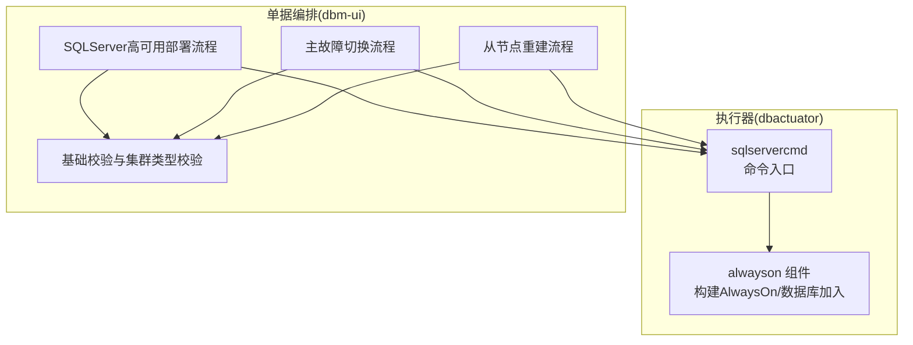
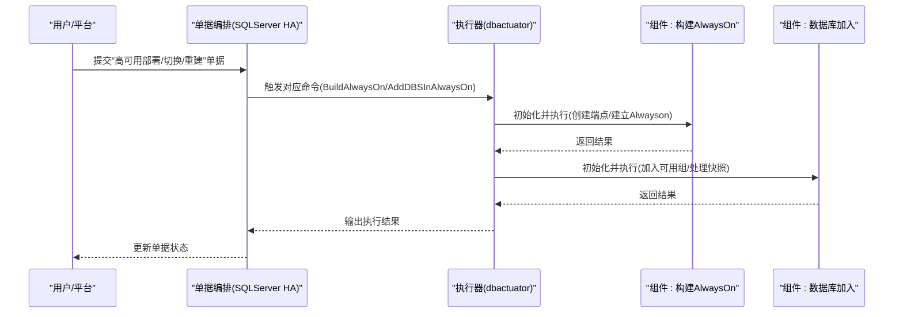
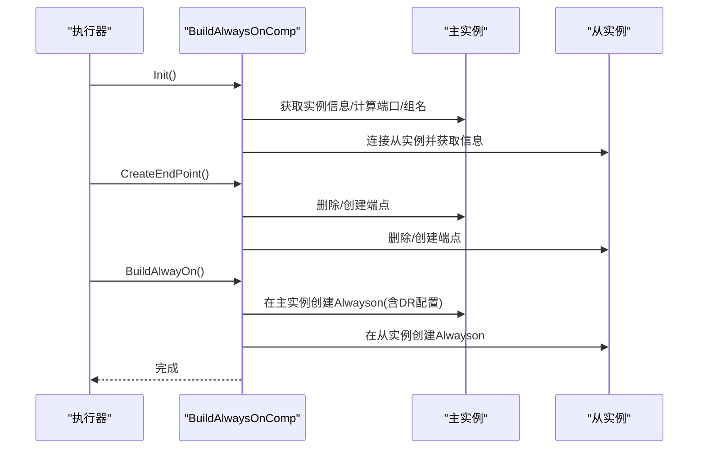
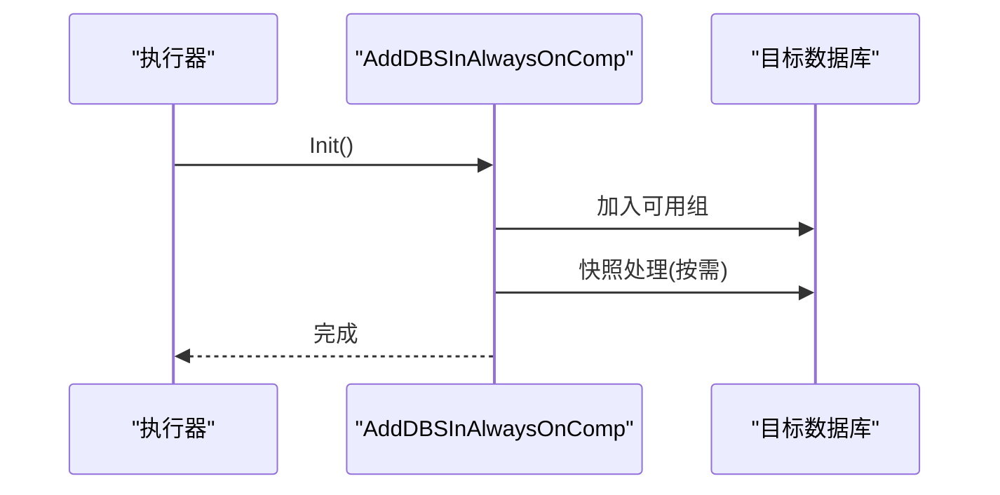
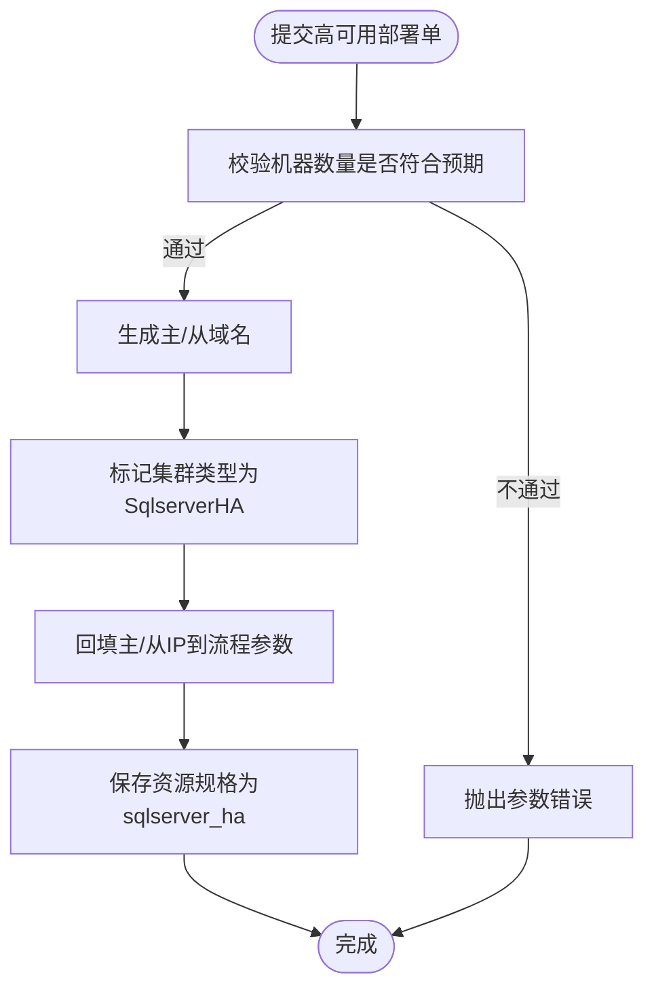
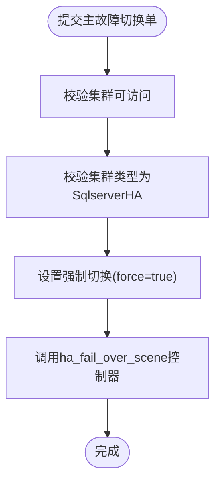
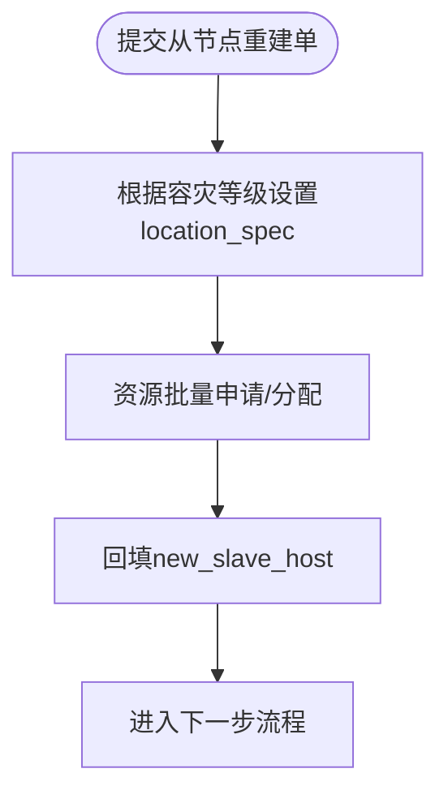
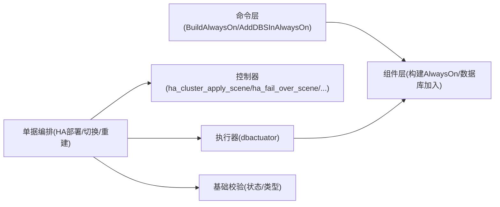
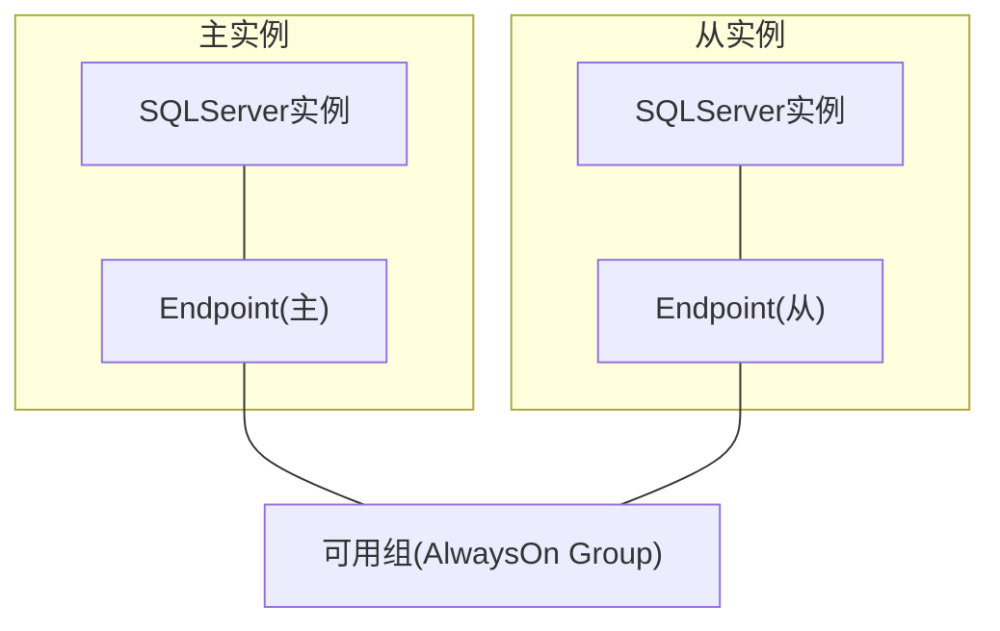

# SQLServer AlwaysOn高可用

<cite>
**本文引用的文件**   
- [build_alwayson.go](file://dbm-services/sqlserver/db-tools/dbactuator/internal/subcmd/sqlservercmd/build_alwayson.go)
- [add_databases_in_alwayson.go](file://dbm-services/sqlserver/db-tools/dbactuator/internal/subcmd/sqlservercmd/add_databases_in_alwayson.go)
- [build_alwayson.go](file://dbm-services/sqlserver/db-tools/dbactuator/pkg/components/sqlserver/alwayson/build_alwayson.go)
- [sqlserver_ha_apply.py](file://dbm-ui/backend/ticket/builders/sqlserver/sqlserver_ha_apply.py)
- [sqlserver_master_fail_over.py](file://dbm-ui/backend/ticket/builders/sqlserver/sqlserver_master_fail_over.py)
- [sqlserver_restore_slave.py](file://dbm-ui/backend/ticket/builders/sqlserver/sqlserver_restore_slave.py)
- [base.py](file://dbm-ui/backend/ticket/builders/sqlserver/base.py)
- [checkcmd.go](file://dbm-services/sqlserver/db-tools/dbactuator/internal/subcmd/checkcmd/checkcmd.go)
</cite>

## 目录
1. [简介](#简介)
2. [项目结构](#项目结构)
3. [核心组件](#核心组件)
4. [架构总览](#架构总览)
5. [组件详解](#组件详解)
6. [依赖关系分析](#依赖关系分析)
7. [性能考量](#性能考量)
8. [故障排查指南](#故障排查指南)
9. [结论](#结论)
10. [附录](#附录)

## 简介
本文件面向SQLServer AlwaysOn高可用场景，系统化梳理从部署准备、集群构建、数据库加入、角色切换到灾备恢复的完整流程，并结合代码库中的执行器与单据编排能力，给出可操作的步骤、流程图与时序图，帮助读者快速理解并落地生产环境的高可用方案。

## 项目结构
本仓库中与SQLServer AlwaysOn相关的关键位置如下：
- 执行器（dbactuator）侧：
  - 子命令入口与步骤编排：internal/subcmd/sqlservercmd 下的 BuildAlwaysOn、AddDBSInAlwaysOn 等命令实现
  - 组件实现：pkg/components/sqlserver/alwayson 下的构建AlwaysOn与数据库加入组件
- 单据编排（dbm-ui）侧：
  - 高可用部署、主故障切换、从节点重建等流程的参数与校验
  - 基础校验与集群类型约束

**图表来源**
- [build_alwayson.go:30-87](file://dbm-services/sqlserver/db-tools/dbactuator/internal/subcmd/sqlservercmd/build_alwayson.go#L30-L87)
- [add_databases_in_alwayson.go:30-87](file://dbm-services/sqlserver/db-tools/dbactuator/internal/subcmd/sqlservercmd/add_databases_in_alwayson.go#L30-L87)
- [build_alwayson.go:23-196](file://dbm-services/sqlserver/db-tools/dbactuator/pkg/components/sqlserver/alwayson/build_alwayson.go#L23-L196)
- [sqlserver_ha_apply.py:115-128](file://dbm-ui/backend/ticket/builders/sqlserver/sqlserver_ha_apply.py#L115-L128)
- [sqlserver_master_fail_over.py:41-45](file://dbm-ui/backend/ticket/builders/sqlserver/sqlserver_master_fail_over.py#L41-L45)
- [sqlserver_restore_slave.py:147-158](file://dbm-ui/backend/ticket/builders/sqlserver/sqlserver_restore_slave.py#L147-L158)
- [base.py:94-118](file://dbm-ui/backend/ticket/builders/sqlserver/base.py#L94-L118)

**章节来源**
- [build_alwayson.go:30-87](file://dbm-services/sqlserver/db-tools/dbactuator/internal/subcmd/sqlservercmd/build_alwayson.go#L30-L87)
- [add_databases_in_alwayson.go:30-87](file://dbm-services/sqlserver/db-tools/dbactuator/internal/subcmd/sqlservercmd/add_databases_in_alwayson.go#L30-L87)
- [build_alwayson.go:23-196](file://dbm-services/sqlserver/db-tools/dbactuator/pkg/components/sqlserver/alwayson/build_alwayson.go#L23-L196)
- [sqlserver_ha_apply.py:115-128](file://dbm-ui/backend/ticket/builders/sqlserver/sqlserver_ha_apply.py#L115-L128)
- [sqlserver_master_fail_over.py:41-45](file://dbm-ui/backend/ticket/builders/sqlserver/sqlserver_master_fail_over.py#L41-L45)
- [sqlserver_restore_slave.py:147-158](file://dbm-ui/backend/ticket/builders/sqlserver/sqlserver_restore_slave.py#L147-L158)
- [base.py:94-118](file://dbm-ui/backend/ticket/builders/sqlserver/base.py#L94-L118)

## 核心组件
- 执行器命令层
  - BuildAlwaysOn：负责建立端点与Alwayson通信
  - AddDBSInAlwaysOn：负责将数据库加入到可用组，并处理快照库
- 组件层
  - BuildAlwaysOnComp：封装连接、实例信息解析、端点创建、可用组建立等逻辑
- 单据编排层
  - SQLServer高可用部署流程：校验机器数量、生成域名、标记集群类型
  - 主故障切换流程：强制切换、校验集群类型为高可用
  - 从节点重建流程：资源规格与位置约束、回填新从节点
  - 基础校验：校验集群状态与类型白名单

**章节来源**
- [build_alwayson.go:24-87](file://dbm-services/sqlserver/db-tools/dbactuator/internal/subcmd/sqlservercmd/build_alwayson.go#L24-L87)
- [add_databases_in_alwayson.go:24-87](file://dbm-services/sqlserver/db-tools/dbactuator/internal/subcmd/sqlservercmd/add_databases_in_alwayson.go#L24-L87)
- [build_alwayson.go:23-196](file://dbm-services/sqlserver/db-tools/dbactuator/pkg/components/sqlserver/alwayson/build_alwayson.go#L23-L196)
- [sqlserver_ha_apply.py:32-47](file://dbm-ui/backend/ticket/builders/sqlserver/sqlserver_ha_apply.py#L32-L47)
- [sqlserver_master_fail_over.py:23-31](file://dbm-ui/backend/ticket/builders/sqlserver/sqlserver_master_fail_over.py#L23-L31)
- [sqlserver_restore_slave.py:140-144](file://dbm-ui/backend/ticket/builders/sqlserver/sqlserver_restore_slave.py#L140-L144)
- [base.py:94-118](file://dbm-ui/backend/ticket/builders/sqlserver/base.py#L94-L118)

## 架构总览
下图展示从单据发起到执行器执行的总体交互，以及执行器内部的步骤编排：

**图表来源**
- [build_alwayson.go:69-87](file://dbm-services/sqlserver/db-tools/dbactuator/internal/subcmd/sqlservercmd/build_alwayson.go#L69-L87)
- [add_databases_in_alwayson.go:69-87](file://dbm-services/sqlserver/db-tools/dbactuator/internal/subcmd/sqlservercmd/add_databases_in_alwayson.go#L69-L87)
- [build_alwayson.go:58-122](file://dbm-services/sqlserver/db-tools/dbactuator/pkg/components/sqlserver/alwayson/build_alwayson.go#L58-L122)
- [sqlserver_ha_apply.py:115-128](file://dbm-ui/backend/ticket/builders/sqlserver/sqlserver_ha_apply.py#L115-L128)
- [sqlserver_master_fail_over.py:34-39](file://dbm-ui/backend/ticket/builders/sqlserver/sqlserver_master_fail_over.py#L34-L39)
- [sqlserver_restore_slave.py:147-158](file://dbm-ui/backend/ticket/builders/sqlserver/sqlserver_restore_slave.py#L147-L158)

## 组件详解

### 组件A：构建AlwaysOn（端点与可用组）
- 功能职责
  - 连接本地与从实例，解析实例信息
  - 计算监听端口与可用组名称
  - 创建端点（Endpoint）
  - 在主/从实例上建立Alwayson配置
- 关键步骤时序

**图表来源**
- [build_alwayson.go:69-87](file://dbm-services/sqlserver/db-tools/dbactuator/internal/subcmd/sqlservercmd/build_alwayson.go#L69-L87)
- [build_alwayson.go:58-122](file://dbm-services/sqlserver/db-tools/dbactuator/pkg/components/sqlserver/alwayson/build_alwayson.go#L58-L122)
- [build_alwayson.go:124-195](file://dbm-services/sqlserver/db-tools/dbactuator/pkg/components/sqlserver/alwayson/build_alwayson.go#L124-L195)

**章节来源**
- [build_alwayson.go:24-87](file://dbm-services/sqlserver/db-tools/dbactuator/internal/subcmd/sqlservercmd/build_alwayson.go#L24-L87)
- [build_alwayson.go:23-196](file://dbm-services/sqlserver/db-tools/dbactuator/pkg/components/sqlserver/alwayson/build_alwayson.go#L23-L196)

### 组件B：数据库加入可用组（含快照处理）
- 功能职责
  - 将指定数据库加入到可用组
  - 处理快照库（如需）
- 步骤时序

**图表来源**
- [add_databases_in_alwayson.go:69-87](file://dbm-services/sqlserver/db-tools/dbactuator/internal/subcmd/sqlservercmd/add_databases_in_alwayson.go#L69-L87)

**章节来源**
- [add_databases_in_alwayson.go:24-87](file://dbm-services/sqlserver/db-tools/dbactuator/internal/subcmd/sqlservercmd/add_databases_in_alwayson.go#L24-L87)

### 组件C：高可用部署流程（单据编排）
- 校验要点
  - 机器数量必须满足每组2台（主+从）×组数
  - 生成主/从域名模板
  - 标记集群类型为SqlserverHA
- 关键行为
  - 回填主/从IP到后续流程
  - 资源规格合并为sqlserver_ha

**图表来源**
- [sqlserver_ha_apply.py:32-47](file://dbm-ui/backend/ticket/builders/sqlserver/sqlserver_ha_apply.py#L32-L47)
- [sqlserver_ha_apply.py:66-80](file://dbm-ui/backend/ticket/builders/sqlserver/sqlserver_ha_apply.py#L66-L80)
- [sqlserver_ha_apply.py:104-112](file://dbm-ui/backend/ticket/builders/sqlserver/sqlserver_ha_apply.py#L104-L112)

**章节来源**
- [sqlserver_ha_apply.py:32-47](file://dbm-ui/backend/ticket/builders/sqlserver/sqlserver_ha_apply.py#L32-L47)
- [sqlserver_ha_apply.py:66-80](file://dbm-ui/backend/ticket/builders/sqlserver/sqlserver_ha_apply.py#L66-L80)
- [sqlserver_ha_apply.py:104-112](file://dbm-ui/backend/ticket/builders/sqlserver/sqlserver_ha_apply.py#L104-L112)

### 组件D：主故障切换（单据编排）
- 校验要点
  - 集群必须可访问且类型为SqlserverHA
  - 强制切换（force=true）
- 控制器调用
  - ha_fail_over_scene

**图表来源**
- [sqlserver_master_fail_over.py:26-31](file://dbm-ui/backend/ticket/builders/sqlserver/sqlserver_master_fail_over.py#L26-L31)
- [sqlserver_master_fail_over.py:34-39](file://dbm-ui/backend/ticket/builders/sqlserver/sqlserver_master_fail_over.py#L34-L39)
- [base.py:114-118](file://dbm-ui/backend/ticket/builders/sqlserver/base.py#L114-L118)

**章节来源**
- [sqlserver_master_fail_over.py:23-31](file://dbm-ui/backend/ticket/builders/sqlserver/sqlserver_master_fail_over.py#L23-L31)
- [sqlserver_master_fail_over.py:34-39](file://dbm-ui/backend/ticket/builders/sqlserver/sqlserver_master_fail_over.py#L34-L39)
- [base.py:114-118](file://dbm-ui/backend/ticket/builders/sqlserver/base.py#L114-L118)

### 组件E：从节点重建（单据编排）
- 资源规格与位置约束
  - 根据容灾等级决定从节点位置策略
- 回填新从节点
  - 将重建后的从节点写回到流程参数

**图表来源**
- [sqlserver_restore_slave.py:130-138](file://dbm-ui/backend/ticket/builders/sqlserver/sqlserver_restore_slave.py#L130-L138)
- [sqlserver_restore_slave.py:140-144](file://dbm-ui/backend/ticket/builders/sqlserver/sqlserver_restore_slave.py#L140-L144)

**章节来源**
- [sqlserver_restore_slave.py:130-138](file://dbm-ui/backend/ticket/builders/sqlserver/sqlserver_restore_slave.py#L130-L138)
- [sqlserver_restore_slave.py:140-144](file://dbm-ui/backend/ticket/builders/sqlserver/sqlserver_restore_slave.py#L140-L144)

## 依赖关系分析
- 执行器命令与组件
  - 命令层负责参数反序列化、初始化与步骤编排
  - 组件层负责具体SQL执行与运行时上下文管理
- 单据编排与执行器
  - 单据编排负责参数格式化、校验与控制器调用
  - 执行器负责实际数据库操作
- 基础校验
  - 对集群状态与类型进行统一校验，避免在异常状态下执行高风险操作

**图表来源**
- [build_alwayson.go:69-87](file://dbm-services/sqlserver/db-tools/dbactuator/internal/subcmd/sqlservercmd/build_alwayson.go#L69-L87)
- [add_databases_in_alwayson.go:69-87](file://dbm-services/sqlserver/db-tools/dbactuator/internal/subcmd/sqlservercmd/add_databases_in_alwayson.go#L69-L87)
- [build_alwayson.go:58-122](file://dbm-services/sqlserver/db-tools/dbactuator/pkg/components/sqlserver/alwayson/build_alwayson.go#L58-L122)
- [sqlserver_ha_apply.py:115-124](file://dbm-ui/backend/ticket/builders/sqlserver/sqlserver_ha_apply.py#L115-L124)
- [sqlserver_master_fail_over.py:34-35](file://dbm-ui/backend/ticket/builders/sqlserver/sqlserver_master_fail_over.py#L34-L35)
- [base.py:94-111](file://dbm-ui/backend/ticket/builders/sqlserver/base.py#L94-L111)

**章节来源**
- [build_alwayson.go:69-87](file://dbm-services/sqlserver/db-tools/dbactuator/internal/subcmd/sqlservercmd/build_alwayson.go#L69-L87)
- [add_databases_in_alwayson.go:69-87](file://dbm-services/sqlserver/db-tools/dbactuator/internal/subcmd/sqlservercmd/add_databases_in_alwayson.go#L69-L87)
- [build_alwayson.go:58-122](file://dbm-services/sqlserver/db-tools/dbactuator/pkg/components/sqlserver/alwayson/build_alwayson.go#L58-L122)
- [sqlserver_ha_apply.py:115-124](file://dbm-ui/backend/ticket/builders/sqlserver/sqlserver_ha_apply.py#L115-L124)
- [sqlserver_master_fail_over.py:34-35](file://dbm-ui/backend/ticket/builders/sqlserver/sqlserver_master_fail_over.py#L34-L35)
- [base.py:94-111](file://dbm-ui/backend/ticket/builders/sqlserver/base.py#L94-L111)

## 性能考量
- 端口与监听
  - 端点监听端口由实例端口推导，确保跨实例通信稳定
- 并行与顺序
  - 端点创建在主/从实例上分别执行；可用组建立遵循先主后从的顺序，减少重复配置
- 数据库加入
  - 数据库加入与快照处理分步执行，便于定位问题与重试

**章节来源**
- [build_alwayson.go:109-121](file://dbm-services/sqlserver/db-tools/dbactuator/pkg/components/sqlserver/alwayson/build_alwayson.go#L109-L121)
- [build_alwayson.go:124-195](file://dbm-services/sqlserver/db-tools/dbactuator/pkg/components/sqlserver/alwayson/build_alwayson.go#L124-L195)
- [add_databases_in_alwayson.go:69-87](file://dbm-services/sqlserver/db-tools/dbactuator/internal/subcmd/sqlservercmd/add_databases_in_alwayson.go#L69-L87)

## 故障排查指南
- 前置检查
  - 使用检查子命令查看实例进程、服务状态与异常数据库情况
- 常见问题定位
  - 端点创建失败：确认实例端口、网络连通性与权限
  - 可用组建立失败：确认实例名称、主机名解析、端口占用
  - 数据库加入失败：确认数据库状态、备份链路与快照策略
- 单据层面
  - 若集群状态异常或类型不符，将被基础校验拦截，需先修复状态再重试

**章节来源**
- [checkcmd.go:22-40](file://dbm-services/sqlserver/db-tools/dbactuator/internal/subcmd/checkcmd/checkcmd.go#L22-L40)
- [base.py:94-118](file://dbm-ui/backend/ticket/builders/sqlserver/base.py#L94-L118)

## 结论
本文基于代码库中的执行器与单据编排能力，系统化梳理了SQLServer AlwaysOn高可用的部署、加入、切换与重建流程。通过命令层与组件层的清晰分工，以及单据编排的参数校验与控制器调用，实现了从规划到执行的闭环。建议在生产环境中严格遵循参数校验、状态检查与顺序化的操作步骤，以降低风险并提升成功率。

## 附录

### 部署架构图（概念示意）

[此图为概念示意，无需图表来源]

### 故障转移测试方法（建议）
- 自动故障转移：模拟主实例不可达，观察仲裁与从实例接管
- 手动故障转移：通过单据强制切换，验证业务连接与数据一致性
- 测试要点：DNS/别名解析、客户端重连、日志与告警联动

[本节为通用建议，无需章节来源]

### 最佳实践
- 端口规划：确保端点监听端口与防火墙策略一致
- 域名与DNS：主/从域名解析稳定，避免切换时解析延迟
- 备份与快照：加入可用组前完成完整备份与快照
- 监控与告警：关注实例状态、端点连通性与同步延迟

[本节为通用建议，无需章节来源]