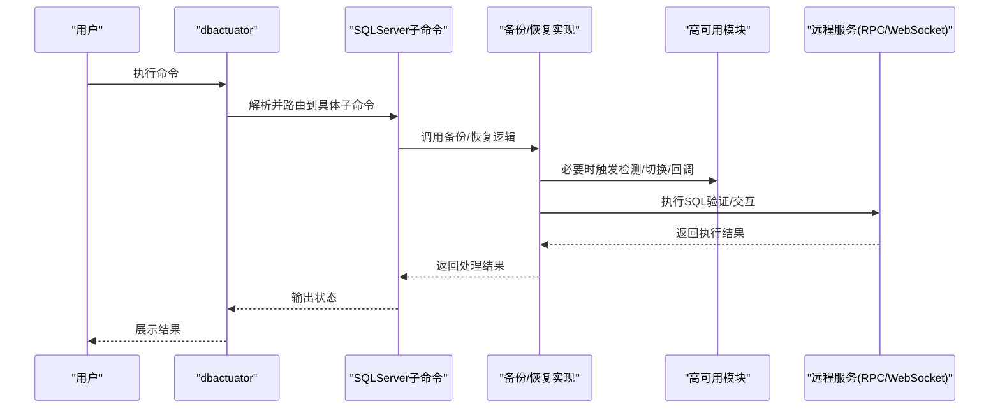
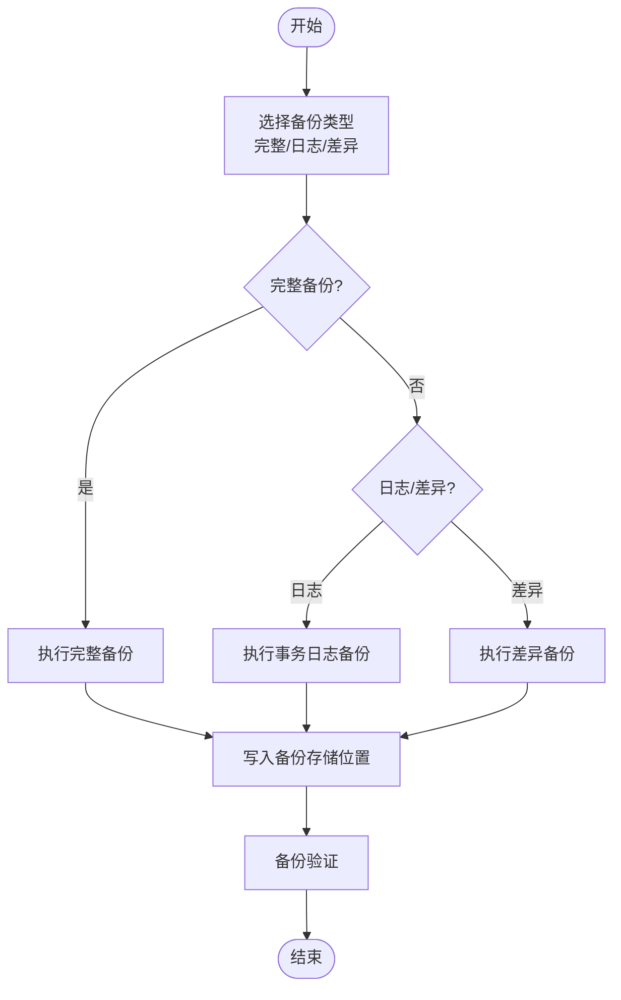
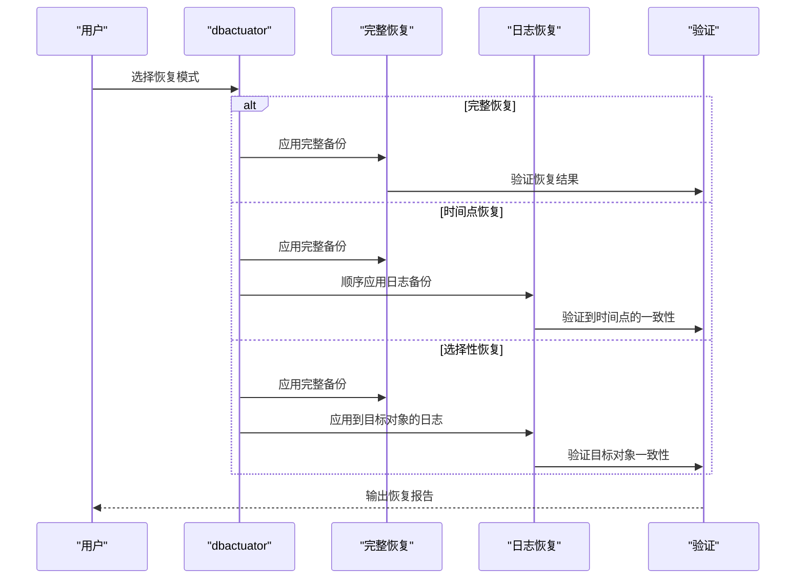
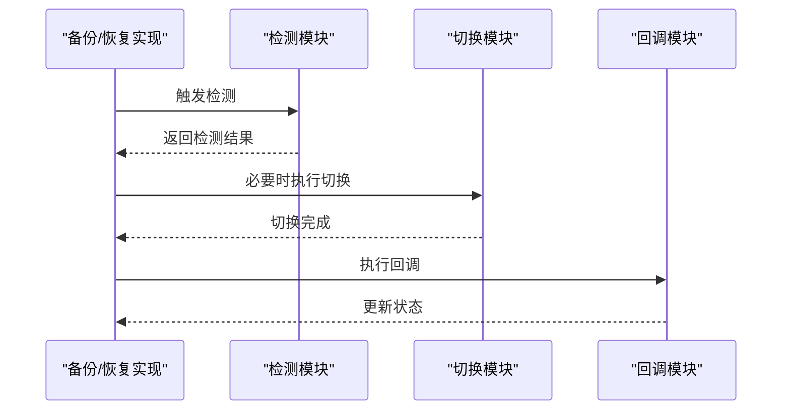
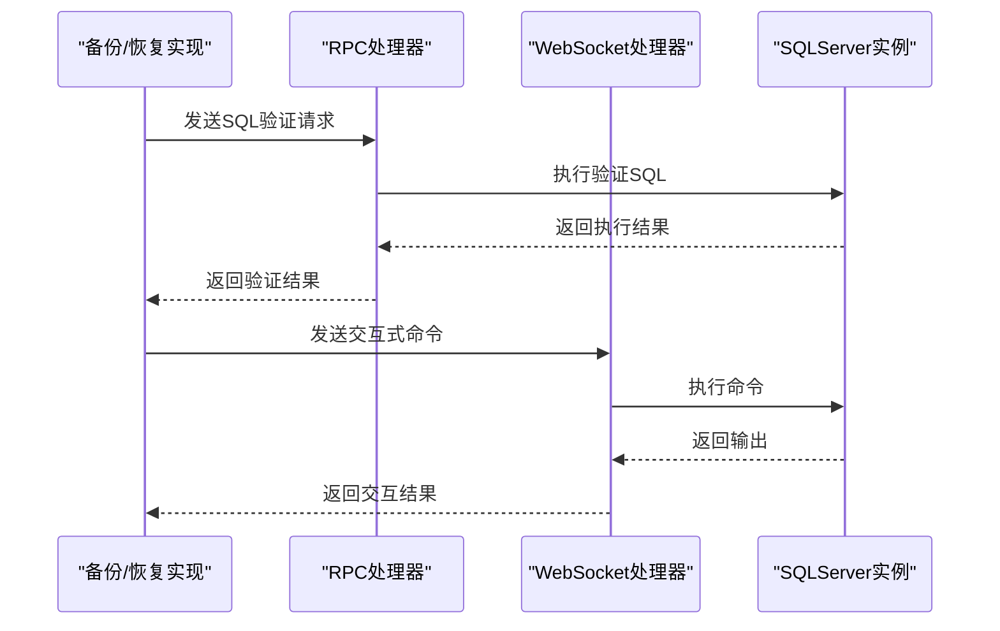
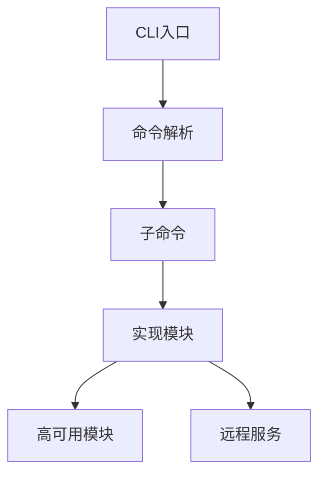

# SQLServer备份恢复

<cite>
**本文引用的文件**
- [cmd.go](file://dbm-services/sqlserver/db-tools/dbactuator/cmd/cmd.go)
- [sqlservercmd.go](file://dbm-services/sqlserver/db-tools/dbactuator/internal/subcmd/sqlservercmd/sqlservercmd.go)
- [backup_dbs.go](file://dbm-services/sqlserver/db-tools/dbactuator/internal/subcmd/sqlservercmd/backup_dbs.go)
- [restore_dbs_full.go](file://dbm-services/sqlserver/db-tools/dbactuator/internal/subcmd/sqlservercmd/restore_dbs_full.go)
- [restore_dbs_log.go](file://dbm-services/sqlserver/db-tools/dbactuator/internal/subcmd/sqlservercmd/restore_dbs_log.go)
- [move_backup_file.go](file://dbm-services/sqlserver/db-tools/dbactuator/internal/subcmd/sqlservercmd/move_backup_file.go)
- [clean_dbs.go](file://dbm-services/sqlserver/db-tools/dbactuator/internal/subcmd/sqlservercmd/clean_dbs.go)
- [rename_dbs.go](file://dbm-services/sqlserver/db-tools/dbactuator/internal/subcmd/sqlservercmd/rename_dbs.go)
- [clone_backup_filter.go](file://dbm-services/sqlserver/db-tools/dbactuator/internal/subcmd/sqlservercmd/clone_backup_filter.go)
- [clone_mirroring_filter.go](file://dbm-services/sqlserver/db-tools/dbactuator/internal/subcmd/sqlservercmd/clone_mirroring_filter.go)
- [build_db_mirroring.go](file://dbm-services/sqlserver/db-tools/dbactuator/internal/subcmd/sqlservercmd/build_db_mirroring.go)
- [init_machine_for_alwayson.go](file://dbm-services/sqlserver/db-tools/dbactuator/internal/subcmd/sqlservercmd/init_machine_for_alwayson.go)
- [build_always_on.go](file://dbm-services/sqlserver/db-tools/dbactuator/internal/subcmd/sqlservercmd/build_always_on.go)
- [add_dbs_in_alwayson.go](file://dbm-services/sqlserver/db-tools/dbactuator/internal/subcmd/sqlservercmd/add_dbs_in_alwayson.go)
- [new_remote_slaves.go](file://dbm-services/sqlserver/db-tools/dbactuator/internal/subcmd/sqlservercmd/new_remote_slaves.go)
- [new_init_sqlserver.go](file://dbm-services/sqlserver/db-tools/dbactuator/internal/subcmd/sqlservercmd/new_init_sqlserver.go)
- [data_export.go](file://dbm-services/sqlserver/db-tools/dbactuator/internal/subcmd/sqlservercmd/data_export.go)
- [sqlserver_callback.go](file://dbm-services/common/dbha/ha-module/dbmodule/sqlserver/sqlserver_callback.go)
- [sqlserver_detect.go](file://dbm-services/common/dbha/ha-module/dbmodule/sqlserver/sqlserver_detect.go)
- [sqlserver_switch.go](file://dbm-services/common/dbha/ha-module/dbmodule/sqlserver/sqlserver_switch.go)
- [sqlserver_util.go](file://dbm-services/common/dbha/ha-module/dbmodule/sqlserver/sqlserver_util.go)
- [sqlserver_rpc.go](file://dbm-services/mysql/db-remote-service/pkg/rpc_implement/sqlserver_rpc/sqlserver_rpc.go)
- [sqlserver.go](file://dbm-services/mysql/db-remote-service/pkg/service/handler_rpc/sqlserver.go)
- [handler.go](file://dbm-services/mysql/db-remote-service/pkg/v2/sqlserver/rpc/handler.go)
- [execute.go](file://dbm-services/mysql/db-remote-service/pkg/v2/sqlserver/rpc/execute.go)
- [oneaddr.go](file://dbm-services/mysql/db-remote-service/pkg/v2/sqlserver/rpc/oneaddr.go)
- [command.go](file://dbm-services/mysql/db-remote-service/pkg/v2/sqlserver/websocket/command.go)
- [handler.go](file://dbm-services/mysql/db-remote-service/pkg/v2/sqlserver/websocket/handler.go)
</cite>

## 目录
1. [简介](#简介)
2. [项目结构](#项目结构)
3. [核心组件](#核心组件)
4. [架构总览](#架构总览)
5. [详细组件分析](#详细组件分析)
6. [依赖关系分析](#依赖关系分析)
7. [性能考虑](#性能考虑)
8. [故障排查指南](#故障排查指南)
9. [结论](#结论)
10. [附录](#附录)

## 简介
本文件面向SQLServer数据库的备份与恢复场景，基于仓库中现有的dbactuator与相关模块，系统化梳理备份策略（完整备份、事务日志备份、差异备份）、恢复模式（完整恢复、时间点恢复、选择性恢复）、备份文件管理与存储位置配置、备份验证流程、备份迁移与重定位、跨版本兼容性与恢复测试、备份加密与压缩、备份计划调度等主题。文档同时给出关键流程的时序图与类图，帮助读者快速理解与落地实施。

## 项目结构
SQLServer备份恢复能力由以下层次构成：
- 命令入口与子命令组织：dbactuator作为统一CLI入口，按“sqlserver”分组组织具体操作。
- 子命令实现：包含备份、恢复（完整/日志）、备份文件移动、清理、重命名、过滤器克隆、镜像/AlwaysOn高可用等。
- 高可用与切换：提供检测、回调、切换与工具方法，支撑备份/恢复过程中的HA保障。
- 远程服务：提供RPC与WebSocket接口，支持远程执行SQL与交互式命令，便于在备份恢复过程中进行验证与运维。

```mermaid
graph TB
CLI["命令行入口<br/>dbactuator"] --> Group["SQLServer子命令组"]
Group --> Backup["备份数据库<br/>BackupDBSCommand"]
Group --> RestoreFull["完整恢复<br/>RestoreDBSForFullCommand"]
Group --> RestoreLog["日志恢复<br/>RestoreDBSForLogCommand"]
Group --> Move["移动备份文件<br/>MoveBackupFileCommand"]
Group --> Clean["清理数据库<br/>CleanDBSCommand"]
Group --> Rename["重命名数据库<br/>RenameDBSCommand"]
Group --> CloneBF["克隆备份过滤器<br/>CloneBackupFilterCommand"]
Group --> CloneMF["克隆镜像过滤器<br/>CloneMirroringFilterCommand"]
Group --> Mirror["构建数据库镜像<br/>BuildDBMirroringCommand"]
Group --> AOInit["初始化AlwaysOn环境<br/>InitMachineForAlwaysonCommand"]
Group --> AO["构建AlwaysOn<br/>BuildAlwaysOnCommand"]
Group --> AddAO["加入AlwaysOn数据库<br/>AddDBSInAlwaysOnCommand"]
Group --> RemoteSlave["远程从库<br/>NewRemoteSlavesCommand"]
Group --> InitInst["实例初始化<br/>NewInitSqlServerCommand"]
Group --> Export["数据导出<br/>DataExportCommand"]
```

图表来源
- [cmd.go:67-143](file://dbm-services/sqlserver/db-tools/dbactuator/cmd/cmd.go#L67-L143)
- [sqlservercmd.go:21-76](file://dbm-services/sqlserver/db-tools/dbactuator/internal/subcmd/sqlservercmd/sqlservercmd.go#L21-L76)

章节来源
- [cmd.go:67-143](file://dbm-services/sqlserver/db-tools/dbactuator/cmd/cmd.go#L67-L143)
- [sqlservercmd.go:21-76](file://dbm-services/sqlserver/db-tools/dbactuator/internal/subcmd/sqlservercmd/sqlservercmd.go#L21-L76)

## 核心组件
- 备份命令：负责发起数据库完整备份，支持备份文件输出路径与格式配置。
- 恢复命令（完整）：负责将完整备份恢复到目标实例或数据库。
- 恢复命令（日志）：负责应用事务日志备份以实现时间点恢复。
- 移动备份文件：用于备份文件的物理迁移与重定位。
- 清理与重命名：清理残留数据库、重命名数据库以便恢复后替换。
- 过滤器克隆：克隆备份与镜像相关过滤规则，确保一致性。
- 镜像与AlwaysOn：构建数据库镜像与AlwaysOn高可用集群，提升可用性与灾备能力。
- 远程服务：通过RPC与WebSocket提供SQL执行与交互能力，辅助验证与运维。

章节来源
- [backup_dbs.go](file://dbm-services/sqlserver/db-tools/dbactuator/internal/subcmd/sqlservercmd/backup_dbs.go)
- [restore_dbs_full.go](file://dbm-services/sqlserver/db-tools/dbactuator/internal/subcmd/sqlservercmd/restore_dbs_full.go)
- [restore_dbs_log.go](file://dbm-services/sqlserver/db-tools/dbactuator/internal/subcmd/sqlservercmd/restore_dbs_log.go)
- [move_backup_file.go](file://dbm-services/sqlserver/db-tools/dbactuator/internal/subcmd/sqlservercmd/move_backup_file.go)
- [clean_dbs.go](file://dbm-services/sqlserver/db-tools/dbactuator/internal/subcmd/sqlservercmd/clean_dbs.go)
- [rename_dbs.go](file://dbm-services/sqlserver/db-tools/dbactuator/internal/subcmd/sqlservercmd/rename_dbs.go)
- [clone_backup_filter.go](file://dbm-services/sqlserver/db-tools/dbactuator/internal/subcmd/sqlservercmd/clone_backup_filter.go)
- [clone_mirroring_filter.go](file://dbm-services/sqlserver/db-tools/dbactuator/internal/subcmd/sqlservercmd/clone_mirroring_filter.go)
- [build_db_mirroring.go](file://dbm-services/sqlserver/db-tools/dbactuator/internal/subcmd/sqlservercmd/build_db_mirroring.go)
- [init_machine_for_alwayson.go](file://dbm-services/sqlserver/db-tools/dbactuator/internal/subcmd/sqlservercmd/init_machine_for_alwayson.go)
- [build_always_on.go](file://dbm-services/sqlserver/db-tools/dbactuator/internal/subcmd/sqlservercmd/build_always_on.go)
- [add_dbs_in_alwayson.go](file://dbm-services/sqlserver/db-tools/dbactuator/internal/subcmd/sqlservercmd/add_dbs_in_alwayson.go)
- [new_remote_slaves.go](file://dbm-services/sqlserver/db-tools/dbactuator/internal/subcmd/sqlservercmd/new_remote_slaves.go)
- [new_init_sqlserver.go](file://dbm-services/sqlserver/db-tools/dbactuator/internal/subcmd/sqlservercmd/new_init_sqlserver.go)
- [data_export.go](file://dbm-services/sqlserver/db-tools/dbactuator/internal/subcmd/sqlservercmd/data_export.go)

## 架构总览
下图展示从CLI到具体备份/恢复实现的调用链路，并标注与高可用模块的协作点：

图表来源
- [cmd.go:67-143](file://dbm-services/sqlserver/db-tools/dbactuator/cmd/cmd.go#L67-L143)
- [sqlservercmd.go:21-76](file://dbm-services/sqlserver/db-tools/dbactuator/internal/subcmd/sqlservercmd/sqlservercmd.go#L21-L76)
- [sqlserver_callback.go](file://dbm-services/common/dbha/ha-module/dbmodule/sqlserver/sqlserver_callback.go)
- [sqlserver_detect.go](file://dbm-services/common/dbha/ha-module/dbmodule/sqlserver/sqlserver_detect.go)
- [sqlserver_switch.go](file://dbm-services/common/dbha/ha-module/dbmodule/sqlserver/sqlserver_switch.go)
- [sqlserver_util.go](file://dbm-services/common/dbha/ha-module/dbmodule/sqlserver/sqlserver_util.go)
- [sqlserver_rpc.go](file://dbm-services/mysql/db-remote-service/pkg/rpc_implement/sqlserver_rpc/sqlserver_rpc.go)
- [handler.go](file://dbm-services/mysql/db-remote-service/pkg/v2/sqlserver/rpc/handler.go)

## 详细组件分析

### 备份策略与配置
- 完整备份：通过备份命令发起数据库完整备份，输出至指定存储位置；可结合压缩与加密参数进行配置。
- 事务日志备份：周期性执行日志备份，支持增量恢复与时间点恢复。
- 差异备份：在完整备份基础上进行差异备份，减少恢复时间窗口。

图表来源
- [backup_dbs.go](file://dbm-services/sqlserver/db-tools/dbactuator/internal/subcmd/sqlservercmd/backup_dbs.go)
- [restore_dbs_full.go](file://dbm-services/sqlserver/db-tools/dbactuator/internal/subcmd/sqlservercmd/restore_dbs_full.go)
- [restore_dbs_log.go](file://dbm-services/sqlserver/db-tools/dbactuator/internal/subcmd/sqlservercmd/restore_dbs_log.go)

章节来源
- [backup_dbs.go](file://dbm-services/sqlserver/db-tools/dbactuator/internal/subcmd/sqlservercmd/backup_dbs.go)
- [restore_dbs_full.go](file://dbm-services/sqlserver/db-tools/dbactuator/internal/subcmd/sqlservercmd/restore_dbs_full.go)
- [restore_dbs_log.go](file://dbm-services/sqlserver/db-tools/dbactuator/internal/subcmd/sqlservercmd/restore_dbs_log.go)

### 备份文件管理与存储位置
- 存储位置配置：备份输出路径需在备份命令参数中明确配置，确保与目标介质一致。
- 文件命名规范：建议采用“数据库名_时间戳_类型.bak/.trn”等规范，便于检索与归档。
- 备份验证：恢复前对备份文件完整性进行校验，确保可读性与一致性。
- 备份保留策略：结合RPO/RTO设定保留周期，定期清理过期备份。

章节来源
- [backup_dbs.go](file://dbm-services/sqlserver/db-tools/dbactuator/internal/subcmd/sqlservercmd/backup_dbs.go)
- [move_backup_file.go](file://dbm-services/sqlserver/db-tools/dbactuator/internal/subcmd/sqlservercmd/move_backup_file.go)

### 恢复模式详解
- 完整恢复：将完整备份直接恢复到目标实例或数据库，适用于全新部署或灾难恢复。
- 时间点恢复：在完整备份基础上，依次应用事务日志备份，恢复到指定时间点。
- 选择性恢复：仅恢复部分数据库或表对象，降低恢复范围与时间。

图表来源
- [restore_dbs_full.go](file://dbm-services/sqlserver/db-tools/dbactuator/internal/subcmd/sqlservercmd/restore_dbs_full.go)
- [restore_dbs_log.go](file://dbm-services/sqlserver/db-tools/dbactuator/internal/subcmd/sqlservercmd/restore_dbs_log.go)

章节来源
- [restore_dbs_full.go](file://dbm-services/sqlserver/db-tools/dbactuator/internal/subcmd/sqlservercmd/restore_dbs_full.go)
- [restore_dbs_log.go](file://dbm-services/sqlserver/db-tools/dbactuator/internal/subcmd/sqlservercmd/restore_dbs_log.go)

### 备份文件移动与重定位
- 物理迁移：使用移动备份文件命令将备份文件从源位置迁移到目标位置，支持跨主机/跨盘符。
- 重定位策略：在恢复阶段根据目标实例的文件路径映射进行重定位，避免路径冲突。
- 路径一致性：确保目标实例的数据文件与日志文件路径与备份时一致或正确映射。

章节来源
- [move_backup_file.go](file://dbm-services/sqlserver/db-tools/dbactuator/internal/subcmd/sqlservercmd/move_backup_file.go)

### 跨版本兼容性与恢复测试
- 版本兼容：新版本实例可恢复旧版备份，但不建议用新版本备份恢复到旧版实例。
- 恢复测试：在非生产环境执行恢复演练，验证备份文件完整性与恢复流程有效性。
- 对象兼容：注意排序规则、兼容性级别等差异，必要时在恢复后调整。

章节来源
- [restore_dbs_full.go](file://dbm-services/sqlserver/db-tools/dbactuator/internal/subcmd/sqlservercmd/restore_dbs_full.go)
- [restore_dbs_log.go](file://dbm-services/sqlserver/db-tools/dbactuator/internal/subcmd/sqlservercmd/restore_dbs_log.go)

### 备份加密、压缩与计划调度
- 加密：在备份命令中启用加密选项，保护备份文件安全。
- 压缩：启用压缩可显著降低备份体积，缩短传输与存储时间。
- 计划调度：结合操作系统计划任务或平台调度器，定时执行完整/日志/差异备份。

章节来源
- [backup_dbs.go](file://dbm-services/sqlserver/db-tools/dbactuator/internal/subcmd/sqlservercmd/backup_dbs.go)

### 并发控制与最佳实践
- 并发控制：避免在同一实例上同时执行多个大型备份/恢复任务，防止资源争用。
- 最佳实践：
  - 完整备份后立即进行日志备份；
  - 定期进行恢复演练；
  - 使用独立存储与网络带宽；
  - 在维护窗口执行大规模备份/恢复；
  - 对备份文件进行签名与校验。

章节来源
- [backup_dbs.go](file://dbm-services/sqlserver/db-tools/dbactuator/internal/subcmd/sqlservercmd/backup_dbs.go)
- [restore_dbs_full.go](file://dbm-services/sqlserver/db-tools/dbactuator/internal/subcmd/sqlservercmd/restore_dbs_full.go)
- [restore_dbs_log.go](file://dbm-services/sqlserver/db-tools/dbactuator/internal/subcmd/sqlservercmd/restore_dbs_log.go)

### 高可用与切换协同
- 恢复前后：在关键节点触发高可用检测与切换，确保业务连续性。
- 回调机制：恢复完成后执行回调，更新元数据与状态。

图表来源
- [sqlserver_detect.go](file://dbm-services/common/dbha/ha-module/dbmodule/sqlserver/sqlserver_detect.go)
- [sqlserver_switch.go](file://dbm-services/common/dbha/ha-module/dbmodule/sqlserver/sqlserver_switch.go)
- [sqlserver_callback.go](file://dbm-services/common/dbha/ha-module/dbmodule/sqlserver/sqlserver_callback.go)
- [sqlserver_util.go](file://dbm-services/common/dbha/ha-module/dbmodule/sqlserver/sqlserver_util.go)

章节来源
- [sqlserver_detect.go](file://dbm-services/common/dbha/ha-module/dbmodule/sqlserver/sqlserver_detect.go)
- [sqlserver_switch.go](file://dbm-services/common/dbha/ha-module/dbmodule/sqlserver/sqlserver_switch.go)
- [sqlserver_callback.go](file://dbm-services/common/dbha/ha-module/dbmodule/sqlserver/sqlserver_callback.go)
- [sqlserver_util.go](file://dbm-services/common/dbha/ha-module/dbmodule/sqlserver/sqlserver_util.go)

### 远程服务与验证
- RPC执行：通过远程服务执行SQL验证命令，确认备份/恢复结果。
- WebSocket交互：支持交互式命令执行与实时反馈。

图表来源
- [sqlserver_rpc.go](file://dbm-services/mysql/db-remote-service/pkg/rpc_implement/sqlserver_rpc/sqlserver_rpc.go)
- [handler.go](file://dbm-services/mysql/db-remote-service/pkg/v2/sqlserver/rpc/handler.go)
- [execute.go](file://dbm-services/mysql/db-remote-service/pkg/v2/sqlserver/rpc/execute.go)
- [oneaddr.go](file://dbm-services/mysql/db-remote-service/pkg/v2/sqlserver/rpc/oneaddr.go)
- [command.go](file://dbm-services/mysql/db-remote-service/pkg/v2/sqlserver/websocket/command.go)
- [handler.go](file://dbm-services/mysql/db-remote-service/pkg/v2/sqlserver/websocket/handler.go)

章节来源
- [sqlserver_rpc.go](file://dbm-services/mysql/db-remote-service/pkg/rpc_implement/sqlserver_rpc/sqlserver_rpc.go)
- [handler.go](file://dbm-services/mysql/db-remote-service/pkg/v2/sqlserver/rpc/handler.go)
- [execute.go](file://dbm-services/mysql/db-remote-service/pkg/v2/sqlserver/rpc/execute.go)
- [oneaddr.go](file://dbm-services/mysql/db-remote-service/pkg/v2/sqlserver/rpc/oneaddr.go)
- [command.go](file://dbm-services/mysql/db-remote-service/pkg/v2/sqlserver/websocket/command.go)
- [handler.go](file://dbm-services/mysql/db-remote-service/pkg/v2/sqlserver/websocket/handler.go)

## 依赖关系分析
- 组件耦合：CLI与子命令之间通过Cobra框架解耦；各子命令内部职责单一，便于扩展。
- 外部依赖：备份/恢复流程依赖SQLServer实例与存储介质；高可用模块提供检测与切换能力；远程服务提供SQL执行与交互。
- 循环依赖：当前结构未见循环依赖，模块边界清晰。

图表来源
- [cmd.go:67-143](file://dbm-services/sqlserver/db-tools/dbactuator/cmd/cmd.go#L67-L143)
- [sqlservercmd.go:21-76](file://dbm-services/sqlserver/db-tools/dbactuator/internal/subcmd/sqlservercmd/sqlservercmd.go#L21-L76)

章节来源
- [cmd.go:67-143](file://dbm-services/sqlserver/db-tools/dbactuator/cmd/cmd.go#L67-L143)
- [sqlservercmd.go:21-76](file://dbm-services/sqlserver/db-tools/dbactuator/internal/subcmd/sqlservercmd/sqlservercmd.go#L21-L76)

## 性能考虑
- I/O吞吐：备份/恢复期间尽量使用高性能存储与网络，避免与OLTP业务争抢资源。
- 并发度：合理设置并发线程数与缓冲池大小，平衡吞吐与延迟。
- 压缩与加密：适度启用压缩与加密，权衡CPU开销与I/O节省。
- 计划调度：将备份安排在业务低峰时段，减少对在线业务的影响。

## 故障排查指南
- 备份失败：检查存储空间、权限与网络连通性；核对备份参数与实例状态。
- 恢复异常：确认完整备份与日志备份的连续性；检查目标实例路径映射与兼容性。
- 验证失败：通过远程服务执行SQL验证命令，定位问题根因。
- 高可用异常：触发检测与切换流程，确认主从状态与回调执行情况。

章节来源
- [sqlserver_detect.go](file://dbm-services/common/dbha/ha-module/dbmodule/sqlserver/sqlserver_detect.go)
- [sqlserver_switch.go](file://dbm-services/common/dbha/ha-module/dbmodule/sqlserver/sqlserver_switch.go)
- [sqlserver_callback.go](file://dbm-services/common/dbha/ha-module/dbmodule/sqlserver/sqlserver_callback.go)
- [sqlserver_rpc.go](file://dbm-services/mysql/db-remote-service/pkg/rpc_implement/sqlserver_rpc/sqlserver_rpc.go)

## 结论
本文基于现有代码结构，系统梳理了SQLServer备份与恢复的关键流程与最佳实践，覆盖策略制定、文件管理、恢复模式、高可用协同、远程验证与性能优化等方面。建议在实际落地时结合业务RPO/RTO目标，完善自动化脚本与监控告警，持续进行恢复演练，确保备份体系的可靠性与可操作性。

## 附录
- 常用命令清单（路径参考）
  - 备份数据库：[backup_dbs.go](file://dbm-services/sqlserver/db-tools/dbactuator/internal/subcmd/sqlservercmd/backup_dbs.go)
  - 完整恢复：[restore_dbs_full.go](file://dbm-services/sqlserver/db-tools/dbactuator/internal/subcmd/sqlservercmd/restore_dbs_full.go)
  - 日志恢复：[restore_dbs_log.go](file://dbm-services/sqlserver/db-tools/dbactuator/internal/subcmd/sqlservercmd/restore_dbs_log.go)
  - 移动备份文件：[move_backup_file.go](file://dbm-services/sqlserver/db-tools/dbactuator/internal/subcmd/sqlservercmd/move_backup_file.go)
  - 清理数据库：[clean_dbs.go](file://dbm-services/sqlserver/db-tools/dbactuator/internal/subcmd/sqlservercmd/clean_dbs.go)
  - 重命名数据库：[rename_dbs.go](file://dbm-services/sqlserver/db-tools/dbactuator/internal/subcmd/sqlservercmd/rename_dbs.go)
  - 克隆备份过滤器：[clone_backup_filter.go](file://dbm-services/sqlserver/db-tools/dbactuator/internal/subcmd/sqlservercmd/clone_backup_filter.go)
  - 克隆镜像过滤器：[clone_mirroring_filter.go](file://dbm-services/sqlserver/db-tools/dbactuator/internal/subcmd/sqlservercmd/clone_mirroring_filter.go)
  - 构建数据库镜像：[build_db_mirroring.go](file://dbm-services/sqlserver/db-tools/dbactuator/internal/subcmd/sqlservercmd/build_db_mirroring.go)
  - 初始化AlwaysOn环境：[init_machine_for_alwayson.go](file://dbm-services/sqlserver/db-tools/dbactuator/internal/subcmd/sqlservercmd/init_machine_for_alwayson.go)
  - 构建AlwaysOn：[build_always_on.go](file://dbm-services/sqlserver/db-tools/dbactuator/internal/subcmd/sqlservercmd/build_always_on.go)
  - 加入AlwaysOn数据库：[add_dbs_in_alwayson.go](file://dbm-services/sqlserver/db-tools/dbactuator/internal/subcmd/sqlservercmd/add_dbs_in_alwayson.go)
  - 远程从库：[new_remote_slaves.go](file://dbm-services/sqlserver/db-tools/dbactuator/internal/subcmd/sqlservercmd/new_remote_slaves.go)
  - 实例初始化：[new_init_sqlserver.go](file://dbm-services/sqlserver/db-tools/dbactuator/internal/subcmd/sqlservercmd/new_init_sqlserver.go)
  - 数据导出：[data_export.go](file://dbm-services/sqlserver/db-tools/dbactuator/internal/subcmd/sqlservercmd/data_export.go)