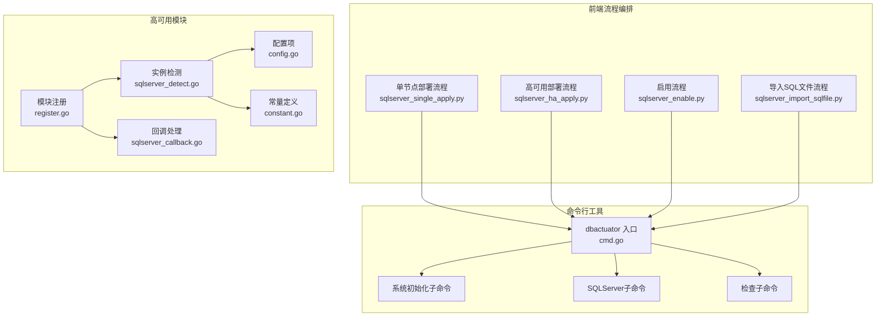
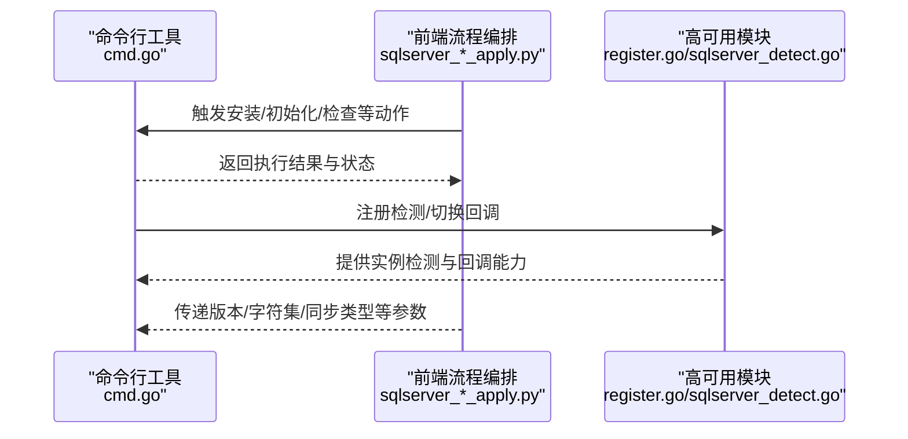
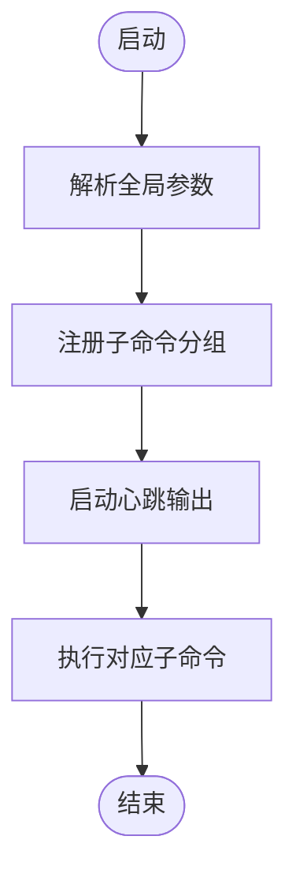
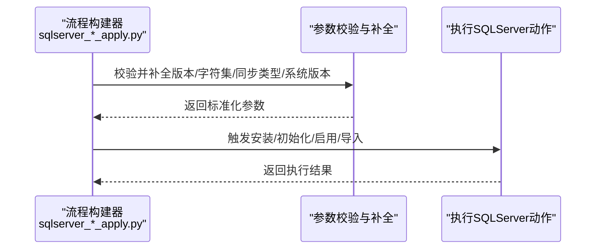
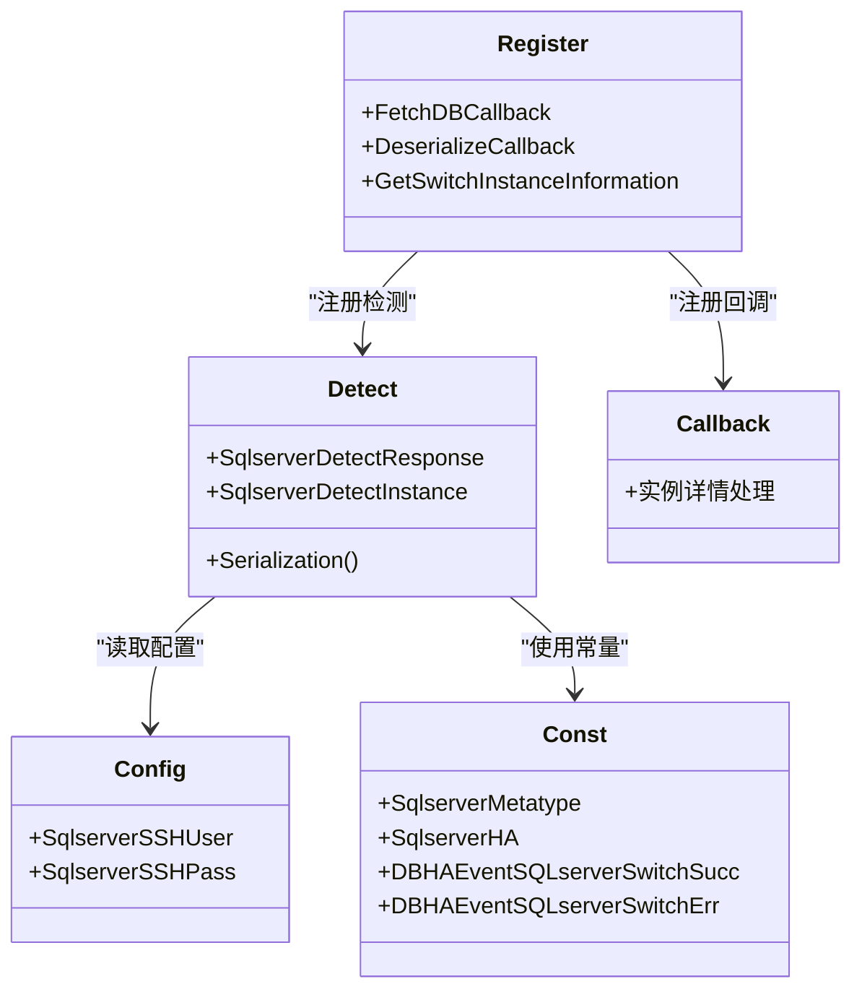
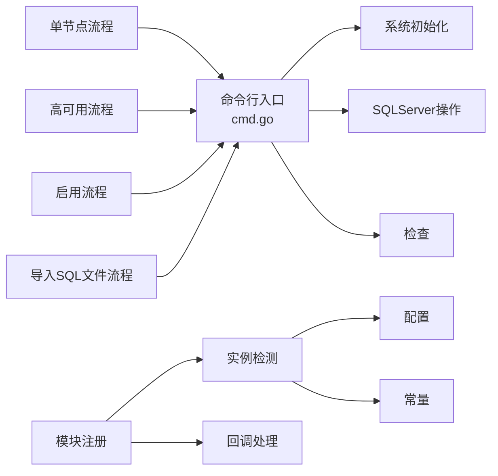

# SQLServer安装配置

<cite>
**本文引用的文件**
- [cmd.go](file://dbm-services/sqlserver/db-tools/dbactuator/cmd/cmd.go)
- [sqlserver.go](file://dbm-services/sqlserver/db-tools/dbactuator/pkg/components/sqlserver/sqlserver.go)
- [sqlserver_ha_apply.py](file://dbm-ui/backend/ticket/builders/sqlserver/sqlserver_ha_apply.py)
- [sqlserver_single_apply.py](file://dbm-ui/backend/ticket/builders/sqlserver/sqlserver_single_apply.py)
- [sqlserver_enable.py](file://dbm-ui/backend/ticket/builders/sqlserver/sqlserver_enable.py)
- [sqlserver_import_sqlfile.py](file://dbm-ui/backend/ticket/builders/sqlserver/sqlserver_import_sqlfile.py)
- [register.go](file://dbm-services/common/dbha/ha-module/dbmodule/register.go)
- [sqlserver_detect.go](file://dbm-services/common/dbha/ha-module/dbmodule/sqlserver/sqlserver_detect.go)
- [sqlserver_callback.go](file://dbm-services/common/dbha/ha-module/dbmodule/sqlserver/sqlserver_callback.go)
- [config.go](file://dbm-services/common/dbha/ha-module/config/config.go)
- [constant.go](file://dbm-services/common/dbha/ha-module/constvar/constant.go)
</cite>

## 目录
1. [简介](#简介)
2. [项目结构](#项目结构)
3. [核心组件](#核心组件)
4. [架构总览](#架构总览)
5. [详细组件分析](#详细组件分析)
6. [依赖分析](#依赖分析)
7. [性能考虑](#性能考虑)
8. [故障排查指南](#故障排查指南)
9. [结论](#结论)
10. [附录](#附录)

## 简介
本文件面向在Windows Server环境下进行SQLServer安装与配置的工程实践，结合仓库中的命令行工具与前端流程编排能力，系统化梳理从系统要求检查、安装参数配置、实例初始化到高可用前置准备的完整路径。文档同时覆盖安装命令使用方法、配置文件格式与关键参数、服务账户与网络配置要求、版本兼容性与性能优化建议，并提供安装失败的常见原因与解决方案，以及安装后的验证与基础配置检查清单。

## 项目结构
SQLServer安装相关能力由“命令行工具（dbactuator）+ 前端流程编排（dbm-ui）+ 高可用模块（dbha）”三部分协同完成：
- 命令行工具：提供统一入口与子命令分组，支持系统初始化、SQLServer操作与检查等。
- 前端流程编排：通过工单与流程构建器定义SQLServer单节点与高可用部署、启用、导入SQL文件等场景。
- 高可用模块：提供检测、切换、回调等能力，支撑安装后高可用前置准备与运维自动化。

**图表来源**
- [cmd.go:67-143](file://dbm-services/sqlserver/db-tools/dbactuator/cmd/cmd.go#L67-L143)
- [sqlserver_ha_apply.py:115-128](file://dbm-ui/backend/ticket/builders/sqlserver/sqlserver_ha_apply.py#L115-L128)
- [sqlserver_single_apply.py:236-252](file://dbm-ui/backend/ticket/builders/sqlserver/sqlserver_single_apply.py#L236-L252)
- [sqlserver_enable.py:27-40](file://dbm-ui/backend/ticket/builders/sqlserver/sqlserver_enable.py#L27-L40)
- [sqlserver_import_sqlfile.py:39-61](file://dbm-ui/backend/ticket/builders/sqlserver/sqlserver_import_sqlfile.py#L39-L61)
- [register.go:9-97](file://dbm-services/common/dbha/ha-module/dbmodule/register.go#L9-L97)
- [sqlserver_detect.go:10-120](file://dbm-services/common/dbha/ha-module/dbmodule/sqlserver/sqlserver_detect.go#L10-L120)
- [sqlserver_callback.go:10-70](file://dbm-services/common/dbha/ha-module/dbmodule/sqlserver/sqlserver_callback.go#L10-L70)
- [config.go:148-190](file://dbm-services/common/dbha/ha-module/config/config.go#L148-L190)
- [constant.go:62-379](file://dbm-services/common/dbha/ha-module/constvar/constant.go#L62-L379)

**章节来源**
- [cmd.go:67-143](file://dbm-services/sqlserver/db-tools/dbactuator/cmd/cmd.go#L67-L143)
- [sqlserver_ha_apply.py:115-128](file://dbm-ui/backend/ticket/builders/sqlserver/sqlserver_ha_apply.py#L115-L128)
- [sqlserver_single_apply.py:236-252](file://dbm-ui/backend/ticket/builders/sqlserver/sqlserver_single_apply.py#L236-L252)
- [sqlserver_enable.py:27-40](file://dbm-ui/backend/ticket/builders/sqlserver/sqlserver_enable.py#L27-L40)
- [sqlserver_import_sqlfile.py:39-61](file://dbm-ui/backend/ticket/builders/sqlserver/sqlserver_import_sqlfile.py#L39-L61)
- [register.go:9-97](file://dbm-services/common/dbha/ha-module/dbmodule/register.go#L9-L97)
- [sqlserver_detect.go:10-120](file://dbm-services/common/dbha/ha-module/dbmodule/sqlserver/sqlserver_detect.go#L10-L120)
- [sqlserver_callback.go:10-70](file://dbm-services/common/dbha/ha-module/dbmodule/sqlserver/sqlserver_callback.go#L10-L70)
- [config.go:148-190](file://dbm-services/common/dbha/ha-module/config/config.go#L148-L190)
- [constant.go:62-379](file://dbm-services/common/dbha/ha-module/constvar/constant.go#L62-L379)

## 核心组件
- 命令行入口与子命令分组
  - 入口负责解析全局参数、设置日志与心跳输出，并按组注册系统初始化、SQLServer操作与检查三类子命令。
  - 关键参数包括通用负载、扩展负载文件、回滚负载、单据/流程/节点/版本ID、是否回滚、帮助开关等。
- SQLServer组件包
  - 当前组件包文件存在但内容为空，表明SQLServer安装逻辑可能以子命令形式实现，或位于其他模块中。
- 前端流程编排
  - 单节点与高可用部署流程：自动补充数据库版本、字符集、同步类型与系统版本等参数。
  - 启用流程：用于在线态开启集群。
  - 导入SQL文件流程：定义导入模式、备份策略与字符集等参数。
- 高可用模块
  - 模块注册：将SQLServer检测与切换回调注册到统一框架。
  - 实例检测：封装连接检测、超时重试与序列化响应。
  - 回调处理：用于角色切换、实例信息获取与序列化。
  - 配置与常量：提供SQLServer SSH用户/密码、事件常量与元数据类型等。

**章节来源**
- [cmd.go:67-143](file://dbm-services/sqlserver/db-tools/dbactuator/cmd/cmd.go#L67-L143)
- [sqlserver.go:1-13](file://dbm-services/sqlserver/db-tools/dbactuator/pkg/components/sqlserver/sqlserver.go#L1-L13)
- [sqlserver_ha_apply.py:115-128](file://dbm-ui/backend/ticket/builders/sqlserver/sqlserver_ha_apply.py#L115-L128)
- [sqlserver_single_apply.py:236-252](file://dbm-ui/backend/ticket/builders/sqlserver/sqlserver_single_apply.py#L236-L252)
- [sqlserver_enable.py:27-40](file://dbm-ui/backend/ticket/builders/sqlserver/sqlserver_enable.py#L27-L40)
- [sqlserver_import_sqlfile.py:39-61](file://dbm-ui/backend/ticket/builders/sqlserver/sqlserver_import_sqlfile.py#L39-L61)
- [register.go:9-97](file://dbm-services/common/dbha/ha-module/dbmodule/register.go#L9-L97)
- [sqlserver_detect.go:10-120](file://dbm-services/common/dbha/ha-module/dbmodule/sqlserver/sqlserver_detect.go#L10-L120)
- [sqlserver_callback.go:10-70](file://dbm-services/common/dbha/ha-module/dbmodule/sqlserver/sqlserver_callback.go#L10-L70)
- [config.go:148-190](file://dbm-services/common/dbha/ha-module/config/config.go#L148-L190)
- [constant.go:62-379](file://dbm-services/common/dbha/ha-module/constvar/constant.go#L62-L379)

## 架构总览
下图展示从命令行到前端流程再到高可用模块的整体交互关系，体现SQLServer安装配置的端到端路径。

**图表来源**
- [cmd.go:67-143](file://dbm-services/sqlserver/db-tools/dbactuator/cmd/cmd.go#L67-L143)
- [sqlserver_ha_apply.py:115-128](file://dbm-ui/backend/ticket/builders/sqlserver/sqlserver_ha_apply.py#L115-L128)
- [sqlserver_single_apply.py:236-252](file://dbm-ui/backend/ticket/builders/sqlserver/sqlserver_single_apply.py#L236-L252)
- [register.go:9-97](file://dbm-services/common/dbha/ha-module/dbmodule/register.go#L9-L97)
- [sqlserver_detect.go:10-120](file://dbm-services/common/dbha/ha-module/dbmodule/sqlserver/sqlserver_detect.go#L10-L120)

## 详细组件分析

### 命令行入口与参数
- 全局参数
  - 通用负载、扩展负载文件、回滚负载、单据ID、流程ID、节点ID、版本ID、是否回滚、帮助开关等。
- 子命令分组
  - 系统初始化、SQLServer操作、检查。
- 心跳输出
  - 定期向标准输入输出心跳日志，便于监控与诊断。

**图表来源**
- [cmd.go:67-143](file://dbm-services/sqlserver/db-tools/dbactuator/cmd/cmd.go#L67-L143)

**章节来源**
- [cmd.go:67-143](file://dbm-services/sqlserver/db-tools/dbactuator/cmd/cmd.go#L67-L143)

### 前端流程编排（单节点/高可用/启用/导入）
- 单节点部署
  - 自动补全数据库版本、字符集、同步类型与系统版本等字段，确保安装参数一致性。
- 高可用部署
  - 继承单节点流程，标记集群类型为高可用，并在资源申请与后续流程中体现。
- 启用流程
  - 将控制器指向集群启用场景，配合权限与重试机制。
- 导入SQL文件流程
  - 定义导入模式、备份位置与文件标签、字符集等参数，保障导入过程可控。

**图表来源**
- [sqlserver_ha_apply.py:115-128](file://dbm-ui/backend/ticket/builders/sqlserver/sqlserver_ha_apply.py#L115-L128)
- [sqlserver_single_apply.py:236-252](file://dbm-ui/backend/ticket/builders/sqlserver/sqlserver_single_apply.py#L236-L252)
- [sqlserver_enable.py:27-40](file://dbm-ui/backend/ticket/builders/sqlserver/sqlserver_enable.py#L27-L40)
- [sqlserver_import_sqlfile.py:39-61](file://dbm-ui/backend/ticket/builders/sqlserver/sqlserver_import_sqlfile.py#L39-L61)

**章节来源**
- [sqlserver_ha_apply.py:115-128](file://dbm-ui/backend/ticket/builders/sqlserver/sqlserver_ha_apply.py#L115-L128)
- [sqlserver_single_apply.py:236-252](file://dbm-ui/backend/ticket/builders/sqlserver/sqlserver_single_apply.py#L236-L252)
- [sqlserver_enable.py:27-40](file://dbm-ui/backend/ticket/builders/sqlserver/sqlserver_enable.py#L27-L40)
- [sqlserver_import_sqlfile.py:39-61](file://dbm-ui/backend/ticket/builders/sqlserver/sqlserver_import_sqlfile.py#L39-L61)

### 高可用模块（检测/切换/回调）
- 模块注册
  - 将SQLServer实例的回调、反序列化与切换实例信息注册到统一框架，便于后续运维动作。
- 实例检测
  - 封装连接检测、超时重试与响应序列化，支撑安装后健康检查与前置准备。
- 回调处理
  - 处理角色切换、实例信息获取与序列化，保证高可用切换的可追溯性。
- 配置与常量
  - 提供SQLServer SSH用户/密码、事件常量与元数据类型等，支撑跨模块协作。

**图表来源**
- [register.go:9-97](file://dbm-services/common/dbha/ha-module/dbmodule/register.go#L9-L97)
- [sqlserver_detect.go:10-120](file://dbm-services/common/dbha/ha-module/dbmodule/sqlserver/sqlserver_detect.go#L10-L120)
- [sqlserver_callback.go:10-70](file://dbm-services/common/dbha/ha-module/dbmodule/sqlserver/sqlserver_callback.go#L10-L70)
- [config.go:148-190](file://dbm-services/common/dbha/ha-module/config/config.go#L148-L190)
- [constant.go:62-379](file://dbm-services/common/dbha/ha-module/constvar/constant.go#L62-L379)

**章节来源**
- [register.go:9-97](file://dbm-services/common/dbha/ha-module/dbmodule/register.go#L9-L97)
- [sqlserver_detect.go:10-120](file://dbm-services/common/dbha/ha-module/dbmodule/sqlserver/sqlserver_detect.go#L10-L120)
- [sqlserver_callback.go:10-70](file://dbm-services/common/dbha/ha-module/dbmodule/sqlserver/sqlserver_callback.go#L10-L70)
- [config.go:148-190](file://dbm-services/common/dbha/ha-module/config/config.go#L148-L190)
- [constant.go:62-379](file://dbm-services/common/dbha/ha-module/constvar/constant.go#L62-L379)

## 依赖分析
- 命令行工具对子命令与公共组件的依赖清晰，通过分组管理不同领域的操作。
- 前端流程编排依赖命令行工具提供的安装/初始化/检查能力，并在参数层面进行标准化。
- 高可用模块通过注册机制与检测/回调能力，为SQLServer安装后的前置准备提供支撑。

**图表来源**
- [cmd.go:67-143](file://dbm-services/sqlserver/db-tools/dbactuator/cmd/cmd.go#L67-L143)
- [sqlserver_ha_apply.py:115-128](file://dbm-ui/backend/ticket/builders/sqlserver/sqlserver_ha_apply.py#L115-L128)
- [sqlserver_single_apply.py:236-252](file://dbm-ui/backend/ticket/builders/sqlserver/sqlserver_single_apply.py#L236-L252)
- [sqlserver_enable.py:27-40](file://dbm-ui/backend/ticket/builders/sqlserver/sqlserver_enable.py#L27-L40)
- [sqlserver_import_sqlfile.py:39-61](file://dbm-ui/backend/ticket/builders/sqlserver/sqlserver_import_sqlfile.py#L39-L61)
- [register.go:9-97](file://dbm-services/common/dbha/ha-module/dbmodule/register.go#L9-L97)
- [sqlserver_detect.go:10-120](file://dbm-services/common/dbha/ha-module/dbmodule/sqlserver/sqlserver_detect.go#L10-L120)
- [config.go:148-190](file://dbm-services/common/dbha/ha-module/config/config.go#L148-L190)
- [constant.go:62-379](file://dbm-services/common/dbha/ha-module/constvar/constant.go#L62-L379)

**章节来源**
- [cmd.go:67-143](file://dbm-services/sqlserver/db-tools/dbactuator/cmd/cmd.go#L67-L143)
- [sqlserver_ha_apply.py:115-128](file://dbm-ui/backend/ticket/builders/sqlserver/sqlserver_ha_apply.py#L115-L128)
- [sqlserver_single_apply.py:236-252](file://dbm-ui/backend/ticket/builders/sqlserver/sqlserver_single_apply.py#L236-L252)
- [sqlserver_enable.py:27-40](file://dbm-ui/backend/ticket/builders/sqlserver/sqlserver_enable.py#L27-L40)
- [sqlserver_import_sqlfile.py:39-61](file://dbm-ui/backend/ticket/builders/sqlserver/sqlserver_import_sqlfile.py#L39-L61)
- [register.go:9-97](file://dbm-services/common/dbha/ha-module/dbmodule/register.go#L9-L97)
- [sqlserver_detect.go:10-120](file://dbm-services/common/dbha/ha-module/dbmodule/sqlserver/sqlserver_detect.go#L10-L120)
- [config.go:148-190](file://dbm-services/common/dbha/ha-module/config/config.go#L148-L190)
- [constant.go:62-379](file://dbm-services/common/dbha/ha-module/constvar/constant.go#L62-L379)

## 性能考虑
- 安装阶段
  - 合理规划磁盘I/O与内存占用，避免在安装过程中并发执行大量IO密集型任务。
  - 使用SSD存储以提升安装与初始化速度；确保临时目录空间充足。
- 运维阶段
  - 高可用前置准备应尽量缩短切换窗口，减少对业务的影响。
  - 在导入SQL文件等批量操作期间，合理安排时段并监控锁等待与阻塞情况。
- 参数优化
  - 根据业务峰值调整缓冲池大小、最大服务器内存等关键参数，结合监控指标持续优化。

## 故障排查指南
- 安装失败的常见原因
  - 权限不足：服务账户缺少必要权限，导致安装程序无法写入系统目录或注册表。
  - 端口冲突：SQLServer默认端口被占用，或防火墙未放行相应端口。
  - 磁盘空间不足：临时目录或数据目录空间不足，导致安装中断。
  - 版本不兼容：操作系统版本与SQLServer版本不匹配，或缺少必要的运行库。
  - 网络配置错误：主机名解析异常、域账户认证失败或网络隔离导致检测失败。
- 解决方案
  - 使用专用服务账户并赋予“作为服务登录”、“在本地系统上注册为服务”等权限。
  - 打开SQLServer端口（默认1433及相关端口），并在安全组/防火墙中放行。
  - 清理临时目录与数据目录空间，确保满足最低容量要求。
  - 核对操作系统与SQLServer版本兼容性，安装所需运行库（如.NET Framework）。
  - 校验DNS解析、域账户凭据与网络连通性，确保高可用检测与切换正常。
- 安装后验证
  - 通过命令行工具执行检查子命令，确认实例状态、端口监听与基本连通性。
  - 在高可用模块中触发检测流程，验证实例信息与切换回调可用性。
  - 对比前端流程编排中传入的版本/字符集/同步类型等参数，确保与安装一致。

**章节来源**
- [cmd.go:67-143](file://dbm-services/sqlserver/db-tools/dbactuator/cmd/cmd.go#L67-L143)
- [sqlserver_detect.go:10-120](file://dbm-services/common/dbha/ha-module/dbmodule/sqlserver/sqlserver_detect.go#L10-L120)
- [sqlserver_ha_apply.py:115-128](file://dbm-ui/backend/ticket/builders/sqlserver/sqlserver_ha_apply.py#L115-L128)
- [sqlserver_single_apply.py:236-252](file://dbm-ui/backend/ticket/builders/sqlserver/sqlserver_single_apply.py#L236-L252)

## 结论
通过命令行工具、前端流程编排与高可用模块的协同，SQLServer安装配置实现了从参数标准化、安装执行到高可用前置准备的闭环。建议在Windows Server环境中严格遵循服务账户、防火墙与网络配置要求，结合版本兼容性与性能优化策略，确保安装过程稳定可靠，并在安装后通过检查与检测流程完成基础验证。

## 附录
- 安装命令使用要点
  - 使用命令行入口提供的子命令分组执行安装、初始化与检查。
  - 通过全局参数传递通用/扩展负载与回滚策略，确保可追溯与可恢复。
- 配置文件与参数
  - 前端流程编排会自动补全版本、字符集、同步类型与系统版本等关键参数。
  - 高可用模块配置包含SSH用户/密码等运维访问参数，需按需配置。
- Windows Server环境建议
  - 使用域账户与强密码策略，确保服务账户具备最小权限原则。
  - 开启必要的Windows防火墙规则与安全组放行，避免端口阻断。
  - 预留充足的磁盘空间与内存，满足安装与运行峰值需求。