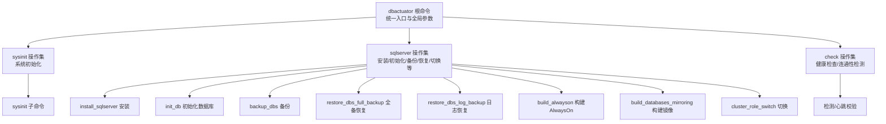
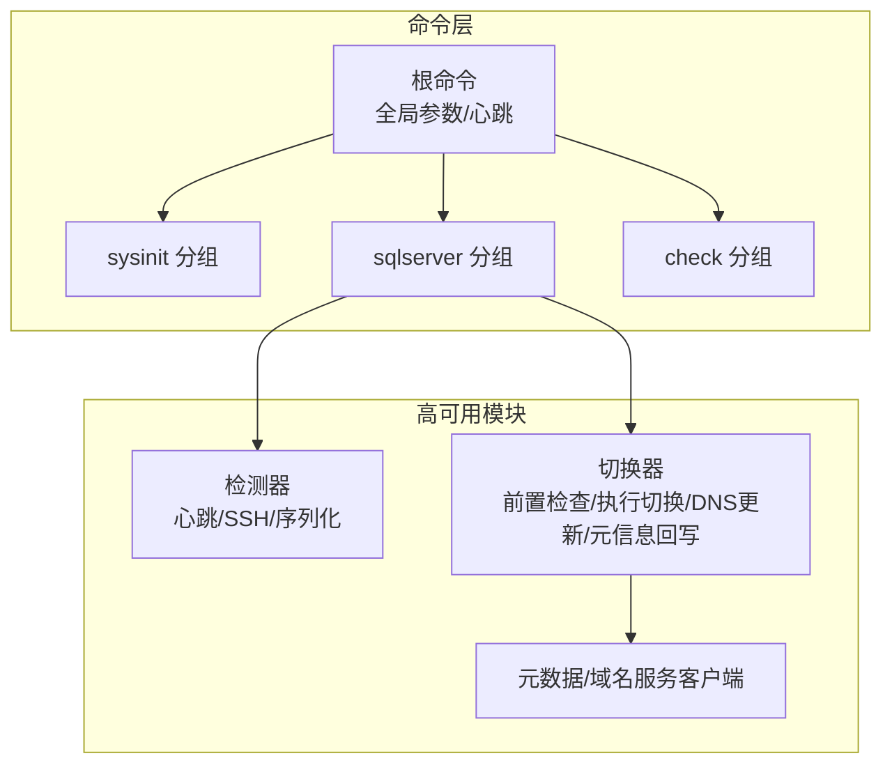
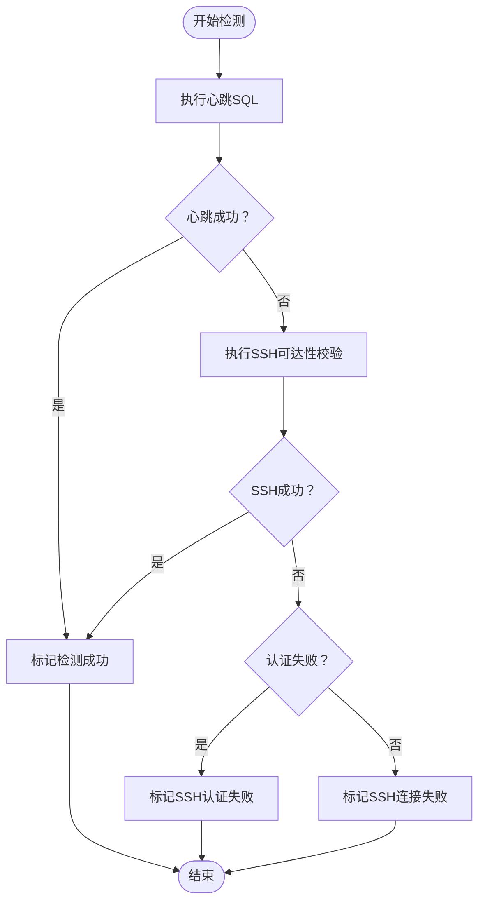
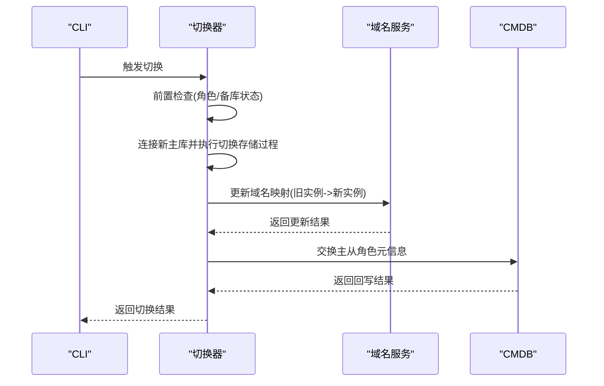
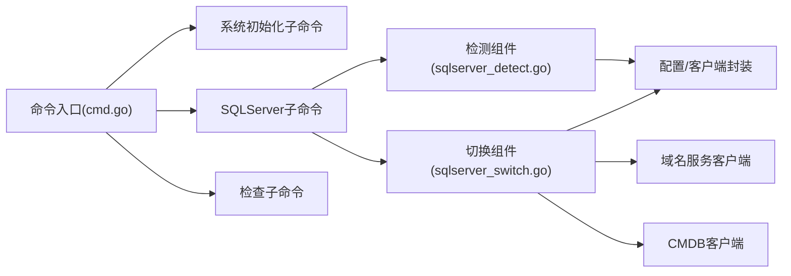

# SQLServer数据库工具

<cite>
**本文引用的文件**
- [cmd.go](file://dbm-services/sqlserver/db-tools/dbactuator/cmd/cmd.go)
- [dbactuator.md](file://dbm-services/sqlserver/db-tools/dbactuator/docs/dbactuator.md)
- [sqlserver_callback.go](file://dbm-services/common/dbha/ha-module/dbmodule/sqlserver/sqlserver_callback.go)
- [sqlserver_detect.go](file://dbm-services/common/dbha/ha-module/dbmodule/sqlserver/sqlserver_detect.go)
- [sqlserver_switch.go](file://dbm-services/common/dbha/ha-module/dbmodule/sqlserver/sqlserver_switch.go)
</cite>

## 目录
1. [简介](#简介)
2. [项目结构](#项目结构)
3. [核心组件](#核心组件)
4. [架构总览](#架构总览)
5. [详细组件分析](#详细组件分析)
6. [依赖关系分析](#依赖关系分析)
7. [性能与可靠性考量](#性能与可靠性考量)
8. [故障排查指南](#故障排查指南)
9. [结论](#结论)
10. [附录](#附录)

## 简介
本文件面向SQLServer数据库运维与自动化团队，系统化梳理SQLServer dbactuator工具的完整能力边界与使用方法，覆盖安装、初始化、检查、备份恢复、集群切换等关键场景；同时结合高可用模块中的检测、切换与元数据交互能力，给出参数说明、命令示例、配置要点、错误处理与最佳实践，帮助在Windows环境下实现高可用部署、灾难恢复与性能调优。

## 项目结构
SQLServer dbactuator采用命令分组组织：系统初始化、SQLServer操作、检查命令三大类，通过Cobra框架统一入口管理。整体结构清晰，便于扩展新的子命令与组件。

图表来源
- [cmd.go:67-143](file://dbm-services/sqlserver/db-tools/dbactuator/cmd/cmd.go#L67-L143)

章节来源
- [cmd.go:67-143](file://dbm-services/sqlserver/db-tools/dbactuator/cmd/cmd.go#L67-L143)
- [dbactuator.md:14-29](file://dbm-services/sqlserver/db-tools/dbactuator/docs/dbactuator.md#L14-L29)

## 核心组件
- 命令入口与分组
  - 根命令负责全局参数（如通用负载、扩展负载文件、回滚负载、流程ID、节点ID、版本ID、是否回滚、帮助开关）注入与心跳输出。
  - 通过命令分组将“系统初始化”“SQLServer操作”“检查”三类子命令归档，便于扩展与维护。
- 高可用检测与切换
  - 提供SQLServer实例检测、SSH可达性校验、心跳写入、序列化上报、故障实例反序列化、切换前置检查、执行切换、DNS更新、元信息回写等能力。
- 工具化子命令
  - 包含安装、初始化、备份、恢复、构建AlwaysOn、构建镜像、集群角色切换、清理、克隆权限/作业/链接服务器/过滤配置、重命名数据库等子命令，满足日常运维与灾备场景。

章节来源
- [cmd.go:67-143](file://dbm-services/sqlserver/db-tools/dbactuator/cmd/cmd.go#L67-L143)
- [sqlserver_detect.go:68-119](file://dbm-services/common/dbha/ha-module/dbmodule/sqlserver/sqlserver_detect.go#L68-L119)
- [sqlserver_switch.go:67-103](file://dbm-services/common/dbha/ha-module/dbmodule/sqlserver/sqlserver_switch.go#L67-L103)

## 架构总览
dbactuator以“命令分组 + 子命令 + 组件化执行”的方式组织，配合高可用模块的检测与切换逻辑，形成从安装到高可用切换的闭环。

图表来源
- [cmd.go:67-143](file://dbm-services/sqlserver/db-tools/dbactuator/cmd/cmd.go#L67-L143)
- [sqlserver_detect.go:137-171](file://dbm-services/common/dbha/ha-module/dbmodule/sqlserver/sqlserver_detect.go#L137-L171)
- [sqlserver_switch.go:105-159](file://dbm-services/common/dbha/ha-module/dbmodule/sqlserver/sqlserver_switch.go#L105-L159)

## 详细组件分析

### 命令入口与全局参数
- 全局参数
  - 通用负载、扩展负载文件、回滚负载、单据ID、流程ID、节点ID、版本ID、是否回滚、帮助开关。
- 心跳输出
  - 定期向标准输入输出心跳，便于上层编排感知任务状态。
- 命令分组
  - 将系统初始化、SQLServer操作、检查三类命令按组注册，提升可维护性。

章节来源
- [cmd.go:67-143](file://dbm-services/sqlserver/db-tools/dbactuator/cmd/cmd.go#L67-L143)
- [cmd.go:150-164](file://dbm-services/sqlserver/db-tools/dbactuator/cmd/cmd.go#L150-L164)

### 检测组件（心跳/SSH/序列化）
- 检测流程
  - 并发执行心跳SQL写入，超时则进行SSH可达性校验；成功则标记状态为“成功”，否则根据SSH错误类型区分认证失败或连接失败。
- 心跳SQL
  - 在Monitor库的CHECK_HEARTBEAT表中写入当前时间，作为轻量级存活信号。
- 序列化
  - 将检测结果序列化为JSON上报，供上层GM模块消费。

图表来源
- [sqlserver_detect.go:73-119](file://dbm-services/common/dbha/ha-module/dbmodule/sqlserver/sqlserver_detect.go#L73-L119)
- [sqlserver_detect.go:137-171](file://dbm-services/common/dbha/ha-module/dbmodule/sqlserver/sqlserver_detect.go#L137-L171)

章节来源
- [sqlserver_detect.go:68-119](file://dbm-services/common/dbha/ha-module/dbmodule/sqlserver/sqlserver_detect.go#L68-L119)
- [sqlserver_detect.go:121-135](file://dbm-services/common/dbha/ha-module/dbmodule/sqlserver/sqlserver_detect.go#L121-L135)

### 切换组件（前置检查/执行切换/DNS更新/元信息回写）
- 前置检查
  - 若实例为从库或中继，直接跳过；若为主库且存在可用备库，则记录备库IP/端口，准备切换。
- 执行切换
  - 连接新主库，调用存储过程执行切换；随后更新域名服务，将旧实例映射替换为新实例。
- 元信息回写
  - 通过CMDB交换SQLServer主从角色元信息，确保后续编排一致。

图表来源
- [sqlserver_switch.go:67-103](file://dbm-services/common/dbha/ha-module/dbmodule/sqlserver/sqlserver_switch.go#L67-L103)
- [sqlserver_switch.go:105-159](file://dbm-services/common/dbha/ha-module/dbmodule/sqlserver/sqlserver_switch.go#L105-L159)
- [sqlserver_switch.go:167-178](file://dbm-services/common/dbha/ha-module/dbmodule/sqlserver/sqlserver_switch.go#L167-L178)

章节来源
- [sqlserver_switch.go:67-103](file://dbm-services/common/dbha/ha-module/dbmodule/sqlserver/sqlserver_switch.go#L67-L103)
- [sqlserver_switch.go:105-159](file://dbm-services/common/dbha/ha-module/dbmodule/sqlserver/sqlserver_switch.go#L105-L159)
- [sqlserver_switch.go:167-178](file://dbm-services/common/dbha/ha-module/dbmodule/sqlserver/sqlserver_switch.go#L167-L178)

### 高可用回调与实例转换
- 从CMDB拉取实例列表后，按最小端口去重，构造检测实例；支持Agent上报与GM上报两种反序列化路径，统一为检测实例对象。
- 支持切换实例的构造，包含角色、备库、绑定入口等信息。

章节来源
- [sqlserver_callback.go:25-43](file://dbm-services/common/dbha/ha-module/dbmodule/sqlserver/sqlserver_callback.go#L25-L43)
- [sqlserver_callback.go:57-93](file://dbm-services/common/dbha/ha-module/dbmodule/sqlserver/sqlserver_callback.go#L57-L93)
- [sqlserver_callback.go:95-135](file://dbm-services/common/dbha/ha-module/dbmodule/sqlserver/sqlserver_callback.go#L95-L135)

## 依赖关系分析
- 命令层依赖
  - 根命令通过Cobra注册三大分组，分组内子命令按功能拆分，降低耦合度。
- 高可用模块依赖
  - 检测与切换组件依赖配置模块（DB/SSH/Agent/域名服务/C MDB），并通过客户端封装对外服务调用。
- 数据流
  - 检测组件将结果序列化上报；切换组件在执行切换后更新域名与元信息，形成闭环。

图表来源
- [cmd.go:67-143](file://dbm-services/sqlserver/db-tools/dbactuator/cmd/cmd.go#L67-L143)
- [sqlserver_detect.go:137-171](file://dbm-services/common/dbha/ha-module/dbmodule/sqlserver/sqlserver_detect.go#L137-L171)
- [sqlserver_switch.go:105-159](file://dbm-services/common/dbha/ha-module/dbmodule/sqlserver/sqlserver_switch.go#L105-L159)

章节来源
- [cmd.go:67-143](file://dbm-services/sqlserver/db-tools/dbactuator/cmd/cmd.go#L67-L143)
- [sqlserver_detect.go:137-171](file://dbm-services/common/dbha/ha-module/dbmodule/sqlserver/sqlserver_detect.go#L137-L171)
- [sqlserver_switch.go:105-159](file://dbm-services/common/dbha/ha-module/dbmodule/sqlserver/sqlserver_switch.go#L105-L159)

## 性能与可靠性考量
- 检测并发与资源泄漏
  - 检测阶段使用goroutine执行心跳SQL，需注意超时控制与连接关闭，避免协程堆积与连接泄漏。
- 超时与重试
  - 检测超时阈值与重试次数应结合网络与实例负载合理设置，避免误判。
- DNS与元信息一致性
  - 切换完成后务必验证域名解析与CMDB元信息同步，确保业务流量正确指向新主库。
- Windows环境注意事项
  - SSH路径与文件操作需使用双反斜杠转义；心跳写入目标路径需在目标主机预先创建或具备写权限。

章节来源
- [sqlserver_detect.go:73-119](file://dbm-services/common/dbha/ha-module/dbmodule/sqlserver/sqlserver_detect.go#L73-L119)
- [sqlserver_detect.go:137-171](file://dbm-services/common/dbha/ha-module/dbmodule/sqlserver/sqlserver_detect.go#L137-L171)
- [sqlserver_switch.go:105-159](file://dbm-services/common/dbha/ha-module/dbmodule/sqlserver/sqlserver_switch.go#L105-L159)

## 故障排查指南
- 常见问题定位
  - 检测失败：优先检查DB连接与心跳SQL执行权限；若SSH失败，区分认证失败与连接失败，分别处理凭据与网络策略。
  - 切换失败：确认新主库连通性与存储过程可用；检查域名更新与CMDB元信息回写是否成功。
- 日志与心跳
  - 使用心跳输出定位长时间无输出的任务；结合日志级别定位具体阶段。
- 参数核对
  - 确认通用负载、扩展负载文件、回滚负载、流程ID、节点ID、版本ID等参数是否正确传入。

章节来源
- [cmd.go:50-65](file://dbm-services/sqlserver/db-tools/dbactuator/cmd/cmd.go#L50-L65)
- [cmd.go:150-164](file://dbm-services/sqlserver/db-tools/dbactuator/cmd/cmd.go#L150-L164)
- [sqlserver_detect.go:85-118](file://dbm-services/common/dbha/ha-module/dbmodule/sqlserver/sqlserver_detect.go#L85-L118)
- [sqlserver_switch.go:105-159](file://dbm-services/common/dbha/ha-module/dbmodule/sqlserver/sqlserver_switch.go#L105-L159)

## 结论
SQLServer dbactuator围绕“命令分组 + 子命令 + 组件化执行”的架构，提供了从安装、初始化、检查、备份恢复到高可用切换的全链路能力。结合高可用模块的检测与切换逻辑，可在Windows环境下实现稳定可靠的高可用部署与灾备演练。建议在生产环境中严格校验参数、完善超时与重试策略，并在切换前后验证DNS与元信息一致性。

## 附录

### 命令与参数速查
- 根命令与全局参数
  - 通用负载、扩展负载文件、回滚负载、单据ID、流程ID、节点ID、版本ID、是否回滚、帮助开关。
- 命令分组
  - sysinit：系统初始化
  - sqlserver：安装/初始化/备份/恢复/切换等
  - check：健康检查/连通性检测
- 示例（命令路径）
  - 安装：参见 [install_sqlserver.go](file://dbm-services/sqlserver/db-tools/dbactuator/internal/subcmd/sqlservercmd/install_sqlserver.go)
  - 初始化：参见 [init_db.go](file://dbm-services/sqlserver/db-tools/dbactuator/internal/subcmd/sqlservercmd/init_db.go)
  - 备份：参见 [backup_dbs.go](file://dbm-services/sqlserver/db-tools/dbactuator/internal/subcmd/sqlservercmd/backup_dbs.go)
  - 全备恢复：参见 [restore_dbs_full_backup.go](file://dbm-services/sqlserver/db-tools/dbactuator/internal/subcmd/sqlservercmd/restore_dbs_full_backup.go)
  - 日志恢复：参见 [restore_dbs_log_backup.go](file://dbm-services/sqlserver/db-tools/dbactuator/internal/subcmd/sqlservercmd/restore_dbs_log_backup.go)
  - 构建AlwaysOn：参见 [build_alwayson.go](file://dbm-services/sqlserver/db-tools/dbactuator/internal/subcmd/sqlservercmd/build_alwayson.go)
  - 构建镜像：参见 [build_databases_mirroring.go](file://dbm-services/sqlserver/db-tools/dbactuator/internal/subcmd/sqlservercmd/build_databases_mirroring.go)
  - 集群切换：参见 [cluster_role_switch.go](file://dbm-services/sqlserver/db-tools/dbactuator/internal/subcmd/sqlservercmd/cluster_role_switch.go)

章节来源
- [cmd.go:67-143](file://dbm-services/sqlserver/db-tools/dbactuator/cmd/cmd.go#L67-L143)
- [dbactuator.md:14-29](file://dbm-services/sqlserver/db-tools/dbactuator/docs/dbactuator.md#L14-L29)