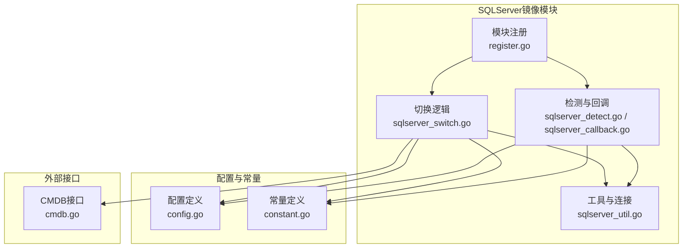
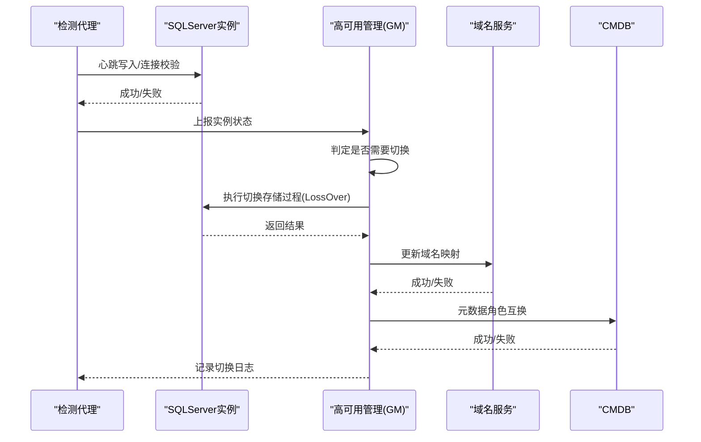
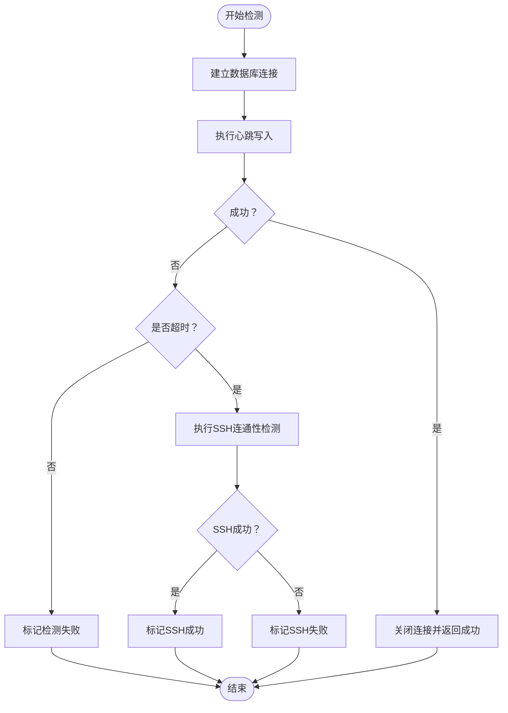
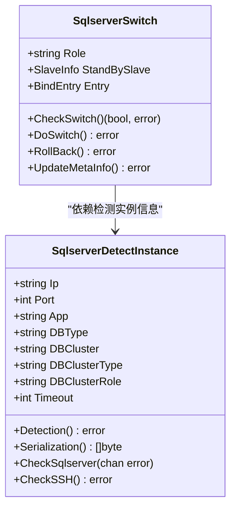
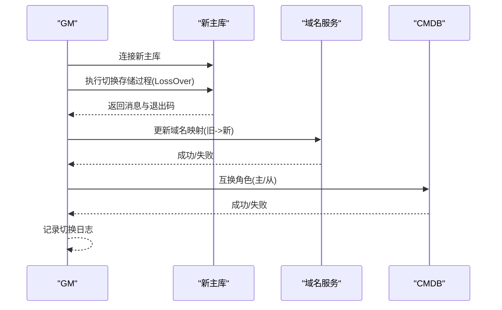
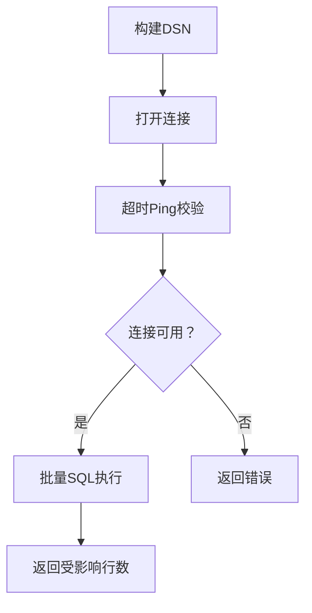
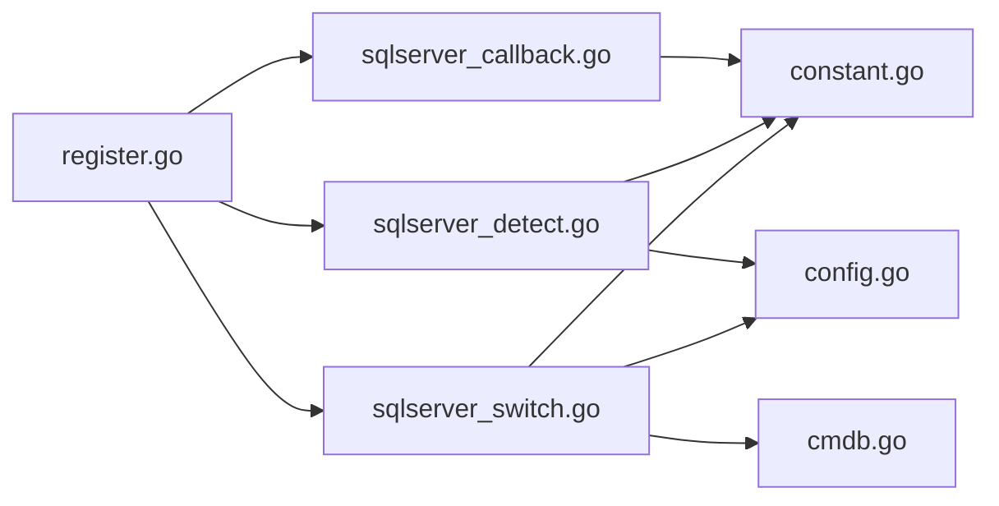

# SQLServer数据库镜像

<cite>
**本文引用的文件**
- [sqlserver_detect.go](file://dbm-services/common/dbha/ha-module/dbmodule/sqlserver/sqlserver_detect.go)
- [sqlserver_callback.go](file://dbm-services/common/dbha/ha-module/dbmodule/sqlserver/sqlserver_callback.go)
- [sqlserver_switch.go](file://dbm-services/common/dbha/ha-module/dbmodule/sqlserver/sqlserver_switch.go)
- [sqlserver_util.go](file://dbm-services/common/dbha/ha-module/dbmodule/sqlserver/sqlserver_util.go)
- [config.go](file://dbm-services/common/dbha/ha-module/config/config.go)
- [constant.go](file://dbm-services/common/dbha/ha-module/constvar/constant.go)
- [cmdb.go](file://dbm-services/common/dbha/ha-module/client/cmdb.go)
- [register.go](file://dbm-services/common/dbha/ha-module/dbmodule/register.go)
</cite>

## 目录
1. [简介](#简介)
2. [项目结构](#项目结构)
3. [核心组件](#核心组件)
4. [架构总览](#架构总览)
5. [详细组件分析](#详细组件分析)
6. [依赖关系分析](#依赖关系分析)
7. [性能考量](#性能考量)
8. [故障排查指南](#故障排查指南)
9. [结论](#结论)
10. [附录](#附录)

## 简介
本文件面向SQLServer数据库镜像（高可用）场景，基于仓库中的DBHA（数据库高可用）模块，系统性阐述镜像角色识别、心跳检测、故障发现、自动切换流程与元数据更新、DNS域名切换、配置参数与常量定义等能力。文档聚焦以下主题：
- 镜像角色分配与状态监控
- 故障检测与自动切换机制
- 切换执行与回滚策略
- 元数据与域名服务集成
- 配置项与常量说明
- 性能影响与维护建议
- 故障排除与验证方法

## 项目结构
SQLServer镜像能力位于“common/dbha/ha-module”模块中，关键文件组织如下：
- 检测与回调：sqlserver_detect.go、sqlserver_callback.go
- 切换与工具：sqlserver_switch.go、sqlserver_util.go
- 配置与常量：config.go、constant.go
- 元数据与注册：cmdb.go、register.go

图表来源
- [sqlserver_detect.go:1-243](file://dbm-services/common/dbha/ha-module/dbmodule/sqlserver/sqlserver_detect.go#L1-L243)
- [sqlserver_callback.go:1-136](file://dbm-services/common/dbha/ha-module/dbmodule/sqlserver/sqlserver_callback.go#L1-L136)
- [sqlserver_switch.go:1-179](file://dbm-services/common/dbha/ha-module/dbmodule/sqlserver/sqlserver_switch.go#L1-L179)
- [sqlserver_util.go:1-108](file://dbm-services/common/dbha/ha-module/dbmodule/sqlserver/sqlserver_util.go#L1-L108)
- [config.go:140-302](file://dbm-services/common/dbha/ha-module/config/config.go#L140-L302)
- [constant.go:60-259](file://dbm-services/common/dbha/ha-module/constvar/constant.go#L60-L259)
- [cmdb.go:81-291](file://dbm-services/common/dbha/ha-module/client/cmdb.go#L81-L291)
- [register.go:9](file://dbm-services/common/dbha/ha-module/dbmodule/register.go#L9)

章节来源
- [sqlserver_detect.go:1-243](file://dbm-services/common/dbha/ha-module/dbmodule/sqlserver/sqlserver_detect.go#L1-L243)
- [sqlserver_callback.go:1-136](file://dbm-services/common/dbha/ha-module/dbmodule/sqlserver/sqlserver_callback.go#L1-L136)
- [sqlserver_switch.go:1-179](file://dbm-services/common/dbha/ha-module/dbmodule/sqlserver/sqlserver_switch.go#L1-L179)
- [sqlserver_util.go:1-108](file://dbm-services/common/dbha/ha-module/dbmodule/sqlserver/sqlserver_util.go#L1-L108)
- [config.go:140-302](file://dbm-services/common/dbha/ha-module/config/config.go#L140-L302)
- [constant.go:60-259](file://dbm-services/common/dbha/ha-module/constvar/constant.go#L60-L259)
- [cmdb.go:81-291](file://dbm-services/common/dbha/ha-module/client/cmdb.go#L81-L291)
- [register.go:9](file://dbm-services/common/dbha/ha-module/dbmodule/register.go#L9)

## 核心组件
- 检测实例与心跳
  - 基于Monitor库的定时心跳写入，作为存活与可写性检测依据
  - 支持超时控制与重试策略
- 切换实例与流程
  - 通过存储过程触发LossOver切换
  - 更新域名映射并记录切换日志
- 工具与连接
  - 统一的SQLServer连接封装与超时Ping校验
  - 批量SQL执行与查询封装
- 配置与常量
  - SQLServer用户、密码、超时等配置
  - 角色类型、集群类型、URL常量等

章节来源
- [sqlserver_detect.go:28-171](file://dbm-services/common/dbha/ha-module/dbmodule/sqlserver/sqlserver_detect.go#L28-L171)
- [sqlserver_switch.go:23-160](file://dbm-services/common/dbha/ha-module/dbmodule/sqlserver/sqlserver_switch.go#L23-L160)
- [sqlserver_util.go:41-107](file://dbm-services/common/dbha/ha-module/dbmodule/sqlserver/sqlserver_util.go#L41-L107)
- [config.go:173-195](file://dbm-services/common/dbha/ha-module/config/config.go#L173-L195)
- [constant.go:62-122](file://dbm-services/common/dbha/ha-module/constvar/constant.go#L62-L122)

## 架构总览
SQLServer镜像的运行时交互围绕“检测—上报—判定—切换—更新”的闭环展开。

图表来源
- [sqlserver_detect.go:73-119](file://dbm-services/common/dbha/ha-module/dbmodule/sqlserver/sqlserver_detect.go#L73-L119)
- [sqlserver_switch.go:106-160](file://dbm-services/common/dbha/ha-module/dbmodule/sqlserver/sqlserver_switch.go#L106-L160)
- [cmdb.go:291-291](file://dbm-services/common/dbha/ha-module/client/cmdb.go#L291-L291)

## 详细组件分析

### 组件A：检测与心跳（SqlserverDetectInstance）
- 功能要点
  - 基于Monitor库的定时写入语句进行心跳检测
  - 支持超时与重试，避免长时间阻塞
  - 同步SSH连通性检测，区分认证失败与连通失败
- 关键路径
  - Detection：并发检测与超时处理
  - CheckSqlserver：连接建立、心跳写入、连接关闭
  - CheckSSH：Windows目标文件触达验证

图表来源
- [sqlserver_detect.go:73-119](file://dbm-services/common/dbha/ha-module/dbmodule/sqlserver/sqlserver_detect.go#L73-L119)
- [sqlserver_detect.go:137-171](file://dbm-services/common/dbha/ha-module/dbmodule/sqlserver/sqlserver_detect.go#L137-L171)

章节来源
- [sqlserver_detect.go:63-119](file://dbm-services/common/dbha/ha-module/dbmodule/sqlserver/sqlserver_detect.go#L63-L119)
- [sqlserver_detect.go:137-171](file://dbm-services/common/dbha/ha-module/dbmodule/sqlserver/sqlserver_detect.go#L137-L171)

### 组件B：序列化与实例构造（回调层）
- 功能要点
  - 将CMDB实例信息反序列化为检测实例
  - 构造用于切换的实例信息（含备用从库、绑定入口等）
- 关键路径
  - NewSqlserverInstanceByCmDB：批量实例转换
  - NewSqlserverSwitchInstance：切换实例装配
  - UnMarshalSqlserverInstanceByCmdb：按最小端口去重缓存

图表来源
- [sqlserver_callback.go:25-55](file://dbm-services/common/dbha/ha-module/dbmodule/sqlserver/sqlserver_callback.go#L25-L55)
- [sqlserver_callback.go:57-93](file://dbm-services/common/dbha/ha-module/dbmodule/sqlserver/sqlserver_callback.go#L57-L93)
- [sqlserver_switch.go:23-52](file://dbm-services/common/dbha/ha-module/dbmodule/sqlserver/sqlserver_switch.go#L23-L52)

章节来源
- [sqlserver_callback.go:25-55](file://dbm-services/common/dbha/ha-module/dbmodule/sqlserver/sqlserver_callback.go#L25-L55)
- [sqlserver_callback.go:57-93](file://dbm-services/common/dbha/ha-module/dbmodule/sqlserver/sqlserver_callback.go#L57-L93)
- [sqlserver_switch.go:23-52](file://dbm-services/common/dbha/ha-module/dbmodule/sqlserver/sqlserver_switch.go#L23-L52)

### 组件C：切换流程（LossOver与域名更新）
- 功能要点
  - 通过存储过程Sys_AutoSwitch_LossOver执行切换
  - 更新域名映射（支持DNS/Polaris）
  - 记录切换日志并调用CMDB互换角色
- 关键路径
  - CheckSwitch：校验主库角色与备用从库状态
  - DoSwitch：连接新主库、执行切换、更新域名
  - UpdateMetaInfo：CMDB角色互换

图表来源
- [sqlserver_switch.go:106-160](file://dbm-services/common/dbha/ha-module/dbmodule/sqlserver/sqlserver_switch.go#L106-L160)
- [cmdb.go:291-291](file://dbm-services/common/dbha/ha-module/client/cmdb.go#L291-L291)

章节来源
- [sqlserver_switch.go:67-103](file://dbm-services/common/dbha/ha-module/dbmodule/sqlserver/sqlserver_switch.go#L67-L103)
- [sqlserver_switch.go:105-160](file://dbm-services/common/dbha/ha-module/dbmodule/sqlserver/sqlserver_switch.go#L105-L160)
- [cmdb.go:291-291](file://dbm-services/common/dbha/ha-module/client/cmdb.go#L291-L291)

### 组件D：工具与连接（DbWorker）
- 功能要点
  - 统一DSN构建与连接打开
  - PingContext超时校验
  - 批量SQL执行与查询封装
  - 存储过程模板与结果解析
- 关键路径
  - NewDbWorker：构建DSN并Ping
  - ExecMore：拼接多条SQL执行
  - ExecSwitchSP：调用切换存储过程并解析返回

图表来源
- [sqlserver_util.go:47-82](file://dbm-services/common/dbha/ha-module/dbmodule/sqlserver/sqlserver_util.go#L47-L82)

章节来源
- [sqlserver_util.go:41-107](file://dbm-services/common/dbha/ha-module/dbmodule/sqlserver/sqlserver_util.go#L41-L107)

## 依赖关系分析
- 模块注册
  - register.go中注册SQLServer回调：FetchDBCallback、DeserializeCallback、GetSwitchInstanceInformation
- 常量与URL
  - constant.go定义SqlserverHA、SqlserverMetatype、CmDBSqlserverSwapRoleUrl等
- 配置
  - config.go定义SqlserverConfig、SSHConfig等字段
- CMDB接口
  - cmdb.go提供SwapSqlserverRole等接口

图表来源
- [register.go:9](file://dbm-services/common/dbha/ha-module/dbmodule/register.go#L9)
- [sqlserver_callback.go:25-55](file://dbm-services/common/dbha/ha-module/dbmodule/sqlserver/sqlserver_callback.go#L25-L55)
- [sqlserver_detect.go:63-119](file://dbm-services/common/dbha/ha-module/dbmodule/sqlserver/sqlserver_detect.go#L63-L119)
- [sqlserver_switch.go:105-160](file://dbm-services/common/dbha/ha-module/dbmodule/sqlserver/sqlserver_switch.go#L105-L160)
- [constant.go:62-122](file://dbm-services/common/dbha/ha-module/constvar/constant.go#L62-L122)
- [config.go:173-195](file://dbm-services/common/dbha/ha-module/config/config.go#L173-L195)
- [cmdb.go:291-291](file://dbm-services/common/dbha/ha-module/client/cmdb.go#L291-L291)

章节来源
- [register.go:9](file://dbm-services/common/dbha/ha-module/dbmodule/register.go#L9)
- [constant.go:62-122](file://dbm-services/common/dbha/ha-module/constvar/constant.go#L62-L122)
- [config.go:173-195](file://dbm-services/common/dbha/ha-module/config/config.go#L173-L195)
- [cmdb.go:291-291](file://dbm-services/common/dbha/ha-module/client/cmdb.go#L291-L291)

## 性能考量
- 连接池与超时
  - 使用PingContext限制连接建立与心跳检测的最长等待时间，避免长时间阻塞
- 并发检测
  - Detection内部使用通道与超时组合，避免协程泄漏风险
- 批量SQL
  - ExecMore将多条SQL拼接执行，减少网络往返开销
- 建议
  - 合理设置Timeout与ReportInterval，平衡检测频率与资源占用
  - 在高并发场景下，注意连接复用与及时关闭，避免连接泄漏

章节来源
- [sqlserver_detect.go:73-119](file://dbm-services/common/dbha/ha-module/dbmodule/sqlserver/sqlserver_detect.go#L73-L119)
- [sqlserver_util.go:47-82](file://dbm-services/common/dbha/ha-module/dbmodule/sqlserver/sqlserver_util.go#L47-L82)

## 故障排查指南
- 常见问题定位
  - 连接失败：检查User/Pass/Timeout配置；确认网络可达与防火墙放行
  - 超时：缩短Timeout或提升网络质量；检查心跳SQL执行耗时
  - SSH认证失败：核对SqlserverSSHUser/SqlserverSSHPass与目标主机权限
  - 切换失败：查看存储过程返回消息与退出码；确认新主库可写
  - 域名更新失败：检查DNS/Polaris配置与权限
- 日志与事件
  - 切换成功/失败事件常量可用于告警与审计
- 验证方法
  - 手动执行心跳SQL验证Monitor库可用性
  - 手动调用切换存储过程验证流程
  - 检查CMDB角色互换是否生效

章节来源
- [sqlserver_detect.go:85-118](file://dbm-services/common/dbha/ha-module/dbmodule/sqlserver/sqlserver_detect.go#L85-L118)
- [sqlserver_switch.go:119-134](file://dbm-services/common/dbha/ha-module/dbmodule/sqlserver/sqlserver_switch.go#L119-L134)
- [constant.go:252-254](file://dbm-services/common/dbha/ha-module/constvar/constant.go#L252-L254)

## 结论
SQLServer镜像模块以“心跳检测—状态上报—判定切换—域名更新—元数据互换”为主线，提供了可落地的自动化高可用方案。通过统一的工具层与严格的配置常量约束，确保了切换流程的可控性与可观测性。实际部署中应重点关注连接超时、并发检测与域名服务可用性，并结合日志与事件进行持续优化。

## 附录

### 配置项与常量速览
- 配置项
  - Sqlserver：user、pass、timeout
  - SSH：port、user、pass、sqlserver_ssh_user、sqlserver_ssh_pass、dest、timeout、max_uptime
- 常量
  - 集群类型：SqlserverHA
  - 元数据类型：SqlserverMetatype
  - CMDB切换URL：CmDBSqlserverSwapRoleUrl
  - 事件：DBHAEventSQLserverSwitchSucc、DBHAEventSQLserverSwitchErr

章节来源
- [config.go:173-195](file://dbm-services/common/dbha/ha-module/config/config.go#L173-L195)
- [constant.go:62-122](file://dbm-services/common/dbha/ha-module/constvar/constant.go#L62-L122)
- [constant.go:252-254](file://dbm-services/common/dbha/ha-module/constvar/constant.go#L252-L254)