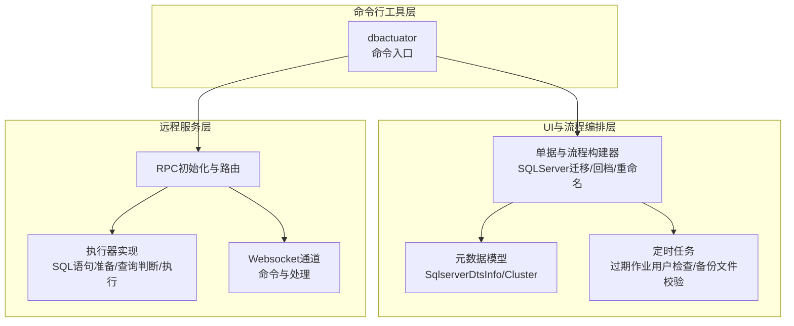
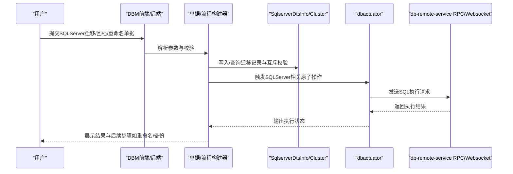
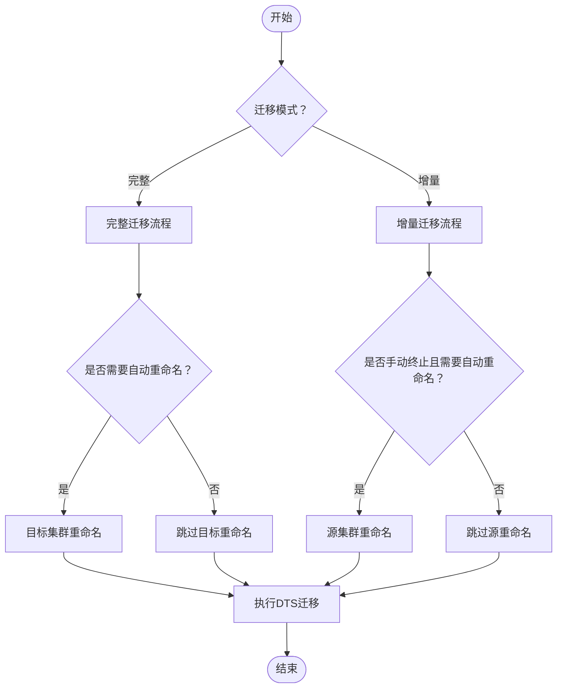
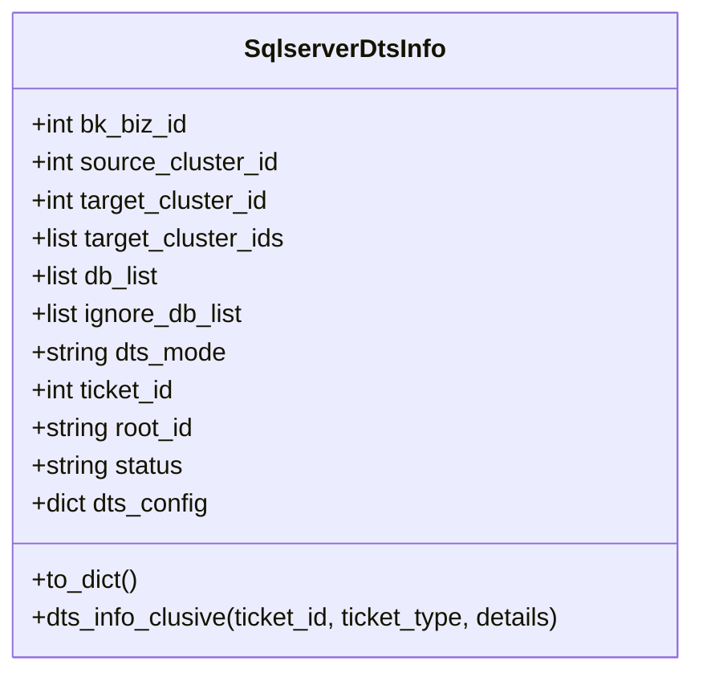
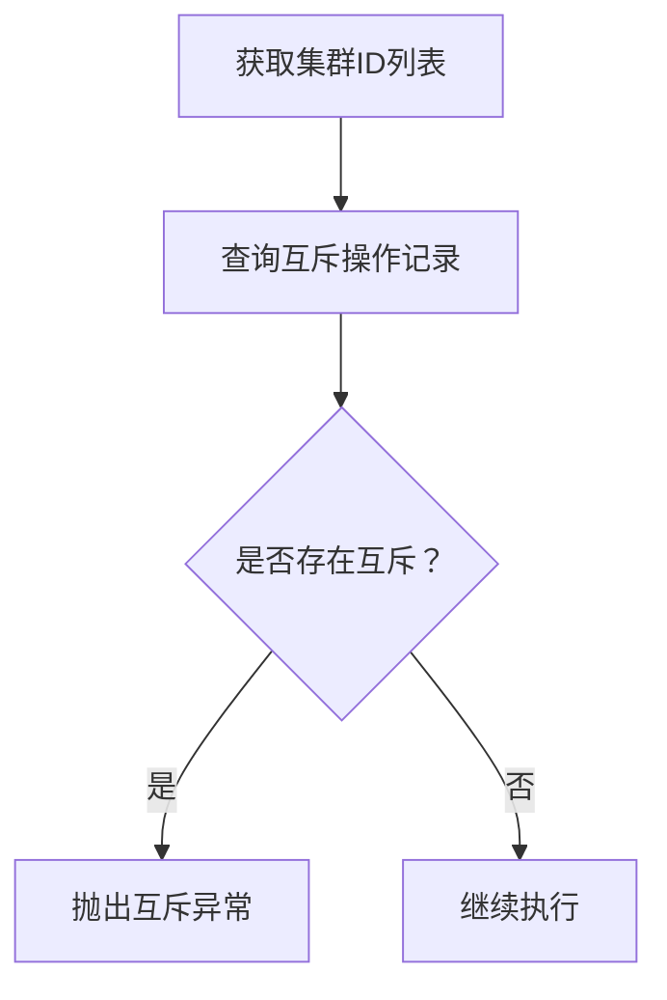
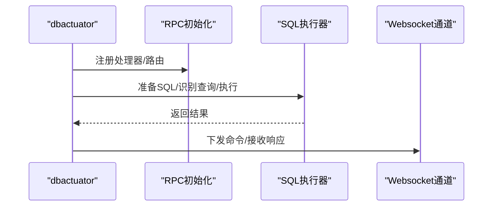
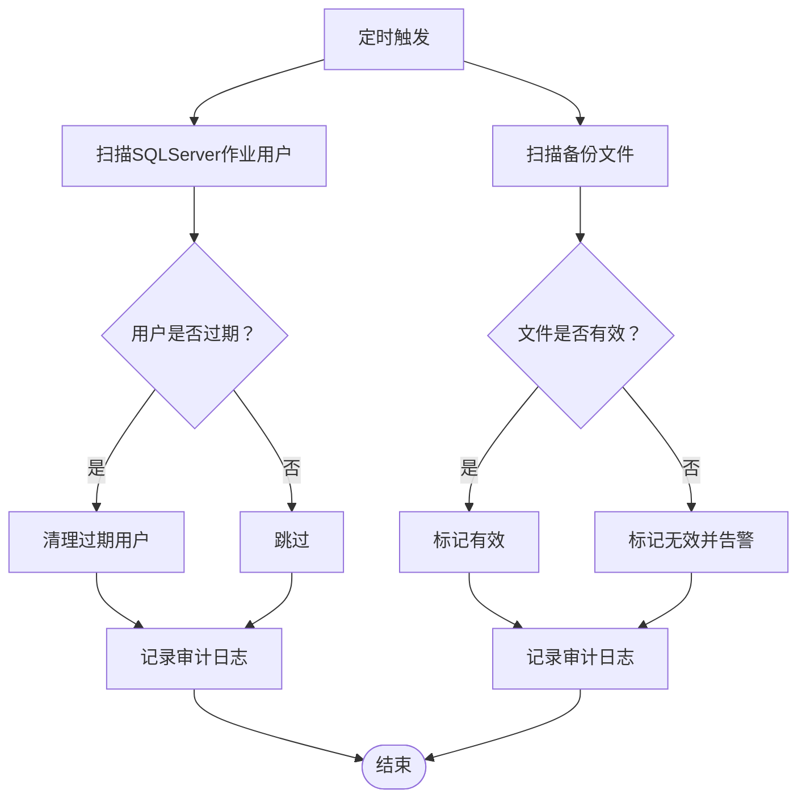
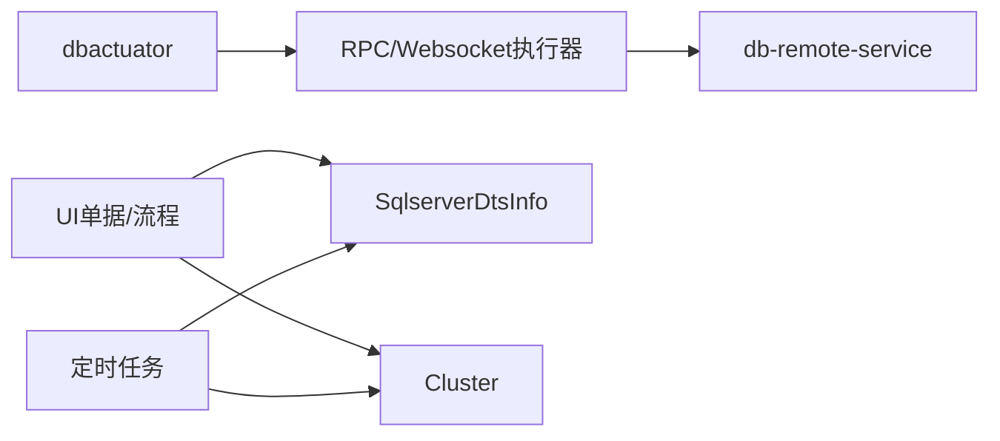

# SQLServer数据管理

<cite>
**本文引用的文件**
- [cmd.go](file://dbm-services/sqlserver/db-tools/dbactuator/cmd/cmd.go)
- [README.md](file://dbm-services/sqlserver/db-tools/dbactuator/README.md)
- [sqlserver_dts.py](file://dbm-ui/backend/db_meta/models/sqlserver_dts.py)
- [cluster.py](file://dbm-ui/backend/db_meta/models/cluster.py)
- [sqlserver_rollback.py](file://dbm-ui/backend/ticket/builders/sqlserver/sqlserver_rollback.py)
- [sqlserver_data_migrate.py](file://dbm-ui/backend/ticket/builders/sqlserver/sqlserver_data_migrate.py)
- [check_expired_job_user_sqlserver.py](file://dbm-ui/backend/db_periodic_task/local_tasks/check_expired_job_users/check_expired_job_user_sqlserver.py)
- [backup_file_check.py](file://dbm-ui/backend/db_periodic_task/local_tasks/sqlserver/backup_file_check.py)
- [sqlserver_rpc.go](file://dbm-services/mysql/db-remote-service/pkg/v2/sqlserver/rpc/init.go)
- [sqlserver_rpc_handler.go](file://dbm-services/mysql/db-remote-service/pkg/v2/sqlserver/rpc/handler.go)
- [sqlserver_rpc_execute.go](file://dbm-services/mysql/db-remote-service/pkg/v2/sqlserver/rpc/execute.go)
- [sqlserver_rpc_do_sql.go](file://dbm-services/mysql/db-remote-service/pkg/v2/sqlserver/internal/impl/do_sql.go)
- [sqlserver_rpc_is_query.go](file://dbm-services/mysql/db-remote-service/pkg/v2/sqlserver/internal/impl/is_query.go)
- [sqlserver_rpc_prepare.go](file://dbm-services/mysql/db-remote-service/pkg/v2/sqlserver/internal/impl/prepare.go)
- [sqlserver_rpc_command.go](file://dbm-services/mysql/db-remote-service/pkg/v2/sqlserver/websocket/command.go)
- [sqlserver_rpc_handler.go](file://dbm-services/mysql/db-remote-service/pkg/v2/sqlserver/websocket/handler.go)
</cite>

## 目录
1. [简介](#简介)
2. [项目结构](#项目结构)
3. [核心组件](#核心组件)
4. [架构总览](#架构总览)
5. [详细组件分析](#详细组件分析)
6. [依赖分析](#依赖分析)
7. [性能考量](#性能考量)
8. [故障排查指南](#故障排查指南)
9. [结论](#结论)
10. [附录](#附录)

## 简介
本文件面向SQLServer数据管理场景，围绕日常运维与自动化编排，系统梳理以下能力与实践：
- 登录用户克隆与权限继承
- 作业任务迁移与过期用户清理
- 链接服务器配置与安全策略
- 备份过滤规则与增量/全量迁移
- 数据库重命名、清理与数据导出
- 权限继承机制、作业调度配置与链接服务器安全设置
- 数据迁移最佳实践、批量操作性能优化与一致性保障
- 导出格式选择、增量导出与导入验证流程
- 安全考虑、审计日志与合规性要求

## 项目结构
SQLServer相关能力在本仓库中主要分布在三部分：
- 命令行工具层：dbactuator（SQLServer子命令入口）
- UI与流程编排层：dbm-ui（单据、流程、模型与定时任务）
- 远程服务层：db-remote-service（SQLServer RPC与Websocket执行通道）

图表来源
- [cmd.go:92-112](file://dbm-services/sqlserver/db-tools/dbactuator/cmd/cmd.go#L92-L112)
- [sqlserver_data_migrate.py:209-243](file://dbm-ui/backend/ticket/builders/sqlserver/sqlserver_data_migrate.py#L209-L243)
- [sqlserver_rollback.py:126-159](file://dbm-ui/backend/ticket/builders/sqlserver/sqlserver_rollback.py#L126-L159)
- [sqlserver_dts.py:48-106](file://dbm-ui/backend/db_meta/models/sqlserver_dts.py#L48-L106)
- [cluster.py:57-148](file://dbm-ui/backend/db_meta/models/cluster.py#L57-L148)
- [check_expired_job_user_sqlserver.py](file://dbm-ui/backend/db_periodic_task/local_tasks/check_expired_job_users/check_expired_job_user_sqlserver.py)
- [backup_file_check.py](file://dbm-ui/backend/db_periodic_task/local_tasks/sqlserver/backup_file_check.py)
- [sqlserver_rpc.go](file://dbm-services/mysql/db-remote-service/pkg/v2/sqlserver/rpc/init.go)
- [sqlserver_rpc_handler.go](file://dbm-services/mysql/db-remote-service/pkg/v2/sqlserver/rpc/handler.go)
- [sqlserver_rpc_execute.go](file://dbm-services/mysql/db-remote-service/pkg/v2/sqlserver/rpc/execute.go)
- [sqlserver_rpc_do_sql.go](file://dbm-services/mysql/db-remote-service/pkg/v2/sqlserver/internal/impl/do_sql.go)
- [sqlserver_rpc_is_query.go](file://dbm-services/mysql/db-remote-service/pkg/v2/sqlserver/internal/impl/is_query.go)
- [sqlserver_rpc_prepare.go](file://dbm-services/mysql/db-remote-service/pkg/v2/sqlserver/internal/impl/prepare.go)
- [sqlserver_rpc_command.go](file://dbm-services/mysql/db-remote-service/pkg/v2/sqlserver/websocket/command.go)
- [sqlserver_rpc_handler.go](file://dbm-services/mysql/db-remote-service/pkg/v2/sqlserver/websocket/handler.go)

章节来源
- [cmd.go:92-112](file://dbm-services/sqlserver/db-tools/dbactuator/cmd/cmd.go#L92-L112)
- [README.md:30-57](file://dbm-services/sqlserver/db-tools/dbactuator/README.md#L30-L57)

## 核心组件
- 命令行入口与分组
  - dbactuator通过子命令分组组织SQLServer相关操作，支持系统初始化、SQLServer操作集与检查类操作集。
  - 关键特性：全局参数（通用负载、扩展负载文件、回滚负载、单据ID、流程ID、节点ID、版本ID、回滚模式、帮助）、心跳输出、错误恢复与日志统一。

- UI单据与流程
  - SQLServer数据迁移、回档与重命名流程通过Builder串联，支持完整/增量迁移、自动重命名、备份文件选择与校验。
  - 支持“定点构造”（按时间点回档）与“增量迁移执行”，并可串行目标/源数据库重命名流程。

- 元数据模型
  - SqlserverDtsInfo：记录每次数据迁移的源/目标集群、迁移模式、状态与配置，提供互斥操作保护。
  - Cluster：集群基础模型，提供互斥操作校验、可达性校验与状态标志。

- 远程服务RPC
  - 提供SQLServer执行通道（RPC与Websocket），包含SQL准备、查询识别、执行与命令处理，支撑远端SQL执行与结果返回。

章节来源
- [cmd.go:67-143](file://dbm-services/sqlserver/db-tools/dbactuator/cmd/cmd.go#L67-L143)
- [sqlserver_data_migrate.py:209-243](file://dbm-ui/backend/ticket/builders/sqlserver/sqlserver_data_migrate.py#L209-L243)
- [sqlserver_rollback.py:126-159](file://dbm-ui/backend/ticket/builders/sqlserver/sqlserver_rollback.py#L126-L159)
- [sqlserver_dts.py:48-106](file://dbm-ui/backend/db_meta/models/sqlserver_dts.py#L48-L106)
- [cluster.py:57-148](file://dbm-ui/backend/db_meta/models/cluster.py#L57-L148)
- [sqlserver_rpc.go](file://dbm-services/mysql/db-remote-service/pkg/v2/sqlserver/rpc/init.go)
- [sqlserver_rpc_handler.go](file://dbm-services/mysql/db-remote-service/pkg/v2/sqlserver/rpc/handler.go)
- [sqlserver_rpc_execute.go](file://dbm-services/mysql/db-remote-service/pkg/v2/sqlserver/rpc/execute.go)

## 架构总览
SQLServer数据管理的端到端流程如下：

图表来源
- [sqlserver_data_migrate.py:209-243](file://dbm-ui/backend/ticket/builders/sqlserver/sqlserver_data_migrate.py#L209-L243)
- [sqlserver_rollback.py:126-159](file://dbm-ui/backend/ticket/builders/sqlserver/sqlserver_rollback.py#L126-L159)
- [sqlserver_dts.py:86-106](file://dbm-ui/backend/db_meta/models/sqlserver_dts.py#L86-L106)
- [cmd.go:92-112](file://dbm-services/sqlserver/db-tools/dbactuator/cmd/cmd.go#L92-L112)
- [sqlserver_rpc_execute.go](file://dbm-services/mysql/db-remote-service/pkg/v2/sqlserver/rpc/execute.go)
- [sqlserver_rpc_command.go](file://dbm-services/mysql/db-remote-service/pkg/v2/sqlserver/websocket/command.go)

## 详细组件分析

### 组件A：SQLServer迁移与回档流程
- 功能要点
  - 完整/增量迁移模式切换，支持自动重命名源/目标数据库。
  - “定点构造”按时间点回档，自动选择最近备份日志文件。
  - 互斥保护：同一集群在迁移/断开/在线阶段不可与其他互斥动作并发。

图表来源
- [sqlserver_data_migrate.py:209-243](file://dbm-ui/backend/ticket/builders/sqlserver/sqlserver_data_migrate.py#L209-L243)
- [sqlserver_rollback.py:126-159](file://dbm-ui/backend/ticket/builders/sqlserver/sqlserver_rollback.py#L126-L159)

章节来源
- [sqlserver_data_migrate.py:209-243](file://dbm-ui/backend/ticket/builders/sqlserver/sqlserver_data_migrate.py#L209-L243)
- [sqlserver_rollback.py:126-159](file://dbm-ui/backend/ticket/builders/sqlserver/sqlserver_rollback.py#L126-L159)

### 组件B：数据迁移记录与互斥控制
- SqlserverDtsInfo模型
  - 记录迁移的源/目标集群、库正则、忽略库正则、迁移模式、状态与配置。
  - 提供互斥校验方法，避免与“断开中/已断开/全量在线/增量在线”等状态并发操作。

图表来源
- [sqlserver_dts.py:48-106](file://dbm-ui/backend/db_meta/models/sqlserver_dts.py#L48-L106)

章节来源
- [sqlserver_dts.py:48-106](file://dbm-ui/backend/db_meta/models/sqlserver_dts.py#L48-L106)

### 组件C：集群互斥与可达性校验
- Cluster模型
  - 提供集群互斥操作校验与可达性校验（状态/阶段），保障并发安全与操作前置条件。

图表来源
- [cluster.py:116-138](file://dbm-ui/backend/db_meta/models/cluster.py#L116-L138)

章节来源
- [cluster.py:116-138](file://dbm-ui/backend/db_meta/models/cluster.py#L116-L138)

### 组件D：远程SQL执行通道（RPC/Websocket）
- RPC初始化与路由
  - 初始化RPC服务，注册处理器与执行器。
- 执行器实现
  - SQL准备、查询识别、执行与结果返回。
- Websocket通道
  - 命令下发与处理，支持交互式执行。

图表来源
- [sqlserver_rpc.go](file://dbm-services/mysql/db-remote-service/pkg/v2/sqlserver/rpc/init.go)
- [sqlserver_rpc_handler.go](file://dbm-services/mysql/db-remote-service/pkg/v2/sqlserver/rpc/handler.go)
- [sqlserver_rpc_execute.go](file://dbm-services/mysql/db-remote-service/pkg/v2/sqlserver/rpc/execute.go)
- [sqlserver_rpc_do_sql.go](file://dbm-services/mysql/db-remote-service/pkg/v2/sqlserver/internal/impl/do_sql.go)
- [sqlserver_rpc_is_query.go](file://dbm-services/mysql/db-remote-service/pkg/v2/sqlserver/internal/impl/is_query.go)
- [sqlserver_rpc_prepare.go](file://dbm-services/mysql/db-remote-service/pkg/v2/sqlserver/internal/impl/prepare.go)
- [sqlserver_rpc_command.go](file://dbm-services/mysql/db-remote-service/pkg/v2/sqlserver/websocket/command.go)
- [sqlserver_rpc_handler.go](file://dbm-services/mysql/db-remote-service/pkg/v2/sqlserver/websocket/handler.go)

章节来源
- [sqlserver_rpc.go](file://dbm-services/mysql/db-remote-service/pkg/v2/sqlserver/rpc/init.go)
- [sqlserver_rpc_handler.go](file://dbm-services/mysql/db-remote-service/pkg/v2/sqlserver/rpc/handler.go)
- [sqlserver_rpc_execute.go](file://dbm-services/mysql/db-remote-service/pkg/v2/sqlserver/rpc/execute.go)
- [sqlserver_rpc_do_sql.go](file://dbm-services/mysql/db-remote-service/pkg/v2/sqlserver/internal/impl/do_sql.go)
- [sqlserver_rpc_is_query.go](file://dbm-services/mysql/db-remote-service/pkg/v2/sqlserver/internal/impl/is_query.go)
- [sqlserver_rpc_prepare.go](file://dbm-services/mysql/db-remote-service/pkg/v2/sqlserver/internal/impl/prepare.go)
- [sqlserver_rpc_command.go](file://dbm-services/mysql/db-remote-service/pkg/v2/sqlserver/websocket/command.go)
- [sqlserver_rpc_handler.go](file://dbm-services/mysql/db-remote-service/pkg/v2/sqlserver/websocket/handler.go)

### 组件E：作业用户过期检查与备份文件校验
- 作业用户过期检查（SQLServer）
  - 定时扫描并清理过期的SQLServer作业账户，降低安全风险。
- 备份文件校验（SQLServer）
  - 定时任务校验备份文件有效性与完整性，确保可恢复性。

图表来源
- [check_expired_job_user_sqlserver.py](file://dbm-ui/backend/db_periodic_task/local_tasks/check_expired_job_users/check_expired_job_user_sqlserver.py)
- [backup_file_check.py](file://dbm-ui/backend/db_periodic_task/local_tasks/sqlserver/backup_file_check.py)

章节来源
- [check_expired_job_user_sqlserver.py](file://dbm-ui/backend/db_periodic_task/local_tasks/check_expired_job_users/check_expired_job_user_sqlserver.py)
- [backup_file_check.py](file://dbm-ui/backend/db_periodic_task/local_tasks/sqlserver/backup_file_check.py)

## 依赖分析
- 组件耦合与内聚
  - dbactuator作为命令入口，依赖子命令模块与公共工具；与远程服务解耦，通过RPC/Websocket交互。
  - UI单据与流程强依赖元数据模型（SqlserverDtsInfo/Cluster）进行互斥与状态校验。
  - 定时任务独立于主流程，仅依赖元数据与远程服务接口。

图表来源
- [cmd.go:92-112](file://dbm-services/sqlserver/db-tools/dbactuator/cmd/cmd.go#L92-L112)
- [sqlserver_dts.py:48-106](file://dbm-ui/backend/db_meta/models/sqlserver_dts.py#L48-L106)
- [cluster.py:57-148](file://dbm-ui/backend/db_meta/models/cluster.py#L57-L148)
- [sqlserver_rpc.go](file://dbm-services/mysql/db-remote-service/pkg/v2/sqlserver/rpc/init.go)

章节来源
- [cmd.go:92-112](file://dbm-services/sqlserver/db-tools/dbactuator/cmd/cmd.go#L92-L112)
- [sqlserver_dts.py:48-106](file://dbm-ui/backend/db_meta/models/sqlserver_dts.py#L48-L106)
- [cluster.py:57-148](file://dbm-ui/backend/db_meta/models/cluster.py#L57-L148)
- [sqlserver_rpc.go](file://dbm-services/mysql/db-remote-service/pkg/v2/sqlserver/rpc/init.go)

## 性能考量
- 批量操作优化
  - 合理拆分迁移批次，避免长事务与锁竞争；在增量迁移中尽量缩短断开窗口。
  - 使用索引与分区策略减少全量扫描成本；在导入前预热缓冲池与统计信息。
- 并发控制
  - 通过互斥校验避免多个迁移/断开任务同时执行，减少资源争用。
- I/O与网络
  - 远程服务RPC/Websocket应合理设置超时与重试；对大数据量导出采用流式传输与断点续传。
- 备份与恢复
  - 全量备份后进行差异/日志备份链路校验；定期验证恢复演练，确保RTO/RPO达标。

## 故障排查指南
- 常见问题定位
  - 迁移互斥：若提示“与某单据存在执行互斥”，需等待当前迁移/断开任务完成后重试。
  - 集群不可达：检查集群状态与阶段，确保处于正常在线状态。
  - 作业用户过期：通过定时任务清理过期用户，必要时手动核查残留账户。
  - 备份文件异常：检查备份文件完整性与可读性，确认路径与权限。
- 日志与审计
  - 统一使用日志组件输出关键事件；对重要操作（迁移、回档、重命名、备份）记录审计日志。
- 回滚与恢复
  - 回档前确保有可恢复的日志备份；按时间点选择最近备份日志文件，避免误选导致数据丢失。

章节来源
- [sqlserver_dts.py:86-106](file://dbm-ui/backend/db_meta/models/sqlserver_dts.py#L86-L106)
- [cluster.py:140-148](file://dbm-ui/backend/db_meta/models/cluster.py#L140-L148)
- [check_expired_job_user_sqlserver.py](file://dbm-ui/backend/db_periodic_task/local_tasks/check_expired_job_users/check_expired_job_user_sqlserver.py)
- [backup_file_check.py](file://dbm-ui/backend/db_periodic_task/local_tasks/sqlserver/backup_file_check.py)

## 结论
本方案通过命令行工具、UI流程编排与远程服务通道，形成完整的SQLServer数据管理闭环。借助互斥控制、可达性校验与定时任务，保障操作安全与一致性；结合RPC/Websocket执行通道，实现远端SQL高效执行与可观测性。建议在生产环境中严格遵循备份策略、权限最小化与审计留痕，确保合规与可追溯。

## 附录
- 使用建议
  - 在执行迁移/回档前，先进行备份与一致性校验。
  - 对高价值数据库优先采用增量迁移与短窗口断开策略。
  - 定期清理过期作业用户与校验备份文件，降低安全与恢复风险。
- 参考文件
  - 命令行工具入口与分组定义参见：[cmd.go:92-112](file://dbm-services/sqlserver/db-tools/dbactuator/cmd/cmd.go#L92-L112)
  - SQLServer迁移/回档/重命名流程参见：
    - [sqlserver_data_migrate.py:209-243](file://dbm-ui/backend/ticket/builders/sqlserver/sqlserver_data_migrate.py#L209-L243)
    - [sqlserver_rollback.py:126-159](file://dbm-ui/backend/ticket/builders/sqlserver/sqlserver_rollback.py#L126-L159)
  - 数据迁移记录与互斥控制参见：[sqlserver_dts.py:48-106](file://dbm-ui/backend/db_meta/models/sqlserver_dts.py#L48-L106)
  - 集群互斥与可达性校验参见：[cluster.py:116-148](file://dbm-ui/backend/db_meta/models/cluster.py#L116-L148)
  - 远程服务RPC/Websocket通道参见：
    - [sqlserver_rpc.go](file://dbm-services/mysql/db-remote-service/pkg/v2/sqlserver/rpc/init.go)
    - [sqlserver_rpc_execute.go](file://dbm-services/mysql/db-remote-service/pkg/v2/sqlserver/rpc/execute.go)
    - [sqlserver_rpc_do_sql.go](file://dbm-services/mysql/db-remote-service/pkg/v2/sqlserver/internal/impl/do_sql.go)
    - [sqlserver_rpc_is_query.go](file://dbm-services/mysql/db-remote-service/pkg/v2/sqlserver/internal/impl/is_query.go)
    - [sqlserver_rpc_prepare.go](file://dbm-services/mysql/db-remote-service/pkg/v2/sqlserver/internal/impl/prepare.go)
    - [sqlserver_rpc_command.go](file://dbm-services/mysql/db-remote-service/pkg/v2/sqlserver/websocket/command.go)
    - [sqlserver_rpc_handler.go](file://dbm-services/mysql/db-remote-service/pkg/v2/sqlserver/websocket/handler.go)
  - 定时任务参见：
    - [check_expired_job_user_sqlserver.py](file://dbm-ui/backend/db_periodic_task/local_tasks/check_expired_job_users/check_expired_job_user_sqlserver.py)
    - [backup_file_check.py](file://dbm-ui/backend/db_periodic_task/local_tasks/sqlserver/backup_file_check.py)