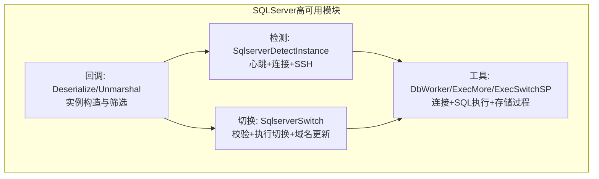
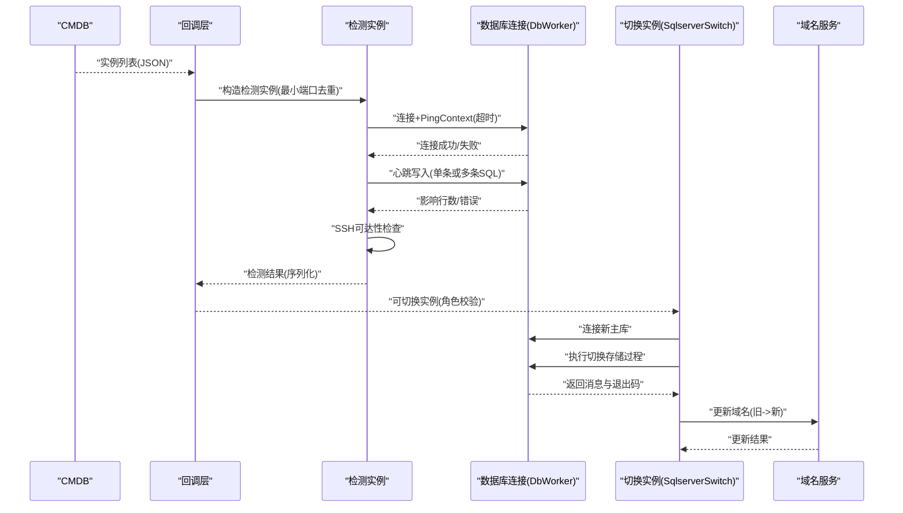
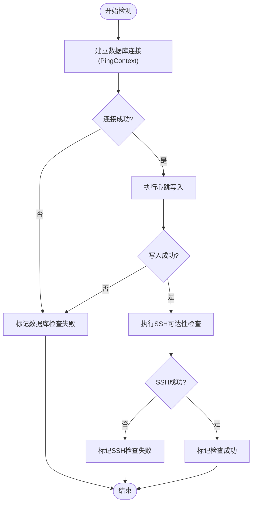
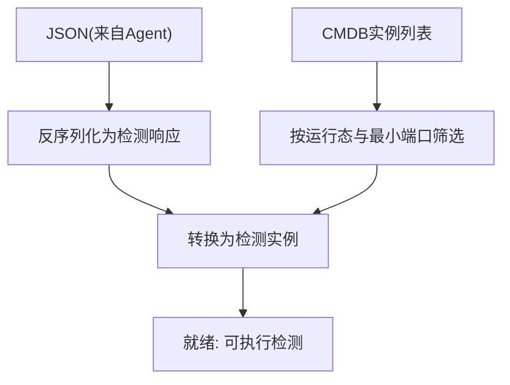
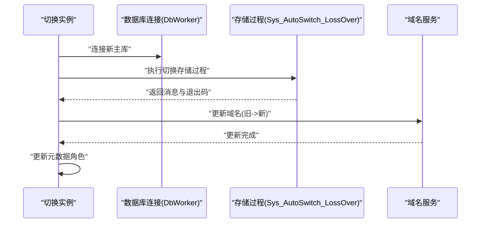
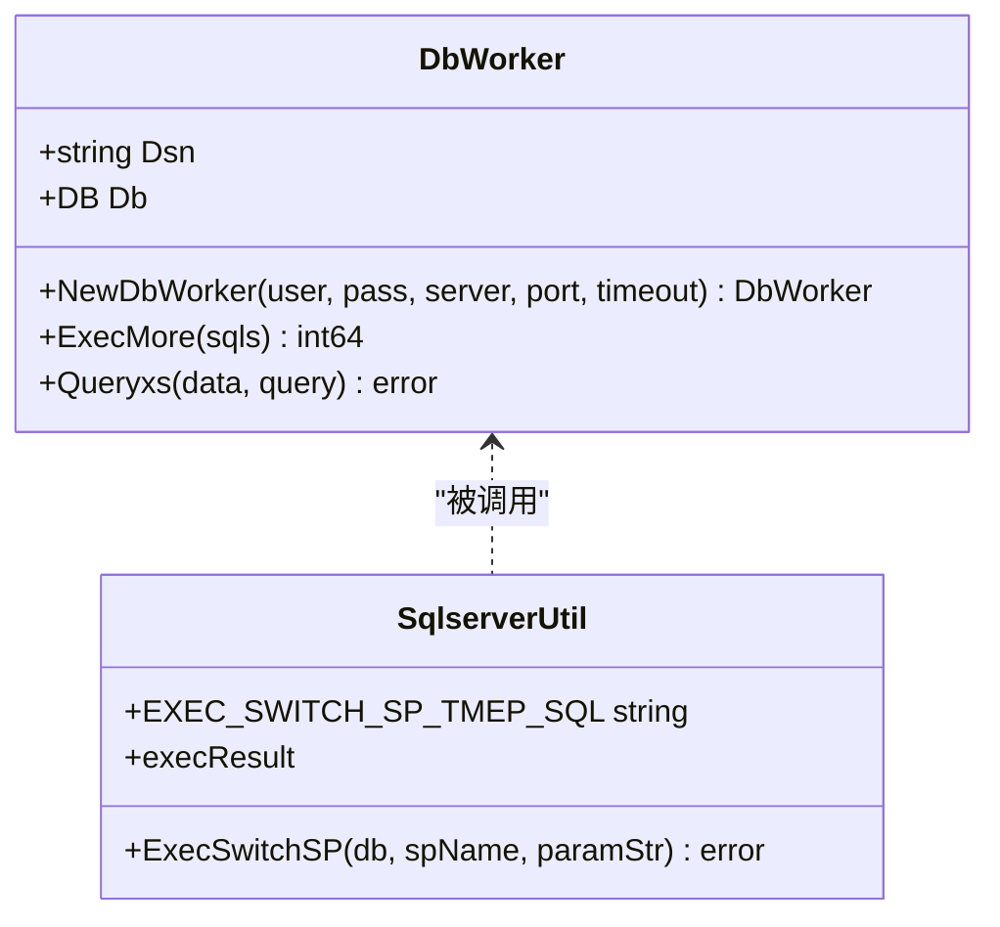
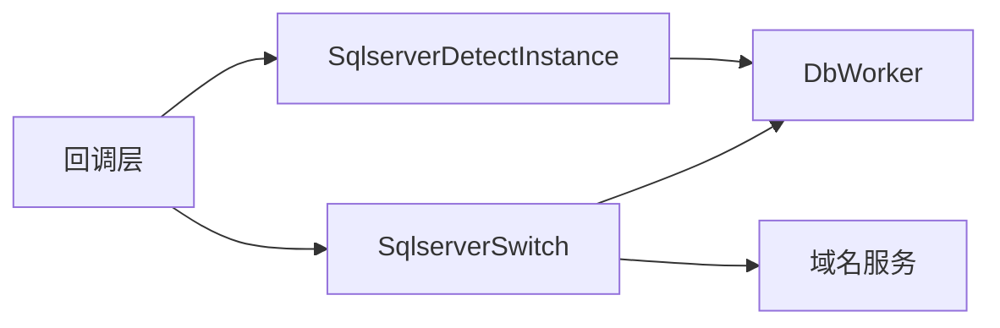

# SQLServer检查与运维

<cite>
**本文引用的文件**   
- [sqlserver_detect.go](file://dbm-services/common/dbha/ha-module/dbmodule/sqlserver/sqlserver_detect.go)
- [sqlserver_callback.go](file://dbm-services/common/dbha/ha-module/dbmodule/sqlserver/sqlserver_callback.go)
- [sqlserver_switch.go](file://dbm-services/common/dbha/ha-module/dbmodule/sqlserver/sqlserver_switch.go)
- [sqlserver_util.go](file://dbm-services/common/dbha/ha-module/dbmodule/sqlserver/sqlserver_util.go)
</cite>

## 目录
1. [简介](#简介)
2. [项目结构](#项目结构)
3. [核心组件](#核心组件)
4. [架构总览](#架构总览)
5. [组件详解](#组件详解)
6. [依赖关系分析](#依赖关系分析)
7. [性能考量](#性能考量)
8. [故障排查指南](#故障排查指南)
9. [结论](#结论)
10. [附录](#附录)

## 简介
本文件面向SQLServer实例的健康检查与运维场景，聚焦以下能力：
- 异常数据库检测：通过心跳写入与连接探测实现实例可用性判定
- 实例进程监控与服务状态检查：结合SSH可达性与数据库连接状态进行综合评估
- 检查命令执行与结果解读：明确心跳更新语句、超时控制与错误分类
- 切换流程与回滚策略：基于存储过程的自动切换与元数据角色互换
- 运维脚本与自动化配置：结合配置项与日志输出，指导自动化与告警落地
- 常见问题诊断与性能瓶颈识别：从连接超时、认证失败到资源使用分析
- 日志分析与根因定位：通过日志级别与关键路径定位问题
- 预防性维护策略：连接池管理、超时设置与资源回收

## 项目结构
SQLServer检查与运维相关代码位于公共高可用模块中，采用“检测-回调-切换-工具”分层组织：
- 检测层：负责心跳写入、连接探测与SSH可达性检查
- 回调层：负责实例反序列化、实例筛选与构造
- 切换层：负责切换前置校验、执行切换存储过程与域名更新
- 工具层：负责数据库连接建立、SQL批量执行与存储过程调用

图表来源
- [sqlserver_detect.go:73-171](file://dbm-services/common/dbha/ha-module/dbmodule/sqlserver/sqlserver_detect.go#L73-L171)
- [sqlserver_callback.go:25-55](file://dbm-services/common/dbha/ha-module/dbmodule/sqlserver/sqlserver_callback.go#L25-L55)
- [sqlserver_switch.go:105-160](file://dbm-services/common/dbha/ha-module/dbmodule/sqlserver/sqlserver_switch.go#L105-L160)
- [sqlserver_util.go:47-107](file://dbm-services/common/dbha/ha-module/dbmodule/sqlserver/sqlserver_util.go#L47-L107)

章节来源
- [sqlserver_detect.go:1-243](file://dbm-services/common/dbha/ha-module/dbmodule/sqlserver/sqlserver_detect.go#L1-L243)
- [sqlserver_callback.go:1-136](file://dbm-services/common/dbha/ha-module/dbmodule/sqlserver/sqlserver_callback.go#L1-L136)
- [sqlserver_switch.go:1-179](file://dbm-services/common/dbha/ha-module/dbmodule/sqlserver/sqlserver_switch.go#L1-L179)
- [sqlserver_util.go:1-108](file://dbm-services/common/dbha/ha-module/dbmodule/sqlserver/sqlserver_util.go#L1-L108)

## 核心组件
- 检测实例与响应
  - 检测实例结构承载IP、端口、应用、数据库类型、角色、集群信息与SSH配置，并提供检测入口
  - 响应结构封装通用检测返回字段，便于序列化上报
- 数据库连接工作器
  - 统一DSN拼装、PingContext超时控制、批量SQL执行与查询封装
- 存储过程切换执行器
  - 通过统一模板SQL调用MONITOR库下的切换存储过程，解析返回消息与退出码
- 回调与实例构造
  - 将CMDB实例信息反序列化为检测实例；按运行态与最小端口进行去重筛选
- 切换流程
  - 前置校验（角色、备库状态）、连接新主库、执行切换存储过程、更新域名、元数据角色互换

章节来源
- [sqlserver_detect.go:37-61](file://dbm-services/common/dbha/ha-module/dbmodule/sqlserver/sqlserver_detect.go#L37-L61)
- [sqlserver_detect.go:137-171](file://dbm-services/common/dbha/ha-module/dbmodule/sqlserver/sqlserver_detect.go#L137-L171)
- [sqlserver_util.go:41-67](file://dbm-services/common/dbha/ha-module/dbmodule/sqlserver/sqlserver_util.go#L41-L67)
- [sqlserver_util.go:92-107](file://dbm-services/common/dbha/ha-module/dbmodule/sqlserver/sqlserver_util.go#L92-L107)
- [sqlserver_callback.go:25-55](file://dbm-services/common/dbha/ha-module/dbmodule/sqlserver/sqlserver_callback.go#L25-L55)
- [sqlserver_switch.go:23-103](file://dbm-services/common/dbha/ha-module/dbmodule/sqlserver/sqlserver_switch.go#L23-L103)

## 架构总览
下图展示从“实例发现—心跳检测—连接与SSH校验—切换执行—域名更新”的全链路：

图表来源
- [sqlserver_callback.go:25-55](file://dbm-services/common/dbha/ha-module/dbmodule/sqlserver/sqlserver_callback.go#L25-L55)
- [sqlserver_detect.go:73-171](file://dbm-services/common/dbha/ha-module/dbmodule/sqlserver/sqlserver_detect.go#L73-L171)
- [sqlserver_switch.go:105-160](file://dbm-services/common/dbha/ha-module/dbmodule/sqlserver/sqlserver_switch.go#L105-L160)
- [sqlserver_util.go:47-107](file://dbm-services/common/dbha/ha-module/dbmodule/sqlserver/sqlserver_util.go#L47-L107)

## 组件详解

### 检测实例与心跳机制
- 心跳写入
  - 使用Monitor库的CHECK_HEARTBEAT表进行时间戳更新/插入，作为轻量级可用性信号
- 连接探测
  - 通过DbWorker建立连接并以PingContext带超时的方式进行连通性验证
- SSH可达性
  - 在目标主机上创建标记文件，验证管理通道可用性
- 超时与重检
  - 支持检测超时与重检策略，避免长时间阻塞导致资源泄露
- 错误分类
  - 数据库错误与SSH错误分别映射到不同状态码，便于上层区分处理

图表来源
- [sqlserver_detect.go:73-119](file://dbm-services/common/dbha/ha-module/dbmodule/sqlserver/sqlserver_detect.go#L73-L119)
- [sqlserver_detect.go:137-171](file://dbm-services/common/dbha/ha-module/dbmodule/sqlserver/sqlserver_detect.go#L137-L171)
- [sqlserver_util.go:47-67](file://dbm-services/common/dbha/ha-module/dbmodule/sqlserver/sqlserver_util.go#L47-L67)

章节来源
- [sqlserver_detect.go:28-35](file://dbm-services/common/dbha/ha-module/dbmodule/sqlserver/sqlserver_detect.go#L28-L35)
- [sqlserver_detect.go:73-119](file://dbm-services/common/dbha/ha-module/dbmodule/sqlserver/sqlserver_detect.go#L73-L119)
- [sqlserver_util.go:47-67](file://dbm-services/common/dbha/ha-module/dbmodule/sqlserver/sqlserver_util.go#L47-L67)

### 回调与实例构造
- 反序列化
  - 将Agent上报的JSON反序列化为检测响应结构，再转换为检测实例
- 实例筛选
  - 仅保留运行态且每IP最小端口的实例，减少重复检测
- 构造检测实例
  - 注入DB与SSH配置，形成可直接执行检测的对象

图表来源
- [sqlserver_callback.go:45-55](file://dbm-services/common/dbha/ha-module/dbmodule/sqlserver/sqlserver_callback.go#L45-L55)
- [sqlserver_callback.go:95-135](file://dbm-services/common/dbha/ha-module/dbmodule/sqlserver/sqlserver_callback.go#L95-L135)
- [sqlserver_detect.go:186-213](file://dbm-services/common/dbha/ha-module/dbmodule/sqlserver/sqlserver_detect.go#L186-L213)

章节来源
- [sqlserver_callback.go:25-55](file://dbm-services/common/dbha/ha-module/dbmodule/sqlserver/sqlserver_callback.go#L25-L55)
- [sqlserver_callback.go:95-135](file://dbm-services/common/dbha/ha-module/dbmodule/sqlserver/sqlserver_callback.go#L95-L135)
- [sqlserver_detect.go:186-213](file://dbm-services/common/dbha/ha-module/dbmodule/sqlserver/sqlserver_detect.go#L186-L213)

### 切换流程与回滚
- 前置校验
  - 角色校验：仅主库可发起切换；备库无需校验；中继角色不支持
  - 备库状态校验：必须存在可用备库
- 执行切换
  - 连接新主库，调用MONITOR库存储过程执行切换
- 域名更新
  - 更新绑定域名，使流量指向新主库
- 元数据互换
  - 交换CMDB中实例角色，确保后续一致性
- 回滚
  - 当前实现为空操作，需结合业务策略扩展

图表来源
- [sqlserver_switch.go:67-103](file://dbm-services/common/dbha/ha-module/dbmodule/sqlserver/sqlserver_switch.go#L67-L103)
- [sqlserver_switch.go:105-160](file://dbm-services/common/dbha/ha-module/dbmodule/sqlserver/sqlserver_switch.go#L105-L160)
- [sqlserver_util.go:92-107](file://dbm-services/common/dbha/ha-module/dbmodule/sqlserver/sqlserver_util.go#L92-L107)

章节来源
- [sqlserver_switch.go:23-103](file://dbm-services/common/dbha/ha-module/dbmodule/sqlserver/sqlserver_switch.go#L23-L103)
- [sqlserver_switch.go:105-160](file://dbm-services/common/dbha/ha-module/dbmodule/sqlserver/sqlserver_switch.go#L105-L160)
- [sqlserver_util.go:92-107](file://dbm-services/common/dbha/ha-module/dbmodule/sqlserver/sqlserver_util.go#L92-L107)

### 数据库连接与工具
- 连接建立
  - DSN包含服务器、端口、用户、密码、数据库、加密与排序规则
  - 使用PingContext进行超时控制，避免长时间阻塞
- 批量执行
  - 支持多条SQL合并执行，统计受影响行数
- 存储过程调用
  - 统一模板SQL，解析返回消息与退出码，非期望退出码视为失败

图表来源
- [sqlserver_util.go:41-67](file://dbm-services/common/dbha/ha-module/dbmodule/sqlserver/sqlserver_util.go#L41-L67)
- [sqlserver_util.go:92-107](file://dbm-services/common/dbha/ha-module/dbmodule/sqlserver/sqlserver_util.go#L92-L107)

章节来源
- [sqlserver_util.go:41-67](file://dbm-services/common/dbha/ha-module/dbmodule/sqlserver/sqlserver_util.go#L41-L67)
- [sqlserver_util.go:68-90](file://dbm-services/common/dbha/ha-module/dbmodule/sqlserver/sqlserver_util.go#L68-L90)
- [sqlserver_util.go:92-107](file://dbm-services/common/dbha/ha-module/dbmodule/sqlserver/sqlserver_util.go#L92-L107)

## 依赖关系分析
- 组件耦合
  - 检测实例依赖DbWorker进行连接与心跳写入
  - 切换实例依赖DbWorker与存储过程模板SQL
  - 回调层负责实例构造与筛选，降低上层对具体协议的依赖
- 外部依赖
  - go-mssqldb驱动用于SQLServer连接
  - 名称服务客户端用于域名更新
- 潜在风险
  - 协程泄漏：检测中使用goroutine但未显式取消，若连接超时可能造成资源占用
  - 连接泄漏：关闭逻辑在defer中，需确保异常路径也能触发

图表来源
- [sqlserver_detect.go:137-171](file://dbm-services/common/dbha/ha-module/dbmodule/sqlserver/sqlserver_detect.go#L137-L171)
- [sqlserver_switch.go:105-160](file://dbm-services/common/dbha/ha-module/dbmodule/sqlserver/sqlserver_switch.go#L105-L160)
- [sqlserver_callback.go:25-55](file://dbm-services/common/dbha/ha-module/dbmodule/sqlserver/sqlserver_callback.go#L25-L55)

章节来源
- [sqlserver_detect.go:73-119](file://dbm-services/common/dbha/ha-module/dbmodule/sqlserver/sqlserver_detect.go#L73-L119)
- [sqlserver_switch.go:105-160](file://dbm-services/common/dbha/ha-module/dbmodule/sqlserver/sqlserver_switch.go#L105-L160)
- [sqlserver_callback.go:25-55](file://dbm-services/common/dbha/ha-module/dbmodule/sqlserver/sqlserver_callback.go#L25-L55)

## 性能考量
- 连接超时与重试
  - PingContext超时与检测超时共同决定整体响应时间，需根据网络与实例负载合理设置
- 并发与资源
  - 检测中使用goroutine，建议引入上下文取消与限流，避免协程堆积
- 批量SQL执行
  - 合理拆分SQL批次，避免单次执行过长导致阻塞
- 日志开销
  - Debug级别日志在高并发场景下可能带来I/O压力，建议按环境调整

## 故障排查指南
- 常见错误与定位
  - 连接超时：检查网络连通性、防火墙策略与PingContext超时设置
  - 认证失败：核对用户名/密码与Monitor库权限
  - SSH失败：确认Windows主机管理账户与文件写入权限
  - 存储过程失败：检查返回消息与退出码，定位具体失败原因
- 日志分析要点
  - 关注检测阶段的“连接失败/写入失败/SSH失败”等关键日志
  - 切换阶段关注“连接新主库/执行切换/域名更新”三步的日志输出
- 诊断步骤
  - 先做SSH可达性验证，再做数据库连通性与心跳写入
  - 若切换失败，优先检查存储过程返回消息与退出码
  - 对异常实例进行隔离与重试，避免影响其他实例

章节来源
- [sqlserver_detect.go:85-119](file://dbm-services/common/dbha/ha-module/dbmodule/sqlserver/sqlserver_detect.go#L85-L119)
- [sqlserver_util.go:92-107](file://dbm-services/common/dbha/ha-module/dbmodule/sqlserver/sqlserver_util.go#L92-L107)
- [sqlserver_switch.go:105-160](file://dbm-services/common/dbha/ha-module/dbmodule/sqlserver/sqlserver_switch.go#L105-L160)

## 结论
该模块通过“心跳+连接+SSH”的组合策略实现SQLServer实例的健康检查，并以存储过程驱动的切换流程保障故障恢复。建议在生产环境中：
- 明确超时阈值与重试策略
- 加强协程与连接的生命周期管理
- 完善日志分级与告警联动
- 在切换前进行充分的角色与备库状态校验

## 附录
- 检查命令与结果解读
  - 心跳写入：更新/插入Monitor库CHECK_HEARTBEAT表，成功后标记检查成功
  - 连接探测：PingContext超时控制，失败则标记数据库检查失败
  - SSH可达性：在目标主机创建标记文件，失败则标记SSH检查失败
- 运维脚本与自动化配置
  - 建议将检测与切换流程纳入定时任务或事件驱动机制
  - 结合配置中心动态调整超时、重试与告警阈值
- 告警规则建议
  - 连接超时、认证失败、SSH失败、存储过程失败均应触发告警
  - 对连续失败与恢复进行聚合统计，避免噪声