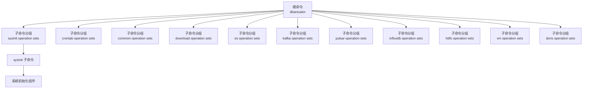
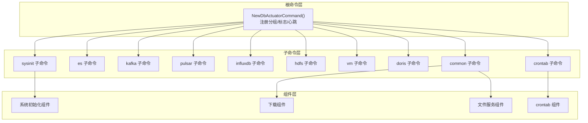
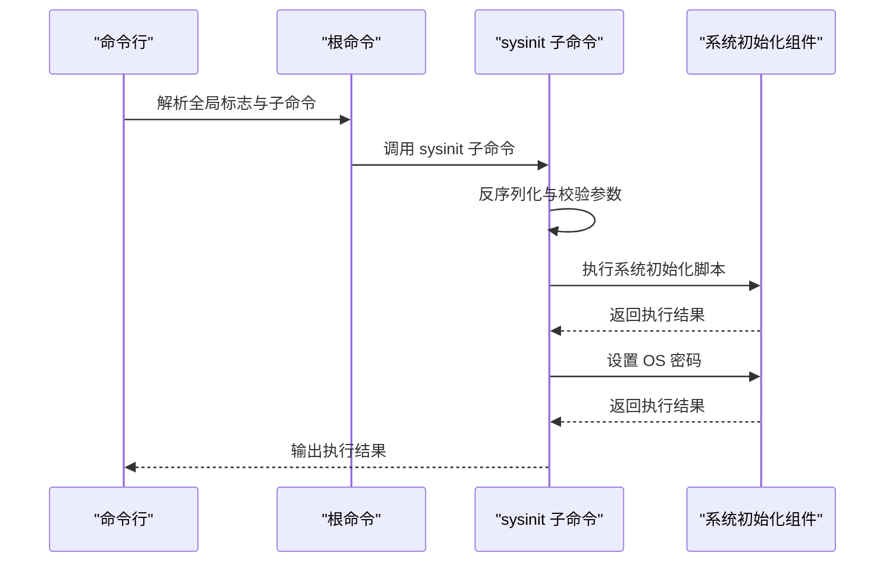
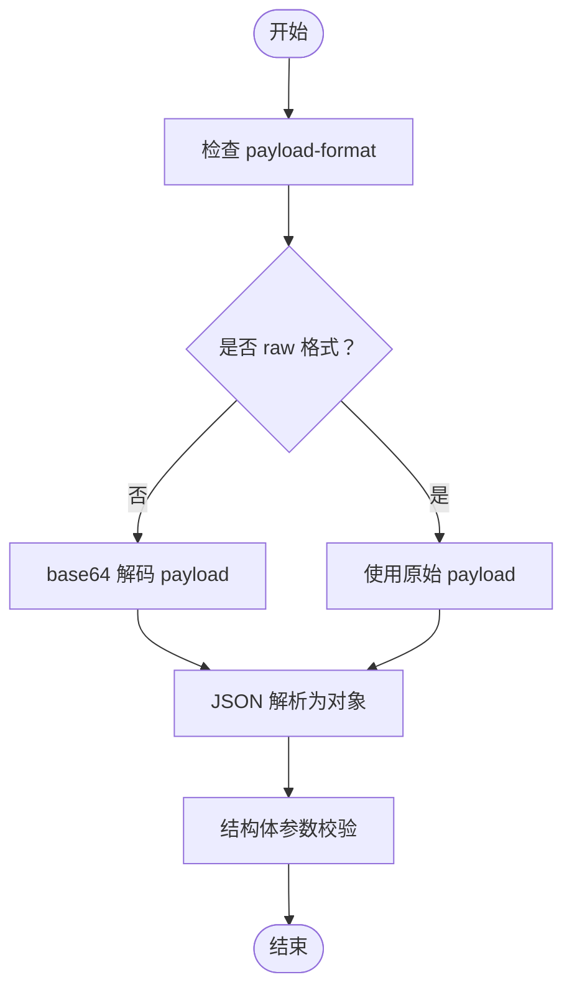
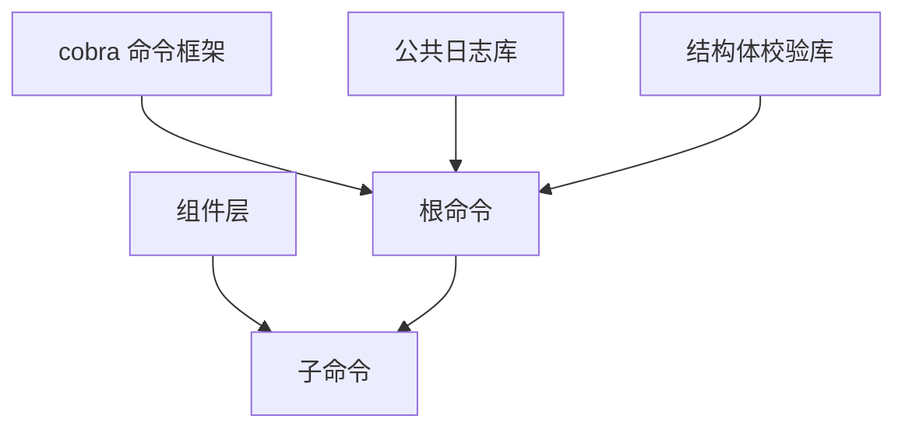

# dbactuator工具集

<cite>
**本文引用的文件**
- [cmd/cmd.go](file://dbm-services/bigdata/db-tools/dbactuator/cmd/cmd.go)
- [internal/subcmd/subcmd.go](file://dbm-services/bigdata/db-tools/dbactuator/internal/subcmd/subcmd.go)
- [internal/subcmd/sysinitcmd/sysinit.go](file://dbm-services/bigdata/db-tools/dbactuator/internal/subcmd/sysinitcmd/sysinit.go)
- [pkg/components/sysinit/sysinit.go](file://dbm-services/bigdata/db-tools/dbactuator/pkg/components/sysinit/sysinit.go)
- [docs/dbactuator.md](file://dbm-services/bigdata/db-tools/dbactuator/docs/dbactuator.md)
- [README.md](file://dbm-services/bigdata/db-tools/dbactuator/README.md)
- [cmd/cmd.go](file://dbm-services/sqlserver/db-tools/dbactuator/cmd/cmd.go)
- [cmd/cmd.go](file://dbm-services/oracle/db-tools/dbactuator/main.go)
</cite>

## 目录
1. [简介](#简介)
2. [项目结构](#项目结构)
3. [核心组件](#核心组件)
4. [架构总览](#架构总览)
5. [详细组件分析](#详细组件分析)
6. [依赖分析](#依赖分析)
7. [性能考虑](#性能考虑)
8. [故障排查指南](#故障排查指南)
9. [结论](#结论)
10. [附录](#附录)

## 简介
dbactuator 是一个数据库操作命令行工具集，面向多数据库与大数据生态的运维自动化，提供统一的命令入口与可扩展的子命令体系。其核心目标是将复杂的数据库运维操作拆解为“原子步骤”，通过上层编排组合完成场景化任务。工具支持多种数据库与组件的安装、初始化、变更与检查等操作，并提供标准化的参数传递与日志输出机制。

## 项目结构
dbactuator 在不同数据库/组件下存在独立的入口与子命令实现，但共享统一的参数模型与执行框架。核心结构包括：
- 入口命令定义与分组：根命令负责注册各子命令分组（如 sysinit、crontab、common、es、kafka、pulsar、influxdb、hdfs、vm、doris 等）。
- 子命令与执行器：每个子命令封装具体业务逻辑，通过统一的参数反序列化与校验流程，按步骤顺序执行。
- 组件层：封装通用能力（如系统初始化、下载、文件服务等），供子命令调用。
- 日志与心跳：统一的日志记录与定时心跳输出，便于远端监控与排障。

图表来源
- [cmd/cmd.go:99-167](file://dbm-services/bigdata/db-tools/dbactuator/cmd/cmd.go#L99-L167)

章节来源
- [cmd/cmd.go:75-185](file://dbm-services/bigdata/db-tools/dbactuator/cmd/cmd.go#L75-L185)
- [docs/dbactuator.md:14-31](file://dbm-services/bigdata/db-tools/dbactuator/docs/dbactuator.md#L14-L31)

## 核心组件
- 根命令与参数
  - 根命令提供统一的持久化标志位，覆盖所有子命令：payload、payload-format、uid、root_id、node_id、version_id、show-payload、rollback、helper 等。
  - 支持定时心跳输出，便于远端观察执行状态。
- 参数传递与校验
  - 提供三种反序列化方式：基础反序列化（含 general/extend 分层）、简单反序列化（直接 body）、raw/base64 格式切换。
  - 使用结构体校验库进行参数校验，确保输入合法。
- 步骤化执行
  - 将复杂任务拆分为若干 StepFunc，依次执行；每步记录开始与结束日志，便于定位问题。
- 日志与上下文
  - 根据环境变量选择输出到 stdout 或文件；自动注入 uid/node_id/root_id/version_id 扩展字段，便于关联单据与节点。

章节来源
- [cmd/cmd.go:170-182](file://dbm-services/bigdata/db-tools/dbactuator/cmd/cmd.go#L170-L182)
- [internal/subcmd/subcmd.go:44-54](file://dbm-services/bigdata/db-tools/dbactuator/internal/subcmd/subcmd.go#L44-L54)
- [internal/subcmd/subcmd.go:106-127](file://dbm-services/bigdata/db-tools/dbactuator/internal/subcmd/subcmd.go#L106-L127)
- [internal/subcmd/subcmd.go:138-165](file://dbm-services/bigdata/db-tools/dbactuator/internal/subcmd/subcmd.go#L138-L165)
- [internal/subcmd/subcmd.go:168-191](file://dbm-services/bigdata/db-tools/dbactuator/internal/subcmd/subcmd.go#L168-L191)
- [internal/subcmd/subcmd.go:82-99](file://dbm-services/bigdata/db-tools/dbactuator/internal/subcmd/subcmd.go#L82-L99)
- [internal/subcmd/subcmd.go:208-237](file://dbm-services/bigdata/db-tools/dbactuator/internal/subcmd/subcmd.go#L208-L237)

## 架构总览
dbactuator 采用“根命令 + 子命令分组 + 组件层”的三层架构：
- 根命令层：注册子命令分组、设置全局标志、统一生命周期钩子（如日志初始化、心跳输出）。
- 子命令层：每个子命令负责一个业务域（如 sysinit、es、kafka 等），封装参数解析、步骤执行与结果输出。
- 组件层：提供可复用的能力（如系统初始化、下载、文件服务、crontab 清理等），被子命令调用。

图表来源
- [cmd/cmd.go:99-167](file://dbm-services/bigdata/db-tools/dbactuator/cmd/cmd.go#L99-L167)
- [internal/subcmd/sysinitcmd/sysinit.go:20-36](file://dbm-services/bigdata/db-tools/dbactuator/internal/subcmd/sysinitcmd/sysinit.go#L20-L36)

## 详细组件分析

### 系统初始化子命令（sysinit）
- 功能概述
  - 初始化操作系统与 MySQL 用户相关设置，包括执行系统初始化脚本与设置 OS 密码。
- 参数模型
  - 通过 SysInitParam 指定 OS 用户与密码，由子命令反序列化并校验。
- 执行流程
  - 步骤一：执行系统初始化脚本。
  - 步骤二：为指定 OS 用户设置密码。
- 日志与输出
  - 每个步骤输出开始与成功日志；异常时记录错误并中断后续步骤。

图表来源
- [internal/subcmd/sysinitcmd/sysinit.go:29-69](file://dbm-services/bigdata/db-tools/dbactuator/internal/subcmd/sysinitcmd/sysinit.go#L29-L69)
- [pkg/components/sysinit/sysinit.go:24-55](file://dbm-services/bigdata/db-tools/dbactuator/pkg/components/sysinit/sysinit.go#L24-L55)

章节来源
- [internal/subcmd/sysinitcmd/sysinit.go:14-70](file://dbm-services/bigdata/db-tools/dbactuator/internal/subcmd/sysinitcmd/sysinit.go#L14-L70)
- [pkg/components/sysinit/sysinit.go:13-56](file://dbm-services/bigdata/db-tools/dbactuator/pkg/components/sysinit/sysinit.go#L13-L56)

### 参数传递机制与 payload 格式
- payload 传递
  - 支持 base64 与 raw 两种格式，通过 payload-format 切换。
  - 支持通用参数与扩展参数的分层结构（general/extend），用于 SQLServer/Oracle 等变体。
- 反序列化策略
  - 基础反序列化：期望顶层包含 extend 字段的实际参数，general 字段为通用参数。
  - 简单反序列化：直接传入实际参数对象。
  - raw/base64：根据格式自动解码后再解析。
- 校验与帮助
  - 使用结构体校验库对参数进行验证；支持 --helper 输出参数说明与示例。

图表来源
- [internal/subcmd/subcmd.go:106-127](file://dbm-services/bigdata/db-tools/dbactuator/internal/subcmd/subcmd.go#L106-L127)
- [internal/subcmd/subcmd.go:138-165](file://dbm-services/bigdata/db-tools/dbactuator/internal/subcmd/subcmd.go#L138-L165)
- [internal/subcmd/subcmd.go:168-191](file://dbm-services/bigdata/db-tools/dbactuator/internal/subcmd/subcmd.go#L168-L191)

章节来源
- [internal/subcmd/subcmd.go:20-27](file://dbm-services/bigdata/db-tools/dbactuator/internal/subcmd/subcmd.go#L20-L27)
- [internal/subcmd/subcmd.go:106-191](file://dbm-services/bigdata/db-tools/dbactuator/internal/subcmd/subcmd.go#L106-L191)

### 日志与心跳
- 日志
  - 根据 MODE 环境变量决定输出到 stdout 或写入 logs/actuator_{uid}_{node_id}.log。
  - 自动注入扩展字段（uid、node_id、root_id、version_id）。
- 心跳
  - 启动定时器，周期性输出时间戳与心跳信息，便于远端监控。

章节来源
- [internal/subcmd/subcmd.go:208-237](file://dbm-services/bigdata/db-tools/dbactuator/internal/subcmd/subcmd.go#L208-L237)
- [cmd/cmd.go:192-206](file://dbm-services/bigdata/db-tools/dbactuator/cmd/cmd.go#L192-L206)

### 多数据库/组件支持概览
- 大数据与通用组件
  - sysinit、crontab、common、download、es、kafka、pulsar、influxdb、hdfs、vm、doris 等子命令分组。
- 数据库专用
  - MySQL、Redis、MongoDB、Oracle、SQLServer 等数据库工具集均提供各自的入口与子命令实现，遵循统一的参数与执行模式。

章节来源
- [cmd/cmd.go:99-167](file://dbm-services/bigdata/db-tools/dbactuator/cmd/cmd.go#L99-L167)
- [cmd/cmd.go:67-143](file://dbm-services/sqlserver/db-tools/dbactuator/cmd/cmd.go#L67-L143)
- [main.go:10-12](file://dbm-services/oracle/db-tools/dbactuator/main.go#L10-L12)

## 依赖分析
- 命令框架
  - 使用 cobra 构建命令树与分组，支持子命令帮助与自动补全。
- 日志与错误处理
  - 使用公共日志库记录执行过程；panic 恢复与错误输出统一处理。
- 参数校验
  - 使用结构体校验库进行参数合法性校验，提升健壮性。
- 组件复用
  - 通过组件层抽象通用能力，降低子命令重复实现成本。

图表来源
- [cmd/cmd.go:8-30](file://dbm-services/bigdata/db-tools/dbactuator/cmd/cmd.go#L8-L30)
- [internal/subcmd/subcmd.go:4-18](file://dbm-services/bigdata/db-tools/dbactuator/internal/subcmd/subcmd.go#L4-L18)

章节来源
- [cmd/cmd.go:8-30](file://dbm-services/bigdata/db-tools/dbactuator/cmd/cmd.go#L8-L30)
- [internal/subcmd/subcmd.go:4-18](file://dbm-services/bigdata/db-tools/dbactuator/internal/subcmd/subcmd.go#L4-L18)

## 性能考虑
- I/O 与脚本执行
  - 系统初始化脚本写入临时文件并执行，建议确保磁盘空间与权限充足。
- 日志输出
  - 文件日志写入需考虑磁盘 IO；在高并发场景下建议合理规划日志路径与轮转策略。
- 心跳频率
  - 心跳周期固定为 10 秒，可根据实际场景调整（需修改源码）。

## 故障排查指南
- 常见问题
  - 参数为空或格式错误：检查 payload 是否正确编码、format 是否匹配。
  - 子命令不存在：确认子命令名称拼写与可用列表一致。
  - 权限不足：系统初始化与脚本执行需要相应权限。
- 排查步骤
  - 使用 --helper 获取参数说明与示例。
  - 检查日志文件（logs/actuator_{uid}_{node_id}.log）定位错误。
  - 使用 --show-payload 输出解析后的 payload 内容核对。
- 错误恢复
  - 若执行中断，可结合 rollback 标志与回滚 payload（SQLServer/Oracle 变体支持）进行恢复。

章节来源
- [internal/subcmd/subcmd.go:263-284](file://dbm-services/bigdata/db-tools/dbactuator/internal/subcmd/subcmd.go#L263-L284)
- [internal/subcmd/subcmd.go:194-199](file://dbm-services/bigdata/db-tools/dbactuator/internal/subcmd/subcmd.go#L194-L199)
- [cmd/cmd.go:192-206](file://dbm-services/bigdata/db-tools/dbactuator/cmd/cmd.go#L192-L206)

## 结论
dbactuator 通过统一的根命令与参数模型，将多数据库与组件的运维操作标准化、模块化与可扩展化。其步骤化执行与完善的日志/心跳机制，使其适用于复杂的生产运维场景。建议在实际使用中：
- 明确 payload 的格式与结构，优先使用 --helper 生成参数说明与示例。
- 在高并发或大规模部署场景下，关注日志与脚本执行的资源开销。
- 将原子步骤组合为流水线，提升整体运维效率与一致性。

## 附录

### 命令使用示例与最佳实践
- 基本用法
  - 通过 -p/--payload 传入 base64 编码的 JSON；必要时配合 -m 指定 payload-format=raw。
  - 使用 -u/-n/-R/-V 关联单据与节点信息，便于日志追踪。
- sysinit 示例
  - 子命令通过 --example 展示参数结构；执行前建议先用 --helper 查看参数说明。
- 最佳实践
  - 将参数定义与校验前置，减少执行期错误。
  - 对关键步骤增加幂等判断，避免重复执行造成副作用。
  - 在 CI/CD 中集成 dbactuator，结合回滚策略保障变更安全。

章节来源
- [docs/dbactuator.md:10-31](file://dbm-services/bigdata/db-tools/dbactuator/docs/dbactuator.md#L10-L31)
- [README.md:36-114](file://dbm-services/bigdata/db-tools/dbactuator/README.md#L36-L114)