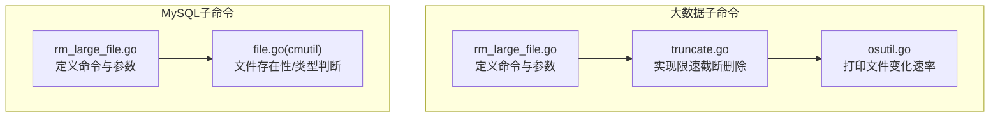
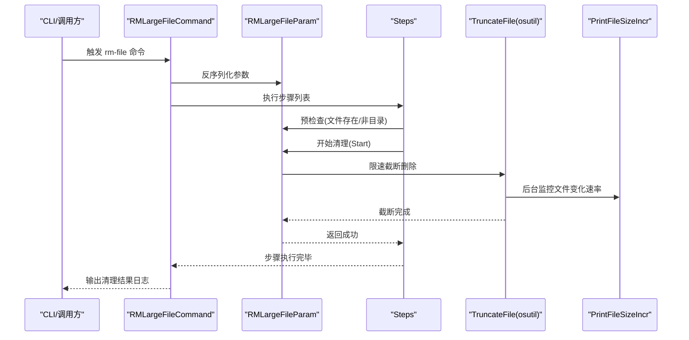
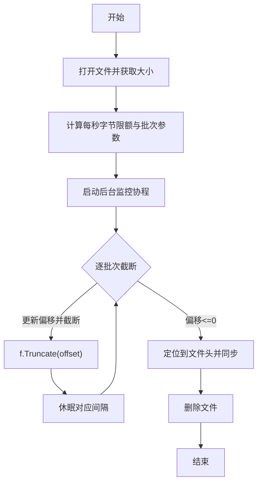
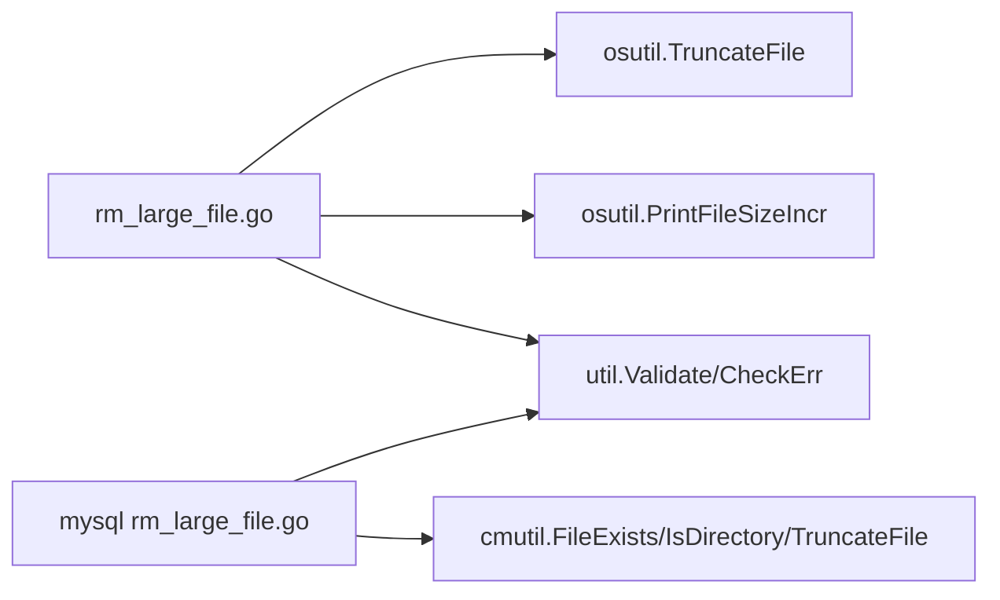

# 大文件清理管理

<cite>
**本文引用的文件**
- [rm_large_file.go（大数据）](file://dbm-services/bigdata/db-tools/dbactuator/internal/subcmd/commoncmd/rm_large_file.go)
- [rm_large_file.go（MySQL）](file://dbm-services/mysql/db-tools/dbactuator/internal/subcmd/commoncmd/rm_large_file.go)
- [truncate.go（大数据）](file://dbm-services/bigdata/db-tools/dbactuator/pkg/util/osutil/truncate.go)
- [osutil.go（大数据）](file://dbm-services/bigdata/db-tools/dbactuator/pkg/util/osutil/osutil.go)
- [file.go（公共库 cmutil）](file://dbm-services/common/go-pubpkg/cmutil/file.go)
- [util.go（大数据）](file://dbm-services/bigdata/db-tools/dbactuator/pkg/util/util.go)
- [subcmd.go（通用子命令框架）](file://dbm-services/bigdata/db-tools/dbactuator/internal/subcmd/subcmd.go)
</cite>

## 目录
1. [简介](#简介)
2. [项目结构](#项目结构)
3. [核心组件](#核心组件)
4. [架构总览](#架构总览)
5. [详细组件分析](#详细组件分析)
6. [依赖分析](#依赖分析)
7. [性能考量](#性能考量)
8. [故障排查指南](#故障排查指南)
9. [结论](#结论)
10. [附录：使用场景与最佳实践](#附录使用场景与最佳实践)

## 简介
本文件围绕“大文件清理管理”能力进行系统化说明，重点解读 rm_large_file.go 中的大文件识别、限速清理与安全删除机制。该能力通过分块截断与限速写入的方式，将大文件删除过程从“一次性清零+删除”转变为“逐步截断+间歇同步”，从而降低对系统 IO 的瞬时冲击，提升稳定性与可控性；同时保留了可配置的带宽上限，便于在生产环境中按需调优。

## 项目结构
- 两套实现分别位于大数据与 MySQL 子项目中，职责一致但依赖略有差异：
  - 大数据版本：依赖本地 osutil 工具集（含 TruncateFile、PrintFileSizeIncr 等）
  - MySQL 版本：依赖公共 cmutil 工具集（含 FileExists、IsDirectory、TruncateFile 等）



图表来源
- [rm_large_file.go（大数据）:1-121](file://dbm-services/bigdata/db-tools/dbactuator/internal/subcmd/commoncmd/rm_large_file.go#L1-L121)
- [truncate.go（大数据）:1-91](file://dbm-services/bigdata/db-tools/dbactuator/pkg/util/osutil/truncate.go#L1-L91)
- [osutil.go（大数据）:560-651](file://dbm-services/bigdata/db-tools/dbactuator/pkg/util/osutil/osutil.go#L560-L651)
- [rm_large_file.go（MySQL）:1-123](file://dbm-services/mysql/db-tools/dbactuator/internal/subcmd/commoncmd/rm_large_file.go#L1-L123)
- [file.go（公共库 cmutil）:33-97](file://dbm-services/common/go-pubpkg/cmutil/file.go#L33-L97)

章节来源
- [rm_large_file.go（大数据）:1-121](file://dbm-services/bigdata/db-tools/dbactuator/internal/subcmd/commoncmd/rm_large_file.go#L1-L121)
- [rm_large_file.go（MySQL）:1-123](file://dbm-services/mysql/db-tools/dbactuator/internal/subcmd/commoncmd/rm_large_file.go#L1-L123)

## 核心组件
- 命令入口与参数模型
  - 命令名称：rm-file
  - 参数：
    - filename：必填，待清理的文件绝对路径或相对路径
    - bw_limit_mb：必填，限速带宽，单位 MB/s，范围 1~1000，默认 30
  - 行为：先预检查（文件存在性、是否为目录），再执行限速截断删除

- 清理流程
  - 预检查：确认目标为普通文件且存在
  - 限速截断：按带宽限制分块截断文件末尾，周期性休眠，避免瞬时高 IO
  - 完成后同步并删除文件

- 关键工具
  - TruncateFile：实现分块截断与限速删除
  - PrintFileSizeIncr：后台监控文件大小变化速率
  - FileExists/IsDirectory：文件存在性与类型判断（MySQL 版本使用 cmutil）

章节来源
- [rm_large_file.go（大数据）:15-58](file://dbm-services/bigdata/db-tools/dbactuator/internal/subcmd/commoncmd/rm_large_file.go#L15-L58)
- [rm_large_file.go（MySQL）:15-58](file://dbm-services/mysql/db-tools/dbactuator/internal/subcmd/commoncmd/rm_large_file.go#L15-L58)
- [truncate.go（大数据）:13-61](file://dbm-services/bigdata/db-tools/dbactuator/pkg/util/osutil/truncate.go#L13-L61)
- [osutil.go（大数据）:571-616](file://dbm-services/bigdata/db-tools/dbactuator/pkg/util/osutil/osutil.go#L571-L616)
- [file.go（公共库 cmutil）:33-97](file://dbm-services/common/go-pubpkg/cmutil/file.go#L33-L97)

## 架构总览
下图展示从命令入口到文件删除的完整调用链路，以及限速截断的核心算法。



图表来源
- [rm_large_file.go（大数据）:67-120](file://dbm-services/bigdata/db-tools/dbactuator/internal/subcmd/commoncmd/rm_large_file.go#L67-L120)
- [truncate.go（大数据）:13-61](file://dbm-services/bigdata/db-tools/dbactuator/pkg/util/osutil/truncate.go#L13-L61)
- [osutil.go（大数据）:589-616](file://dbm-services/bigdata/db-tools/dbactuator/pkg/util/osutil/osutil.go#L589-L616)

## 详细组件分析

### 组件一：命令与参数模型
- 结构体与字段
  - RMLargeFileParam：包含 filename、bw_limit_mb
  - RMLargeFileCmd：封装 BaseOptions 与 Payload
- 校验与初始化
  - PreCheck：校验文件存在性与类型；若未设置带宽则回退默认值
  - Init/Run：基于通用子命令框架进行参数反序列化与步骤编排

```mermaid
classDiagram
class RMLargeFileCmd {
+BaseOptions
+Payload : RMLargeFileParam
+Init() error
+Validate() error
+Run() error
}
class RMLargeFileParam {
+string Filename
+int BWLimitMB
+PreCheck() error
+Start() error
+Example() interface{}
}
RMLargeFileCmd --> RMLargeFileParam : "组合"
```

图表来源
- [rm_large_file.go（大数据）:15-120](file://dbm-services/bigdata/db-tools/dbactuator/internal/subcmd/commoncmd/rm_large_file.go#L15-L120)
- [rm_large_file.go（MySQL）:15-122](file://dbm-services/mysql/db-tools/dbactuator/internal/subcmd/commoncmd/rm_large_file.go#L15-L122)

章节来源
- [rm_large_file.go（大数据）:15-120](file://dbm-services/bigdata/db-tools/dbactuator/internal/subcmd/commoncmd/rm_large_file.go#L15-L120)
- [rm_large_file.go（MySQL）:15-122](file://dbm-services/mysql/db-tools/dbactuator/internal/subcmd/commoncmd/rm_large_file.go#L15-L122)

### 组件二：限速截断删除算法（TruncateFile）
- 输入
  - 目标文件路径、带宽限制 bw_limit_mb（MB/s）
- 核心逻辑
  - 以 1 秒为粒度，将带宽换算为每秒写入字节数，再拆分为若干批次（固定 10 次/秒）
  - 每批截断固定字节数，并休眠对应毫秒数，形成稳定速率
  - 截断完成后，定位到文件开头并同步，随后删除文件
- 监控
  - 启动后台协程，周期性打印文件大小变化速率，便于观察清理进度与稳定性



图表来源
- [truncate.go（大数据）:13-61](file://dbm-services/bigdata/db-tools/dbactuator/pkg/util/osutil/truncate.go#L13-L61)
- [osutil.go（大数据）:589-616](file://dbm-services/bigdata/db-tools/dbactuator/pkg/util/osutil/osutil.go#L589-L616)

章节来源
- [truncate.go（大数据）:13-61](file://dbm-services/bigdata/db-tools/dbactuator/pkg/util/osutil/truncate.go#L13-L61)
- [osutil.go（大数据）:571-616](file://dbm-services/bigdata/db-tools/dbactuator/pkg/util/osutil/osutil.go#L571-L616)

### 组件三：文件存在性与类型判断
- 大数据版本
  - 使用本地 util 包的 FileExists/IsDirectory 判断
- MySQL 版本
  - 使用公共 cmutil 的 FileExists/IsDirectory 判断
- 二者均确保目标为普通文件，避免误删目录

章节来源
- [util.go（大数据）:179-195](file://dbm-services/bigdata/db-tools/dbactuator/pkg/util/util.go#L179-L195)
- [file.go（公共库 cmutil）:33-97](file://dbm-services/common/go-pubpkg/cmutil/file.go#L33-L97)

### 组件四：通用子命令框架与步骤编排
- 通用框架提供：
  - BaseOptions：承载通用参数（如 uid、node_id、payload 等）
  - Steps：顺序执行多个步骤，支持错误中断与日志记录
  - 反序列化与参数校验：统一处理 payload 解析与结构校验
- rm-large-file 命令复用该框架，保证一致性与可维护性

章节来源
- [subcmd.go（通用子命令框架）:40-191](file://dbm-services/bigdata/db-tools/dbactuator/internal/subcmd/subcmd.go#L40-L191)

## 依赖分析
- 大数据版本
  - 依赖本地 osutil：TruncateFile、PrintFileSizeIncr
  - 依赖本地 util：参数校验与工具函数
- MySQL 版本
  - 依赖公共 cmutil：FileExists/IsDirectory/TruncateFile
  - 依赖本地 util：参数校验与工具函数
- 共同点
  - 均通过 Steps 编排“预检查—删除”两个阶段
  - 均支持带宽参数配置与默认值回退



图表来源
- [rm_large_file.go（大数据）:3-13](file://dbm-services/bigdata/db-tools/dbactuator/internal/subcmd/commoncmd/rm_large_file.go#L3-L13)
- [rm_large_file.go（MySQL）:3-12](file://dbm-services/mysql/db-tools/dbactuator/internal/subcmd/commoncmd/rm_large_file.go#L3-L12)
- [truncate.go（大数据）:13-61](file://dbm-services/bigdata/db-tools/dbactuator/pkg/util/osutil/truncate.go#L13-L61)
- [osutil.go（大数据）:589-616](file://dbm-services/bigdata/db-tools/dbactuator/pkg/util/osutil/osutil.go#L589-L616)
- [file.go（公共库 cmutil）:33-97](file://dbm-services/common/go-pubpkg/cmutil/file.go#L33-L97)

章节来源
- [rm_large_file.go（大数据）:3-13](file://dbm-services/bigdata/db-tools/dbactuator/internal/subcmd/commoncmd/rm_large_file.go#L3-L13)
- [rm_large_file.go（MySQL）:3-12](file://dbm-services/mysql/db-tools/dbactuator/internal/subcmd/commoncmd/rm_large_file.go#L3-L12)

## 性能考量
- 限速策略
  - 将每秒字节数拆分为固定频次的批次，确保平均速率稳定
  - 通过休眠控制批次间隔，避免突发 IO 抖动
- 监控与可观测性
  - 后台协程周期性输出文件大小变化速率，便于实时掌握清理状态
- 同步与删除
  - 截断完成后定位到文件头并同步，再删除，减少数据残留风险

章节来源
- [truncate.go（大数据）:13-61](file://dbm-services/bigdata/db-tools/dbactuator/pkg/util/osutil/truncate.go#L13-L61)
- [osutil.go（大数据）:589-616](file://dbm-services/bigdata/db-tools/dbactuator/pkg/util/osutil/osutil.go#L589-L616)

## 故障排查指南
- 常见错误与定位
  - 文件不存在：预检查阶段会报错，确认 filename 是否正确
  - 目标为目录：预检查阶段会报错，确保传入的是普通文件
  - 权限不足：TruncateFile 打开文件失败或删除失败，检查文件权限与磁盘空间
  - 带宽参数异常：bw_limit_mb 必须在 1~1000 范围内，超出范围将触发校验失败
- 排查建议
  - 查看命令输出日志，确认“预检查—删除”两步是否均成功
  - 使用后台监控输出评估清理速率是否符合预期
  - 若清理长时间无变化，检查是否存在并发写入或文件被占用

章节来源
- [rm_large_file.go（大数据）:37-58](file://dbm-services/bigdata/db-tools/dbactuator/internal/subcmd/commoncmd/rm_large_file.go#L37-L58)
- [rm_large_file.go（MySQL）:37-58](file://dbm-services/mysql/db-tools/dbactuator/internal/subcmd/commoncmd/rm_large_file.go#L37-L58)
- [truncate.go（大数据）:13-61](file://dbm-services/bigdata/db-tools/dbactuator/pkg/util/osutil/truncate.go#L13-L61)

## 结论
该大文件清理能力通过“限速截断+周期休眠”的方式，有效降低了大文件删除对系统 IO 的瞬时压力；配合后台监控与严格的参数校验，实现了在生产环境中的安全与可控。两套实现（大数据/MySQL）在接口与行为上保持一致，便于统一运维与扩展。

## 附录：使用场景与最佳实践
- 使用场景
  - 数据库安装包清理：对超大安装包进行限速清理，避免影响业务 IO
  - 临时文件管理：定期清理超大临时文件，释放磁盘空间
  - 磁盘空间优化：在低峰期对超大日志/备份文件进行渐进式清理
- 最佳实践
  - 合理设置 bw_limit_mb：根据磁盘性能与业务负载动态调整
  - 关注后台监控输出：结合实际速率与文件大小，估算清理耗时
  - 避免在清理期间进行大量并发写入，防止速率波动
  - 对关键系统文件谨慎操作，确保仅针对普通文件执行