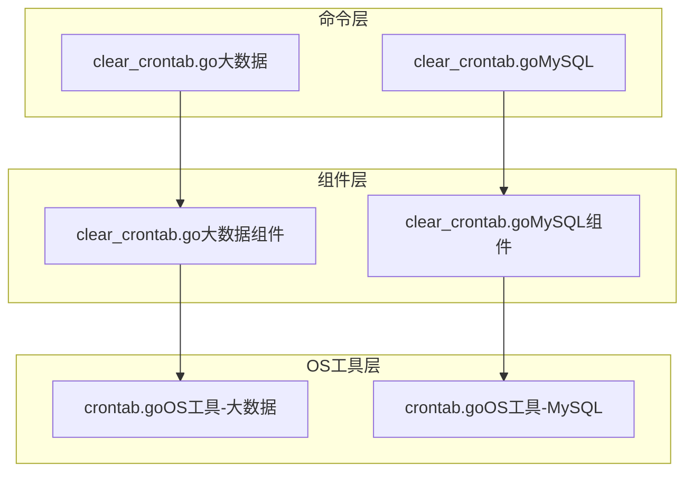
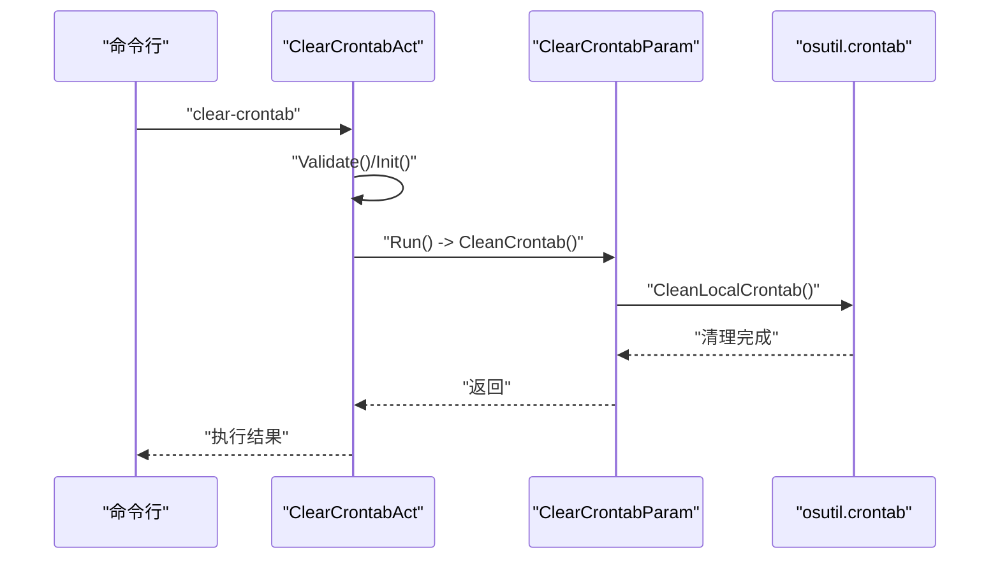
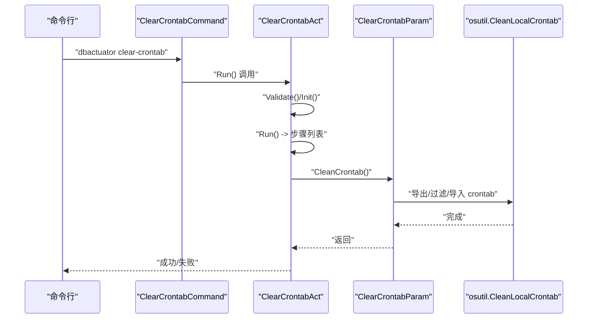
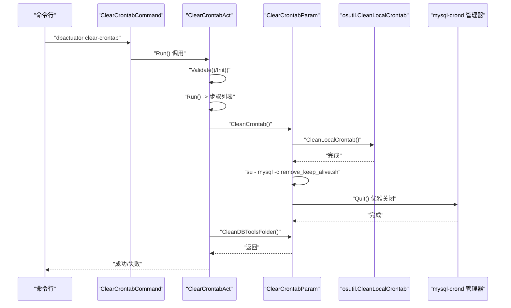
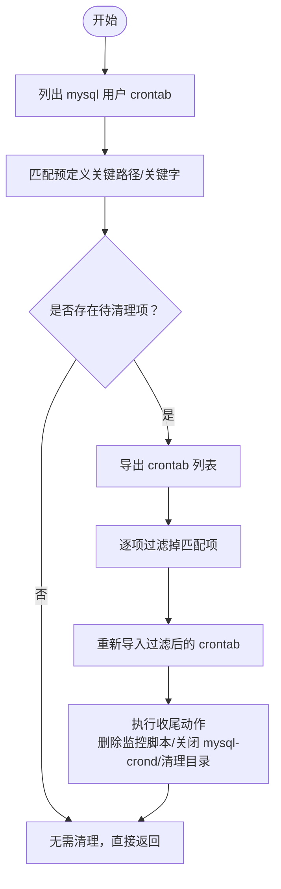
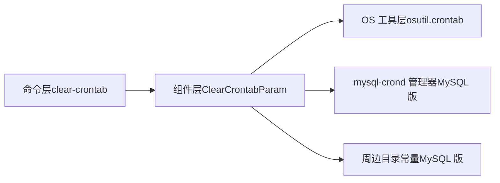

# 定时任务管理

<cite>
**本文引用的文件**
- [clear_crontab.go（大数据）](file://dbm-services/bigdata/db-tools/dbactuator/internal/subcmd/crontabcmd/clear_crontab.go)
- [crontabcmd.go（大数据）](file://dbm-services/bigdata/db-tools/dbactuator/internal/subcmd/crontabcmd/crontabcmd.go)
- [clear_crontab.go（MySQL）](file://dbm-services/mysql/db-tools/dbactuator/internal/subcmd/crontabcmd/clear_crontab.go)
- [crontabcmd.go（MySQL）](file://dbm-services/mysql/db-tools/dbactuator/internal/subcmd/crontabcmd/crontabcmd.go)
- [crontab.go（大数据组件）](file://dbm-services/bigdata/db-tools/dbactuator/pkg/components/crontab/clear_crontab.go)
- [crontab.go（MySQL组件）](file://dbm-services/mysql/db-tools/dbactuator/pkg/components/crontab/clear_crontab.go)
- [crontab.go（OS工具-大数据）](file://dbm-services/bigdata/db-tools/dbactuator/pkg/util/osutil/crontab.go)
- [crontab.go（OS工具-MySQL）](file://dbm-services/mysql/db-tools/dbactuator/pkg/util/osutil/crontab.go)
- [subcmd.go](file://dbm-services/bigdata/db-tools/dbactuator/internal/subcmd/subcmd.go)
</cite>

## 目录
1. [简介](#简介)
2. [项目结构](#项目结构)
3. [核心组件](#核心组件)
4. [架构总览](#架构总览)
5. [详细组件分析](#详细组件分析)
6. [依赖关系分析](#依赖关系分析)
7. [性能考量](#性能考量)
8. [故障排查指南](#故障排查指南)
9. [结论](#结论)
10. [附录：crontab 配置与调度语法](#附录crontab-配置与调度语法)

## 简介
本文件面向“定时任务管理”能力，聚焦于 crontabcmd 子命令模块在 MySQL 与大数据场景下的实现与使用，覆盖以下主题：
- 定时任务的添加、修改、删除与查询的实现原理与流程
- 清理逻辑（clear_crontab）：任务冲突检测、批量删除、配置恢复
- crontab 配置语法、调度表达式与执行环境
- 数据库运维典型场景：备份计划、健康检查、日志轮转等
- 任务执行的监控、日志记录与异常处理
- 故障排查与性能优化建议

## 项目结构
crontabcmd 模块位于 dbactuator 的子命令层，按业务域拆分：
- MySQL 场景：内部命令与组件分别位于 mysql/db-tools/dbactuator
- 大数据场景：内部命令与组件分别位于 bigdata/db-tools/dbactuator
- 共用的 OS 工具层封装在 util/osutil 中，统一提供 crontab 的增删查改与清理能力

图表来源
- [clear_crontab.go（大数据）:1-80](file://dbm-services/bigdata/db-tools/dbactuator/internal/subcmd/crontabcmd/clear_crontab.go#L1-L80)
- [clear_crontab.go（MySQL）:1-102](file://dbm-services/mysql/db-tools/dbactuator/internal/subcmd/crontabcmd/clear_crontab.go#L1-L102)
- [crontab.go（大数据组件）:1-28](file://dbm-services/bigdata/db-tools/dbactuator/pkg/components/crontab/clear_crontab.go#L1-L28)
- [crontab.go（MySQL组件）:1-102](file://dbm-services/mysql/db-tools/dbactuator/pkg/components/crontab/clear_crontab.go#L1-L102)
- [crontab.go（OS工具-大数据）:1-254](file://dbm-services/bigdata/db-tools/dbactuator/pkg/util/osutil/crontab.go#L1-L254)
- [crontab.go（OS工具-MySQL）:1-250](file://dbm-services/mysql/db-tools/dbactuator/pkg/util/osutil/crontab.go#L1-L250)

章节来源
- [clear_crontab.go（大数据）:1-80](file://dbm-services/bigdata/db-tools/dbactuator/internal/subcmd/crontabcmd/clear_crontab.go#L1-L80)
- [clear_crontab.go（MySQL）:1-102](file://dbm-services/mysql/db-tools/dbactuator/internal/subcmd/crontabcmd/clear_crontab.go#L1-L102)
- [crontab.go（大数据组件）:1-28](file://dbm-services/bigdata/db-tools/dbactuator/pkg/components/crontab/clear_crontab.go#L1-L28)
- [crontab.go（MySQL组件）:1-102](file://dbm-services/mysql/db-tools/dbactuator/pkg/components/crontab/clear_crontab.go#L1-L102)
- [crontab.go（OS工具-大数据）:1-254](file://dbm-services/bigdata/db-tools/dbactuator/pkg/util/osutil/crontab.go#L1-L254)
- [crontab.go（OS工具-MySQL）:1-250](file://dbm-services/mysql/db-tools/dbactuator/pkg/util/osutil/crontab.go#L1-L250)

## 核心组件
- 命令入口（ClearCrontabCommand）
  - 大数据与 MySQL 分别定义了独立的命令入口，均通过 Cobra 构建子命令，绑定参数校验、初始化与执行步骤。
- 清理动作（ClearCrontabAct）
  - 大数据版仅执行清理 crontab；MySQL 版在清理 crontab 后，进一步清理周边工具目录。
- 组件服务（ClearCrontabParam）
  - 提供 CleanCrontab 与 CleanDBToolsFolder（MySQL 版）等方法，封装具体清理逻辑。
- OS 工具（osutil）
  - 提供 AddCrontab、ExecCrontab、ListCrontb、RemoveSystemCrontab、CleanLocalCrontab 等通用能力。

章节来源
- [clear_crontab.go（大数据）:20-66](file://dbm-services/bigdata/db-tools/dbactuator/internal/subcmd/crontabcmd/clear_crontab.go#L20-L66)
- [clear_crontab.go（MySQL）:30-80](file://dbm-services/mysql/db-tools/dbactuator/internal/subcmd/crontabcmd/clear_crontab.go#L30-L80)
- [crontab.go（大数据组件）:17-28](file://dbm-services/bigdata/db-tools/dbactuator/pkg/components/crontab/clear_crontab.go#L17-L28)
- [crontab.go（MySQL组件）:26-102](file://dbm-services/mysql/db-tools/dbactuator/pkg/components/crontab/clear_crontab.go#L26-L102)
- [crontab.go（OS工具-大数据）:117-147](file://dbm-services/bigdata/db-tools/dbactuator/pkg/util/osutil/crontab.go#L117-L147)
- [crontab.go（OS工具-MySQL）:119-147](file://dbm-services/mysql/db-tools/dbactuator/pkg/util/osutil/crontab.go#L119-L147)

## 架构总览
从命令到组件再到 OS 工具的调用链如下：

图表来源
- [clear_crontab.go（大数据）:29-65](file://dbm-services/bigdata/db-tools/dbactuator/internal/subcmd/crontabcmd/clear_crontab.go#L29-L65)
- [crontab.go（大数据组件）:17-28](file://dbm-services/bigdata/db-tools/dbactuator/pkg/components/crontab/clear_crontab.go#L17-L28)
- [crontab.go（OS工具-大数据）:198-254](file://dbm-services/bigdata/db-tools/dbactuator/pkg/util/osutil/crontab.go#L198-L254)

## 详细组件分析

### 清理命令与执行流程（大数据）
- 命令定义：通过 Cobra 注册 clear-crontab 子命令，绑定示例与执行函数。
- 初始化：从 payload 反序列化参数并校验。
- 步骤执行：依次执行清理 crontab 的步骤，记录每步状态与错误。

图表来源
- [clear_crontab.go（大数据）:29-65](file://dbm-services/bigdata/db-tools/dbactuator/internal/subcmd/crontabcmd/clear_crontab.go#L29-L65)
- [crontab.go（大数据组件）:17-28](file://dbm-services/bigdata/db-tools/dbactuator/pkg/components/crontab/clear_crontab.go#L17-L28)
- [crontab.go（OS工具-大数据）:198-254](file://dbm-services/bigdata/db-tools/dbactuator/pkg/util/osutil/crontab.go#L198-L254)

章节来源
- [clear_crontab.go（大数据）:20-66](file://dbm-services/bigdata/db-tools/dbactuator/internal/subcmd/crontabcmd/clear_crontab.go#L20-L66)
- [crontab.go（大数据组件）:17-28](file://dbm-services/bigdata/db-tools/dbactuator/pkg/components/crontab/clear_crontab.go#L17-L28)
- [crontab.go（OS工具-大数据）:198-254](file://dbm-services/bigdata/db-tools/dbactuator/pkg/util/osutil/crontab.go#L198-L254)

### 清理命令与执行流程（MySQL）
- 在大数据基础上，MySQL 版额外执行清理周边工具目录（如备份、监控、rotate_binlog 等）。
- 并通过 su - mysql -c 方式移除 mysql-crond 的保活任务，随后向本地管理器发送退出请求。

图表来源
- [clear_crontab.go（MySQL）:30-80](file://dbm-services/mysql/db-tools/dbactuator/internal/subcmd/crontabcmd/clear_crontab.go#L30-L80)
- [crontab.go（MySQL组件）:26-102](file://dbm-services/mysql/db-tools/dbactuator/pkg/components/crontab/clear_crontab.go#L26-L102)
- [crontab.go（OS工具-MySQL）:188-250](file://dbm-services/mysql/db-tools/dbactuator/pkg/util/osutil/crontab.go#L188-L250)

章节来源
- [clear_crontab.go（MySQL）:30-80](file://dbm-services/mysql/db-tools/dbactuator/internal/subcmd/crontabcmd/clear_crontab.go#L30-L80)
- [crontab.go（MySQL组件）:26-102](file://dbm-services/mysql/db-tools/dbactuator/pkg/components/crontab/clear_crontab.go#L26-L102)
- [crontab.go（OS工具-MySQL）:188-250](file://dbm-services/mysql/db-tools/dbactuator/pkg/util/osutil/crontab.go#L188-L250)

### 清理逻辑详解（冲突检测、批量删除、配置恢复）
- 冲突检测
  - 通过列出 mysql 用户的 crontab，匹配预定义的关键路径或关键字集合，识别待清理条目。
- 批量删除
  - 使用管道命令导出当前 crontab，逐个过滤掉匹配项后重新导入，避免逐条编辑带来的复杂性。
- 配置恢复
  - 在大数据场景中，清理后会尝试删除监控脚本文件，确保即使延迟生效也不会产生误报。
  - 在 MySQL 场景中，额外移除 mysql-crond 的保活任务并通过管理器优雅退出，最后清理周边目录。

图表来源
- [crontab.go（OS工具-大数据）:198-254](file://dbm-services/bigdata/db-tools/dbactuator/pkg/util/osutil/crontab.go#L198-L254)
- [crontab.go（OS工具-MySQL）:188-250](file://dbm-services/mysql/db-tools/dbactuator/pkg/util/osutil/crontab.go#L188-L250)
- [crontab.go（MySQL组件）:26-102](file://dbm-services/mysql/db-tools/dbactuator/pkg/components/crontab/clear_crontab.go#L26-L102)

章节来源
- [crontab.go（OS工具-大数据）:198-254](file://dbm-services/bigdata/db-tools/dbactuator/pkg/util/osutil/crontab.go#L198-L254)
- [crontab.go（OS工具-MySQL）:188-250](file://dbm-services/mysql/db-tools/dbactuator/pkg/util/osutil/crontab.go#L188-L250)
- [crontab.go（MySQL组件）:26-102](file://dbm-services/mysql/db-tools/dbactuator/pkg/components/crontab/clear_crontab.go#L26-L102)

### 定时任务的添加、修改、删除与查询
- 添加（AddCrontab）
  - 先读取现有 crontab，拼接新条目后整体导入，确保幂等性。
- 修改（RemoveSystemCrontab + ExecCrontab）
  - 通过正则与关键字过滤，生成不含目标条目的新列表，再导入替换。
- 删除（RemoveUserCrontab）
  - 直接移除指定用户的所有 crontab。
- 查询（ListCrontb / IsCrontabKeyExist / CrontabsExist）
  - 支持按关键字匹配与批量存在性检查，便于冲突检测与清理前置判断。

章节来源
- [crontab.go（OS工具-大数据）:117-147](file://dbm-services/bigdata/db-tools/dbactuator/pkg/util/osutil/crontab.go#L117-L147)
- [crontab.go（OS工具-大数据）:173-184](file://dbm-services/bigdata/db-tools/dbactuator/pkg/util/osutil/crontab.go#L173-L184)
- [crontab.go（OS工具-大数据）:96-111](file://dbm-services/bigdata/db-tools/dbactuator/pkg/util/osutil/crontab.go#L96-L111)
- [crontab.go（OS工具-大数据）:153-166](file://dbm-services/bigdata/db-tools/dbactuator/pkg/util/osutil/crontab.go#L153-L166)
- [crontab.go（OS工具-MySQL）:119-147](file://dbm-services/mysql/db-tools/dbactuator/pkg/util/osutil/crontab.go#L119-L147)
- [crontab.go（OS工具-MySQL）:175-186](file://dbm-services/mysql/db-tools/dbactuator/pkg/util/osutil/crontab.go#L175-L186)
- [crontab.go（OS工具-MySQL）:98-111](file://dbm-services/mysql/db-tools/dbactuator/pkg/util/osutil/crontab.go#L98-L111)
- [crontab.go（OS工具-MySQL）:155-168](file://dbm-services/mysql/db-tools/dbactuator/pkg/util/osutil/crontab.go#L155-L168)

### 命令行参数与执行框架
- 参数格式
  - 采用 JSON 字符串的 base64 编码作为 payload，支持 raw 与 base64 两种格式。
- 校验与反序列化
  - 通过统一的 BaseOptions 提供 Deserialize/DeserializeAndValidate/DeserializeSimple 等方法，结合结构体校验库进行参数校验。
- 日志与上下文
  - 根据 MODE 输出到控制台或 logs/actuator_*.log 文件，附加 uid/node_id/root_id/version_id 等上下文字段。

章节来源
- [subcmd.go:101-165](file://dbm-services/bigdata/db-tools/dbactuator/internal/subcmd/subcmd.go#L101-L165)
- [subcmd.go:208-237](file://dbm-services/bigdata/db-tools/dbactuator/internal/subcmd/subcmd.go#L208-L237)

## 依赖关系分析
- 命令层依赖组件层，组件层依赖 OS 工具层，形成清晰的分层职责。
- MySQL 版在清理 crontab 后，进一步依赖 mysql-crond 管理器与周边目录常量，体现更强的一致性清理策略。

图表来源
- [clear_crontab.go（MySQL）:30-80](file://dbm-services/mysql/db-tools/dbactuator/internal/subcmd/crontabcmd/clear_crontab.go#L30-L80)
- [crontab.go（MySQL组件）:26-102](file://dbm-services/mysql/db-tools/dbactuator/pkg/components/crontab/clear_crontab.go#L26-L102)
- [crontab.go（OS工具-MySQL）:188-250](file://dbm-services/mysql/db-tools/dbactuator/pkg/util/osutil/crontab.go#L188-L250)

章节来源
- [clear_crontab.go（MySQL）:30-80](file://dbm-services/mysql/db-tools/dbactuator/internal/subcmd/crontabcmd/clear_crontab.go#L30-L80)
- [crontab.go（MySQL组件）:26-102](file://dbm-services/mysql/db-tools/dbactuator/pkg/components/crontab/clear_crontab.go#L26-L102)
- [crontab.go（OS工具-MySQL）:188-250](file://dbm-services/mysql/db-tools/dbactuator/pkg/util/osutil/crontab.go#L188-L250)

## 性能考量
- 批量过滤优于逐条编辑：通过一次性导出、过滤、导入的方式减少多次交互开销。
- 关键字匹配与存在性检查：先做存在性判断，可避免不必要的写入。
- 清理后同步删除监控脚本：降低清理延迟导致的误报风险，提升系统一致性。
- MySQL 版额外的优雅关闭与目录清理：减少残留资源占用，降低后续维护成本。

## 故障排查指南
- 常见问题定位
  - crontab 列表为空或无权限：检查用户权限与 crontab -u mysql -l 是否可用。
  - 过滤失败：确认 grep -v 匹配规则与路径是否一致，关注输出日志中的错误信息。
  - 导入失败：核对 echo -e 输出内容与 crontab -u mysql 的导入语法。
  - MySQL 版 mysql-crond 无法关闭：检查本地管理器地址与网络连通性。
- 日志与上下文
  - 开发模式输出到 stdout，生产模式输出到 logs/actuator_*.log，结合 uid/node_id/root_id 快速定位任务。
- 回滚与重试
  - 建议在变更前备份原 crontab，必要时可回滚至备份版本。

章节来源
- [crontab.go（OS工具-大数据）:96-111](file://dbm-services/bigdata/db-tools/dbactuator/pkg/util/osutil/crontab.go#L96-L111)
- [crontab.go（OS工具-大数据）:137-147](file://dbm-services/bigdata/db-tools/dbactuator/pkg/util/osutil/crontab.go#L137-L147)
- [crontab.go（OS工具-MySQL）:98-111](file://dbm-services/mysql/db-tools/dbactuator/pkg/util/osutil/crontab.go#L98-L111)
- [crontab.go（OS工具-MySQL）:139-147](file://dbm-services/mysql/db-tools/dbactuator/pkg/util/osutil/crontab.go#L139-L147)
- [subcmd.go:208-237](file://dbm-services/bigdata/db-tools/dbactuator/internal/subcmd/subcmd.go#L208-L237)

## 结论
crontabcmd 模块通过清晰的分层设计与统一的 OS 工具能力，实现了对定时任务的标准化管理与安全清理。MySQL 版本在清理 crontab 的基础上，进一步整合 mysql-crond 与周边目录的清理，提升了运维一致性与可维护性。建议在生产环境中配合严格的参数校验、完善的日志记录与回滚策略，确保变更可控、可观测、可追溯。

## 附录：crontab 配置与调度语法
- 配置位置
  - 用户级：/usr/bin/crontab -u <user> -l/-r/-u
  - 系统级：/etc/crontab 或 /etc/cron.d/
- 调度表达式
  - 五段式：分钟 小时 日 月 周
  - 支持范围、步长、特殊字符（如 *、/、-、?、L、W 等），由 cron 解析器校验。
- 执行环境
  - 默认 PATH 与环境变量来自系统 crontab 环境，建议在脚本内显式设置 PATH 与工作目录，避免路径问题。
- 典型场景
  - 备份计划：按天/周/月设定备份任务，注意与业务低峰期错峰。
  - 健康检查：定期执行状态采集脚本，及时发现异常。
  - 日志轮转：定期轮转与清理日志，避免磁盘占满。

章节来源
- [crontab.go（OS工具-大数据）:192-196](file://dbm-services/bigdata/db-tools/dbactuator/pkg/util/osutil/crontab.go#L192-L196)
- [crontab.go（OS工具-MySQL）:192-196](file://dbm-services/mysql/db-tools/dbactuator/pkg/util/osutil/crontab.go#L192-L196)