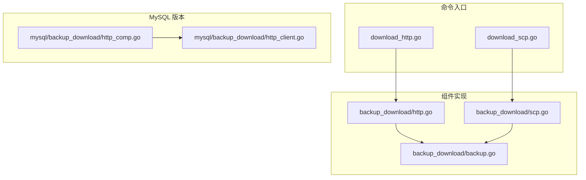
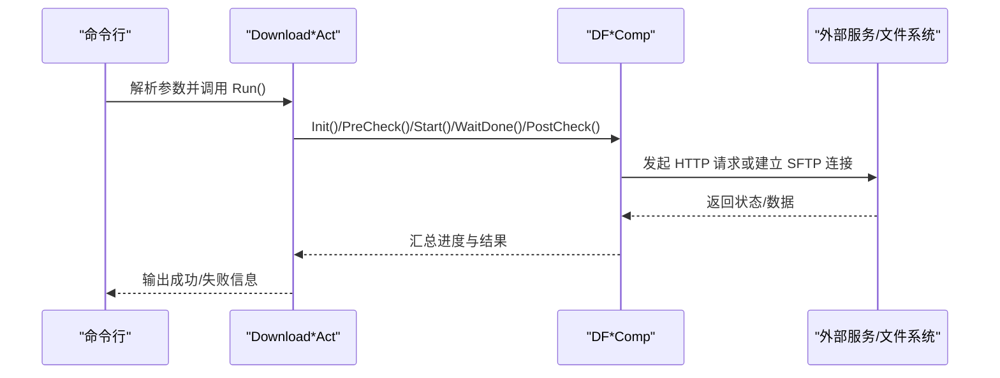
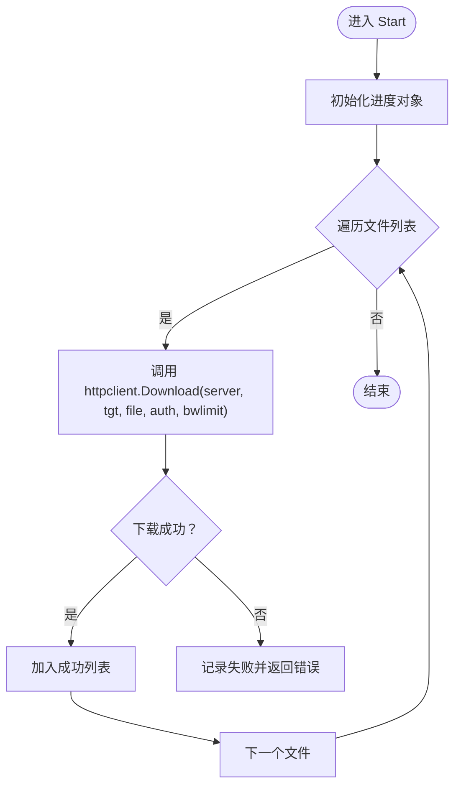
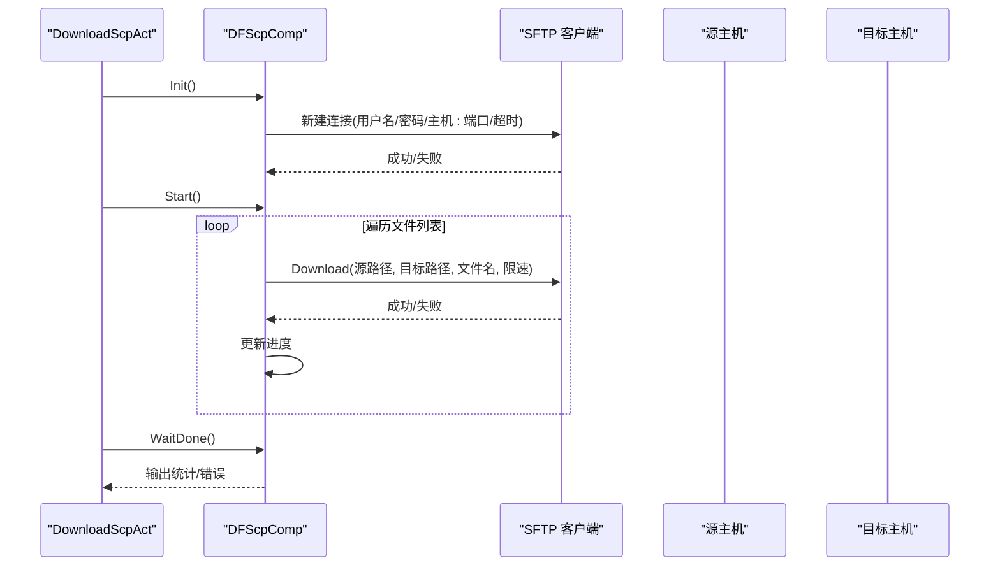
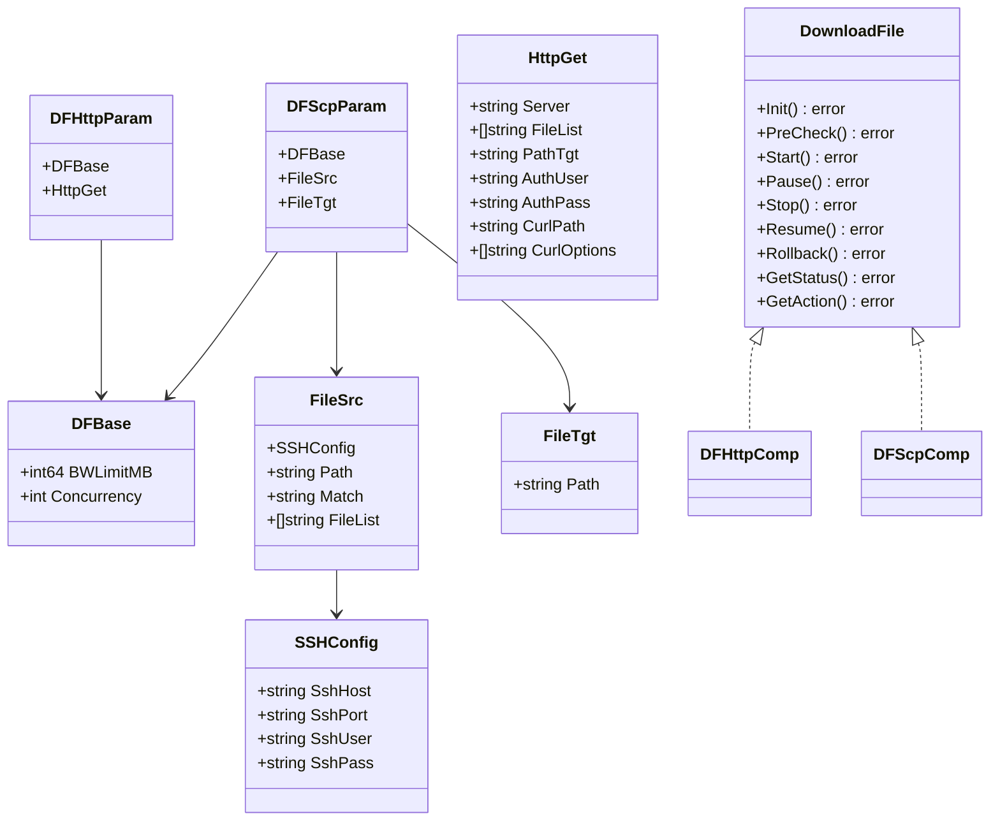
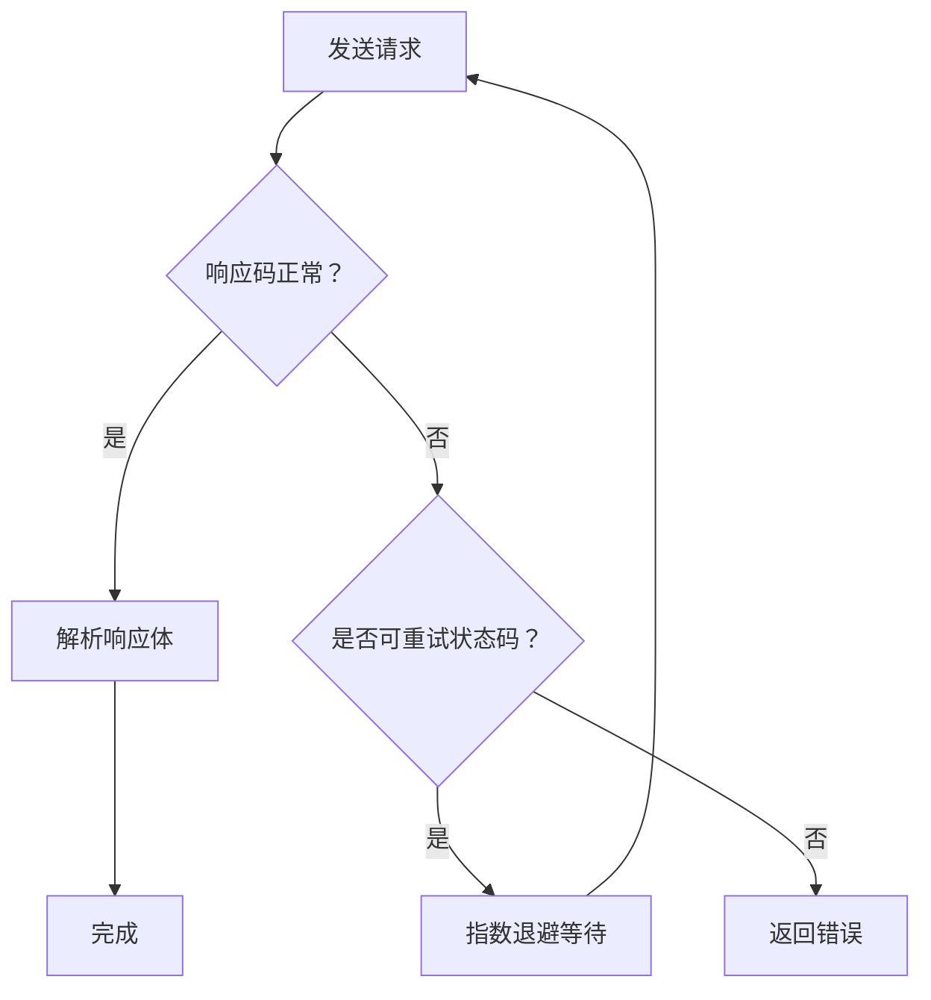
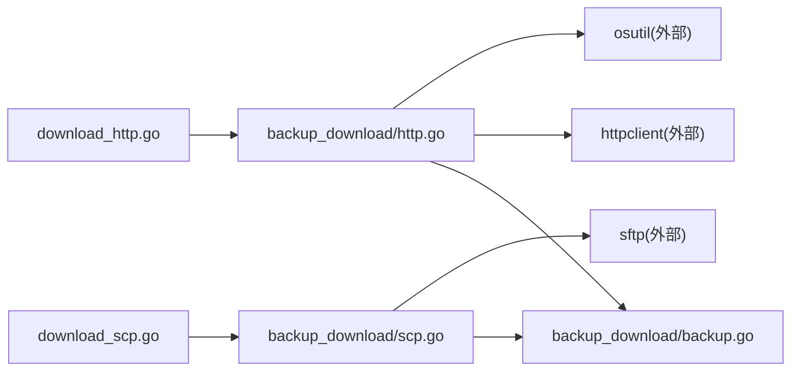

# 文件下载与传输操作

<cite>
**本文引用的文件**
- [download_http.go](file://dbm-services/bigdata/db-tools/dbactuator/internal/subcmd/commoncmd/download_http.go)
- [download_scp.go](file://dbm-services/bigdata/db-tools/dbactuator/internal/subcmd/commoncmd/download_scp.go)
- [http.go](file://dbm-services/bigdata/db-tools/dbactuator/pkg/components/backup_download/http.go)
- [scp.go](file://dbm-services/bigdata/db-tools/dbactuator/pkg/components/backup_download/scp.go)
- [backup.go](file://dbm-services/bigdata/db-tools/dbactuator/pkg/components/backup_download/backup.go)
- [http_client.go](file://dbm-services/mysql/db-tools/dbactuator/pkg/components/backup_download/http_client.go)
- [http_comp.go](file://dbm-services/mysql/db-tools/dbactuator/pkg/components/backup_download/http_comp.go)
</cite>

## 目录
1. [简介](#简介)
2. [项目结构](#项目结构)
3. [核心组件](#核心组件)
4. [架构总览](#架构总览)
5. [详细组件分析](#详细组件分析)
6. [依赖关系分析](#依赖关系分析)
7. [性能考量](#性能考量)
8. [故障排除指南](#故障排除指南)
9. [结论](#结论)
10. [附录](#附录)

## 简介
本文面向数据库部署与运维场景，系统化梳理 dbactuator 中“文件下载与传输”能力，重点覆盖两类传输方式：
- HTTP 下载（基于 curl 的命令行封装与 HTTP 客户端直连）
- SCP 安全传输（基于 SFTP 的密钥/口令认证与文件下载）

文档将从架构、数据流、处理逻辑、配置参数、使用示例到故障排除进行完整说明，并给出最佳实践建议。

## 项目结构
围绕文件下载与传输的相关代码主要分布在以下位置：
- 子命令入口：bigdata 版本的 download_http.go 与 download_scp.go
- 组件实现：backup_download 包下的 http.go、scp.go、backup.go
- MySQL 版本的 HTTP 组件与 HTTP 客户端：http_comp.go、http_client.go

图表来源
- [download_http.go:1-102](file://dbm-services/bigdata/db-tools/dbactuator/internal/subcmd/commoncmd/download_http.go#L1-L102)
- [download_scp.go:1-94](file://dbm-services/bigdata/db-tools/dbactuator/internal/subcmd/commoncmd/download_scp.go#L1-L94)
- [http.go:1-174](file://dbm-services/bigdata/db-tools/dbactuator/pkg/components/backup_download/http.go#L1-L174)
- [scp.go:1-195](file://dbm-services/bigdata/db-tools/dbactuator/pkg/components/backup_download/scp.go#L1-L195)
- [backup.go:1-24](file://dbm-services/bigdata/db-tools/dbactuator/pkg/components/backup_download/backup.go#L1-L24)
- [http_comp.go:1-179](file://dbm-services/mysql/db-tools/dbactuator/pkg/components/backup_download/http_comp.go#L1-L179)
- [http_client.go:1-235](file://dbm-services/mysql/db-tools/dbactuator/pkg/components/backup_download/http_client.go#L1-L235)

章节来源
- [download_http.go:1-102](file://dbm-services/bigdata/db-tools/dbactuator/internal/subcmd/commoncmd/download_http.go#L1-L102)
- [download_scp.go:1-94](file://dbm-services/bigdata/db-tools/dbactuator/internal/subcmd/commoncmd/download_scp.go#L1-L94)
- [http.go:1-174](file://dbm-services/bigdata/db-tools/dbactuator/pkg/components/backup_download/http.go#L1-L174)
- [scp.go:1-195](file://dbm-services/bigdata/db-tools/dbactuator/pkg/components/backup_download/scp.go#L1-L195)
- [backup.go:1-24](file://dbm-services/bigdata/db-tools/dbactuator/pkg/components/backup_download/backup.go#L1-L24)
- [http_comp.go:1-179](file://dbm-services/mysql/db-tools/dbactuator/pkg/components/backup_download/http_comp.go#L1-L179)
- [http_client.go:1-235](file://dbm-services/mysql/db-tools/dbactuator/pkg/components/backup_download/http_client.go#L1-L235)

## 核心组件
- 下载动作（Download Actions）：分别通过 Cobra 命令注册 http 与 scp 两种下载动作，负责参数反序列化、初始化、执行步骤编排与日志输出。
- HTTP 组件（DFHttpComp）：封装 HTTP 下载流程，支持限速、Basic 认证、文件列表逐个下载、进度跟踪与失败汇总。
- SCP 组件（DFScpComp）：封装 SCP/SFTP 下载流程，支持源端 SSH 配置、目标路径、限速与进度跟踪。
- 基础接口与参数（DownloadFile、DFBase）：统一下载组件的生命周期方法与通用参数（带宽限制、并发度等）。

章节来源
- [download_http.go:14-101](file://dbm-services/bigdata/db-tools/dbactuator/internal/subcmd/commoncmd/download_http.go#L14-L101)
- [download_scp.go:14-93](file://dbm-services/bigdata/db-tools/dbactuator/internal/subcmd/commoncmd/download_scp.go#L14-L93)
- [http.go:14-174](file://dbm-services/bigdata/db-tools/dbactuator/pkg/components/backup_download/http.go#L14-L174)
- [scp.go:13-195](file://dbm-services/bigdata/db-tools/dbactuator/pkg/components/backup_download/scp.go#L13-L195)
- [backup.go:3-24](file://dbm-services/bigdata/db-tools/dbactuator/pkg/components/backup_download/backup.go#L3-L24)

## 架构总览
下图展示“命令入口 -> 组件实现 -> 外部依赖”的整体调用链路。

图表来源
- [download_http.go:70-101](file://dbm-services/bigdata/db-tools/dbactuator/internal/subcmd/commoncmd/download_http.go#L70-L101)
- [download_scp.go:63-93](file://dbm-services/bigdata/db-tools/dbactuator/internal/subcmd/commoncmd/download_scp.go#L63-L93)
- [http.go:65-174](file://dbm-services/bigdata/db-tools/dbactuator/pkg/components/backup_download/http.go#L65-L174)
- [scp.go:64-195](file://dbm-services/bigdata/db-tools/dbactuator/pkg/components/backup_download/scp.go#L64-L195)

## 详细组件分析

### HTTP 下载机制（download_http.go 与 http.go）
- 命令入口
  - 通过 Cobra 注册 download http 子命令，绑定参数结构体 DFHttpParam，执行顺序为：Init -> PreCheck -> Start -> WaitDone -> PostCheck。
- 参数与初始化
  - 支持服务器地址、文件列表、目标路径、Basic 用户名/密码、curl 路径与选项；默认限速与静默模式；若未显式设置限速则追加 --limit-rate。
- 预检查
  - 通过执行 curl 命令访问服务器根路径，验证返回页面包含文件列表标记，确保可浏览。
- 下载执行
  - 逐个文件调用 httpclient.Download，内部结合带宽限制与认证参数发起请求；失败即记录并中断当前文件。
- 等待与后置检查
  - WaitDone 循环等待所有文件完成；若存在失败则返回错误；PostCheck 当前为空。
- 错误与重试
  - Start 层面按文件粒度失败即返回；WaitDone 对于部分失败直接报错。注意：此处未实现自动重试，如需增强可在 Start 中引入指数退避重试策略。

图表来源
- [http.go:116-174](file://dbm-services/bigdata/db-tools/dbactuator/pkg/components/backup_download/http.go#L116-L174)

章节来源
- [download_http.go:20-51](file://dbm-services/bigdata/db-tools/dbactuator/internal/subcmd/commoncmd/download_http.go#L20-L51)
- [download_http.go:53-101](file://dbm-services/bigdata/db-tools/dbactuator/internal/subcmd/commoncmd/download_http.go#L53-L101)
- [http.go:20-93](file://dbm-services/bigdata/db-tools/dbactuator/pkg/components/backup_download/http.go#L20-L93)
- [http.go:95-174](file://dbm-services/bigdata/db-tools/dbactuator/pkg/components/backup_download/http.go#L95-L174)

### SCP 安全传输（download_scp.go 与 scp.go）
- 命令入口
  - 通过 Cobra 注册 download scp 子命令，执行顺序同 HTTP 流程。
- 参数与初始化
  - 支持源端 SSH 主机、端口、用户名、密码、源路径、文件列表与目标路径；默认限速；先尝试建立连接以验证可达性。
- 下载执行
  - 逐个文件调用 sftp.Download，传入配置、源路径、目标路径与限速；失败即记录并中断当前文件。
- 状态管理
  - 内置 progress 结构体维护成功/失败/待做/进行中四类集合；WaitDone 循环等待全部完成并输出统计。
- 完整性校验
  - PostCheck 当前为空；可扩展为文件数量、MD5 校验等。

图表来源
- [download_scp.go:20-44](file://dbm-services/bigdata/db-tools/dbactuator/internal/subcmd/commoncmd/download_scp.go#L20-L44)
- [download_scp.go:63-93](file://dbm-services/bigdata/db-tools/dbactuator/internal/subcmd/commoncmd/download_scp.go#L63-L93)
- [scp.go:64-195](file://dbm-services/bigdata/db-tools/dbactuator/pkg/components/backup_download/scp.go#L64-L195)

章节来源
- [download_scp.go:20-44](file://dbm-services/bigdata/db-tools/dbactuator/internal/subcmd/commoncmd/download_scp.go#L20-L44)
- [download_scp.go:46-93](file://dbm-services/bigdata/db-tools/dbactuator/internal/subcmd/commoncmd/download_scp.go#L46-L93)
- [scp.go:13-195](file://dbm-services/bigdata/db-tools/dbactuator/pkg/components/backup_download/scp.go#L13-L195)

### 数据模型与接口契约
- DownloadFile 接口：定义了下载组件的标准生命周期方法，便于不同传输方式统一调度。
- DFBase：通用参数，包含业务 ID、单文件限速（MB/s）、并发度等。
- DFHttpParam/DFScpParam：分别承载 HTTP 与 SCP 的具体参数，含认证、路径、文件列表、SSH 配置等。

图表来源
- [backup.go:3-24](file://dbm-services/bigdata/db-tools/dbactuator/pkg/components/backup_download/backup.go#L3-L24)
- [http.go:20-44](file://dbm-services/bigdata/db-tools/dbactuator/pkg/components/backup_download/http.go#L20-L44)
- [scp.go:29-195](file://dbm-services/bigdata/db-tools/dbactuator/pkg/components/backup_download/scp.go#L29-L195)

章节来源
- [backup.go:3-24](file://dbm-services/bigdata/db-tools/dbactuator/pkg/components/backup_download/backup.go#L3-L24)
- [http.go:20-44](file://dbm-services/bigdata/db-tools/dbactuator/pkg/components/backup_download/http.go#L20-L44)
- [scp.go:29-195](file://dbm-services/bigdata/db-tools/dbactuator/pkg/components/backup_download/scp.go#L29-L195)

### HTTP 客户端与重试策略（MySQL 版本）
虽然本次关注的是 bigdata 版本的 HTTP 下载实现，但 MySQL 版本提供了更完善的 HTTP 客户端与重试机制，可作为参考：
- 支持多后端主机轮询与可用性探测
- 请求头注入用户与 JWT Token
- 对特定状态码进行指数退避重试（如 500/429/504）
- 响应体解析与错误包装

图表来源
- [http_client.go:88-192](file://dbm-services/mysql/db-tools/dbactuator/pkg/components/backup_download/http_client.go#L88-L192)

章节来源
- [http_client.go:1-235](file://dbm-services/mysql/db-tools/dbactuator/pkg/components/backup_download/http_client.go#L1-L235)

## 依赖关系分析
- 命令入口依赖组件实现：download_http.go 与 download_scp.go 分别组合 backup_download 包中的 DFHttpComp 与 DFScpComp。
- 组件实现依赖外部能力：
  - HTTP 组件依赖 httpclient（用于实际下载）与 osutil（用于预检查时的 curl 调用）。
  - SCP 组件依赖 sftp（用于连接与下载）。
- 参数与接口契约：backup.go 提供统一的 DownloadFile 接口与 DFBase 参数基类，保证不同传输方式的一致性。

图表来源
- [download_http.go:1-12](file://dbm-services/bigdata/db-tools/dbactuator/internal/subcmd/commoncmd/download_http.go#L1-L12)
- [download_scp.go:1-12](file://dbm-services/bigdata/db-tools/dbactuator/internal/subcmd/commoncmd/download_scp.go#L1-L12)
- [http.go:1-12](file://dbm-services/bigdata/db-tools/dbactuator/pkg/components/backup_download/http.go#L1-L12)
- [scp.go:1-11](file://dbm-services/bigdata/db-tools/dbactuator/pkg/components/backup_download/scp.go#L1-L11)
- [backup.go:1-3](file://dbm-services/bigdata/db-tools/dbactuator/pkg/components/backup_download/backup.go#L1-L3)

章节来源
- [download_http.go:1-12](file://dbm-services/bigdata/db-tools/dbactuator/internal/subcmd/commoncmd/download_http.go#L1-L12)
- [download_scp.go:1-12](file://dbm-services/bigdata/db-tools/dbactuator/internal/subcmd/commoncmd/download_scp.go#L1-L12)
- [http.go:1-12](file://dbm-services/bigdata/db-tools/dbactuator/pkg/components/backup_download/http.go#L1-L12)
- [scp.go:1-11](file://dbm-services/bigdata/db-tools/dbactuator/pkg/components/backup_download/scp.go#L1-L11)
- [backup.go:1-3](file://dbm-services/bigdata/db-tools/dbactuator/pkg/components/backup_download/backup.go#L1-L3)

## 性能考量
- 限速控制
  - HTTP：通过 curl 的 --limit-rate 控制单文件速率，默认 20MB/s，可通过参数调整。
  - SCP：通过 sftp.Download 的限速参数控制，避免占用过多带宽影响其他任务。
- 并发度
  - DFBase.Concurrency 当前注释为“同时下载最大并发”，但 HTTP 组件未实现并发队列；如需提升吞吐，可在 Start 中引入 goroutine 与信号量控制。
- 预检查与等待
  - HTTP PreCheck 仅对根路径进行简单校验；WaitDone 采用固定周期轮询，可根据文件规模调整等待间隔。
- 网络稳定性
  - HTTP 组件未内置重试；如网络抖动较多，建议在 Start 层增加指数退避重试与最大重试次数控制。

[本节为通用性能建议，无需文件来源]

## 故障排除指南
- HTTP 下载
  - 预检查失败：确认服务器地址可访问且返回文件列表；检查 curl 命令是否可用。
  - 认证失败：核对 Basic 用户名/密码；确认服务器端配置一致。
  - 下载失败：查看具体文件的错误日志；检查磁盘空间与权限；确认目标路径存在。
  - 无响应或超时：适当提高限速或减少并发；检查网络质量。
- SCP 下载
  - 连接失败：核对 SSH 主机、端口、用户名、密码；确认防火墙放行。
  - 权限不足：确认源路径与目标路径权限；必要时使用 sudo 或调整属主。
  - 文件不存在：核对文件列表与相对路径；确认源端文件已生成。
- 通用建议
  - 开启详细日志定位问题；分批下载小文件验证链路；在非业务高峰期执行大批量下载。

章节来源
- [http.go:95-114](file://dbm-services/bigdata/db-tools/dbactuator/pkg/components/backup_download/http.go#L95-L114)
- [scp.go:64-91](file://dbm-services/bigdata/db-tools/dbactuator/pkg/components/backup_download/scp.go#L64-L91)

## 结论
- HTTP 与 SCP 两种下载方式在 dbactuator 中均遵循统一的生命周期与参数约定，便于在不同部署环境灵活选择。
- HTTP 适合跨网络、易扩展的文件分发场景；SCP 适合高安全性、低延迟的内网文件传输。
- 建议在生产环境中结合限速、重试与校验机制，确保下载的可靠性与可观测性。

[本节为总结性内容，无需文件来源]

## 附录

### 配置参数总览
- 通用参数（DFBase）
  - bwlimit_mb：单文件下载限速（MB/s）
  - max_concurrency：最大并发数（当前未启用）
- HTTP 参数（DFHttpParam/HttpGet）
  - server：HTTP 服务器地址（含挂载路径）
  - file_list：要下载的文件名列表
  - path_tgt：目标主机保存路径
  - auth_user/auth_pass：Basic 认证凭据
  - curl_path/curl_options：curl 路径与附加选项
- SCP 参数（DFScpParam/FileSrc/FileTgt/SSHConfig）
  - file_src.path：源主机路径
  - file_src.file_list：源文件列表
  - file_src.ssh_config：源主机 SSH 配置（host/port/user/pass）
  - file_tgt.path：目标主机路径

章节来源
- [backup.go:16-23](file://dbm-services/bigdata/db-tools/dbactuator/pkg/components/backup_download/backup.go#L16-L23)
- [http.go:20-44](file://dbm-services/bigdata/db-tools/dbactuator/pkg/components/backup_download/http.go#L20-L44)
- [scp.go:29-195](file://dbm-services/bigdata/db-tools/dbactuator/pkg/components/backup_download/scp.go#L29-L195)

### 使用示例（命令与参数）
- HTTP 下载
  - 命令：dbactuator download http <基础参数> <JSON 负载>
  - 负载示例字段：server、file_list、path_tgt、auth_user、auth_pass、curl_options
- SCP 下载
  - 命令：dbactuator download scp <基础参数> <JSON 负载>
  - 负载示例字段：file_src.path、file_src.file_list、file_src.ssh_config、file_tgt.path

章节来源
- [download_http.go:35-51](file://dbm-services/bigdata/db-tools/dbactuator/internal/subcmd/commoncmd/download_http.go#L35-L51)
- [download_scp.go:28-44](file://dbm-services/bigdata/db-tools/dbactuator/internal/subcmd/commoncmd/download_scp.go#L28-L44)
- [http.go:45-63](file://dbm-services/bigdata/db-tools/dbactuator/pkg/components/backup_download/http.go#L45-L63)
- [scp.go:38-62](file://dbm-services/bigdata/db-tools/dbactuator/pkg/components/backup_download/scp.go#L38-L62)

### 最佳实践
- 在大规模下载前先进行小批量验证，确认网络与权限。
- 为不同业务线设置独立的目标路径与限速，避免相互干扰。
- 对关键文件开启完整性校验（如 MD5），并在 PostCheck 中落地。
- 在高并发场景下，优先考虑 SCP；对公网分发场景，结合 CDN 与 HTTPS 并设置合理的重试与限速策略。

[本节为通用建议，无需文件来源]