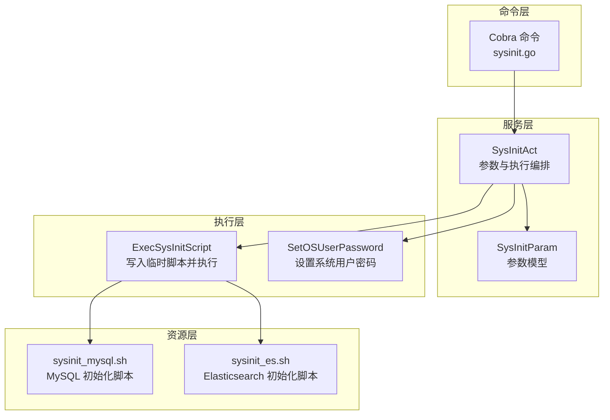
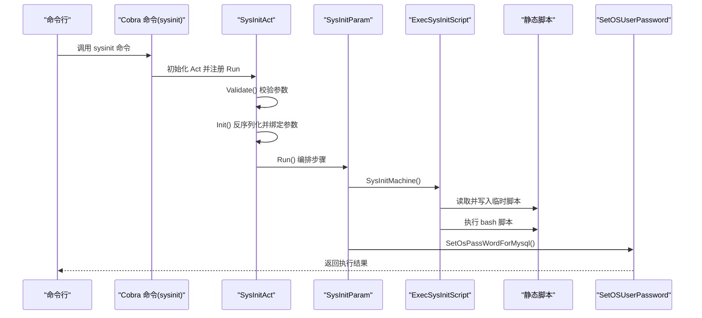
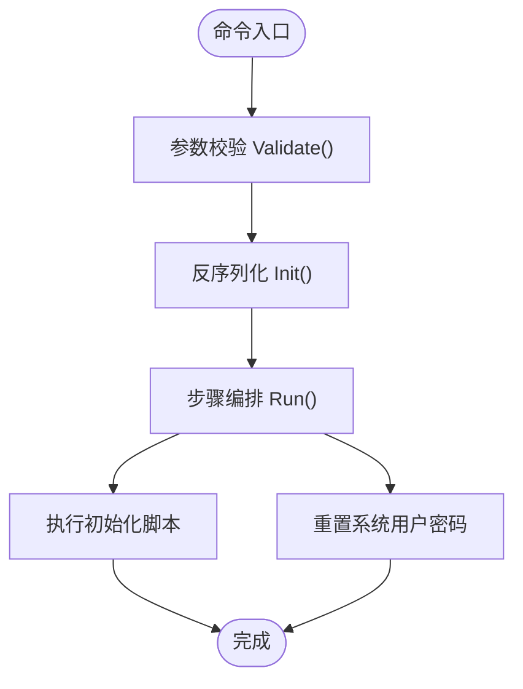
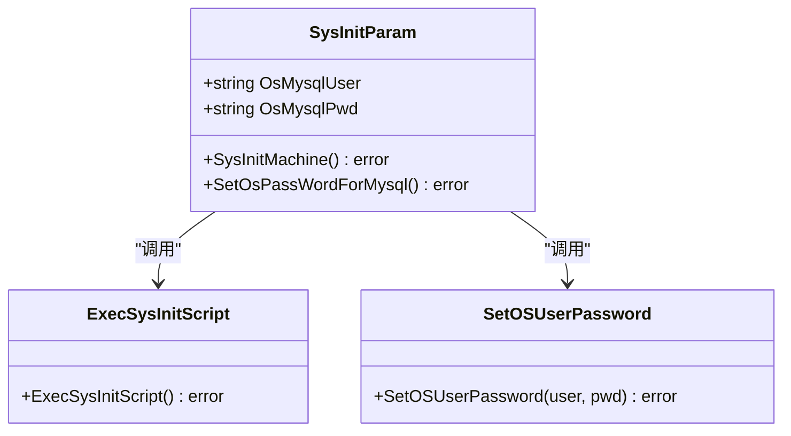
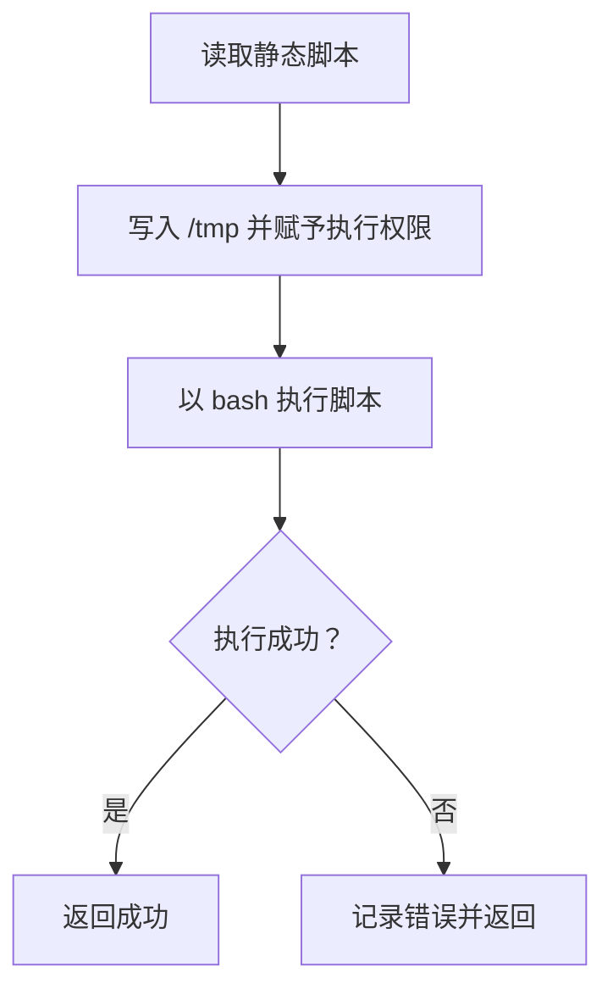
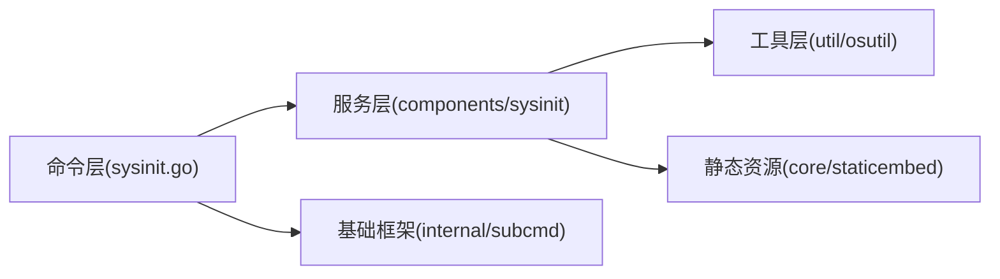

# 系统初始化与环境准备

<cite>
**本文档引用的文件**
- [sysinit.go](file://dbm-services/bigdata/db-tools/dbactuator/internal/subcmd/sysinitcmd/sysinit.go)
- [sysinitcmd.go](file://dbm-services/bigdata/db-tools/dbactuator/internal/subcmd/sysinitcmd/sysinitcmd.go)
- [sysinit.go](file://dbm-services/bigdata/db-tools/dbactuator/pkg/components/sysinit/sysinit.go)
- [essysinit.go](file://dbm-services/bigdata/db-tools/dbactuator/pkg/components/sysinit/essysinit.go)
- [sysinit_mysql.sh](file://dbm-services/bigdata/db-tools/dbactuator/pkg/core/staticembed/sysinit_mysql.sh)
- [sysinit_es.sh](file://dbm-services/bigdata/db-tools/dbactuator/pkg/core/staticembed/sysinit_es.sh)
- [osutil.go](file://dbm-services/bigdata/db-tools/dbactuator/pkg/util/osutil/osutil.go)
- [subcmd.go](file://dbm-services/bigdata/db-tools/dbactuator/internal/subcmd/subcmd.go)
- [subcmd_helper.go](file://dbm-services/bigdata/db-tools/dbactuator/internal/subcmd/subcmd_helper.go)
- [subcmd_util.go](file://dbm-services/bigdata/db-tools/dbactuator/internal/subcmd/subcmd_util.go)
- [sysinit.go](file://dbm-services/mysql/db-tools/dbactuator/internal/subcmd/sysinitcmd/sysinit.go)
- [sysinit.go](file://dbm-services/mysql/db-tools/dbactuator/pkg/components/sysinit/sysinit.go)
- [sysinit_mysql.sh](file://dbm-services/mysql/db-tools/dbactuator/pkg/core/staticembed/sysinit_mysql.sh)
- [osutil.go](file://dbm-services/mysql/db-tools/dbactuator/pkg/util/osutil/osutil.go)
</cite>

## 目录
1. [简介](#简介)
2. [项目结构](#项目结构)
3. [核心组件](#核心组件)
4. [架构总览](#架构总览)
5. [详细组件分析](#详细组件分析)
6. [依赖关系分析](#依赖关系分析)
7. [性能考量](#性能考量)
8. [故障排查指南](#故障排查指南)
9. [结论](#结论)
10. [附录](#附录)

## 简介
本章节面向系统初始化与环境准备功能，聚焦于 sysinitcmd 模块在不同数据库场景下的系统准备工作流程。该模块负责在目标主机上执行系统级初始化任务，包括但不限于：系统环境检查、依赖包安装、网络配置、防火墙设置、用户与权限管理、目录结构创建、配置文件生成以及系统服务的启动与验证。通过统一的命令入口与可扩展的步骤编排，sysinitcmd 能够适配多种数据库类型（如 MySQL、Elasticsearch、HDFS 等）的初始化需求，并提供一致的日志记录与错误处理机制。

## 项目结构
sysinitcmd 在多个数据库子项目中均有实现，但核心职责一致：接收参数、反序列化、执行初始化步骤、记录日志。其主要结构如下：
- 子命令入口：各数据库子项目的 internal/subcmd/sysinitcmd 下的 sysinit.go 定义了 Cobra 命令与执行流程。
- 初始化服务：pkg/components/sysinit 下的 sysinit.go 提供 SysInitParam 参数模型与执行函数。
- 静态嵌入脚本：pkg/core/staticembed 下包含针对不同数据库的初始化脚本（如 sysinit_mysql.sh、sysinit_es.sh）。
- 工具类：pkg/util/osutil 提供系统命令执行、用户密码设置、文件操作等通用能力。
- 基础框架：internal/subcmd 下的 subcmd.go 提供参数反序列化、校验、日志输出等通用能力。

**图表来源**
- [sysinit.go:20-36](file://dbm-services/bigdata/db-tools/dbactuator/internal/subcmd/sysinitcmd/sysinit.go#L20-L36)
- [sysinit.go:24-34](file://dbm-services/bigdata/db-tools/dbactuator/pkg/components/sysinit/sysinit.go#L24-L34)
- [sysinit_mysql.sh:1-87](file://dbm-services/bigdata/db-tools/dbactuator/pkg/core/staticembed/sysinit_mysql.sh#L1-L87)
- [sysinit_es.sh:1-53](file://dbm-services/bigdata/db-tools/dbactuator/pkg/core/staticembed/sysinit_es.sh#L1-L53)

**章节来源**
- [sysinit.go:1-70](file://dbm-services/bigdata/db-tools/dbactuator/internal/subcmd/sysinitcmd/sysinit.go#L1-L70)
- [sysinit.go:1-56](file://dbm-services/bigdata/db-tools/dbactuator/pkg/components/sysinit/sysinit.go#L1-L56)
- [sysinit_mysql.sh:1-87](file://dbm-services/bigdata/db-tools/dbactuator/pkg/core/staticembed/sysinit_mysql.sh#L1-L87)
- [sysinit_es.sh:1-53](file://dbm-services/bigdata/db-tools/dbactuator/pkg/core/staticembed/sysinit_es.sh#L1-L53)
- [osutil.go:518-539](file://dbm-services/bigdata/db-tools/dbactuator/pkg/util/osutil/osutil.go#L518-L539)
- [subcmd.go:101-127](file://dbm-services/bigdata/db-tools/dbactuator/internal/subcmd/subcmd.go#L101-L127)

## 核心组件
- 命令入口与执行编排
  - Cobra 命令定义与示例展示，确保调用方以正确格式传递参数。
  - 执行流程分为 Validate、Init、Run 三步，分别负责参数校验、反序列化与参数绑定、步骤编排与执行。
- 参数模型
  - SysInitParam 包含系统用户与密码字段，用于后续设置系统用户口令。
- 脚本执行器
  - ExecSysInitScript 从静态资源读取脚本内容，写入 /tmp 并以 bash 执行；支持 MySQL 与 Elasticsearch 的初始化脚本。
- 系统工具
  - SetOSUserPassword 通过 chpasswd 设置指定用户的密码，支持标准输出捕获与错误处理。

**章节来源**
- [sysinit.go:20-36](file://dbm-services/bigdata/db-tools/dbactuator/internal/subcmd/sysinitcmd/sysinit.go#L20-L36)
- [sysinit.go:13-27](file://dbm-services/bigdata/db-tools/dbactuator/pkg/components/sysinit/sysinit.go#L13-L27)
- [sysinit.go:36-55](file://dbm-services/bigdata/db-tools/dbactuator/pkg/components/sysinit/sysinit.go#L36-L55)
- [osutil.go:518-539](file://dbm-services/bigdata/db-tools/dbactuator/pkg/util/osutil/osutil.go#L518-L539)

## 架构总览
sysinitcmd 的整体架构围绕“命令入口 -> 参数处理 -> 步骤编排 -> 脚本执行 -> 日志记录”的主线展开。不同数据库类型的初始化脚本通过静态嵌入的方式随二进制打包，避免外部依赖，提升部署一致性。

**图表来源**
- [sysinit.go:29-33](file://dbm-services/bigdata/db-tools/dbactuator/internal/subcmd/sysinitcmd/sysinit.go#L29-L33)
- [sysinit.go:24-34](file://dbm-services/bigdata/db-tools/dbactuator/pkg/components/sysinit/sysinit.go#L24-L34)
- [sysinit.go:36-55](file://dbm-services/bigdata/db-tools/dbactuator/pkg/components/sysinit/sysinit.go#L36-L55)
- [osutil.go:518-539](file://dbm-services/bigdata/db-tools/dbactuator/pkg/util/osutil/osutil.go#L518-L539)

## 详细组件分析

### 组件一：命令入口与执行编排（Bigdata）
- 功能概述
  - 定义 sysinit 子命令，短描述与示例展示，确保调用方按规范传参。
  - Run 流程依次执行 Validate、Init、Run，其中 Run 通过步骤切片编排具体动作。
- 关键点
  - 使用 subcmd.BaseOptions 的 DeserializeAndValidate 进行参数校验与反序列化。
  - 步骤包含“执行初始化脚本”和“重置系统用户密码”。

**图表来源**
- [sysinit.go:29-33](file://dbm-services/bigdata/db-tools/dbactuator/internal/subcmd/sysinitcmd/sysinit.go#L29-L33)
- [sysinit.go:48-69](file://dbm-services/bigdata/db-tools/dbactuator/internal/subcmd/sysinitcmd/sysinit.go#L48-L69)

**章节来源**
- [sysinit.go:20-36](file://dbm-services/bigdata/db-tools/dbactuator/internal/subcmd/sysinitcmd/sysinit.go#L20-L36)
- [sysinit.go:38-45](file://dbm-services/bigdata/db-tools/dbactuator/internal/subcmd/sysinitcmd/sysinit.go#L38-L45)
- [sysinit.go:47-69](file://dbm-services/bigdata/db-tools/dbactuator/internal/subcmd/sysinitcmd/sysinit.go#L47-L69)

### 组件二：参数模型与执行函数（Bigdata）
- 功能概述
  - SysInitParam 定义系统用户与密码字段，作为初始化参数载体。
  - SysInitMachine 调用 ExecSysInitScript 执行静态嵌入脚本。
  - SetOsPassWordForMysql 通过 osutil.SetOSUserPassword 设置系统用户口令。
- 关键点
  - ExecSysInitScript 从静态资源读取脚本，写入 /tmp 并以 bash 执行，便于跨平台与离线部署。

**图表来源**
- [sysinit.go:13-27](file://dbm-services/bigdata/db-tools/dbactuator/pkg/components/sysinit/sysinit.go#L13-L27)
- [sysinit.go:24-34](file://dbm-services/bigdata/db-tools/dbactuator/pkg/components/sysinit/sysinit.go#L24-L34)
- [sysinit.go:30-34](file://dbm-services/bigdata/db-tools/dbactuator/pkg/components/sysinit/sysinit.go#L30-L34)
- [sysinit.go:36-55](file://dbm-services/bigdata/db-tools/dbactuator/pkg/components/sysinit/sysinit.go#L36-L55)
- [osutil.go:518-539](file://dbm-services/bigdata/db-tools/dbactuator/pkg/util/osutil/osutil.go#L518-L539)

**章节来源**
- [sysinit.go:13-27](file://dbm-services/bigdata/db-tools/dbactuator/pkg/components/sysinit/sysinit.go#L13-L27)
- [sysinit.go:24-34](file://dbm-services/bigdata/db-tools/dbactuator/pkg/components/sysinit/sysinit.go#L24-L34)
- [sysinit.go:30-34](file://dbm-services/bigdata/db-tools/dbactuator/pkg/components/sysinit/sysinit.go#L30-L34)
- [sysinit.go:36-55](file://dbm-services/bigdata/db-tools/dbactuator/pkg/components/sysinit/sysinit.go#L36-L55)

### 组件三：静态嵌入脚本（Bigdata）
- MySQL 初始化脚本（sysinit_mysql.sh）
  - 创建系统用户与用户组、设置主目录与权限。
  - 创建数据目录与软链接，设置属主与权限。
  - 写入系统环境变量（ulimit、LC_ALL、PATH、umask）至 /etc/profile。
  - 写入内核参数（fs.aio-max-nr）至 /etc/sysctl.conf 并执行生效。
- Elasticsearch 初始化脚本（sysinit_es.sh）
  - 创建系统用户，配置内存锁定与安全限制。
  - 写入内核参数（vm.max_map_count、vm.swappiness）并生效。
  - 创建数据与日志目录并设置属主。
  - 生成 profile 配置并写入 /etc/profile。

**图表来源**
- [sysinit_mysql.sh:38-54](file://dbm-services/bigdata/db-tools/dbactuator/pkg/core/staticembed/sysinit_mysql.sh#L38-L54)
- [sysinit_es.sh:30-51](file://dbm-services/bigdata/db-tools/dbactuator/pkg/core/staticembed/sysinit_es.sh#L30-L51)

**章节来源**
- [sysinit_mysql.sh:1-87](file://dbm-services/bigdata/db-tools/dbactuator/pkg/core/staticembed/sysinit_mysql.sh#L1-L87)
- [sysinit_es.sh:1-53](file://dbm-services/bigdata/db-tools/dbactuator/pkg/core/staticembed/sysinit_es.sh#L1-L53)

### 组件四：系统工具（密码设置）
- SetOSUserPassword
  - 通过管道向 chpasswd 写入“用户名:密码”，捕获标准输出与错误，统一返回错误信息。
  - 适用于 MySQL 初始化后的系统用户口令设置。

**章节来源**
- [osutil.go:518-539](file://dbm-services/bigdata/db-tools/dbactuator/pkg/util/osutil/osutil.go#L518-L539)

### 组件五：参数处理与日志（基础框架）
- BaseOptions 与反序列化
  - 支持原始或 Base64 编码的 payload 输入，统一 JSON 反序列化与结构体校验。
  - 提供通用日志输出与上下文信息（uid、node_id 等）。
- 步骤编排
  - Steps.Run 提供统一的步骤执行与错误传播机制。

**章节来源**
- [subcmd.go:101-127](file://dbm-services/bigdata/db-tools/dbactuator/internal/subcmd/subcmd.go#L101-L127)
- [subcmd.go:85-99](file://dbm-services/bigdata/db-tools/dbactuator/internal/subcmd/subcmd.go#L85-L99)
- [subcmd_helper.go:283-335](file://dbm-services/bigdata/db-tools/dbactuator/internal/subcmd/subcmd_helper.go#L283-L335)
- [subcmd_util.go:5-12](file://dbm-services/bigdata/db-tools/dbactuator/internal/subcmd/subcmd_util.go#L5-L12)

### 组件六：MySQL 子项目适配（差异点）
- 反序列化方式
  - MySQL 子项目使用 DeserializeNonStandard，与 Bigdata 子项目略有差异。
- 额外能力
  - 提供 GetTimeZone 获取系统时区配置，便于初始化后输出机器时区信息。

**章节来源**
- [sysinit.go:48-55](file://dbm-services/mysql/db-tools/dbactuator/internal/subcmd/sysinitcmd/sysinit.go#L48-L55)
- [sysinit.go:67-77](file://dbm-services/mysql/db-tools/dbactuator/pkg/components/sysinit/sysinit.go#L67-L77)

## 依赖关系分析
- 模块耦合
  - 命令层仅依赖服务层接口，服务层依赖工具层与静态资源，保持清晰的分层。
- 外部依赖
  - 依赖 cobra 进行命令解析，依赖静态嵌入脚本减少外部文件依赖。
- 循环依赖
  - 未发现循环依赖迹象，各模块职责单一、边界清晰。

**图表来源**
- [sysinit.go:20-36](file://dbm-services/bigdata/db-tools/dbactuator/internal/subcmd/sysinitcmd/sysinit.go#L20-L36)
- [sysinit.go:24-34](file://dbm-services/bigdata/db-tools/dbactuator/pkg/components/sysinit/sysinit.go#L24-L34)
- [osutil.go:518-539](file://dbm-services/bigdata/db-tools/dbactuator/pkg/util/osutil/osutil.go#L518-L539)
- [subcmd.go:101-127](file://dbm-services/bigdata/db-tools/dbactuator/internal/subcmd/subcmd.go#L101-L127)

**章节来源**
- [sysinit.go:1-70](file://dbm-services/bigdata/db-tools/dbactuator/internal/subcmd/sysinitcmd/sysinit.go#L1-L70)
- [sysinit.go:1-56](file://dbm-services/bigdata/db-tools/dbactuator/pkg/components/sysinit/sysinit.go#L1-L56)
- [osutil.go:1-651](file://dbm-services/bigdata/db-tools/dbactuator/pkg/util/osutil/osutil.go#L1-L651)
- [subcmd.go:1-296](file://dbm-services/bigdata/db-tools/dbactuator/internal/subcmd/subcmd.go#L1-L296)

## 性能考量
- 脚本执行效率
  - 静态嵌入脚本一次性写入 /tmp 并执行，避免多次 IO 与外部依赖，提升初始化速度。
- 日志与可观测性
  - 统一日志输出与上下文信息，便于定位问题与审计。
- 并发与重试
  - 当前实现为顺序执行步骤，若需增强可通过扩展 Steps.Run 支持重试与并行。

## 故障排查指南
- 参数校验失败
  - 检查 payload 是否为空或格式不正确；确认 Base64 编码是否正确。
- 脚本执行失败
  - 查看 /tmp 下的临时脚本是否存在与权限是否正确；检查 bash 执行输出与系统日志。
- 用户密码设置失败
  - 确认目标用户是否存在；检查 chpasswd 命令可用性与权限。
- 权限与目录问题
  - 确认 /tmp、/data、/home 目录存在且具备写权限；必要时手动创建并修正属主。
- 系统参数未生效
  - 检查 /etc/profile 与 /etc/sysctl.conf 是否被正确追加；执行相应命令使配置生效。

**章节来源**
- [subcmd.go:193-199](file://dbm-services/bigdata/db-tools/dbactuator/internal/subcmd/subcmd.go#L193-L199)
- [sysinit.go:36-55](file://dbm-services/bigdata/db-tools/dbactuator/pkg/components/sysinit/sysinit.go#L36-L55)
- [osutil.go:518-539](file://dbm-services/bigdata/db-tools/dbactuator/pkg/util/osutil/osutil.go#L518-L539)

## 结论
sysinitcmd 模块通过统一的命令入口、参数处理与步骤编排，结合静态嵌入脚本与系统工具，实现了对多数据库类型的一致化系统初始化能力。其设计强调可维护性与可移植性，适合在复杂生产环境中稳定运行。建议在实际部署中配合完善的监控与回滚策略，确保初始化过程的可控与可追溯。

## 附录
- 不同操作系统兼容性与特殊配置
  - CentOS/RedHat 系列：默认使用 yum/rpm 安装依赖包；脚本中涉及 /etc/profile 与 /etc/sysctl.conf 的修改需注意 SELinux 与安全策略。
  - Ubuntu/Debian 系列：默认使用 apt 安装依赖包；脚本中涉及 /etc/profile 的修改需注意 shell 类型（bash/zsh）差异。
  - 特殊配置要求
    - 网络配置：确保初始化过程中网络连通性，以便下载依赖或访问外部资源。
    - 防火墙设置：开放必要的端口（如 MySQL、Elasticsearch 等），关闭不必要的端口。
    - SELinux/AppArmor：在启用强制策略的系统上，需调整策略以允许脚本写入关键路径。
- 初始化前置条件
  - 具备 root 或 sudo 权限。
  - 确保 /tmp、/data、/home 等目录存在且具备写权限。
  - 确认 bash 可用且具备执行权限。
  - 准备好所需的依赖包与网络访问能力。