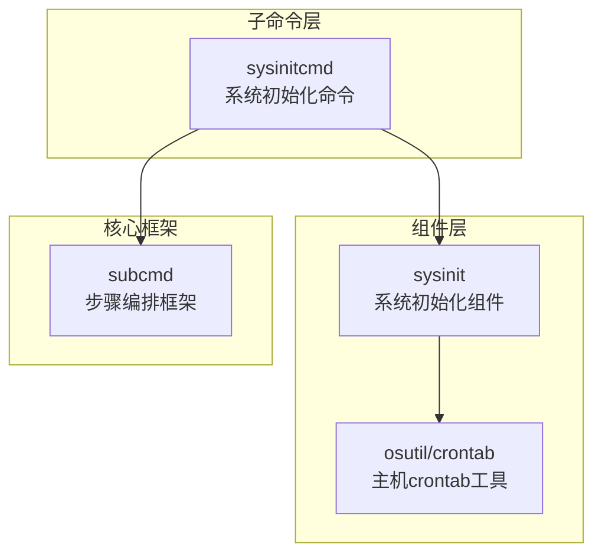
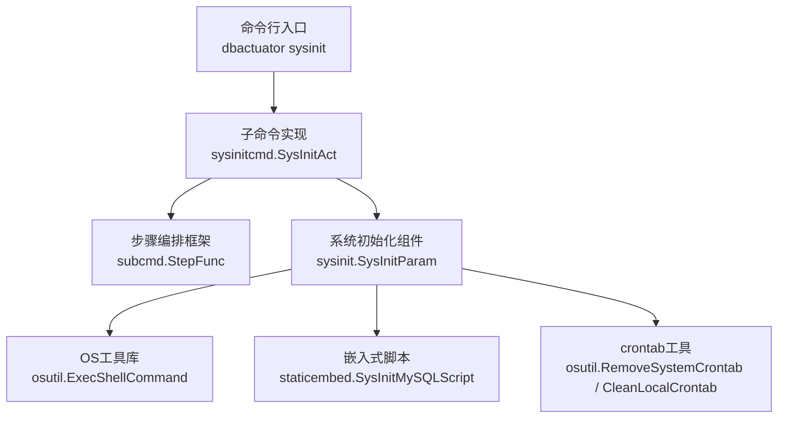
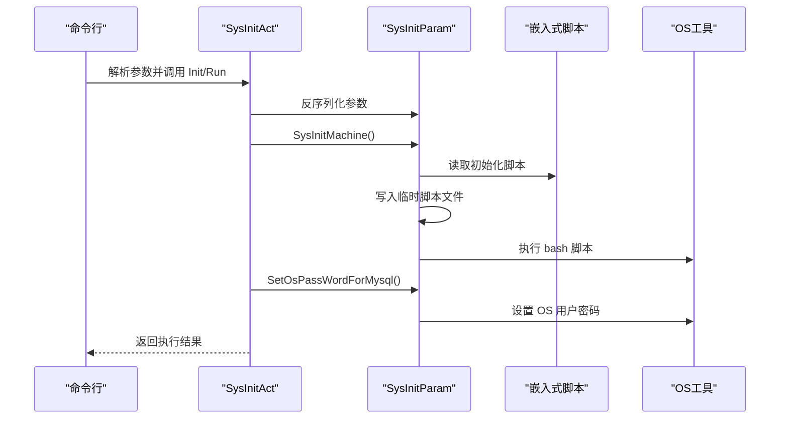
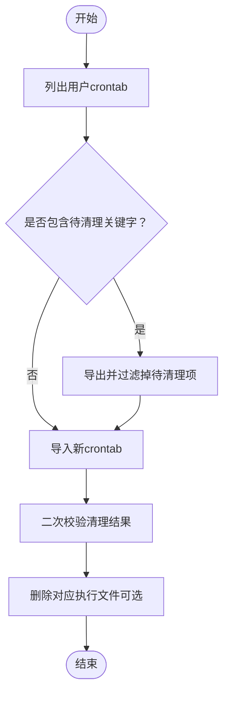
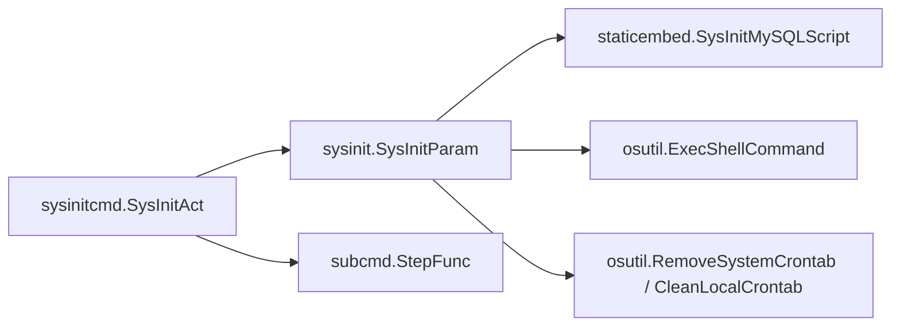

# 通用工具模块

<cite>
**本文引用的文件**
- [sysinit.go](file://dbm-services/bigdata/db-tools/dbactuator/internal/subcmd/sysinitcmd/sysinit.go)
- [sysinit.go](file://dbm-services/bigdata/db-tools/dbactuator/pkg/components/sysinit/sysinit.go)
- [crontab.go](file://dbm-services/bigdata/db-tools/dbactuator/pkg/util/osutil/crontab.go)
- [subcmd.go](file://dbm-services/bigdata/db-tools/dbactuator/internal/subcmd/subcmd.go)
</cite>

## 目录
1. [简介](#简介)
2. [项目结构](#项目结构)
3. [核心组件](#核心组件)
4. [架构总览](#架构总览)
5. [详细组件分析](#详细组件分析)
6. [依赖关系分析](#依赖关系分析)
7. [性能考虑](#性能考虑)
8. [故障排查指南](#故障排查指南)
9. [结论](#结论)
10. [附录](#附录)

## 简介
本文件面向通用工具模块，聚焦于 dbactuator 中的三类通用能力：
- 公共操作集（Common Operation Sets）：文件下载、SCP 传输、大文件清理等基础能力，用于跨数据库场景复用。
- 定时任务操作集（Crontab Operation Sets）：主机级 crontab 管理与清理，保障运维自动化任务的统一治理。
- 系统初始化操作集（Sysinit Operation Sets）：系统环境准备、用户与密码初始化，确保目标主机满足部署前置条件。

本文将阐述设计理念、共享组件与跨数据库复用机制，提供使用示例、配置参数与错误处理方法，并总结在不同数据库部署中的最佳实践与实际应用场景。

## 项目结构
通用工具模块主要分布在以下路径：
- 子命令入口与执行流程：internal/subcmd 下各子命令实现（如 sysinitcmd）
- 通用组件库：pkg/components 下按功能域拆分的可复用组件
- 平台工具库：pkg/util 下 OS 工具、网络工具等底层能力
- 核心框架：internal/subcmd/subcmd.go 提供统一的步骤编排与执行框架

图表来源
- [sysinit.go:1-70](file://dbm-services/bigdata/db-tools/dbactuator/internal/subcmd/sysinitcmd/sysinit.go#L1-L70)
- [sysinit.go:1-56](file://dbm-services/bigdata/db-tools/dbactuator/pkg/components/sysinit/sysinit.go#L1-L56)
- [crontab.go:1-254](file://dbm-services/bigdata/db-tools/dbactuator/pkg/util/osutil/crontab.go#L1-L254)
- [subcmd.go](file://dbm-services/bigdata/db-tools/dbactuator/internal/subcmd/subcmd.go)

章节来源
- [sysinit.go:1-70](file://dbm-services/bigdata/db-tools/dbactuator/internal/subcmd/sysinitcmd/sysinit.go#L1-L70)
- [sysinit.go:1-56](file://dbm-services/bigdata/db-tools/dbactuator/pkg/components/sysinit/sysinit.go#L1-L56)
- [crontab.go:1-254](file://dbm-services/bigdata/db-tools/dbactuator/pkg/util/osutil/crontab.go#L1-L254)
- [subcmd.go](file://dbm-services/bigdata/db-tools/dbactuator/internal/subcmd/subcmd.go)

## 核心组件
- 系统初始化组件（SysInitParam）
  - 职责：封装系统初始化参数与执行流程，负责调用系统初始化脚本并设置操作系统用户密码。
  - 关键点：通过嵌入式资源读取初始化脚本，写入临时文件后执行；对 OS 用户密码设置进行封装。
- 主机 crontab 工具（osutil/crontab）
  - 职责：提供 crontab 列表、新增、删除、校验、清理等能力，支持按关键字批量清理与校验。
  - 关键点：基于系统 crontab 命令行工具，提供健壮的错误处理与日志输出；内置锁文件常量用于并发控制提示。
- 步骤编排框架（subcmd）
  - 职责：统一的步骤函数注册与顺序执行框架，支持错误中断与日志记录。
  - 关键点：以函数切片形式组织步骤，便于扩展与复用。

章节来源
- [sysinit.go:13-56](file://dbm-services/bigdata/db-tools/dbactuator/pkg/components/sysinit/sysinit.go#L13-L56)
- [crontab.go:21-254](file://dbm-services/bigdata/db-tools/dbactuator/pkg/util/osutil/crontab.go#L21-L254)
- [subcmd.go](file://dbm-services/bigdata/db-tools/dbactuator/internal/subcmd/subcmd.go)

## 架构总览
通用工具模块采用“子命令入口 + 组件库 + 工具库 + 框架”的分层设计，实现跨数据库场景的统一抽象与复用。

图表来源
- [sysinit.go:20-69](file://dbm-services/bigdata/db-tools/dbactuator/internal/subcmd/sysinitcmd/sysinit.go#L20-L69)
- [sysinit.go:24-55](file://dbm-services/bigdata/db-tools/dbactuator/pkg/components/sysinit/sysinit.go#L24-L55)
- [crontab.go:24-88](file://dbm-services/bigdata/db-tools/dbactuator/pkg/util/osutil/crontab.go#L24-L88)

## 详细组件分析

### 系统初始化组件（Sysinit）
- 设计理念
  - 将系统初始化过程抽象为参数化组件，支持不同数据库场景下的统一入口。
  - 通过嵌入式资源管理初始化脚本，避免外部依赖，提升可移植性。
- 数据结构与流程
  - 参数结构：包含操作系统 MySQL 用户名与密码字段。
  - 执行流程：先执行系统初始化脚本，再设置指定 OS 用户密码。
- 复杂度与性能
  - 脚本读取与写入临时文件为 O(n)（n 为脚本大小），执行时间取决于脚本内容与主机性能。
- 错误处理
  - 对脚本读取、临时文件写入、脚本执行与密码设置分别进行错误捕获与日志记录。
- 最佳实践
  - 在执行前确保目标主机具备执行权限与必要的目录存在。
  - 使用统一的参数序列化/反序列化接口，保证输入参数的合法性。

图表来源
- [sysinit.go:29-68](file://dbm-services/bigdata/db-tools/dbactuator/internal/subcmd/sysinitcmd/sysinit.go#L29-L68)
- [sysinit.go:24-55](file://dbm-services/bigdata/db-tools/dbactuator/pkg/components/sysinit/sysinit.go#L24-L55)

章节来源
- [sysinit.go:14-70](file://dbm-services/bigdata/db-tools/dbactuator/internal/subcmd/sysinitcmd/sysinit.go#L14-L70)
- [sysinit.go:13-56](file://dbm-services/bigdata/db-tools/dbactuator/pkg/components/sysinit/sysinit.go#L13-L56)

### 定时任务操作集（Crontab）
- 设计理念
  - 提供主机级 crontab 的增删改查与批量清理能力，统一运维自动化任务的治理口径。
  - 支持表达式校验、关键字匹配与原子替换，降低误删风险。
- 功能清单
  - 列表查询：按用户列出 crontab 任务。
  - 新增任务：追加一条 crontab 规则。
  - 删除任务：按关键字移除指定任务。
  - 清理任务：导出 -> 过滤 -> 导入的原子化清理流程。
  - 校验任务：判断关键任务是否存在。
  - 表达式校验：验证 crontab 表达式的合法性。
- 复杂度与性能
  - 列表与校验为 O(m)，m 为当前任务条数；清理涉及多次 shell 调用，整体 O(m+k)，k 为待清理项数量。
- 错误处理
  - 对每一步 shell 命令执行结果进行错误捕获与日志记录；对“无 crontab”等边界情况做特殊处理。
- 最佳实践
  - 使用关键字精确匹配，避免误删其他任务。
  - 清理前先备份当前 crontab，清理后进行二次校验。
  - 对关键监控脚本，清理后同步删除对应执行文件，避免残留告警。

图表来源
- [crontab.go:198-253](file://dbm-services/bigdata/db-tools/dbactuator/pkg/util/osutil/crontab.go#L198-L253)

章节来源
- [crontab.go:24-254](file://dbm-services/bigdata/db-tools/dbactuator/pkg/util/osutil/crontab.go#L24-L254)

### 步骤编排框架（Subcmd）
- 设计理念
  - 将一次执行流程拆分为多个步骤函数，统一注册与顺序执行，支持错误中断与日志记录。
- 关键点
  - 以函数切片组织步骤，每个步骤包含名称与执行函数。
  - 在执行过程中对异常进行捕获并记录步骤索引与名称，便于定位问题。
- 最佳实践
  - 将公共逻辑下沉到组件中，步骤函数保持轻量与可测试。
  - 对耗时步骤提供阶段性日志，便于监控与回溯。

章节来源
- [subcmd.go](file://dbm-services/bigdata/db-tools/dbactuator/internal/subcmd/subcmd.go)

## 依赖关系分析
通用工具模块的依赖关系如下：

图表来源
- [sysinit.go:29-68](file://dbm-services/bigdata/db-tools/dbactuator/internal/subcmd/sysinitcmd/sysinit.go#L29-L68)
- [sysinit.go:24-55](file://dbm-services/bigdata/db-tools/dbactuator/pkg/components/sysinit/sysinit.go#L24-L55)
- [crontab.go:24-88](file://dbm-services/bigdata/db-tools/dbactuator/pkg/util/osutil/crontab.go#L24-L88)

章节来源
- [sysinit.go:1-70](file://dbm-services/bigdata/db-tools/dbactuator/internal/subcmd/sysinitcmd/sysinit.go#L1-L70)
- [sysinit.go:1-56](file://dbm-services/bigdata/db-tools/dbactuator/pkg/components/sysinit/sysinit.go#L1-L56)
- [crontab.go:1-254](file://dbm-services/bigdata/db-tools/dbactuator/pkg/util/osutil/crontab.go#L1-L254)

## 性能考虑
- 脚本执行与 IO
  - 初始化脚本写入临时文件会产生磁盘 IO，建议在执行前确认临时目录权限与空间充足。
- crontab 操作
  - 列表与过滤操作为 O(m)，批量清理涉及多次 shell 调用，建议在低峰期执行或分批处理。
- 日志与可观测性
  - 各步骤均输出详细日志，便于定位性能瓶颈与异常原因。

## 故障排查指南
- 系统初始化失败
  - 检查嵌入式脚本读取是否成功、临时脚本写入权限与路径是否存在。
  - 验证 bash 执行命令返回码与标准错误输出。
  - 确认 OS 用户密码设置是否被系统策略拦截。
- crontab 操作失败
  - 核对用户权限与 crontab 命令可用性；关注“无 crontab”与“命令失败”的分支处理。
  - 清理后若仍存在残留任务，检查关键字匹配是否准确或是否被其他用户 crontab 引用。
- 步骤编排异常
  - 查看步骤索引与名称，定位具体失败步骤；结合该步骤的日志进一步分析。

章节来源
- [sysinit.go:37-55](file://dbm-services/bigdata/db-tools/dbactuator/pkg/components/sysinit/sysinit.go#L37-L55)
- [crontab.go:96-109](file://dbm-services/bigdata/db-tools/dbactuator/pkg/util/osutil/crontab.go#L96-L109)

## 结论
通用工具模块通过“子命令 + 组件 + 工具 + 框架”的分层设计，实现了跨数据库场景的统一抽象与复用。系统初始化组件与 crontab 工具提供了稳定的基础能力，步骤编排框架确保了执行流程的可控与可观测。在实际部署中，建议遵循参数校验、幂等执行与二次校验的最佳实践，以提升自动化运维的可靠性与效率。

## 附录
- 使用示例（概念性说明）
  - 系统初始化：通过 sysinit 子命令传入参数，完成系统初始化与 OS 密码设置。
  - 定时任务清理：在维护窗口内执行清理流程，确保关键监控脚本被移除且执行文件同步删除。
- 配置参数
  - 系统初始化参数：包含操作系统 MySQL 用户名与密码。
  - crontab 关键字：用于识别与清理的脚本路径或标识字符串。
- 错误处理
  - 对所有外部命令与文件操作进行错误捕获与日志记录，必要时返回可诊断的错误信息。