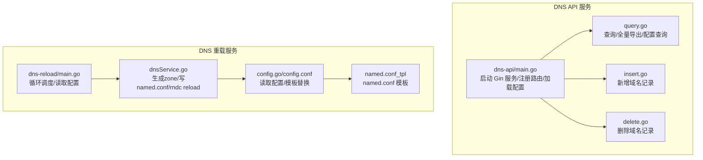
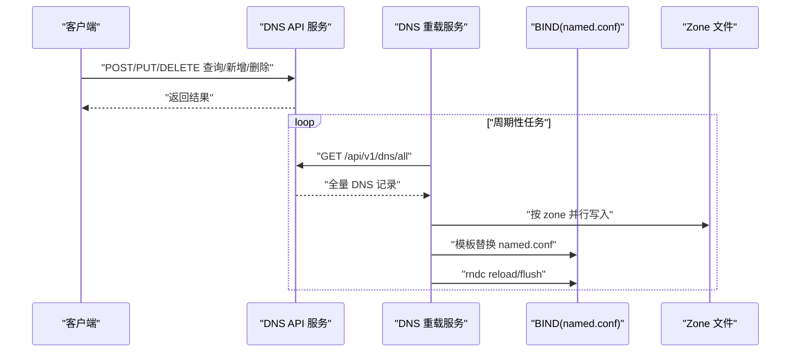
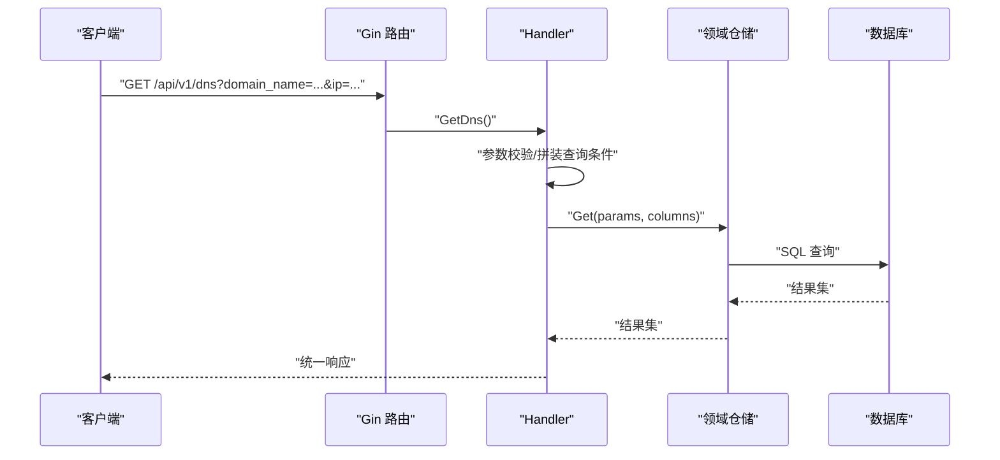
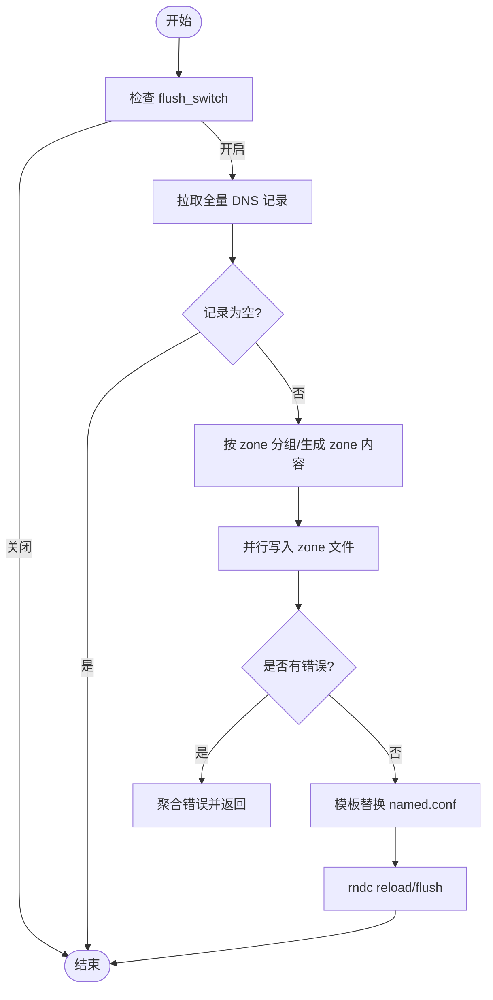
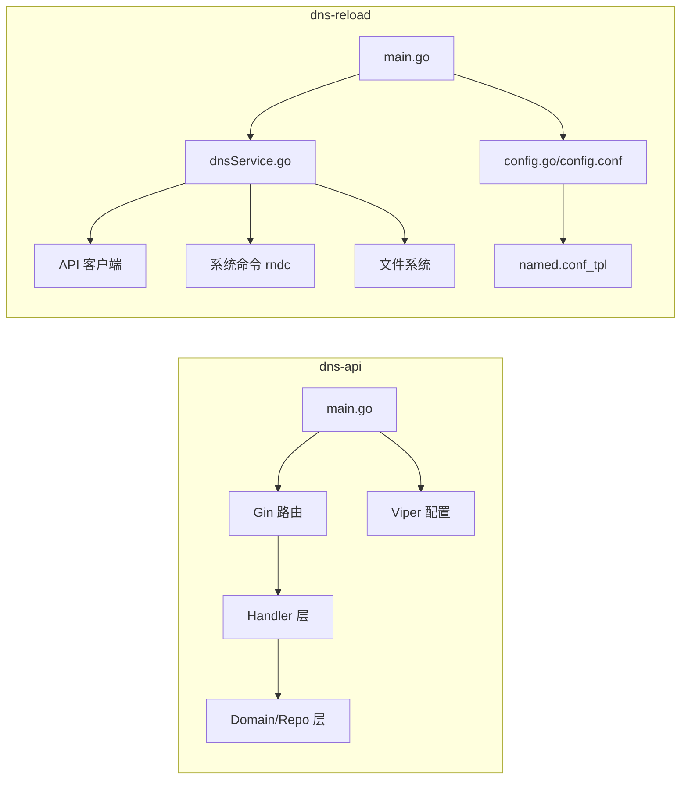

# 域名解析服务

<cite>
**本文引用的文件**
- [dns-api/main.go](file://dbm-services/common/db-dns/dns-api/cmd/bk-dnsapi/main.go)
- [dns-api/README.md](file://dbm-services/common/db-dns/dns-api/README.md)
- [dns-api/handler/query.go](file://dbm-services/common/db-dns/dns-api/internal/handler/query.go)
- [dns-api/handler/insert.go](file://dbm-services/common/db-dns/dns-api/internal/handler/insert.go)
- [dns-api/handler/delete.go](file://dbm-services/common/db-dns/dns-api/internal/handler/delete.go)
- [dns-reload/main.go](file://dbm-services/common/db-dns/dns-reload/main/main.go)
- [dns-reload/dnsService.go](file://dbm-services/common/db-dns/dns-reload/service/dnsService.go)
- [dns-reload/config.go](file://dbm-services/common/db-dns/dns-reload/config/config.go)
- [dns-reload/config.conf](file://dbm-services/common/db-dns/dns-reload/config/config.conf)
- [dns-reload/doc/named.conf_tpl](file://dbm-services/common/db-dns/dns-reload/doc/named.conf_tpl)
</cite>

## 目录
1. [简介](#简介)
2. [项目结构](#项目结构)
3. [核心组件](#核心组件)
4. [架构总览](#架构总览)
5. [详细组件分析](#详细组件分析)
6. [依赖关系分析](#依赖关系分析)
7. [性能与可用性](#性能与可用性)
8. [故障排查指南](#故障排查指南)
9. [结论](#结论)
10. [附录](#附录)

## 简介
本文件面向 DBM 域名解析服务，系统性梳理 db-dns 域名解析 API 与 dns-reload 重载服务的设计与实现，涵盖：
- 架构设计：基于 Go 的 Web 服务（Gin）与独立重载进程的双栈模式
- 功能范围：域名增删改查、全量导出、配置查询；定时拉取并生成 BIND zone 文件、刷新 named.conf、触发 rndc reload
- 配置管理：YAML/Viper 配置与模板化 named.conf 生成
- 动态更新与故障转移：通过 API 获取全量 DNS 记录，按 zone 并行写入，失败通道聚合错误
- 监控与可观测性：OpenTelemetry 追踪、Prometheus 指标中间件
- 安全与稳定性：输入校验、panic 恢复、日志分级、原子替换配置文件

## 项目结构
db-dns 由两部分组成：
- dns-api：提供域名解析数据的 REST 接口，支持查询、新增、删除等操作，并输出 Prometheus 指标与 OpenTelemetry 追踪
- dns-reload：周期性从 dns-api 拉取全量 DNS 记录，生成 zone 文件与 named.conf，通过 rndc 刷新 BIND 服务

图示来源
- [dns-api/main.go:21-49](file://dbm-services/common/db-dns/dns-api/cmd/bk-dnsapi/main.go#L21-L49)
- [dns-api/handler/query.go:16-100](file://dbm-services/common/db-dns/dns-api/internal/handler/query.go#L16-L100)
- [dns-api/handler/insert.go:31-105](file://dbm-services/common/db-dns/dns-api/internal/handler/insert.go#L31-L105)
- [dns-api/handler/delete.go:26-104](file://dbm-services/common/db-dns/dns-api/internal/handler/delete.go#L26-L104)
- [dns-reload/main.go:16-37](file://dbm-services/common/db-dns/dns-reload/main/main.go#L16-L37)
- [dns-reload/dnsService.go:129-219](file://dbm-services/common/db-dns/dns-reload/service/dnsService.go#L129-L219)
- [dns-reload/config.go](file://dbm-services/common/db-dns/dns-reload/config/config.go)
- [dns-reload/config.conf](file://dbm-services/common/db-dns/dns-reload/config/config.conf)
- [dns-reload/doc/named.conf_tpl](file://dbm-services/common/db-dns/dns-reload/doc/named.conf_tpl)

章节来源
- [dns-api/README.md:1-20](file://dbm-services/common/db-dns/dns-api/README.md#L1-L20)
- [dns-api/main.go:21-49](file://dbm-services/common/db-dns/dns-api/cmd/bk-dnsapi/main.go#L21-L49)

## 核心组件
- DNS API 服务
  - 使用 Gin 注册路由组，接入 OpenTelemetry 追踪与 Prometheus 指标中间件
  - 提供查询、新增、删除、全量导出、配置查询等接口
  - 通过 Viper 加载 YAML 配置，支持环境变量映射
- DNS 重载服务
  - 循环读取配置，周期性执行重载流程
  - 从 API 拉取全量记录，按 zone 分类生成 zone 文件
  - 模板化 named.conf，原子替换后通过 rndc reload 刷新
  - 多 goroutine 并行写 zone 文件，错误通过通道聚合

章节来源
- [dns-api/main.go:21-49](file://dbm-services/common/db-dns/dns-api/cmd/bk-dnsapi/main.go#L21-L49)
- [dns-reload/main.go:16-37](file://dbm-services/common/db-dns/dns-reload/main/main.go#L16-L37)
- [dns-reload/dnsService.go:129-219](file://dbm-services/common/db-dns/dns-reload/service/dnsService.go#L129-L219)

## 架构总览
整体采用“API 写入 + 重载进程消费”的解耦架构：
- API 层负责数据变更与查询
- 重载层负责将数据落盘为 zone 文件并刷新 BIND
- 通过 named.conf 模板与配置项控制 zone 映射与 forward IP

图示来源
- [dns-api/handler/query.go:102-128](file://dbm-services/common/db-dns/dns-api/internal/handler/query.go#L102-L128)
- [dns-reload/dnsService.go:129-219](file://dbm-services/common/db-dns/dns-reload/service/dnsService.go#L129-L219)

## 详细组件分析

### 组件一：DNS API 服务
- 启动与中间件
  - 初始化 Gin 引擎，挂载 otelgin 追踪与 Prometheus 中间件
  - 注册路由组 /api/v1/dns/
  - 通过 Viper 从 conf 目录加载 YAML 配置，支持环境变量替换
- 路由与处理器
  - 查询接口：支持按域名、IP、应用、云区域过滤，可指定列集
  - 全量导出：供重载服务消费，仅返回 ip 与 domain_name
  - 配置查询：返回配置表内容
  - 新增接口：批量新增域名记录，自动补全端口、时间戳、状态等字段
  - 删除接口：按应用、域名、实例集合删除，支持空域名但需提供实例列表
- 错误处理
  - 统一 defer + panic 恢复，记录堆栈并返回统一响应
  - 参数校验失败直接返回错误信息

图示来源
- [dns-api/main.go:51-63](file://dbm-services/common/db-dns/dns-api/cmd/bk-dnsapi/main.go#L51-L63)
- [dns-api/handler/query.go:16-100](file://dbm-services/common/db-dns/dns-api/internal/handler/query.go#L16-L100)

章节来源
- [dns-api/main.go:21-49](file://dbm-services/common/db-dns/dns-api/cmd/bk-dnsapi/main.go#L21-L49)
- [dns-api/handler/query.go:16-100](file://dbm-services/common/db-dns/dns-api/internal/handler/query.go#L16-L100)
- [dns-api/handler/query.go:102-128](file://dbm-services/common/db-dns/dns-api/internal/handler/query.go#L102-L128)
- [dns-api/handler/query.go:130-149](file://dbm-services/common/db-dns/dns-api/internal/handler/query.go#L130-L149)
- [dns-api/handler/insert.go:31-105](file://dbm-services/common/db-dns/dns-api/internal/handler/insert.go#L31-L105)
- [dns-api/handler/delete.go:26-104](file://dbm-services/common/db-dns/dns-api/internal/handler/delete.go#L26-L104)

### 组件二：DNS 重载服务
- 主流程
  - 读取配置（间隔、flush 开关、rndc 路径、zone 目录、模板路径）
  - 若开关关闭则跳过
  - 从 API 拉取全量 DNS 记录
  - 计算 zone 名称，生成 zone 文件内容
  - 并行写入 zone 文件，错误收集
  - 模板替换 named.conf，原子替换
  - 通过 rndc reload/flush 刷新
- zone 命名规则
  - 基于域名后缀与层级，取后 N 段作为 zone 名称
- named.conf 模板
  - 通过模板文件进行占位符替换，最终以临时文件写入，成功后再原子替换

图示来源
- [dns-reload/dnsService.go:129-219](file://dbm-services/common/db-dns/dns-reload/service/dnsService.go#L129-L219)
- [dns-reload/dnsService.go:21-31](file://dbm-services/common/db-dns/dns-reload/service/dnsService.go#L21-L31)
- [dns-reload/dnsService.go:66-89](file://dbm-services/common/db-dns/dns-reload/service/dnsService.go#L66-L89)
- [dns-reload/dnsService.go:99-121](file://dbm-services/common/db-dns/dns-reload/service/dnsService.go#L99-L121)

章节来源
- [dns-reload/main.go:16-37](file://dbm-services/common/db-dns/dns-reload/main/main.go#L16-L37)
- [dns-reload/dnsService.go:129-219](file://dbm-services/common/db-dns/dns-reload/service/dnsService.go#L129-L219)
- [dns-reload/config.go](file://dbm-services/common/db-dns/dns-reload/config/config.go)
- [dns-reload/config.conf](file://dbm-services/common/db-dns/dns-reload/config/config.conf)
- [dns-reload/doc/named.conf_tpl](file://dbm-services/common/db-dns/dns-reload/doc/named.conf_tpl)

## 依赖关系分析
- dns-api
  - 依赖 Gin、Viper、OpenTelemetry 追踪与 Prometheus 中间件
  - 依赖内部 DAO/Handler/Domain 层，对外暴露 REST 接口
- dns-reload
  - 依赖配置模块、DAO、API 客户端、日志模块
  - 依赖系统命令 rndc 与文件系统写入
  - 依赖 named.conf 模板进行配置生成

图示来源
- [dns-api/main.go:3-19](file://dbm-services/common/db-dns/dns-api/cmd/bk-dnsapi/main.go#L3-L19)
- [dns-reload/main.go:4-14](file://dbm-services/common/db-dns/dns-reload/main/main.go#L4-L14)
- [dns-reload/dnsService.go:3-14](file://dbm-services/common/db-dns/dns-reload/service/dnsService.go#L3-L14)
- [dns-reload/config.go](file://dbm-services/common/db-dns/dns-reload/config/config.go)
- [dns-reload/config.conf](file://dbm-services/common/db-dns/dns-reload/config/config.conf)
- [dns-reload/doc/named.conf_tpl](file://dbm-services/common/db-dns/dns-reload/doc/named.conf_tpl)

章节来源
- [dns-api/main.go:3-19](file://dbm-services/common/db-dns/dns-api/cmd/bk-dnsapi/main.go#L3-L19)
- [dns-reload/main.go:4-14](file://dbm-services/common/db-dns/dns-reload/main/main.go#L4-L14)

## 性能与可用性
- 性能特性
  - 重载层对 zone 文件写入采用并发 goroutine，提升大表更新效率
  - 通过模板与原子替换减少磁盘写入冲突风险
- 可用性保障
  - API 层统一 panic 恢复与日志记录，避免异常导致进程崩溃
  - 重载层对 zone 写入错误进行聚合，便于定位问题
  - 通过 flush_switch 控制是否执行 reload，降低频繁刷新带来的抖动
- 监控与可观测性
  - API 层已接入 OpenTelemetry 追踪与 Prometheus 指标中间件，便于链路追踪与指标采集

章节来源
- [dns-reload/dnsService.go:180-204](file://dbm-services/common/db-dns/dns-reload/service/dnsService.go#L180-L204)
- [dns-api/main.go:24-29](file://dbm-services/common/db-dns/dns-api/cmd/bk-dnsapi/main.go#L24-L29)

## 故障排查指南
- API 层常见问题
  - 参数缺失或格式错误：检查请求参数与必填字段，确认域名、IP、实例格式
  - 查询无结果：确认过滤条件（域名/IP/应用/云区域），核对列集
  - 异常崩溃：关注日志中的 panic 堆栈，定位 Handler 层具体方法
- 重载层常见问题
  - named.conf 模板替换失败：检查模板占位符是否齐全，确认临时文件写入权限
  - zone 文件写入失败：查看错误通道聚合信息，确认 zone 目录权限与磁盘空间
  - rndc reload/flush 失败：确认 rndc 路径与 BIND 服务状态，检查 named.conf 是否合法
  - 未触发刷新：检查 flush_switch 配置项是否开启
- 配置核对
  - 重载服务需通过 -c 指定配置文件路径，确保配置项完整
  - API 服务需确保 conf 目录存在且可读

章节来源
- [dns-api/handler/query.go:34-38](file://dbm-services/common/db-dns/dns-api/internal/handler/query.go#L34-L38)
- [dns-reload/dnsService.go:52-64](file://dbm-services/common/db-dns/dns-reload/service/dnsService.go#L52-L64)
- [dns-reload/dnsService.go:100-121](file://dbm-services/common/db-dns/dns-reload/service/dnsService.go#L100-L121)
- [dns-reload/main.go:49-57](file://dbm-services/common/db-dns/dns-reload/main/main.go#L49-L57)

## 结论
db-dns 通过清晰的分层与职责划分，实现了“数据写入 API + 定时重载”的稳定架构。API 层提供完备的域名管理能力，重载层以模板化与原子替换确保配置变更的安全与可靠。结合可观测性中间件，可在生产环境中实现高效运维与快速排障。

## 附录

### API 接口定义（概要）
- GET /api/v1/dns
  - 查询域名记录，支持按域名数组、IP 数组、应用、云区域过滤，可选列集
- GET /api/v1/dns/all
  - 全量导出，返回 ip 与 domain_name，供重载服务消费
- GET /api/v1/dns/config
  - 查询配置表内容
- POST /api/v1/dns/add
  - 批量新增域名记录，自动补全端口、时间戳、状态等字段
- DELETE /api/v1/dns
  - 按应用、域名、实例集合删除，支持空域名但需提供实例列表

章节来源
- [dns-api/handler/query.go:16-100](file://dbm-services/common/db-dns/dns-api/internal/handler/query.go#L16-L100)
- [dns-api/handler/query.go:102-128](file://dbm-services/common/db-dns/dns-api/internal/handler/query.go#L102-L128)
- [dns-api/handler/query.go:130-149](file://dbm-services/common/db-dns/dns-api/internal/handler/query.go#L130-L149)
- [dns-api/handler/insert.go:31-105](file://dbm-services/common/db-dns/dns-api/internal/handler/insert.go#L31-L105)
- [dns-api/handler/delete.go:26-104](file://dbm-services/common/db-dns/dns-api/internal/handler/delete.go#L26-L104)

### 配置项说明（摘录）
- 重载服务
  - interval：轮询间隔（秒）
  - flush_switch：是否执行 reload/flush
  - rndc：rndc 可执行文件路径
  - zone_dir_path：zone 文件目录
  - options_named_file_tpl：named.conf 模板路径
  - options_named_file：目标 named.conf 路径
- API 服务
  - http.listenAddress：监听地址
  - conf 目录：YAML 配置文件所在目录

章节来源
- [dns-reload/config.conf](file://dbm-services/common/db-dns/dns-reload/config/config.conf)
- [dns-reload/dnsService.go:124-127](file://dbm-services/common/db-dns/dns-reload/service/dnsService.go#L124-L127)
- [dns-reload/dnsService.go:100-106](file://dbm-services/common/db-dns/dns-reload/service/dnsService.go#L100-L106)
- [dns-reload/dnsService.go:162-162](file://dbm-services/common/db-dns/dns-reload/service/dnsService.go#L162-L162)
- [dns-reload/dnsService.go:52-64](file://dbm-services/common/db-dns/dns-reload/service/dnsService.go#L52-L64)
- [dns-reload/dnsService.go:66-89](file://dbm-services/common/db-dns/dns-reload/service/dnsService.go#L66-L89)
- [dns-api/main.go:41-41](file://dbm-services/common/db-dns/dns-api/cmd/bk-dnsapi/main.go#L41-L41)