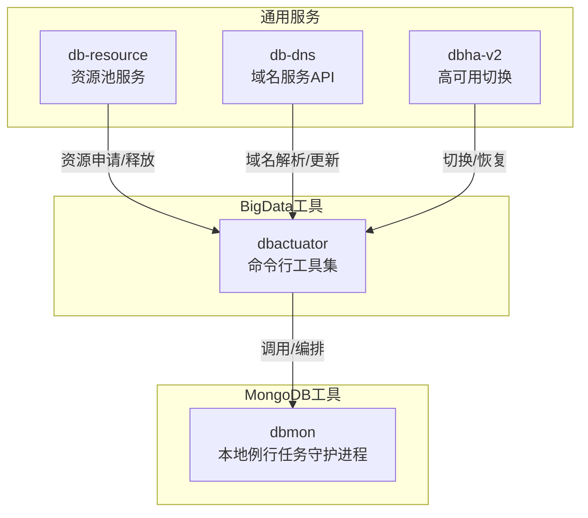
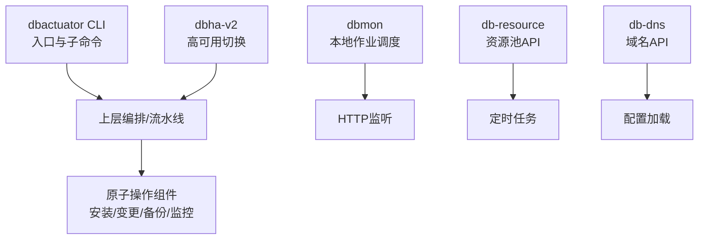
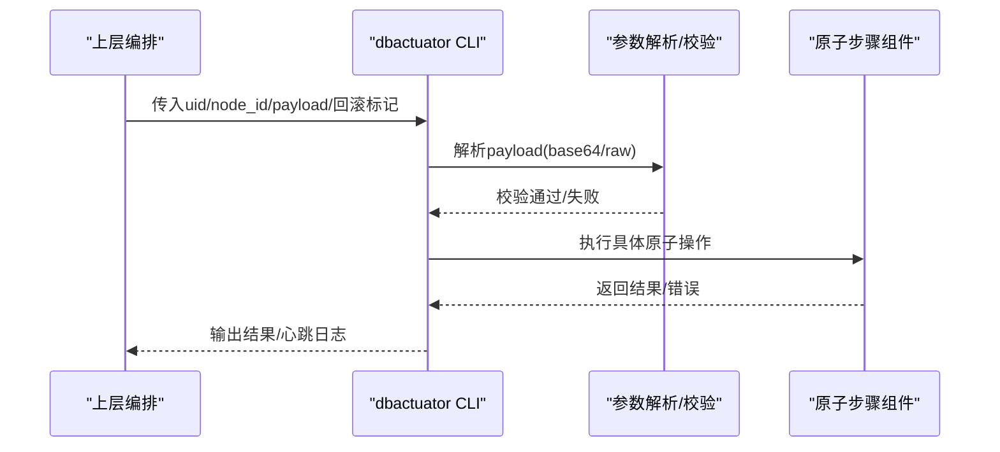
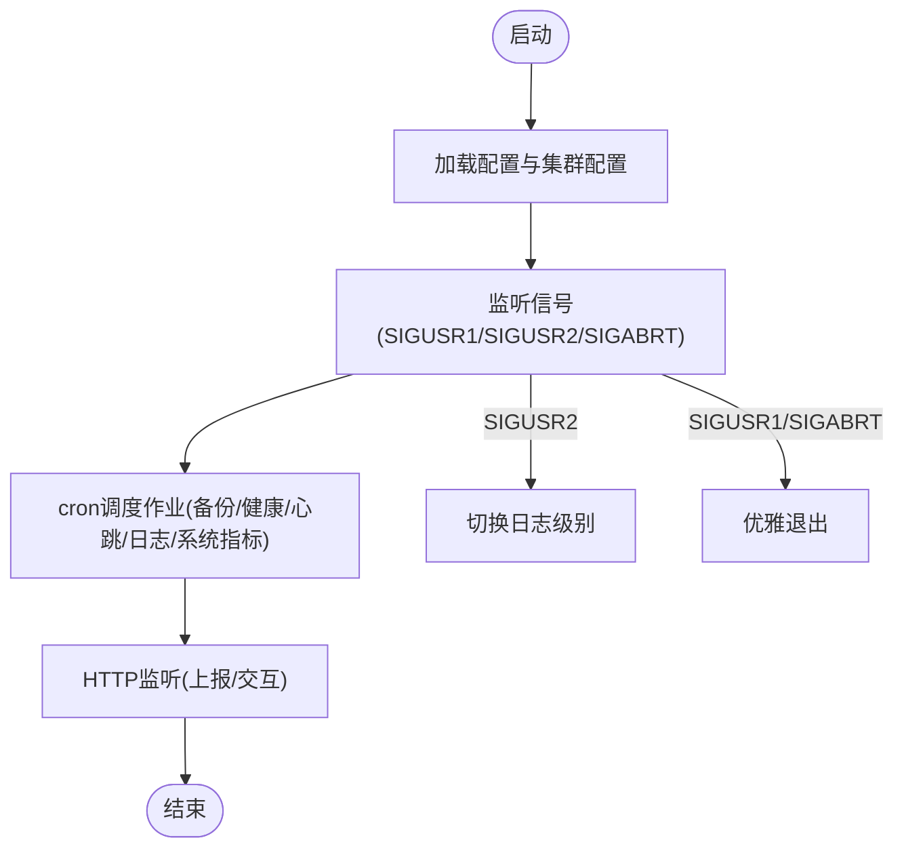
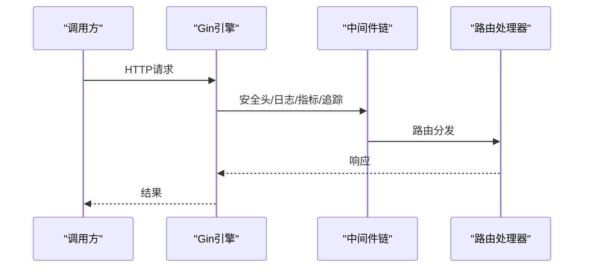
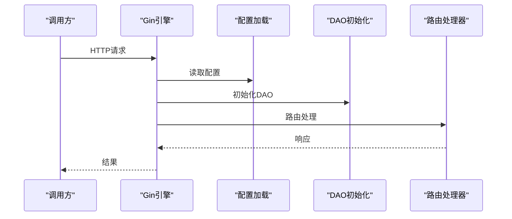
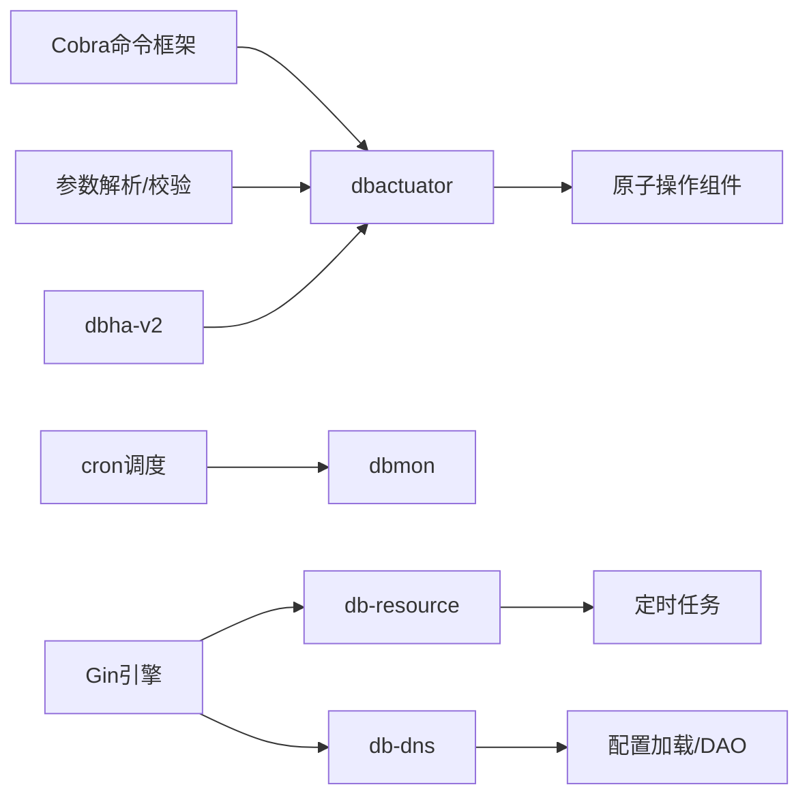

# 工具服务模块

<cite>
**本文引用的文件**
- [dbactuator/README.md](file://dbm-services/bigdata/db-tools/dbactuator/README.md)
- [dbactuator/cmd/cmd.go](file://dbm-services/bigdata/db-tools/dbactuator/cmd/cmd.go)
- [dbactuator/internal/subcmd/subcmd.go](file://dbm-services/bigdata/db-tools/dbactuator/internal/subcmd/subcmd.go)
- [dbmon/README.md](file://dbm-services/mongodb/db-tools/dbmon/README.md)
- [dbmon/main.go](file://dbm-services/mongodb/db-tools/dbmon/main.go)
- [dbmon/cmd/root.go](file://dbm-services/mongodb/db-tools/dbmon/cmd/root.go)
- [db-resource/main.go](file://dbm-services/common/db-resource/main.go)
- [db-resource/internal/routers/routers.go](file://dbm-services/common/db-resource/internal/routers/routers.go)
- [db-dns/dns-api/cmd/bk-dnsapi/main.go](file://dbm-services/common/db-dns/dns-api/cmd/bk-dnsapi/main.go)
</cite>

## 目录
1. [简介](#简介)
2. [项目结构](#项目结构)
3. [核心组件](#核心组件)
4. [架构总览](#架构总览)
5. [详细组件分析](#详细组件分析)
6. [依赖分析](#依赖分析)
7. [性能考虑](#性能考虑)
8. [故障排查指南](#故障排查指南)
9. [结论](#结论)
10. [附录](#附录)

## 简介
本文件面向DBM工具服务模块，系统性梳理以下核心工具的能力边界、设计目标、实现原理与使用方式：
- dbactuator：数据库操作指令集合，面向安装、变更、部署、监控与备份等原子任务，通过子命令与组件化能力支撑上层流水线编排。
- dbmon：数据库本地例行任务守护进程，负责心跳、例行备份、日志解析、系统指标采集等周期性任务。
- db-resource：DB资源池服务，提供资源申请、管理、统计与水位监控的REST API，内置定时任务与可观测性中间件。
- db-dns：域名服务API，提供DNS相关接口，支持配置化加载与链路追踪。
- dbha：高可用切换模块（基于dbha-v2），提供高可用场景下的切换与恢复能力。

本文件还给出工具间协作关系、数据流转、性能监控、故障诊断与运维自动化的最佳实践与参考路径。

## 项目结构
工具服务模块位于dbm-services目录下，按“领域/工具族”组织，dbactuator覆盖多数据库类型，dbmon聚焦MongoDB本地任务，db-resource与db-dns提供资源与域名服务，dbha-v2提供高可用切换能力。

图中展示了dbactuator作为编排中枢，dbmon负责本地例行任务，db-resource与db-dns提供基础设施能力，dbha-v2提供高可用保障。

## 核心组件
- dbactuator：命令行入口、子命令分组、参数解析与校验、心跳输出、帮助文档生成。
- dbmon：配置加载、作业调度、信号处理、HTTP监听、日志轮转与级别切换。
- db-resource：Gin应用、路由注册、定时任务、APM中间件、安全头与请求体限制。
- db-dns：Gin引擎、路由注册、配置加载、DAO初始化、链路追踪与指标。
- dbha-v2：高可用切换模块（入口与内部实现位于独立目录，此处作为概念性说明）。

章节来源
- [dbactuator/cmd/cmd.go:58-185](file://dbm-services/bigdata/db-tools/dbactuator/cmd/cmd.go#L58-L185)
- [dbactuator/internal/subcmd/subcmd.go:40-191](file://dbm-services/bigdata/db-tools/dbactuator/internal/subcmd/subcmd.go#L40-L191)
- [dbmon/cmd/root.go:71-208](file://dbm-services/mongodb/db-tools/dbmon/cmd/root.go#L71-L208)
- [db-resource/main.go:46-109](file://dbm-services/common/db-resource/main.go#L46-L109)
- [db-dns/dns-api/cmd/bk-dnsapi/main.go:21-49](file://dbm-services/common/db-dns/dns-api/cmd/bk-dnsapi/main.go#L21-L49)

## 架构总览
dbactuator通过Cobra构建命令体系，按数据库类型分组子命令；dbmon以cron调度本地作业；db-resource与db-dns均基于Gin提供HTTP服务；dbha-v2提供高可用切换能力并与上游编排协同。

图示映射到实际源码：CLI入口、子命令注册、dbmon作业调度、db-resource与db-dns的HTTP服务初始化。

章节来源
- [dbactuator/cmd/cmd.go:76-167](file://dbm-services/bigdata/db-tools/dbactuator/cmd/cmd.go#L76-L167)
- [dbmon/cmd/root.go:167-204](file://dbm-services/mongodb/db-tools/dbmon/cmd/root.go#L167-L204)
- [db-resource/main.go:49-81](file://dbm-services/common/db-resource/main.go#L49-L81)
- [db-dns/dns-api/cmd/bk-dnsapi/main.go:21-49](file://dbm-services/common/db-dns/dns-api/cmd/bk-dnsapi/main.go#L21-L49)

## 详细组件分析

### dbactuator 工具集
- 设计目的：统一数据库运维操作的命令行入口，将复杂场景拆分为可编排的原子步骤，便于上层流水线组合。
- 实现原理：
  - 基于Cobra构建命令树，按功能分组注册子命令（系统初始化、定时任务、下载、各大数据组件等）。
  - 提供全局参数：单据ID、节点ID、payload（base64或raw）、回滚标记、帮助标记等。
  - payload解析与校验：支持Base64解码、JSON反序列化、结构体校验；提供“简单payload”与“扩展payload”两种模式。
  - 心跳输出：定期向标准输出输出心跳日志，便于外部监控。
  - 文档生成：集成Swagger注解生成API文档。
- 应用场景：安装部署、版本升级、配置变更、备份与恢复、监控接入等。
- 命令行使用示例（参考路径）：
  - 子命令帮助与示例：[dbactuator/README.md:12-31](file://dbm-services/bigdata/db-tools/dbactuator/README.md#L12-L31)
  - payload参数说明与示例生成：[dbactuator/README.md:36-114](file://dbm-services/bigdata/db-tools/dbactuator/README.md#L36-L114)
  - 入口与子命令注册：[dbactuator/cmd/cmd.go:76-167](file://dbm-services/bigdata/db-tools/dbactuator/cmd/cmd.go#L76-L167)
  - 参数解析与校验逻辑：[dbactuator/internal/subcmd/subcmd.go:101-191](file://dbm-services/bigdata/db-tools/dbactuator/internal/subcmd/subcmd.go#L101-L191)
- 集成方式：
  - 上层编排通过构造payload并调用dbactuator子命令执行具体步骤。
  - 支持回滚模式与帮助模式辅助定位问题。
- 性能与可靠性：
  - 心跳输出便于监控；参数校验减少无效调用；日志结构化输出利于检索。

图示映射到源码：入口与参数定义、payload解析与校验、心跳输出。

章节来源
- [dbactuator/cmd/cmd.go:58-185](file://dbm-services/bigdata/db-tools/dbactuator/cmd/cmd.go#L58-L185)
- [dbactuator/internal/subcmd/subcmd.go:101-191](file://dbm-services/bigdata/db-tools/dbactuator/internal/subcmd/subcmd.go#L101-L191)

### dbmon 监控工具
- 设计目的：在数据库节点本地执行例行任务，包括心跳检测、备份、日志解析、系统指标采集等，保证可观测性与可恢复性。
- 实现原理：
  - 基于Cobra提供config、debug、alarm、meta、version等子命令。
  - 加载配置文件与集群配置，支持动态监听配置变化。
  - 使用cron调度多个作业（备份、健康检查、心跳、日志解析、dstat）。
  - 支持信号处理（SIGUSR1/SIGUSR2/SIGABRT）：切换日志级别、优雅退出。
  - 提供HTTP监听用于上报与交互。
- 应用场景：MongoDB副本集/分片集群的本地例行维护与监控。
- 命令行使用示例（参考路径）：
  - 配置示例与启动调试：[dbmon/README.md:4-48](file://dbm-services/mongodb/db-tools/dbmon/README.md#L4-L48)
  - 入口与作业调度：[dbmon/cmd/root.go:127-208](file://dbm-services/mongodb/db-tools/dbmon/cmd/root.go#L127-L208)
  - 主程序入口：[dbmon/main.go:23-25](file://dbm-services/mongodb/db-tools/dbmon/main.go#L23-L25)
- 集成方式：
  - 将dbmon作为系统服务常驻，配合配置文件与集群配置文件进行管理。
  - 通过HTTP接口上报作业结果，供上层系统消费。
- 性能与可靠性：
  - 作业串行执行并避免重复；日志轮转与级别切换提升可观测性。

图示映射到源码：配置加载、信号处理、作业调度与HTTP监听。

章节来源
- [dbmon/README.md:4-48](file://dbm-services/mongodb/db-tools/dbmon/README.md#L4-L48)
- [dbmon/cmd/root.go:87-208](file://dbm-services/mongodb/db-tools/dbmon/cmd/root.go#L87-L208)
- [dbmon/main.go:23-25](file://dbm-services/mongodb/db-tools/dbmon/main.go#L23-L25)

### db-resource 资源管理
- 设计目的：提供DB资源池的申请、管理、统计与水位监控能力，支持与CMDB、GSE等系统对接。
- 实现原理：
  - Gin应用，注册路由并挂载安全头、请求体大小限制、日志中间件、OTel链路追踪与Prometheus指标。
  - 定时任务：更新GSE状态、检查主机占用、同步硬件信息、生成资源快照、故障主机检查等。
  - 初始化顺序：日志、配置、模型、CC客户端、云厂商初始化、LLM分析器初始化。
- 应用场景：资源池化管理、资源申请与回收、资源健康巡检与统计。
- 命令行使用示例（参考路径）：
  - 应用启动与路由注册：[db-resource/main.go:46-109](file://dbm-services/common/db-resource/main.go#L46-L109)
  - 路由注册：[db-resource/internal/routers/routers.go:26-55](file://dbm-services/common/db-resource/internal/routers/routers.go#L26-L55)
- 集成方式：
  - 通过REST API对外提供资源管理能力；定时任务与中间件确保可观测与稳定性。
- 性能与可靠性：
  - 中间件链路覆盖安全、日志、指标与追踪；定时任务分批执行降低峰值压力。

图示映射到源码：Gin初始化、中间件链与路由注册。

章节来源
- [db-resource/main.go:46-109](file://dbm-services/common/db-resource/main.go#L46-L109)
- [db-resource/internal/routers/routers.go:26-55](file://dbm-services/common/db-resource/internal/routers/routers.go#L26-L55)

### db-dns 域名服务
- 设计目的：提供域名相关的API服务，支持配置化加载与链路追踪。
- 实现原理：
  - Gin引擎初始化，注册路由组，加载配置文件，初始化DAO与日志。
  - 支持环境变量覆盖配置，统一通过Viper合并配置。
- 应用场景：域名解析、域名更新、域名查询等。
- 命令行使用示例（参考路径）：
  - 启动与路由注册：[db-dns/dns-api/cmd/bk-dnsapi/main.go:21-49](file://dbm-services/common/db-dns/dns-api/cmd/bk-dnsapi/main.go#L21-L49)
- 集成方式：
  - 通过HTTP API提供域名服务；与db-resource/dbactuator等工具形成生态协同。
- 性能与可靠性：
  - 配置加载与DAO初始化在启动阶段完成，运行期稳定可靠。

图示映射到源码：配置加载、DAO初始化与路由注册。

章节来源
- [db-dns/dns-api/cmd/bk-dnsapi/main.go:21-49](file://dbm-services/common/db-dns/dns-api/cmd/bk-dnsapi/main.go#L21-L49)

### dbha 高可用切换
- 设计目的：在数据库高可用场景下，提供自动/半自动的切换与恢复能力，保障业务连续性。
- 实现原理（概览）：
  - 基于dbha-v2模块，提供切换策略、故障检测与恢复流程。
  - 与dbactuator编排结合，实现“检测-决策-执行-验证”的闭环。
- 应用场景：主从切换、故障转移、故障恢复、演练切换等。
- 集成方式：
  - 通过dbactuator触发切换步骤，dbha-v2执行具体切换动作并反馈结果。
- 性能与可靠性：
  - 切换过程需严格校验前置条件与后置验证，确保一致性与可用性。

（本节为概念性说明，未直接分析具体源码文件）

## 依赖分析
- dbactuator依赖Cobra构建命令树，内部通过subcmd模块完成参数解析与校验，并输出心跳日志。
- dbmon依赖cron调度作业，使用自定义日志适配器与信号处理机制。
- db-resource与db-dns均基于Gin，前者挂载APM中间件与定时任务，后者负责配置加载与DAO初始化。
- dbha-v2与dbactuator协同，承接高可用切换的执行。

图示映射到源码：命令框架、参数解析、调度与HTTP服务初始化。

章节来源
- [dbactuator/cmd/cmd.go:76-167](file://dbm-services/bigdata/db-tools/dbactuator/cmd/cmd.go#L76-L167)
- [dbmon/cmd/root.go:167-204](file://dbm-services/mongodb/db-tools/dbmon/cmd/root.go#L167-L204)
- [db-resource/main.go:49-81](file://dbm-services/common/db-resource/main.go#L49-L81)
- [db-dns/dns-api/cmd/bk-dnsapi/main.go:21-49](file://dbm-services/common/db-dns/dns-api/cmd/bk-dnsapi/main.go#L21-L49)

## 性能考虑
- dbactuator：
  - 心跳输出便于外部监控；建议在生产环境设置合适的日志级别与输出格式。
  - payload解析与校验在入口处完成，减少后续步骤的无效调用。
- dbmon：
  - 作业串行执行并避免重复；日志轮转与级别切换提升可维护性。
  - cron调度粒度合理设置，避免对系统造成瞬时压力。
- db-resource：
  - 中间件链路覆盖安全、日志、指标与追踪；请求体大小限制防止异常流量。
  - 定时任务分批执行，避免集中触发。
- db-dns：
  - 配置加载与DAO初始化在启动阶段完成，运行期稳定。

（本节提供通用指导，未直接分析具体文件）

## 故障排查指南
- dbactuator：
  - 使用帮助模式查看payload参数说明与示例：[dbactuator/README.md:36-114](file://dbm-services/bigdata/db-tools/dbactuator/README.md#L36-L114)
  - 检查日志输出与心跳日志，确认参数解析与校验是否通过：[dbactuator/internal/subcmd/subcmd.go:101-191](file://dbm-services/bigdata/db-tools/dbactuator/internal/subcmd/subcmd.go#L101-L191)
- dbmon：
  - 使用调试命令发送测试事件或指标：[dbmon/README.md:44-48](file://dbm-services/mongodb/db-tools/dbmon/README.md#L44-L48)
  - 通过信号切换日志级别与优雅退出：[dbmon/cmd/root.go:229-258](file://dbm-services/mongodb/db-tools/dbmon/cmd/root.go#L229-L258)
- db-resource：
  - 检查中间件链路与定时任务执行情况，确认配置与模型初始化是否成功：[db-resource/main.go:112-124](file://dbm-services/common/db-resource/main.go#L112-L124)
- db-dns：
  - 确认配置文件路径与环境变量覆盖是否正确，DAO初始化是否成功：[db-dns/dns-api/cmd/bk-dnsapi/main.go:65-78](file://dbm-services/common/db-dns/dns-api/cmd/bk-dnsapi/main.go#L65-L78)

章节来源
- [dbactuator/README.md:36-114](file://dbm-services/bigdata/db-tools/dbactuator/README.md#L36-L114)
- [dbactuator/internal/subcmd/subcmd.go:101-191](file://dbm-services/bigdata/db-tools/dbactuator/internal/subcmd/subcmd.go#L101-L191)
- [dbmon/README.md:44-48](file://dbm-services/mongodb/db-tools/dbmon/README.md#L44-L48)
- [dbmon/cmd/root.go:229-258](file://dbm-services/mongodb/db-tools/dbmon/cmd/root.go#L229-L258)
- [db-resource/main.go:112-124](file://dbm-services/common/db-resource/main.go#L112-L124)
- [db-dns/dns-api/cmd/bk-dnsapi/main.go:65-78](file://dbm-services/common/db-dns/dns-api/cmd/bk-dnsapi/main.go#L65-L78)

## 结论
dbactuator、dbmon、db-resource、db-dns与dbha-v2共同构成DBM工具服务模块的核心能力：
- dbactuator提供统一的命令行编排入口；
- dbmon负责本地例行任务与可观测性；
- db-resource与db-dns提供基础设施服务；
- dbha-v2保障高可用切换的可靠性。
通过合理的参数设计、中间件链路、定时任务与信号处理，上述工具在生产环境中具备良好的稳定性与可维护性。

（本节为总结性内容，未直接分析具体文件）

## 附录
- 命令行使用示例与配置参考：
  - dbactuator子命令与帮助：[dbactuator/README.md:12-31](file://dbm-services/bigdata/db-tools/dbactuator/README.md#L12-L31)
  - dbmon配置与调试：[dbmon/README.md:4-48](file://dbm-services/mongodb/db-tools/dbmon/README.md#L4-L48)
  - db-resource路由与启动：[db-resource/main.go:46-109](file://dbm-services/common/db-resource/main.go#L46-L109)
  - db-dns启动与配置：[db-dns/dns-api/cmd/bk-dnsapi/main.go:21-49](file://dbm-services/common/db-dns/dns-api/cmd/bk-dnsapi/main.go#L21-L49)