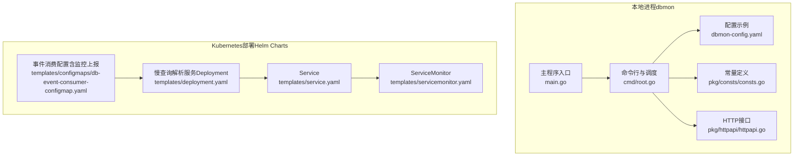
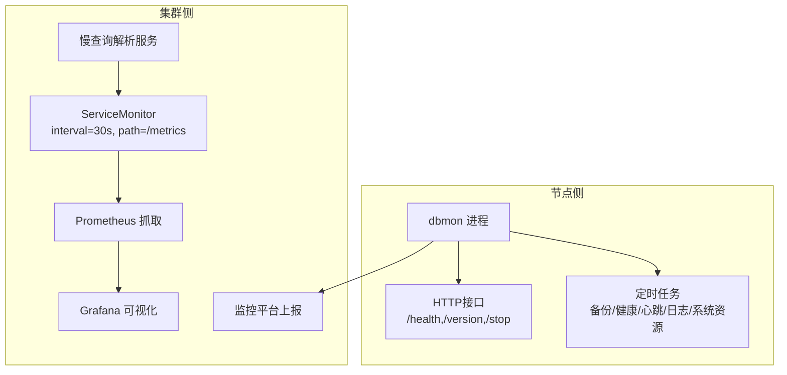
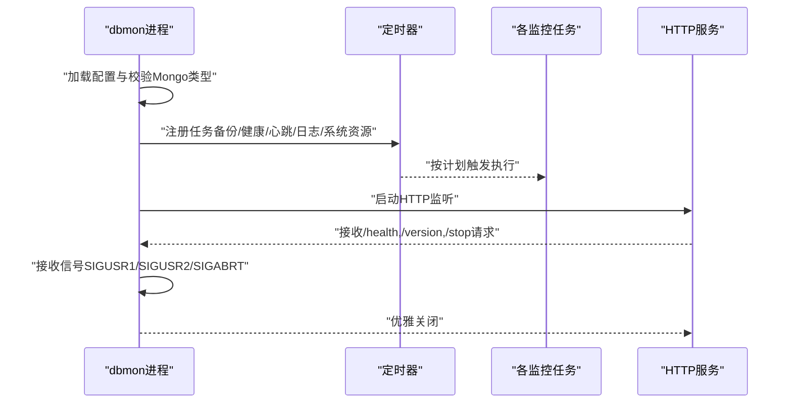
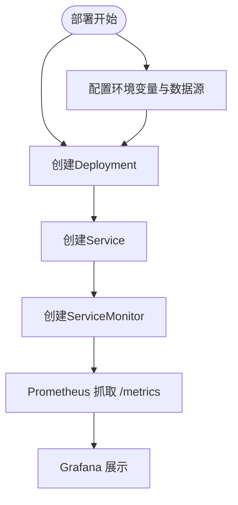
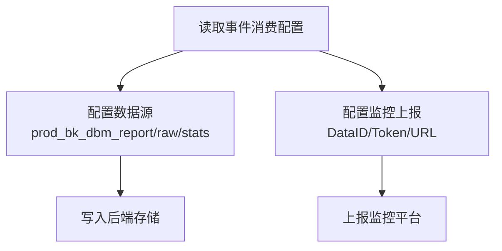
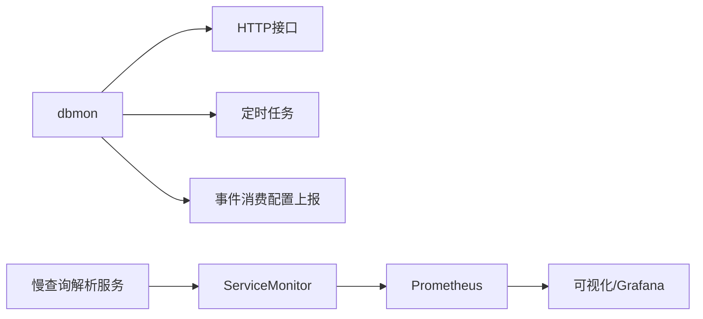

# MongoDB监控

<cite>
**本文引用的文件**
- [dbmon主程序入口](file://dbm-services/mongodb/db-tools/dbmon/main.go)
- [dbmon命令行与调度](file://dbm-services/mongodb/db-tools/dbmon/cmd/root.go)
- [dbmon配置示例](file://dbm-services/mongodb/db-tools/dbmon/dbmon-config.yaml)
- [dbmon常量定义（类型与路径）](file://dbm-services/mongodb/db-tools/dbmon/pkg/consts/consts.go)
- [dbmon HTTP接口](file://dbm-services/mongodb/db-tools/dbmon/pkg/httpapi/httpapi.go)
- [慢查询解析服务部署模板](file://helm-charts/bk-dbm/charts/slow-query-parser-service/templates/deployment.yaml)
- [慢查询解析服务Service模板](file://helm-charts/bk-dbm/charts/slow-query-parser-service/templates/service.yaml)
- [慢查询解析服务ServiceMonitor模板](file://helm-charts/bk-dbm/charts/slow-query-parser-service/templates/servicemonitor.yaml)
- [事件消费配置（含监控上报配置）](file://helm-charts/bk-dbm/templates/configmaps/db-event-consumer-configmap.yaml)
</cite>

## 目录
1. [简介](#简介)
2. [项目结构](#项目结构)
3. [核心组件](#核心组件)
4. [架构总览](#架构总览)
5. [详细组件分析](#详细组件分析)
6. [依赖关系分析](#依赖关系分析)
7. [性能考量](#性能考量)
8. [故障排查指南](#故障排查指南)
9. [结论](#结论)
10. [附录](#附录)

## 简介
本文件面向MongoDB监控工具，系统化梳理其架构设计、副本集与分片集群监控能力、性能指标采集、慢查询分析与存储使用监控机制，并给出配置管理、告警规则设置与监控数据可视化方案。同时提供部署安装、配置优化与故障排查指南，覆盖集群状态监控、数据一致性检查与性能调优建议，以及与数据库及监控系统的集成方式。

## 项目结构
MongoDB监控工具由本地进程与Kubernetes部署两部分组成：
- 本地进程：dbmon（dbm-services/mongodb/db-tools/dbmon），负责定时采集、健康检查、心跳、日志解析、系统资源统计与HTTP接口暴露。
- 集群侧部署：通过Helm Chart在Kubernetes中部署慢查询解析服务与ServiceMonitor，实现指标采集与监控可视化。

**图表来源**
- [dbmon主程序入口:1-26](file://dbm-services/mongodb/db-tools/dbmon/main.go#L1-L26)
- [dbmon命令行与调度:1-259](file://dbm-services/mongodb/db-tools/dbmon/cmd/root.go#L1-L259)
- [dbmon配置示例:1-31](file://dbm-services/mongodb/db-tools/dbmon/dbmon-config.yaml#L1-L31)
- [dbmon常量定义（类型与路径）:1-52](file://dbm-services/mongodb/db-tools/dbmon/pkg/consts/consts.go#L1-L52)
- [dbmon HTTP接口:1-78](file://dbm-services/mongodb/db-tools/dbmon/pkg/httpapi/httpapi.go#L1-L78)
- [慢查询解析服务部署模板:1-38](file://helm-charts/bk-dbm/charts/slow-query-parser-service/templates/deployment.yaml#L1-L38)
- [慢查询解析服务Service模板:1-15](file://helm-charts/bk-dbm/charts/slow-query-parser-service/templates/service.yaml#L1-L15)
- [慢查询解析服务ServiceMonitor模板:1-21](file://helm-charts/bk-dbm/charts/slow-query-parser-service/templates/servicemonitor.yaml#L1-L21)
- [事件消费配置（含监控上报配置）:28-65](file://helm-charts/bk-dbm/templates/configmaps/db-event-consumer-configmap.yaml#L28-L65)

**章节来源**
- [dbmon主程序入口:1-26](file://dbm-services/mongodb/db-tools/dbmon/main.go#L1-L26)
- [dbmon命令行与调度:1-259](file://dbm-services/mongodb/db-tools/dbmon/cmd/root.go#L1-L259)
- [dbmon配置示例:1-31](file://dbm-services/mongodb/db-tools/dbmon/dbmon-config.yaml#L1-L31)
- [dbmon常量定义（类型与路径）:1-52](file://dbm-services/mongodb/db-tools/dbmon/pkg/consts/consts.go#L1-L52)
- [dbmon HTTP接口:1-78](file://dbm-services/mongodb/db-tools/dbmon/pkg/httpapi/httpapi.go#L1-L78)
- [慢查询解析服务部署模板:1-38](file://helm-charts/bk-dbm/charts/slow-query-parser-service/templates/deployment.yaml#L1-L38)
- [慢查询解析服务Service模板:1-15](file://helm-charts/bk-dbm/charts/slow-query-parser-service/templates/service.yaml#L1-L15)
- [慢查询解析服务ServiceMonitor模板:1-21](file://helm-charts/bk-dbm/charts/slow-query-parser-service/templates/servicemonitor.yaml#L1-L21)
- [事件消费配置（含监控上报配置）:28-65](file://helm-charts/bk-dbm/templates/configmaps/db-event-consumer-configmap.yaml#L28-L65)

## 核心组件
- dbmon本地监控进程
  - 定时任务：备份准备、健康检查、心跳、日志解析、系统资源统计。
  - HTTP接口：/health、/version、/stop，便于外部系统拉取状态与触发优雅退出。
  - 配置管理：支持主配置与集群配置分离加载与热更新。
- 慢查询解析服务
  - 提供慢查询解析能力，配合ServiceMonitor暴露指标端点，便于Prometheus抓取。
- 事件消费与监控上报
  - 通过配置项将指标与事件上报至监控平台，支撑告警与可视化。

**章节来源**
- [dbmon命令行与调度:127-208](file://dbm-services/mongodb/db-tools/dbmon/cmd/root.go#L127-L208)
- [dbmon HTTP接口:47-77](file://dbm-services/mongodb/db-tools/dbmon/pkg/httpapi/httpapi.go#L47-L77)
- [dbmon配置示例:1-31](file://dbm-services/mongodb/db-tools/dbmon/dbmon-config.yaml#L1-L31)
- [慢查询解析服务ServiceMonitor模板:1-21](file://helm-charts/bk-dbm/charts/slow-query-parser-service/templates/servicemonitor.yaml#L1-L21)
- [事件消费配置（含监控上报配置）:28-65](file://helm-charts/bk-dbm/templates/configmaps/db-event-consumer-configmap.yaml#L28-L65)

## 架构总览
下图展示了MongoDB监控工具在本地与集群侧的协作关系：dbmon负责节点级监控与指标产出，慢查询解析服务与ServiceMonitor负责指标采集与可视化，事件消费配置负责将结果上报到监控平台。

**图表来源**
- [dbmon命令行与调度:170-204](file://dbm-services/mongodb/db-tools/dbmon/cmd/root.go#L170-L204)
- [dbmon HTTP接口:47-77](file://dbm-services/mongodb/db-tools/dbmon/pkg/httpapi/httpapi.go#L47-L77)
- [慢查询解析服务ServiceMonitor模板:1-21](file://helm-charts/bk-dbm/charts/slow-query-parser-service/templates/servicemonitor.yaml#L1-L21)

## 详细组件分析

### 组件A：dbmon本地监控进程
- 职责
  - 加载并校验配置，限制仅支持Mongo类型。
  - 启动定时任务：备份准备、健康检查、心跳、日志解析、系统资源统计。
  - 暴露HTTP接口，支持健康检查、版本查询与优雅停止。
  - 支持信号控制：SIGUSR1/SIGABRT用于取消上下文，SIGUSR2用于切换日志级别。
- 关键流程
  - 配置加载与校验
  - 任务注册与调度
  - HTTP服务启动与关闭

**图表来源**
- [dbmon命令行与调度:147-208](file://dbm-services/mongodb/db-tools/dbmon/cmd/root.go#L147-L208)
- [dbmon HTTP接口:47-77](file://dbm-services/mongodb/db-tools/dbmon/pkg/httpapi/httpapi.go#L47-L77)

**章节来源**
- [dbmon主程序入口:1-26](file://dbm-services/mongodb/db-tools/dbmon/main.go#L1-L26)
- [dbmon命令行与调度:87-208](file://dbm-services/mongodb/db-tools/dbmon/cmd/root.go#L87-L208)
- [dbmon常量定义（类型与路径）:45-51](file://dbm-services/mongodb/db-tools/dbmon/pkg/consts/consts.go#L45-L51)
- [dbmon HTTP接口:22-77](file://dbm-services/mongodb/db-tools/dbmon/pkg/httpapi/httpapi.go#L22-L77)

### 组件B：慢查询解析服务与ServiceMonitor
- 职责
  - 提供慢查询解析能力，作为独立服务运行。
  - 通过ServiceMonitor暴露指标端点，供Prometheus周期性抓取。
- 部署要点
  - Deployment与Service模板定义了容器镜像、端口与选择器。
  - ServiceMonitor定义抓取间隔、路径与命名空间匹配策略。

**图表来源**
- [慢查询解析服务部署模板:1-38](file://helm-charts/bk-dbm/charts/slow-query-parser-service/templates/deployment.yaml#L1-L38)
- [慢查询解析服务Service模板:1-15](file://helm-charts/bk-dbm/charts/slow-query-parser-service/templates/service.yaml#L1-L15)
- [慢查询解析服务ServiceMonitor模板:1-21](file://helm-charts/bk-dbm/charts/slow-query-parser-service/templates/servicemonitor.yaml#L1-L21)

**章节来源**
- [慢查询解析服务部署模板:1-38](file://helm-charts/bk-dbm/charts/slow-query-parser-service/templates/deployment.yaml#L1-L38)
- [慢查询解析服务Service模板:1-15](file://helm-charts/bk-dbm/charts/slow-query-parser-service/templates/service.yaml#L1-L15)
- [慢查询解析服务ServiceMonitor模板:1-21](file://helm-charts/bk-dbm/charts/slow-query-parser-service/templates/servicemonitor.yaml#L1-L21)

### 组件C：事件消费与监控上报配置
- 职责
  - 定义监控上报的数据源（如MySQL、Raw MySQL、Doris等），用于汇聚与持久化监控数据。
  - 配置监控平台的上报参数（如DataID、Token、URL等），确保dbmon与其它组件能将指标上报到监控系统。
- 关键点
  - 数据源配置与上报目标需与实际部署环境一致。
  - 该配置为监控数据汇聚与告警提供基础。

**图表来源**
- [事件消费配置（含监控上报配置）:28-65](file://helm-charts/bk-dbm/templates/configmaps/db-event-consumer-configmap.yaml#L28-L65)

**章节来源**
- [事件消费配置（含监控上报配置）:28-65](file://helm-charts/bk-dbm/templates/configmaps/db-event-consumer-configmap.yaml#L28-L65)

## 依赖关系分析
- 组件耦合
  - dbmon内部模块间通过配置中心与日志模块解耦；HTTP服务与任务调度通过上下文与信号解耦。
  - 慢查询解析服务与ServiceMonitor之间通过Kubernetes资源解耦，Prometheus通过ServiceMonitor发现服务。
- 外部依赖
  - Prometheus抓取ServiceMonitor暴露的指标端点。
  - 监控平台通过事件消费配置中的上报参数接收数据。

**图表来源**
- [dbmon命令行与调度:170-204](file://dbm-services/mongodb/db-tools/dbmon/cmd/root.go#L170-L204)
- [慢查询解析服务ServiceMonitor模板:1-21](file://helm-charts/bk-dbm/charts/slow-query-parser-service/templates/servicemonitor.yaml#L1-L21)
- [事件消费配置（含监控上报配置）:28-65](file://helm-charts/bk-dbm/templates/configmaps/db-event-consumer-configmap.yaml#L28-L65)

**章节来源**
- [dbmon命令行与调度:170-204](file://dbm-services/mongodb/db-tools/dbmon/cmd/root.go#L170-L204)
- [慢查询解析服务ServiceMonitor模板:1-21](file://helm-charts/bk-dbm/charts/slow-query-parser-service/templates/servicemonitor.yaml#L1-L21)
- [事件消费配置（含监控上报配置）:28-65](file://helm-charts/bk-dbm/templates/configmaps/db-event-consumer-configmap.yaml#L28-L65)

## 性能考量
- CPU亲和与并发
  - 主程序根据CPU核数动态调整GOMAXPROCS，避免在高核数机器上过度并发导致抖动。
- 任务调度
  - 使用cron库并启用“仍在运行则跳过”策略，避免任务重叠执行。
- 日志与HTTP
  - HTTP接口采用释放模式，日志可定向到stdout或轮转文件，降低IO开销。
- 指标抓取
  - ServiceMonitor默认30s抓取一次，可根据Prometheus负载与延迟要求调整。

**章节来源**
- [dbmon主程序入口:13-21](file://dbm-services/mongodb/db-tools/dbmon/main.go#L13-L21)
- [dbmon命令行与调度:167-199](file://dbm-services/mongodb/db-tools/dbmon/cmd/root.go#L167-L199)
- [dbmon HTTP接口:53-77](file://dbm-services/mongodb/db-tools/dbmon/pkg/httpapi/httpapi.go#L53-L77)
- [慢查询解析服务ServiceMonitor模板:17-20](file://helm-charts/bk-dbm/charts/slow-query-parser-service/templates/servicemonitor.yaml#L17-L20)

## 故障排查指南
- 常见问题定位
  - 无法启动：检查配置文件路径与权限，确认服务器列表不为空且类型为Mongo。
  - 无指标：确认ServiceMonitor是否正确创建，抓取路径与端口是否匹配。
  - 上报异常：检查事件消费配置中的DataID、Token与URL是否正确。
  - 优雅退出：通过HTTP /stop触发，或发送SIGABRT信号。
- 建议操作
  - 使用/health确认进程存活，查看日志级别与输出位置。
  - 在高负载场景下适当降低并发或调整任务频率。
  - 对慢查询解析服务进行压力测试，评估Prometheus抓取对服务的影响。

**章节来源**
- [dbmon命令行与调度:122-125](file://dbm-services/mongodb/db-tools/dbmon/cmd/root.go#L122-L125)
- [dbmon HTTP接口:37-45](file://dbm-services/mongodb/db-tools/dbmon/pkg/httpapi/httpapi.go#L37-L45)
- [事件消费配置（含监控上报配置）:30-38](file://helm-charts/bk-dbm/templates/configmaps/db-event-consumer-configmap.yaml#L30-L38)

## 结论
MongoDB监控工具通过本地dbmon进程与集群侧慢查询解析服务、ServiceMonitor协同工作，实现了对副本集与分片集群的多维度监控。结合事件消费配置与监控平台，可完成指标采集、告警与可视化展示。部署上建议遵循配置管理最佳实践，合理设置任务频率与抓取间隔，并持续优化日志与HTTP性能以满足生产需求。

## 附录
- 配置清单
  - dbmon主配置：包含HTTP地址、上报Agent信息、服务器列表等。
  - 集群配置：与主配置分离，支持热更新。
  - 事件消费配置：包含数据源与监控上报参数。
- 建议
  - 将dbmon与慢查询解析服务纳入统一运维与升级流程。
  - 对关键指标建立阈值告警与根因分析流程。
  - 定期评估任务与抓取策略，平衡准确性与资源占用。