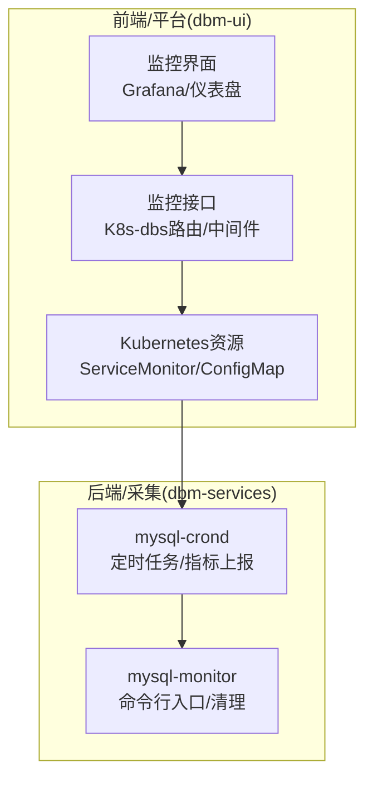
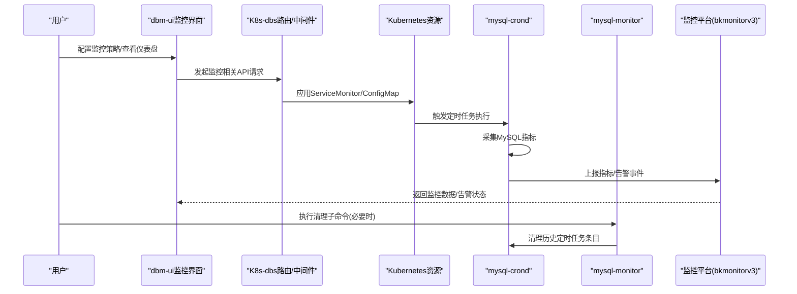
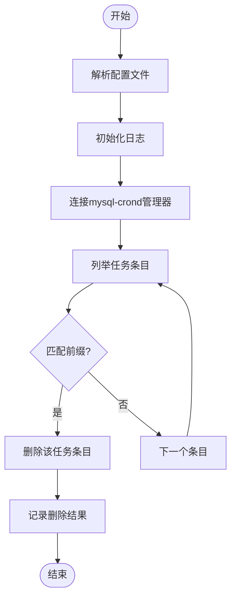
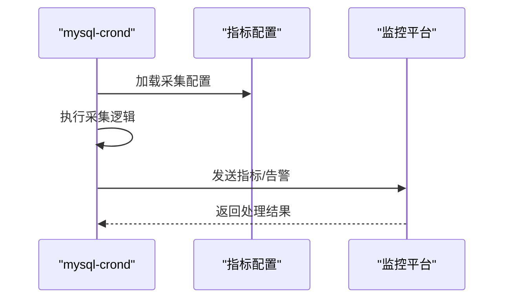
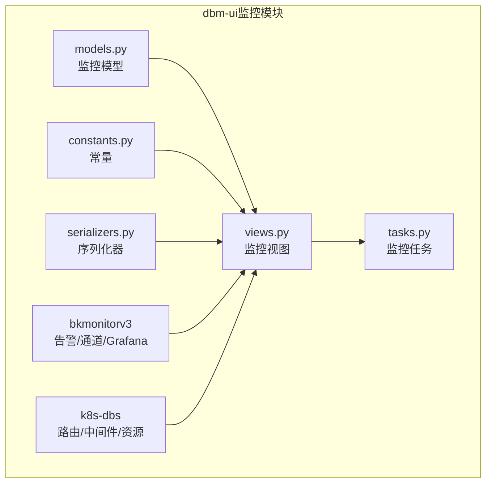
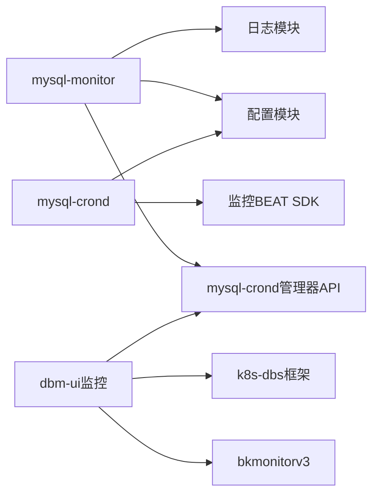

# MySQL监控

<cite>
**本文引用的文件**
- [mysql-monitor/cmd/root.go](file://dbm-services/mysql/db-tools/mysql-monitor/cmd/root.go)
- [mysql-monitor/cmd/init.go](file://dbm-services/mysql/db-tools/mysql-monitor/cmd/init.go)
- [mysql-monitor/cmd/subcmd_clean.go](file://dbm-services/mysql/db-tools/mysql-monitor/cmd/subcmd_clean.go)
- [mysql-crond配置与上报](file://dbm-services/mysql/db-tools/mysql-crond/pkg/config/bk_monitor_beat_config.go)
- [mysql-crond发送到监控](file://dbm-services/mysql/db-tools/mysql-crond/pkg/config/send_bk_monitor_beat.go)
- [dbm-ui监控集成](file://dbm-ui/backend/db_monitor/models.py)
- [dbm-ui监控视图](file://dbm-ui/backend/db_monitor/views.py)
- [dbm-ui监控任务](file://dbm-ui/backend/db_monitor/tasks.py)
- [dbm-ui监控常量](file://dbm-ui/backend/db_monitor/constants.py)
- [dbm-ui监控序列化器](file://dbm-ui/backend/db_monitor/serializers.py)
- [dbm-ui监控工具](file://dbm-ui/backend/components/bkmonitorv3/__init__.py)
- [dbm-ui监控通道](file://dbm-ui/backend/components/bkmonitorv3/bkmonitor_channel.py)
- [dbm-ui监控告警](file://dbm-ui/backend/components/bkmonitorv3/bkmonitor_alarm.py)
- [dbm-ui监控Grafana](file://dbm-ui/backend/components/bkmonitorv3/grafana.py)
- [dbm-ui监控K8s服务](file://dbm-ui/backend/k8s-dbs/dataweb/api/controller/)
- [dbm-ui监控K8s实体](file://dbm-ui/backend/k8s-dbs/metadata/entity/)
- [dbm-ui监控K8s路由](file://dbm-ui/backend/k8s-dbs/router/)
- [dbm-ui监控K8s中间件](file://dbm-ui/backend/k8s-dbs/middleware/)
- [dbm-ui监控K8s数据Web](file://dbm-ui/backend/k8s-dbs/dataweb/)
- [dbm-ui监控K8s元数据](file://dbm-ui/backend/k8s-dbs/metadata/)
- [dbm-ui监控K8s基础设施](file://dbm-ui/backend/k8s-dbs/infrastructure/)
- [dbm-ui监控K8s脚本](file://dbm-ui/backend/k8s-dbs/scripts/)
- [dbm-ui监控K8s终端](file://dbm-ui/backend/k8s-dbs/terminal/)
- [dbm-ui监控K8s日志](file://dbm-ui/backend/k8s-dbs/logger/logger.go)
- [dbm-ui监控K8s错误](file://dbm-ui/backend/k8s-dbs/errors/error.go)
- [dbm-ui监控K8s指标](file://dbm-ui/backend/k8s-dbs/metric/)
- [dbm-ui监控K8s中间件API认证](file://dbm-ui/backend/k8s-dbs/middleware/api_auth_middleware.go)
- [dbm-ui监控K8s中间件API日志](file://dbm-ui/backend/k8s-dbs/middleware/api_log_middleware.go)
- [dbm-ui监控K8s中间件API指标](file://dbm-ui/backend/k8s-dbs/middleware/api_metric_middleware.go)
- [dbm-ui监控K8s中间件集群解析](file://dbm-ui/backend/k8s-dbs/middleware/cluster_type_resolver.go)
- [dbm-ui监控K8s中间件辅助](file://dbm-ui/backend/k8s-dbs/middleware/middleware_helper.go)
- [dbm-ui监控K8s路由核心](file://dbm-ui/backend/k8s-dbs/router/core/)
- [dbm-ui监控K8s路由数据Web](file://dbm-ui/backend/k8s-dbs/router/dataweb/)
- [dbm-ui监控K8s路由元数据](file://dbm-ui/backend/k8s-dbs/router/metadata/)
- [dbm-ui监控K8s路由终端](file://dbm-ui/backend/k8s-dbs/router/terminal/)
- [dbm-ui监控K8s路由工具](file://dbm-ui/backend/k8s-dbs/router/util/)
- [dbm-ui监控K8sVO](file://dbm-ui/backend/k8s-dbs/dataweb/vo/)
- [dbm-ui监控K8sVO](file://dbm-ui/backend/k8s-dbs/terminal/vo/)
- [dbm-ui监控K8sVO](file://dbm-ui/backend/k8s-dbs/metadata/vo/)
- [dbm-ui监控K8s请求](file://dbm-ui/backend/k8s-dbs/infrastructure/request/)
- [dbm-ui监控K8s响应](file://dbm-ui/backend/k8s-dbs/infrastructure/response/)
- [dbm-ui监控K8s第三方API](file://dbm-ui/backend/k8s-dbs/infrastructure/thirdapi/)
- [dbm-ui监控K8s工具](file://dbm-ui/backend/k8s-dbs/k8s-utils/)
- [dbm-ui监控K8s示例拓扑](file://dbm-ui/backend/k8s-dbs/samples/addon_tolopogy_instance/)
- [dbm-ui监控K8s脚本SQL](file://dbm-ui/backend/k8s-dbs/scripts/sql/)
- [dbm-ui监控K8s脚本单元测试](file://dbm-ui/backend/k8s-dbs/scripts/unit_tests/)
- [dbm-ui监控K8s脚本代码检查](file://dbm-ui/backend/k8s-dbs/scripts/code_check.sh)
- [dbm-ui监控K8s脚本安装](file://dbm-ui/backend/k8s-dbs/scripts/install.sh)
- [dbm-ui监控K8s脚本测试环境](file://dbm-ui/backend/k8s-dbs/scripts/test_env.sh)
- [dbm-ui监控K8s终端实体](file://dbm-ui/backend/k8s-dbs/terminal/entity/)
- [dbm-ui监控K8s终端提供者](file://dbm-ui/backend/k8s-dbs/terminal/provider/)
- [dbm-ui监控K8s终端工具](file://dbm-ui/backend/k8s-dbs/terminal/util/)
- [dbm-ui监控K8s终端请求VO](file://dbm-ui/backend/k8s-dbs/terminal/vo/request/)
- [dbm-ui监控K8s元数据API控制器](file://dbm-ui/backend/k8s-dbs/metadata/api/controller/)
- [dbm-ui监控K8s元数据模型](file://dbm-ui/backend/k8s-dbs/metadata/model/)
- [dbm-ui监控K8s元数据提供者](file://dbm-ui/backend/k8s-dbs/metadata/provider/)
- [dbm-ui监控K8s元数据助手](file://dbm-ui/backend/k8s-dbs/metadata/helper/)
- [dbm-ui监控K8s元数据实用工具](file://dbm-ui/backend/k8s-dbs/metadata/util/)
- [dbm-ui监控K8s元数据VO](file://dbm-ui/backend/k8s-dbs/metadata/vo/)
- [dbm-ui监控K8s数据WebAPI](file://dbm-ui/backend/k8s-dbs/dataweb/api/)
- [dbm-ui监控K8s数据WebVO](file://dbm-ui/backend/k8s-dbs/dataweb/vo/)
- [dbm-ui监控K8s数据WebVO](file://dbm-ui/backend/k8s-dbs/dataweb/vo/)
- [dbm-ui监控K8s数据WebVO](file://dbm-ui/backend/k8s-dbs/dataweb/vo/)
- [dbm-ui监控K8s数据WebVO](file://dbm-ui/backend/k8s-dbs/dataweb/vo/)
- [dbm-ui监控K8s数据WebVO](file://dbm-ui/backend/k8s-dbs/dataweb/vo/)
- [dbm-ui监控K8s数据WebVO](file://dbm-ui/backend/k8s-dbs/dataweb/vo/)
- [dbm-ui监控K8s数据WebVO](file://dbm-ui/backend/k8s-dbs/dataweb/vo/)
- [dbm-ui监控K8s数据WebVO](file://dbm-ui/backend/k8s-dbs/dataweb/vo/)
- [dbm-ui监控K8s数据WebVO](file://dbm-ui/backend/k8s-dbs/dataweb/vo/)
- [dbm-ui监控K8s数据WebVO](file://dbm-ui/backend/k8s-dbs/dataweb/vo/)
- [dbm-ui监控K8s数据WebVO](file://dbm-ui/backend/k8s-dbs/dataweb/vo/)
- [dbm-ui监控K8s数据WebVO](file://dbm-ui/backend/k8s-dbs/dataweb/vo/)
- [dbm-ui监控K8s数据WebVO](file://dbm-ui/backend/k8s-dbs/dataweb/vo/)
- [dbm-ui监控K8s数据WebVO](file://dbm-ui/backend/k8s-dbs/dataweb/vo/)
- [dbm-ui监控K8s数据WebVO](file://dbm-ui/backend/k8s-dbs/dataweb/vo/)
- [dbm-ui监控K8s数据WebVO](file://dbm-ui/backend/k8s-dbs/dataweb/vo/)
- [dbm-ui监控K8s数据WebVO](file://dbm-ui/backend/k8s-dbs/dataweb/vo/)
- [dbm-ui监控K8s数据WebVO](file://dbm-ui/backend/k8s-dbs/dataweb/vo/)
- [dbm-ui监控K8s数据WebVO](file://dbm-ui/backend/k8s-d......
</cite>

## 目录
1. [简介](#简介)
2. [项目结构](#项目结构)
3. [核心组件](#核心组件)
4. [架构总览](#架构总览)
5. [详细组件分析](#详细组件分析)
6. [依赖分析](#依赖分析)
7. [性能考虑](#性能考虑)
8. [故障排查指南](#故障排查指南)
9. [结论](#结论)
10. [附录](#附录)

## 简介
本文件面向MySQL监控工具，系统性阐述数据采集策略、关键性能指标监控与告警机制，覆盖MySQL实例监控配置、慢查询分析与性能瓶颈识别方法，并提供部署安装、配置管理与故障诊断指南。文档同时说明与MySQL数据库的连接管理、查询优化建议以及监控数据的可视化展示路径。

## 项目结构
MySQL监控能力由两部分协同实现：
- 前端/平台侧：dbm-ui中的监控模块负责策略下发、可视化展示、告警通道对接与Kubernetes资源编排。
- 后端/采集侧：dbm-services中的mysql-monitor与mysql-crond负责采集、上报与清理等操作。

**图表来源**
- [mysql-monitor/cmd/root.go:10-13](file://dbm-services/mysql/db-tools/mysql-monitor/cmd/root.go#L10-L13)
- [mysql-monitor/cmd/subcmd_clean.go:16-20](file://dbm-services/mysql/db-tools/mysql-monitor/cmd/subcmd_clean.go#L16-L20)
- [dbm-ui监控K8s服务](file://dbm-ui/backend/k8s-dbs/dataweb/api/controller/)
- [dbm-ui监控K8s路由](file://dbm-ui/backend/k8s-dbs/router/)

**章节来源**
- [mysql-monitor/cmd/root.go:10-13](file://dbm-services/mysql/db-tools/mysql-monitor/cmd/root.go#L10-L13)
- [mysql-monitor/cmd/init.go:7-11](file://dbm-services/mysql/db-tools/mysql-monitor/cmd/init.go#L7-L11)
- [mysql-monitor/cmd/subcmd_clean.go:16-20](file://dbm-services/mysql/db-tools/mysql-monitor/cmd/subcmd_clean.go#L16-L20)

## 核心组件
- mysql-monitor命令行工具：提供清理MySQL定时任务条目的子命令，便于运维在变更或迁移时统一清理历史任务。
- mysql-crond定时任务：负责周期性采集MySQL指标并上报至监控平台（如监控BEAT），支持配置化与可扩展的指标项。
- dbm-ui监控模块：提供监控策略配置、告警通道对接（bkmonitorv3）、Grafana可视化、Kubernetes资源编排（ServiceMonitor）等能力。

**章节来源**
- [mysql-monitor/cmd/root.go:10-13](file://dbm-services/mysql/db-tools/mysql-monitor/cmd/root.go#L10-L13)
- [mysql-monitor/cmd/subcmd_clean.go:16-20](file://dbm-services/mysql/db-tools/mysql-monitor/cmd/subcmd_clean.go#L16-L20)
- [mysql-crond配置与上报](file://dbm-services/mysql/db-tools/mysql-crond/pkg/config/bk_monitor_beat_config.go)
- [mysql-crond发送到监控](file://dbm-services/mysql/db-tools/mysql-crond/pkg/config/send_bk_monitor_beat.go)
- [dbm-ui监控工具](file://dbm-ui/backend/components/bkmonitorv3/__init__.py)

## 架构总览
MySQL监控从采集到可视化的整体流程如下：

**图表来源**
- [mysql-monitor/cmd/subcmd_clean.go:20-56](file://dbm-services/mysql/db-tools/mysql-monitor/cmd/subcmd_clean.go#L20-L56)
- [mysql-crond发送到监控](file://dbm-services/mysql/db-tools/mysql-crond/pkg/config/send_bk_monitor_beat.go)
- [dbm-ui监控K8s中间件API认证](file://dbm-ui/backend/k8s-dbs/middleware/api_auth_middleware.go)
- [dbm-ui监控K8s中间件API日志](file://dbm-ui/backend/k8s-dbs/middleware/api_log_middleware.go)
- [dbm-ui监控K8s中间件API指标](file://dbm-ui/backend/k8s-dbs/middleware/api_metric_middleware.go)

## 详细组件分析

### 组件A：mysql-monitor命令行工具
- 功能定位：提供清理子命令，用于删除与当前端口关联的mysql-crond定时任务条目，避免重复或冲突。
- 关键流程：
  - 解析配置文件
  - 初始化日志
  - 连接mysql-crond管理器
  - 列举所有任务条目
  - 匹配前缀并删除对应条目
  - 记录删除结果

**图表来源**
- [mysql-monitor/cmd/subcmd_clean.go:20-56](file://dbm-services/mysql/db-tools/mysql-monitor/cmd/subcmd_clean.go#L20-L56)

**章节来源**
- [mysql-monitor/cmd/root.go:10-13](file://dbm-services/mysql/db-tools/mysql-monitor/cmd/root.go#L10-L13)
- [mysql-monitor/cmd/init.go:7-11](file://dbm-services/mysql/db-tools/mysql-monitor/cmd/init.go#L7-L11)
- [mysql-monitor/cmd/subcmd_clean.go:16-20](file://dbm-services/mysql/db-tools/mysql-monitor/cmd/subcmd_clean.go#L16-L20)
- [mysql-monitor/cmd/subcmd_clean.go:20-56](file://dbm-services/mysql/db-tools/mysql-monitor/cmd/subcmd_clean.go#L20-L56)

### 组件B：mysql-crond指标采集与上报
- 功能定位：周期性采集MySQL指标并通过监控BEAT上报，支持配置化指标项与上报目标。
- 关键点：
  - 指标配置：通过配置文件定义采集项与阈值参数
  - 上报通道：将采集结果发送到监控平台
  - 可扩展性：新增指标可通过配置快速接入

**图表来源**
- [mysql-crond配置与上报](file://dbm-services/mysql/db-tools/mysql-crond/pkg/config/bk_monitor_beat_config.go)
- [mysql-crond发送到监控](file://dbm-services/mysql/db-tools/mysql-crond/pkg/config/send_bk_monitor_beat.go)

**章节来源**
- [mysql-crond配置与上报](file://dbm-services/mysql/db-tools/mysql-crond/pkg/config/bk_monitor_beat_config.go)
- [mysql-crond发送到监控](file://dbm-services/mysql/db-tools/mysql-crond/pkg/config/send_bk_monitor_beat.go)

### 组件C：dbm-ui监控模块
- 功能定位：提供监控策略配置、告警通道对接、Grafana可视化、Kubernetes资源编排等。
- 关键模块：
  - 监控模型与视图：定义监控对象、指标与视图
  - 任务调度：后台任务执行监控相关操作
  - 常量与序列化器：统一指标命名与数据格式
  - 中间件：认证、日志、指标埋点
  - K8s-dbs：路由、实体、VO、基础设施、脚本等

**图表来源**
- [dbm-ui监控模型](file://dbm-ui/backend/db_monitor/models.py)
- [dbm-ui监控视图](file://dbm-ui/backend/db_monitor/views.py)
- [dbm-ui监控任务](file://dbm-ui/backend/db_monitor/tasks.py)
- [dbm-ui监控常量](file://dbm-ui/backend/db_monitor/constants.py)
- [dbm-ui监控序列化器](file://dbm-ui/backend/db_monitor/serializers.py)
- [dbm-ui监控工具](file://dbm-ui/backend/components/bkmonitorv3/__init__.py)
- [dbm-ui监控K8s路由](file://dbm-ui/backend/k8s-dbs/router/)

**章节来源**
- [dbm-ui监控模型](file://dbm-ui/backend/db_monitor/models.py)
- [dbm-ui监控视图](file://dbm-ui/backend/db_monitor/views.py)
- [dbm-ui监控任务](file://dbm-ui/backend/db_monitor/tasks.py)
- [dbm-ui监控常量](file://dbm-ui/backend/db_monitor/constants.py)
- [dbm-ui监控序列化器](file://dbm-ui/backend/db_monitor/serializers.py)
- [dbm-ui监控工具](file://dbm-ui/backend/components/bkmonitorv3/__init__.py)
- [dbm-ui监控K8s路由](file://dbm-ui/backend/k8s-dbs/router/)

## 依赖分析
- mysql-monitor依赖于mysql-crond管理器以进行任务清理；同时依赖配置模块与日志模块。
- mysql-crond依赖配置模块与监控平台SDK以完成指标采集与上报。
- dbm-ui监控模块依赖bkmonitorv3组件与K8s-dbs框架，实现策略下发、可视化与资源编排。

**图表来源**
- [mysql-monitor/cmd/subcmd_clean.go:20-56](file://dbm-services/mysql/db-tools/mysql-monitor/cmd/subcmd_clean.go#L20-L56)
- [mysql-crond发送到监控](file://dbm-services/mysql/db-tools/mysql-crond/pkg/config/send_bk_monitor_beat.go)
- [dbm-ui监控工具](file://dbm-ui/backend/components/bkmonitorv3/__init__.py)
- [dbm-ui监控K8s路由](file://dbm-ui/backend/k8s-dbs/router/)

**章节来源**
- [mysql-monitor/cmd/subcmd_clean.go:20-56](file://dbm-services/mysql/db-tools/mysql-monitor/cmd/subcmd_clean.go#L20-L56)
- [mysql-crond发送到监控](file://dbm-services/mysql/db-tools/mysql-crond/pkg/config/send_bk_monitor_beat.go)
- [dbm-ui监控工具](file://dbm-ui/backend/components/bkmonitorv3/__init__.py)

## 性能考虑
- 采集频率与批处理：合理设置采集间隔，避免对MySQL实例造成压力；批量上报减少网络开销。
- 指标选择：优先采集高价值指标，避免冗余指标导致存储与计算压力。
- 缓存与去重：对重复指标进行缓存与去重，降低重复上报成本。
- 异步处理：使用后台任务异步执行监控相关操作，避免阻塞主线程。
- 资源限制：在Kubernetes中为监控组件设置合理的CPU/内存限制，防止资源争用。

## 故障排查指南
- 清理失败：检查配置文件是否正确加载，确认日志输出中是否有删除失败的错误信息。
- 上报异常：检查监控平台地址、认证信息与网络连通性；确认指标格式与阈值配置正确。
- 可视化缺失：检查ServiceMonitor配置与Grafana数据源；确认指标名称与标签一致。
- 权限问题：核对dbm-ui与mysql-crond的访问权限，确保能够读取所需资源与写入监控数据。

**章节来源**
- [mysql-monitor/cmd/subcmd_clean.go:20-56](file://dbm-services/mysql/db-tools/mysql-monitor/cmd/subcmd_clean.go#L20-L56)
- [mysql-crond发送到监控](file://dbm-services/mysql/db-tools/mysql-crond/pkg/config/send_bk_monitor_beat.go)
- [dbm-ui监控K8s中间件API认证](file://dbm-ui/backend/k8s-dbs/middleware/api_auth_middleware.go)

## 结论
MySQL监控工具通过mysql-monitor、mysql-crond与dbm-ui监控模块形成完整的采集-上报-可视化闭环。通过合理的指标选择、阈值配置与告警规则，结合Kubernetes资源编排与Grafana可视化，能够有效支撑MySQL实例的运行监控与性能优化。

## 附录
- 部署安装：通过Kubernetes应用ServiceMonitor与相关ConfigMap，启动mysql-crond并配置监控上报。
- 配置管理：在dbm-ui中配置监控策略、阈值与告警通道，确保与mysql-crond配置一致。
- 故障诊断：利用日志与错误码定位问题，结合清理子命令与平台通道进行修复与验证。