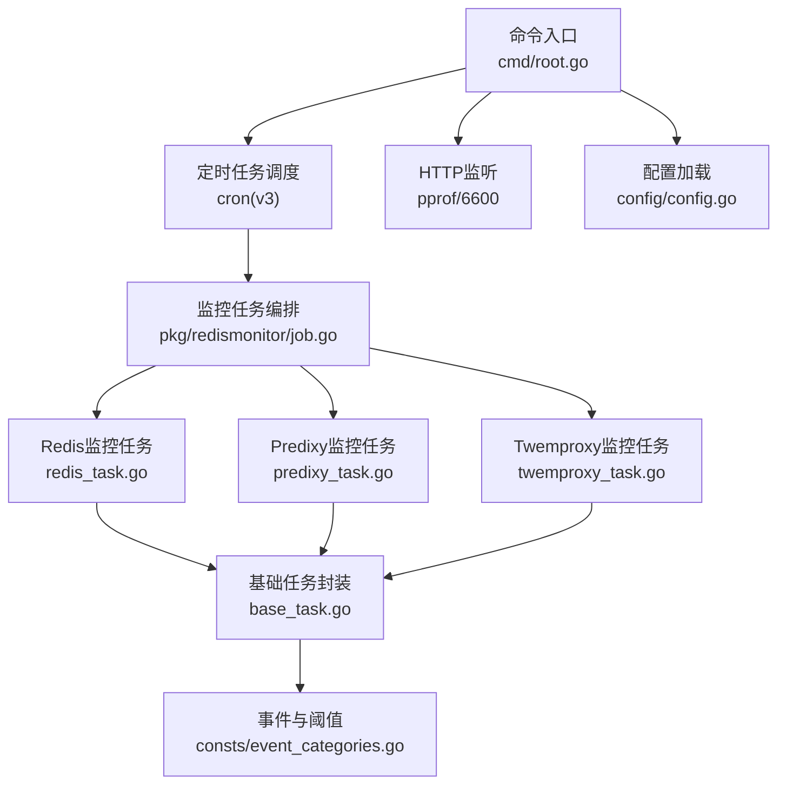
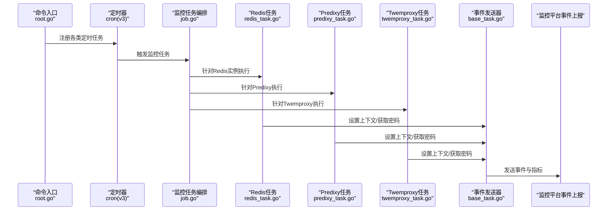
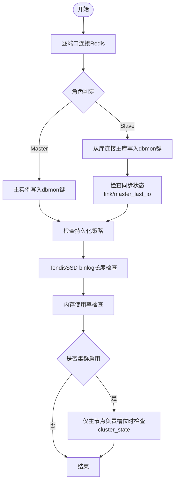
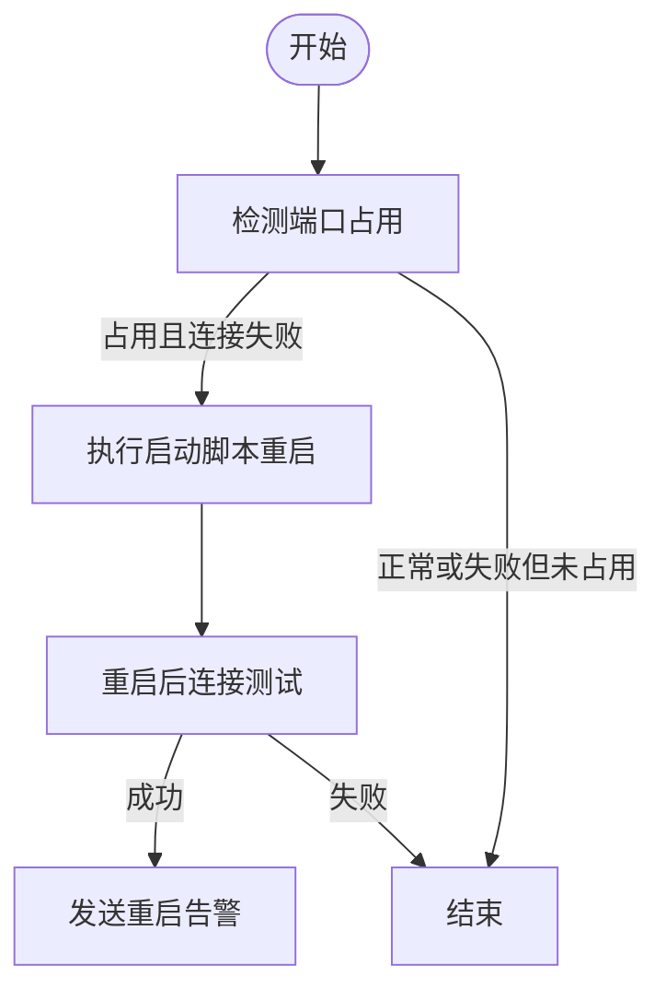
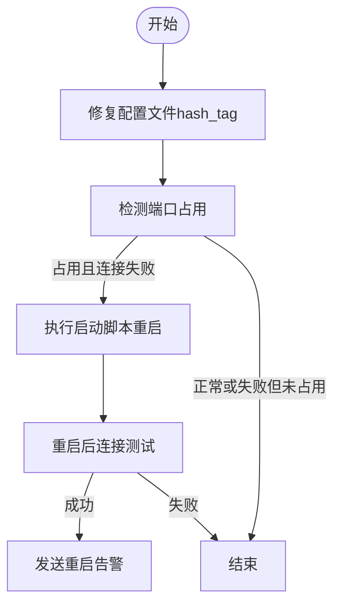
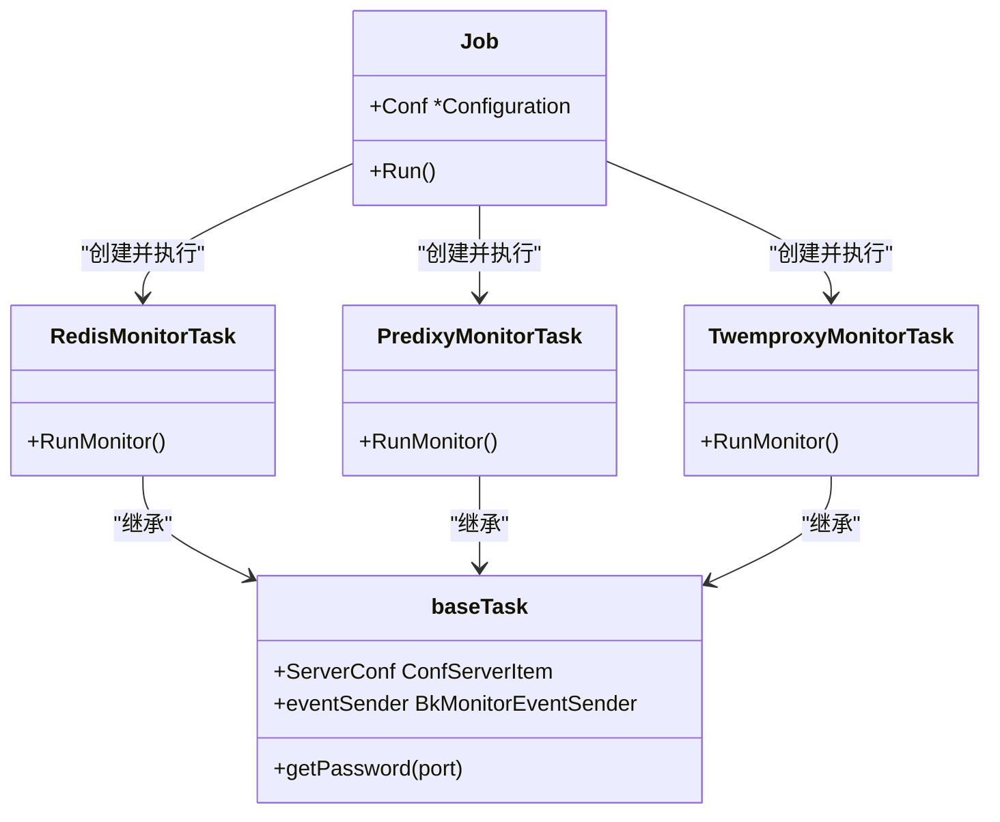
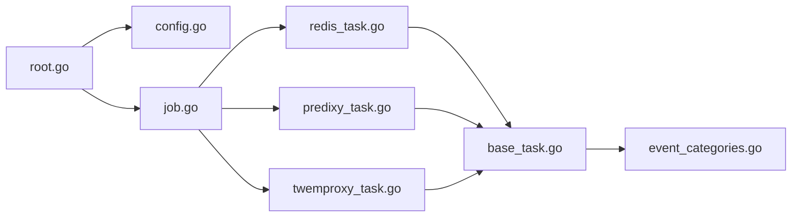

# Redis监控

<cite>
**本文引用的文件**
- [根命令入口 root.go](file://dbm-services/redis/db-tools/dbmon/cmd/root.go)
- [配置 config.go](file://dbm-services/redis/db-tools/dbmon/config/config.go)
- [Redis监控任务 job.go](file://dbm-services/redis/db-tools/dbmon/pkg/redismonitor/job.go)
- [Redis监控任务实现 redis_task.go](file://dbm-services/redis/db-tools/dbmon/pkg/redismonitor/redis_task.go)
- [基类任务 base_task.go](file://dbm-services/redis/db-tools/dbmon/pkg/redismonitor/base_task.go)
- [事件分类与阈值 event_categories.go](file://dbm-services/redis/db-tools/dbmon/pkg/consts/event_categories.go)
- [Predixy监控任务 predixy_task.go](file://dbm-services/redis/db-tools/dbmon/pkg/redismonitor/predixy_task.go)
- [Twemproxy监控任务 twemproxy_task.go](file://dbm-services/redis/db-tools/dbmon/pkg/redismonitor/twemproxy_task.go)
</cite>

## 目录
1. [简介](#简介)
2. [项目结构](#项目结构)
3. [核心组件](#核心组件)
4. [架构总览](#架构总览)
5. [详细组件分析](#详细组件分析)
6. [依赖关系分析](#依赖关系分析)
7. [性能与内存监控](#性能与内存监控)
8. [故障排查指南](#故障排查指南)
9. [结论](#结论)
10. [附录：安装部署与配置优化](#附录安装部署与配置优化)

## 简介
本文件面向Redis监控工具（bk-dbmon）的使用者与维护者，系统性阐述其架构设计、监控能力与运维实践。重点覆盖：
- 架构与控制流：基于定时调度的任务编排、事件上报与告警发送。
- 监控范围：单机Redis实例、代理层（Predixy/Twemproxy）、集群状态、持久化与内存使用。
- 关键指标与阈值：连接、同步、持久化、内存占用、集群状态、binlog长度等。
- 异常检测与智能告警：按角色与场景差异化检测，分级告警策略。
- 运维管理：安装部署、配置优化、日志与健康检查、故障处理。

## 项目结构
Redis监控工具位于dbm-services/redis/db-tools/dbmon，采用“命令入口 + 配置 + 任务模块”的分层组织方式：
- 命令入口：解析参数、初始化配置、注册定时任务、启动HTTP服务与内存监控。
- 配置模块：定义各监控子系统的配置结构与默认值。
- 任务模块：按组件类型拆分任务（Redis/Predixy/Twemproxy），统一继承基础任务封装事件发送上下文。
- 常量与阈值：集中定义事件类别与告警阈值。

图表来源
- [根命令入口 root.go:1-262](file://dbm-services/redis/db-tools/dbmon/cmd/root.go#L1-L262)
- [配置 config.go:1-171](file://dbm-services/redis/db-tools/dbmon/config/config.go#L1-L171)
- [Redis监控任务 job.go:1-111](file://dbm-services/redis/db-tools/dbmon/pkg/redismonitor/job.go#L1-L111)
- [Redis监控任务实现 redis_task.go:1-589](file://dbm-services/redis/db-tools/dbmon/pkg/redismonitor/redis_task.go#L1-L589)
- [基类任务 base_task.go:1-58](file://dbm-services/redis/db-tools/dbmon/pkg/redismonitor/base_task.go#L1-L58)
- [事件分类与阈值 event_categories.go:1-45](file://dbm-services/redis/db-tools/dbmon/pkg/consts/event_categories.go#L1-L45)

章节来源
- [根命令入口 root.go:1-262](file://dbm-services/redis/db-tools/dbmon/cmd/root.go#L1-L262)
- [配置 config.go:1-171](file://dbm-services/redis/db-tools/dbmon/config/config.go#L1-L171)

## 核心组件
- 命令入口与调度
  - 初始化日志、加载配置、注册定时任务（心跳、日志上报、全备/增量备份、监控、节点报告、Key生命周期、maxmemory动态调整、失败节点清理、反向地址刷新）。
  - 启动HTTP服务用于pprof与外部探测。
- 配置模型
  - 包含服务器列表、各子系统（全备、binlog、心跳、监控、Key生命周期、maxmemory）的计划任务表达式与行为参数；默认保留策略与路径等。
- 任务编排
  - 统一Job封装，遍历Servers，按MetaRole选择对应任务类型（Redis/Predixy/Twemproxy），串行执行各任务。
- 基础任务
  - 封装事件发送器上下文（业务、云区域、应用、集群、实例角色、实例地址），密码获取策略（代理/实例）。
- 事件与阈值
  - 定义事件类别（登录、同步、持久化、内存、binlog长度、集群状态、日志）与分级阈值（时间差、IO延迟、内存使用率、binlog长度、集群状态）。

章节来源
- [根命令入口 root.go:56-227](file://dbm-services/redis/db-tools/dbmon/cmd/root.go#L56-L227)
- [配置 config.go:82-97](file://dbm-services/redis/db-tools/dbmon/config/config.go#L82-L97)
- [Redis监控任务 job.go:23-43](file://dbm-services/redis/db-tools/dbmon/pkg/redismonitor/job.go#L23-L43)
- [基类任务 base_task.go:19-48](file://dbm-services/redis/db-tools/dbmon/pkg/redismonitor/base_task.go#L19-L48)
- [事件分类与阈值 event_categories.go:15-44](file://dbm-services/redis/db-tools/dbmon/pkg/consts/event_categories.go#L15-L44)

## 架构总览
下图展示从命令入口到具体监控任务的调用序列，以及关键事件上报流程。

图表来源
- [根命令入口 root.go:74-171](file://dbm-services/redis/db-tools/dbmon/cmd/root.go#L74-L171)
- [Redis监控任务 job.go:68-110](file://dbm-services/redis/db-tools/dbmon/pkg/redismonitor/job.go#L68-L110)
- [Redis监控任务实现 redis_task.go:40-92](file://dbm-services/redis/db-tools/dbmon/pkg/redismonitor/redis_task.go#L40-L92)
- [Predixy监控任务 predixy_task.go:36-48](file://dbm-services/redis/db-tools/dbmon/pkg/redismonitor/predixy_task.go#L36-L48)
- [Twemproxy监控任务 twemproxy_task.go:36-49](file://dbm-services/redis/db-tools/dbmon/pkg/redismonitor/twemproxy_task.go#L36-L49)
- [基类任务 base_task.go:24-47](file://dbm-services/redis/db-tools/dbmon/pkg/redismonitor/base_task.go#L24-L47)

## 详细组件分析

### Redis监控任务（RedisMonitorTask）
职责与流程
- 登录与重试：针对每个端口尝试建立连接，从配置文件读取密码；从slave到master增加重试次数。
- 主从一致性：主实例写入dbmon键，从库连接主库写入dbmon键，校验时间差阈值。
- 同步状态：检查master_link_status、master_last_io_seconds_ago，超阈值分级告警。
- 持久化策略：根据缓存备份模式（RDB/AOF）强制调整从库AOF开关，确保与集群配置一致。
- TendisSSD：计算binlog长度，超阈值告警。
- 内存使用：计算used_memory/maxmemory占比，超阈值告警并上报指标。
- 集群状态：仅对负责槽位的主节点检查cluster_state。
- Twemproxy：校验server_shards配置完整性。

图表来源
- [Redis监控任务实现 redis_task.go:95-589](file://dbm-services/redis/db-tools/dbmon/pkg/redismonitor/redis_task.go#L95-L589)

章节来源
- [Redis监控任务实现 redis_task.go:40-92](file://dbm-services/redis/db-tools/dbmon/pkg/redismonitor/redis_task.go#L40-L92)
- [Redis监控任务实现 redis_task.go:95-589](file://dbm-services/redis/db-tools/dbmon/pkg/redismonitor/redis_task.go#L95-L589)

### Predixy监控任务（PredixyMonitorTask）
职责与流程
- 端口占用检测：若端口被占用但连接失败，则尝试重启脚本启动服务。
- 密码获取与二次连接：重启后再次尝试连接，成功则记录告警（warning）。
- 文件存在性校验：确保启动脚本存在，否则记录错误并告警。

图表来源
- [Predixy监控任务 predixy_task.go:50-111](file://dbm-services/redis/db-tools/dbmon/pkg/redismonitor/predixy_task.go#L50-L111)

章节来源
- [Predixy监控任务 predixy_task.go:36-111](file://dbm-services/redis/db-tools/dbmon/pkg/redismonitor/predixy_task.go#L36-L111)

### Twemproxy监控任务（TwemproxyMonitorTask）
职责与流程
- 配置修复：将hash_tag: {} 替换为 hash_tag: '{}'，避免解析问题。
- 连接失败处理：与Predixy类似，尝试重启并验证连接，成功则告警提示。

图表来源
- [Twemproxy监控任务 twemproxy_task.go:51-149](file://dbm-services/redis/db-tools/dbmon/pkg/redismonitor/twemproxy_task.go#L51-L149)

章节来源
- [Twemproxy监控任务 twemproxy_task.go:36-149](file://dbm-services/redis/db-tools/dbmon/pkg/redismonitor/twemproxy_task.go#L36-L149)

### 任务编排与事件发送（Job与Base）
- Job负责遍历配置中的Servers，按角色创建对应任务并依次执行，捕获panic并记录日志。
- Base封装事件发送器上下文，设置业务域、云区域、应用、集群、实例角色与实例地址，并按代理/实例类型读取密码。

图表来源
- [Redis监控任务 job.go:17-43](file://dbm-services/redis/db-tools/dbmon/pkg/redismonitor/job.go#L17-L43)
- [Redis监控任务实现 redis_task.go:17-33](file://dbm-services/redis/db-tools/dbmon/pkg/redismonitor/redis_task.go#L17-L33)
- [Predixy监控任务 predixy_task.go:17-33](file://dbm-services/redis/db-tools/dbmon/pkg/redismonitor/predixy_task.go#L17-L33)
- [Twemproxy监控任务 twemproxy_task.go:17-33](file://dbm-services/redis/db-tools/dbmon/pkg/redismonitor/twemproxy_task.go#L17-L33)
- [基类任务 base_task.go:12-58](file://dbm-services/redis/db-tools/dbmon/pkg/redismonitor/base_task.go#L12-L58)

章节来源
- [Redis监控任务 job.go:68-110](file://dbm-services/redis/db-tools/dbmon/pkg/redismonitor/job.go#L68-L110)
- [基类任务 base_task.go:19-58](file://dbm-services/redis/db-tools/dbmon/pkg/redismonitor/base_task.go#L19-L58)

## 依赖关系分析
- 控制流耦合
  - 命令入口与配置模块强耦合，确保配置加载与任务注册顺序正确。
  - 任务模块之间低耦合，通过统一的事件发送器与阈值常量交互。
- 外部依赖
  - 使用cron(v3)进行定时调度，使用pprof进行性能诊断。
  - 事件上报依赖监控平台提供的事件数据ID与令牌，以及Agent路径。

图表来源
- [根命令入口 root.go:1-34](file://dbm-services/redis/db-tools/dbmon/cmd/root.go#L1-L34)
- [配置 config.go:4-12](file://dbm-services/redis/db-tools/dbmon/config/config.go#L4-L12)
- [Redis监控任务 job.go:1-11](file://dbm-services/redis/db-tools/dbmon/pkg/redismonitor/job.go#L1-L11)
- [Redis监控任务实现 redis_task.go:1-15](file://dbm-services/redis/db-tools/dbmon/pkg/redismonitor/redis_task.go#L1-L15)
- [基类任务 base_task.go:1-10](file://dbm-services/redis/db-tools/dbmon/pkg/redismonitor/base_task.go#L1-L10)
- [事件分类与阈值 event_categories.go:1-7](file://dbm-services/redis/db-tools/dbmon/pkg/consts/event_categories.go#L1-L7)

章节来源
- [根命令入口 root.go:74-227](file://dbm-services/redis/db-tools/dbmon/cmd/root.go#L74-L227)

## 性能与内存监控
- 内存使用监控
  - 后台独立goroutine周期性检测进程内存使用，超过阈值自动退出，避免长期驻留导致资源膨胀。
- 性能指标采集
  - 在关键检查点（如从库时间差、master_last_io_seconds_ago、binlog长度、内存使用率）构造指标并随事件上报。
- 调度与并发
  - 使用SkipIfStillRunning策略避免任务重叠执行；部分任务按固定间隔执行（如每分钟、每10秒）。

章节来源
- [根命令入口 root.go:214-218](file://dbm-services/redis/db-tools/dbmon/cmd/root.go#L214-L218)
- [Redis监控任务实现 redis_task.go:287-295](file://dbm-services/redis/db-tools/dbmon/pkg/redismonitor/redis_task.go#L287-L295)
- [Redis监控任务实现 redis_task.go:330-337](file://dbm-services/redis/db-tools/dbmon/pkg/redismonitor/redis_task.go#L330-L337)
- [Redis监控任务实现 redis_task.go:441-449](file://dbm-services/redis/db-tools/dbmon/pkg/redismonitor/redis_task.go#L441-L449)
- [Redis监控任务实现 redis_task.go:488-499](file://dbm-services/redis/db-tools/dbmon/pkg/redismonitor/redis_task.go#L488-L499)

## 故障排查指南
- 常见问题定位
  - 登录失败：检查密码获取逻辑（代理/实例）、网络连通性、端口占用与服务状态。
  - 同步异常：关注master_link_status与master_last_io_seconds_ago，结合时间差阈值判断。
  - 持久化策略不符：根据集群备份模式（RDB/AOF）自动修正从库AOF配置。
  - TendisSSD binlog过长：关注binlog长度阈值，必要时清理或扩容。
  - 内存使用过高：关注used_memory/maxmemory占比，结合maxmemory动态调整策略。
  - 集群状态异常：仅对负责槽位的主节点检查cluster_state。
  - 代理层重启：检查启动脚本存在性与权限，确认重启后连接可用。
- 日志与诊断
  - 使用pprof端口（127.0.0.1:6600）进行性能诊断。
  - 查看任务执行日志与panic恢复信息，定位具体失败环节。

章节来源
- [事件分类与阈值 event_categories.go:25-36](file://dbm-services/redis/db-tools/dbmon/pkg/consts/event_categories.go#L25-L36)
- [Predixy监控任务 predixy_task.go:74-110](file://dbm-services/redis/db-tools/dbmon/pkg/redismonitor/predixy_task.go#L74-L110)
- [Twemproxy监控任务 twemproxy_task.go:113-147](file://dbm-services/redis/db-tools/dbmon/pkg/redismonitor/twemproxy_task.go#L113-L147)
- [根命令入口 root.go:217-218](file://dbm-services/redis/db-tools/dbmon/cmd/root.go#L217-L218)

## 结论
该Redis监控工具以清晰的分层架构与任务编排实现了对Redis实例、代理层与集群状态的全面监控。通过可配置的阈值与分级告警策略，能够及时发现连接、同步、持久化、内存与集群异常；配合事件上报与pprof诊断能力，满足生产环境的可观测性与可运维性需求。

## 附录：安装部署与配置优化
- 安装与部署
  - 通过命令入口指定配置文件路径，默认监听本地pprof端口，便于诊断。
  - 需要确保监控平台事件数据ID与令牌配置正确，Agent路径指向有效插件。
- 配置优化
  - 计划任务表达式按实际负载调整（如监控频率、备份窗口）。
  - 根据业务特性设置阈值（如内存使用率、时间差、IO延迟、binlog长度）。
  - 对代理层（Predixy/Twemproxy）确保启动脚本路径与权限正确。
- 运维管理
  - 定期检查任务执行日志与告警历史，关注重复告警与恢复路径。
  - 结合pprof与系统资源监控，评估工具自身资源占用并进行容量规划。

章节来源
- [根命令入口 root.go:244-246](file://dbm-services/redis/db-tools/dbmon/cmd/root.go#L244-L246)
- [配置 config.go:141-171](file://dbm-services/redis/db-tools/dbmon/config/config.go#L141-L171)
- [事件分类与阈值 event_categories.go:25-36](file://dbm-services/redis/db-tools/dbmon/pkg/consts/event_categories.go#L25-L36)