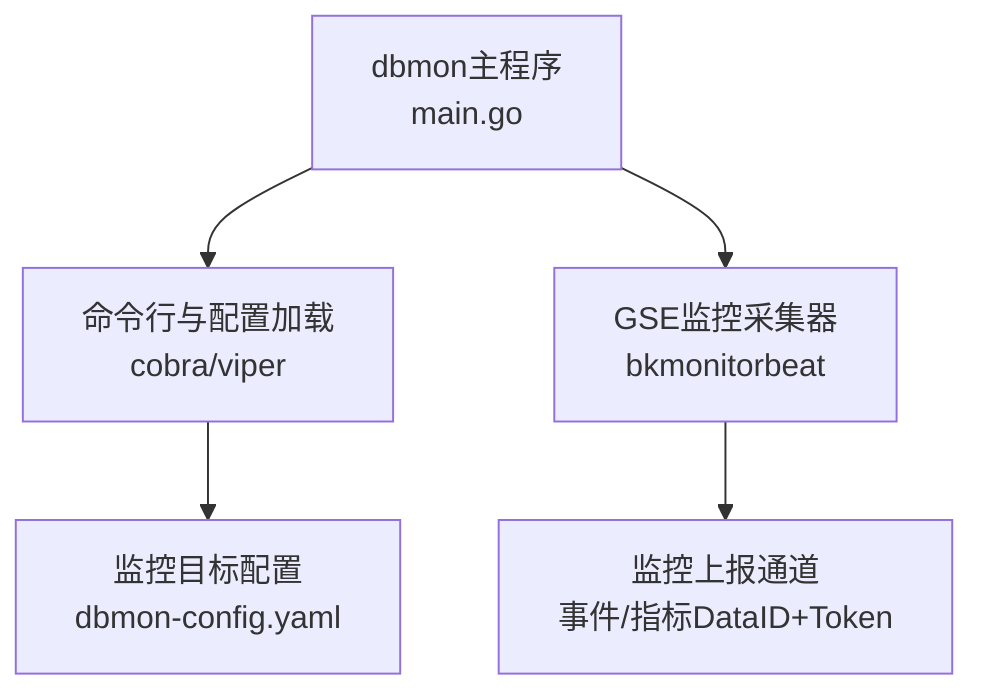
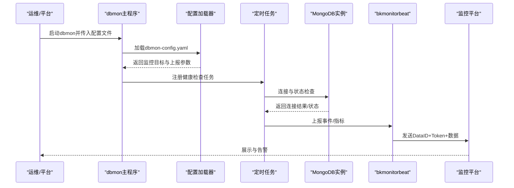
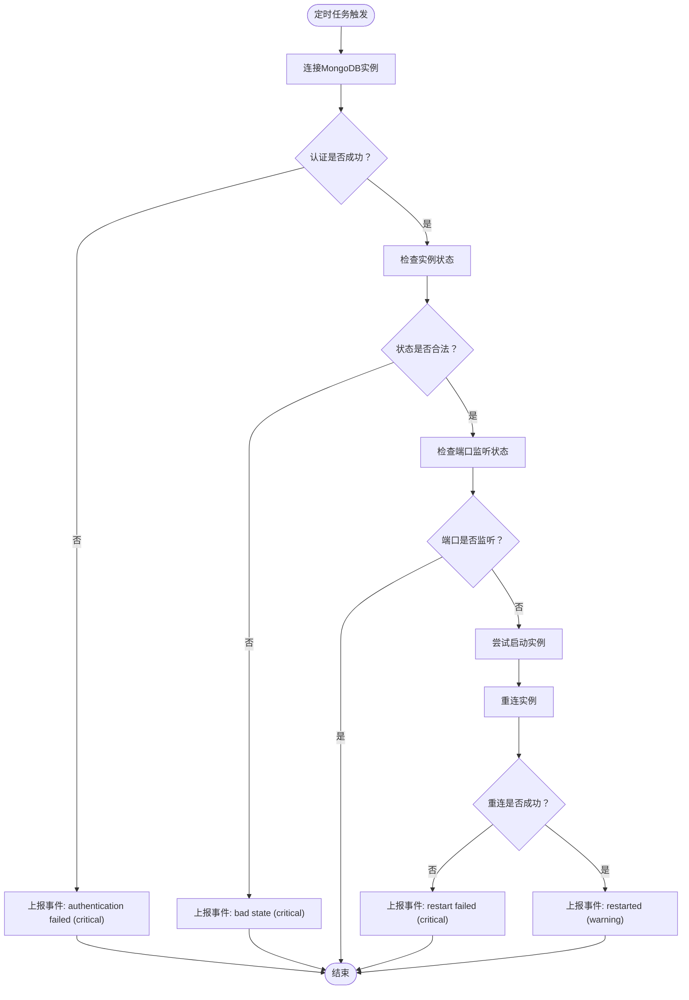
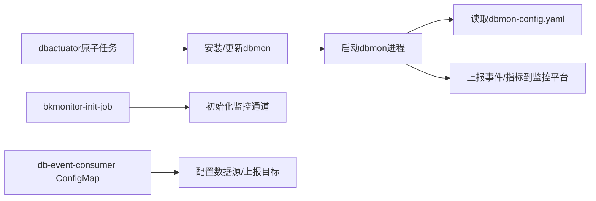
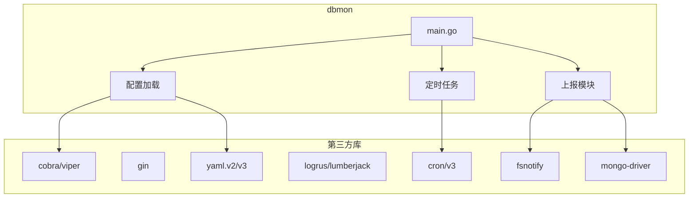

# dbmon通用监控

<cite>
**本文引用的文件**
- [main.go](file://dbm-services/mongodb/db-tools/dbmon/main.go)
- [README.md](file://dbm-services/mongodb/db-tools/dbmon/README.md)
- [dbmon-config.yaml](file://dbm-services/mongodb/db-tools/dbmon/dbmon-config.yaml)
- [go.mod](file://dbm-services/mongodb/db-tools/dbmon/go.mod)
- [install_dbmon.go](file://dbm-services/mongodb/db-tools/dbactuator/pkg/atomjobs/atommongodb/install_dbmon.go)
- [backup.go](file://dbm-services/mongodb/db-tools/dbactuator/pkg/atomjobs/atommongodb/backup.go)
- [bkmonitor-init-job.yaml](file://helm-charts/bk-dbm/charts/dbm/templates/jobs/bkmonitor-init-job.yaml)
- [datasource.yaml](file://helm-charts/bk-dbm/charts/dbm/templates/configmaps/db-event-consumer-configmap.yaml)
</cite>

## 目录
1. [简介](#简介)
2. [项目结构](#项目结构)
3. [核心组件](#核心组件)
4. [架构总览](#架构总览)
5. [详细组件分析](#详细组件分析)
6. [依赖关系分析](#依赖关系分析)
7. [性能考虑](#性能考虑)
8. [故障排查指南](#故障排查指南)
9. [结论](#结论)
10. [附录](#附录)

## 简介
本文件面向dbmon通用监控工具，系统化阐述其架构设计、监控数据采集机制、指标与事件定义、配置文件格式、告警规则对接、数据存储策略、与DBM其他组件的集成方式、进程管理与健康检查机制，并提供部署配置指南、性能调优建议与常见问题排查方法。本文所有技术细节均基于仓库中实际文件进行归纳总结。

## 项目结构
dbmon在MongoDB工具集中作为独立二进制运行，入口位于main.go，核心职责包括：
- 命令行入口与初始化（含CPU调度优化）
- 读取配置文件并加载监控目标
- 与GSE监控采集器bkmonitorbeat对接，上报事件与指标
- 提供调试命令用于事件/指标发送测试

dbmon配置文件采用YAML格式，定义了报告目录、保留天数、HTTP监听地址、bkmonitorbeat路径与认证信息、以及待监控的MongoDB实例列表。

图表来源
- [main.go:1-26](file://dbm-services/mongodb/db-tools/dbmon/main.go#L1-L26)
- [dbmon-config.yaml:1-31](file://dbm-services/mongodb/db-tools/dbmon/dbmon-config.yaml#L1-L31)

章节来源
- [main.go:1-26](file://dbm-services/mongodb/db-tools/dbmon/main.go#L1-L26)
- [README.md:1-57](file://dbm-services/mongodb/db-tools/dbmon/README.md#L1-L57)
- [dbmon-config.yaml:1-31](file://dbm-services/mongodb/db-tools/dbmon/dbmon-config.yaml#L1-L31)

## 核心组件
- 主程序与初始化
  - 初始化阶段根据CPU核数动态调整GOMAXPROCS，避免解析日志场景下的过度并发导致资源争用。
  - 入口函数委托给命令模块执行。

- 命令行与配置
  - 使用Cobra框架组织命令树，支持debug模式下的sendmsg等子命令，便于事件/指标上报验证。
  - 使用Viper加载YAML配置文件，支持热更新（由上层调用方控制）。

- 监控目标与上报
  - 配置文件中定义多个MongoDB实例（cluster/replica set/shard等），每个实例包含IP、端口、认证凭据、集群标识等。
  - 通过bkmonitorbeat将事件与指标上报至监控平台，使用独立的DataID与Token进行鉴权。

- 调试能力
  - 提供debug sendmsg命令，支持指定类型（event/ts）与消息内容，便于快速验证上报链路。

章节来源
- [main.go:13-21](file://dbm-services/mongodb/db-tools/dbmon/main.go#L13-L21)
- [README.md:40-57](file://dbm-services/mongodb/db-tools/dbmon/README.md#L40-L57)
- [dbmon-config.yaml:14-30](file://dbm-services/mongodb/db-tools/dbmon/dbmon-config.yaml#L14-L30)

## 架构总览
dbmon整体架构围绕“配置驱动的多实例监控”展开，核心流程如下：
- 启动时加载配置，解析监控目标列表
- 定时健康检查任务对各实例进行连通性与状态校验
- 将异常事件与关键指标通过bkmonitorbeat上报到监控平台
- 支持调试命令验证上报链路

图表来源
- [main.go:23-25](file://dbm-services/mongodb/db-tools/dbmon/main.go#L23-L25)
- [dbmon-config.yaml:14-30](file://dbm-services/mongodb/db-tools/dbmon/dbmon-config.yaml#L14-L30)
- [README.md:40-57](file://dbm-services/mongodb/db-tools/dbmon/README.md#L40-L57)

## 详细组件分析

### 配置文件格式与字段说明
- 基础配置
  - 报告保存目录与保留天数：用于存放备份/巡检报告及清理策略
  - 备份客户端存储类型：如cos等，影响备份归档策略
  - HTTP监听地址：用于内部接口或健康检查暴露
- 上报配置（bkmonitorbeat）
  - agent_address：GSE Agent通信地址
  - beat_path：bkmonitorbeat可执行路径
  - event_config/event_config：事件上报的DataID与Token
  - metric_config：指标上报的DataID与Token
- 监控目标列表（servers）
  - 每个目标包含云区域、业务、集群域、集群ID/名称、类型、角色、meta角色、IP/端口、set_name、用户名/密码等

章节来源
- [dbmon-config.yaml:1-31](file://dbm-services/mongodb/db-tools/dbmon/dbmon-config.yaml#L1-L31)
- [README.md:5-38](file://dbm-services/mongodb/db-tools/dbmon/README.md#L5-L38)

### 健康检查与事件上报机制
- 健康检查频率：每分钟执行一次
- 检查逻辑要点
  - 认证失败：触发“authentication failed”事件（critical）
  - 状态异常：当实例状态不在允许集合内（如primary/secondary/arbiter）时，触发“bad state”事件（critical）
  - 端口监听：若端口仍处于监听状态则视为正常；若不再监听，则尝试启动实例后重连
    - 重连失败：触发“restart failed”事件（critical）
    - 重连成功：触发“restarted”事件（warning）

图表来源
- [README.md:49-56](file://dbm-services/mongodb/db-tools/dbmon/README.md#L49-L56)

章节来源
- [README.md:49-56](file://dbm-services/mongodb/db-tools/dbmon/README.md#L49-L56)

### 数据采集与处理
- 采集范围
  - 健康检查：连接性与状态合法性
  - 事件与指标：通过bkmonitorbeat上报
- 处理与转发
  - 事件与指标统一经由bkmonitorbeat发送到监控平台
  - 平台侧可基于DataID/Token进行路由与聚合

章节来源
- [dbmon-config.yaml:5-13](file://dbm-services/mongodb/db-tools/dbmon/dbmon-config.yaml#L5-L13)
- [README.md:49-56](file://dbm-services/mongodb/db-tools/dbmon/README.md#L49-L56)

### 与DBM其他组件的集成
- 与dbactuator的集成
  - dbactuator在原子任务中会安装/更新dbmon，并在需要时启动dbmon
  - dbactuator通过常量与工具函数定位dbmon二进制与工具链（如zstd、mongotools），并在备份流程中生成报告路径
- 与bkmonitor的集成
  - 通过bkmonitor-init-job初始化监控通道
  - 通过db-event-consumer的ConfigMap配置监控数据源与上报目标

图表来源
- [install_dbmon.go:323-343](file://dbm-services/mongodb/db-tools/dbactuator/pkg/atomjobs/atommongodb/install_dbmon.go#L323-L343)
- [bkmonitor-init-job.yaml:1-33](file://helm-charts/bk-dbm/charts/dbm/templates/jobs/bkmonitor-init-job.yaml#L1-L33)
- [datasource.yaml:39-65](file://helm-charts/bk-dbm/charts/dbm/templates/configmaps/db-event-consumer-configmap.yaml#L39-L65)

章节来源
- [install_dbmon.go:323-343](file://dbm-services/mongodb/db-tools/dbactuator/pkg/atomjobs/atommongodb/install_dbmon.go#L323-L343)
- [backup.go:420-503](file://dbm-services/mongodb/db-tools/dbactuator/pkg/atomjobs/atommongodb/backup.go#L420-L503)
- [bkmonitor-init-job.yaml:1-33](file://helm-charts/bk-dbm/charts/dbm/templates/jobs/bkmonitor-init-job.yaml#L1-L33)
- [datasource.yaml:39-65](file://helm-charts/bk-dbm/charts/dbm/templates/configmaps/db-event-consumer-configmap.yaml#L39-L65)

## 依赖关系分析
- 第三方库
  - 命令行与配置：spf13/cobra、spf13/viper
  - HTTP框架：gin-gonic/gin
  - 定时任务：robfig/cron/v3
  - 日志与文件轮转：sirupsen/logrus、natefinch/lumberjack
  - 文件监控：fsnotify
  - MongoDB驱动：go.mongodb.org/mongo-driver
  - YAML解析：gopkg.in/yaml.v2、gopkg.in/yaml.v3
- 内部依赖
  - dbmon通过dbactuator的常量与工具函数获取工具链路径与报告路径

图表来源
- [go.mod:7-25](file://dbm-services/mongodb/db-tools/dbmon/go.mod#L7-L25)
- [main.go:8-11](file://dbm-services/mongodb/db-tools/dbmon/main.go#L8-L11)

章节来源
- [go.mod:7-25](file://dbm-services/mongodb/db-tools/dbmon/go.mod#L7-L25)
- [backup.go:420-503](file://dbm-services/mongodb/db-tools/dbactuator/pkg/atomjobs/atommongodb/backup.go#L420-L503)

## 性能考虑
- CPU调度优化
  - 根据CPU核数动态设置GOMAXPROCS，避免在日志解析等高CPU场景下过度并发
- 并发与I/O
  - 建议合理设置定时任务间隔，避免对被监控实例造成过大压力
  - 对于大量实例的场景，建议分批或分片执行健康检查
- 上报带宽
  - 控制事件与指标上报频率，避免瞬时流量高峰
- 存储与日志
  - 合理配置日志轮转与保留策略，避免磁盘空间占用过高

章节来源
- [main.go:13-21](file://dbm-services/mongodb/db-tools/dbmon/main.go#L13-L21)

## 故障排查指南
- 启动与进程管理
  - 若dbmon未运行，dbactuator会尝试启动；可通过进程PID判断运行状态
  - 如配置文件变更，dbactuator会检测MD5变化并重启dbmon
- 配置问题
  - 确认dbmon-config.yaml中bkmonitorbeat路径、DataID/Token正确
  - 确认监控目标列表中的IP/端口、用户名/密码、集群标识正确
- 上报链路
  - 使用debug sendmsg命令验证事件/指标上报是否可达
  - 检查GSE Agent通信地址与权限
- 平台侧
  - 确认bkmonitor-init-job已完成初始化
  - 确认db-event-consumer的ConfigMap中数据源与上报目标配置正确

章节来源
- [install_dbmon.go:323-343](file://dbm-services/mongodb/db-tools/dbactuator/pkg/atomjobs/atommongodb/install_dbmon.go#L323-L343)
- [README.md:40-48](file://dbm-services/mongodb/db-tools/dbmon/README.md#L40-L48)
- [bkmonitor-init-job.yaml:1-33](file://helm-charts/bk-dbm/charts/dbm/templates/jobs/bkmonitor-init-job.yaml#L1-L33)
- [datasource.yaml:39-65](file://helm-charts/bk-dbm/charts/dbm/templates/configmaps/db-event-consumer-configmap.yaml#L39-L65)

## 结论
dbmon以配置驱动为核心，结合定时健康检查与bkmonitorbeat上报，形成从实例发现、状态校验到事件/指标上报的完整闭环。通过与dbactuator、bkmonitor、db-event-consumer等组件协同，实现了在DBM生态内的标准化监控与告警能力。部署时应重点关注配置准确性、上报链路可用性与平台侧初始化完整性；运行时应关注CPU调度、并发与I/O开销、日志轮转与磁盘占用等性能因素。

## 附录

### 部署配置指南
- 安装与启动
  - dbactuator负责安装/更新dbmon并启动
  - 启动前确保配置文件存在且权限正确
- 配置要点
  - report_save_dir与report_left_day：备份/巡检报告的存储与清理
  - http_address：内部接口监听地址
  - bkmonitorbeat：agent_address、beat_path、event_config/metric_config（DataID/Token）
  - servers：逐条配置MongoDB实例的连接参数与集群标识
- 平台初始化
  - 执行bkmonitor-init-job完成监控通道初始化
  - 确保db-event-consumer的ConfigMap配置正确

章节来源
- [install_dbmon.go:323-343](file://dbm-services/mongodb/db-tools/dbactuator/pkg/atomjobs/atommongodb/install_dbmon.go#L323-L343)
- [dbmon-config.yaml:1-31](file://dbm-services/mongodb/db-tools/dbmon/dbmon-config.yaml#L1-L31)
- [bkmonitor-init-job.yaml:1-33](file://helm-charts/bk-dbm/charts/dbm/templates/jobs/bkmonitor-init-job.yaml#L1-L33)
- [datasource.yaml:39-65](file://helm-charts/bk-dbm/charts/dbm/templates/configmaps/db-event-consumer-configmap.yaml#L39-L65)