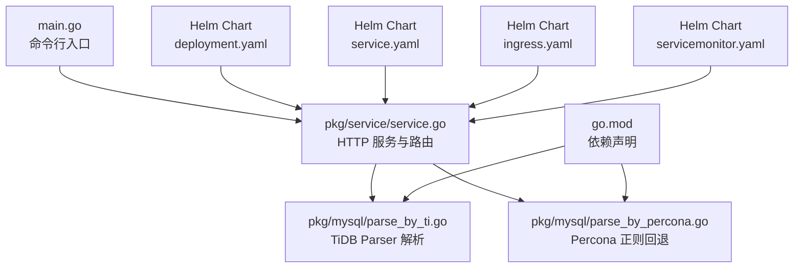
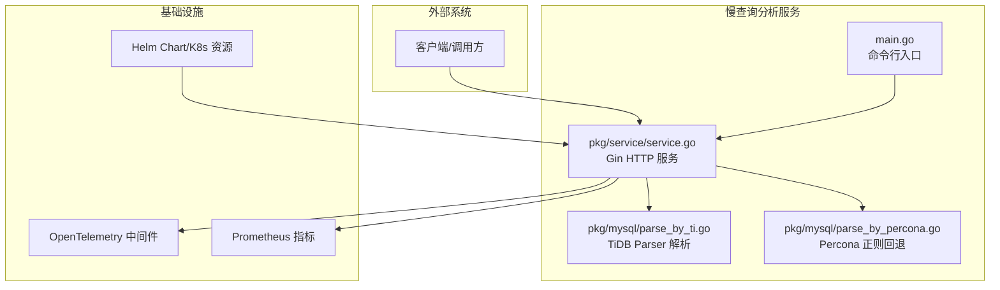
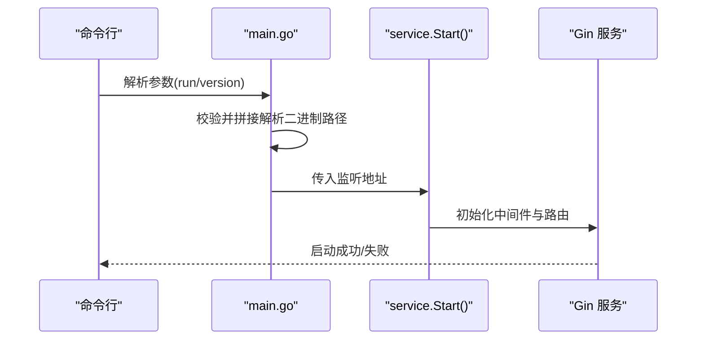
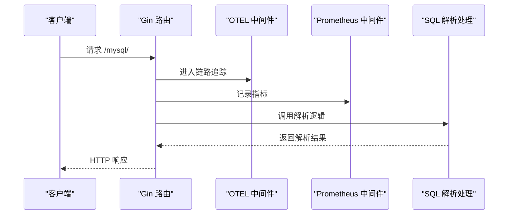
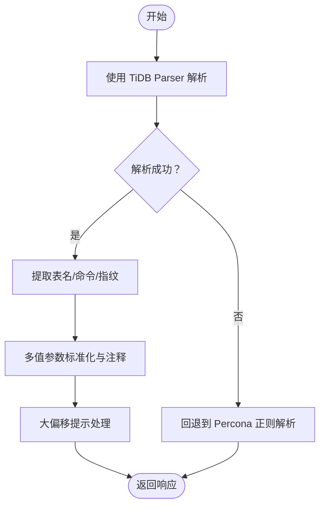
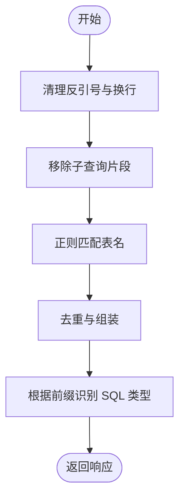
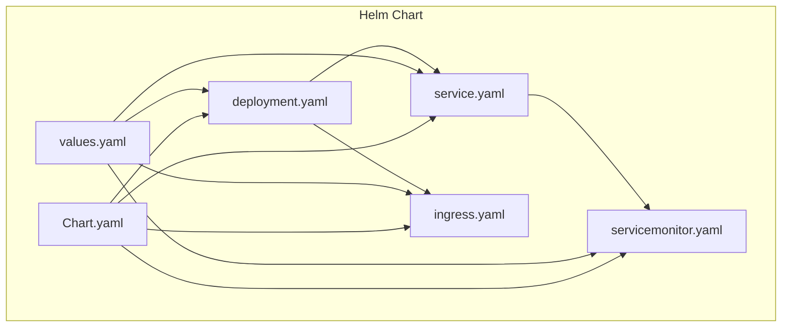
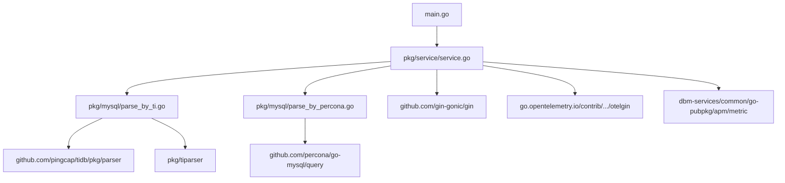

# 慢查询分析服务

<cite>
**本文引用的文件**
- [main.go](file://dbm-services/mysql/slow-query-parser-service/main.go)
- [service.go](file://dbm-services/mysql/slow-query-parser-service/pkg/service/service.go)
- [parse_by_ti.go](file://dbm-services/mysql/slow-query-parser-service/pkg/mysql/parse_by_ti.go)
- [parse_by_percona.go](file://dbm-services/mysql/slow-query-parser-service/pkg/mysql/parse_by_percona.go)
- [go.mod](file://dbm-services/mysql/slow-query-parser-service/go.mod)
- [README.md](file://dbm-services/mysql/slow-query-parser-service/README.md)
- [deployment.yaml](file://helm-charts/bk-dbm/charts/slow-query-parser-service/templates/deployment.yaml)
- [service.yaml](file://helm-charts/bk-dbm/charts/slow-query-parser-service/templates/service.yaml)
- [ingress.yaml](file://helm-charts/bk-dbm/charts/slow-query-parser-service/templates/ingress.yaml)
- [servicemonitor.yaml](file://helm-charts/bk-dbm/charts/slow-query-parser-service/templates/servicemonitor.yaml)
- [values.yaml](file://helm-charts/bk-dbm/charts/slow-query-parser-service/values.yaml)
- [Chart.yaml](file://helm-charts/bk-dbm/charts/slow-query-parser-service/Chart.yaml)
</cite>

## 目录
1. [简介](#简介)
2. [项目结构](#项目结构)
3. [核心组件](#核心组件)
4. [架构总览](#架构总览)
5. [详细组件分析](#详细组件分析)
6. [依赖关系分析](#依赖关系分析)
7. [性能考虑](#性能考虑)
8. [故障排查指南](#故障排查指南)
9. [结论](#结论)
10. [附录](#附录)

## 简介
慢查询分析服务是一个专门用于解析 MySQL 慢查询日志并提取 SQL 特征的服务。其核心能力包括：
- SQL 语句解析与指纹生成
- 表名提取与数据库名推断
- SQL 类型识别（如 SELECT、INSERT、UPDATE、DELETE 等）
- 多值参数标准化与大偏移提示
- 提供 HTTP 接口进行在线解析
- 集成 APM（链路追踪与指标）与 Prometheus 指标导出
- 支持容器化部署并通过 Helm Chart 管理

该服务优先使用 TiDB Parser 进行语法解析与指纹生成；当解析失败或 SQL 非法时，回退至 Percona Go-MySQL 库的正则解析策略，确保高兼容性。

## 项目结构
慢查询分析服务采用模块化组织，主要由以下部分组成：
- 可执行入口：命令行参数解析与服务启动
- HTTP 服务层：基于 Gin 框架，集成 APM 中间件与 Prometheus 指标
- SQL 解析层：基于 TiDB Parser 的首选解析，以及 Percona 正则回退方案
- Helm Chart：提供 K8s 部署清单与配置模板

**图表来源**
- [main.go:1-63](file://dbm-services/mysql/slow-query-parser-service/main.go#L1-L63)
- [service.go:1-39](file://dbm-services/mysql/slow-query-parser-service/pkg/service/service.go#L1-L39)
- [parse_by_ti.go:1-114](file://dbm-services/mysql/slow-query-parser-service/pkg/mysql/parse_by_ti.go#L1-L114)
- [parse_by_percona.go:1-198](file://dbm-services/mysql/slow-query-parser-service/pkg/mysql/parse_by_percona.go#L1-L198)
- [go.mod:1-60](file://dbm-services/mysql/slow-query-parser-service/go.mod#L1-L60)
- [deployment.yaml:1-38](file://helm-charts/bk-dbm/charts/slow-query-parser-service/templates/deployment.yaml#L1-L38)
- [service.yaml:1-15](file://helm-charts/bk-dbm/charts/slow-query-parser-service/templates/service.yaml#L1-L15)
- [ingress.yaml:1-39](file://helm-charts/bk-dbm/charts/slow-query-parser-service/templates/ingress.yaml#L1-L39)
- [servicemonitor.yaml:1-21](file://helm-charts/bk-dbm/charts/slow-query-parser-service/templates/servicemonitor.yaml#L1-L21)

**章节来源**
- [main.go:1-63](file://dbm-services/mysql/slow-query-parser-service/main.go#L1-L63)
- [service.go:1-39](file://dbm-services/mysql/slow-query-parser-service/pkg/service/service.go#L1-L39)
- [go.mod:1-60](file://dbm-services/mysql/slow-query-parser-service/go.mod#L1-L60)

## 核心组件
- 命令行入口与启动流程
  - 使用 kingpin 解析 run/version 子命令，支持通过环境变量配置监听地址与解析二进制路径
  - 初始化日志级别与默认处理器
  - 将解析二进制路径设置到全局配置并启动 HTTP 服务
- HTTP 服务层
  - 基于 Gin 构建，集成日志、恢复、OpenTelemetry 中间件与 Prometheus 指标导出
  - 注册解析路由与健康检查接口
- SQL 解析层
  - 首选 TiDB Parser：解析 AST、提取表名、生成规范化 SQL 与指纹、识别 SQL 类型
  - 回退 Percona 正则：对非法或复杂 SQL 使用正则提取指纹、表名与 SQL 类型
- Helm 部署
  - 提供 Deployment、Service、Ingress、ServiceMonitor 等标准 K8s 清单
  - 支持镜像仓库、端口、副本数、自动伸缩等配置

**章节来源**
- [main.go:21-62](file://dbm-services/mysql/slow-query-parser-service/main.go#L21-L62)
- [service.go:16-38](file://dbm-services/mysql/slow-query-parser-service/pkg/service/service.go#L16-L38)
- [parse_by_ti.go:42-114](file://dbm-services/mysql/slow-query-parser-service/pkg/mysql/parse_by_ti.go#L42-L114)
- [parse_by_percona.go:27-51](file://dbm-services/mysql/slow-query-parser-service/pkg/mysql/parse_by_percona.go#L27-L51)

## 架构总览
服务整体采用“入口 -> HTTP 服务 -> SQL 解析”的分层架构，结合 APM 与监控组件实现可观测性。

**图表来源**
- [main.go:43-61](file://dbm-services/mysql/slow-query-parser-service/main.go#L43-L61)
- [service.go:17-37](file://dbm-services/mysql/slow-query-parser-service/pkg/service/service.go#L17-L37)
- [parse_by_ti.go:46-113](file://dbm-services/mysql/slow-query-parser-service/pkg/mysql/parse_by_ti.go#L46-L113)
- [parse_by_percona.go:28-50](file://dbm-services/mysql/slow-query-parser-service/pkg/mysql/parse_by_percona.go#L28-L50)

## 详细组件分析

### 组件A：命令行入口与服务启动
- 功能要点
  - 定义 run 与 version 子命令，支持通过环境变量配置监听地址与解析二进制路径
  - 自动补齐相对路径为绝对路径，确保解析工具可用
  - 设置默认日志处理器，便于调试与生产观测
- 性能与可靠性
  - 参数校验与错误快速返回，避免无效启动
  - 日志包含源码位置，便于问题定位

**图表来源**
- [main.go:43-61](file://dbm-services/mysql/slow-query-parser-service/main.go#L43-L61)
- [service.go:17-37](file://dbm-services/mysql/slow-query-parser-service/pkg/service/service.go#L17-L37)

**章节来源**
- [main.go:21-62](file://dbm-services/mysql/slow-query-parser-service/main.go#L21-L62)

### 组件B：HTTP 服务与路由
- 功能要点
  - 使用 Gin 构建 HTTP 服务，集成日志、恢复、OpenTelemetry 与 Prometheus 中间件
  - 注册解析路由与 /ping 健康检查接口
- 性能与可靠性
  - 中间件顺序保证链路追踪与指标采集的完整性
  - 错误恢复中间件提升服务稳定性

**图表来源**
- [service.go:17-37](file://dbm-services/mysql/slow-query-parser-service/pkg/service/service.go#L17-L37)

**章节来源**
- [service.go:16-38](file://dbm-services/mysql/slow-query-parser-service/pkg/service/service.go#L16-L38)

### 组件C：SQL 解析（TiDB Parser 优先）
- 功能要点
  - 使用 TiDB Parser 解析 SQL，提取表名、生成规范化 SQL 与指纹
  - 对多值参数进行标准化与注释提示，避免指纹爆炸
  - 识别大偏移查询并在指纹中追加提示
  - 若解析失败，回退至 Percona 正则方案
- 性能与可靠性
  - AST 访客模式分离职责，提高可维护性
  - 多值参数替换策略兼顾可读性与指纹稳定性

**图表来源**
- [parse_by_ti.go:42-114](file://dbm-services/mysql/slow-query-parser-service/pkg/mysql/parse_by_ti.go#L42-L114)
- [parse_by_percona.go:27-51](file://dbm-services/mysql/slow-query-parser-service/pkg/mysql/parse_by_percona.go#L27-L51)

**章节来源**
- [parse_by_ti.go:42-114](file://dbm-services/mysql/slow-query-parser-service/pkg/mysql/parse_by_ti.go#L42-L114)

### 组件D：SQL 解析（Percona 正则回退）
- 功能要点
  - 使用正则提取指纹、表名与 SQL 类型
  - 对 FROM/JOIN 子查询进行预处理，减少误判
  - 限制表名提取数量，降低误报风险
- 性能与可靠性
  - 正则规则经过多次迭代，覆盖常见 SQL 形态
  - 通过长度截断与去重策略控制输出规模

**图表来源**
- [parse_by_percona.go:53-153](file://dbm-services/mysql/slow-query-parser-service/pkg/mysql/parse_by_percona.go#L53-L153)

**章节来源**
- [parse_by_percona.go:27-198](file://dbm-services/mysql/slow-query-parser-service/pkg/mysql/parse_by_percona.go#L27-L198)

### 组件E：部署与配置（Helm Chart）
- 功能要点
  - 提供 Deployment、Service、Ingress、ServiceMonitor 等资源模板
  - 支持镜像仓库、端口、副本数、自动伸缩等配置
  - 默认暴露 /metrics 指标端点，便于 Prometheus 抓取
- 性能与可靠性
  - HPA 模板支持 CPU/Memory 目标利用率
  - ServiceMonitor 与 Ingress 便于集成监控与网关

**图表来源**
- [deployment.yaml:1-38](file://helm-charts/bk-dbm/charts/slow-query-parser-service/templates/deployment.yaml#L1-L38)
- [service.yaml:1-15](file://helm-charts/bk-dbm/charts/slow-query-parser-service/templates/service.yaml#L1-L15)
- [ingress.yaml:1-39](file://helm-charts/bk-dbm/charts/slow-query-parser-service/templates/ingress.yaml#L1-L39)
- [servicemonitor.yaml:1-21](file://helm-charts/bk-dbm/charts/slow-query-parser-service/templates/servicemonitor.yaml#L1-L21)
- [values.yaml:1-58](file://helm-charts/bk-dbm/charts/slow-query-parser-service/values.yaml#L1-L58)
- [Chart.yaml:1-6](file://helm-charts/bk-dbm/charts/slow-query-parser-service/Chart.yaml#L1-L6)

**章节来源**
- [deployment.yaml:1-38](file://helm-charts/bk-dbm/charts/slow-query-parser-service/templates/deployment.yaml#L1-L38)
- [service.yaml:1-15](file://helm-charts/bk-dbm/charts/slow-query-parser-service/templates/service.yaml#L1-L15)
- [ingress.yaml:1-39](file://helm-charts/bk-dbm/charts/slow-query-parser-service/templates/ingress.yaml#L1-L39)
- [servicemonitor.yaml:1-21](file://helm-charts/bk-dbm/charts/slow-query-parser-service/templates/servicemonitor.yaml#L1-L21)
- [values.yaml:1-58](file://helm-charts/bk-dbm/charts/slow-query-parser-service/values.yaml#L1-L58)
- [Chart.yaml:1-6](file://helm-charts/bk-dbm/charts/slow-query-parser-service/Chart.yaml#L1-L6)

## 依赖关系分析
- 语言与框架
  - Go 1.24.2，使用 Gin 作为 Web 框架，OpenTelemetry 提供链路追踪与指标中间件
- SQL 解析依赖
  - TiDB Parser：用于语法解析、AST 访客与规范化 SQL 输出
  - Percona Go-MySQL：用于指纹生成与正则解析回退
- 监控与可观测性
  - Prometheus 指标导出中间件
  - ServiceMonitor 模板用于 Prometheus Operator 抓取

**图表来源**
- [go.mod:5-12](file://dbm-services/mysql/slow-query-parser-service/go.mod#L5-L12)
- [parse_by_ti.go:3-14](file://dbm-services/mysql/slow-query-parser-service/pkg/mysql/parse_by_ti.go#L3-L14)
- [parse_by_percona.go:13-20](file://dbm-services/mysql/slow-query-parser-service/pkg/mysql/parse_by_percona.go#L13-L20)
- [service.go:4-14](file://dbm-services/mysql/slow-query-parser-service/pkg/service/service.go#L4-L14)

**章节来源**
- [go.mod:1-60](file://dbm-services/mysql/slow-query-parser-service/go.mod#L1-L60)

## 性能考虑
- 解析性能
  - TiDB Parser 解析 AST 成本较高，建议对高频请求进行缓存或限流
  - 多值参数标准化策略在参数量极大时仍保持指纹稳定，避免缓存污染
- 网络与并发
  - Gin 默认并发模型适合中低并发场景；高并发建议配合 HPA 与水平扩展
  - 合理设置请求超时与连接池参数，避免阻塞
- 监控与观测
  - 开启 Prometheus 指标与 OpenTelemetry 追踪，定期评估延迟与错误率
  - 结合 ServiceMonitor 与 Ingress 控制流量入口

## 故障排查指南
- 常见问题
  - 解析二进制路径错误：确认通过环境变量或命令行传入的路径为绝对路径
  - SQL 非法导致解析失败：服务会自动回退到 Percona 正则解析，若仍失败请检查 SQL 格式
  - 端口占用：检查监听地址是否被占用，或调整端口
- 排查步骤
  - 查看服务日志（包含源码位置），定位错误发生点
  - 使用 /ping 健康检查接口验证服务状态
  - 在高负载场景下启用 HPA 并观察指标变化

**章节来源**
- [main.go:32-41](file://dbm-services/mysql/slow-query-parser-service/main.go#L32-L41)
- [service.go:33-35](file://dbm-services/mysql/slow-query-parser-service/pkg/service/service.go#L33-L35)
- [parse_by_ti.go:48-51](file://dbm-services/mysql/slow-query-parser-service/pkg/mysql/parse_by_ti.go#L48-L51)

## 结论
慢查询分析服务通过“TiDB Parser 优先 + Percona 正则回退”的双引擎设计，在保证解析准确性的同时提升了兼容性与鲁棒性。结合 Gin 中间件与 Prometheus/OTEL 的可观测性能力，能够满足生产环境对性能与可运维性的要求。配合 Helm Chart 可实现快速部署与弹性伸缩，适用于大规模数据库集群的慢查询治理场景。

## 附录

### A. 配置与环境变量
- 监听地址：通过命令行参数或环境变量配置
- 解析二进制路径：通过命令行参数或环境变量配置，支持相对路径自动补齐为绝对路径

**章节来源**
- [main.go:24-27](file://dbm-services/mysql/slow-query-parser-service/main.go#L24-L27)
- [main.go:51-55](file://dbm-services/mysql/slow-query-parser-service/main.go#L51-L55)

### B. API 使用示例
- 健康检查：GET /ping
- SQL 解析：POST /mysql/（请求体包含 content 与 db 字段）

**章节来源**
- [service.go:33-35](file://dbm-services/mysql/slow-query-parser-service/pkg/service/service.go#L33-L35)
- [README.md:12-20](file://dbm-services/mysql/slow-query-parser-service/README.md#L12-L20)

### C. 部署与安装
- 容器运行：通过 Docker 指定监听地址与解析二进制路径
- K8s 部署：使用 Helm Chart，配置镜像、端口、副本数与自动伸缩

**章节来源**
- [README.md:2](file://dbm-services/mysql/slow-query-parser-service/README.md#L2)
- [deployment.yaml:34-38](file://helm-charts/bk-dbm/charts/slow-query-parser-service/templates/deployment.yaml#L34-L38)
- [values.yaml:7-12](file://helm-charts/bk-dbm/charts/slow-query-parser-service/values.yaml#L7-L12)