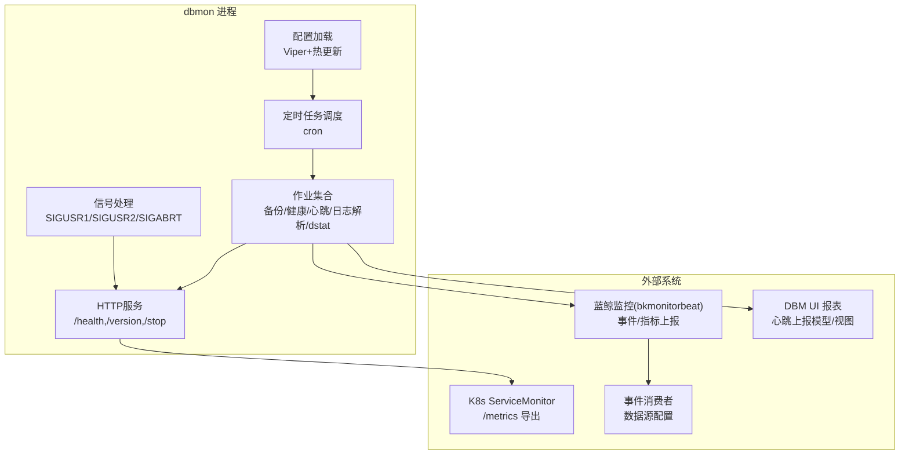
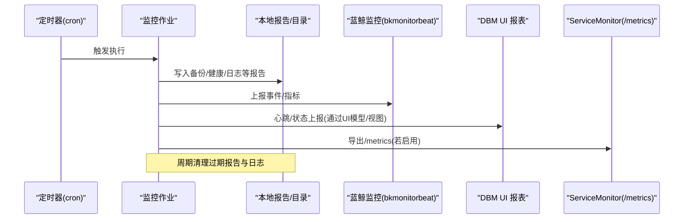
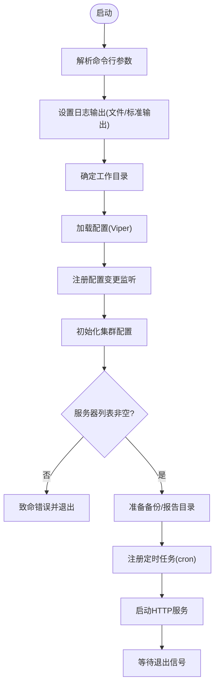
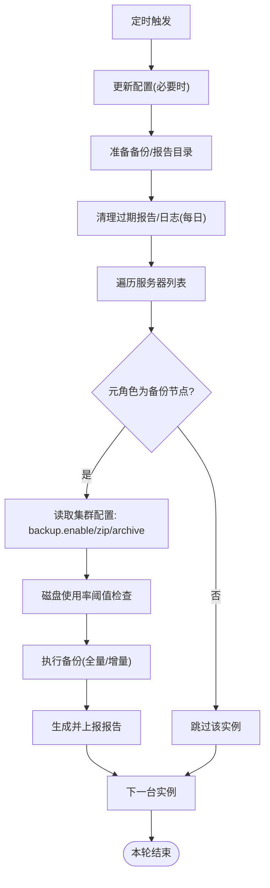
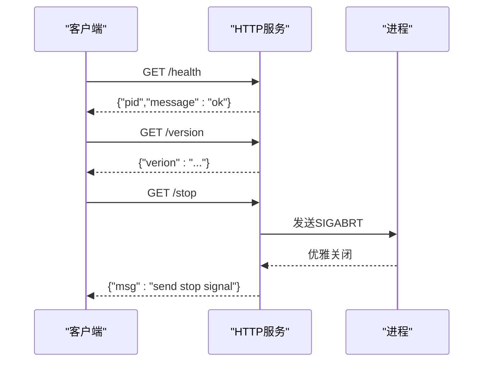
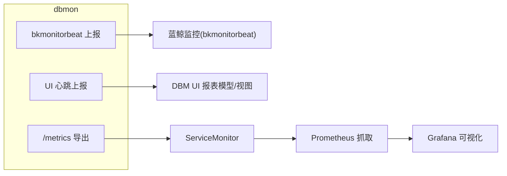
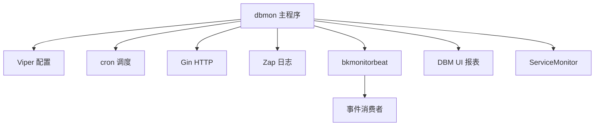

# 监控工具

<cite>
**本文引用的文件**
- [dbmon-config.yaml](file://dbm-services/mongodb/db-tools/dbmon/dbmon-config.yaml)
- [main.go](file://dbm-services/mongodb/db-tools/dbmon/main.go)
- [root.go](file://dbm-services/mongodb/db-tools/dbmon/cmd/root.go)
- [dbmon_config.go](file://dbm-services/mongodb/db-tools/dbmon/config/dbmon_config.go)
- [backup_job.go](file://dbm-services/mongodb/db-tools/dbmon/cmd/backupjob/backup_job.go)
- [httpapi.go](file://dbm-services/mongodb/db-tools/dbmon/pkg/httpapi/httpapi.go)
- [bkmonitorbeat.go](file://dbm-services/mongodb/db-tools/dbmon/pkg/sendwarning/bkmonitorbeat.go)
- [dbmon_heartbeat_report.py](file://dbm-ui/backend/db_report/models/dbmon_heartbeat_report.py)
- [dbmon_heartbeat_view.py](file://dbm-ui/backend/db_report/views/redis/dbmon_heartbeat_view.py)
- [redis_cluster_standardize.py](file://dbm-ui/backend/ticket/builders/redis/redis_cluster_standardize.py)
- [servicemonitor.yaml](file://helm-charts/bk-dbm/charts/db-dbha/templates/servicemonitor.yaml)
- [db-event-consumer-configmap.yaml](file://helm-charts/bk-dbm/templates/configmaps/db-event-consumer-configmap.yaml)
- [readme.md](file://readme.md)
</cite>

## 目录
1. [简介](#简介)
2. [项目结构](#项目结构)
3. [核心组件](#核心组件)
4. [架构总览](#架构总览)
5. [详细组件分析](#详细组件分析)
6. [依赖关系分析](#依赖关系分析)
7. [性能考量](#性能考量)
8. [故障排查指南](#故障排查指南)
9. [结论](#结论)
10. [附录](#附录)

## 简介
本文件面向DBM监控工具，系统性梳理dbmon监控组件（当前以MongoDB为主）的采集机制、指标与告警、可视化与存储、部署与集成、性能优化与故障诊断。文档同时覆盖与DBM其他组件（如UI报表、事件消费者、Kubernetes ServiceMonitor）的数据流转与集成方式，帮助读者快速理解并落地监控方案。

## 项目结构
- dbmon作为MongoDB侧的本地监控守护进程，负责定时任务调度、备份与健康检查、日志解析、dstat采集、HTTP接口暴露与信号控制。
- 配置通过Viper加载并支持热更新；日志采用旋转日志与标准输出两种模式；支持SIGUSR1/SIGUSR2/SIGABRT信号进行动态日志级别切换与优雅退出。
- 与UI侧心跳上报、事件消费者、K8s ServiceMonitor等形成闭环，实现从采集到上报、存储、查询与可视化的全链路监控。

图表来源
- [root.go:127-208](file://dbm-services/mongodb/db-tools/dbmon/cmd/root.go#L127-L208)
- [httpapi.go:47-77](file://dbm-services/mongodb/db-tools/dbmon/pkg/httpapi/httpapi.go#L47-L77)
- [dbmon-config.yaml:1-31](file://dbm-services/mongodb/db-tools/dbmon/dbmon-config.yaml#L1-L31)
- [servicemonitor.yaml:1-21](file://helm-charts/bk-dbm/charts/db-dbha/templates/servicemonitor.yaml#L1-L21)
- [db-event-consumer-configmap.yaml:28-65](file://helm-charts/bk-dbm/templates/configmaps/db-event-consumer-configmap.yaml#L28-L65)

章节来源
- [readme.md:9-21](file://readme.md#L9-L21)

## 核心组件
- 配置管理：支持配置文件读取、热更新与写回，提供配置副本获取与默认值设置。
- 作业调度：基于cron的定时任务，包含备份、健康检查、心跳、日志解析、dstat采集。
- HTTP服务：提供健康检查、版本查询、优雅停止接口。
- 信号处理：支持动态日志级别切换与优雅退出。
- 上报通道：对接蓝鲸监控(bkmonitorbeat)事件/指标上报；与UI心跳上报模型配合；K8s导出/metrics供Prometheus抓取。

章节来源
- [dbmon_config.go:32-88](file://dbm-services/mongodb/db-tools/dbmon/config/dbmon_config.go#L32-L88)
- [root.go:127-208](file://dbm-services/mongodb/db-tools/dbmon/cmd/root.go#L127-L208)
- [httpapi.go:47-77](file://dbm-services/mongodb/db-tools/dbmon/pkg/httpapi/httpapi.go#L47-L77)

## 架构总览
dbmon在各数据库组件侧作为“本地采集器”，统一通过配置驱动作业执行，将结果写入本地报告目录或直接上报至蓝鲸监控。UI侧通过报表模型与视图接收心跳与状态数据，K8s侧通过ServiceMonitor暴露/metrics供Prometheus抓取。

图表来源
- [backup_job.go:55-123](file://dbm-services/mongodb/db-tools/dbmon/cmd/backupjob/backup_job.go#L55-L123)
- [httpapi.go:47-77](file://dbm-services/mongodb/db-tools/dbmon/pkg/httpapi/httpapi.go#L47-L77)
- [bkmonitorbeat.go:1-50](file://dbm-services/mongodb/db-tools/dbmon/pkg/sendwarning/bkmonitorbeat.go#L1-L50)
- [servicemonitor.yaml:1-21](file://helm-charts/bk-dbm/charts/db-dbha/templates/servicemonitor.yaml#L1-L21)

## 详细组件分析

### 配置与初始化
- 配置文件读取与热更新：通过Viper加载yaml配置，支持OnConfigChange回调自动重载，设置默认值并记录加载次数。
- 初始化顺序：解析命令行参数、选择日志输出方式、定位工作目录、加载配置与集群配置、校验服务器列表与集群类型、准备备份目录、注册定时任务与HTTP服务。
- 非root限制：禁止以root用户运行，提升安全性。

图表来源
- [root.go:87-125](file://dbm-services/mongodb/db-tools/dbmon/cmd/root.go#L87-L125)
- [root.go:127-208](file://dbm-services/mongodb/db-tools/dbmon/cmd/root.go#L127-L208)
- [dbmon_config.go:32-88](file://dbm-services/mongodb/db-tools/dbmon/config/dbmon_config.go#L32-L88)

章节来源
- [root.go:87-125](file://dbm-services/mongodb/db-tools/dbmon/cmd/root.go#L87-L125)
- [dbmon_config.go:32-88](file://dbm-services/mongodb/db-tools/dbmon/config/dbmon_config.go#L32-L88)

### 作业调度与执行
- 作业类型：备份、健康检查、心跳、日志解析、dstat采集。
- 调度策略：每分钟执行多项任务，部分任务带“跳过仍在运行”保护链，避免重叠执行。
- 备份策略：按实例元角色筛选备份节点，结合集群配置开关与磁盘阈值，决定是否执行全量/增量备份，并清理过期报告与日志。

图表来源
- [root.go:176-199](file://dbm-services/mongodb/db-tools/dbmon/cmd/root.go#L176-L199)
- [backup_job.go:55-123](file://dbm-services/mongodb/db-tools/dbmon/cmd/backupjob/backup_job.go#L55-L123)
- [backup_job.go:125-164](file://dbm-services/mongodb/db-tools/dbmon/cmd/backupjob/backup_job.go#L125-L164)
- [backup_job.go:189-225](file://dbm-services/mongodb/db-tools/dbmon/cmd/backupjob/backup_job.go#L189-L225)
- [backup_job.go:242-279](file://dbm-services/mongodb/db-tools/dbmon/cmd/backupjob/backup_job.go#L242-L279)

章节来源
- [root.go:176-199](file://dbm-services/mongodb/db-tools/dbmon/cmd/root.go#L176-L199)
- [backup_job.go:55-123](file://dbm-services/mongodb/db-tools/dbmon/cmd/backupjob/backup_job.go#L55-L123)

### HTTP服务与信号控制
- HTTP接口：/health返回进程状态，/version返回版本，/stop发送SIGABRT触发优雅退出。
- 信号处理：SIGUSR1/SIGABRT用于取消上下文（触发退出），SIGUSR2用于切换日志级别。
- pprof内置但注释掉，便于调试。

图表来源
- [httpapi.go:22-45](file://dbm-services/mongodb/db-tools/dbmon/pkg/httpapi/httpapi.go#L22-L45)
- [httpapi.go:47-77](file://dbm-services/mongodb/db-tools/dbmon/pkg/httpapi/httpapi.go#L47-L77)
- [root.go:229-258](file://dbm-services/mongodb/db-tools/dbmon/cmd/root.go#L229-L258)

章节来源
- [httpapi.go:22-45](file://dbm-services/mongodb/db-tools/dbmon/pkg/httpapi/httpapi.go#L22-L45)
- [root.go:229-258](file://dbm-services/mongodb/db-tools/dbmon/cmd/root.go#L229-L258)

### 上报与可视化
- 蓝鲸监控上报：通过bkmonitorbeat事件/指标通道上报，配置包含data_id/token与Agent地址、插件路径。
- UI心跳上报：DBM UI侧有专门的心跳上报模型与视图，dbmon可配合上报心跳数据。
- K8s ServiceMonitor：导出/metrics供Prometheus抓取，便于在Grafana等面板中可视化。

图表来源
- [dbmon-config.yaml:5-13](file://dbm-services/mongodb/db-tools/dbmon/dbmon-config.yaml#L5-L13)
- [bkmonitorbeat.go:1-50](file://dbm-services/mongodb/db-tools/dbmon/pkg/sendwarning/bkmonitorbeat.go#L1-L50)
- [dbmon_heartbeat_report.py:1-120](file://dbm-ui/backend/db_report/models/dbmon_heartbeat_report.py#L1-L120)
- [dbmon_heartbeat_view.py:1-120](file://dbm-ui/backend/db_report/views/redis/dbmon_heartbeat_view.py#L1-L120)
- [servicemonitor.yaml:1-21](file://helm-charts/bk-dbm/charts/db-dbha/templates/servicemonitor.yaml#L1-L21)

章节来源
- [dbmon-config.yaml:5-13](file://dbm-services/mongodb/db-tools/dbmon/dbmon-config.yaml#L5-L13)
- [bkmonitorbeat.go:1-50](file://dbm-services/mongodb/db-tools/dbmon/pkg/sendwarning/bkmonitorbeat.go#L1-L50)
- [dbmon_heartbeat_report.py:1-120](file://dbm-ui/backend/db_report/models/dbmon_heartbeat_report.py#L1-L120)
- [dbmon_heartbeat_view.py:1-120](file://dbm-ui/backend/db_report/views/redis/dbmon_heartbeat_view.py#L1-L120)
- [servicemonitor.yaml:1-21](file://helm-charts/bk-dbm/charts/db-dbha/templates/servicemonitor.yaml#L1-L21)

### 部署与集成要点
- 配置文件：dbmon-config.yaml包含上报目录、保留天数、上报目标、HTTP监听地址、bkmonitorbeat参数、服务器列表等。
- 事件消费者数据源：db-event-consumer-configmap.yaml定义了多个数据源（MySQL/Doris等）与sinkers配置，dbmon可与之协同完成事件/指标落库与转发。
- Redis场景：UI侧存在针对Redis集群重新安装dbmon的工单流程，体现dbmon在Redis侧的部署与替换流程。

章节来源
- [dbmon-config.yaml:1-31](file://dbm-services/mongodb/db-tools/dbmon/dbmon-config.yaml#L1-L31)
- [db-event-consumer-configmap.yaml:28-65](file://helm-charts/bk-dbm/templates/configmaps/db-event-consumer-configmap.yaml#L28-L65)
- [redis_cluster_standardize.py:28-37](file://dbm-ui/backend/ticket/builders/redis/redis_cluster_standardize.py#L28-L37)

## 依赖关系分析
- 组件内聚：dbmon内部通过配置驱动作业，作业间低耦合，便于扩展新任务。
- 外部依赖：Viper用于配置管理；cron用于调度；Gin用于HTTP；Zap用于日志；bkmonitorbeat用于上报；UI与事件消费者用于数据汇聚与持久化。
- 集成点：dbmon通过HTTP接口与K8s ServiceMonitor集成；通过bkmonitorbeat与蓝鲸监控集成；通过UI模型/视图与前端报表集成。

图表来源
- [root.go:127-208](file://dbm-services/mongodb/db-tools/dbmon/cmd/root.go#L127-L208)
- [httpapi.go:47-77](file://dbm-services/mongodb/db-tools/dbmon/pkg/httpapi/httpapi.go#L47-L77)
- [dbmon-config.yaml:5-13](file://dbm-services/mongodb/db-tools/dbmon/dbmon-config.yaml#L5-L13)

## 性能考量
- CPU亲和与并发：根据CPU核数调整GOMAXPROCS，避免大核机器上过度并发导致资源争用。
- IO与清理：定期清理过期报告与日志，避免磁盘膨胀影响IO性能。
- 并行备份：支持按集合并行备份，但对上限做了约束，避免过度并发。
- 日志轮转：建议生产环境使用文件日志轮转，减少stdout压力。

章节来源
- [main.go:13-21](file://dbm-services/mongodb/db-tools/dbmon/main.go#L13-L21)
- [backup_job.go:135-142](file://dbm-services/mongodb/db-tools/dbmon/cmd/backupjob/backup_job.go#L135-L142)
- [backup_job.go:189-225](file://dbm-services/mongodb/db-tools/dbmon/cmd/backupjob/backup_job.go#L189-L225)

## 故障排查指南
- 健康检查：访问/health确认进程存活；/version确认版本；/stop触发优雅退出。
- 日志级别切换：发送SIGUSR2切换日志级别；SIGUSR1/SIGABRT触发退出。
- 配置热更新：修改配置文件后观察日志中的重载提示；若异常，检查配置格式与字段。
- 备份失败：检查备份目录权限、磁盘使用率阈值、集群配置开关；关注过期报告清理是否误删。
- 上报异常：检查bkmonitorbeat配置（data_id/token）、Agent路径与插件路径；确认网络可达性。
- UI心跳：确认心跳上报模型与视图正常；核对上报频率与字段映射。
- K8s导出：确认ServiceMonitor配置与抓取间隔；核对/metrics端点可用性。

章节来源
- [httpapi.go:22-45](file://dbm-services/mongodb/db-tools/dbmon/pkg/httpapi/httpapi.go#L22-L45)
- [root.go:229-258](file://dbm-services/mongodb/db-tools/dbmon/cmd/root.go#L229-L258)
- [dbmon_config.go:32-58](file://dbm-services/mongodb/db-tools/dbmon/config/dbmon_config.go#L32-L58)
- [backup_job.go:189-225](file://dbm-services/mongodb/db-tools/dbmon/cmd/backupjob/backup_job.go#L189-L225)
- [dbmon-config.yaml:5-13](file://dbm-services/mongodb/db-tools/dbmon/dbmon-config.yaml#L5-L13)
- [servicemonitor.yaml:1-21](file://helm-charts/bk-dbm/charts/db-dbha/templates/servicemonitor.yaml#L1-L21)

## 结论
dbmon作为DBM监控体系中的本地采集器，围绕配置驱动与定时任务构建了稳定可靠的监控闭环。通过与蓝鲸监控、UI报表、K8s ServiceMonitor的协同，实现了从采集、上报、存储到可视化的全链路能力。建议在生产环境中结合磁盘清理、日志轮转与合理的并行度策略，持续优化性能与稳定性。

## 附录
- 配置示例与关键字段参考：dbmon-config.yaml
- 事件消费者数据源与上报配置：db-event-consumer-configmap.yaml
- Redis侧dbmon重新安装流程：redis_cluster_standardize.py

章节来源
- [dbmon-config.yaml:1-31](file://dbm-services/mongodb/db-tools/dbmon/dbmon-config.yaml#L1-L31)
- [db-event-consumer-configmap.yaml:28-65](file://helm-charts/bk-dbm/templates/configmaps/db-event-consumer-configmap.yaml#L28-L65)
- [redis_cluster_standardize.py:28-37](file://dbm-ui/backend/ticket/builders/redis/redis_cluster_standardize.py#L28-L37)