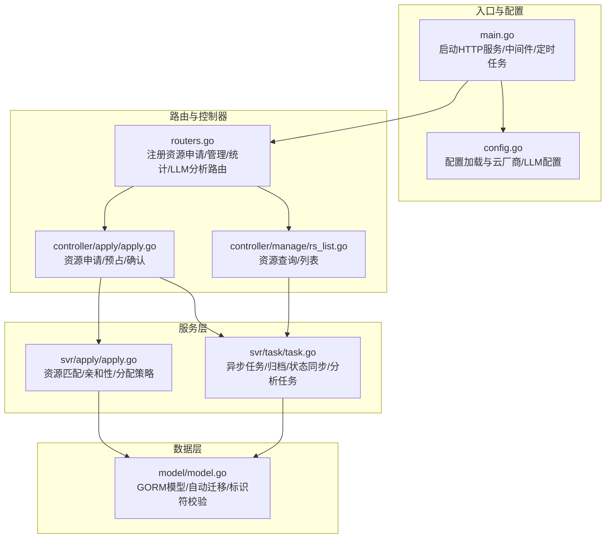
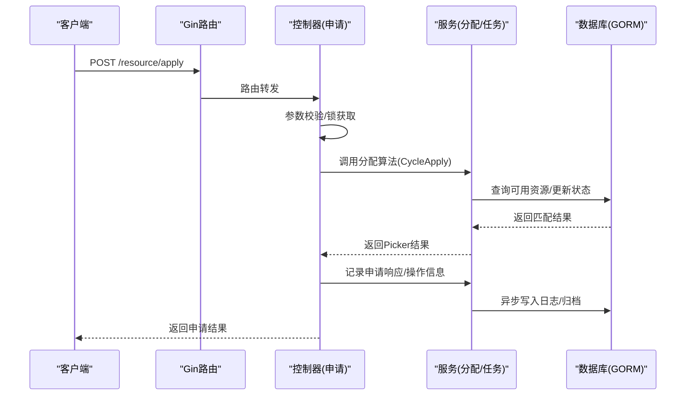
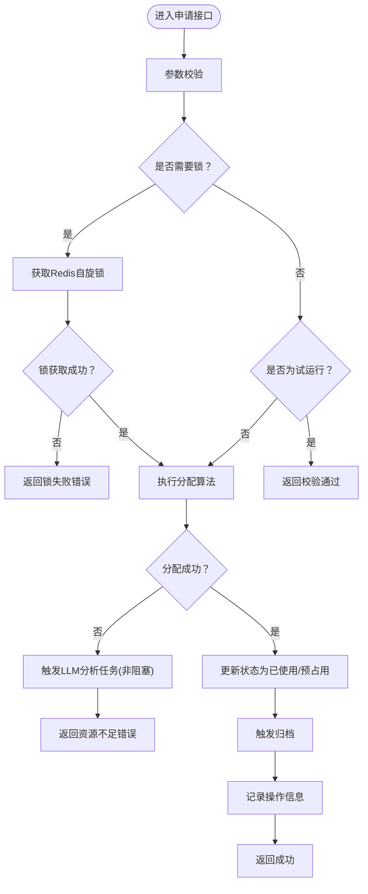
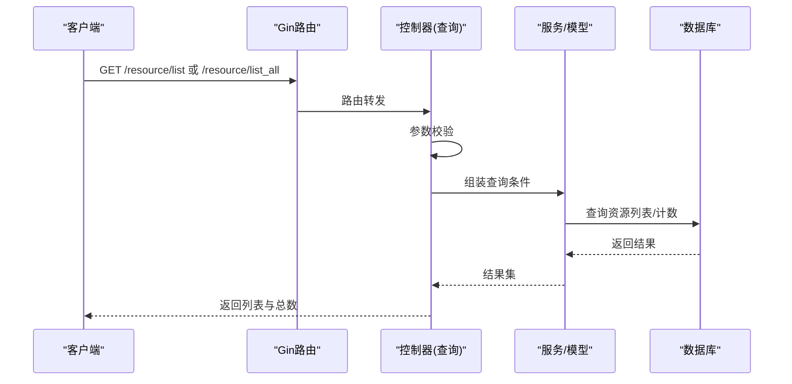
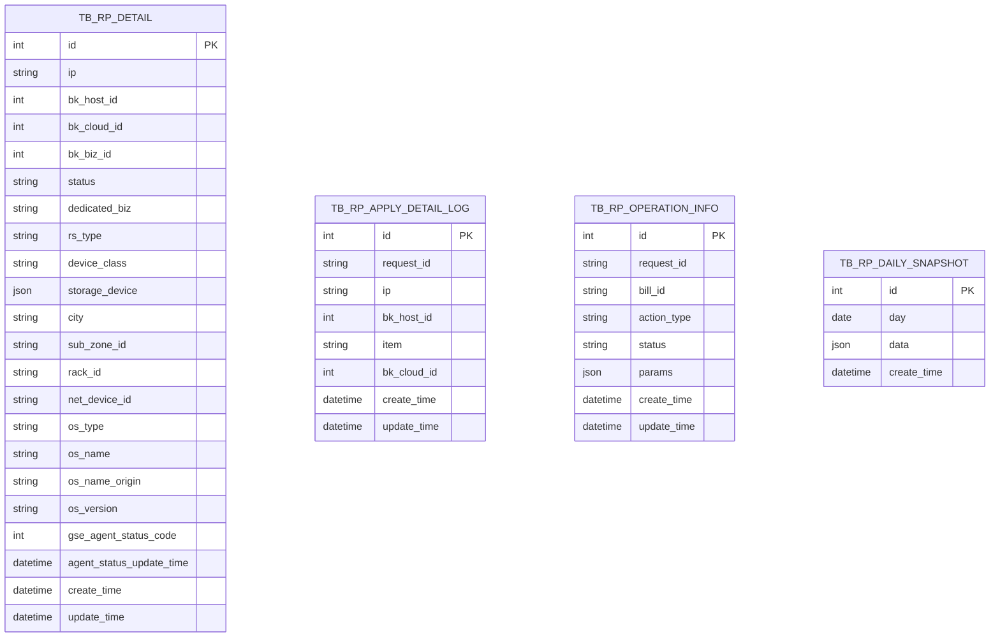
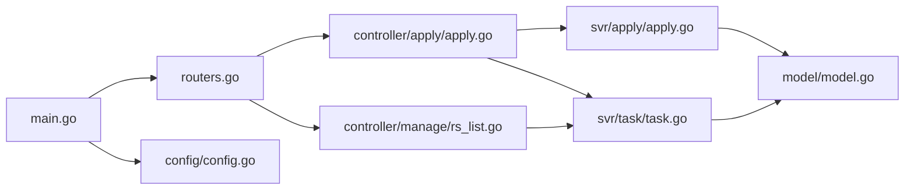

# 资源管理工具

<cite>
**本文引用的文件**
- [main.go](file://dbm-services/common/db-resource/main.go)
- [go.mod](file://dbm-services/common/db-resource/go.mod)
- [README.md](file://dbm-services/common/db-resource/README.md)
- [config.go](file://dbm-services/common/db-resource/internal/config/config.go)
- [model.go](file://dbm-services/common/db-resource/internal/model/model.go)
- [routers.go](file://dbm-services/common/db-resource/internal/routers/routers.go)
- [apply.go](file://dbm-services/common/db-resource/internal/controller/apply/apply.go)
- [apply.go](file://dbm-services/common/db-resource/internal/svr/apply/apply.go)
- [task.go](file://dbm-services/common/db-resource/internal/svr/task/task.go)
- [rs_list.go](file://dbm-services/common/db-resource/internal/controller/manage/rs_list.go)
</cite>

## 目录
1. [简介](#简介)
2. [项目结构](#项目结构)
3. [核心组件](#核心组件)
4. [架构总览](#架构总览)
5. [详细组件分析](#详细组件分析)
6. [依赖分析](#依赖分析)
7. [性能考虑](#性能考虑)
8. [故障排查指南](#故障排查指南)
9. [结论](#结论)
10. [附录](#附录)

## 简介
本文件面向DBM资源管理工具（db-resource），系统性阐述其功能、架构与实现细节，覆盖资源申请、分配、回收与监控机制；解释资源类型、资源池管理、租户隔离与配额控制；梳理API接口、数据模型与业务流程；并给出最佳实践、性能优化与故障处理建议，以及与DBM其他组件的集成与数据同步机制。

## 项目结构
db-resource是一个基于Gin的Go微服务，负责DBM资源池的统一管理与调度。核心模块包括：
- 入口与路由：main.go注册中间件、路由与定时任务
- 配置中心：internal/config 提供运行配置加载与云厂商证书、LLM分析配置
- 数据模型：internal/model 基于GORM的资源表结构与自动迁移
- 控制器层：internal/controller 提供资源申请、管理、统计等接口
- 服务层：internal/svr 实现资源分配算法、任务队列、与CMDB/GSE等外部系统交互
- 路由注册：internal/routers 统一注册各控制器路由

图表来源
- [main.go:46-124](file://dbm-services/common/db-resource/main.go#L46-L124)
- [config.go:118-132](file://dbm-services/common/db-resource/internal/config/config.go#L118-L132)
- [routers.go:26-55](file://dbm-services/common/db-resource/internal/routers/routers.go#L26-L55)
- [apply.go:136-223](file://dbm-services/common/db-resource/internal/controller/apply/apply.go#L136-L223)
- [apply.go:234-297](file://dbm-services/common/db-resource/internal/svr/apply/apply.go#L234-L297)
- [task.go:61-124](file://dbm-services/common/db-resource/internal/svr/task/task.go#L61-L124)
- [model.go:47-124](file://dbm-services/common/db-resource/internal/model/model.go#L47-L124)

章节来源
- [main.go:46-124](file://dbm-services/common/db-resource/main.go#L46-L124)
- [go.mod:1-94](file://dbm-services/common/db-resource/go.mod#L1-L94)
- [README.md:1-2](file://dbm-services/common/db-resource/README.md#L1-L2)

## 核心组件
- 应用入口与生命周期
  - Gin引擎初始化、安全头、请求体大小限制、日志中间件、OTEL链路追踪与Prometheus指标
  - HTTP服务器配置（超时、最大头部）
  - 优雅关闭信号处理
- 配置中心
  - 支持YAML配置文件加载，包含数据库、日志、Redis、蓝鲸API、云证书、Yunti配置、LLM配置等
- 数据模型
  - 自动迁移资源相关表（操作日志、分析结果、归档明细、申请明细、状态变更、每日快照）
  - 标识符安全校验，防止注入风险
- 控制器
  - 资源申请：支持普通申请、预申请、确认占用
  - 资源管理：按多维条件查询资源列表、OS名称枚举
- 服务层
  - 资源分配：多维度匹配（规格、存储、标签、位置、亲和性）、跨园区/跨机架策略
  - 任务队列：异步记录申请响应、归档资源、记录操作信息、同步GSE状态、执行LLM分析任务
- 路由注册
  - 统一注册资源申请、资源管理、后台统计、水位线、LLM分析等路由

章节来源
- [main.go:46-124](file://dbm-services/common/db-resource/main.go#L46-L124)
- [config.go:23-132](file://dbm-services/common/db-resource/internal/config/config.go#L23-L132)
- [model.go:47-124](file://dbm-services/common/db-resource/internal/model/model.go#L47-L124)
- [routers.go:26-55](file://dbm-services/common/db-resource/internal/routers/routers.go#L26-L55)
- [apply.go:136-223](file://dbm-services/common/db-resource/internal/controller/apply/apply.go#L136-L223)
- [apply.go:234-297](file://dbm-services/common/db-resource/internal/svr/apply/apply.go#L234-L297)
- [task.go:61-124](file://dbm-services/common/db-resource/internal/svr/task/task.go#L61-L124)

## 架构总览
db-resource采用“控制器-服务-数据层”三层架构，配合异步通道与定时任务，实现高并发下的资源申请与状态同步。核心交互如下：

图表来源
- [routers.go:26-55](file://dbm-services/common/db-resource/internal/routers/routers.go#L26-L55)
- [apply.go:136-223](file://dbm-services/common/db-resource/internal/controller/apply/apply.go#L136-L223)
- [apply.go:234-297](file://dbm-services/common/db-resource/internal/svr/apply/apply.go#L234-L297)
- [task.go:61-124](file://dbm-services/common/db-resource/internal/svr/task/task.go#L61-L124)
- [model.go:47-124](file://dbm-services/common/db-resource/internal/model/model.go#L47-L124)

## 详细组件分析

### 资源申请流程（申请/预占/确认）
- 申请接口
  - 普通申请：直接占用资源，状态置为已使用
  - 预申请：仅锁定资源，状态置为预占用
  - 确认占用：根据请求ID校验并批量更新为已使用，并触发归档
- 锁机制
  - 使用Redis自旋锁，避免并发冲突
  - 失败回滚：异常时回滚已锁定实例
- 分配策略
  - 支持多种亲和性策略（同园区、跨园区强/弱、跨机架、最大均分等）
  - 多维度匹配：CPU/内存/机型、存储挂载点/容量/类型、标签、城市/子园区/机架/网卡、专用业务/公共业务
- 异步处理
  - 申请响应写入通道，异步落库
  - 归档资源通道，批量归档
  - 记录操作信息通道
  - 触发LLM分析任务（非阻塞）

图表来源
- [apply.go:136-223](file://dbm-services/common/db-resource/internal/controller/apply/apply.go#L136-L223)
- [apply.go:234-297](file://dbm-services/common/db-resource/internal/svr/apply/apply.go#L234-L297)
- [task.go:61-124](file://dbm-services/common/db-resource/internal/svr/task/task.go#L61-L124)

章节来源
- [apply.go:136-223](file://dbm-services/common/db-resource/internal/controller/apply/apply.go#L136-L223)
- [apply.go:234-297](file://dbm-services/common/db-resource/internal/svr/apply/apply.go#L234-L297)
- [task.go:61-124](file://dbm-services/common/db-resource/internal/svr/task/task.go#L61-L124)

### 资源查询与管理
- 列表查询
  - 支持按业务、资源类型、城市、子园区、机型、标签、主机IP、云区域、存储规格、OS类型/名称、GSE状态、创建时间等过滤
  - 支持分页与排序
- 全量查询
  - 查询当前未使用/预占用/已预选状态的资源
- OS名称枚举
  - 返回所有已登记的操作系统名称

图表来源
- [routers.go:26-55](file://dbm-services/common/db-resource/internal/routers/routers.go#L26-L55)
- [rs_list.go:61-91](file://dbm-services/common/db-resource/internal/controller/manage/rs_list.go#L61-L91)
- [rs_list.go:263-280](file://dbm-services/common/db-resource/internal/controller/manage/rs_list.go#L263-L280)
- [rs_list.go:282-299](file://dbm-services/common/db-resource/internal/controller/manage/rs_list.go#L282-L299)

章节来源
- [rs_list.go:61-91](file://dbm-services/common/db-resource/internal/controller/manage/rs_list.go#L61-L91)
- [rs_list.go:263-280](file://dbm-services/common/db-resource/internal/controller/manage/rs_list.go#L263-L280)
- [rs_list.go:282-299](file://dbm-services/common/db-resource/internal/controller/manage/rs_list.go#L282-L299)

### 数据模型与资源池管理
- 表结构与迁移
  - 自动迁移：请求日志、分析结果、归档明细、申请明细、状态变更、每日快照
  - 标识符安全校验：数据库名、表名等标识符合法性检查
- 资源池字段要点
  - 状态：未使用、预占用、已预选、已使用
  - 亲和性：跨园区/跨机架/同园区等策略
  - 属性：CPU/内存/机型、存储挂载点/容量/类型、标签、城市/子园区/机架/网卡、OS类型/名称、GSE状态
- 租户隔离与配额
  - 专用业务字段用于区分公共资源与专用资源
  - 通过业务ID与标签实现资源隔离
  - 配额控制通过分配算法与状态约束实现（例如预占用阶段不计入使用）

图表来源
- [model.go:47-124](file://dbm-services/common/db-resource/internal/model/model.go#L47-L124)

章节来源
- [model.go:47-124](file://dbm-services/common/db-resource/internal/model/model.go#L47-L124)

### API接口清单
- 资源申请
  - POST /resource/apply：普通申请
  - POST /resource/pre-apply：预申请
  - POST /resource/confirm/apply：确认占用
- 资源查询
  - GET /resource/list：按条件查询资源列表
  - GET /resource/list_all：查询当前未使用/预占用/已预选资源
  - GET /resource/os_names：查询所有OS名称
- 统计与监控
  - 注册了统计与水位线相关路由（具体实现由对应控制器处理）
- LLM智能分析
  - 注册了分析路由，支持异步触发分析任务

章节来源
- [routers.go:26-55](file://dbm-services/common/db-resource/internal/routers/routers.go#L26-L55)
- [apply.go:136-223](file://dbm-services/common/db-resource/internal/controller/apply/apply.go#L136-L223)
- [rs_list.go:61-91](file://dbm-services/common/db-resource/internal/controller/manage/rs_list.go#L61-L91)

### 任务与定时机制
- 异步任务通道
  - 申请响应日志、归档资源、记录操作信息、同步GSE状态、LLM分析任务
- 定时任务
  - 定时更新GSE状态
  - 扫描检查主机是否被手动占用
  - 同步主机硬件信息（CMDB）
  - 生成每日资源快照
  - 故障主机检查

章节来源
- [task.go:61-124](file://dbm-services/common/db-resource/internal/svr/task/task.go#L61-L124)
- [main.go:158-222](file://dbm-services/common/db-resource/main.go#L158-L222)

## 依赖分析
- 外部依赖
  - Gin：Web框架与路由
  - GORM：数据库ORM与自动迁移
  - Cron：定时任务
  - OpenTelemetry：链路追踪与指标
  - Redis：分布式锁与缓存
  - 蓝鲸生态：CMDB、节点管理、作业平台等
- 内部模块耦合
  - 控制器依赖服务层与模型层
  - 服务层依赖配置与外部API
  - 路由注册集中管理控制器

图表来源
- [main.go:46-124](file://dbm-services/common/db-resource/main.go#L46-L124)
- [routers.go:26-55](file://dbm-services/common/db-resource/internal/routers/routers.go#L26-L55)
- [apply.go:136-223](file://dbm-services/common/db-resource/internal/controller/apply/apply.go#L136-L223)
- [apply.go:234-297](file://dbm-services/common/db-resource/internal/svr/apply/apply.go#L234-L297)
- [task.go:61-124](file://dbm-services/common/db-resource/internal/svr/task/task.go#L61-L124)
- [model.go:47-124](file://dbm-services/common/db-resource/internal/model/model.go#L47-L124)
- [config.go:118-132](file://dbm-services/common/db-resource/internal/config/config.go#L118-L132)

章节来源
- [go.mod:1-94](file://dbm-services/common/db-resource/go.mod#L1-L94)

## 性能考虑
- 并发与锁
  - 使用Redis自旋锁保护关键路径，避免重复分配
  - 限制同时运行的任务数量，防止资源争用
- 异步化
  - 申请响应、归档、操作日志、GSE状态同步、LLM分析均走通道异步处理
  - 批量归档减少数据库写放大
- 查询优化
  - 条件拼装尽量使用索引友好字段（如状态、云区域、业务ID、城市/子园区）
  - JSON字段查询使用GORM JSON查询构造器
- 超时与限流
  - HTTP服务器设置合理的读写超时与空闲超时
  - 请求体大小限制与日志中间件降低异常流量影响

## 故障排查指南
- 常见问题定位
  - 资源不足：分配前会预测原因并返回提示，可结合日志与GSE状态排查
  - 锁失败：检查Redis连通性与锁超时配置
  - 数据库异常：关注自动迁移与标识符校验日志
  - 定时任务异常：查看GSE状态同步、CMDB同步、快照生成等任务日志
- 关键日志位置
  - 控制器层：参数准备、锁获取、回滚、发送响应
  - 服务层：分配算法、状态更新、通道消费
  - 任务层：异步写入、归档、GSE同步、分析任务
- 建议排查步骤
  - 确认请求参数与资源池状态
  - 检查GSE状态与CMDB属性同步
  - 查看通道积压与任务执行情况
  - 核对数据库迁移与表结构

章节来源
- [apply.go:136-223](file://dbm-services/common/db-resource/internal/controller/apply/apply.go#L136-L223)
- [apply.go:334-448](file://dbm-services/common/db-resource/internal/svr/apply/apply.go#L334-L448)
- [task.go:61-124](file://dbm-services/common/db-resource/internal/svr/task/task.go#L61-L124)

## 结论
db-resource通过清晰的三层架构与异步化设计，实现了高可用的资源申请与管理能力。其多维匹配与亲和性策略满足复杂场景需求，租户隔离与状态机保障了资源使用的可控性。结合定时任务与LLM分析，进一步提升了运维智能化水平。建议在生产环境中完善监控告警、限流与熔断策略，并持续优化分配算法与通道容量。

## 附录
- 集成与数据同步
  - 与蓝鲸CMDB：同步主机硬件信息、OS名称、机架/网卡等属性
  - 与节点管理：批量查询GSE代理状态并更新
  - 与作业平台：用于资源回收后的自动化脚本执行（通过任务通道触发）
- 最佳实践
  - 明确资源类型与标签规范，提升匹配效率
  - 合理设置亲和性策略，平衡高可用与性能
  - 使用预申请+确认模式，降低误占概率
  - 定期清理归档与快照，控制存储成本
  - 监控通道积压与任务耗时，及时扩容