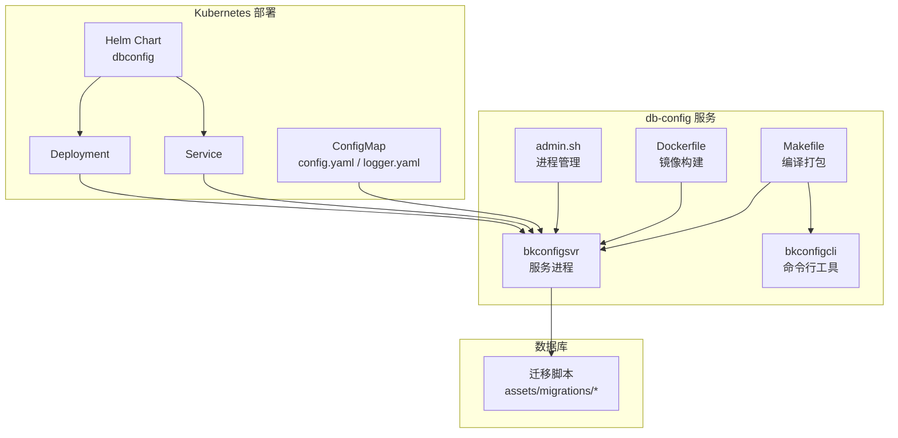
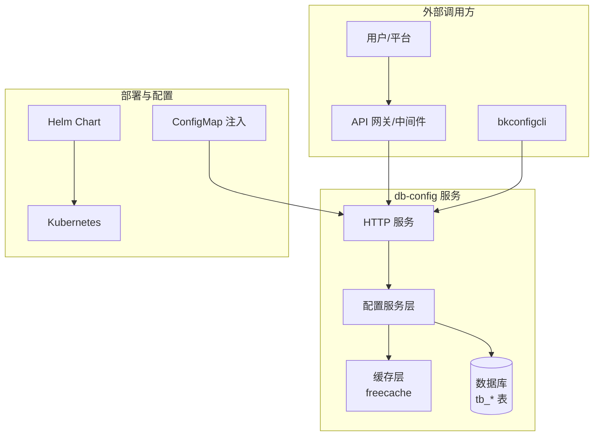
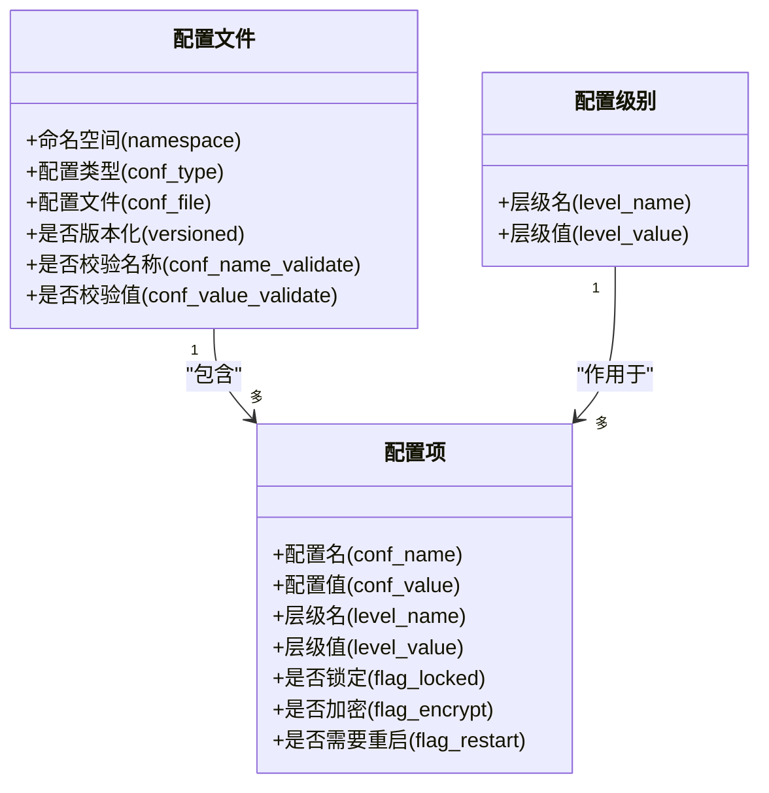
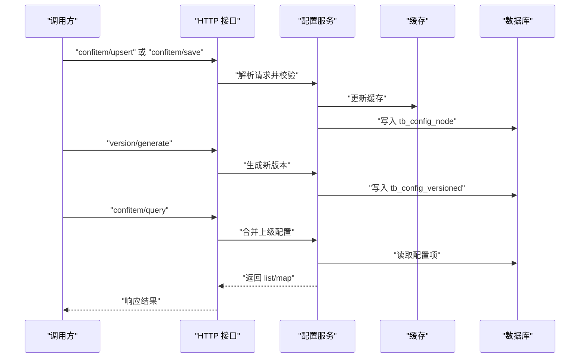
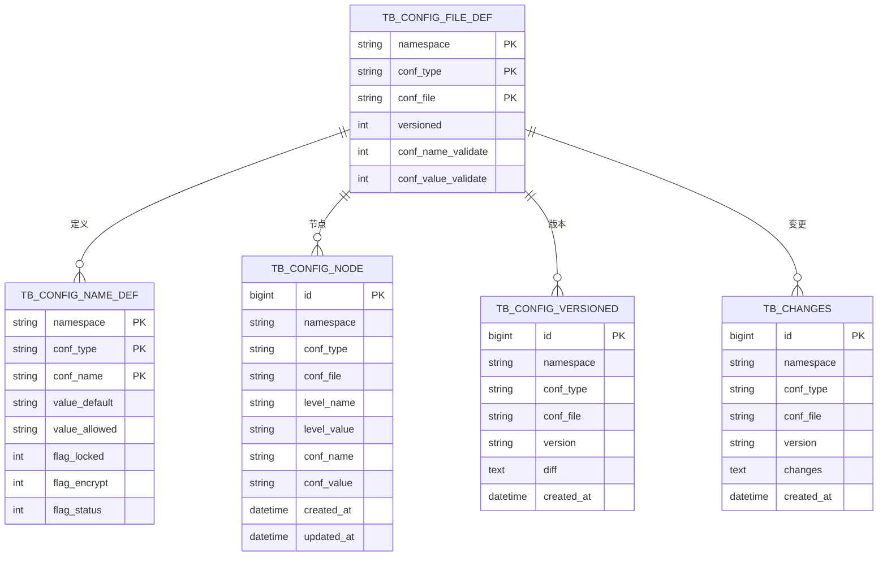
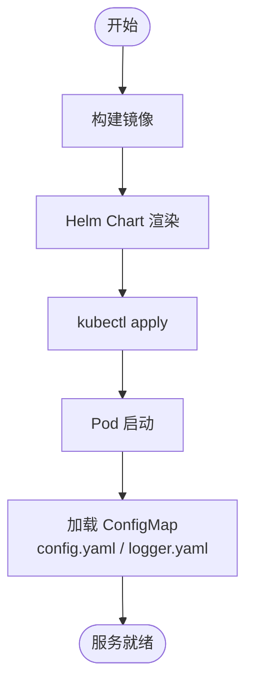
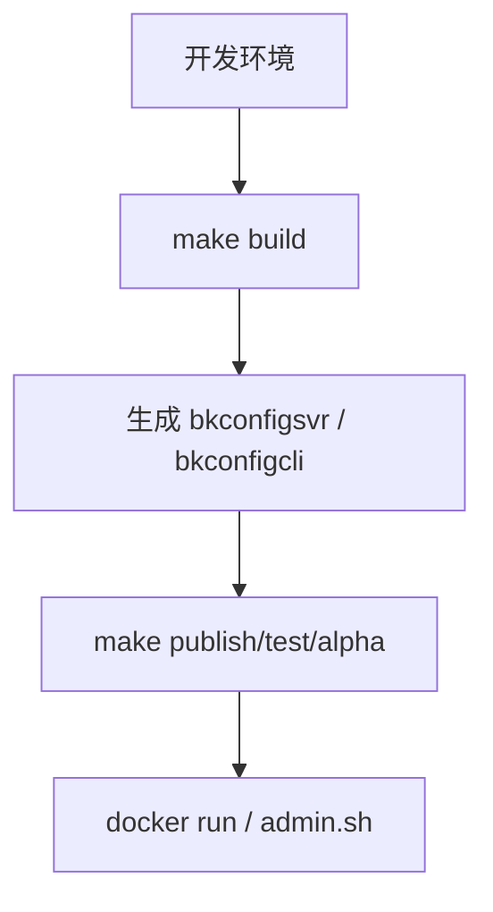
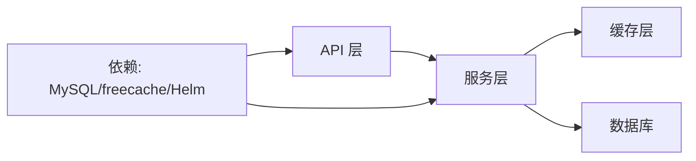

# 配置管理工具

<cite>
**本文档引用的文件**
- [README.md](file://dbm-services/common/db-config/README.md)
- [Dockerfile](file://dbm-services/common/db-config/Dockerfile)
- [Makefile](file://dbm-services/common/db-config/Makefile)
- [admin.sh](file://dbm-services/common/db-config/admin.sh)
- [Chart.yaml](file://helm-charts/bk-dbm/charts/dbconfig/Chart.yaml)
- [service.yaml](file://helm-charts/bk-dbm/charts/dbconfig/templates/service.yaml)
- [deployment.yaml](file://helm-charts/bk-dbm/charts/dbconfig/templates/deployment.yaml)
- [dbconfig-configmap.yaml](file://helm-charts/bk-dbm/templates/configmaps/dbconfig-configmap.yaml)
- [000001_init.up.sql](file://dbm-services/common/db-config/assets/migrations/000001_init.up.sql)
- [000002_create_table.up.sql](file://dbm-services/common/db-config/assets/migrations/000002_create_table.up.sql)
- [000048_create_changes_table.up.sql](file://dbm-services/common/db-config/assets/migrations/000048_create_changes_table.up.sql)
</cite>

## 目录
1. [简介](#简介)
2. [项目结构](#项目结构)
3. [核心组件](#核心组件)
4. [架构总览](#架构总览)
5. [详细组件分析](#详细组件分析)
6. [依赖分析](#依赖分析)
7. [性能考虑](#性能考虑)
8. [故障排查指南](#故障排查指南)
9. [结论](#结论)
10. [附录](#附录)

## 简介
本文件为 DBM 配置管理工具（db-config）的综合技术文档，面向运维工程师、平台开发者与使用者，系统阐述配置管理服务的功能边界、架构设计、数据模型、API 接口、命令行工具、Web 界面、配置版本与发布流程、加密与访问控制、审计与回滚机制，以及安全策略、性能优化与故障处理建议。

## 项目结构
db-config 作为 DBM 的配置管理子系统，提供统一的配置定义、版本化管理、继承合并、发布与应用能力，并通过 Helm Chart 提供容器化部署与配置注入。

- 服务端与客户端
  - 服务端可执行文件：bkconfigsvr
  - 客户端可执行文件：bkconfigcli
  - 镜像构建：Dockerfile
  - 构建脚本：Makefile
  - 进程管理：admin.sh

- 部署与配置注入
  - Helm Chart：charts/dbconfig
  - Kubernetes 资源：Service、Deployment
  - ConfigMap 注入：config.yaml、logger.yaml

- 数据库迁移
  - 内置迁移脚本：assets/migrations/*.sql

图表来源
- [Dockerfile:1-11](file://dbm-services/common/db-config/Dockerfile#L1-L11)
- [Makefile:1-58](file://dbm-services/common/db-config/Makefile#L1-L58)
- [admin.sh:1-70](file://dbm-services/common/db-config/admin.sh#L1-L70)
- [Chart.yaml:1-6](file://helm-charts/bk-dbm/charts/dbconfig/Chart.yaml#L1-L6)
- [service.yaml:1-15](file://helm-charts/bk-dbm/charts/dbconfig/templates/service.yaml#L1-L15)
- [deployment.yaml:1-46](file://helm-charts/bk-dbm/charts/dbconfig/templates/deployment.yaml#L1-L46)
- [dbconfig-configmap.yaml:1-57](file://helm-charts/bk-dbm/templates/configmaps/dbconfig-configmap.yaml#L1-L57)
- [000001_init.up.sql](file://dbm-services/common/db-config/assets/migrations/000001_init.up.sql)
- [000002_create_table.up.sql](file://dbm-services/common/db-config/assets/migrations/000002_create_table.up.sql)
- [000048_create_changes_table.up.sql](file://dbm-services/common/db-config/assets/migrations/000048_create_changes_table.up.sql)

章节来源
- [README.md:1-223](file://dbm-services/common/db-config/README.md#L1-L223)
- [Dockerfile:1-11](file://dbm-services/common/db-config/Dockerfile#L1-L11)
- [Makefile:1-58](file://dbm-services/common/db-config/Makefile#L1-L58)
- [admin.sh:1-70](file://dbm-services/common/db-config/admin.sh#L1-L70)
- [Chart.yaml:1-6](file://helm-charts/bk-dbm/charts/dbconfig/Chart.yaml#L1-L6)
- [service.yaml:1-15](file://helm-charts/bk-dbm/charts/dbconfig/templates/service.yaml#L1-L15)
- [deployment.yaml:1-46](file://helm-charts/bk-dbm/charts/dbconfig/templates/deployment.yaml#L1-L46)
- [dbconfig-configmap.yaml:1-57](file://helm-charts/bk-dbm/templates/configmaps/dbconfig-configmap.yaml#L1-L57)

## 核心组件
- 配置定义层
  - 配置文件（conf_file）：按 conf_type 维度划分的子类，支持版本化与校验规则
  - 配置项（conf_item）：包含 conf_name、conf_value、level_name/level_value、flag_locked、flag_encrypt 等
  - 配置级别（level_name）：plat/app/module/cluster 四级继承关系
  - 配置文件定义（tb_config_file_def）、平台配置定义（tb_config_name_def）

- 配置存储与版本管理
  - 配置节点（tb_config_node）：记录各层级的增量配置
  - 已发布版本（tb_config_versioned）：记录已发布的版本及差异
  - 变更审计（changes 表）：记录变更行数与差异对比

- 发布与应用
  - 保存与发布：非版本化使用 save；版本化使用 upsert 与 generate
  - 应用到下级：根据锁定状态决定强制或普通应用
  - 应用到实例：将版本化配置应用到目标集群/实例

- 加密与访问控制
  - 值加密：flag_encrypt 控制是否加密存储
  - 密钥前缀：encrypt.keyPrefix 在配置中设置
  - 访问控制：通过 API 认证与授权中间件（参考 DBM 其他模块通用中间件）

- API 文档与 UI
  - Swagger UI：本地可通过 http://localhost:8080/swagger/ 访问
  - 支持查询、保存、发布、版本查询、业务转移等接口

章节来源
- [README.md:14-134](file://dbm-services/common/db-config/README.md#L14-L134)
- [README.md:200-223](file://dbm-services/common/db-config/README.md#L200-L223)

## 架构总览
db-config 采用“配置定义 + 存储 + 版本化 + 发布应用 + 加密”的整体架构，结合 Helm Chart 实现容器化部署与配置注入，数据库迁移确保表结构演进。

图表来源
- [README.md:1-223](file://dbm-services/common/db-config/README.md#L1-L223)
- [dbconfig-configmap.yaml:1-57](file://helm-charts/bk-dbm/templates/configmaps/dbconfig-configmap.yaml#L1-L57)
- [Chart.yaml:1-6](file://helm-charts/bk-dbm/charts/dbconfig/Chart.yaml#L1-L6)

## 详细组件分析

### 配置模型与继承
- 层级关系：plat → app → module → cluster，逐级继承并合并
- 配置类型与文件：conf_type + conf_file 组合标识一类配置及其子类
- 配置项属性：conf_name、conf_value、level_name/level_value、flag_locked、flag_encrypt、是否需要重启等
- 默认值与占位符：支持只读与可改占位符，部分占位符可自动生成

图表来源
- [README.md:14-116](file://dbm-services/common/db-config/README.md#L14-L116)

章节来源
- [README.md:14-116](file://dbm-services/common/db-config/README.md#L14-L116)

### API 流程（保存与发布）
以下序列图展示“编辑配置并发布”的典型流程，涵盖 upsert/save、generate、query 等关键步骤。

图表来源
- [README.md:48-51](file://dbm-services/common/db-config/README.md#L48-L51)
- [README.md:117-130](file://dbm-services/common/db-config/README.md#L117-L130)

章节来源
- [README.md:48-51](file://dbm-services/common/db-config/README.md#L48-L51)
- [README.md:117-130](file://dbm-services/common/db-config/README.md#L117-L130)

### 数据模型（表关系）
db-config 使用多张表支撑配置定义、节点、版本与变更审计。

图表来源
- [000001_init.up.sql](file://dbm-services/common/db-config/assets/migrations/000001_init.up.sql)
- [000002_create_table.up.sql](file://dbm-services/common/db-config/assets/migrations/000002_create_table.up.sql)
- [000048_create_changes_table.up.sql](file://dbm-services/common/db-config/assets/migrations/000048_create_changes_table.up.sql)

章节来源
- [README.md:200-205](file://dbm-services/common/db-config/README.md#L200-L205)
- [000001_init.up.sql](file://dbm-services/common/db-config/assets/migrations/000001_init.up.sql)
- [000002_create_table.up.sql](file://dbm-services/common/db-config/assets/migrations/000002_create_table.up.sql)
- [000048_create_changes_table.up.sql](file://dbm-services/common/db-config/assets/migrations/000048_create_changes_table.up.sql)

### 部署与配置注入（Helm）
- Helm Chart：提供 dbconfig 的 Chart 元信息与资源模板
- Service：暴露 HTTP 端口
- Deployment：部署容器，挂载 ConfigMap
- ConfigMap：注入 config.yaml（数据库、连接池、Swagger、加密、迁移等）与 logger.yaml

图表来源
- [Chart.yaml:1-6](file://helm-charts/bk-dbm/charts/dbconfig/Chart.yaml#L1-L6)
- [service.yaml:1-15](file://helm-charts/bk-dbm/charts/dbconfig/templates/service.yaml#L1-L15)
- [deployment.yaml:1-46](file://helm-charts/bk-dbm/charts/dbconfig/templates/deployment.yaml#L1-L46)
- [dbconfig-configmap.yaml:1-57](file://helm-charts/bk-dbm/templates/configmaps/dbconfig-configmap.yaml#L1-L57)

章节来源
- [Chart.yaml:1-6](file://helm-charts/bk-dbm/charts/dbconfig/Chart.yaml#L1-L6)
- [service.yaml:1-15](file://helm-charts/bk-dbm/charts/dbconfig/templates/service.yaml#L1-L15)
- [deployment.yaml:1-46](file://helm-charts/bk-dbm/charts/dbconfig/templates/deployment.yaml#L1-L46)
- [dbconfig-configmap.yaml:1-57](file://helm-charts/bk-dbm/templates/configmaps/dbconfig-configmap.yaml#L1-L57)

### 命令行工具与进程管理
- 编译：Makefile 提供 client/server 编译目标
- 运行：Dockerfile 将 conf、bkconfigsvr、bkconfigcli 打包至镜像
- 管理：admin.sh 提供 start/stop/status/restart

图表来源
- [Makefile:1-58](file://dbm-services/common/db-config/Makefile#L1-L58)
- [Dockerfile:1-11](file://dbm-services/common/db-config/Dockerfile#L1-L11)
- [admin.sh:1-70](file://dbm-services/common/db-config/admin.sh#L1-L70)

章节来源
- [Makefile:1-58](file://dbm-services/common/db-config/Makefile#L1-L58)
- [Dockerfile:1-11](file://dbm-services/common/db-config/Dockerfile#L1-L11)
- [admin.sh:1-70](file://dbm-services/common/db-config/admin.sh#L1-L70)

## 依赖分析
- 组件内聚与耦合
  - 配置服务层与缓存层、数据库层分离，降低耦合
  - API 层仅负责协议与路由，业务逻辑集中在服务层
- 外部依赖
  - 数据库：MySQL（迁移脚本驱动）
  - 缓存：freecache（配置文件定义、层级定义）
  - 部署：Kubernetes + Helm
  - 文档：Swagger UI

图表来源
- [README.md:169-177](file://dbm-services/common/db-config/README.md#L169-L177)
- [dbconfig-configmap.yaml:1-57](file://helm-charts/bk-dbm/templates/configmaps/dbconfig-configmap.yaml#L1-L57)

章节来源
- [README.md:169-177](file://dbm-services/common/db-config/README.md#L169-L177)
- [dbconfig-configmap.yaml:1-57](file://helm-charts/bk-dbm/templates/configmaps/dbconfig-configmap.yaml#L1-L57)

## 性能考虑
- 缓存策略
  - freecache 缓存配置文件定义与层级定义，减少数据库访问
- 连接池
  - 通过 ConfigMap 配置最大空闲连接、最大打开连接、连接生命周期
- 查询优化
  - 合并继承时尽量批量读取与合并，避免 N+1 查询
- 发布与应用
  - 版本化发布后生成 diff，减少全量下发成本
- 日志与监控
  - 通过 logger.yaml 配置输出格式、级别与轮转策略

章节来源
- [README.md:169-177](file://dbm-services/common/db-config/README.md#L169-L177)
- [dbconfig-configmap.yaml:24-57](file://helm-charts/bk-dbm/templates/configmaps/dbconfig-configmap.yaml#L24-L57)

## 故障排查指南
- 服务启动失败
  - 检查数据库连接配置（host/port/username/password）
  - 确认迁移已执行（migrate.enable=true）
  - 查看日志输出路径与级别
- 配置无法写入
  - 确认 namespace/conf_type 已注册
  - 校验 conf_name_validate 与 conf_value_validate 规则
  - 检查 flag_locked 状态
- 加密字段异常
  - 检查 encrypt.keyPrefix 是否一致
  - 若更换 keyPrefix，需重新加密或迁移
- 发布版本缺失
  - 使用 version/generate 生成新版本
  - 核对 tb_config_versioned 与 tb_changes 表
- 业务 ID 迁移
  - 使用 change-bkbizid 接口批量迁移业务关联的集群

章节来源
- [README.md:188-223](file://dbm-services/common/db-config/README.md#L188-L223)
- [dbconfig-configmap.yaml:35-38](file://helm-charts/bk-dbm/templates/configmaps/dbconfig-configmap.yaml#L35-L38)

## 结论
db-config 通过清晰的配置模型、版本化与发布机制、缓存与数据库协同、以及 Helm 部署与配置注入，提供了稳定可靠的配置管理能力。结合加密、审计与回滚机制，能够满足生产环境对一致性、安全性与可追溯性的要求。建议在生产环境中启用迁移自动执行、合理配置缓存与连接池，并完善 API 认证与授权策略。

## 附录

### API 接口概览（基于文档）
- 配置项
  - 保存：confitem/save（非版本化）
  - 编辑：confitem/upsert（版本化）
  - 查询：confitem/query（合并上级配置）
- 版本
  - 生成：version/generate（发布并生成新版本）
  - 查询：version/list、version/detail
- 业务迁移
  - change-bkbizid（批量迁移业务 ID 与集群）

章节来源
- [README.md:48-51](file://dbm-services/common/db-config/README.md#L48-L51)
- [README.md:117-130](file://dbm-services/common/db-config/README.md#L117-L130)
- [README.md:207-223](file://dbm-services/common/db-config/README.md#L207-L223)