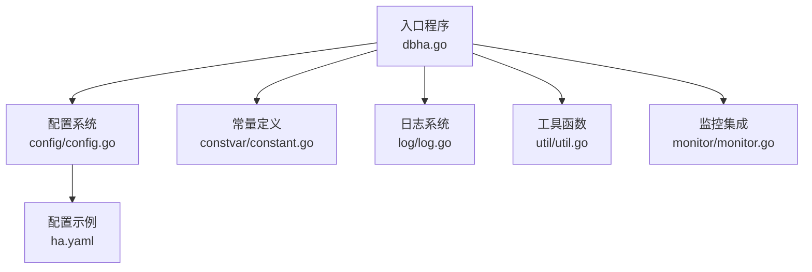
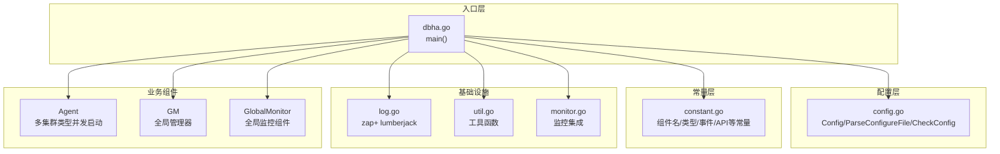
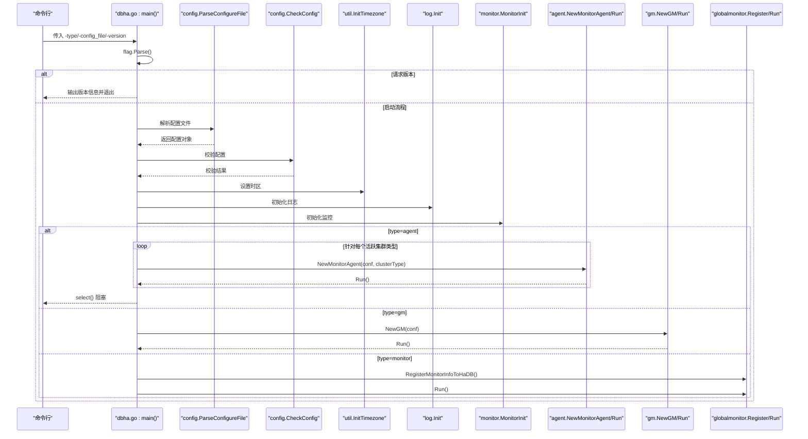
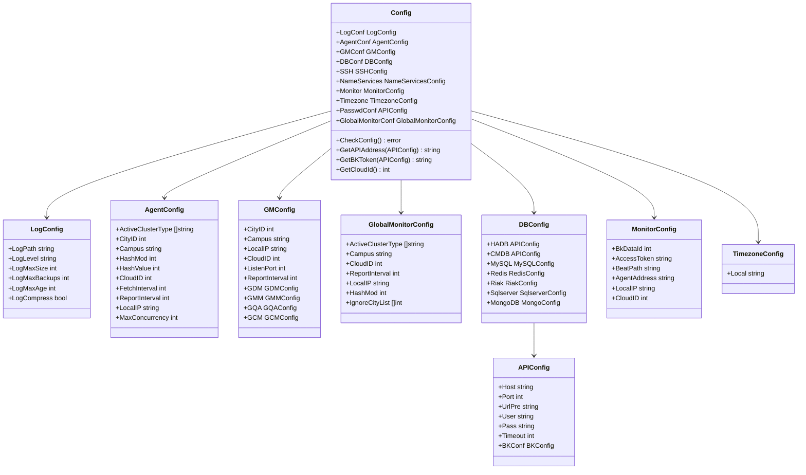
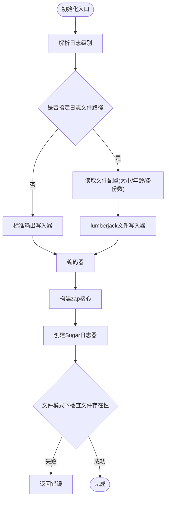
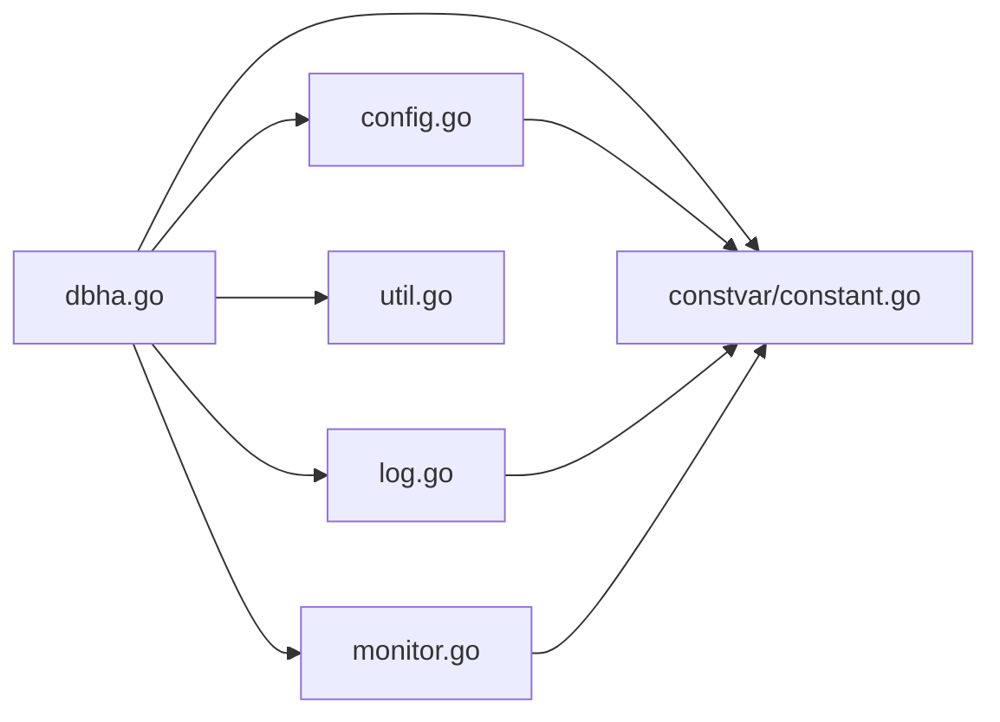

# dbha核心模块

<cite>
**本文引用的文件**
- [dbha.go](file://dbm-services/common/dbha/ha-module/dbha.go)
- [config.go](file://dbm-services/common/dbha/ha-module/config/config.go)
- [constant.go](file://dbm-services/common/dbha/ha-module/constvar/constant.go)
- [log.go](file://dbm-services/common/dbha/ha-module/log/log.go)
- [util.go](file://dbm-services/common/dbha/ha-module/util/util.go)
- [monitor.go](file://dbm-services/common/dbha/ha-module/monitor/monitor.go)
- [ha.yaml](file://dbm-services/common/dbha/ha-module/ha.yaml)
</cite>

## 目录
1. [简介](#简介)
2. [项目结构](#项目结构)
3. [核心组件](#核心组件)
4. [架构总览](#架构总览)
5. [详细组件分析](#详细组件分析)
6. [依赖关系分析](#依赖关系分析)
7. [性能考虑](#性能考虑)
8. [故障排查指南](#故障排查指南)
9. [结论](#结论)
10. [附录](#附录)

## 简介
本文件面向dbha核心模块（dbm-services/common/dbha/ha-module），系统性梳理dbha.go主程序的设计与实现，覆盖命令行参数解析、配置文件加载与校验、初始化流程、常量与工具函数、启动流程、错误处理与日志记录机制，并提供配置示例与最佳实践建议。目标是帮助读者快速理解并正确部署与维护dbha核心模块。

## 项目结构
dbha核心模块位于dbm-services/common/dbha/ha-module目录下，主要由以下层次构成：
- 入口程序：dbha.go
- 配置系统：config/config.go
- 常量定义：constvar/constant.go
- 日志系统：log/log.go
- 工具函数：util/util.go
- 监控集成：monitor/monitor.go
- 配置示例：ha.yaml

**图表来源**
- [dbha.go:33-109](file://dbm-services/common/dbha/ha-module/dbha.go#L33-L109)
- [config.go:17-39](file://dbm-services/common/dbha/ha-module/config/config.go#L17-L39)
- [constant.go:1-487](file://dbm-services/common/dbha/ha-module/constvar/constant.go#L1-L487)
- [log.go:26-64](file://dbm-services/common/dbha/ha-module/log/log.go#L26-L64)
- [util.go:1-172](file://dbm-services/common/dbha/ha-module/util/util.go#L1-L172)
- [monitor.go:79-88](file://dbm-services/common/dbha/ha-module/monitor/monitor.go#L79-L88)
- [ha.yaml:1-116](file://dbm-services/common/dbha/ha-module/ha.yaml#L1-L116)

**章节来源**
- [dbha.go:1-110](file://dbm-services/common/dbha/ha-module/dbha.go#L1-L110)
- [config.go:1-302](file://dbm-services/common/dbha/ha-module/config/config.go#L1-L302)
- [constant.go:1-487](file://dbm-services/common/dbha/ha-module/constvar/constant.go#L1-L487)
- [log.go:1-145](file://dbm-services/common/dbha/ha-module/log/log.go#L1-L145)
- [util.go:1-172](file://dbm-services/common/dbha/ha-module/util/util.go#L1-L172)
- [monitor.go:1-275](file://dbm-services/common/dbha/ha-module/monitor/monitor.go#L1-L275)
- [ha.yaml:1-116](file://dbm-services/common/dbha/ha-module/ha.yaml#L1-L116)

## 核心组件
- 入口程序与启动流程：负责命令行参数解析、版本输出、配置加载与校验、日志初始化、组件初始化与运行。
- 配置系统：定义配置数据结构、YAML解析、参数校验与默认值处理。
- 常量定义：集中管理组件名、集群类型、角色、状态、事件名、API路由、日志级别等。
- 日志系统：基于zap与lumberjack，支持文件滚动与标准输出。
- 工具函数：通用工具如主机连通性检测、认证错误判断、Shell执行、结构体序列化、一致性哈希等。
- 监控集成：封装监控上报维度与事件名称，统一发送接口。

**章节来源**
- [dbha.go:26-109](file://dbm-services/common/dbha/ha-module/dbha.go#L26-L109)
- [config.go:17-302](file://dbm-services/common/dbha/ha-module/config/config.go#L17-L302)
- [constant.go:1-487](file://dbm-services/common/dbha/ha-module/constvar/constant.go#L1-L487)
- [log.go:26-145](file://dbm-services/common/dbha/ha-module/log/log.go#L26-L145)
- [util.go:22-172](file://dbm-services/common/dbha/ha-module/util/util.go#L22-L172)
- [monitor.go:79-275](file://dbm-services/common/dbha/ha-module/monitor/monitor.go#L79-L275)

## 架构总览
dbha主程序采用“入口程序驱动各子系统”的结构：入口程序负责参数与配置，随后按类型启动agent、gm或monitor组件；配置系统提供统一的数据模型与校验；日志系统贯穿全链路；工具函数提供通用能力；监控集成负责事件上报。

**图表来源**
- [dbha.go:33-109](file://dbm-services/common/dbha/ha-module/dbha.go#L33-L109)
- [config.go:238-289](file://dbm-services/common/dbha/ha-module/config/config.go#L238-L289)
- [constant.go:3-19](file://dbm-services/common/dbha/ha-module/constvar/constant.go#L3-L19)
- [log.go:26-64](file://dbm-services/common/dbha/ha-module/log/log.go#L26-L64)
- [util.go:22-172](file://dbm-services/common/dbha/ha-module/util/util.go#L22-L172)
- [monitor.go:79-88](file://dbm-services/common/dbha/ha-module/monitor/monitor.go#L79-L88)

## 详细组件分析

### 入口程序与启动流程
- 命令行参数
  - -type：指定组件类型（agent/gm/monitor）
  - -config_file：配置文件路径
  - -version：打印版本信息
- 初始化与校验
  - 解析参数后，若仅传入两个标志则继续；否则提示参数错误并退出。
  - 加载并解析配置文件，进行结构校验；若校验失败则退出。
  - 按配置初始化时区、日志、监控。
- 组件启动
  - agent：根据配置中的活跃集群类型列表并发启动多个实例。
  - gm：启动全局管理器。
  - monitor：注册全局监控信息并运行。

**图表来源**
- [dbha.go:33-109](file://dbm-services/common/dbha/ha-module/dbha.go#L33-L109)
- [config.go:238-258](file://dbm-services/common/dbha/ha-module/config/config.go#L238-L258)
- [config.go:270-289](file://dbm-services/common/dbha/ha-module/config/config.go#L270-L289)
- [util.go:156-172](file://dbm-services/common/dbha/ha-module/util/util.go#L156-L172)
- [log.go:26-64](file://dbm-services/common/dbha/ha-module/log/log.go#L26-L64)
- [monitor.go:79-88](file://dbm-services/common/dbha/ha-module/monitor/monitor.go#L79-L88)

**章节来源**
- [dbha.go:26-109](file://dbm-services/common/dbha/ha-module/dbha.go#L26-L109)

### 配置系统
- 数据模型
  - Config：顶层配置，包含日志、agent、gm、db、ssh、name_services、monitor、timezone、password_conf、global_monitor_conf等。
  - 各子配置结构：LogConfig、AgentConfig、GMConfig、GlobalMonitorConfig、DBConfig、MySQLConfig、RedisConfig、RiakConfig、SqlserverConfig、MongoConfig、SSHConfig、NameServicesConfig、APIConfig、BKConfig、MonitorConfig、TimezoneConfig等。
- 解析与校验
  - ParseConfigureFile：读取YAML文件，反序列化为Config，使用validator进行结构校验。
  - CheckConfig：默认并发数设置、agent/gm云ID一致性校验等。
- 默认值与辅助方法
  - 默认最大并发数、日志文件默认大小/备份/保留天数、获取API地址与BK Token等。

**图表来源**
- [config.go:17-302](file://dbm-services/common/dbha/ha-module/config/config.go#L17-L302)

**章节来源**
- [config.go:17-302](file://dbm-services/common/dbha/ha-module/config/config.go#L17-L302)

### 常量定义
- 组件与模式
  - 组件名：agent/gm/gcm/gmm/gqa/gdm/monitor
- 集群与实例类型
  - TenDBHA/TenDBCluster、Redis系列、Tendis系列、Riak、Sqlserver、MongoShardedCluster等
- 角色与元类型
  - 存储/代理/只读/中继等角色，以及各存储/代理层元类型
- 检测类型
  - 指定检测的集群类型映射
- 事件与API路由
  - 实例状态、心跳、切换队列、日志、屏蔽配置等API路由
  - 各数据库类型的事件名（如Redis/MySQL/Riak/SQLServer/Mongo切换成功/失败、认证失败、双检失败等）
- 日志级别与默认值
  - LOG_DEBUG/INFO/WARN/ERROR/PANIC/FATAL及默认日志参数
- 其他
  - 时间戳、默认数据库、Riak端口等

**章节来源**
- [constant.go:1-487](file://dbm-services/common/dbha/ha-module/constvar/constant.go#L1-L487)

### 日志系统
- 初始化
  - 支持文件与标准输出两种写入方式；文件模式下使用lumberjack进行滚动。
  - 日志级别通过字符串映射到zap级别，默认回退策略。
- GORM日志
  - 使用zap封装gorm日志，配置慢查询阈值与日志等级。
- 文件存在性检查
  - 在文件模式下检查日志文件是否存在并报错。

**图表来源**
- [log.go:26-145](file://dbm-services/common/dbha/ha-module/log/log.go#L26-L145)

**章节来源**
- [log.go:26-145](file://dbm-services/common/dbha/ha-module/log/log.go#L26-L145)

### 工具函数
- 调用栈定位：返回调用者文件与行号，便于日志溯源。
- 容器元素判断：反射判断切片/数组是否包含某元素。
- 主机连通性检测：TCP拨号超时检测。
- 认证错误判断：针对Redis与SSH的错误关键字匹配。
- Shell命令执行：支持sudo前缀，区分stdout/stderr并返回错误包装。
- 结构体序列化：JSON序列化结构体用于调试。
- 一致性哈希：基于时间窗口的FNV-1a哈希生成。

**章节来源**
- [util.go:22-172](file://dbm-services/common/dbha/ha-module/util/util.go#L22-L172)

### 监控集成
- 运行时监控初始化：将本地IP、数据ID、令牌、上报类型、消息类型、心跳路径、Agent地址等注入运行时。
- 上报维度与事件
  - 切换事件：实例角色、应用ID、IP/端口、状态、集群域名、机房、双检ID、主库切换后的binlog位置等。
  - 探测事件：应用ID、IP/端口、状态、集群域名、机型、集群类型、实例角色。
  - 全局监控：服务器IP、未覆盖城市ID列表、未覆盖实例数、需检测数、已检测数。
  - API异常：API名称与消息。
- 事件命名：根据数据库类型与成功/失败状态选择对应事件名。

**章节来源**
- [monitor.go:79-275](file://dbm-services/common/dbha/ha-module/monitor/monitor.go#L79-L275)

## 依赖关系分析
- 入口程序依赖配置系统（解析与校验）、常量定义（组件名与API路由）、日志系统（初始化）、工具函数（时区、主机检测等）、监控集成（初始化）。
- agent/gm/monitor组件在入口程序中被条件启动，彼此独立。
- 配置系统内部通过validator进行字段级校验，部分字段要求必填，部分字段提供默认值。
- 日志系统与监控系统作为基础设施被所有组件共享。

**图表来源**
- [dbha.go:33-109](file://dbm-services/common/dbha/ha-module/dbha.go#L33-L109)
- [config.go:17-39](file://dbm-services/common/dbha/ha-module/config/config.go#L17-L39)
- [constant.go:1-487](file://dbm-services/common/dbha/ha-module/constvar/constant.go#L1-L487)
- [log.go:26-64](file://dbm-services/common/dbha/ha-module/log/log.go#L26-L64)
- [util.go:22-172](file://dbm-services/common/dbha/ha-module/util/util.go#L22-L172)
- [monitor.go:79-88](file://dbm-services/common/dbha/ha-module/monitor/monitor.go#L79-L88)

**章节来源**
- [dbha.go:33-109](file://dbm-services/common/dbha/ha-module/dbha.go#L33-L109)
- [config.go:238-289](file://dbm-services/common/dbha/ha-module/config/config.go#L238-L289)

## 性能考虑
- 并发控制
  - agent支持最大并发数配置，默认值为64；可通过配置调整以适配不同规模。
- 日志滚动
  - 文件模式下可配置单文件大小、保留天数与备份数，避免日志膨胀影响IO。
- TCP拨号超时
  - 主机连通性检测使用固定超时，避免长时间阻塞。
- 一致性哈希
  - 基于时间窗口的哈希可用于分批任务调度，降低抖动。

**章节来源**
- [config.go:12-15](file://dbm-services/common/dbha/ha-module/config/config.go#L12-L15)
- [config.go:279-281](file://dbm-services/common/dbha/ha-module/config/config.go#L279-L281)
- [util.go:22-24](file://dbm-services/common/dbha/ha-module/util/util.go#L22-L24)
- [util.go:156-172](file://dbm-services/common/dbha/ha-module/util/util.go#L156-L172)

## 故障排查指南
- 参数错误
  - 当标志数量不等于2时，程序会打印参数错误并退出。请确保同时提供-type与-config_file。
- 配置解析失败
  - YAML读取或反序列化失败时，会返回错误并退出。请检查配置文件语法与字段拼写。
- 配置校验失败
  - 结构校验失败或agent/gm云ID不一致会导致退出。请核对配置并修正。
- 日志初始化失败
  - 文件模式下若日志文件不存在或不可写，会返回错误并退出。请确认路径权限与存在性。
- 组件运行失败
  - agent/gm/monitor任一组件初始化或运行失败会触发致命日志并退出。请查看对应组件日志定位问题。

**章节来源**
- [dbha.go:44-66](file://dbm-services/common/dbha/ha-module/dbha.go#L44-L66)
- [log.go:133-144](file://dbm-services/common/dbha/ha-module/log/log.go#L133-L144)

## 结论
dbha核心模块通过清晰的入口程序、完善的配置系统、统一的日志与监控集成，实现了对多种数据库类型的高可用检测与切换支撑。遵循本文档的配置与最佳实践，可有效提升部署稳定性与可观测性。

## 附录

### 配置示例与字段说明
- 日志配置：log_conf
  - log_path：日志文件路径（留空则输出到标准输出）
  - log_level：日志级别（LOG_DEBUG/INFO/WARN/ERROR/PANIC/FATAL）
  - log_maxsize：单文件大小（MB）
  - log_maxbackups：最大备份数
  - log_maxage：最大保存天数
  - log_compress：是否压缩
- Agent配置：agent_conf
  - active_db_type：活跃集群类型列表（如tendbha:backend、tendbha:proxy、riak等）
  - city_id/campus/cloud_id：地域/校区/云ID
  - fetch_interval/reporter_interval：拉取实例与上报间隔
  - local_ip/max_concurrency：本机IP与最大并发
  - hash_mod/hash_value：哈希分片参数
- GM配置：gm_conf
  - city_id/campus/local_ip/cloud_id：同上
  - liston_port：监听端口
  - report_interval：上报间隔
  - GDM/GMM/GQA/GCM：各子组件配置
- DB配置：db_conf
  - hadb/cmdb：HA与CMDB API配置
  - mysql/redis/riak/sqlserver/mongodb：各数据库连接与超时
- SSH配置：ssh
  - port/user/pass/sqlserver_ssh_user/sqlserver_ssh_pass/dest/timeout/max_uptime
- 密码服务：password_conf
  - host/port/url_pre/user/pass/timeout/bk_conf
- 名称服务：name_services
  - dns_conf/polaris_conf/clb_conf/remote_conf
- 监控：monitor
  - bk_data_id/access_token/beat_path/agent_address/local_ip/cloud_id
- 时区：timezone
  - local：时区名称（如CST）

**章节来源**
- [ha.yaml:1-116](file://dbm-services/common/dbha/ha-module/ha.yaml#L1-L116)

### 最佳实践
- 配置校验
  - 在上线前使用配置解析与校验逻辑验证配置文件，确保必填项完整且类型正确。
- 日志管理
  - 生产环境建议启用文件日志并合理设置滚动参数；避免在容器内使用过大的单文件。
- 并发与资源
  - 根据实例规模与网络状况调整max_concurrency与上报间隔，避免过度占用资源。
- 时区与时钟
  - 统一时区配置，确保日志与监控时间线一致。
- 监控与告警
  - 正确配置monitor字段，确保事件上报与告警链路畅通。