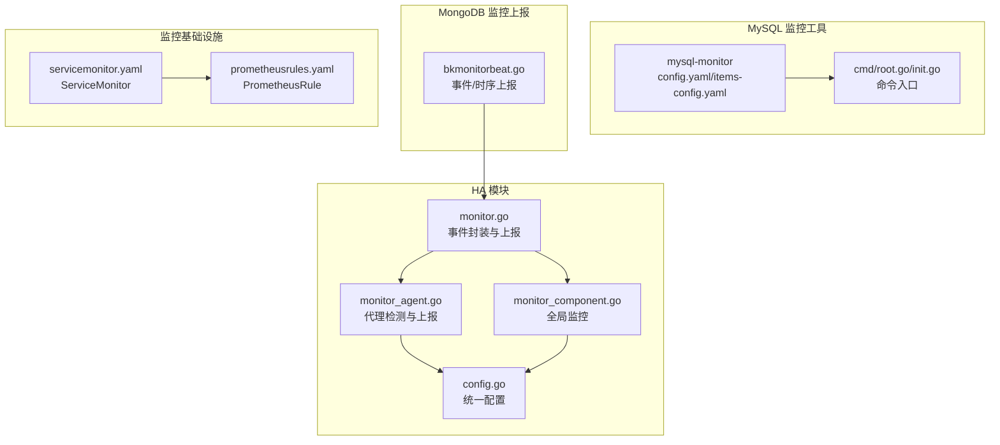
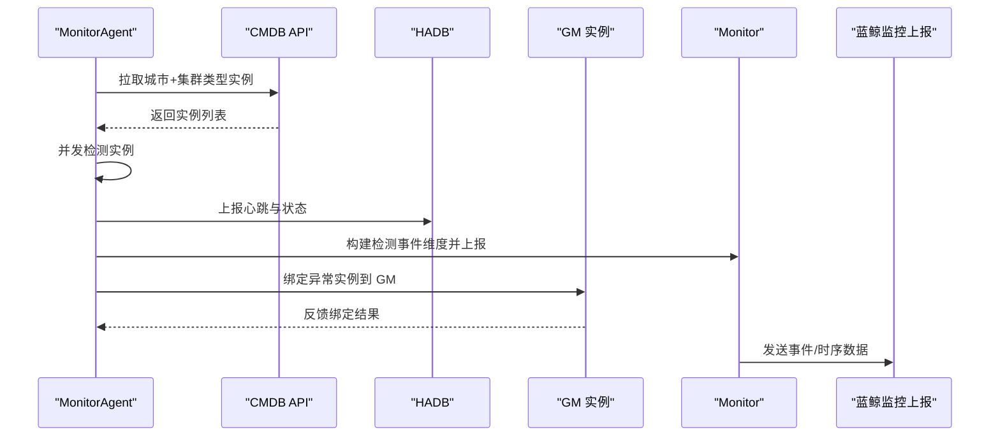
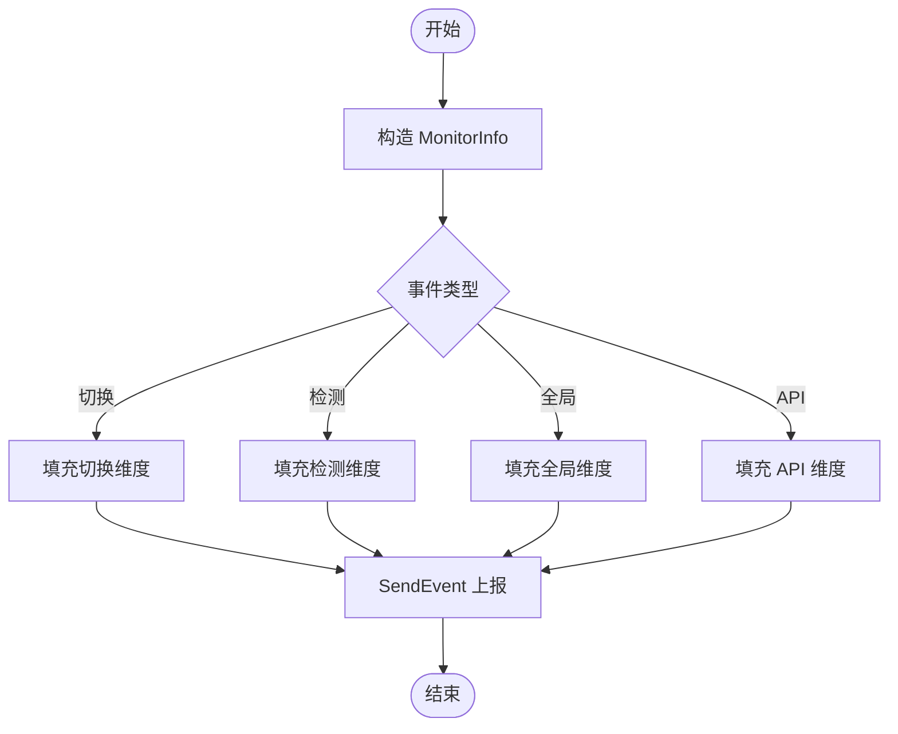
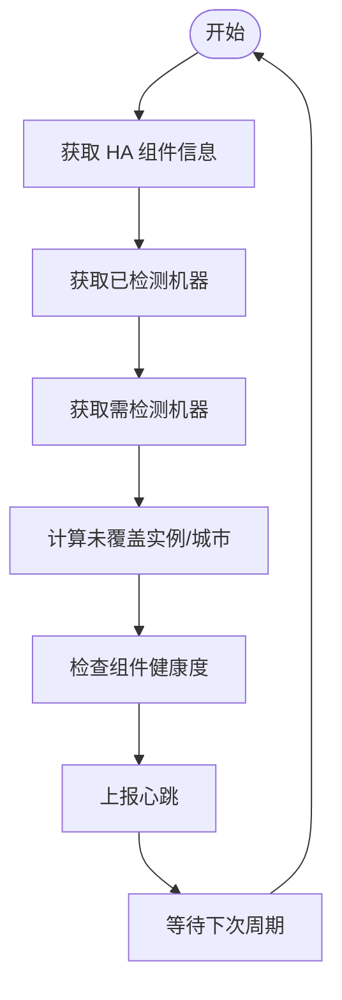
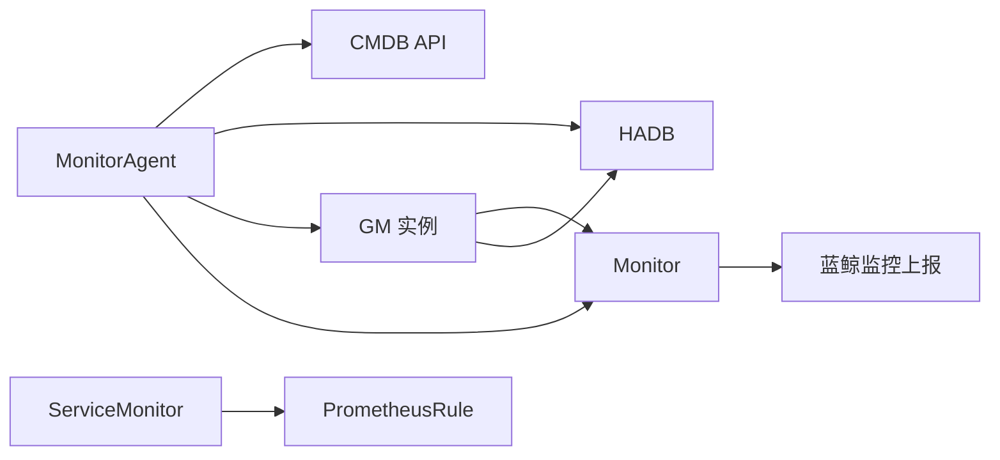

# 代理监控组件

<cite>
**本文档引用的文件**
- [monitor.go](file://dbm-services/common/dbha/ha-module/monitor/monitor.go)
- [monitor_component.go](file://dbm-services/common/dbha/ha-module/globalmonitor/monitor_component.go)
- [monitor_agent.go](file://dbm-services/common/dbha/ha-module/agent/monitor_agent.go)
- [config.go](file://dbm-services/common/dbha/ha-module/config/config.go)
- [bkmonitorbeat.go](file://dbm-services/mongodb/db-tools/dbmon/pkg/sendwarning/bkmonitorbeat.go)
- [config.yaml](file://dbm-services/mysql/db-tools/mysql-monitor/config.yaml)
- [items-config.yaml](file://dbm-services/mysql/db-tools/mysql-monitor/items-config.yaml)
- [root.go](file://dbm-services/mysql/db-tools/mysql-monitor/cmd/root.go)
- [init.go](file://dbm-services/mysql/db-tools/mysql-monitor/cmd/init.go)
- [prometheusrules.yaml](file://helm-charts/bk-dbm/charts/grafana/templates/prometheusrules.yaml)
- [servicemonitor.yaml](file://helm-charts/bk-dbm/charts/k8s-dbs/templates/servicemonitor.yaml)
- [mysql_dbha_af_event_register.py](file://dbm-ui/scripts/mysql_dbha_af_event_register.py)
- [batch_sync_alarm_policy_field.py](file://dbm-ui/scripts/batch_sync_alarm_policy_field.py)
- [batch_policy_detects.py](file://dbm-ui/scripts/batch_policy_detects.py)
</cite>

## 目录
1. [简介](#简介)
2. [项目结构](#项目结构)
3. [核心组件](#核心组件)
4. [架构总览](#架构总览)
5. [详细组件分析](#详细组件分析)
6. [依赖关系分析](#依赖关系分析)
7. [性能考虑](#性能考虑)
8. [故障排查指南](#故障排查指南)
9. [结论](#结论)
10. [附录](#附录)

## 简介
本文件面向代理监控组件，系统性阐述 DBHA（数据库高可用）体系中的监控子系统设计与实现，重点覆盖：
- 集群类型识别：通过 CMDB 元数据与哈希分片策略识别待检测实例
- 监控任务调度：基于并发控制与周期调度的任务执行模型
- 状态管理：心跳上报、实例缓存、GM 绑定与异常检测
- Monitor 监控器功能：事件上报、维度构建、异常检测告警
- GlobalMonitor 全局监控组件：全链路覆盖度检查与组件健康度评估
- 监控配置参数、监控指标与告警规则设置
- 部署、配置与故障排查指南

## 项目结构
代理监控组件主要分布在以下模块：
- HA 模块监控层：负责事件封装、维度构建与上报
- Agent 代理：负责实例发现、并发检测、结果上报与 GM 绑定
- GlobalMonitor 全局监控：负责跨城市、跨集群类型的覆盖度与健康度检查
- 配置层：统一承载日志、Agent/GM、DB 连接、SSH、NameServices、监控上报等配置
- MySQL 监控工具：独立的 MySQL 监控器，支持任务调度与规则配置
- MongoDB 监控上报：通过蓝鲸监控 Beat 工具进行事件与时序上报
- Helm Charts：Prometheus ServiceMonitor、PrometheusRule 等监控基础设施模板



**图表来源**
- [monitor.go:1-275](file://dbm-services/common/dbha/ha-module/monitor/monitor.go#L1-L275)
- [monitor_agent.go:1-539](file://dbm-services/common/dbha/ha-module/agent/monitor_agent.go#L1-L539)
- [monitor_component.go:1-350](file://dbm-services/common/dbha/ha-module/globalmonitor/monitor_component.go#L1-L350)
- [config.go:1-302](file://dbm-services/common/dbha/ha-module/config/config.go#L1-L302)
- [config.yaml:1-23](file://dbm-services/mysql/db-tools/mysql-monitor/config.yaml#L1-L23)
- [items-config.yaml:1-281](file://dbm-services/mysql/db-tools/mysql-monitor/items-config.yaml#L1-L281)
- [root.go:1-28](file://dbm-services/mysql/db-tools/mysql-monitor/cmd/root.go#L1-L28)
- [init.go:1-12](file://dbm-services/mysql/db-tools/mysql-monitor/cmd/init.go#L1-L12)
- [bkmonitorbeat.go:1-226](file://dbm-services/mongodb/db-tools/dbmon/pkg/sendwarning/bkmonitorbeat.go#L1-L226)
- [servicemonitor.yaml:1-28](file://helm-charts/bk-dbm/charts/k8s-dbs/templates/servicemonitor.yaml#L1-L28)
- [prometheusrules.yaml:1-24](file://helm-charts/bk-dbm/charts/grafana/templates/prometheusrules.yaml#L1-L24)

**章节来源**
- [monitor.go:1-275](file://dbm-services/common/dbha/ha-module/monitor/monitor.go#L1-L275)
- [monitor_agent.go:1-539](file://dbm-services/common/dbha/ha-module/agent/monitor_agent.go#L1-L539)
- [monitor_component.go:1-350](file://dbm-services/common/dbha/ha-module/globalmonitor/monitor_component.go#L1-L350)
- [config.go:1-302](file://dbm-services/common/dbha/ha-module/config/config.go#L1-L302)
- [config.yaml:1-23](file://dbm-services/mysql/db-tools/mysql-monitor/config.yaml#L1-L23)
- [items-config.yaml:1-281](file://dbm-services/mysql/db-tools/mysql-monitor/items-config.yaml#L1-L281)
- [root.go:1-28](file://dbm-services/mysql/db-tools/mysql-monitor/cmd/root.go#L1-L28)
- [init.go:1-12](file://dbm-services/mysql/db-tools/mysql-monitor/cmd/init.go#L1-L12)
- [bkmonitorbeat.go:1-226](file://dbm-services/mongodb/db-tools/dbmon/pkg/sendwarning/bkmonitorbeat.go#L1-L226)
- [servicemonitor.yaml:1-28](file://helm-charts/bk-dbm/charts/k8s-dbs/templates/servicemonitor.yaml#L1-L28)
- [prometheusrules.yaml:1-24](file://helm-charts/bk-dbm/charts/grafana/templates/prometheusrules.yaml#L1-L24)

## 核心组件
- Monitor 监控器：封装事件类型、维度与上报逻辑，支持切换事件、检测事件、全局事件与 API 失败事件
- MonitorAgent 代理：负责按城市与集群类型拉取实例、并发检测、心跳上报、GM 绑定与异常上报
- GlobalMonitor 全局监控：统计需检测与已检测实例数量、城市覆盖度、组件健康度，并触发告警
- 配置系统：集中管理日志、Agent/GM、DB 连接、SSH、NameServices、监控上报、时区与密码服务等
- MySQL 监控工具：独立的 MySQL 监控器，支持任务调度与规则配置
- MongoDB 上报：通过蓝鲸监控 Beat 工具进行事件与时序上报

**章节来源**
- [monitor.go:14-77](file://dbm-services/common/dbha/ha-module/monitor/monitor.go#L14-L77)
- [monitor_agent.go:30-58](file://dbm-services/common/dbha/ha-module/agent/monitor_agent.go#L30-L58)
- [monitor_component.go:27-59](file://dbm-services/common/dbha/ha-module/globalmonitor/monitor_component.go#L27-L59)
- [config.go:17-39](file://dbm-services/common/dbha/ha-module/config/config.go#L17-L39)
- [config.yaml:1-23](file://dbm-services/mysql/db-tools/mysql-monitor/config.yaml#L1-L23)
- [items-config.yaml:1-281](file://dbm-services/mysql/db-tools/mysql-monitor/items-config.yaml#L1-L281)
- [bkmonitorbeat.go:30-58](file://dbm-services/mongodb/db-tools/dbmon/pkg/sendwarning/bkmonitorbeat.go#L30-L58)

## 架构总览
下图展示代理监控组件在 DBHA 体系中的交互关系与数据流：



**图表来源**
- [monitor_agent.go:234-308](file://dbm-services/common/dbha/ha-module/agent/monitor_agent.go#L234-L308)
- [monitor_agent.go:369-442](file://dbm-services/common/dbha/ha-module/agent/monitor_agent.go#L369-L442)
- [monitor.go:112-158](file://dbm-services/common/dbha/ha-module/monitor/monitor.go#L112-L158)
- [bkmonitorbeat.go:60-97](file://dbm-services/mongodb/db-tools/dbmon/pkg/sendwarning/bkmonitorbeat.go#L60-L97)

## 详细组件分析

### Monitor 监控器
- 功能特性
  - 事件类型：切换成功/失败、检测异常、全局监控、API 失败
  - 维度构建：根据事件类型动态添加实例角色、业务、主机、端口、状态、集群域、机房、双检 ID 等
  - 异常检测：针对 SSH 认证失败、Redis 认证失败、DB 检测失败等场景生成告警事件
- 关键流程
  - 通过 GetMonitorInfoBySwitch/GetMonitorInfoByDetect 构造 MonitorInfo
  - MonitorSend 根据事件类型选择维度并调用 SendEvent 上报



**图表来源**
- [monitor.go:112-158](file://dbm-services/common/dbha/ha-module/monitor/monitor.go#L112-L158)
- [monitor.go:160-275](file://dbm-services/common/dbha/ha-module/monitor/monitor.go#L160-L275)

**章节来源**
- [monitor.go:14-77](file://dbm-services/common/dbha/ha-module/monitor/monitor.go#L14-L77)
- [monitor.go:90-158](file://dbm-services/common/dbha/ha-module/monitor/monitor.go#L90-L158)
- [monitor.go:160-275](file://dbm-services/common/dbha/ha-module/monitor/monitor.go#L160-L275)

### MonitorAgent 代理
- 功能特性
  - 实例发现：按城市、集群类型与哈希值从 CMDB 拉取实例
  - 并发检测：使用信号量控制最大并发，避免资源争用
  - 心跳上报：周期性向 HADB 报告心跳与检测耗时
  - GM 绑定：将异常实例绑定到合适的 GM，支持连接重连与缓存过期
  - 屏蔽配置：支持屏蔽开关下的实例跳过检测
- 关键流程
  - Run 循环：刷新缓存 -> 并发检测 -> 心跳上报
  - DoDetectSingle：单实例检测 -> 结果上报 -> HADB 状态上报 -> GM 绑定
  - ReportDetectInfoToGM：CRC32 哈希选择 GM -> 上报 -> 缓存记录

```mermaid
sequenceDiagram
participant Loop as "Run 循环"
participant Cache as "实例/缓存刷新"
participant Detect as "并发检测"
participant HADB as "HADB 上报"
participant GM as "GM 绑定"
participant Mon as "Monitor 上报"
Loop->>Cache : 刷新实例与 GM 缓存
Loop->>Detect : 并发检测所有实例
Detect->>Mon : 构建检测事件维度
Detect->>HADB : 上报实例状态
Detect->>GM : 绑定异常实例到 GM
Detect-->>Loop : 检测完成
Loop->>HADB : 上报心跳
```

**图表来源**
- [monitor_agent.go:128-135](file://dbm-services/common/dbha/ha-module/agent/monitor_agent.go#L128-L135)
- [monitor_agent.go:101-126](file://dbm-services/common/dbha/ha-module/agent/monitor_agent.go#L101-L126)
- [monitor_agent.go:151-186](file://dbm-services/common/dbha/ha-module/agent/monitor_agent.go#L151-L186)
- [monitor_agent.go:369-442](file://dbm-services/common/dbha/ha-module/agent/monitor_agent.go#L369-L442)

**章节来源**
- [monitor_agent.go:30-58](file://dbm-services/common/dbha/ha-module/agent/monitor_agent.go#L30-L58)
- [monitor_agent.go:128-195](file://dbm-services/common/dbha/ha-module/agent/monitor_agent.go#L128-L195)
- [monitor_agent.go:234-308](file://dbm-services/common/dbha/ha-module/agent/monitor_agent.go#L234-L308)
- [monitor_agent.go:369-442](file://dbm-services/common/dbha/ha-module/agent/monitor_agent.go#L369-L442)

### GlobalMonitor 全局监控组件
- 功能特性
  - 覆盖度检查：统计需检测与已检测实例数量、未覆盖城市列表
  - 组件健康度：检查 Agent/GM 的心跳间隔是否超阈
  - 告警触发：对未覆盖实例/城市与慢心跳组件进行告警
  - 心跳上报：向 HADB 上报自身心跳与活跃集群类型
- 关键流程
  - Run 循环：获取 HA 组件信息 -> 获取已检测机器 -> 获取需检测机器 -> 覆盖度与健康度检查 -> 上报心跳



**图表来源**
- [monitor_component.go:90-116](file://dbm-services/common/dbha/ha-module/globalmonitor/monitor_component.go#L90-L116)
- [monitor_component.go:141-190](file://dbm-services/common/dbha/ha-module/globalmonitor/monitor_component.go#L141-L190)
- [monitor_component.go:192-215](file://dbm-services/common/dbha/ha-module/globalmonitor/monitor_component.go#L192-L215)
- [monitor_component.go:133-139](file://dbm-services/common/dbha/ha-module/globalmonitor/monitor_component.go#L133-L139)

**章节来源**
- [monitor_component.go:27-59](file://dbm-services/common/dbha/ha-module/globalmonitor/monitor_component.go#L27-L59)
- [monitor_component.go:90-116](file://dbm-services/common/dbha/ha-module/globalmonitor/monitor_component.go#L90-L116)
- [monitor_component.go:141-215](file://dbm-services/common/dbha/ha-module/globalmonitor/monitor_component.go#L141-L215)
- [monitor_component.go:217-283](file://dbm-services/common/dbha/ha-module/globalmonitor/monitor_component.go#L217-L283)
- [monitor_component.go:285-298](file://dbm-services/common/dbha/ha-module/globalmonitor/monitor_component.go#L285-L298)
- [monitor_component.go:300-328](file://dbm-services/common/dbha/ha-module/globalmonitor/monitor_component.go#L300-L328)
- [monitor_component.go:330-349](file://dbm-services/common/dbha/ha-module/globalmonitor/monitor_component.go#L330-L349)

### 配置系统
- 配置结构
  - 日志配置：路径、级别、轮转参数
  - Agent 配置：活跃集群类型、城市、校区、云区域、哈希、抓取与上报间隔、本地 IP、最大并发
  - GM 配置：城市、校区、本地 IP、云区域、监听端口、上报间隔与各子组件参数
  - DB 配置：HADB、CMDB、MySQL/Redis/Riak/Sqlserver/MongoDB 连接参数
  - SSH 配置：端口、用户、密码、目标、超时、最大运行时长
  - NameServices 配置：DNS/Polaris/CLB 等 API 配置
  - 监控配置：蓝鲸数据源 ID、访问令牌、Beat 路径、Agent 地址、本地 IP、云区域
  - 全局监控配置：活跃集群类型、校区、云区域、上报间隔、本地 IP、哈希模数、忽略城市列表
- 校验与默认值
  - 自动设置 Agent 最大并发默认值
  - 校验 Agent/GM 云区域一致性

**章节来源**
- [config.go:17-39](file://dbm-services/common/dbha/ha-module/config/config.go#L17-L39)
- [config.go:57-75](file://dbm-services/common/dbha/ha-module/config/config.go#L57-L75)
- [config.go:77-91](file://dbm-services/common/dbha/ha-module/config/config.go#L77-L91)
- [config.go:93-106](file://dbm-services/common/dbha/ha-module/config/config.go#L93-L106)
- [config.go:136-183](file://dbm-services/common/dbha/ha-module/config/config.go#L136-L183)
- [config.go:222-231](file://dbm-services/common/dbha/ha-module/config/config.go#L222-L231)
- [config.go:270-289](file://dbm-services/common/dbha/ha-module/config/config.go#L270-L289)

### MySQL 监控工具
- 配置参数
  - 业务 ID、IP、端口、实例 ID、域名、机架类型、角色、云区域
  - 日志配置、项目配置、认证信息、数据库系统库列表、交互超时、默认调度周期
- 任务配置
  - items-config.yaml 定义各类监控任务名称、启用状态、调度周期、适用机架类型与角色范围
- 命令入口
  - Cobra 命令行入口，支持可执行文件路径解析

**章节来源**
- [config.yaml:1-23](file://dbm-services/mysql/db-tools/mysql-monitor/config.yaml#L1-L23)
- [items-config.yaml:1-281](file://dbm-services/mysql/db-tools/mysql-monitor/items-config.yaml#L1-L281)
- [root.go:10-27](file://dbm-services/mysql/db-tools/mysql-monitor/cmd/root.go#L10-L27)
- [init.go:7-11](file://dbm-services/mysql/db-tools/mysql-monitor/cmd/init.go#L7-L11)

### MongoDB 监控上报
- 功能特性
  - 事件上报：通过蓝鲸监控 Beat 工具发送事件消息，支持维度与内容设置
  - 时序上报：发送心跳等时序指标，支持毫秒级时间戳
  - 维度设置：业务 ID、云区域、应用名、集群域、实例角色、主机等
- 关键流程
  - 构造事件体 -> 设置数据源与令牌 -> 执行命令行上报

**章节来源**
- [bkmonitorbeat.go:30-58](file://dbm-services/mongodb/db-tools/dbmon/pkg/sendwarning/bkmonitorbeat.go#L30-L58)
- [bkmonitorbeat.go:60-97](file://dbm-services/mongodb/db-tools/dbmon/pkg/sendwarning/bkmonitorbeat.go#L60-L97)
- [bkmonitorbeat.go:99-135](file://dbm-services/mongodb/db-tools/dbmon/pkg/sendwarning/bkmonitorbeat.go#L99-L135)
- [bkmonitorbeat.go:146-216](file://dbm-services/mongodb/db-tools/dbmon/pkg/sendwarning/bkmonitorbeat.go#L146-L216)

## 依赖关系分析
- 组件耦合
  - MonitorAgent 依赖 CMDB、HADB、GM、Monitor
  - GlobalMonitor 依赖 CMDB、HADB、Monitor
  - Monitor 依赖蓝鲸监控上报工具
- 外部依赖
  - Prometheus ServiceMonitor 与 PrometheusRule 用于 Kubernetes 环境的指标采集与告警规则
  - DBHA UI 脚本用于同步告警策略字段与检测配置



**图表来源**
- [monitor_agent.go:310-348](file://dbm-services/common/dbha/ha-module/agent/monitor_agent.go#L310-L348)
- [monitor_component.go:300-328](file://dbm-services/common/dbha/ha-module/globalmonitor/monitor_component.go#L300-L328)
- [monitor.go:112-158](file://dbm-services/common/dbha/ha-module/monitor/monitor.go#L112-L158)
- [bkmonitorbeat.go:74-97](file://dbm-services/mongodb/db-tools/dbmon/pkg/sendwarning/bkmonitorbeat.go#L74-L97)
- [servicemonitor.yaml:1-28](file://helm-charts/bk-dbm/charts/k8s-dbs/templates/servicemonitor.yaml#L1-L28)
- [prometheusrules.yaml:1-24](file://helm-charts/bk-dbm/charts/grafana/templates/prometheusrules.yaml#L1-L24)

**章节来源**
- [monitor_agent.go:310-348](file://dbm-services/common/dbha/ha-module/agent/monitor_agent.go#L310-L348)
- [monitor_component.go:300-328](file://dbm-services/common/dbha/ha-module/globalmonitor/monitor_component.go#L300-L328)
- [monitor.go:112-158](file://dbm-services/common/dbha/ha-module/monitor/monitor.go#L112-L158)
- [servicemonitor.yaml:1-28](file://helm-charts/bk-dbm/charts/k8s-dbs/templates/servicemonitor.yaml#L1-L28)
- [prometheusrules.yaml:1-24](file://helm-charts/bk-dbm/charts/grafana/templates/prometheusrules.yaml#L1-L24)

## 性能考虑
- 并发控制：MonitorAgent 使用带缓冲通道实现最大并发限制，避免过度竞争
- 缓存与去重：实例缓存、GM 连接缓存与过期控制，减少重复请求与连接开销
- 哈希分片：按城市与集群类型进行哈希分片，提升大规模实例的处理效率
- 心跳与上报：合理设置上报间隔，平衡实时性与系统负载

[本节为通用指导，无需特定文件引用]

## 故障排查指南
- 常见问题定位
  - 实例未被检测：检查 CMDB 实例拉取条件、屏蔽配置与哈希分片参数
  - 检测异常频繁：查看 SSH/DB 认证失败事件，确认凭据与网络连通性
  - GM 绑定失败：检查 GM 连接状态与重连逻辑，关注连接泄漏与过期清理
  - 全局覆盖度不足：核对需检测与已检测实例数量、未覆盖城市列表
  - 告警策略不生效：使用 DBHA UI 脚本同步策略字段与检测配置
- 排查步骤
  - 查看日志：定位错误堆栈与关键告警
  - 验证配置：确认 Agent/GM 云区域一致、最大并发与上报间隔合理
  - 核对指标：通过 ServiceMonitor 与 PrometheusRule 核对采集与告警规则

**章节来源**
- [monitor_agent.go:197-232](file://dbm-services/common/dbha/ha-module/agent/monitor_agent.go#L197-L232)
- [monitor_agent.go:464-489](file://dbm-services/common/dbha/ha-module/agent/monitor_agent.go#L464-L489)
- [monitor_component.go:141-190](file://dbm-services/common/dbha/ha-module/globalmonitor/monitor_component.go#L141-L190)
- [batch_sync_alarm_policy_field.py:57-118](file://dbm-ui/scripts/batch_sync_alarm_policy_field.py#L57-L118)
- [batch_policy_detects.py:32-46](file://dbm-ui/scripts/batch_policy_detects.py#L32-L46)

## 结论
代理监控组件通过清晰的职责划分与完善的配置体系，实现了对多集群、多实例的高效监控与告警。MonitorAgent 负责日常检测与上报，GlobalMonitor 负责全局覆盖度与健康度评估，Monitor 统一事件维度与上报接口，MySQL/MongoDB 监控工具提供独立的任务调度与上报能力。结合 Kubernetes 环境的 ServiceMonitor 与 PrometheusRule，形成从采集、存储到告警的完整闭环。

[本节为总结性内容，无需特定文件引用]

## 附录

### 监控配置参数清单
- 通用配置
  - 日志：日志路径、级别、轮转大小与数量
  - Agent：活跃集群类型、城市、校区、云区域、哈希、抓取与上报间隔、本地 IP、最大并发
  - GM：城市、校区、本地 IP、云区域、监听端口、上报间隔、子组件参数
  - DB：HADB、CMDB、MySQL/Redis/Riak/Sqlserver/MongoDB 连接参数
  - SSH：端口、用户、密码、目标、超时、最大运行时长
  - NameServices：DNS/Polaris/CLB 等 API 配置
  - 监控：蓝鲸数据源 ID、访问令牌、Beat 路径、Agent 地址、本地 IP、云区域
  - 全局监控：活跃集群类型、校区、云区域、上报间隔、本地 IP、哈希模数、忽略城市列表

**章节来源**
- [config.go:41-302](file://dbm-services/common/dbha/ha-module/config/config.go#L41-L302)

### 监控指标与告警规则
- 指标采集
  - ServiceMonitor：按命名空间与标签选择器采集 /metrics 路径
  - PrometheusRule：定义告警规则组与规则
- 告警规则设置
  - 使用 DBHA UI 脚本同步策略字段、检测配置与通知规则
  - 支持平台级与业务级策略差异化的字段映射

**章节来源**
- [servicemonitor.yaml:1-28](file://helm-charts/bk-dbm/charts/k8s-dbs/templates/servicemonitor.yaml#L1-L28)
- [prometheusrules.yaml:1-24](file://helm-charts/bk-dbm/charts/grafana/templates/prometheusrules.yaml#L1-L24)
- [batch_sync_alarm_policy_field.py:57-118](file://dbm-ui/scripts/batch_sync_alarm_policy_field.py#L57-L118)
- [batch_policy_detects.py:32-46](file://dbm-ui/scripts/batch_policy_detects.py#L32-L46)

### 部署与运维建议
- 部署要点
  - 在 Kubernetes 中启用 ServiceMonitor 以暴露指标端点
  - 通过 PrometheusRule 定义与发布告警规则
  - 确保 Agent/GM 云区域一致，避免跨云区域误判
- 运维建议
  - 定期校验实例哈希分片与屏蔽配置，保证覆盖度
  - 监控心跳与慢心跳组件，及时发现组件异常
  - 使用脚本同步策略字段与检测配置，保持策略一致性

**章节来源**
- [config.go:270-289](file://dbm-services/common/dbha/ha-module/config/config.go#L270-L289)
- [monitor_component.go:192-215](file://dbm-services/common/dbha/ha-module/globalmonitor/monitor_component.go#L192-L215)
- [servicemonitor.yaml:1-28](file://helm-charts/bk-dbm/charts/k8s-dbs/templates/servicemonitor.yaml#L1-L28)
- [prometheusrules.yaml:1-24](file://helm-charts/bk-dbm/charts/grafana/templates/prometheusrules.yaml#L1-L24)