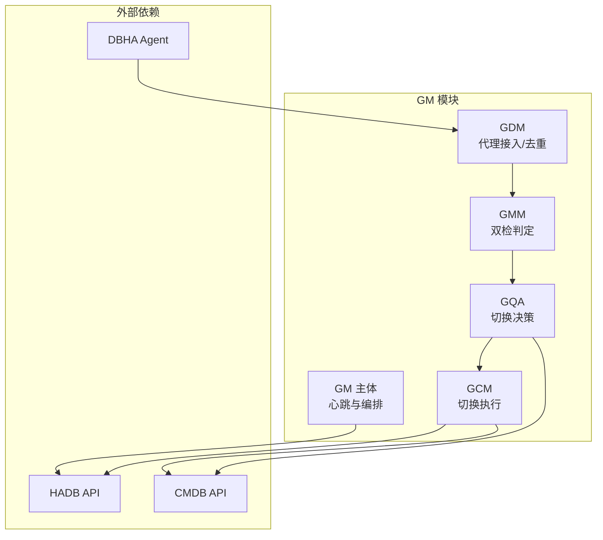
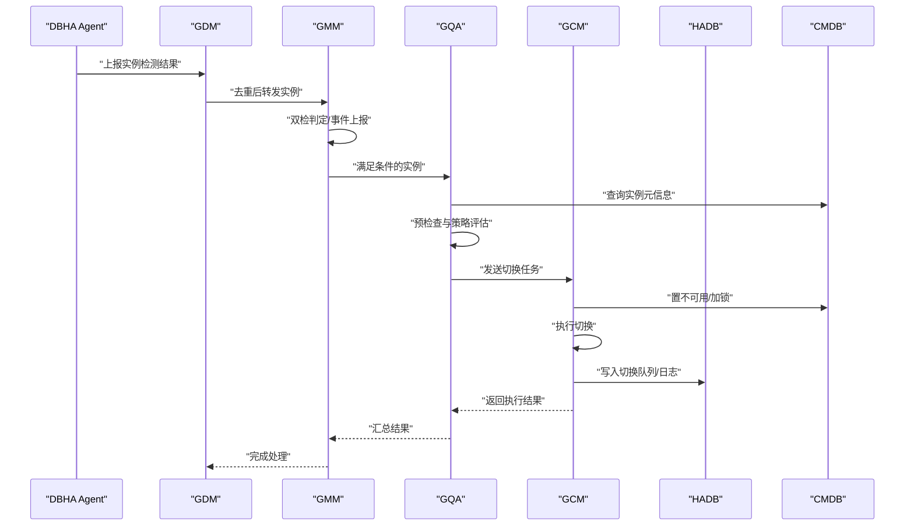
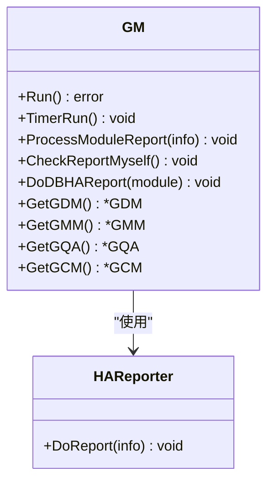
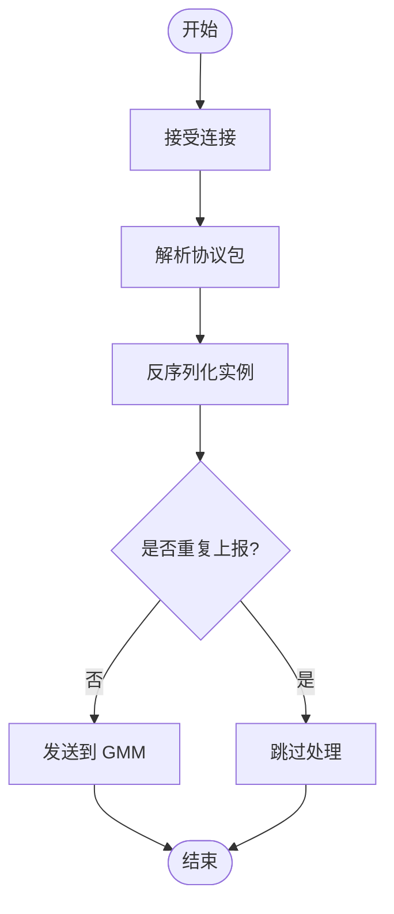
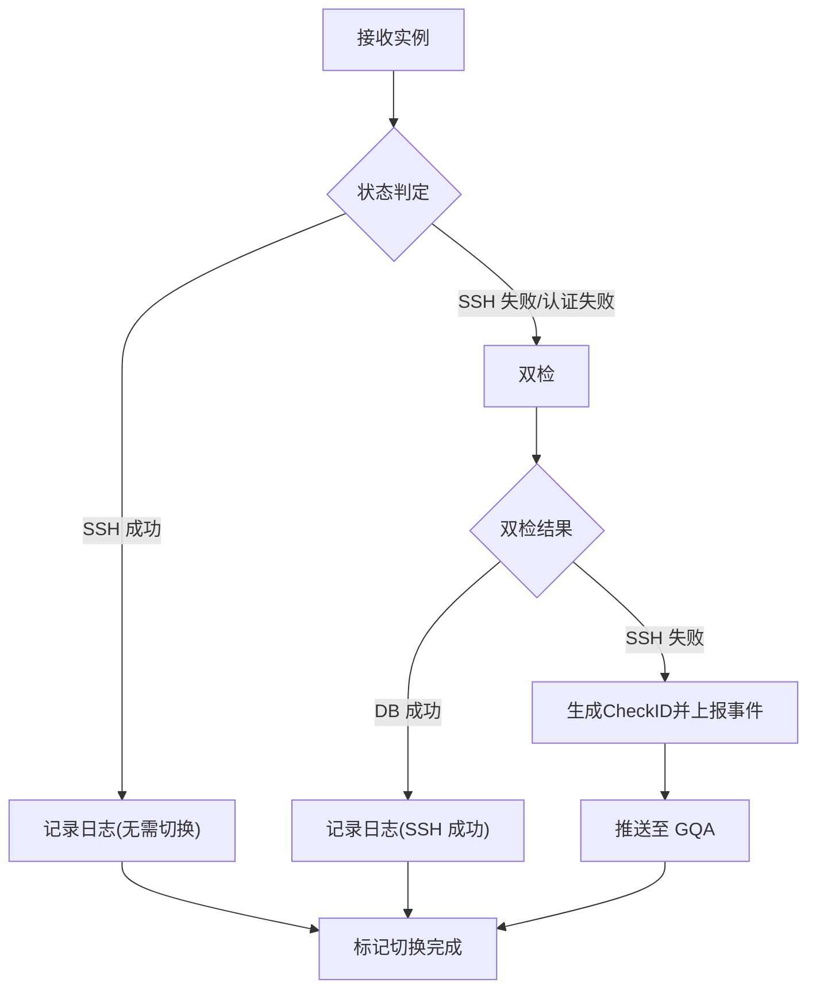
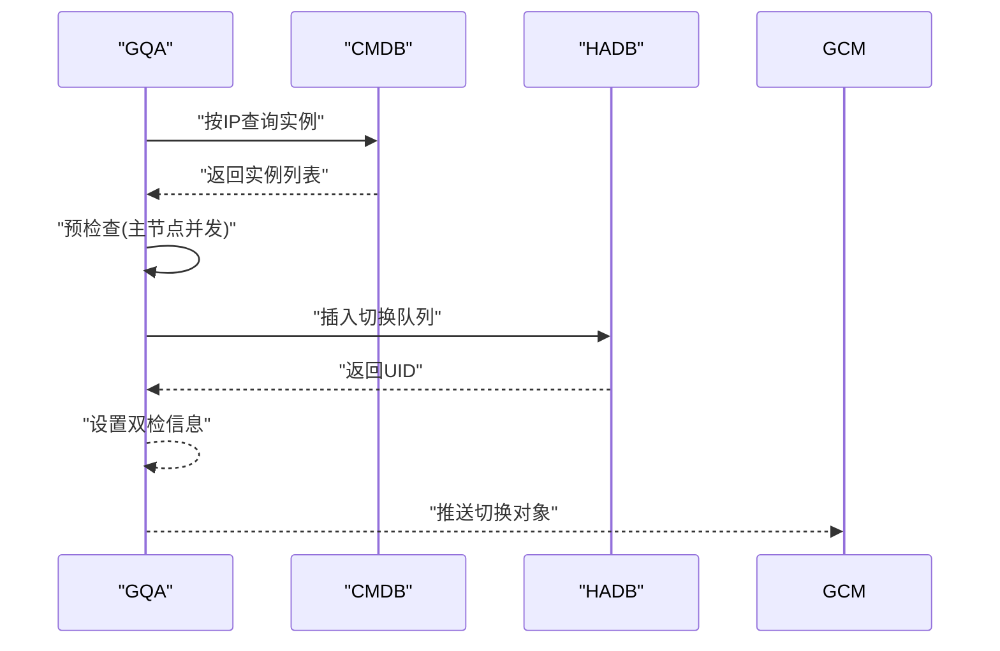
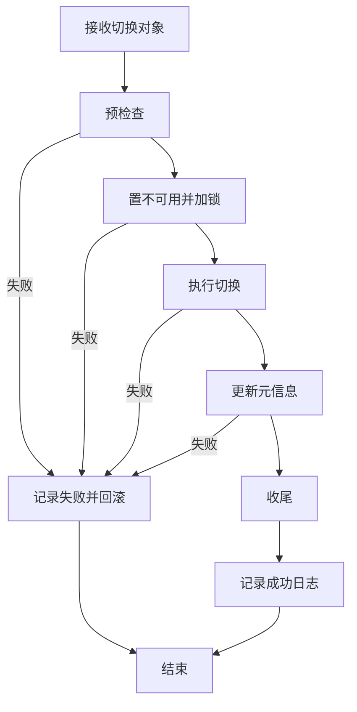
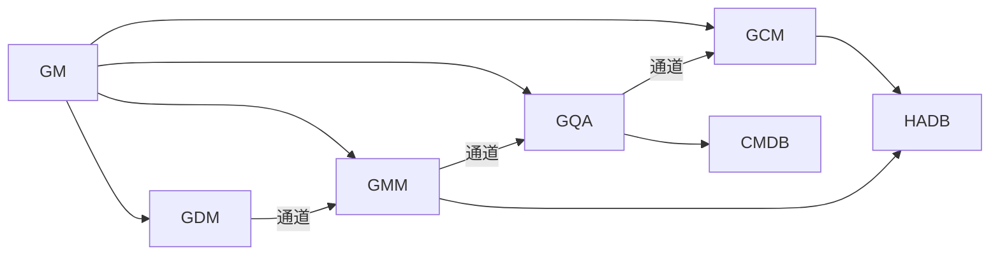

# 全局管理器

<cite>
**本文引用的文件**
- [gm.go](file://dbm-services/common/dbha/ha-module/gm/gm.go)
- [gdm.go](file://dbm-services/common/dbha/ha-module/gm/gdm.go)
- [gmm.go](file://dbm-services/common/dbha/ha-module/gm/gmm.go)
- [gqa.go](file://dbm-services/common/dbha/ha-module/gm/gqa.go)
- [gcm.go](file://dbm-services/common/dbha/ha-module/gm/gcm.go)
- [connection.go](file://dbm-services/common/dbha/ha-module/gm/connection.go)
- [config.go](file://dbm-services/common/dbha/ha-module/config/config.go)
- [client.go](file://dbm-services/common/dbha/ha-module/client/client.go)
- [service.yaml](file://helm-charts/bk-dbm/charts/db-dbha/templates/service.yaml)
</cite>

## 目录
1. [简介](#简介)
2. [项目结构](#项目结构)
3. [核心组件](#核心组件)
4. [架构总览](#架构总览)
5. [详细组件分析](#详细组件分析)
6. [依赖关系分析](#依赖关系分析)
7. [性能考量](#性能考量)
8. [故障排查指南](#故障排查指南)
9. [结论](#结论)
10. [附录](#附录)

## 简介
本文件系统化梳理全局管理器（GM）的设计与实现，覆盖其在高可用切换中的关键角色：集群状态感知、双检判定、决策与协调、以及执行与回滚。GM通过模块化流水线（GDM → GMM → GQA → GCM）实现“采集-判定-决策-执行”的闭环，结合心跳上报与元数据队列，保障切换过程的可观测性与一致性。

## 项目结构
- GM位于 dbm-services/common/dbha/ha-module/gm 下，包含 GM 主体与四大子模块：GDM（代理接入）、GMM（双检判定）、GQA（切换决策）、GCM（切换执行）。
- 配置与客户端封装分别位于 config 与 client 目录，提供 YAML 解析、校验、API 客户端与重试等能力。
- Helm Chart 中定义了 GM 的 Service 暴露端口，便于外部访问与服务发现。

图表来源
- [gm.go:38-70](file://dbm-services/common/dbha/ha-module/gm/gm.go#L38-L70)
- [gdm.go:14-41](file://dbm-services/common/dbha/ha-module/gm/gdm.go#L14-L41)
- [gmm.go:14-35](file://dbm-services/common/dbha/ha-module/gm/gmm.go#L14-L35)
- [gqa.go:20-57](file://dbm-services/common/dbha/ha-module/gm/gqa.go#L20-L57)
- [gcm.go:17-43](file://dbm-services/common/dbha/ha-module/gm/gcm.go#L17-L43)

章节来源
- [gm.go:1-208](file://dbm-services/common/dbha/ha-module/gm/gm.go#L1-L208)
- [gdm.go:1-167](file://dbm-services/common/dbha/ha-module/gm/gdm.go#L1-L167)
- [gmm.go:1-167](file://dbm-services/common/dbha/ha-module/gm/gmm.go#L1-L167)
- [gqa.go:1-274](file://dbm-services/common/dbha/ha-module/gm/gqa.go#L1-L274)
- [gcm.go:1-279](file://dbm-services/common/dbha/ha-module/gm/gcm.go#L1-L279)
- [config.go:1-302](file://dbm-services/common/dbha/ha-module/config/config.go#L1-L302)
- [client.go:1-341](file://dbm-services/common/dbha/ha-module/client/client.go#L1-L341)
- [service.yaml:1-17](file://helm-charts/bk-dbm/charts/db-dbha/templates/service.yaml#L1-L17)

## 核心组件
- GM 主体：负责模块初始化、注册、心跳上报与定时调度；对外暴露获取各子模块句柄的能力。
- GDM：监听本地端口，解析 Agent 报告的协议包，去重后转发至 GMM。
- GMM：根据检测状态进行双检或直接报告；对需要双检的实例生成 CheckID 并上报事件。
- GQA：从 CMDB 获取实例详情，预检查并决定是否允许切换，向 GCM 发送切换任务。
- GCM：执行切换流程（预检查、加锁置不可用、执行切换、更新元信息、收尾），失败时回滚并记录日志。

章节来源
- [gm.go:38-141](file://dbm-services/common/dbha/ha-module/gm/gm.go#L38-L141)
- [gdm.go:14-84](file://dbm-services/common/dbha/ha-module/gm/gdm.go#L14-L84)
- [gmm.go:14-61](file://dbm-services/common/dbha/ha-module/gm/gmm.go#L14-L61)
- [gqa.go:20-100](file://dbm-services/common/dbha/ha-module/gm/gqa.go#L20-L100)
- [gcm.go:17-64](file://dbm-services/common/dbha/ha-module/gm/gcm.go#L17-L64)

## 架构总览
GM 采用“模块化流水线 + 心跳上报”的架构：
- 数据流：Agent → GDM → GMM → GQA → GCM → HADB/CMDB。
- 控制流：GM 定时触发模块心跳上报；各模块按 ReportInterval 周期上报自身健康。
- 决策流：GQA 在 CMDB 获取上下文后做预检查与限流策略评估，再进入执行阶段。

图表来源
- [connection.go:215-241](file://dbm-services/common/dbha/ha-module/gm/connection.go#L215-L241)
- [gdm.go:67-84](file://dbm-services/common/dbha/ha-module/gm/gdm.go#L67-L84)
- [gmm.go:63-166](file://dbm-services/common/dbha/ha-module/gm/gmm.go#L63-L166)
- [gqa.go:102-166](file://dbm-services/common/dbha/ha-module/gm/gqa.go#L102-L166)
- [gcm.go:59-169](file://dbm-services/common/dbha/ha-module/gm/gcm.go#L59-L169)

## 详细组件分析

### GM 主体与编排
- 初始化：创建各模块通道与 Reporter，构建 GDM/GMM/GQA/GCM 实例。
- 注册：向 HADB 注册 GM 与其他模块的服务信息，便于服务发现与心跳上报。
- 运行：并发启动各模块协程；定时循环处理模块上报与自检心跳。

图表来源
- [gm.go:38-183](file://dbm-services/common/dbha/ha-module/gm/gm.go#L38-L183)

章节来源
- [gm.go:50-121](file://dbm-services/common/dbha/ha-module/gm/gm.go#L50-L121)

### GDM：代理接入与去重
- 监听端口接收 Agent 报告，解析协议包，反序列化为数据库实例对象。
- 去重缓存：基于 IP 与状态判断重复上报，避免重复处理；定期清理过期缓存。
- 转发：将有效实例推送到 GMM 通道。

图表来源
- [connection.go:91-205](file://dbm-services/common/dbha/ha-module/gm/connection.go#L91-L205)
- [gdm.go:126-151](file://dbm-services/common/dbha/ha-module/gm/gdm.go#L126-L151)

章节来源
- [gdm.go:43-84](file://dbm-services/common/dbha/ha-module/gm/gdm.go#L43-L84)
- [connection.go:53-90](file://dbm-services/common/dbha/ha-module/gm/connection.go#L53-L90)

### GMM：双检判定与事件上报
- 根据检测状态分支处理：
  - 成功：记录日志，无需切换。
  - 失败/认证失败：触发双检；双检成功则记录日志；双检失败则生成 CheckID 并上报事件，随后推送至 GQA。
- 与 HADB 交互：插入粗粒度日志与详细日志，支持事件上报。

图表来源
- [gmm.go:63-166](file://dbm-services/common/dbha/ha-module/gm/gmm.go#L63-L166)

章节来源
- [gmm.go:63-166](file://dbm-services/common/dbha/ha-module/gm/gmm.go#L63-L166)

### GQA：切换决策与预检查
- 从 CMDB 获取实例元信息，组装为可执行切换对象。
- 预检查：针对主节点进行并发检查，汇总失败原因；对不符合条件的实例设置检查键值。
- 插入切换队列：写入 HADB 切换队列，携带双检信息与时间戳。
- 推送：将满足条件的实例推送到 GCM。

图表来源
- [gqa.go:76-166](file://dbm-services/common/dbha/ha-module/gm/gqa.go#L76-L166)
- [gqa.go:227-273](file://dbm-services/common/dbha/ha-module/gm/gqa.go#L227-L273)

章节来源
- [gqa.go:102-166](file://dbm-services/common/dbha/ha-module/gm/gqa.go#L102-L166)
- [gqa.go:168-212](file://dbm-services/common/dbha/ha-module/gm/gqa.go#L168-L212)

### GCM：切换执行与回滚
- 流程：预检查 → 加锁置不可用 → 执行切换 → 更新元信息 → 收尾。
- 日志与监控：记录切换日志、发送监控事件；失败时回滚并更新队列状态。
- 队列与日志：统一写入 HADB 切换队列与日志表，保证可观测性。

图表来源
- [gcm.go:59-169](file://dbm-services/common/dbha/ha-module/gm/gcm.go#L59-L169)

章节来源
- [gcm.go:59-169](file://dbm-services/common/dbha/ha-module/gm/gcm.go#L59-L169)

### 配置与客户端
- 配置解析：YAML 文件解析为 Config 结构体，含日志、GM、DB、SSH、监控、时区等配置项；提供校验与默认值处理。
- 客户端封装：HTTP 客户端具备重试、随机目标选择、超时控制与响应解析；支持多 API 地址轮询。

章节来源
- [config.go:17-302](file://dbm-services/common/dbha/ha-module/config/config.go#L17-L302)
- [client.go:30-341](file://dbm-services/common/dbha/ha-module/client/client.go#L30-L341)

## 依赖关系分析
- 组件耦合：GM 对各子模块存在组合关系；子模块之间通过通道解耦，形成流水线。
- 外部依赖：HADB 与 CMDB 提供心跳上报、切换队列与实例元信息；Agent 作为上游数据源。
- 错误传播：GCM 在失败时回滚并记录日志，GQA/GMM 通过 HADB 记录事件，便于追踪。

图表来源
- [gm.go:65-69](file://dbm-services/common/dbha/ha-module/gm/gm.go#L65-L69)
- [gdm.go:80-84](file://dbm-services/common/dbha/ha-module/gm/gdm.go#L80-L84)
- [gmm.go:120-137](file://dbm-services/common/dbha/ha-module/gm/gmm.go#L120-L137)
- [gqa.go:168-212](file://dbm-services/common/dbha/ha-module/gm/gqa.go#L168-L212)
- [gcm.go:171-217](file://dbm-services/common/dbha/ha-module/gm/gcm.go#L171-L217)

章节来源
- [gm.go:65-121](file://dbm-services/common/dbha/ha-module/gm/gm.go#L65-L121)

## 性能考量
- 并发模型：GQA 对主节点检查采用 WaitGroup 并发，提升吞吐；GCM 使用 goroutine 执行单次切换，避免阻塞。
- 缓存与去重：GDM 的去重缓存减少重复处理；GQA 的 IDC 与全局切换限速避免资源抖动。
- 网络与重试：客户端具备指数退避与多地址轮询，提高可用性。
- 心跳周期：合理的 ReportInterval 平衡实时性与开销。

## 故障排查指南
- Agent 协议解析失败
  - 现象：GDM 解析报错或丢弃包。
  - 排查：检查 Agent 与 GDM 的协议头、类型长度、包体大小是否越界；确认 DetectType 是否在回调映射中。
- 双检失败未推进
  - 现象：GMM 生成 CheckID 后未见 GQA 推进。
  - 排查：确认 GMM 是否正确上报事件；检查 GQA 从 CMDB 获取实例是否为空；核对预检查失败原因。
- 切换执行失败回滚
  - 现象：GCM 记录失败并回滚。
  - 排查：查看切换日志与监控事件；确认置不可用/加锁是否成功；检查执行阶段错误并定位具体步骤。
- 心跳上报异常
  - 现象：HADB 侧未收到心跳。
  - 排查：检查 GM/HADB 注册与 Reporter 调用；确认 ReportInterval 设置合理。

章节来源
- [connection.go:91-205](file://dbm-services/common/dbha/ha-module/gm/connection.go#L91-L205)
- [gmm.go:112-137](file://dbm-services/common/dbha/ha-module/gm/gmm.go#L112-L137)
- [gqa.go:117-124](file://dbm-services/common/dbha/ha-module/gm/gqa.go#L117-L124)
- [gcm.go:135-148](file://dbm-services/common/dbha/ha-module/gm/gcm.go#L135-L148)
- [gm.go:175-183](file://dbm-services/common/dbha/ha-module/gm/gm.go#L175-L183)

## 结论
GM 通过 GDM/GMM/GQA/GCM 的模块化协作，实现了从“状态采集-双检判定-决策评估-执行回滚”的完整高可用切换链路。其心跳上报与日志/队列写入确保了可观测性与一致性；配置与客户端封装提供了灵活的部署与容错能力。在生产环境中，建议结合 IDC/主机限速策略与合理的 ReportInterval，以获得更优的稳定性与性能。

## 附录

### 配置参数清单（节选）
- 日志配置：日志路径、级别、滚动参数等。
- Agent 配置：城市/园区/云 ID、哈希分片、上报间隔、最大并发等。
- GM 配置：城市/园区/云 ID、本地 IP、监听端口、上报间隔、GDM/GQA/GCM 子配置。
- DB/SSH/监控/时区/密码服务等：对应各组件的连接与鉴权参数。

章节来源
- [config.go:41-302](file://dbm-services/common/dbha/ha-module/config/config.go#L41-L302)

### 管理接口与操作命令（概念性说明）
- 心跳上报：GM/HADB 注册与定时心跳。
- 切换队列：插入/更新切换队列与日志。
- 实例状态：置不可用/加锁、回滚与收尾。
- 事件上报：双检失败/认证失败等事件写入 HADB。

章节来源
- [gm.go:73-121](file://dbm-services/common/dbha/ha-module/gm/gm.go#L73-L121)
- [gcm.go:171-278](file://dbm-services/common/dbha/ha-module/gm/gcm.go#L171-L278)

### 部署与监控
- Service 暴露：Helm Chart 中定义 GM Service 端口，便于集群内访问。
- 监控：GQA/GMM 在关键路径上报事件与日志，便于集中监控。

章节来源
- [service.yaml:1-17](file://helm-charts/bk-dbm/charts/db-dbha/templates/service.yaml#L1-L17)