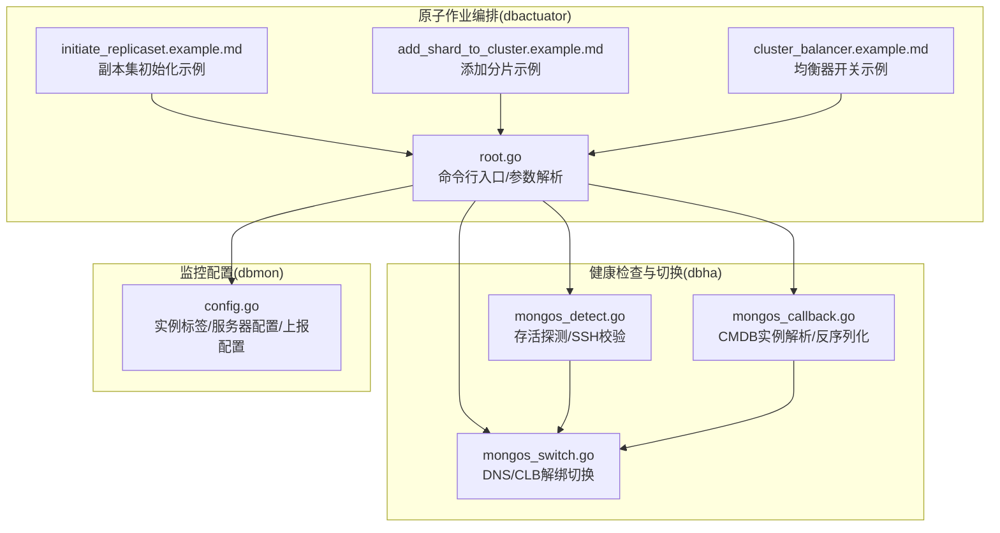
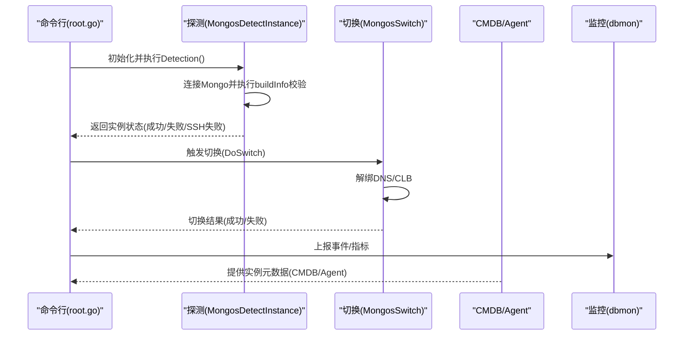
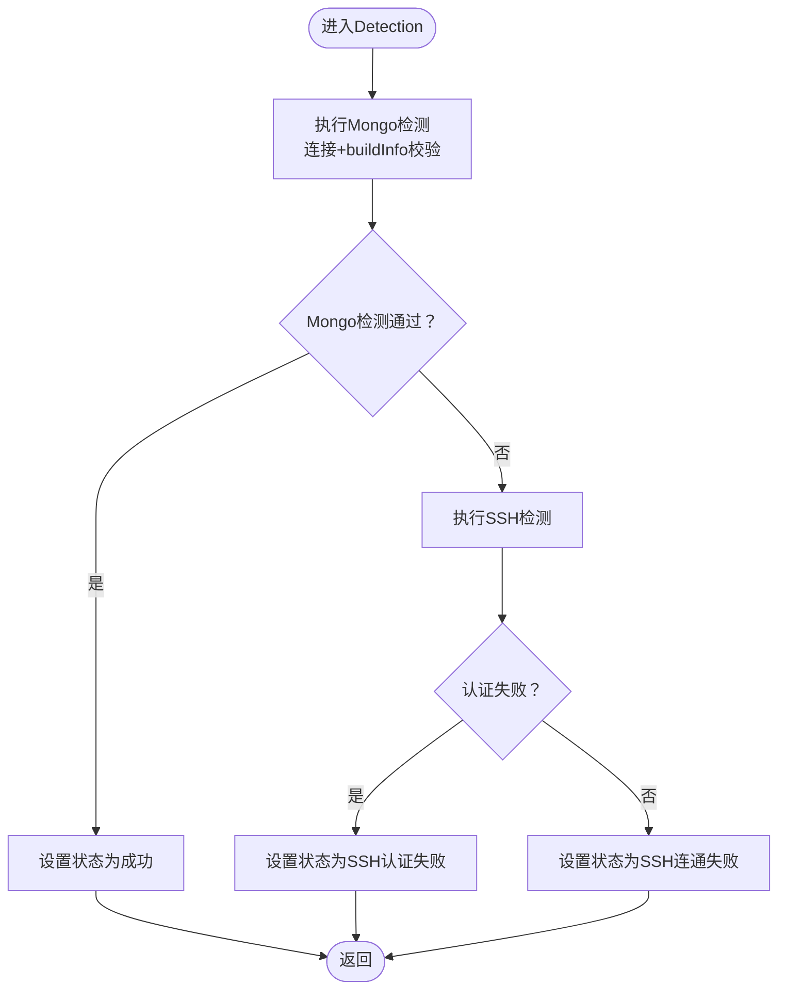
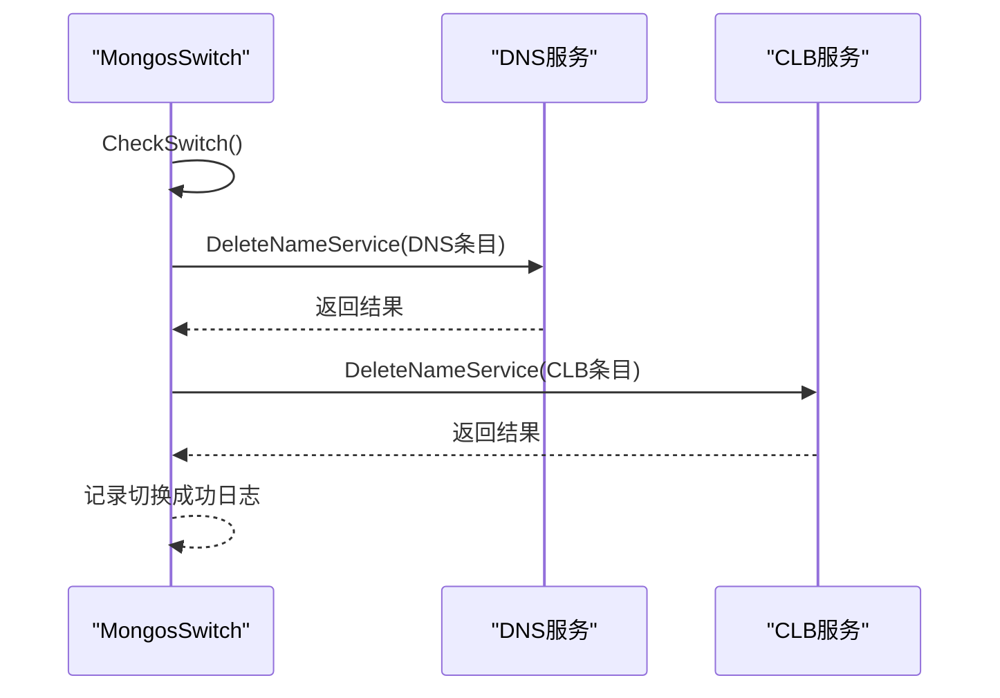
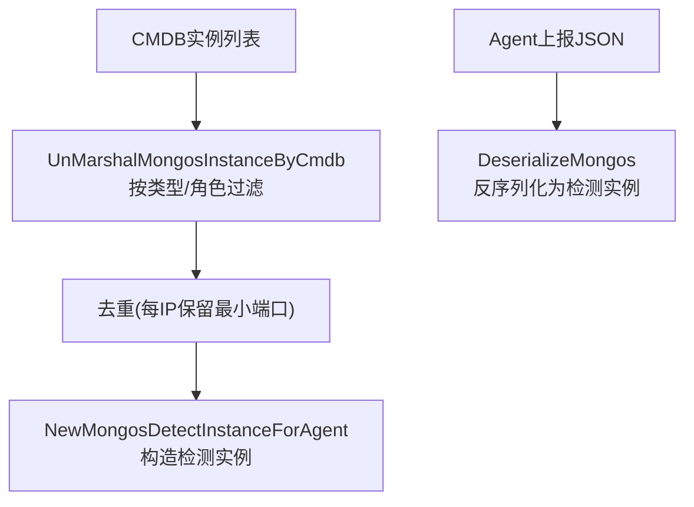
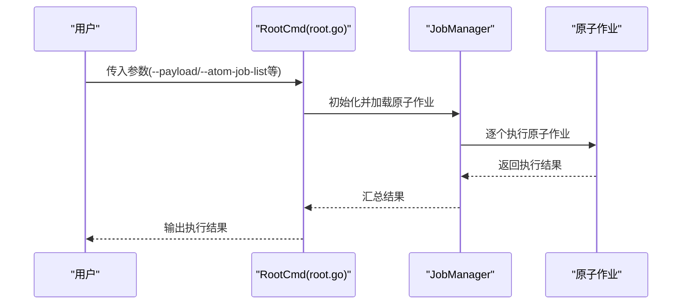
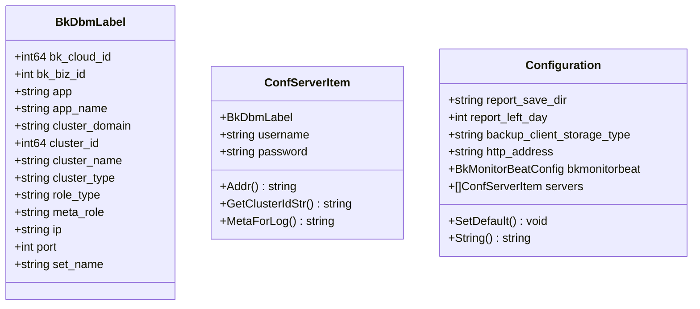
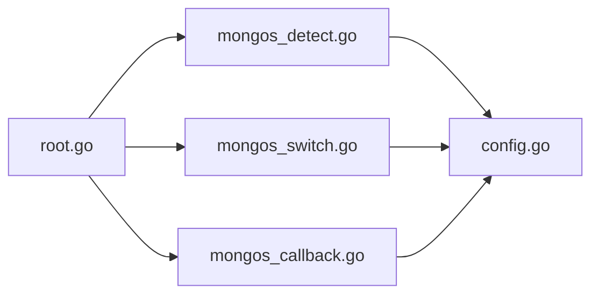

# MongoDB高可用

<cite>
**本文引用的文件**
- [mongos_detect.go](file://dbm-services/common/dbha/ha-module/dbmodule/mongodb/mongos_detect.go)
- [mongos_switch.go](file://dbm-services/common/dbha/ha-module/dbmodule/mongodb/mongos_switch.go)
- [mongos_callback.go](file://dbm-services/common/dbha/ha-module/dbmodule/mongodb/mongos_callback.go)
- [root.go](file://dbm-services/mongodb/db-tools/dbactuator/cmd/root.go)
- [initiate_replicaset.example.md](file://dbm-services/mongodb/db-tools/dbactuator/example/initiate_replicaset.example.md)
- [add_shard_to_cluster.example.md](file://dbm-services/mongodb/db-tools/dbactuator/example/add_shard_to_cluster.example.md)
- [cluster_balancer.example.md](file://dbm-services/mongodb/db-tools/dbactuator/example/cluster_balancer.example.md)
- [config.go](file://dbm-services/mongodb/db-tools/dbmon/config/config.go)
</cite>

## 目录
1. [引言](#引言)
2. [项目结构](#项目结构)
3. [核心组件](#核心组件)
4. [架构总览](#架构总览)
5. [详细组件分析](#详细组件分析)
6. [依赖关系分析](#依赖关系分析)
7. [性能考虑](#性能考虑)
8. [故障排查指南](#故障排查指南)
9. [结论](#结论)
10. [附录](#附录)

## 引言
本文件面向MongoDB高可用场景，系统性梳理副本集与分片集群的高可用机制与工程实现，覆盖主节点故障检测、仲裁节点作用、数据同步策略；阐述配置参数、监控指标与成员状态管理；解释副本集选举机制、写关注与读偏好设置；并提供部署配置、性能优化与故障恢复策略，以及分片集群路由节点管理与数据分布策略的实现细节。

## 项目结构
围绕MongoDB高可用，本仓库在以下模块中提供了关键能力：
- 健康检查与切换（dbha）：对mongos实例进行存活探测、SSH连通性校验、DNS/CLB解绑等切换操作。
- 原子作业编排（dbactuator）：通过命令行入口执行副本集初始化、添加分片、启停均衡器等原子任务。
- 监控配置（dbmon）：定义实例标签、服务器注册、事件与指标上报配置，支撑高可用监控与告警。

**图表来源**
- [mongos_detect.go:110-173](file://dbm-services/common/dbha/ha-module/dbmodule/mongodb/mongos_detect.go#L110-L173)
- [mongos_switch.go:72-92](file://dbm-services/common/dbha/ha-module/dbmodule/mongodb/mongos_switch.go#L72-L92)
- [mongos_callback.go:28-60](file://dbm-services/common/dbha/ha-module/dbmodule/mongodb/mongos_callback.go#L28-L60)
- [root.go:88-126](file://dbm-services/mongodb/db-tools/dbactuator/cmd/root.go#L88-L126)
- [config.go:84-94](file://dbm-services/mongodb/db-tools/dbmon/config/config.go#L84-L94)

**章节来源**
- [mongos_detect.go:1-204](file://dbm-services/common/dbha/ha-module/dbmodule/mongodb/mongos_detect.go#L1-L204)
- [mongos_switch.go:1-125](file://dbm-services/common/dbha/ha-module/dbmodule/mongodb/mongos_switch.go#L1-L125)
- [mongos_callback.go:1-158](file://dbm-services/common/dbha/ha-module/dbmodule/mongodb/mongos_callback.go#L1-L158)
- [root.go:1-285](file://dbm-services/mongodb/db-tools/dbactuator/cmd/root.go#L1-L285)
- [config.go:1-111](file://dbm-services/mongodb/db-tools/dbmon/config/config.go#L1-L111)

## 核心组件
- MongosDetectInstance：负责对mongos实例进行Mongo连接与版本校验，同时进行SSH可达性检查，判定实例存活状态。
- MongosSwitch：封装mongos实例切换流程，包括DNS/CLB解绑、状态报告与回滚占位。
- NewMongosInstanceByCmDB/DeserializeMongos/NewMongosSwitchInstance：从CMDB或Agent上报数据中解析出可检测/切换的实例集合。
- dbactuator命令行入口：统一加载原子作业，支持副本集初始化、添加分片、启停均衡器等运维动作。
- dbmon配置：定义实例标签、服务器列表与上报配置，支撑监控采集与事件上报。

**章节来源**
- [mongos_detect.go:23-107](file://dbm-services/common/dbha/ha-module/dbmodule/mongodb/mongos_detect.go#L23-L107)
- [mongos_switch.go:16-97](file://dbm-services/common/dbha/ha-module/dbmodule/mongodb/mongos_switch.go#L16-L97)
- [mongos_callback.go:27-114](file://dbm-services/common/dbha/ha-module/dbmodule/mongodb/mongos_callback.go#L27-L114)
- [root.go:88-126](file://dbm-services/mongodb/db-tools/dbactuator/cmd/root.go#L88-L126)
- [config.go:84-94](file://dbm-services/mongodb/db-tools/dbmon/config/config.go#L84-L94)

## 架构总览
下图展示从命令行到具体高可用动作的调用链路，以及健康检查与切换在整体中的位置。

**图表来源**
- [root.go:88-126](file://dbm-services/mongodb/db-tools/dbactuator/cmd/root.go#L88-L126)
- [mongos_detect.go:110-173](file://dbm-services/common/dbha/ha-module/dbmodule/mongodb/mongos_detect.go#L110-L173)
- [mongos_switch.go:72-92](file://dbm-services/common/dbha/ha-module/dbmodule/mongodb/mongos_switch.go#L72-L92)
- [config.go:84-94](file://dbm-services/mongodb/db-tools/dbmon/config/config.go#L84-L94)

## 详细组件分析

### 组件A：Mongos实例健康检测
- 功能要点
  - 使用Mongo客户端连接目标实例，执行构建信息查询以验证服务可用性与版本格式。
  - 若Mongo连接失败，则尝试SSH连通性校验，区分认证失败与连通性失败。
  - 将检测结果映射为统一状态码，便于上层决策。
- 关键流程
  - Detection()：统一入口，先做Mongo检测，再做SSH检测。
  - CheckMongo()：建立Mongo连接并执行buildInfo命令，匹配版本正则。
  - CheckSSH()：通过远程命令触达目标路径，验证SSH连通性。
- 状态管理
  - 成功/失败/SSH认证失败/SSH连通失败等状态码由常量定义，贯穿检测与切换模块。

**图表来源**
- [mongos_detect.go:110-173](file://dbm-services/common/dbha/ha-module/dbmodule/mongodb/mongos_detect.go#L110-L173)

**章节来源**
- [mongos_detect.go:109-173](file://dbm-services/common/dbha/ha-module/dbmodule/mongodb/mongos_detect.go#L109-L173)

### 组件B：Mongos实例切换
- 功能要点
  - 在切换前校验DNS绑定数量，确保至少保留一个有效IP。
  - 执行DNS与CLB解绑，完成实例摘除。
  - 提供状态报告与回滚接口占位，便于后续扩展。
- 关键流程
  - CheckSwitch()：角色校验与DNS数量校验。
  - DoSwitch()：依次解绑DNS与CLB，记录日志。
  - KickOffDns()/KickOffClb()：分别针对DNS与CLB执行删除绑定。
- 与健康检测的关系
  - 切换通常发生在检测到实例不可用或计划性迁移后，作为运维动作的一部分。

**图表来源**
- [mongos_switch.go:44-92](file://dbm-services/common/dbha/ha-module/dbmodule/mongodb/mongos_switch.go#L44-L92)

**章节来源**
- [mongos_switch.go:44-125](file://dbm-services/common/dbha/ha-module/dbmodule/mongodb/mongos_switch.go#L44-L125)

### 组件C：CMDB/Agent实例解析与反序列化
- 功能要点
  - 从CMDB提供的实例列表中筛选出mongos实例，构造可检测对象。
  - 支持从Agent上报的JSON反序列化为检测对象，便于跨模块传递。
  - 仅保留每个IP最小端口的实例，避免重复探测。
- 关键流程
  - NewMongosInstanceByCmDB()：CMDB实例转检测实例。
  - DeserializeMongos()：Agent上报JSON转检测实例。
  - UnMarshalMongosInstanceByCmdb()：按集群类型与角色过滤并去重。

**图表来源**
- [mongos_callback.go:27-157](file://dbm-services/common/dbha/ha-module/dbmodule/mongodb/mongos_callback.go#L27-L157)

**章节来源**
- [mongos_callback.go:27-158](file://dbm-services/common/dbha/ha-module/dbmodule/mongodb/mongos_callback.go#L27-L158)

### 组件D：命令行入口与原子作业
- 功能要点
  - 通过命令行参数加载原子作业，统一执行入口。
  - 支持调试模式：列出作业、查看进程、根据端口获取PID、触发副本集降级等。
  - 原子作业涵盖副本集初始化、添加分片、启停均衡器等。
- 关键流程
  - RootCmd：解析参数、初始化环境变量、加载并运行原子作业。
  - debugCmd：提供调试能力，如列出作业、打印参数、查看进程、副本集降级测试。

**图表来源**
- [root.go:88-126](file://dbm-services/mongodb/db-tools/dbactuator/cmd/root.go#L88-L126)

**章节来源**
- [root.go:88-285](file://dbm-services/mongodb/db-tools/dbactuator/cmd/root.go#L88-L285)

### 组件E：监控配置与上报
- 功能要点
  - 定义实例标签（业务、集群、角色、端口等），用于监控识别。
  - 配置服务器列表与上报配置（事件/指标DataID与Token），支撑高可用监控。
- 关键结构
  - BkDbmLabel：实例标签字段集合。
  - ConfServerItem：服务器项，包含用户名/密码。
  - Configuration：全局配置，含HTTP地址、上报配置、服务器列表等。

**图表来源**
- [config.go:10-94](file://dbm-services/mongodb/db-tools/dbmon/config/config.go#L10-L94)

**章节来源**
- [config.go:1-111](file://dbm-services/mongodb/db-tools/dbmon/config/config.go#L1-L111)

## 依赖关系分析
- 组件耦合
  - dbactuator通过命令行统一调度原子作业，与dbha的检测/切换形成互补。
  - dbha的检测/切换依赖dbmon的配置结构体进行元数据与上报配置。
  - CMDB/Agent数据经mongos_callback解析后，驱动dbha的检测与切换。
- 外部依赖
  - MongoDB官方驱动用于连接与命令执行。
  - SSH工具用于连通性校验。
  - 监控组件（事件/指标）用于上报。

**图表来源**
- [root.go:88-126](file://dbm-services/mongodb/db-tools/dbactuator/cmd/root.go#L88-L126)
- [mongos_detect.go:110-173](file://dbm-services/common/dbha/ha-module/dbmodule/mongodb/mongos_detect.go#L110-L173)
- [mongos_switch.go:72-92](file://dbm-services/common/dbha/ha-module/dbmodule/mongodb/mongos_switch.go#L72-L92)
- [mongos_callback.go:27-60](file://dbm-services/common/dbha/ha-module/dbmodule/mongodb/mongos_callback.go#L27-L60)
- [config.go:84-94](file://dbm-services/mongodb/db-tools/dbmon/config/config.go#L84-L94)

**章节来源**
- [root.go:88-126](file://dbm-services/mongodb/db-tools/dbactuator/cmd/root.go#L88-L126)
- [mongos_detect.go:110-173](file://dbm-services/common/dbha/ha-module/dbmodule/mongodb/mongos_detect.go#L110-L173)
- [mongos_switch.go:72-92](file://dbm-services/common/dbha/ha-module/dbmodule/mongodb/mongos_switch.go#L72-L92)
- [mongos_callback.go:27-60](file://dbm-services/common/dbha/ha-module/dbmodule/mongodb/mongos_callback.go#L27-L60)
- [config.go:84-94](file://dbm-services/mongodb/db-tools/dbmon/config/config.go#L84-L94)

## 性能考虑
- 探测超时与并发
  - 检测阶段采用超时控制，避免长时间阻塞；建议结合批量探测与限速策略，降低对被检实例的压力。
- SSH校验成本
  - SSH连通性校验会增加额外开销，建议在必要时启用，或在高并发场景下合并请求。
- 切换窗口与DNS/CLB更新
  - 切换时应尽量缩短DNS/CLB生效时间，减少流量中断窗口；可配合多活或多出口策略降低影响面。
- 监控上报频率
  - 合理设置上报周期与聚合粒度，避免监控风暴；对异常实例提高上报频率以快速收敛问题。

## 故障排查指南
- 常见问题定位
  - MongoDB连接失败：检查网络连通、认证信息与防火墙策略；确认buildInfo命令可执行。
  - SSH认证失败：核对密钥/口令配置；确认目标主机存在可写目录。
  - DNS/CLB解绑失败：确认域名/负载均衡配置正确，权限充足；检查解绑接口返回。
- 日志与状态
  - 检测与切换过程均记录详细日志，依据状态码判断失败原因（成功/失败/SSH认证失败/SSH连通失败）。
- 调试工具
  - 使用命令行调试模式列举作业、查看进程、按端口获取PID、触发副本集降级测试，辅助定位问题。

**章节来源**
- [mongos_detect.go:110-173](file://dbm-services/common/dbha/ha-module/dbmodule/mongodb/mongos_detect.go#L110-L173)
- [mongos_switch.go:72-92](file://dbm-services/common/dbha/ha-module/dbmodule/mongodb/mongos_switch.go#L72-L92)
- [root.go:128-214](file://dbm-services/mongodb/db-tools/dbactuator/cmd/root.go#L128-L214)

## 结论
本仓库围绕MongoDB高可用提供了从健康检测、实例切换到原子作业编排与监控配置的完整能力。通过严格的实例解析、稳健的检测与切换流程、可扩展的监控上报，能够支撑副本集与分片集群在生产环境中的高可用需求。建议在实际部署中结合业务特性完善配置参数、监控指标与演练方案，持续优化切换窗口与观测能力。

## 附录

### 副本集与分片集群高可用要点
- 副本集
  - 主节点故障检测：基于Mongo连接与版本校验，辅以SSH连通性验证。
  - 仲裁节点：在奇数节点部署中提升仲裁效率，降低脑裂风险。
  - 数据同步：通过oplog保持延迟可控，结合心跳与任期机制保障一致性。
  - 选举机制：基于优先级与投票权，确保主节点稳定与快速切换。
  - 写关注与读偏好：根据一致性与可用性需求选择w/majority/primary等写关注，读偏好设置primary/secondaryPreferred等。
- 分片集群
  - 路由节点管理：通过mongos实例的健康检测与切换，确保路由流量稳定。
  - 数据分布：通过分片键与范围/哈希策略实现数据均匀分布，结合均衡器启停控制迁移节奏。
  - 原子作业：使用dbactuator执行副本集初始化、添加分片、启停均衡器等运维动作。

**章节来源**
- [initiate_replicaset.example.md:1-32](file://dbm-services/mongodb/db-tools/dbactuator/example/initiate_replicaset.example.md#L1-L32)
- [add_shard_to_cluster.example.md:1-24](file://dbm-services/mongodb/db-tools/dbactuator/example/add_shard_to_cluster.example.md#L1-L24)
- [cluster_balancer.example.md:1-21](file://dbm-services/mongodb/db-tools/dbactuator/example/cluster_balancer.example.md#L1-L21)