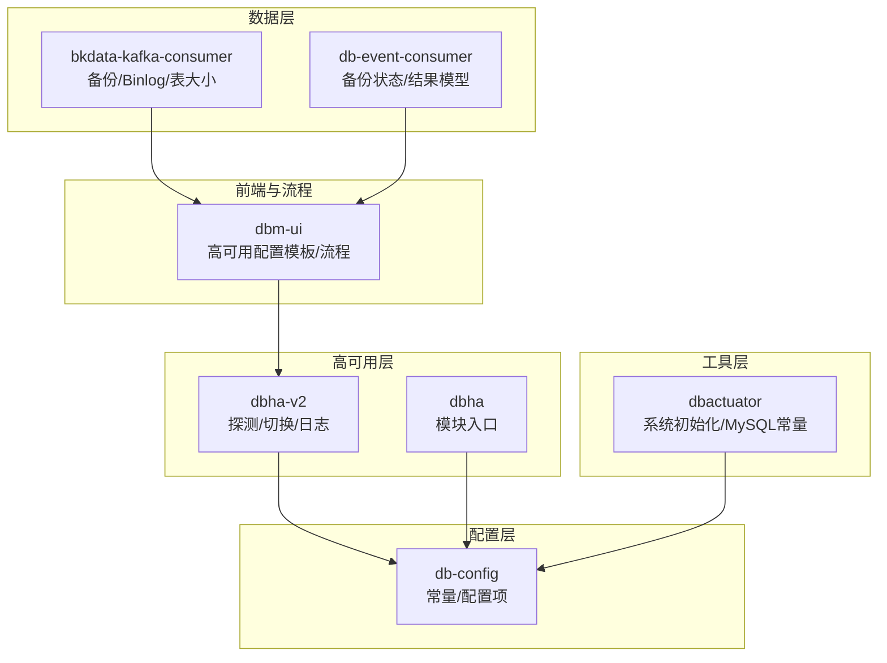
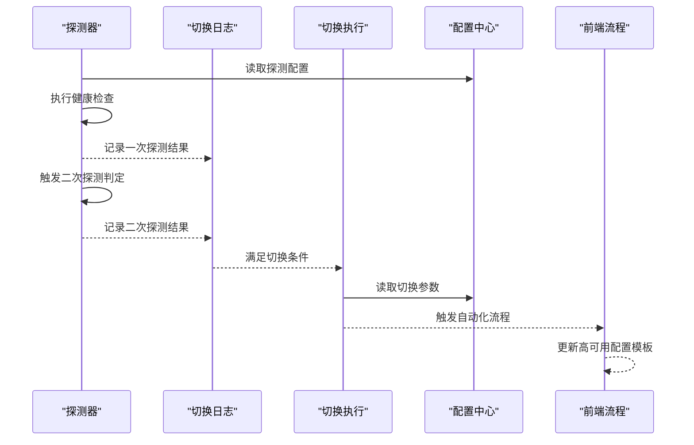
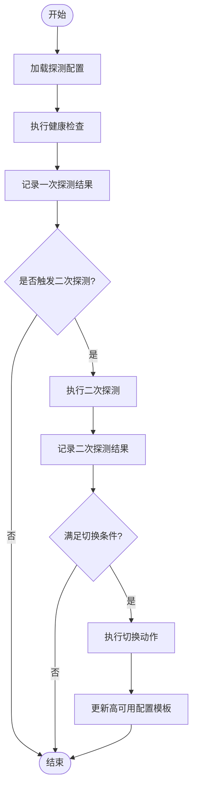
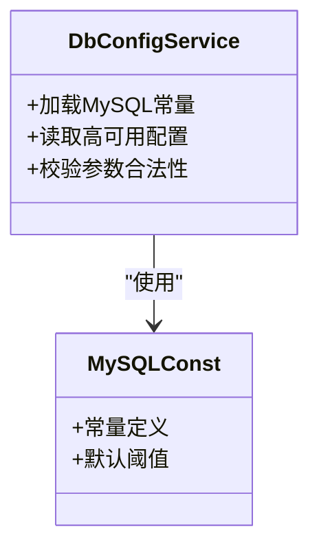
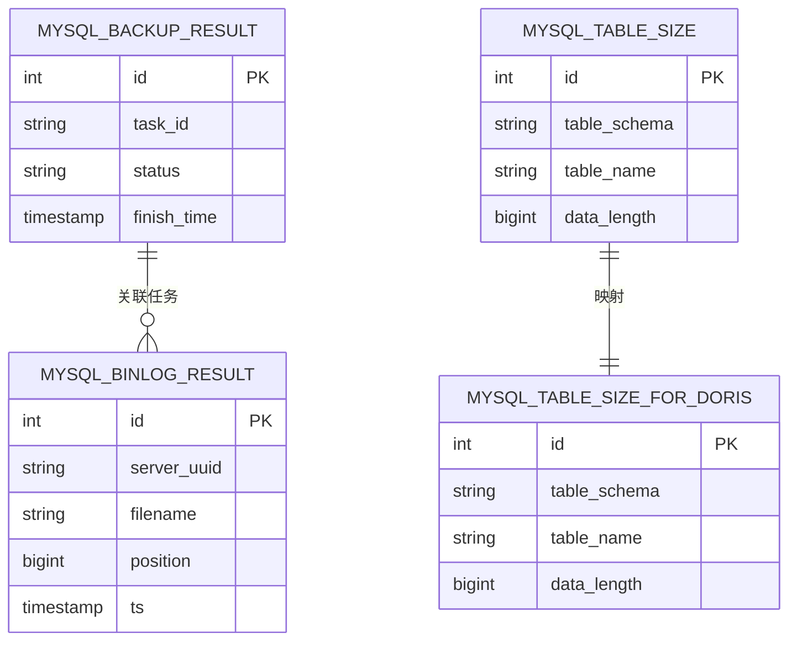
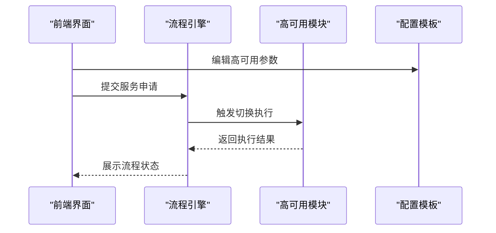
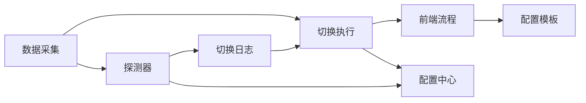

# MySQL高可用

<cite>
**本文引用的文件**
- [dbha.go](file://dbm-services/common/dbha/ha-module/dbha.go)
- [dbha.go](file://dbm-services/common/dbha-v2/internal/analysis/switcher/switchlogger/dbhandler.go)
- [dbha.go](file://dbm-services/common/dbha-v2/etc/dbha-v2.probe.rc.example)
- [dbha.go](file://dbm-services/common/dbha-v2/etc/dbha-v2.server.rc.example)
- [dbha.go](file://dbm-services/common/db-config/internal/service/dbha/dbha.go)
- [dbha.py](file://dbm-ui/backend/db_proxy/container/dbha/dbha-conf-tpl.yaml)
- [dbha_service_flow.py](file://dbm-ui/backend/flow/engine/bamboo/scene/cloud/dbha_service_flow.py)
- [mysql.go](file://dbm-services/bigdata/db-tools/dbactuator/pkg/core/cst/mysql.go)
- [mysql.go](file://dbm-services/common/db-config/internal/pkg/cst/mysql.go)
- [mysql.go](file://dbm-services/common/db-config/pkg/constvar/mysql.go)
- [mysql_backup_result.go](file://dbm-services/common/bkdata-kafka-consumer/pkg/consumer/mysql_backup_result.go)
- [mysql_binlog_result.go](file://dbm-services/common/bkdata-kafka-consumer/pkg/consumer/mysql_binlog_result.go)
- [mysql_table_size.go](file://dbm-services/common/bkdata-kafka-consumer/pkg/consumer/mysql_table_size.go)
- [mysql_table_size_for_doris.go](file://dbm-services/common/bkdata-kafka-consumer/pkg/consumer/mysql_table_size_for_doris.go)
- [mysql_backup_result.go](file://dbm-services/common/db-event-consumer/pkg/model/mysql_backup_result.go)
- [mysql_backup_status.go](file://dbm-services/common/db-event-consumer/pkg/model/mysql_backup_status.go)
- [mysql_binlog_result.go](file://dbm-services/common/db-event-consumer/pkg/model/mysql_binlog_result.go)
</cite>

## 目录
1. [引言](#引言)
2. [项目结构](#项目结构)
3. [核心组件](#核心组件)
4. [架构总览](#架构总览)
5. [详细组件分析](#详细组件分析)
6. [依赖关系分析](#依赖关系分析)
7. [性能考虑](#性能考虑)
8. [故障排查指南](#故障排查指南)
9. [结论](#结论)
10. [附录](#附录)

## 引言
本文件面向MySQL高可用实现，系统性梳理主从复制架构下的高可用机制，覆盖主节点故障检测、自动切换流程与数据同步策略；详解配置参数、监控指标与切换条件判断；解释延迟检测、半同步复制与GTID机制；并给出部署配置、性能优化与故障恢复策略。同时，结合仓库中的高可用开关与探测配置，说明在实际系统中如何落地“健康探测—二次探测—切换执行”的完整链路。

## 项目结构
围绕MySQL高可用，本仓库的关键模块与文件分布如下：
- 高可用探测与切换（dbha/dbha-v2）：负责心跳探测、二次探测、切换日志与执行流程
- 配置中心与常量（db-config）：提供MySQL相关常量与配置项定义
- 工具与安装脚本（dbactuator）：包含MySQL相关初始化与系统初始化脚本
- 数据采集与事件消费（bkdata-kafka-consumer/db-event-consumer）：提供备份、Binlog与表大小等数据模型与消费逻辑
- 前端与流程编排（dbm-ui）：提供高可用配置模板、服务流程与告警模板

图示来源
- [dbha.go](file://dbm-services/common/dbha/ha-module/dbha.go)
- [dbha.go](file://dbm-services/common/dbha-v2/internal/analysis/switcher/switchlogger/dbhandler.go)
- [dbha.go](file://dbm-services/common/db-config/internal/service/dbha/dbha.go)
- [mysql.go](file://dbm-services/bigdata/db-tools/dbactuator/pkg/core/cst/mysql.go)
- [mysql.go](file://dbm-services/common/db-config/internal/pkg/cst/mysql.go)
- [mysql.go](file://dbm-services/common/db-config/pkg/constvar/mysql.go)
- [mysql_backup_result.go](file://dbm-services/common/bkdata-kafka-consumer/pkg/consumer/mysql_backup_result.go)
- [mysql_binlog_result.go](file://dbm-services/common/bkdata-kafka-consumer/pkg/consumer/mysql_binlog_result.go)
- [mysql_table_size.go](file://dbm-services/common/bkdata-kafka-consumer/pkg/consumer/mysql_table_size.go)
- [mysql_table_size_for_doris.go](file://dbm-services/common/bkdata-kafka-consumer/pkg/consumer/mysql_table_size_for_doris.go)
- [mysql_backup_result.go](file://dbm-services/common/db-event-consumer/pkg/model/mysql_backup_result.go)
- [mysql_backup_status.go](file://dbm-services/common/db-event-consumer/pkg/model/mysql_backup_status.go)
- [mysql_binlog_result.go](file://dbm-services/common/db-event-consumer/pkg/model/mysql_binlog_result.go)
- [dbha_conf_tpl.yaml](file://dbm-ui/backend/db_proxy/container/dbha/dbha-conf-tpl.yaml)
- [dbha_service_flow.py](file://dbm-ui/backend/flow/engine/bamboo/scene/cloud/dbha_service_flow.py)

章节来源
- [dbha.go](file://dbm-services/common/dbha/ha-module/dbha.go)
- [dbha.go](file://dbm-services/common/dbha-v2/etc/dbha-v2.probe.rc.example)
- [dbha.go](file://dbm-services/common/dbha-v2/etc/dbha-v2.server.rc.example)
- [dbha.go](file://dbm-services/common/db-config/internal/service/dbha/dbha.go)
- [mysql.go](file://dbm-services/bigdata/db-tools/dbactuator/pkg/core/cst/mysql.go)
- [mysql.go](file://dbm-services/common/db-config/internal/pkg/cst/mysql.go)
- [mysql.go](file://dbm-services/common/db-config/pkg/constvar/mysql.go)
- [mysql_backup_result.go](file://dbm-services/common/bkdata-kafka-consumer/pkg/consumer/mysql_backup_result.go)
- [mysql_binlog_result.go](file://dbm-services/common/bkdata-kafka-consumer/pkg/consumer/mysql_binlog_result.go)
- [mysql_table_size.go](file://dbm-services/common/bkdata-kafka-consumer/pkg/consumer/mysql_table_size.go)
- [mysql_table_size_for_doris.go](file://dbm-services/common/bkdata-kafka-consumer/pkg/consumer/mysql_table_size_for_doris.go)
- [mysql_backup_result.go](file://dbm-services/common/db-event-consumer/pkg/model/mysql_backup_result.go)
- [mysql_backup_status.go](file://dbm-services/common/db-event-consumer/pkg/model/mysql_backup_status.go)
- [mysql_binlog_result.go](file://dbm-services/common/db-event-consumer/pkg/model/mysql_binlog_result.go)
- [dbha_conf_tpl.yaml](file://dbm-ui/backend/db_proxy/container/dbha/dbha-conf-tpl.yaml)
- [dbha_service_flow.py](file://dbm-ui/backend/flow/engine/bamboo/scene/cloud/dbha_service_flow.py)

## 核心组件
- 高可用探测与切换（dbha-v2）
  - 探测配置样例：dbha-v2.probe.rc.example、dbha-v2.server.rc.example
  - 切换日志与执行：switchlogger/dbhandler.go
- 配置中心（db-config）
  - MySQL相关常量与配置项定义，支撑高可用参数与阈值
- 工具与安装（dbactuator）
  - 系统初始化脚本与MySQL常量定义，辅助部署与参数校验
- 数据采集与事件（bkdata-kafka-consumer/db-event-consumer）
  - 备份结果、Binlog位点、表大小等数据模型，用于监控与延迟评估
- 前端与流程（dbm-ui）
  - 高可用配置模板、服务流程与告警模板，驱动自动化与可视化

章节来源
- [dbha.go](file://dbm-services/common/dbha-v2/etc/dbha-v2.probe.rc.example)
- [dbha.go](file://dbm-services/common/dbha-v2/etc/dbha-v2.server.rc.example)
- [dbha.go](file://dbm-services/common/dbha-v2/internal/analysis/switcher/switchlogger/dbhandler.go)
- [dbha.go](file://dbm-services/common/db-config/internal/service/dbha/dbha.go)
- [mysql.go](file://dbm-services/bigdata/db-tools/dbactuator/pkg/core/cst/mysql.go)
- [mysql.go](file://dbm-services/common/db-config/internal/pkg/cst/mysql.go)
- [mysql.go](file://dbm-services/common/db-config/pkg/constvar/mysql.go)
- [mysql_backup_result.go](file://dbm-services/common/bkdata-kafka-consumer/pkg/consumer/mysql_backup_result.go)
- [mysql_binlog_result.go](file://dbm-services/common/bkdata-kafka-consumer/pkg/consumer/mysql_binlog_result.go)
- [mysql_table_size.go](file://dbm-services/common/bkdata-kafka-consumer/pkg/consumer/mysql_table_size.go)
- [mysql_table_size_for_doris.go](file://dbm-services/common/bkdata-kafka-consumer/pkg/consumer/mysql_table_size_for_doris.go)
- [mysql_backup_result.go](file://dbm-services/common/db-event-consumer/pkg/model/mysql_backup_result.go)
- [mysql_backup_status.go](file://dbm-services/common/db-event-consumer/pkg/model/mysql_backup_status.go)
- [mysql_binlog_result.go](file://dbm-services/common/db-event-consumer/pkg/model/mysql_binlog_result.go)
- [dbha_conf_tpl.yaml](file://dbm-ui/backend/db_proxy/container/dbha/dbha-conf-tpl.yaml)
- [dbha_service_flow.py](file://dbm-ui/backend/flow/engine/bamboo/scene/cloud/dbha_service_flow.py)

## 架构总览
下图展示从探测到切换的端到端流程，涵盖健康探测、二次探测、日志记录与执行动作：

图示来源
- [dbha.go](file://dbm-services/common/dbha-v2/etc/dbha-v2.probe.rc.example)
- [dbha.go](file://dbm-services/common/dbha-v2/etc/dbha-v2.server.rc.example)
- [dbha.go](file://dbm-services/common/dbha-v2/internal/analysis/switcher/switchlogger/dbhandler.go)
- [dbha_conf_tpl.yaml](file://dbm-ui/backend/db_proxy/container/dbha/dbha-conf-tpl.yaml)
- [dbha_service_flow.py](file://dbm-ui/backend/flow/engine/bamboo/scene/cloud/dbha_service_flow.py)

## 详细组件分析

### 组件A：高可用探测与切换（dbha-v2）
- 探测配置样例
  - 探测周期、超时、重试次数等参数通过配置文件定义，支持按集群类型定制
- 切换日志
  - 记录一次探测与二次探测的结果，便于审计与回溯
- 切换执行
  - 在满足预设条件后，触发自动化流程，更新高可用配置模板并执行切换

图示来源
- [dbha.go](file://dbm-services/common/dbha-v2/etc/dbha-v2.probe.rc.example)
- [dbha.go](file://dbm-services/common/dbha-v2/etc/dbha-v2.server.rc.example)
- [dbha.go](file://dbm-services/common/dbha-v2/internal/analysis/switcher/switchlogger/dbhandler.go)
- [dbha_conf_tpl.yaml](file://dbm-ui/backend/db_proxy/container/dbha/dbha-conf-tpl.yaml)

章节来源
- [dbha.go](file://dbm-services/common/dbha-v2/etc/dbha-v2.probe.rc.example)
- [dbha.go](file://dbm-services/common/dbha-v2/etc/dbha-v2.server.rc.example)
- [dbha.go](file://dbm-services/common/dbha-v2/internal/analysis/switcher/switchlogger/dbhandler.go)
- [dbha_conf_tpl.yaml](file://dbm-ui/backend/db_proxy/container/dbha/dbha-conf-tpl.yaml)
- [dbha_service_flow.py](file://dbm-ui/backend/flow/engine/bamboo/scene/cloud/dbha_service_flow.py)

### 组件B：配置中心（db-config）
- MySQL相关常量与配置项
  - 提供高可用参数、阈值与默认值，确保不同环境的一致性
- 服务侧高可用逻辑
  - 聚合配置与参数，为探测与切换提供统一入口

图示来源
- [dbha.go](file://dbm-services/common/db-config/internal/service/dbha/dbha.go)
- [mysql.go](file://dbm-services/common/db-config/internal/pkg/cst/mysql.go)
- [mysql.go](file://dbm-services/common/db-config/pkg/constvar/mysql.go)
- [mysql.go](file://dbm-services/bigdata/db-tools/dbactuator/pkg/core/cst/mysql.go)

章节来源
- [dbha.go](file://dbm-services/common/db-config/internal/service/dbha/dbha.go)
- [mysql.go](file://dbm-services/common/db-config/internal/pkg/cst/mysql.go)
- [mysql.go](file://dbm-services/common/db-config/pkg/constvar/mysql.go)
- [mysql.go](file://dbm-services/bigdata/db-tools/dbactuator/pkg/core/cst/mysql.go)

### 组件C：数据采集与事件（bkdata-kafka-consumer/db-event-consumer）
- 备份结果与状态
  - 备份任务的执行结果与状态，用于评估数据一致性与可恢复窗口
- Binlog位点
  - 主从复制的位点信息，用于延迟检测与一致性校验
- 表大小与Doris映射
  - 用于容量规划与迁移评估

图示来源
- [mysql_backup_result.go](file://dbm-services/common/bkdata-kafka-consumer/pkg/consumer/mysql_backup_result.go)
- [mysql_binlog_result.go](file://dbm-services/common/bkdata-kafka-consumer/pkg/consumer/mysql_binlog_result.go)
- [mysql_table_size.go](file://dbm-services/common/bkdata-kafka-consumer/pkg/consumer/mysql_table_size.go)
- [mysql_table_size_for_doris.go](file://dbm-services/common/bkdata-kafka-consumer/pkg/consumer/mysql_table_size_for_doris.go)
- [mysql_backup_result.go](file://dbm-services/common/db-event-consumer/pkg/model/mysql_backup_result.go)
- [mysql_backup_status.go](file://dbm-services/common/db-event-consumer/pkg/model/mysql_backup_status.go)
- [mysql_binlog_result.go](file://dbm-services/common/db-event-consumer/pkg/model/mysql_binlog_result.go)

章节来源
- [mysql_backup_result.go](file://dbm-services/common/bkdata-kafka-consumer/pkg/consumer/mysql_backup_result.go)
- [mysql_binlog_result.go](file://dbm-services/common/bkdata-kafka-consumer/pkg/consumer/mysql_binlog_result.go)
- [mysql_table_size.go](file://dbm-services/common/bkdata-kafka-consumer/pkg/consumer/mysql_table_size.go)
- [mysql_table_size_for_doris.go](file://dbm-services/common/bkdata-kafka-consumer/pkg/consumer/mysql_table_size_for_doris.go)
- [mysql_backup_result.go](file://dbm-services/common/db-event-consumer/pkg/model/mysql_backup_result.go)
- [mysql_backup_status.go](file://dbm-services/common/db-event-consumer/pkg/model/mysql_backup_status.go)
- [mysql_binlog_result.go](file://dbm-services/common/db-event-consumer/pkg/model/mysql_binlog_result.go)

### 组件D：前端与流程（dbm-ui）
- 高可用配置模板
  - 提供高可用参数的可视化配置与下发
- 服务流程
  - 将切换动作编排为可执行流程，支持审批与回滚
- 告警模板
  - 定义二次探测失败等关键告警场景

图示来源
- [dbha_conf_tpl.yaml](file://dbm-ui/backend/db_proxy/container/dbha/dbha-conf-tpl.yaml)
- [dbha_service_flow.py](file://dbm-ui/backend/flow/engine/bamboo/scene/cloud/dbha_service_flow.py)

章节来源
- [dbha_conf_tpl.yaml](file://dbm-ui/backend/db_proxy/container/dbha/dbha-conf-tpl.yaml)
- [dbha_service_flow.py](file://dbm-ui/backend/flow/engine/bamboo/scene/cloud/dbha_service_flow.py)

## 依赖关系分析
- 高可用模块依赖配置中心提供的常量与阈值
- 探测器与切换执行依赖前端流程进行编排
- 数据采集模块为延迟检测与一致性评估提供数据基础

图示来源
- [dbha.go](file://dbm-services/common/dbha-v2/etc/dbha-v2.probe.rc.example)
- [dbha.go](file://dbm-services/common/dbha-v2/etc/dbha-v2.server.rc.example)
- [dbha.go](file://dbm-services/common/dbha-v2/internal/analysis/switcher/switchlogger/dbhandler.go)
- [dbha_conf_tpl.yaml](file://dbm-ui/backend/db_proxy/container/dbha/dbha-conf-tpl.yaml)
- [mysql_backup_result.go](file://dbm-services/common/bkdata-kafka-consumer/pkg/consumer/mysql_backup_result.go)
- [mysql_binlog_result.go](file://dbm-services/common/bkdata-kafka-consumer/pkg/consumer/mysql_binlog_result.go)

章节来源
- [dbha.go](file://dbm-services/common/dbha-v2/etc/dbha-v2.probe.rc.example)
- [dbha.go](file://dbm-services/common/dbha-v2/etc/dbha-v2.server.rc.example)
- [dbha.go](file://dbm-services/common/dbha-v2/internal/analysis/switcher/switchlogger/dbhandler.go)
- [dbha_conf_tpl.yaml](file://dbm-ui/backend/db_proxy/container/dbha/dbha-conf-tpl.yaml)
- [mysql_backup_result.go](file://dbm-services/common/bkdata-kafka-consumer/pkg/consumer/mysql_backup_result.go)
- [mysql_binlog_result.go](file://dbm-services/common/bkdata-kafka-consumer/pkg/consumer/mysql_binlog_result.go)

## 性能考虑
- 探测频率与超时设置需平衡及时性与系统负载
- 二次探测阈值应结合业务RPO/RTO目标设定
- Binlog位点与备份状态的采集频率影响延迟检测精度
- 配置中心参数缓存与热更新可降低运行时开销

## 故障排查指南
- 探测失败
  - 检查探测配置与网络连通性
  - 查看切换日志，确认是否触发二次探测
- 切换未执行
  - 核对切换条件是否满足
  - 检查流程编排与权限
- 数据不一致
  - 对比Binlog位点与备份结果
  - 关注表大小变化与迁移任务

章节来源
- [dbha.go](file://dbm-services/common/dbha-v2/internal/analysis/switcher/switchlogger/dbhandler.go)
- [mysql_binlog_result.go](file://dbm-services/common/bkdata-kafka-consumer/pkg/consumer/mysql_binlog_result.go)
- [mysql_backup_result.go](file://dbm-services/common/bkdata-kafka-consumer/pkg/consumer/mysql_backup_result.go)

## 结论
本仓库提供了MySQL高可用从探测、日志、执行到配置与流程的全链路能力。通过标准化的配置参数、严格的二次探测与完善的日志记录，能够有效提升主从复制架构下的可用性与可靠性。结合数据采集模块，可进一步完善延迟检测与一致性评估，为生产环境提供稳健保障。

## 附录
- MySQL高可用参数建议
  - 探测周期：根据业务SLA调整
  - 二次探测阈值：结合RPO/RTO目标
  - 半同步复制：开启以降低主库写入丢失风险
  - GTID：启用以简化主从切换与恢复
- 部署与优化要点
  - 使用配置中心集中管理参数
  - 前端流程化编排，确保可审计与可回滚
  - 建立完善的监控与告警体系