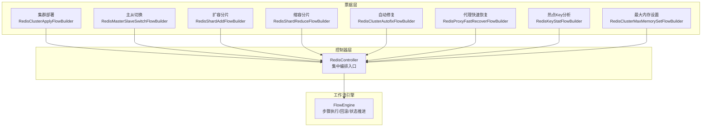
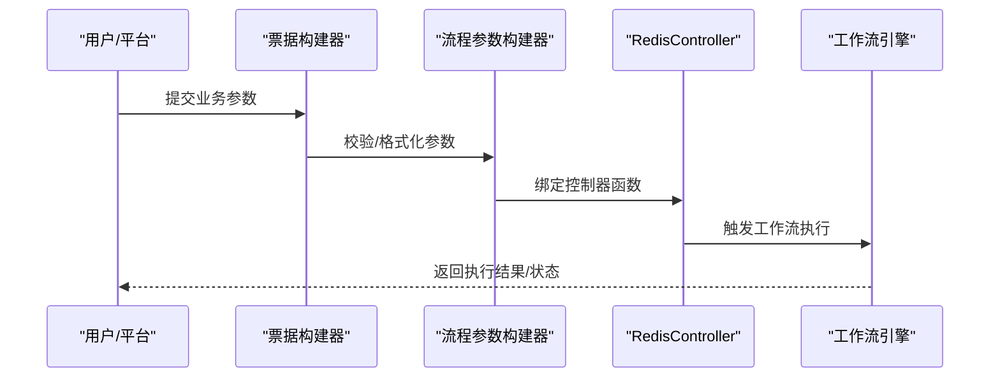
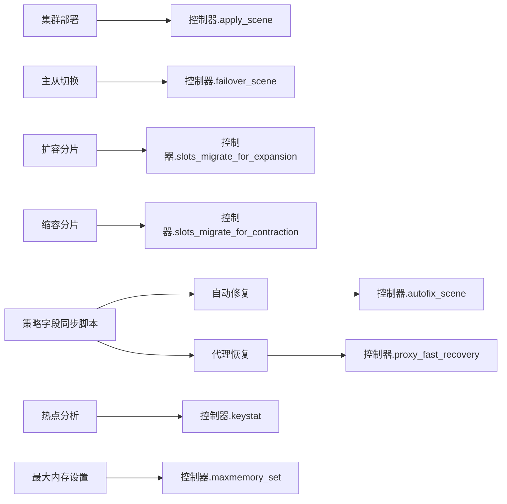
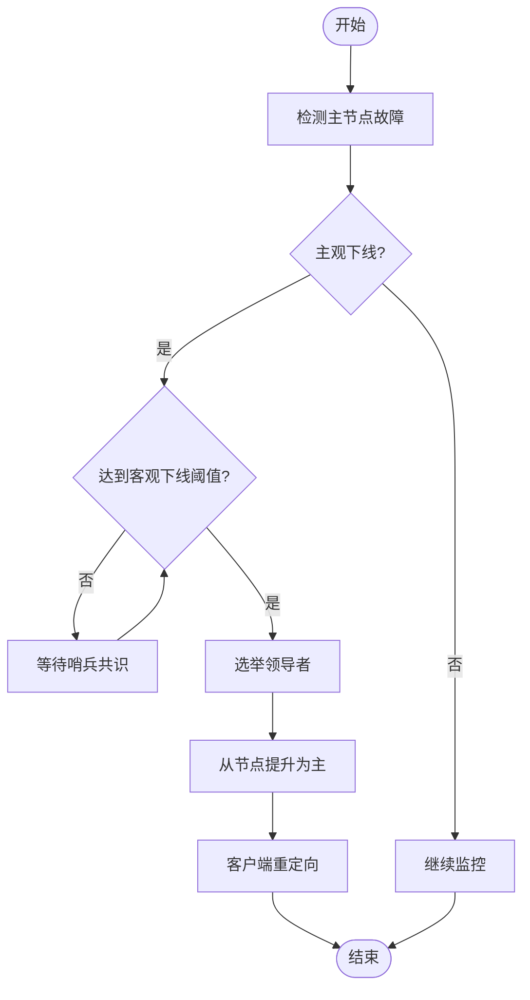

# Redis高可用

<cite>
**本文引用的文件**
- [redis_cluster_apply.py](file://dbm-ui/backend/ticket/builders/redis/redis_cluster_apply.py)
- [redis_toolbox_master_slave_switch.py](file://dbm-ui/backend/ticket/builders/redis/redis_toolbox_master_slave_switch.py)
- [redis_toolbox_shard_add.py](file://dbm-ui/backend/ticket/builders/redis/redis_toolbox_shard_add.py)
- [redis_toolbox_shard_reduce.py](file://dbm-ui/backend/ticket/builders/redis/redis_toolbox_shard_reduce.py)
- [redis_toolbox_autofix.py](file://dbm-ui/backend/ticket/builders/redis/redis_toolbox_autofix.py)
- [redis_proxy_fast_recover.py](file://dbm-ui/backend/ticket/builders/redis/redis_proxy_fast_recover.py)
- [redis_toolbox_keystat.py](file://dbm-ui/backend/ticket/builders/redis/redis_toolbox_keystat.py)
- [redis_maxmemory_set.py](file://dbm-ui/backend/ticket/builders/redis/redis_maxmemory_set.py)
- [batch_sync_alarm_policy_field.py](file://dbm-ui/scripts/batch_sync_alarm_policy_field.py)
</cite>

## 目录
1. [简介](#简介)
2. [项目结构](#项目结构)
3. [核心组件](#核心组件)
4. [架构总览](#架构总览)
5. [组件详解](#组件详解)
6. [依赖关系分析](#依赖关系分析)
7. [性能与容量规划](#性能与容量规划)
8. [故障排查指南](#故障排查指南)
9. [结论](#结论)
10. [附录](#附录)

## 简介
本文件面向Redis高可用运维与自动化平台，系统梳理了基于蓝鲸DBM（DB管理系统）的Redis高可用实现，覆盖以下主题：
- 哨兵模式与集群模式的高可用机制与切换流程
- 主节点故障检测、从节点提升与数据重分配策略
- 关键配置参数、监控指标与告警联动
- 哨兵节点的主观/客观下线判定与选举机制
- 部署配置、性能优化与故障恢复策略
- Redis Cluster的槽位分配与节点重平衡实现细节

说明：本文档聚焦于DBM平台侧的编排与自动化能力，结合Ticket流与控制器调用，展示Redis高可用在平台内的落地方式；对于Redis内部协议与算法细节，本文提供概念性说明与流程图示，不直接展开源码。

## 项目结构
围绕Redis高可用，DBM在“票据（Ticket）+ 控制器（Controller）+ 工作流引擎”的架构下组织能力：
- 票据层：定义业务参数、校验规则与触发动作
- 控制器层：封装具体高可用场景的编排步骤
- 工作流引擎：按步骤执行、回滚与状态推进
- 监控与告警：通过策略同步与告警回调驱动自动化处置

图表来源
- [redis_cluster_apply.py:306-313](file://dbm-ui/backend/ticket/builders/redis/redis_cluster_apply.py#L306-L313)
- [redis_toolbox_master_slave_switch.py:72-77](file://dbm-ui/backend/ticket/builders/redis/redis_toolbox_master_slave_switch.py#L72-L77)
- [redis_toolbox_shard_add.py:63-69](file://dbm-ui/backend/ticket/builders/redis/redis_toolbox_shard_add.py#L63-L69)
- [redis_toolbox_shard_reduce.py:53-87](file://dbm-ui/backend/ticket/builders/redis/redis_toolbox_shard_reduce.py#L53-L87)
- [redis_toolbox_autofix.py:78-84](file://dbm-ui/backend/ticket/builders/redis/redis_toolbox_autofix.py#L78-L84)
- [redis_proxy_fast_recover.py:25-28](file://dbm-ui/backend/ticket/builders/redis/redis_proxy_fast_recover.py#L25-L28)
- [redis_toolbox_keystat.py:71-76](file://dbm-ui/backend/ticket/builders/redis/redis_toolbox_keystat.py#L71-L76)
- [redis_maxmemory_set.py:74-84](file://dbm-ui/backend/ticket/builders/redis/redis_maxmemory_set.py#L74-L84)

章节来源
- [redis_cluster_apply.py:1-313](file://dbm-ui/backend/ticket/builders/redis/redis_cluster_apply.py#L1-L313)
- [redis_toolbox_master_slave_switch.py:1-77](file://dbm-ui/backend/ticket/builders/redis/redis_toolbox_master_slave_switch.py#L1-L77)
- [redis_toolbox_shard_add.py:1-69](file://dbm-ui/backend/ticket/builders/redis/redis_toolbox_shard_add.py#L1-L69)
- [redis_toolbox_shard_reduce.py:1-87](file://dbm-ui/backend/ticket/builders/redis/redis_toolbox_shard_reduce.py#L1-L87)
- [redis_toolbox_autofix.py:47-84](file://dbm-ui/backend/ticket/builders/redis/redis_toolbox_autofix.py#L47-L84)
- [redis_proxy_fast_recover.py:1-56](file://dbm-ui/backend/ticket/builders/redis/redis_proxy_fast_recover.py#L1-L56)
- [redis_toolbox_keystat.py:23-106](file://dbm-ui/backend/ticket/builders/redis/redis_toolbox_keystat.py#L23-L106)
- [redis_maxmemory_set.py:51-84](file://dbm-ui/backend/ticket/builders/redis/redis_maxmemory_set.py#L51-L84)

## 核心组件
- 票据构建器（FlowBuilder）：定义参数、校验与内层流程名称，绑定控制器函数
- 流程参数构建器（FlowParamBuilder）：格式化票据数据、映射控制器
- 资源申请/回收构建器：处理亲和性、容灾与资源规格
- 控制器（RedisController）：集中编排高可用场景（部署、切换、扩容、缩容、故障修复、代理恢复、热点分析、内存上限设置）
- 工作流引擎：执行步骤、推进状态、支持人工确认与重试

章节来源
- [redis_cluster_apply.py:32-313](file://dbm-ui/backend/ticket/builders/redis/redis_cluster_apply.py#L32-L313)
- [redis_toolbox_master_slave_switch.py:27-77](file://dbm-ui/backend/ticket/builders/redis/redis_toolbox_master_slave_switch.py#L27-L77)
- [redis_toolbox_shard_add.py:23-69](file://dbm-ui/backend/ticket/builders/redis/redis_toolbox_shard_add.py#L23-L69)
- [redis_toolbox_shard_reduce.py:24-87](file://dbm-ui/backend/ticket/builders/redis/redis_toolbox_shard_reduce.py#L24-L87)
- [redis_toolbox_autofix.py:47-84](file://dbm-ui/backend/ticket/builders/redis/redis_toolbox_autofix.py#L47-L84)
- [redis_proxy_fast_recover.py:13-56](file://dbm-ui/backend/ticket/builders/redis/redis_proxy_fast_recover.py#L13-L56)
- [redis_toolbox_keystat.py:33-106](file://dbm-ui/backend/ticket/builders/redis/redis_toolbox_keystat.py#L33-L106)
- [redis_maxmemory_set.py:61-84](file://dbm-ui/backend/ticket/builders/redis/redis_maxmemory_set.py#L61-L84)

## 架构总览
DBM的Redis高可用自动化由“票据—控制器—工作流”三层构成，控制器集中封装不同场景的编排步骤，工作流引擎负责执行与回滚。

图表来源
- [redis_cluster_apply.py:138-158](file://dbm-ui/backend/ticket/builders/redis/redis_cluster_apply.py#L138-L158)
- [redis_toolbox_master_slave_switch.py:68-70](file://dbm-ui/backend/ticket/builders/redis/redis_toolbox_master_slave_switch.py#L68-L70)
- [redis_toolbox_shard_add.py:44-51](file://dbm-ui/backend/ticket/builders/redis/redis_toolbox_shard_add.py#L44-L51)
- [redis_toolbox_shard_reduce.py:44-51](file://dbm-ui/backend/ticket/builders/redis/redis_toolbox_shard_reduce.py#L44-L51)
- [redis_toolbox_autofix.py:78-82](file://dbm-ui/backend/ticket/builders/redis/redis_toolbox_autofix.py#L78-L82)
- [redis_proxy_fast_recover.py:25-28](file://dbm-ui/backend/ticket/builders/redis/redis_proxy_fast_recover.py#L25-L28)
- [redis_toolbox_keystat.py:55-58](file://dbm-ui/backend/ticket/builders/redis/redis_toolbox_keystat.py#L55-L58)
- [redis_maxmemory_set.py:67-72](file://dbm-ui/backend/ticket/builders/redis/redis_maxmemory_set.py#L67-L72)

## 组件详解

### 集群部署（哨兵/集群模式）
- 功能要点
  - 支持多种集群类型（如Twemproxy/TendisSSD/RedisCluster/TendisPlus等），通过cluster_type映射到不同控制器场景
  - 自动生成域名、随机密码（proxy与redis密码策略），并进行域名合法性校验
  - 资源申请阶段计算maxmemory、max_disk、group_num、shard_num等参数
  - 对跨机房亲和性要求下，接入层proxy至少分布在2个机房
- 关键参数
  - 云区域ID、业务缩写、城市代码、集群类型、版本号、集群名/别名、proxy端口、ip_source、节点分布、分片数、机器组数
- 高可用策略
  - 哨兵模式：通过proxy与主从复制实现读写分离与故障转移
  - 集群模式：基于槽位分配与节点映射实现水平扩展与数据重分布

章节来源
- [redis_cluster_apply.py:32-131](file://dbm-ui/backend/ticket/builders/redis/redis_cluster_apply.py#L32-L131)
- [redis_cluster_apply.py:138-276](file://dbm-ui/backend/ticket/builders/redis/redis_cluster_apply.py#L138-L276)
- [redis_cluster_apply.py:278-304](file://dbm-ui/backend/ticket/builders/redis/redis_cluster_apply.py#L278-L304)

### 主从切换（故障场景）
- 功能要点
  - 校验主从配对关系一致性，确保切换目标与实际拓扑一致
  - 支持在线切换类型（无需确认/需要确认）
  - 触发控制器中的failover场景，完成主从切换
- 关键参数
  - 集群ID列表、主从切换对、是否强制执行、在线切换类型
- 高可用策略
  - 通过工具箱查询当前主从映射，保证切换安全
  - 切换完成后，客户端流量指向新主节点，从节点提升为主

章节来源
- [redis_toolbox_master_slave_switch.py:27-77](file://dbm-ui/backend/ticket/builders/redis/redis_toolbox_master_slave_switch.py#L27-L77)

### 扩容分片（Redis Cluster槽位重分配）
- 功能要点
  - 将现有槽位迁移到新增节点，实现容量线性扩展
  - 版本名兼容处理，统一major版本
  - 资源亲和性与容灾约束
- 关键参数
  - 集群ID、云区域ID、目标分片数、机器组数、版本号、当前/未来容量、资源规格
- 高可用策略
  - 按槽位迁移逐步完成，尽量减少对业务的影响
  - 迁移过程中保持读写可用性

章节来源
- [redis_toolbox_shard_add.py:23-69](file://dbm-ui/backend/ticket/builders/redis/redis_toolbox_shard_add.py#L23-L69)

### 缩容分片（Redis Cluster节点回收）
- 功能要点
  - 将目标节点上的槽位迁移至其他节点后回收主机
  - 对TendisPlus类型，提供旧节点回收信息（主/从主机列表）
- 关键参数
  - 集群ID、云区域ID、目标分片数、当前组数、规格ID、版本号、当前/未来容量、旧节点信息
- 高可用策略
  - 先迁移槽位再回收主机，避免数据丢失
  - 对TendisPlus类型，严格校验主从一一对应

章节来源
- [redis_toolbox_shard_reduce.py:24-87](file://dbm-ui/backend/ticket/builders/redis/redis_toolbox_shard_reduce.py#L24-L87)

### 自动修复（集群异常）
- 功能要点
  - 基于告警维度解析集群、主机与角色信息，形成修复任务
  - 支持对proxy与redis从库的批量修复
- 关键参数
  - 集群ID、云区域ID、proxy与redis从库列表
- 高可用策略
  - 通过告警回调自动触发修复流程，缩短恢复时间

章节来源
- [redis_toolbox_autofix.py:47-84](file://dbm-ui/backend/ticket/builders/redis/redis_toolbox_autofix.py#L47-L84)

### 代理快速恢复（Proxy异常）
- 功能要点
  - 通过proxy IP定位地域、园区与关联集群，支持重启或上架新proxy
- 关键参数
  - 集群ID、proxy节点列表、操作类型（重启/上架）、是否重启proxy实例
- 高可用策略
  - 快速恢复接入层，保障客户端连接

章节来源
- [redis_proxy_fast_recover.py:13-56](file://dbm-ui/backend/ticket/builders/redis/redis_proxy_fast_recover.py#L13-L56)

### 热点Key分析（性能诊断）
- 功能要点
  - 对指定实例进行Key统计与内存分析，生成热key记录
  - 支持分析时长配置与实例列表
- 关键参数
  - 集群ID、实例列表、分析时长、分隔符、集群类型
- 高可用策略
  - 基于分析结果指导缓存优化与容量规划

章节来源
- [redis_toolbox_keystat.py:33-106](file://dbm-ui/backend/ticket/builders/redis/redis_toolbox_keystat.py#L33-L106)

### 最大内存设置（容量治理）
- 功能要点
  - 针对集群设置maxmemory，结合告警维度自动填充集群ID等信息
- 关键参数
  - 集群ID列表、云区域ID
- 高可用策略
  - 合理设置maxmemory，避免内存溢出导致的故障

章节来源
- [redis_maxmemory_set.py:61-84](file://dbm-ui/backend/ticket/builders/redis/redis_maxmemory_set.py#L61-L84)

## 依赖关系分析
- 票据构建器与控制器的绑定关系
  - 集群部署：apply场景映射到不同控制器
  - 主从切换：failover场景
  - 扩容/缩容：slots迁移场景
  - 自动修复/代理恢复/热点分析/内存设置：各自独立场景
- 资源亲和性与容灾
  - 跨机房亲和性要求下，proxy至少分布在2个机房
  - 容灾级别影响节点分布与容错策略
- 监控与告警
  - 通过策略字段同步脚本，统一阈值与检测窗口等配置，支撑自动化处置

图表来源
- [redis_cluster_apply.py:138-158](file://dbm-ui/backend/ticket/builders/redis/redis_cluster_apply.py#L138-L158)
- [redis_toolbox_master_slave_switch.py:68-70](file://dbm-ui/backend/ticket/builders/redis/redis_toolbox_master_slave_switch.py#L68-L70)
- [redis_toolbox_shard_add.py:44-51](file://dbm-ui/backend/ticket/builders/redis/redis_toolbox_shard_add.py#L44-L51)
- [redis_toolbox_shard_reduce.py:44-51](file://dbm-ui/backend/ticket/builders/redis/redis_toolbox_shard_reduce.py#L44-L51)
- [redis_toolbox_autofix.py:78-82](file://dbm-ui/backend/ticket/builders/redis/redis_toolbox_autofix.py#L78-L82)
- [redis_proxy_fast_recover.py:25-28](file://dbm-ui/backend/ticket/builders/redis/redis_proxy_fast_recover.py#L25-L28)
- [redis_toolbox_keystat.py:55-58](file://dbm-ui/backend/ticket/builders/redis/redis_toolbox_keystat.py#L55-L58)
- [redis_maxmemory_set.py:67-72](file://dbm-ui/backend/ticket/builders/redis/redis_maxmemory_set.py#L67-L72)
- [batch_sync_alarm_policy_field.py:57-71](file://dbm-ui/scripts/batch_sync_alarm_policy_field.py#L57-L71)

章节来源
- [batch_sync_alarm_policy_field.py:32-71](file://dbm-ui/scripts/batch_sync_alarm_policy_field.py#L32-L71)

## 性能与容量规划
- 容量规划
  - 基于资源申请阶段的min_mem/min_disk与group_num/shard_num计算maxmemory/max_disk，确保每分片内存/磁盘均衡
  - 扩容/缩容时评估槽位迁移对性能的影响，建议在低峰期执行
- 性能优化
  - 热点Key分析指导缓存命中率与淘汰策略优化
  - 合理设置maxmemory，避免频繁逐出
- 部署策略
  - 跨机房亲和性要求下，proxy至少分布在2个机房，提升可用性
  - 容灾级别与节点分布需匹配业务SLA

章节来源
- [redis_cluster_apply.py:278-304](file://dbm-ui/backend/ticket/builders/redis/redis_cluster_apply.py#L278-L304)
- [redis_toolbox_keystat.py:33-106](file://dbm-ui/backend/ticket/builders/redis/redis_toolbox_keystat.py#L33-L106)
- [redis_maxmemory_set.py:61-84](file://dbm-ui/backend/ticket/builders/redis/redis_maxmemory_set.py#L61-L84)

## 故障排查指南
- 告警与自动化
  - 使用策略字段同步脚本统一阈值与检测窗口，确保告警触发与恢复逻辑一致
  - 告警回调驱动自动修复与代理快速恢复，缩短MTTR
- 常见问题定位
  - 主从关系不匹配：检查主从映射与切换对是否一致
  - 槽位迁移失败：核对目标节点槽位是否已释放，迁移窗口是否合理
  - 代理异常：通过代理快速恢复流程重启或替换proxy
- 人工干预
  - 在需要确认的切换场景中，遵循在线切换类型选择，必要时采用人工确认

章节来源
- [batch_sync_alarm_policy_field.py:57-71](file://dbm-ui/scripts/batch_sync_alarm_policy_field.py#L57-L71)
- [redis_toolbox_master_slave_switch.py:41-62](file://dbm-ui/backend/ticket/builders/redis/redis_toolbox_master_slave_switch.py#L41-L62)
- [redis_proxy_fast_recover.py:25-56](file://dbm-ui/backend/ticket/builders/redis/redis_proxy_fast_recover.py#L25-L56)

## 结论
DBM在Redis高可用方面提供了完善的自动化编排能力，覆盖部署、切换、扩容/缩容、故障修复、代理恢复与性能诊断等关键场景。通过严格的参数校验、资源亲和性与容灾策略、以及与监控告警的联动，平台能够稳定地支撑Redis在生产环境中的高可用运行。对于Redis内部的哨兵与集群机制，平台以控制器抽象的方式屏蔽复杂细节，聚焦于运维视角的可观测与可操作性。

## 附录

### 哨兵模式与集群模式高可用机制（概念说明）
- 哨兵模式
  - 主观下线：哨兵节点基于心跳与超时判定某实例主观不可用
  - 客观下线：当达到quorum数量的哨兵认定某实例客观不可用时，触发故障转移
  - 选举机制：多个哨兵竞争成为领导者，协调主从切换与配置更新
  - 数据重分配：从节点提升为主，客户端重定向至新主
- 集群模式
  - 槽位分配：16384个槽位映射到节点，哈希决定Key归属
  - 节点重平衡：通过迁移槽位实现扩容/缩容，保持读写可用
  - 高可用：主节点故障时，从节点提升为主，继续服务

[此图为概念性流程示意，不直接映射具体源码文件]