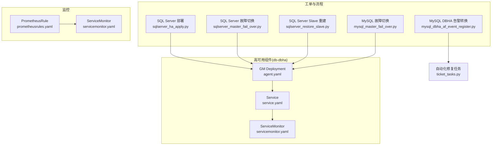
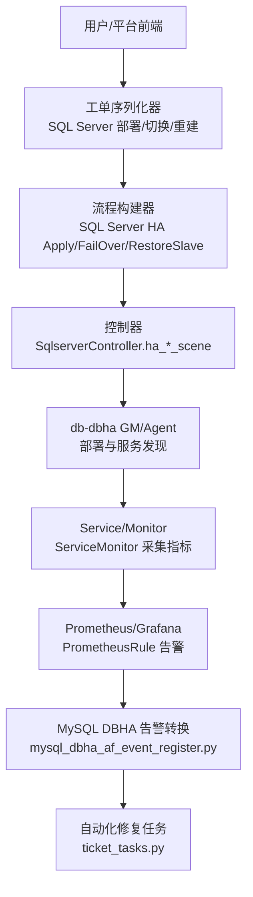
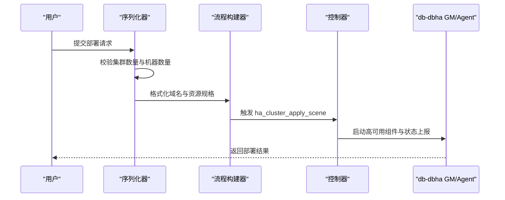
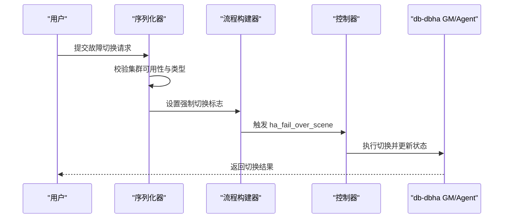
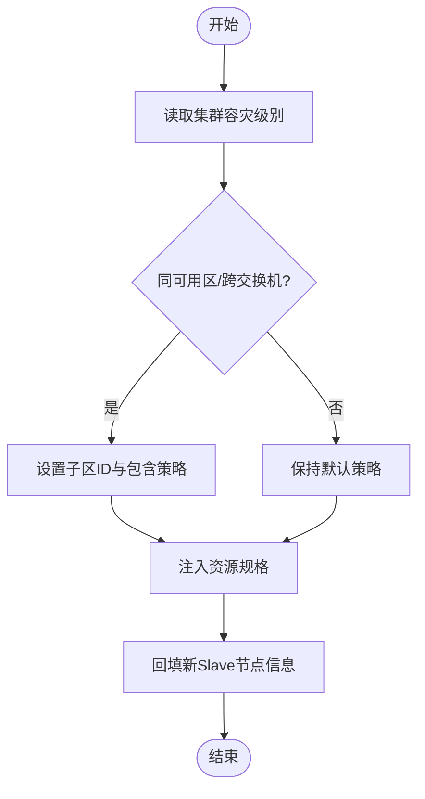
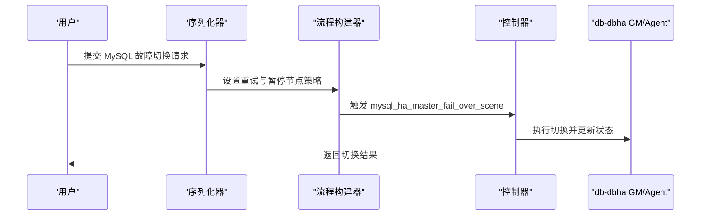
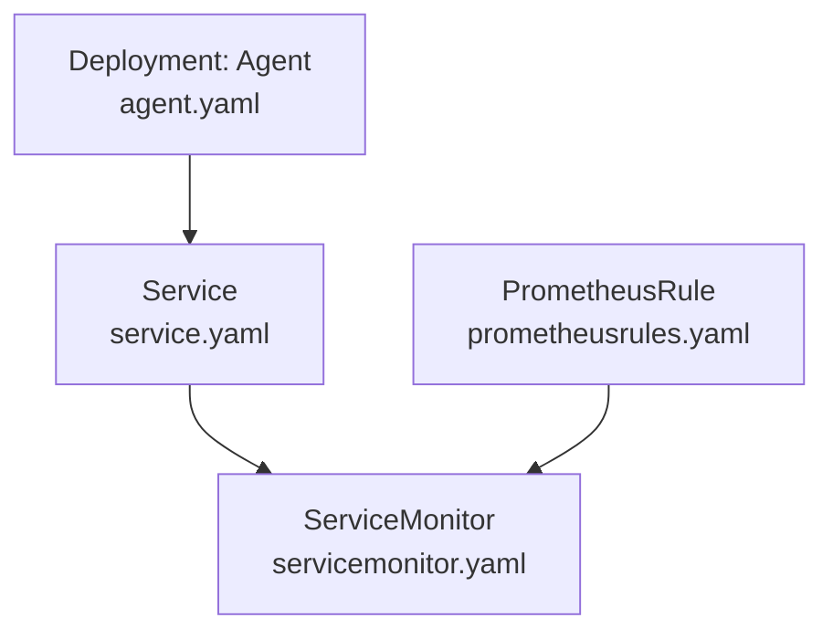
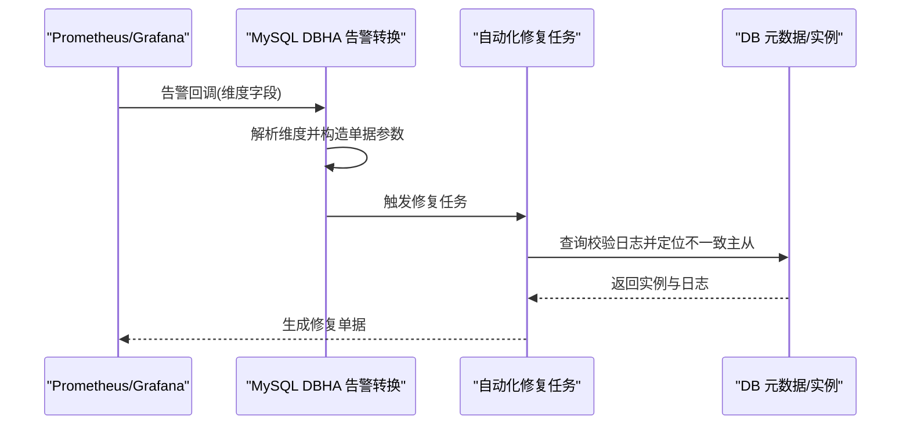

# 其他数据库高可用

<cite>
**本文引用的文件**
- [sqlserver_ha_apply.py](file://dbm-ui/backend/ticket/builders/sqlserver/sqlserver_ha_apply.py)
- [sqlserver_master_fail_over.py](file://dbm-ui/backend/ticket/builders/sqlserver/sqlserver_master_fail_over.py)
- [sqlserver_restore_slave.py](file://dbm-ui/backend/ticket/builders/sqlserver/sqlserver_restore_slave.py)
- [mysql_master_fail_over.py](file://dbm-ui/backend/ticket/builders/mysql/mysql_master_fail_over.py)
- [prometheusrules.yaml](file://helm-charts/bk-dbm/charts/grafana/templates/prometheusrules.yaml)
- [servicemonitor.yaml](file://helm-charts/bk-dbm/charts/grafana/templates/servicemonitor.yaml)
- [agent.yaml](file://helm-charts/bk-dbm/charts/db-dbha/templates/deployments/agent.yaml)
- [service.yaml](file://helm-charts/bk-dbm/charts/db-dbha/templates/service.yaml)
- [servicemonitor.yaml](file://helm-charts/bk-dbm/charts/db-dbha/templates/servicemonitor.yaml)
- [mysql_dbha_af_event_register.py](file://dbm-ui/backend/ticket/builders/mysql/dbha_autofix/mysql_dbha_af_event_register.py)
- [ticket_tasks.py](file://dbm-ui/backend/ticket/tasks/ticket_tasks.py)
</cite>

## 目录
1. [引言](#引言)
2. [项目结构](#项目结构)
3. [核心组件](#核心组件)
4. [架构总览](#架构总览)
5. [详细组件分析](#详细组件分析)
6. [依赖分析](#依赖分析)
7. [性能考虑](#性能考虑)
8. [故障排查指南](#故障排查指南)
9. [结论](#结论)
10. [附录](#附录)

## 引言
本文件面向企业级数据库高可用（HA）实现，聚焦于 Oracle RAC、SQL Server AlwaysOn Availability Groups、PostgreSQL 流复制三类高可用方案。结合仓库中已有的 SQL Server 高可用工单流程与监控体系，系统阐述以下内容：
- 故障检测算法与切换条件
- 状态同步机制与一致性保障
- 关键配置参数、监控指标与部署策略
- 性能优化与故障恢复最佳实践
- 跨数据库类型的高可用对比与选型建议

说明：仓库中未包含 Oracle RAC 与 PostgreSQL 的具体实现代码，因此本文以 SQL Server 高可用作为可落地的参考实现，结合通用高可用原理，扩展至 Oracle RAC 与 PostgreSQL 的实现要点与对比。

## 项目结构
围绕“高可用”主题，相关代码主要分布在以下区域：
- 工单与流程构建：SQL Server 高可用部署、故障切换、Slave 重建等
- 数据库高可用组件（db-dbha）：GM 组件、Agent 组件、ServiceMonitor、Service 定义
- 监控与告警：PrometheusRule、ServiceMonitor 指标采集
- 自动化修复与事件对接：MySQL DBHA 告警转换与自动修复触发逻辑

**图表来源**
- [sqlserver_ha_apply.py:115-129](file://dbm-ui/backend/ticket/builders/sqlserver/sqlserver_ha_apply.py#L115-L129)
- [sqlserver_master_fail_over.py:34-45](file://dbm-ui/backend/ticket/builders/sqlserver/sqlserver_master_fail_over.py#L34-L45)
- [sqlserver_restore_slave.py:147-158](file://dbm-ui/backend/ticket/builders/sqlserver/sqlserver_restore_slave.py#L147-L158)
- [mysql_master_fail_over.py:28-44](file://dbm-ui/backend/ticket/builders/mysql/mysql_master_fail_over.py#L28-L44)
- [agent.yaml:33-71](file://helm-charts/bk-dbm/charts/db-dbha/templates/deployments/agent.yaml#L33-L71)
- [service.yaml:1-17](file://helm-charts/bk-dbm/charts/db-dbha/templates/service.yaml#L1-L17)
- [servicemonitor.yaml:1-21](file://helm-charts/bk-dbm/charts/db-dbha/templates/servicemonitor.yaml#L1-L21)
- [prometheusrules.yaml:1-24](file://helm-charts/bk-dbm/charts/grafana/templates/prometheusrules.yaml#L1-L24)
- [mysql_dbha_af_event_register.py:89-109](file://dbm-ui/backend/ticket/builders/mysql/dbha_autofix/mysql_dbha_af_event_register.py#L89-L109)
- [ticket_tasks.py:93-169](file://dbm-ui/backend/ticket/tasks/ticket_tasks.py#L93-L169)

**章节来源**
- [sqlserver_ha_apply.py:1-129](file://dbm-ui/backend/ticket/builders/sqlserver/sqlserver_ha_apply.py#L1-L129)
- [sqlserver_master_fail_over.py:1-46](file://dbm-ui/backend/ticket/builders/sqlserver/sqlserver_master_fail_over.py#L1-L46)
- [sqlserver_restore_slave.py:130-158](file://dbm-ui/backend/ticket/builders/sqlserver/sqlserver_restore_slave.py#L130-L158)
- [mysql_master_fail_over.py:25-44](file://dbm-ui/backend/ticket/builders/mysql/mysql_master_fail_over.py#L25-L44)
- [agent.yaml:33-71](file://helm-charts/bk-dbm/charts/db-dbha/templates/deployments/agent.yaml#L33-L71)
- [service.yaml:1-17](file://helm-charts/bk-dbm/charts/db-dbha/templates/service.yaml#L1-L17)
- [servicemonitor.yaml:1-21](file://helm-charts/bk-dbm/charts/db-dbha/templates/servicemonitor.yaml#L1-L21)
- [prometheusrules.yaml:1-24](file://helm-charts/bk-dbm/charts/grafana/templates/prometheusrules.yaml#L1-L24)
- [mysql_dbha_af_event_register.py:89-109](file://dbm-ui/backend/ticket/builders/mysql/dbha_autofix/mysql_dbha_af_event_register.py#L89-L109)
- [ticket_tasks.py:93-169](file://dbm-ui/backend/ticket/tasks/ticket_tasks.py#L93-L169)

## 核心组件
- SQL Server 高可用部署流程：负责集群域名初始化、资源规格注入、后端节点分配与后续流程联动
- SQL Server 故障切换流程：封装强制切换语义，调用控制器执行切换场景
- SQL Server Slave 重建流程：基于容灾级别与可用区约束，选择新 Slave 节点并回填信息
- MySQL 故障切换流程：封装 MySQL HA 的主故障切换场景，支持重试与暂停节点
- db-dbha 组件：GM 服务、Agent、ServiceMonitor、Service，支撑高可用状态上报与监控采集
- 监控与告警：PrometheusRule 与 ServiceMonitor，统一采集指标并定义告警规则
- MySQL DBHA 告警转换与自动化修复：将告警维度映射为单据参数，触发自动化修复任务

**章节来源**
- [sqlserver_ha_apply.py:32-129](file://dbm-ui/backend/ticket/builders/sqlserver/sqlserver_ha_apply.py#L32-L129)
- [sqlserver_master_fail_over.py:23-45](file://dbm-ui/backend/ticket/builders/sqlserver/sqlserver_master_fail_over.py#L23-L45)
- [sqlserver_restore_slave.py:130-158](file://dbm-ui/backend/ticket/builders/sqlserver/sqlserver_restore_slave.py#L130-L158)
- [mysql_master_fail_over.py:28-44](file://dbm-ui/backend/ticket/builders/mysql/mysql_master_fail_over.py#L28-L44)
- [agent.yaml:33-71](file://helm-charts/bk-dbm/charts/db-dbha/templates/deployments/agent.yaml#L33-L71)
- [service.yaml:1-17](file://helm-charts/bk-dbm/charts/db-dbha/templates/service.yaml#L1-L17)
- [servicemonitor.yaml:1-21](file://helm-charts/bk-dbm/charts/db-dbha/templates/servicemonitor.yaml#L1-L21)
- [prometheusrules.yaml:1-24](file://helm-charts/bk-dbm/charts/grafana/templates/prometheusrules.yaml#L1-L24)
- [mysql_dbha_af_event_register.py:89-109](file://dbm-ui/backend/ticket/builders/mysql/dbha_autofix/mysql_dbha_af_event_register.py#L89-L109)
- [ticket_tasks.py:93-169](file://dbm-ui/backend/ticket/tasks/ticket_tasks.py#L93-L169)

## 架构总览
下图展示 SQL Server 高可用在平台内的端到端交互：工单序列化器与流程构建器驱动控制器执行，db-dbha 提供 GM 与 Agent 能力，Prometheus 与 Grafana 采集指标并触发告警，MySQL DBHA 告警转换与自动化修复任务协同工作。

**图表来源**
- [sqlserver_ha_apply.py:63-124](file://dbm-ui/backend/ticket/builders/sqlserver/sqlserver_ha_apply.py#L63-L124)
- [sqlserver_master_fail_over.py:34-45](file://dbm-ui/backend/ticket/builders/sqlserver/sqlserver_master_fail_over.py#L34-L45)
- [sqlserver_restore_slave.py:147-158](file://dbm-ui/backend/ticket/builders/sqlserver/sqlserver_restore_slave.py#L147-L158)
- [agent.yaml:33-71](file://helm-charts/bk-dbm/charts/db-dbha/templates/deployments/agent.yaml#L33-L71)
- [service.yaml:1-17](file://helm-charts/bk-dbm/charts/db-dbha/templates/service.yaml#L1-L17)
- [servicemonitor.yaml:1-21](file://helm-charts/bk-dbm/charts/db-dbha/templates/servicemonitor.yaml#L1-L21)
- [prometheusrules.yaml:1-24](file://helm-charts/bk-dbm/charts/grafana/templates/prometheusrules.yaml#L1-L24)
- [mysql_dbha_af_event_register.py:89-109](file://dbm-ui/backend/ticket/builders/mysql/dbha_autofix/mysql_dbha_af_event_register.py#L89-L109)
- [ticket_tasks.py:93-169](file://dbm-ui/backend/ticket/tasks/ticket_tasks.py#L93-L169)

## 详细组件分析

### SQL Server 高可用部署流程
- 输入校验：校验集群数量、实例数与机器数量的匹配关系；当使用资源池时，要求后端节点数量满足预期倍数
- 域名格式化：根据业务缩写与模块名称生成主域名与从域名，并替换特殊字符
- 资源注入：将后端 Master/Slave 节点注入到申请信息中，并回填资源规格
- 控制器调用：通过控制器场景执行高可用集群应用

**图表来源**
- [sqlserver_ha_apply.py:32-129](file://dbm-ui/backend/ticket/builders/sqlserver/sqlserver_ha_apply.py#L32-L129)
- [agent.yaml:33-71](file://helm-charts/bk-dbm/charts/db-dbha/templates/deployments/agent.yaml#L33-L71)

**章节来源**
- [sqlserver_ha_apply.py:32-129](file://dbm-ui/backend/ticket/builders/sqlserver/sqlserver_ha_apply.py#L32-L129)

### SQL Server 主故障切换流程
- 强制切换：在故障场景下强制执行，确保快速接管
- 类型校验：校验集群可用性与高可用类型
- 控制器调用：通过控制器场景执行 fail_over 场景

**图表来源**
- [sqlserver_master_fail_over.py:23-45](file://dbm-ui/backend/ticket/builders/sqlserver/sqlserver_master_fail_over.py#L23-L45)
- [agent.yaml:33-71](file://helm-charts/bk-dbm/charts/db-dbha/templates/deployments/agent.yaml#L33-L71)

**章节来源**
- [sqlserver_master_fail_over.py:23-45](file://dbm-ui/backend/ticket/builders/sqlserver/sqlserver_master_fail_over.py#L23-L45)

### SQL Server Slave 重建流程
- 容灾级别判断：依据集群容灾级别与可用区策略，确定新 Slave 的位置约束
- 资源规格注入：按容灾级别设置 location_spec
- 信息回填：将新 Slave 节点写回到后续流程的 ticket 数据

**图表来源**
- [sqlserver_restore_slave.py:130-158](file://dbm-ui/backend/ticket/builders/sqlserver/sqlserver_restore_slave.py#L130-L158)

**章节来源**
- [sqlserver_restore_slave.py:130-158](file://dbm-ui/backend/ticket/builders/sqlserver/sqlserver_restore_slave.py#L130-L158)

### MySQL 故障切换流程
- 场景封装：针对 MySQL HA 的主故障切换场景，支持手动重试与暂停节点
- 参数传递：通过控制器场景执行切换

**图表来源**
- [mysql_master_fail_over.py:28-44](file://dbm-ui/backend/ticket/builders/mysql/mysql_master_fail_over.py#L28-L44)
- [agent.yaml:33-71](file://helm-charts/bk-dbm/charts/db-dbha/templates/deployments/agent.yaml#L33-L71)

**章节来源**
- [mysql_master_fail_over.py:28-44](file://dbm-ui/backend/ticket/builders/mysql/mysql_master_fail_over.py#L28-L44)

### db-dbha 组件与监控
- GM 与 Agent：通过 Deployment 与 Service 暴露管理与监控端口，环境变量注入节点 IP 与类型
- ServiceMonitor：采集 /metrics 路径指标，统一暴露给 Prometheus
- PrometheusRule：定义告警规则组，配合 Grafana 展示

**图表来源**
- [agent.yaml:33-71](file://helm-charts/bk-dbm/charts/db-dbha/templates/deployments/agent.yaml#L33-L71)
- [service.yaml:1-17](file://helm-charts/bk-dbm/charts/db-dbha/templates/service.yaml#L1-L17)
- [servicemonitor.yaml:1-21](file://helm-charts/bk-dbm/charts/db-dbha/templates/servicemonitor.yaml#L1-L21)
- [prometheusrules.yaml:1-24](file://helm-charts/bk-dbm/charts/grafana/templates/prometheusrules.yaml#L1-L24)

**章节来源**
- [agent.yaml:33-71](file://helm-charts/bk-dbm/charts/db-dbha/templates/deployments/agent.yaml#L33-L71)
- [service.yaml:1-17](file://helm-charts/bk-dbm/charts/db-dbha/templates/service.yaml#L1-L17)
- [servicemonitor.yaml:1-21](file://helm-charts/bk-dbm/charts/db-dbha/templates/servicemonitor.yaml#L1-L21)
- [prometheusrules.yaml:1-24](file://helm-charts/bk-dbm/charts/grafana/templates/prometheusrules.yaml#L1-L24)

### MySQL DBHA 告警转换与自动化修复
- 告警维度解析：从回调消息中提取维度字段，构造单据参数
- 自动修复任务：按集群维度聚合校验日志，识别不一致的主从对，生成修复单据

**图表来源**
- [mysql_dbha_af_event_register.py:89-109](file://dbm-ui/backend/ticket/builders/mysql/dbha_autofix/mysql_dbha_af_event_register.py#L89-L109)
- [ticket_tasks.py:93-169](file://dbm-ui/backend/ticket/tasks/ticket_tasks.py#L93-L169)

**章节来源**
- [mysql_dbha_af_event_register.py:89-109](file://dbm-ui/backend/ticket/builders/mysql/dbha_autofix/mysql_dbha_af_event_register.py#L89-L109)
- [ticket_tasks.py:93-169](file://dbm-ui/backend/ticket/tasks/ticket_tasks.py#L93-L169)

## 依赖分析
- 工单序列化器与流程构建器之间存在强耦合：序列化器负责输入校验与参数格式化，流程构建器负责调用控制器与资源注入
- 控制器与 db-dbha 组件之间存在运行时依赖：控制器执行场景时依赖 GM/Agent 提供的状态上报与健康检查能力
- 监控与自动化修复之间存在数据链路依赖：PrometheusRule 与 ServiceMonitor 提供指标，MySQL DBHA 告警转换与自动化修复任务消费这些指标并生成修复单据

**图表来源**
- [sqlserver_ha_apply.py:63-124](file://dbm-ui/backend/ticket/builders/sqlserver/sqlserver_ha_apply.py#L63-L124)
- [sqlserver_master_fail_over.py:34-45](file://dbm-ui/backend/ticket/builders/sqlserver/sqlserver_master_fail_over.py#L34-L45)
- [agent.yaml:33-71](file://helm-charts/bk-dbm/charts/db-dbha/templates/deployments/agent.yaml#L33-L71)
- [servicemonitor.yaml:1-21](file://helm-charts/bk-dbm/charts/db-dbha/templates/servicemonitor.yaml#L1-L21)
- [prometheusrules.yaml:1-24](file://helm-charts/bk-dbm/charts/grafana/templates/prometheusrules.yaml#L1-L24)
- [mysql_dbha_af_event_register.py:89-109](file://dbm-ui/backend/ticket/builders/mysql/dbha_autofix/mysql_dbha_af_event_register.py#L89-L109)
- [ticket_tasks.py:93-169](file://dbm-ui/backend/ticket/tasks/ticket_tasks.py#L93-L169)

**章节来源**
- [sqlserver_ha_apply.py:63-124](file://dbm-ui/backend/ticket/builders/sqlserver/sqlserver_ha_apply.py#L63-L124)
- [sqlserver_master_fail_over.py:34-45](file://dbm-ui/backend/ticket/builders/sqlserver/sqlserver_master_fail_over.py#L34-L45)
- [agent.yaml:33-71](file://helm-charts/bk-dbm/charts/db-dbha/templates/deployments/agent.yaml#L33-L71)
- [servicemonitor.yaml:1-21](file://helm-charts/bk-dbm/charts/db-dbha/templates/servicemonitor.yaml#L1-L21)
- [prometheusrules.yaml:1-24](file://helm-charts/bk-dbm/charts/grafana/templates/prometheusrules.yaml#L1-L24)
- [mysql_dbha_af_event_register.py:89-109](file://dbm-ui/backend/ticket/builders/mysql/dbha_autofix/mysql_dbha_af_event_register.py#L89-L109)
- [ticket_tasks.py:93-169](file://dbm-ui/backend/ticket/tasks/ticket_tasks.py#L93-L169)

## 性能考虑
- 指标采集频率：ServiceMonitor 默认采集间隔为 30 秒，可根据业务需求调整
- 资源伸缩：通过 HPA（HorizontalPodAutoscaler）按 CPU/内存利用率动态伸缩，避免资源瓶颈导致的切换延迟
- 切换路径优化：在 SQL Server 场景中，强制切换可减少等待时间；在 MySQL 场景中，合理设置重试与暂停节点策略，平衡可靠性与性能
- 网络与存储：确保跨可用区网络延迟与带宽满足复制与切换需求，避免成为性能瓶颈

[本节为通用指导，无需列出具体文件来源]

## 故障排查指南
- 指标缺失或异常：检查 ServiceMonitor 是否正确暴露 /metrics，PrometheusRule 是否启用
- 切换失败：确认序列化器校验是否通过、流程构建器是否正确注入资源规格、控制器场景是否被调用
- 自动化修复未触发：核对告警回调维度字段是否完整，MySQL DBHA 告警转换是否成功解析，自动化修复任务是否按集群维度聚合日志

**章节来源**
- [servicemonitor.yaml:1-21](file://helm-charts/bk-dbm/charts/db-dbha/templates/servicemonitor.yaml#L1-L21)
- [prometheusrules.yaml:1-24](file://helm-charts/bk-dbm/charts/grafana/templates/prometheusrules.yaml#L1-L24)
- [mysql_dbha_af_event_register.py:89-109](file://dbm-ui/backend/ticket/builders/mysql/dbha_autofix/mysql_dbha_af_event_register.py#L89-L109)
- [ticket_tasks.py:93-169](file://dbm-ui/backend/ticket/tasks/ticket_tasks.py#L93-L169)

## 结论
- SQL Server 高可用在平台内具备完整的工单流程、控制器场景与监控体系支撑
- db-dbha 组件提供 GM/Agent 与监控采集能力，是高可用状态感知与切换的关键
- MySQL DBHA 告警转换与自动化修复任务形成闭环，提升故障自愈效率
- 对于 Oracle RAC 与 PostgreSQL，可借鉴 SQL Server 的流程设计与监控体系，结合各自特性完善故障检测、切换条件与状态同步机制

[本节为总结性内容，无需列出具体文件来源]

## 附录

### 企业级数据库高可用对比与选型建议
- Oracle RAC
  - 特点：共享存储、多实例共享数据库，切换通常由 OCR/DCR 与 ASM 协同完成
  - 故障检测：依赖 OCR/DCR 与 ASM 健康状态，节点间心跳与实例状态监控
  - 切换条件：节点不可达、存储不可用、实例异常
  - 状态同步：通过 ASM 与 OCR 维护全局一致性
  - 配置参数：OCR/DCR 配置、ASM 存储域、实例参数
  - 监控指标：节点心跳、实例状态、OCR/DCR 健康、ASM 使用率
  - 部署策略：跨节点共享存储、跨机房部署、负载均衡前置
- SQL Server AlwaysOn AG
  - 特点：基于日志传送与见证者，支持多副本与自动故障转移
  - 故障检测：副本健康状态、见证者状态、仲裁机制
  - 切换条件：主副本不可用、仲裁失败、管理员干预
  - 状态同步：异步/同步模式下的日志应用与缓冲
  - 配置参数：副本角色、见证者、仲裁策略、同步提交
  - 监控指标：副本延迟、仲裁状态、可用性组状态
  - 部署策略：跨可用区/站点部署、见证者与仲裁节点
- PostgreSQL 流复制
  - 特点：主从复制，支持物理与逻辑复制
  - 故障检测：复制槽、WAL 传输、心跳与复制延迟
  - 切换条件：主库不可用、复制延迟超阈值、管理员干预
  - 状态同步：WAL 日志流与重放
  - 配置参数：recovery.conf、standby.signal、replication 参数
  - 监控指标：复制延迟、WAL 产生与传输速率、复制槽状态
  - 部署策略：跨机房/可用区、自动切换与回切策略

[本节为概念性对比，无需列出具体文件来源]