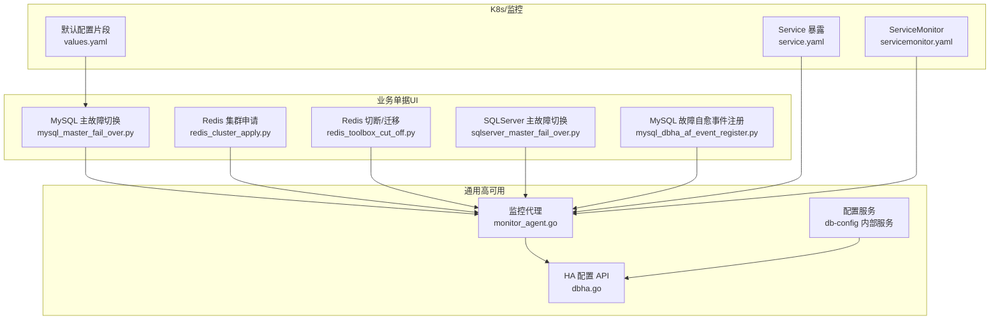
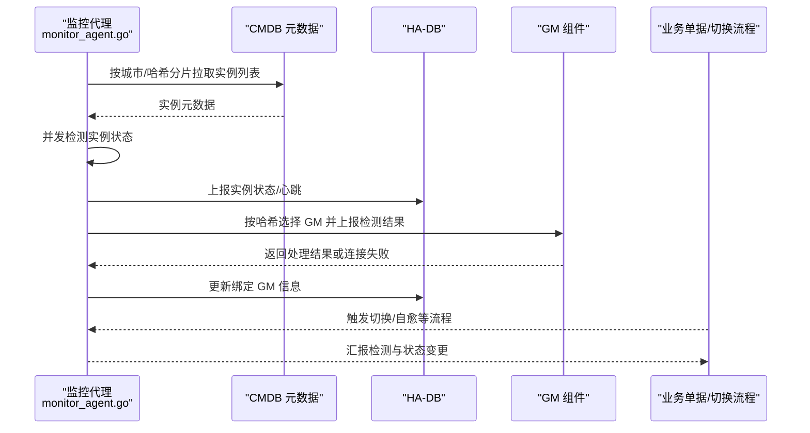
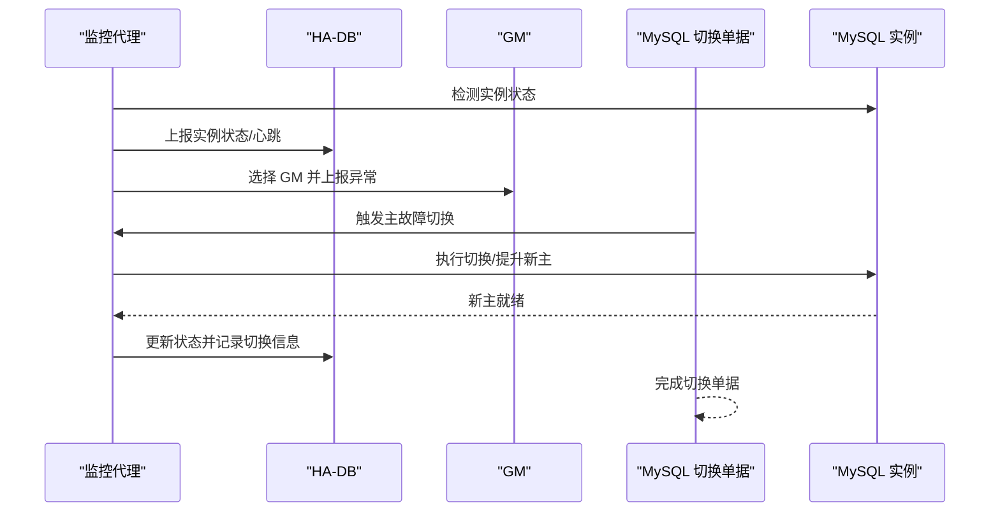
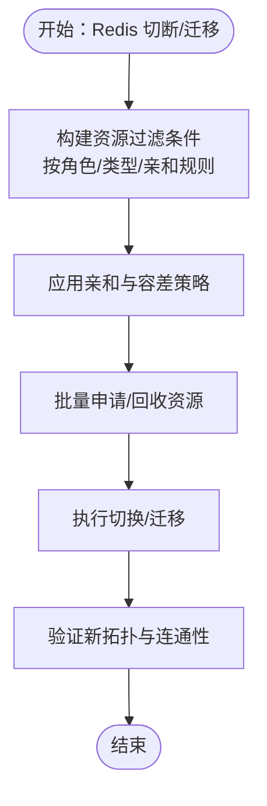
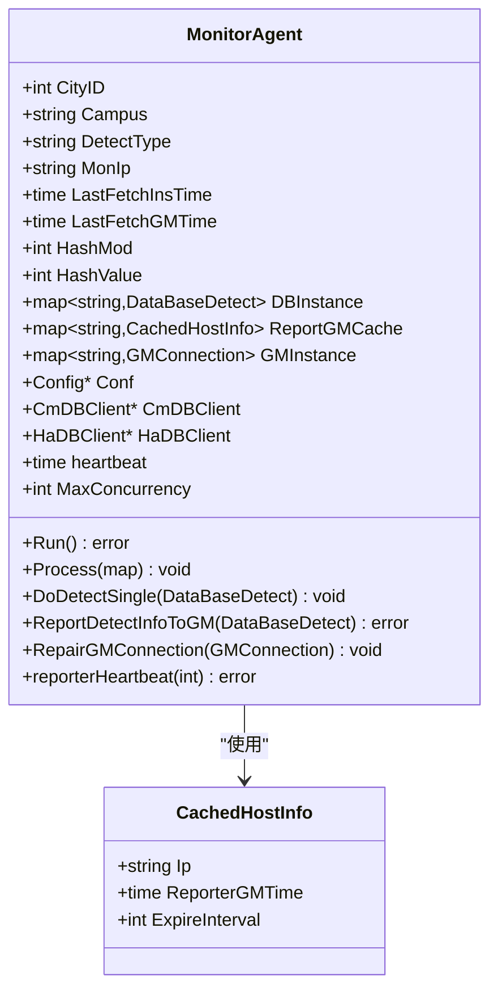
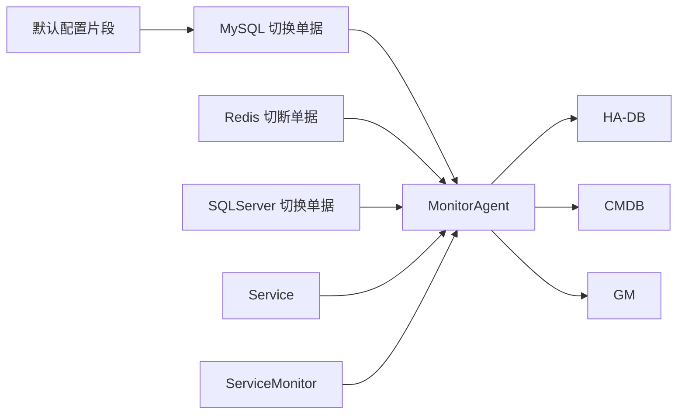

# 数据库特定高可用

<cite>
**本文引用的文件**
- [monitor_agent.go](file://dbm-services/common/dbha/ha-module/agent/monitor_agent.go)
- [agent.go](file://dbm-services/common/dbha/ha-module/agent/agent.go)
- [dbha.go](file://dbm-services/common/db-config/internal/service/dbha/dbha.go)
- [dbha.go](file://dbm-services/common/db-config/internal/api/dbha.go)
- [mysql_master_fail_over.py](file://dbm-ui/backend/ticket/builders/mysql/mysql_master_fail_over.py)
- [mysql_dbha_af_event_register.py](file://dbm-ui/backend/ticket/builders/mysql/dbha_autofix/mysql_dbha_af_event_register.py)
- [redis_cluster_apply.py](file://dbm-ui/backend/ticket/builders/redis/redis_cluster_apply.py)
- [redis_toolbox_cut_off.py](file://dbm-ui/backend/ticket/builders/redis/redis_toolbox_cut_off.py)
- [sqlserver_master_fail_over.py](file://dbm-ui/backend/ticket/builders/sqlserver/sqlserver_master_fail_over.py)
- [service.yaml](file://helm-charts/bk-dbm/charts/db-dbha/templates/service.yaml)
- [servicemonitor.yaml](file://helm-charts/bk-dbm/charts/db-dbha/templates/servicemonitor.yaml)
- [values.yaml](file://helm-charts/bk-dbm/values.yaml)
</cite>

## 目录
1. [简介](#简介)
2. [项目结构](#项目结构)
3. [核心组件](#核心组件)
4. [架构总览](#架构总览)
5. [详细组件分析](#详细组件分析)
6. [依赖关系分析](#依赖关系分析)
7. [性能考量](#性能考量)
8. [故障排查指南](#故障排查指南)
9. [结论](#结论)
10. [附录](#附录)

## 简介
本文件聚焦于数据库特定高可用（High Availability, HA）实现，围绕 MySQL、Redis、MongoDB 三类数据库在本仓库中的高可用策略、故障检测与切换流程、配置参数、监控指标与部署要点进行系统化梳理，并提供跨数据库类型的对比分析与最佳实践建议。文档以实际源码与配置为依据，辅以图示帮助读者快速理解整体设计与关键路径。

## 项目结构
本仓库中与数据库高可用相关的关键模块分布如下：
- 通用高可用代理与组件
  - dbm-services/common/dbha/ha-module/agent：监控代理与 GM 组件交互、实例发现与上报、心跳与缓存管理
  - dbm-services/common/db-config：配置中心与 HA 配置项的批量获取接口
- 业务单据与切换流程（UI 层）
  - dbm-ui/backend/ticket/...：MySQL/Redis/SQLServer 的高可用切换、故障自愈、扩容/缩容等流程编排
- Helm Chart 与监控
  - helm-charts/bk-dbm/charts/db-dbha：HA 组件的 K8s 服务暴露与 ServiceMonitor 配置
  - helm-charts/bk-dbm/values.yaml：Bitnami MySQL/Redis 默认配置片段

图表来源
- [monitor_agent.go:128-135](file://dbm-services/common/dbha/ha-module/agent/monitor_agent.go#L128-L135)
- [dbha.go:1-37](file://dbm-services/common/db-config/internal/api/dbha.go#L1-L37)
- [mysql_master_fail_over.py:28-44](file://dbm-ui/backend/ticket/builders/mysql/mysql_master_fail_over.py#L28-L44)
- [redis_cluster_apply.py:244-273](file://dbm-ui/backend/ticket/builders/redis/redis_cluster_apply.py#L244-L273)
- [redis_toolbox_cut_off.py:76-102](file://dbm-ui/backend/ticket/builders/redis/redis_toolbox_cut_off.py#L76-L102)
- [sqlserver_master_fail_over.py:21-45](file://dbm-ui/backend/ticket/builders/sqlserver/sqlserver_master_fail_over.py#L21-L45)
- [service.yaml:1-17](file://helm-charts/bk-dbm/charts/db-dbha/templates/service.yaml#L1-L17)
- [servicemonitor.yaml:1-21](file://helm-charts/bk-dbm/charts/db-dbha/templates/servicemonitor.yaml#L1-L21)
- [values.yaml:628-680](file://helm-charts/bk-dbm/values.yaml#L628-L680)

章节来源
- [monitor_agent.go:128-135](file://dbm-services/common/dbha/ha-module/agent/monitor_agent.go#L128-L135)
- [dbha.go:1-37](file://dbm-services/common/db-config/internal/api/dbha.go#L1-L37)

## 核心组件
- 监控代理（MonitorAgent）
  - 职责：周期性探测数据库实例、并发控制、实例与 GM 缓存刷新、心跳上报、错误事件上报、GM 连接修复
  - 关键能力：基于哈希的实例分片、并发检测、GM 报告与缓存、屏蔽配置过滤
- HA 配置 API 与服务
  - 职责：批量获取配置项（按实例/集群/模块/App 等层级），支撑高可用场景下的配置下发与一致性检查
- 业务单据与切换流程
  - MySQL/Redis/SQLServer 的主故障切换、故障自愈事件登记、集群扩容/缩容、资源亲和与容差策略
- K8s 与监控
  - 通过 Service 暴露 HA 组件，ServiceMonitor 拉取指标，values.yaml 中提供默认数据库配置片段

章节来源
- [monitor_agent.go:30-97](file://dbm-services/common/dbha/ha-module/agent/monitor_agent.go#L30-L97)
- [dbha.go:7-36](file://dbm-services/common/db-config/internal/api/dbha.go#L7-L36)

## 架构总览
下图展示高可用代理如何与 CMDB/HADB、GM 组件、业务单据以及监控系统协同工作，形成“发现-检测-上报-决策-执行”的闭环。

图表来源
- [monitor_agent.go:234-308](file://dbm-services/common/dbha/ha-module/agent/monitor_agent.go#L234-L308)
- [monitor_agent.go:310-348](file://dbm-services/common/dbha/ha-module/agent/monitor_agent.go#L310-L348)
- [monitor_agent.go:369-442](file://dbm-services/common/dbha/ha-module/agent/monitor_agent.go#L369-L442)
- [monitor_agent.go:506-511](file://dbm-services/common/dbha/ha-module/agent/monitor_agent.go#L506-L511)

## 详细组件分析

### MySQL 高可用策略与实现
- 故障检测与切换
  - 代理周期性检测实例，异常时上报至 HA-DB 并选择合适的 GM 进行上报；业务单据触发主故障切换流程，控制器指向 MySQL HA 场景
- 故障自愈事件注册
  - 将告警维度转换为单据详情，包含新主节点信息、双检 ID、域名等，用于自动化处置
- 配置参数与监控
  - values.yaml 中提供 Bitnami MySQL 的默认配置片段，便于标准化部署与调优
- 切换流程要点
  - 单据序列化器对集群类型与可访问性进行校验，确保仅在高可用集群上执行切换

图表来源
- [mysql_master_fail_over.py:28-44](file://dbm-ui/backend/ticket/builders/mysql/mysql_master_fail_over.py#L28-L44)
- [mysql_dbha_af_event_register.py:89-121](file://dbm-ui/backend/ticket/builders/mysql/dbha_autofix/mysql_dbha_af_event_register.py#L89-L121)
- [monitor_agent.go:369-442](file://dbm-services/common/dbha/ha-module/agent/monitor_agent.go#L369-L442)
- [values.yaml:633-664](file://helm-charts/bk-dbm/values.yaml#L633-L664)

章节来源
- [mysql_master_fail_over.py:28-44](file://dbm-ui/backend/ticket/builders/mysql/mysql_master_fail_over.py#L28-L44)
- [mysql_dbha_af_event_register.py:89-121](file://dbm-ui/backend/ticket/builders/mysql/dbha_autofix/mysql_dbha_af_event_register.py#L89-L121)
- [monitor_agent.go:369-442](file://dbm-services/common/dbha/ha-module/agent/monitor_agent.go#L369-L442)
- [values.yaml:633-664](file://helm-charts/bk-dbm/values.yaml#L633-L664)

### Redis 高可用策略与实现
- 集群申请与部署
  - 集群申请单据中包含城市、数据库数量、域名、Proxy 密码、Redis 密码、分片数、组数等关键参数，支持手动部署时的容量与规格映射
- 切断/迁移与资源亲和
  - 在切断/迁移场景中，按角色（如 Proxy、Slave）计算独占主机集合，结合容差策略与亲和规则，确保切换过程的隔离与稳定性
- 配置参数与监控
  - values.yaml 中提供 Bitnami Redis 默认配置片段，便于统一部署与运维

图表来源
- [redis_toolbox_cut_off.py:76-102](file://dbm-ui/backend/ticket/builders/redis/redis_toolbox_cut_off.py#L76-L102)
- [redis_cluster_apply.py:244-273](file://dbm-ui/backend/ticket/builders/redis/redis_cluster_apply.py#L244-L273)
- [values.yaml:672-680](file://helm-charts/bk-dbm/values.yaml#L672-L680)

章节来源
- [redis_cluster_apply.py:244-273](file://dbm-ui/backend/ticket/builders/redis/redis_cluster_apply.py#L244-L273)
- [redis_toolbox_cut_off.py:76-102](file://dbm-ui/backend/ticket/builders/redis/redis_toolbox_cut_off.py#L76-L102)
- [values.yaml:672-680](file://helm-charts/bk-dbm/values.yaml#L672-L680)

### MongoDB 高可用策略与实现
- 本仓库中 MongoDB 的高可用主要体现在副本集（Replica Set）的部署与运维能力，包括工具链与监控组件
- 代理与配置
  - 代理通过 HA-DB 获取实例分片与 GM 列表，实现对 MongoDB 实例的检测与上报
  - 配置服务支持批量获取配置项，保障副本集参数的一致性与可审计

章节来源
- [monitor_agent.go:234-308](file://dbm-services/common/dbha/ha-module/agent/monitor_agent.go#L234-L308)
- [dbha.go:1-3](file://dbm-services/common/db-config/internal/service/dbha/dbha.go#L1-L3)

### 通用高可用代理（MonitorAgent）详解
- 实例发现与并发检测
  - 通过 HA-DB 计算哈希分片，按城市与类型拉取实例；使用带缓冲通道控制最大并发，避免资源争用
- GM 选择与上报
  - 对实例 IP 做 CRC32 哈希，按 GM 列表字典序选择目标 GM；若上报失败则尝试重连并更新缓存
- 心跳与缓存
  - 定期上报心跳；维护 GM 与实例上报缓存，设置过期时间，防止重复上报与泄漏
- 错误事件上报
  - 针对 SSH/认证/数据库检测失败等事件，构造统一事件内容并上报监控系统

图表来源
- [monitor_agent.go:30-97](file://dbm-services/common/dbha/ha-module/agent/monitor_agent.go#L30-L97)
- [monitor_agent.go:22-28](file://dbm-services/common/dbha/ha-module/agent/monitor_agent.go#L22-L28)

章节来源
- [monitor_agent.go:30-97](file://dbm-services/common/dbha/ha-module/agent/monitor_agent.go#L30-L97)
- [monitor_agent.go:99-126](file://dbm-services/common/dbha/ha-module/agent/monitor_agent.go#L99-L126)
- [monitor_agent.go:151-186](file://dbm-services/common/dbha/ha-module/agent/monitor_agent.go#L151-L186)
- [monitor_agent.go:369-442](file://dbm-services/common/dbha/ha-module/agent/monitor_agent.go#L369-L442)
- [monitor_agent.go:464-489](file://dbm-services/common/dbha/ha-module/agent/monitor_agent.go#L464-L489)
- [monitor_agent.go:506-511](file://dbm-services/common/dbha/ha-module/agent/monitor_agent.go#L506-L511)

## 依赖关系分析
- 组件耦合
  - MonitorAgent 依赖 HA-DB（实例分片、屏蔽配置、心跳）、CMDB（实例元数据）、GM（检测结果上报）
  - 业务单据通过控制器触发具体切换场景，与代理解耦但依赖其状态上报
- 外部集成点
  - Service 与 ServiceMonitor 用于 K8s 环境的服务暴露与指标采集
  - values.yaml 中的默认配置片段为部署提供参考

图表来源
- [monitor_agent.go:310-348](file://dbm-services/common/dbha/ha-module/agent/monitor_agent.go#L310-L348)
- [service.yaml:1-17](file://helm-charts/bk-dbm/charts/db-dbha/templates/service.yaml#L1-L17)
- [servicemonitor.yaml:1-21](file://helm-charts/bk-dbm/charts/db-dbha/templates/servicemonitor.yaml#L1-L21)
- [values.yaml:633-664](file://helm-charts/bk-dbm/values.yaml#L633-L664)

章节来源
- [monitor_agent.go:310-348](file://dbm-services/common/dbha/ha-module/agent/monitor_agent.go#L310-L348)
- [service.yaml:1-17](file://helm-charts/bk-dbm/charts/db-dbha/templates/service.yaml#L1-L17)
- [servicemonitor.yaml:1-21](file://helm-charts/bk-dbm/charts/db-dbha/templates/servicemonitor.yaml#L1-L21)
- [values.yaml:633-664](file://helm-charts/bk-dbm/values.yaml#L633-L664)

## 性能考量
- 并发控制
  - 使用带缓冲通道限制并发度，避免大规模实例检测导致资源耗尽
- 缓存与去重
  - 实例与 GM 上报缓存配合过期时间，减少重复上报与网络压力
- 哈希分片
  - 基于城市与哈希值的实例分片，降低单节点负载，提高扩展性
- 指标采集
  - 通过 ServiceMonitor 定期抓取指标，辅助容量规划与性能调优

章节来源
- [monitor_agent.go:101-126](file://dbm-services/common/dbha/ha-module/agent/monitor_agent.go#L101-L126)
- [monitor_agent.go:218-232](file://dbm-services/common/dbha/ha-module/agent/monitor_agent.go#L218-L232)
- [monitor_agent.go:234-308](file://dbm-services/common/dbha/ha-module/agent/monitor_agent.go#L234-L308)
- [servicemonitor.yaml:17-20](file://helm-charts/bk-dbm/charts/db-dbha/templates/servicemonitor.yaml#L17-L20)

## 故障排查指南
- 常见问题定位
  - 实例无检测结果：检查实例缓存刷新与屏蔽配置；确认 CMDB 拉取是否成功
  - GM 上报失败：查看 GM 连接修复日志与重试机制；确认 GM 列表与网络连通性
  - 心跳异常：核对心跳上报间隔与 HA-DB 状态
- 告警与事件
  - SSH/认证/数据库检测失败事件已封装为统一事件内容，便于监控系统识别与告警
- 单据与流程
  - MySQL/SQLServer 的切换单据对集群类型与可访问性进行前置校验，避免在非高可用或不可用状态下执行

章节来源
- [monitor_agent.go:137-149](file://dbm-services/common/dbha/ha-module/agent/monitor_agent.go#L137-L149)
- [monitor_agent.go:281-296](file://dbm-services/common/dbha/ha-module/agent/monitor_agent.go#L281-L296)
- [monitor_agent.go:522-538](file://dbm-services/common/dbha/ha-module/agent/monitor_agent.go#L522-L538)
- [mysql_master_fail_over.py:28-44](file://dbm-ui/backend/ticket/builders/mysql/mysql_master_fail_over.py#L28-L44)
- [sqlserver_master_fail_over.py:26-31](file://dbm-ui/backend/ticket/builders/sqlserver/sqlserver_master_fail_over.py#L26-L31)

## 结论
本仓库通过“监控代理 + 配置中心 + 业务单据 + K8s/监控”的组合，实现了对 MySQL、Redis、MongoDB 等数据库的高可用闭环管理。代理负责实例发现、并发检测、GM 上报与心跳，配置服务提供批量配置能力，业务单据覆盖切换、自愈、扩容等关键场景，K8s 与 ServiceMonitor 则保证了可观测性与可运维性。针对不同数据库类型，应结合其特性（如 MySQL 主从、Redis 哨兵/集群、MongoDB 副本集）在部署参数、监控指标与切换策略上做差异化优化。

## 附录

### 配置参数与监控指标摘要
- MySQL（Bitnami）
  - 关键参数：字符集、绑定地址、日志路径、插件目录、默认认证插件等
  - 参考位置：[values.yaml:633-664](file://helm-charts/bk-dbm/values.yaml#L633-L664)
- Redis（Bitnami）
  - 关键参数：认证开关、密码、架构（standalone/replication 等）
  - 参考位置：[values.yaml:672-680](file://helm-charts/bk-dbm/values.yaml#L672-L680)
- HA 组件服务暴露与监控
  - Service 暴露与 ServiceMonitor 指标路径
  - 参考位置：[service.yaml:1-17](file://helm-charts/bk-dbm/charts/db-dbha/templates/service.yaml#L1-L17)、[servicemonitor.yaml:17-20](file://helm-charts/bk-dbm/charts/db-dbha/templates/servicemonitor.yaml#L17-L20)

### 切换流程与自愈事件登记
- MySQL 主故障切换与自愈事件登记
  - 参考位置：[mysql_master_fail_over.py:28-44](file://dbm-ui/backend/ticket/builders/mysql/mysql_master_fail_over.py#L28-L44)、[mysql_dbha_af_event_register.py:89-121](file://dbm-ui/backend/ticket/builders/mysql/dbha_autofix/mysql_dbha_af_event_register.py#L89-L121)
- Redis 集群申请与切断/迁移
  - 参考位置：[redis_cluster_apply.py:244-273](file://dbm-ui/backend/ticket/builders/redis/redis_cluster_apply.py#L244-L273)、[redis_toolbox_cut_off.py:76-102](file://dbm-ui/backend/ticket/builders/redis/redis_toolbox_cut_off.py#L76-L102)
- SQLServer 主故障切换
  - 参考位置：[sqlserver_master_fail_over.py:21-45](file://dbm-ui/backend/ticket/builders/sqlserver/sqlserver_master_fail_over.py#L21-L45)