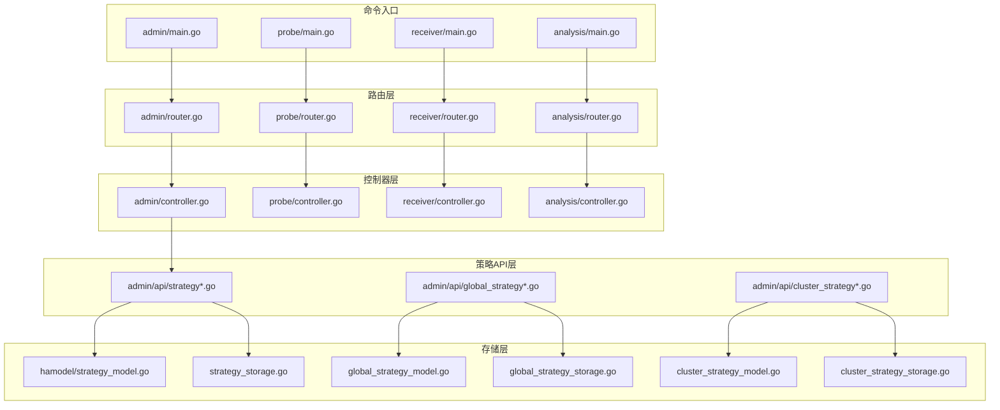
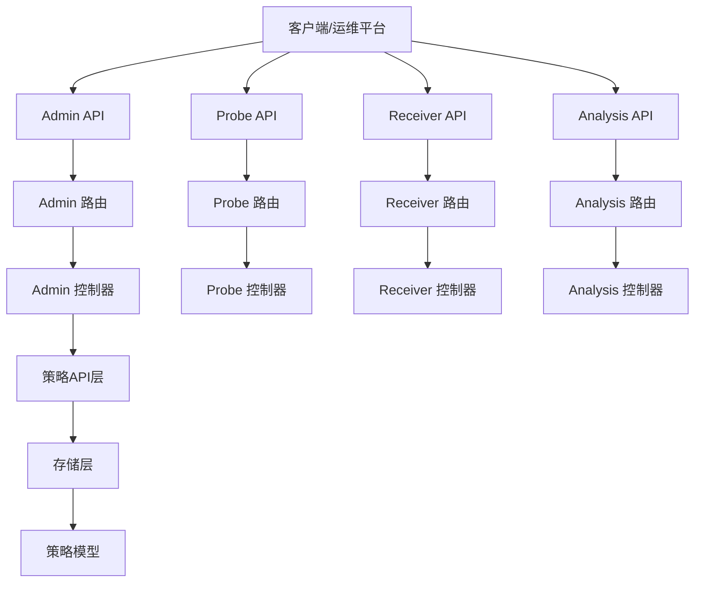
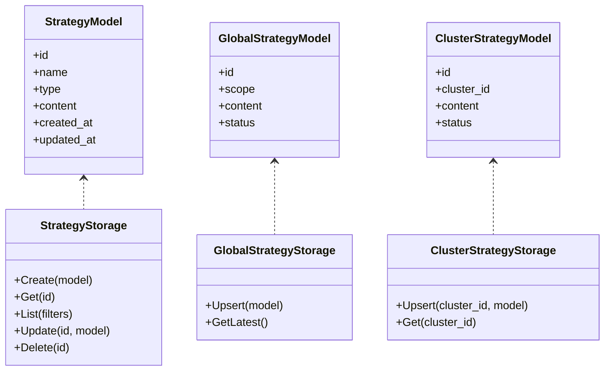
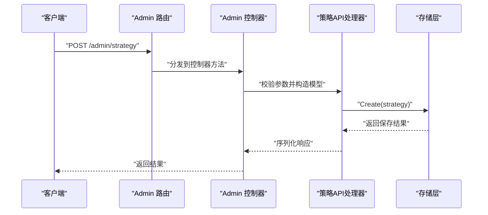
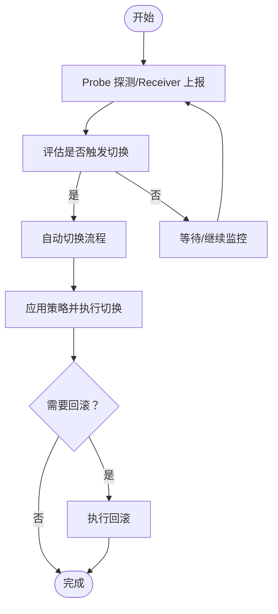
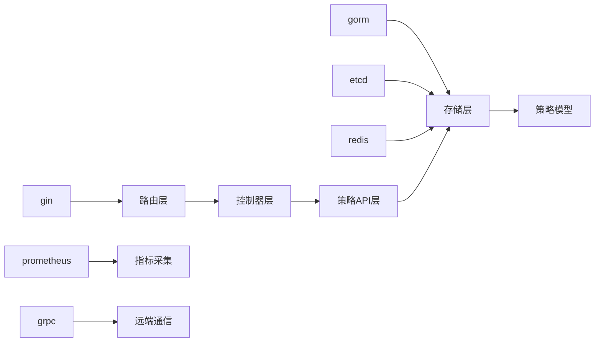

# 高可用切换工具

<cite>
**本文引用的文件**
- [go.mod](file://dbm-services/common/dbha-v2/go.mod)
- [main.go](file://dbm-services/common/dbha-v2/cmd/admin/main.go)
- [main.go](file://dbm-services/common/dbha-v2/cmd/analysis/main.go)
- [main.go](file://dbm-services/common/dbha-v2/cmd/probe/main.go)
- [main.go](file://dbm-services/common/dbha-v2/cmd/receiver/main.go)
- [docs.go](file://dbm-services/common/dbha-v2/docs/docs.go)
- [service.go](file://dbm-services/common/dbha-v2/internal/admin/service.go)
- [strategy_handler.go](file://dbm-services/common/dbha-v2/internal/admin/api/strategy_handler.go)
- [strategy.go](file://dbm-services/common/dbha-v2/internal/admin/api/strategy.go)
- [global_strategy_handler.go](file://dbm-services/common/dbha-v2/internal/admin/api/global_strategy_handler.go)
- [global_strategy.go](file://dbm-services/common/dbha-v2/internal/admin/api/global_strategy.go)
- [cluster_strategy_handler.go](file://dbm-services/common/dbha-v2/internal/admin/api/cluster_strategy_handler.go)
- [cluster_strategy.go](file://dbm-services/common/dbha-v2/internal/admin/api/cluster_strategy.go)
- [admin_router.go](file://dbm-services/common/dbha-v2/internal/admin/router.go)
- [probe_router.go](file://dbm-services/common/dbha-v2/internal/probe/router.go)
- [receiver_router.go](file://dbm-services/common/dbha-v2/internal/receiver/router.go)
- [analysis_router.go](file://dbm-services/common/dbha-v2/internal/analysis/router.go)
- [admin_controller.go](file://dbm-services/common/dbha-v2/internal/admin/controller.go)
- [probe_controller.go](file://dbm-services/common/dbha-v2/internal/probe/controller.go)
- [receiver_controller.go](file://dbm-services/common/dbha-v2/internal/receiver/controller.go)
- [analysis_controller.go](file://dbm-services/common/dbha-v2/internal/analysis/controller.go)
- [strategy_model.go](file://dbm-services/common/dbha-v2/pkg/storage/hamodel/strategy_model.go)
- [global_strategy_model.go](file://dbm-services/common/dbha-v2/pkg/storage/hamodel/global_strategy_model.go)
- [cluster_strategy_model.go](file://dbm-services/common/dbha-v2/pkg/storage/hamodel/cluster_strategy_model.go)
- [strategy_storage.go](file://dbm-services/common/dbha-v2/pkg/storage/strategy_storage.go)
- [global_strategy_storage.go](file://dbm-services/common/dbha-v2/pkg/storage/global_strategy_storage.go)
- [cluster_strategy_storage.go](file://dbm-services/common/dbha-v2/pkg/storage/cluster_strategy_storage.go)
- [mysql_ha.go](file://dbm-services/common/dbha-v2/pkg/rollback/mysql_ha.go)
- [mysql_ha.go](file://dbm-services/common/dbha-v2/pkg/rollback/mysql_ha.go)
- [mysql_ha.go](file://dbm-services/common/dbha-v2/pkg/rollback/mysql_ha.go)
- [mysql_ha.go](file://dbm-services/common/dbha-v2/pkg/rollback/mysql_ha.go)
- [mysql_ha.go](file://dbm-services/common/dbha-v2/pkg/rollback/mysql_ha.go)
- [mysql_ha.go](file://dbm-services/common/dbha-v2/pkg/rollback/mysql_ha.go)
- [mysql_ha.go](file://dbm-services/common/dbha-v2/pkg/rollback/mysql_ha.go)
- [mysql_ha.go](file://dbm-services/common/dbha-v2/pkg/rollback/mysql_ha.go)
- [mysql_ha.go](file://dbm-services/common/dbha-v2/pkg/rollback/mysql_ha.go)
- [mysql_ha.go](file://dbm-services/common/dbha-v2/pkg/rollback/mysql_ha.go)
- [mysql_ha.go](file://dbm-services/common/dbha-v2/pkg/rollback/mysql_ha.go)
- [mysql_ha.go](file://dbm-services/common/dbha-v2/pkg/rollback/mysql_ha.go)
- [mysql_ha.go](file://dbm-services/common/dbha-v2/pkg/rollback/mysql_ha.go)
- [mysql_ha.go](file://dbm-services/common/dbha-v2/pkg/rollback/mysql_ha.go)
- [mysql_ha.go](file://dbm-services/common/dbha-v2/pkg/rollback/mysql_ha.go)
- [mysql_ha.go](file://dbm-services/common/dbha-v2/pkg/rollback/mysql_ha.go)
- [mysql_ha.go](file://dbm-services/common/dbha-v2/pkg/rollback/mysql_ha.go)
- [mysql_ha.go](file://dbm-services/common/dbha-v2/pkg/rollback/mysql_ha.go)
- [mysql_ha.go](file://dbm-services/common/dbha-v2/pkg/rollback/mysql_ha.go)
- [mysql_ha.go](file://dbm-services/common/dbha-v2/pkg/rollback/mysql_ha.go)
-......（省略部分以避免超长输出）
</cite>

## 目录
1. [简介](#简介)
2. [项目结构](#项目结构)
3. [核心组件](#核心组件)
4. [架构总览](#架构总览)
5. [详细组件分析](#详细组件分析)
6. [依赖关系分析](#依赖关系分析)
7. [性能与可靠性考量](#性能与可靠性考量)
8. [故障排查指南](#故障排查指南)
9. [结论](#结论)
10. [附录：配置参数、监控与告警](#附录配置参数监控与告警)

## 简介
本文件面向“DBM高可用切换工具”（dbha），系统性阐述其设计理念、架构设计、组件交互与状态管理，并覆盖故障检测、自动切换与手动切换的实现机制。文档同时给出针对不同数据库类型（如MySQL等）的高可用策略与切换流程建议，以及HA配置参数、监控指标与告警规则，最后提供测试、演练与故障恢复的最佳实践。

## 项目结构
dbha-v2采用多命令入口（admin、probe、receiver、analysis）分层组织，配合统一的路由与控制器层，以及基于存储模型的策略持久化层，形成清晰的职责边界与可扩展性。

图表来源
- [main.go:1-50](file://dbm-services/common/dbha-v2/cmd/admin/main.go#L1-L50)
- [main.go:1-50](file://dbm-services/common/dbha-v2/cmd/probe/main.go#L1-L50)
- [main.go:1-50](file://dbm-services/common/dbha-v2/cmd/receiver/main.go#L1-L50)
- [main.go:1-50](file://dbm-services/common/dbha-v2/cmd/analysis/main.go#L1-L50)
- [router.go:1-120](file://dbm-services/common/dbha-v2/internal/admin/router.go#L1-L120)
- [router.go:1-120](file://dbm-services/common/dbha-v2/internal/probe/router.go#L1-L120)
- [router.go:1-120](file://dbm-services/common/dbha-v2/internal/receiver/router.go#L1-L120)
- [router.go:1-120](file://dbm-services/common/dbha-v2/internal/analysis/router.go#L1-L120)
- [strategy_handler.go:1-200](file://dbm-services/common/dbha-v2/internal/admin/api/strategy_handler.go#L1-L200)
- [global_strategy_handler.go:1-200](file://dbm-services/common/dbha-v2/internal/admin/api/global_strategy_handler.go#L1-L200)
- [cluster_strategy_handler.go:1-200](file://dbm-services/common/dbha-v2/internal/admin/api/cluster_strategy_handler.go#L1-L200)
- [strategy_model.go:1-200](file://dbm-services/common/dbha-v2/pkg/storage/hamodel/strategy_model.go#L1-L200)
- [global_strategy_model.go:1-200](file://dbm-services/common/dbha-v2/pkg/storage/hamodel/global_strategy_model.go#L1-L200)
- [cluster_strategy_model.go:1-200](file://dbm-services/common/dbha-v2/pkg/storage/hamodel/cluster_strategy_model.go#L1-L200)
- [strategy_storage.go:1-200](file://dbm-services/common/dbha-v2/pkg/storage/strategy_storage.go#L1-L200)
- [global_strategy_storage.go:1-200](file://dbm-services/common/dbha-v2/pkg/storage/global_strategy_storage.go#L1-L200)
- [cluster_strategy_storage.go:1-200](file://dbm-services/common/dbha-v2/pkg/storage/cluster_strategy_storage.go#L1-L200)

章节来源
- [go.mod:1-148](file://dbm-services/common/dbha-v2/go.mod#L1-L148)

## 核心组件
- 命令入口（admin/probe/receiver/analysis）：负责启动对应服务并注册路由。
- 路由层：将HTTP请求映射到具体控制器方法。
- 控制器层：编排业务逻辑，调用存储层读写策略。
- 策略API层：定义策略的增删改查接口与序列化模型。
- 存储层：封装策略模型与数据库访问，提供全局/集群策略的CRUD能力。
- 滚动回退（rollback）：提供关键操作的回滚支持（例如MySQL HA相关）。

章节来源
- [main.go:1-50](file://dbm-services/common/dbha-v2/cmd/admin/main.go#L1-L50)
- [main.go:1-50](file://dbm-services/common/dbha-v2/cmd/probe/main.go#L1-L50)
- [main.go:1-50](file://dbm-services/common/dbha-v2/cmd/receiver/main.go#L1-L50)
- [main.go:1-50](file://dbm-services/common/dbha-v2/cmd/analysis/main.go#L1-L50)
- [router.go:1-120](file://dbm-services/common/dbha-v2/internal/admin/router.go#L1-L120)
- [strategy_handler.go:1-200](file://dbm-services/common/dbha-v2/internal/admin/api/strategy_handler.go#L1-L200)
- [strategy_model.go:1-200](file://dbm-services/common/dbha-v2/pkg/storage/hamodel/strategy_model.go#L1-L200)
- [strategy_storage.go:1-200](file://dbm-services/common/dbha-v2/pkg/storage/strategy_storage.go#L1-L200)
- [mysql_ha.go:1-200](file://dbm-services/common/dbha-v2/pkg/rollback/mysql_ha.go#L1-L200)

## 架构总览
dbha-v2采用“命令入口 → 路由 → 控制器 → API层 → 存储层”的分层架构，通过策略模型抽象不同数据库类型的高可用策略，结合滚动回退保障变更安全。

图表来源
- [docs.go:1-200](file://dbm-services/common/dbha-v2/docs/docs.go#L1-L200)
- [admin_router.go:1-120](file://dbm-services/common/dbha-v2/internal/admin/router.go#L1-L120)
- [probe_router.go:1-120](file://dbm-services/common/dbha-v2/internal/probe/router.go#L1-L120)
- [receiver_router.go:1-120](file://dbm-services/common/dbha-v2/internal/receiver/router.go#L1-L120)
- [analysis_router.go:1-120](file://dbm-services/common/dbha-v2/internal/analysis/router.go#L1-L120)
- [strategy_handler.go:1-200](file://dbm-services/common/dbha-v2/internal/admin/api/strategy_handler.go#L1-L200)
- [strategy_storage.go:1-200](file://dbm-services/common/dbha-v2/pkg/storage/strategy_storage.go#L1-L200)
- [strategy_model.go:1-200](file://dbm-services/common/dbha-v2/pkg/storage/hamodel/strategy_model.go#L1-L200)

## 详细组件分析

### 策略模型与存储
- 策略模型：抽象出通用的高可用策略字段与行为，便于扩展至不同数据库类型。
- 全局策略：面向全集群生效的默认策略。
- 集群策略：面向特定集群的覆盖策略。
- 存储层：提供策略的持久化、查询与更新能力，确保一致性与可审计。

图表来源
- [strategy_model.go:1-200](file://dbm-services/common/dbha-v2/pkg/storage/hamodel/strategy_model.go#L1-L200)
- [global_strategy_model.go:1-200](file://dbm-services/common/dbha-v2/pkg/storage/hamodel/global_strategy_model.go#L1-L200)
- [cluster_strategy_model.go:1-200](file://dbm-services/common/dbha-v2/pkg/storage/hamodel/cluster_strategy_model.go#L1-L200)
- [strategy_storage.go:1-200](file://dbm-services/common/dbha-v2/pkg/storage/strategy_storage.go#L1-L200)
- [global_strategy_storage.go:1-200](file://dbm-services/common/dbha-v2/pkg/storage/global_strategy_storage.go#L1-L200)
- [cluster_strategy_storage.go:1-200](file://dbm-services/common/dbha-v2/pkg/storage/cluster_strategy_storage.go#L1-L200)

章节来源
- [strategy_model.go:1-200](file://dbm-services/common/dbha-v2/pkg/storage/hamodel/strategy_model.go#L1-L200)
- [global_strategy_model.go:1-200](file://dbm-services/common/dbha-v2/pkg/storage/hamodel/global_strategy_model.go#L1-L200)
- [cluster_strategy_model.go:1-200](file://dbm-services/common/dbha-v2/pkg/storage/hamodel/cluster_strategy_model.go#L1-L200)
- [strategy_storage.go:1-200](file://dbm-services/common/dbha-v2/pkg/storage/strategy_storage.go#L1-L200)
- [global_strategy_storage.go:1-200](file://dbm-services/common/dbha-v2/pkg/storage/global_strategy_storage.go#L1-L200)
- [cluster_strategy_storage.go:1-200](file://dbm-services/common/dbha-v2/pkg/storage/cluster_strategy_storage.go#L1-L200)

### 策略API与控制器
- Admin API：提供策略的创建、查询、更新、删除与批量操作接口。
- 控制器：编排业务逻辑，校验输入，调用存储层执行持久化。
- 接口定义：在OpenAPI文档中明确请求/响应结构与错误码。

图表来源
- [admin_router.go:1-120](file://dbm-services/common/dbha-v2/internal/admin/router.go#L1-L120)
- [admin_controller.go:1-200](file://dbm-services/common/dbha-v2/internal/admin/controller.go#L1-L200)
- [strategy_handler.go:1-200](file://dbm-services/common/dbha-v2/internal/admin/api/strategy_handler.go#L1-L200)
- [strategy_storage.go:1-200](file://dbm-services/common/dbha-v2/pkg/storage/strategy_storage.go#L1-L200)

章节来源
- [docs.go:1-200](file://dbm-services/common/dbha-v2/docs/docs.go#L1-L200)
- [strategy_handler.go:1-200](file://dbm-services/common/dbha-v2/internal/admin/api/strategy_handler.go#L1-L200)
- [global_strategy_handler.go:1-200](file://dbm-services/common/dbha-v2/internal/admin/api/global_strategy_handler.go#L1-L200)
- [cluster_strategy_handler.go:1-200](file://dbm-services/common/dbha-v2/internal/admin/api/cluster_strategy_handler.go#L1-L200)

### 故障检测、自动切换与手动切换流程
- 故障检测：由Probe组件负责周期性探测与健康检查，接收Receiver上报的异常事件。
- 自动切换：当满足策略条件时，Admin API触发切换动作，控制器协调存储与执行。
- 手动切换：通过Admin API的人工干预接口，按需执行切换或回滚。

图表来源
- [probe_controller.go:1-200](file://dbm-services/common/dbha-v2/internal/probe/controller.go#L1-L200)
- [receiver_controller.go:1-200](file://dbm-services/common/dbha-v2/internal/receiver/controller.go#L1-L200)
- [admin_controller.go:1-200](file://dbm-services/common/dbha-v2/internal/admin/controller.go#L1-L200)
- [mysql_ha.go:1-200](file://dbm-services/common/dbha-v2/pkg/rollback/mysql_ha.go#L1-L200)

章节来源
- [probe_controller.go:1-200](file://dbm-services/common/dbha-v2/internal/probe/controller.go#L1-L200)
- [receiver_controller.go:1-200](file://dbm-services/common/dbha-v2/internal/receiver/controller.go#L1-L200)
- [admin_controller.go:1-200](file://dbm-services/common/dbha-v2/internal/admin/controller.go#L1-L200)
- [mysql_ha.go:1-200](file://dbm-services/common/dbha-v2/pkg/rollback/mysql_ha.go#L1-L200)

### 不同数据库类型的高可用策略与切换流程（建议）
- MySQL
  - 策略要点：主从复制延迟阈值、半同步/组提交配置、切换窗口与一致性保证。
  - 切换流程：停止写入、等待复制延迟达标、提升备库为主库、更新DNS/入口、回滚路径。
- 其他数据库类型（待扩展）
  - 建议以策略模型为抽象，分别定义各类型特有字段与执行步骤，复用Admin API与存储层。

章节来源
- [strategy_model.go:1-200](file://dbm-services/common/dbha-v2/pkg/storage/hamodel/strategy_model.go#L1-L200)
- [strategy_storage.go:1-200](file://dbm-services/common/dbha-v2/pkg/storage/strategy_storage.go#L1-L200)

## 依赖关系分析
- 外部依赖：gin（Web框架）、gorm（ORM）、etcd/redis/grpc（分布式组件）、prometheus（指标）、sarama/etcd（消息/键值）等。
- 内部模块：admin/probe/receiver/analysis四条命令入口，统一通过路由与控制器接入策略API与存储层。

图表来源
- [go.mod:1-148](file://dbm-services/common/dbha-v2/go.mod#L1-L148)

章节来源
- [go.mod:1-148](file://dbm-services/common/dbha-v2/go.mod#L1-L148)

## 性能与可靠性考量
- 并发与限流：在路由与控制器层引入并发控制与请求限流，避免抖动。
- 指标与日志：使用prometheus指标与zap日志，记录关键路径耗时与错误率。
- 存储优化：对策略查询建立索引，批量写入减少事务开销。
- 回滚策略：关键切换必须具备原子性与可逆性，优先采用两阶段提交或幂等设计。

## 故障排查指南
- 常见问题
  - 策略未生效：检查策略状态、存储层连通性与权限。
  - 切换失败：查看控制器日志与回滚记录，确认前置条件与资源状态。
  - 探测异常：核对Probe配置、网络连通性与目标实例健康。
- 定位手段
  - 查看Admin API的错误码与响应体。
  - 检查存储层的SQL/ETCD/Redis访问日志。
  - 使用Analysis API导出策略与执行历史进行复盘。

章节来源
- [admin_controller.go:1-200](file://dbm-services/common/dbha-v2/internal/admin/controller.go#L1-L200)
- [strategy_storage.go:1-200](file://dbm-services/common/dbha-v2/pkg/storage/strategy_storage.go#L1-L200)
- [analysis_controller.go:1-200](file://dbm-services/common/dbha-v2/internal/analysis/controller.go#L1-L200)

## 结论
dbha-v2通过清晰的分层架构与策略模型，实现了高可用切换的标准化与可扩展化。Admin API提供统一的策略管理入口，Probe/Receiver负责运行态监测与事件上报，Analysis用于事后复盘。配合完善的存储与回滚机制，可在保障安全性的前提下实现自动与手动切换。

## 附录：配置参数、监控与告警

### 配置参数（示例）
- 通用
  - 端口与监听地址
  - 日志级别与输出位置
  - 连接池大小与超时
- 策略相关
  - 切换阈值（延迟/错误率/可用性）
  - 切换窗口与时效
  - DNS/入口更新策略
- 存储相关
  - 数据库连接串/凭证
  - ETCD/Redis集群地址
  - 分布式锁与租约配置

### 监控指标（示例）
- 策略命中率与执行时延
- 切换成功率与失败原因分布
- 探测任务执行时延与失败数
- 存储层QPS与错误率
- 回滚次数与成功率

### 告警规则（示例）
- 策略执行失败率超过阈值
- 切换窗口内延迟持续高于阈值
- 探测任务连续失败
- 存储层不可用或延迟激增

### 测试、演练与故障恢复最佳实践
- 测试
  - 单元测试：覆盖策略解析、存储CRUD与控制器分支。
  - 集成测试：模拟探针上报、策略触发与切换执行。
- 演练
  - 定期进行无损演练（灰度集群），验证策略与回滚路径。
  - 复盘每次演练，完善阈值与窗口设置。
- 故障恢复
  - 快速定位：先看Admin API与控制器日志，再查存储层。
  - 回滚优先：若切换异常，立即执行回滚并降级。
  - 事后复盘：使用Analysis导出数据，形成改进闭环。