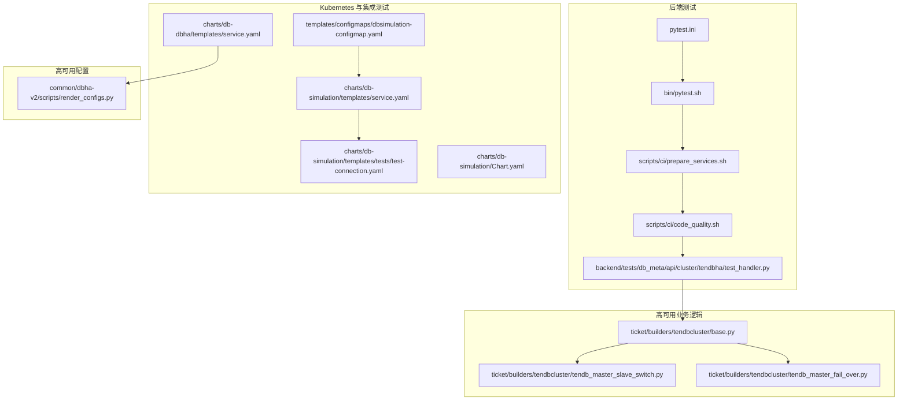
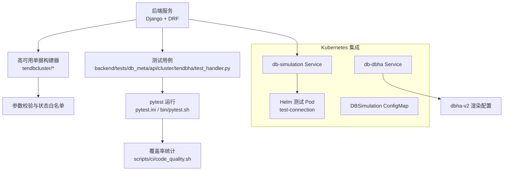
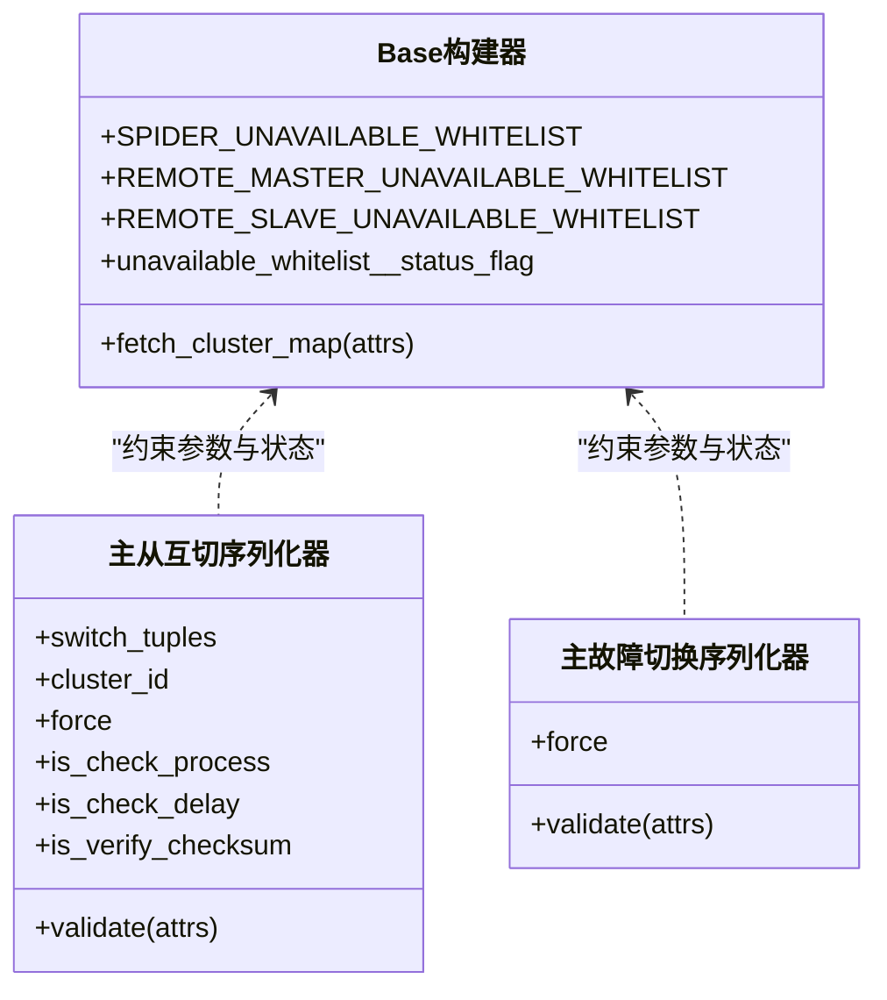
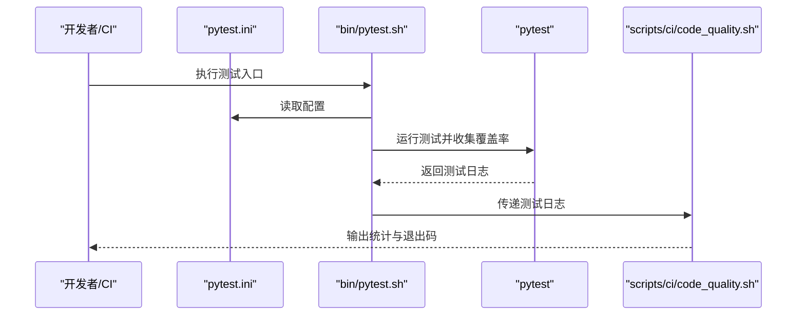
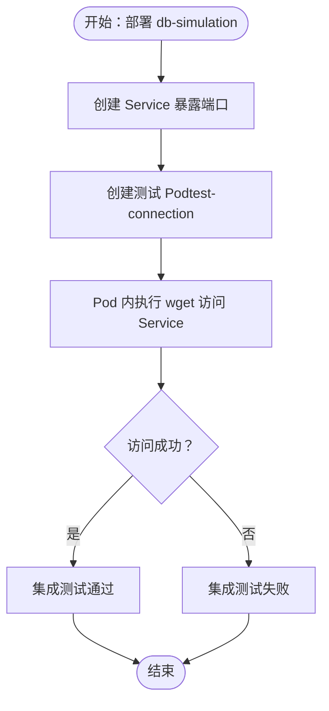
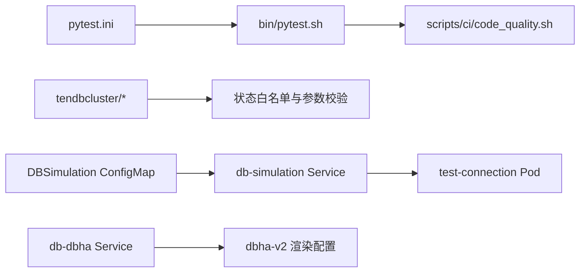
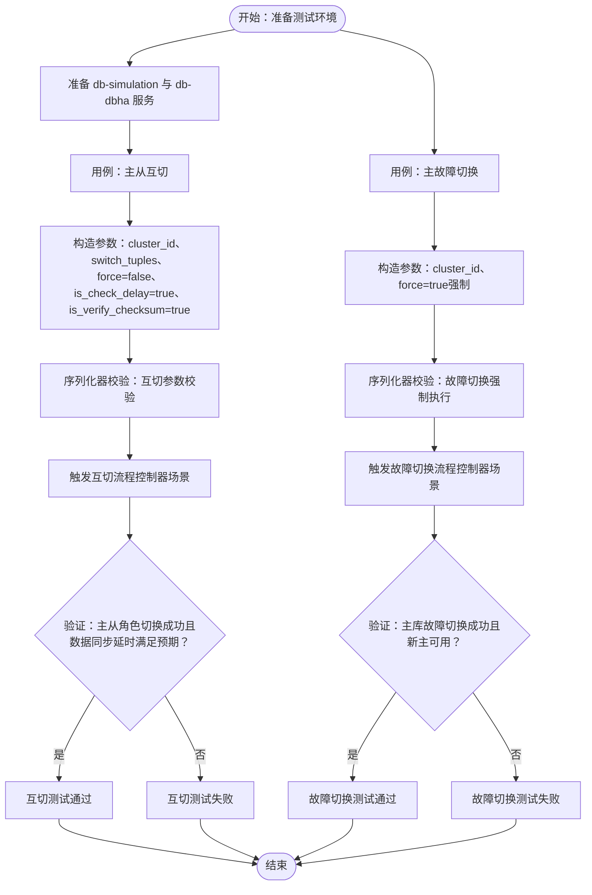

# 高可用测试验证

<cite>
**本文引用的文件**
- [pytest.ini](file://dbm-ui/pytest.ini)
- [pytest.sh](file://dbm-ui/bin/pytest.sh)
- [code_quality.sh](file://dbm-ui/scripts/ci/code_quality.sh)
- [prepare_services.sh](file://dbm-ui/scripts/ci/prepare_services.sh)
- [test_handler.py（TenDBCluster HA）](file://dbm-ui/backend/tests/db_meta/api/cluster/tendbha/test_handler.py)
- [base.py（TenDBCluster HA 票据构建器基类）](file://dbm-ui/backend/ticket/builders/tendbcluster/base.py)
- [tendb_master_slave_switch.py（主从互切）](file://dbm-ui/backend/ticket/builders/tendbcluster/tendb_master_slave_switch.py)
- [tendb_master_fail_over.py（主故障切换）](file://dbm-ui/backend/ticket/builders/tendbcluster/tendb_master_fail_over.py)
- [test-connection.yaml（Helm 测试 Pod）](file://helm-charts/bk-dbm/charts/db-simulation/templates/tests/test-connection.yaml)
- [service.yaml（db-simulation Service）](file://helm-charts/bk-dbm/charts/db-simulation/templates/service.yaml)
- [service.yaml（db-dbha Service）](file://helm-charts/bk-dbm/charts/db-dbha/templates/service.yaml)
- [dbsimulation-configmap.yaml（DBSimulation 配置）](file://helm-charts/bk-dbm/templates/configmaps/dbsimulation-configmap.yaml)
- [Chart.yaml（db-simulation Chart）](file://helm-charts/bk-dbm/charts/db-simulation/Chart.yaml)
- [render_configs.py（dbha-v2 渲染配置）](file://dbm-services/common/dbha-v2/scripts/render_configs.py)
</cite>

## 目录
1. [引言](#引言)
2. [项目结构](#项目结构)
3. [核心组件](#核心组件)
4. [架构总览](#架构总览)
5. [详细组件分析](#详细组件分析)
6. [依赖分析](#依赖分析)
7. [性能考虑](#性能考虑)
8. [故障注入与切换验证流程](#故障注入与切换验证流程)
9. [测试工具与用例设计原则](#测试工具与用例设计原则)
10. [自动化测试脚本与测试报告](#自动化测试脚本与测试报告)
11. [测试结果分析与回归策略](#测试结果分析与回归策略)
12. [结论](#结论)
13. [附录](#附录)

## 引言
本文件面向高可用系统测试验证，围绕单元测试、集成测试与端到端测试三层次，结合本仓库中现有的测试脚本、测试用例与 Helm 测试模板，系统化梳理测试环境搭建、故障注入与切换验证流程、测试工具使用、测试用例设计原则、自动化测试脚本与报告生成、测试结果分析与回归策略。目标是帮助测试工程师与开发工程师在不同阶段快速落地高可用功能的可重复、可观测、可追溯的测试方案。

## 项目结构
本项目由前端 UI、后端服务、数据库与中间件、Kubernetes Helm Charts 组成。与高可用测试直接相关的关键位置如下：
- 后端测试入口与配置：pytest.ini、bin/pytest.sh、scripts/ci/*（准备环境、执行测试、统计覆盖率）
- 高可用相关业务逻辑与单据流程：ticket/builders/tendbcluster 下的切换与故障切换序列化器与构建器
- 高可用服务与外部依赖：db-dbha 的 Service 定义；db-simulation 的 Service 与 Helm 测试 Pod；DBSimulation 配置 ConfigMap
- dbha-v2 配置渲染脚本：用于生成高可用相关配置

**图表来源**
- [pytest.ini:1-21](file://dbm-ui/pytest.ini#L1-L21)
- [pytest.sh:1-7](file://dbm-ui/bin/pytest.sh#L1-L7)
- [prepare_services.sh:1-20](file://dbm-ui/scripts/ci/prepare_services.sh#L1-L20)
- [code_quality.sh:1-62](file://dbm-ui/scripts/ci/code_quality.sh#L1-L62)
- [test_handler.py（TenDBCluster HA）](file://dbm-ui/backend/tests/db_meta/api/cluster/tendbha/test_handler.py)
- [base.py（TenDBCluster HA 票据构建器基类）:55-79](file://dbm-ui/backend/ticket/builders/tendbcluster/base.py#L55-L79)
- [tendb_master_slave_switch.py（主从互切）:23-46](file://dbm-ui/backend/ticket/builders/tendbcluster/tendb_master_slave_switch.py#L23-L46)
- [tendb_master_fail_over.py（主故障切换）:19-49](file://dbm-ui/backend/ticket/builders/tendbcluster/tendb_master_fail_over.py#L19-L49)
- [service.yaml（db-simulation Service）:1-15](file://helm-charts/bk-dbm/charts/db-simulation/templates/service.yaml#L1-L15)
- [test-connection.yaml（Helm 测试 Pod）:1-15](file://helm-charts/bk-dbm/charts/db-simulation/templates/tests/test-connection.yaml#L1-L15)
- [service.yaml（db-dbha Service）:1-17](file://helm-charts/bk-dbm/charts/db-dbha/templates/service.yaml#L1-L17)
- [dbsimulation-configmap.yaml（DBSimulation 配置）:58-76](file://helm-charts/bk-dbm/templates/configmaps/dbsimulation-configmap.yaml#L58-L76)
- [Chart.yaml（db-simulation Chart）:1-6](file://helm-charts/bk-dbm/charts/db-simulation/Chart.yaml#L1-L6)
- [render_configs.py（dbha-v2 渲染配置）](file://dbm-services/common/dbha-v2/scripts/render_configs.py)

**章节来源**
- [pytest.ini:1-21](file://dbm-ui/pytest.ini#L1-L21)
- [pytest.sh:1-7](file://dbm-ui/bin/pytest.sh#L1-L7)
- [prepare_services.sh:1-20](file://dbm-ui/scripts/ci/prepare_services.sh#L1-L20)
- [code_quality.sh:1-62](file://dbm-ui/scripts/ci/code_quality.sh#L1-L62)
- [test_handler.py（TenDBCluster HA）](file://dbm-ui/backend/tests/db_meta/api/cluster/tendbha/test_handler.py)
- [base.py（TenDBCluster HA 票据构建器基类）:55-79](file://dbm-ui/backend/ticket/builders/tendbcluster/base.py#L55-L79)
- [tendb_master_slave_switch.py（主从互切）:23-46](file://dbm-ui/backend/ticket/builders/tendbcluster/tendb_master_slave_switch.py#L23-L46)
- [tendb_master_fail_over.py（主故障切换）:19-49](file://dbm-ui/backend/ticket/builders/tendbcluster/tendb_master_fail_over.py#L19-L49)
- [service.yaml（db-simulation Service）:1-15](file://helm-charts/bk-dbm/charts/db-simulation/templates/service.yaml#L1-L15)
- [test-connection.yaml（Helm 测试 Pod）:1-15](file://helm-charts/bk-dbm/charts/db-simulation/templates/tests/test-connection.yaml#L1-L15)
- [service.yaml（db-dbha Service）:1-17](file://helm-charts/bk-dbm/charts/db-dbha/templates/service.yaml#L1-L17)
- [dbsimulation-configmap.yaml（DBSimulation 配置）:58-76](file://helm-charts/bk-dbm/templates/configmaps/dbsimulation-configmap.yaml#L58-L76)
- [Chart.yaml（db-simulation Chart）:1-6](file://helm-charts/bk-dbm/charts/db-simulation/Chart.yaml#L1-L6)
- [render_configs.py（dbha-v2 渲染配置）](file://dbm-services/common/dbha-v2/scripts/render_configs.py)

## 核心组件
- 测试运行与覆盖率统计：通过 pytest.ini 指定 Django 设置与测试路径，bin/pytest.sh 统一调用 pytest 并启用覆盖率；scripts/ci/code_quality.sh 解析 pytest 输出并提取测试计数、失败/错误/跳过数量与覆盖率。
- 高可用业务单据与校验：tendbcluster 下的 Base 构建器定义了在不同集群状态（接入层/存储层异常）下的可用单据白名单；主从互切与主故障切换的序列化器对参数进行严格校验。
- 集成测试与端到端测试：Helm Chart 中的 db-simulation 提供 Service 与测试 Pod（test-connection），用于验证服务连通性；db-dbha 的 Service 作为高可用管理组件暴露；DBSimulation 配置 ConfigMap 提供外部依赖连接参数。
- 高可用配置渲染：dbha-v2 的渲染脚本负责生成高可用相关配置，保障测试与生产一致性。

**章节来源**
- [pytest.ini:1-21](file://dbm-ui/pytest.ini#L1-L21)
- [pytest.sh:1-7](file://dbm-ui/bin/pytest.sh#L1-L7)
- [code_quality.sh:1-62](file://dbm-ui/scripts/ci/code_quality.sh#L1-L62)
- [base.py（TenDBCluster HA 票据构建器基类）:55-79](file://dbm-ui/backend/ticket/builders/tendbcluster/base.py#L55-L79)
- [tendb_master_slave_switch.py（主从互切）:23-46](file://dbm-ui/backend/ticket/builders/tendbcluster/tendb_master_slave_switch.py#L23-L46)
- [tendb_master_fail_over.py（主故障切换）:19-49](file://dbm-ui/backend/ticket/builders/tendbcluster/tendb_master_fail_over.py#L19-L49)
- [service.yaml（db-simulation Service）:1-15](file://helm-charts/bk-dbm/charts/db-simulation/templates/service.yaml#L1-L15)
- [test-connection.yaml（Helm 测试 Pod）:1-15](file://helm-charts/bk-dbm/charts/db-simulation/templates/tests/test-connection.yaml#L1-L15)
- [service.yaml（db-dbha Service）:1-17](file://helm-charts/bk-dbm/charts/db-dbha/templates/service.yaml#L1-L17)
- [dbsimulation-configmap.yaml（DBSimulation 配置）:58-76](file://helm-charts/bk-dbm/templates/configmaps/dbsimulation-configmap.yaml#L58-L76)
- [render_configs.py（dbha-v2 渲染配置）](file://dbm-services/common/dbha-v2/scripts/render_configs.py)

## 架构总览
下图展示高可用测试涉及的后端、业务单据、Kubernetes 集成与配置渲染的整体关系：

**图表来源**
- [pytest.ini:1-21](file://dbm-ui/pytest.ini#L1-L21)
- [pytest.sh:1-7](file://dbm-ui/bin/pytest.sh#L1-L7)
- [code_quality.sh:1-62](file://dbm-ui/scripts/ci/code_quality.sh#L1-L62)
- [test_handler.py（TenDBCluster HA）](file://dbm-ui/backend/tests/db_meta/api/cluster/tendbha/test_handler.py)
- [base.py（TenDBCluster HA 票据构建器基类）:55-79](file://dbm-ui/backend/ticket/builders/tendbcluster/base.py#L55-L79)
- [service.yaml（db-simulation Service）:1-15](file://helm-charts/bk-dbm/charts/db-simulation/templates/service.yaml#L1-L15)
- [test-connection.yaml（Helm 测试 Pod）:1-15](file://helm-charts/bk-dbm/charts/db-simulation/templates/tests/test-connection.yaml#L1-L15)
- [service.yaml（db-dbha Service）:1-17](file://helm-charts/bk-dbm/charts/db-dbha/templates/service.yaml#L1-L17)
- [dbsimulation-configmap.yaml（DBSimulation 配置）:58-76](file://helm-charts/bk-dbm/templates/configmaps/dbsimulation-configmap.yaml#L58-L76)
- [render_configs.py（dbha-v2 渲染配置）](file://dbm-services/common/dbha-v2/scripts/render_configs.py)

## 详细组件分析

### 组件A：高可用单据与参数校验（序列化器与构建器）
- 基类定义：在 tendbcluster/base.py 中，根据集群状态标志（接入层不可用、远端主库不可用、远端从库不可用）维护可用单据白名单，确保在不同异常状态下仅允许正确的操作。
- 主从互切：tendb_master_slave_switch.py 中的序列化器对“是否强制”“是否检测延迟”“是否校验校验和”等参数进行严格校验，保证互切过程的安全性。
- 主故障切换：tendb_master_fail_over.py 中的序列化器要求强制执行，并调用对应的控制器场景，确保故障场景下的强一致切换。

**图表来源**
- [base.py（TenDBCluster HA 票据构建器基类）:55-79](file://dbm-ui/backend/ticket/builders/tendbcluster/base.py#L55-L79)
- [tendb_master_slave_switch.py（主从互切）:23-46](file://dbm-ui/backend/ticket/builders/tendbcluster/tendb_master_slave_switch.py#L23-L46)
- [tendb_master_fail_over.py（主故障切换）:19-49](file://dbm-ui/backend/ticket/builders/tendbcluster/tendb_master_fail_over.py#L19-L49)

**章节来源**
- [base.py（TenDBCluster HA 票据构建器基类）:55-79](file://dbm-ui/backend/ticket/builders/tendbcluster/base.py#L55-L79)
- [tendb_master_slave_switch.py（主从互切）:23-46](file://dbm-ui/backend/ticket/builders/tendbcluster/tendb_master_slave_switch.py#L23-L46)
- [tendb_master_fail_over.py（主故障切换）:19-49](file://dbm-ui/backend/ticket/builders/tendbcluster/tendb_master_fail_over.py#L19-L49)

### 组件B：测试运行与覆盖率统计
- pytest.ini：指定 Django 设置、禁用迁移、复用数据库、测试路径与标记。
- bin/pytest.sh：统一入口，设置环境变量并执行 pytest --cov。
- scripts/ci/code_quality.sh：解析 pytest 输出，统计测试时长、覆盖率、成功/失败/跳过/异常数量，并在有失败或异常时退出。

**图表来源**
- [pytest.ini:1-21](file://dbm-ui/pytest.ini#L1-L21)
- [pytest.sh:1-7](file://dbm-ui/bin/pytest.sh#L1-L7)
- [code_quality.sh:1-62](file://dbm-ui/scripts/ci/code_quality.sh#L1-L62)

**章节来源**
- [pytest.ini:1-21](file://dbm-ui/pytest.ini#L1-L21)
- [pytest.sh:1-7](file://dbm-ui/bin/pytest.sh#L1-L7)
- [code_quality.sh:1-62](file://dbm-ui/scripts/ci/code_quality.sh#L1-L62)

### 组件C：集成测试与端到端测试（Helm 测试）
- db-simulation Service：对外暴露 HTTP 端口，便于测试连通性。
- test-connection Pod：Helm Hook 测试 Pod，使用 wget 访问 db-simulation 服务，验证网络与服务可达性。
- db-dbha Service：高可用管理组件的服务暴露，配合 dbha-v2 渲染配置使用。
- DBSimulation ConfigMap：提供外部 Redis 地址、密码、调试开关以及可选的 MySQL/tdbctl 资源请求，支撑集成测试场景。

**图表来源**
- [service.yaml（db-simulation Service）:1-15](file://helm-charts/bk-dbm/charts/db-simulation/templates/service.yaml#L1-L15)
- [test-connection.yaml（Helm 测试 Pod）:1-15](file://helm-charts/bk-dbm/charts/db-simulation/templates/tests/test-connection.yaml#L1-L15)
- [dbsimulation-configmap.yaml（DBSimulation 配置）:58-76](file://helm-charts/bk-dbm/templates/configmaps/dbsimulation-configmap.yaml#L58-L76)

**章节来源**
- [service.yaml（db-simulation Service）:1-15](file://helm-charts/bk-dbm/charts/db-simulation/templates/service.yaml#L1-L15)
- [test-connection.yaml（Helm 测试 Pod）:1-15](file://helm-charts/bk-dbm/charts/db-simulation/templates/tests/test-connection.yaml#L1-L15)
- [service.yaml（db-dbha Service）:1-17](file://helm-charts/bk-dbm/charts/db-dbha/templates/service.yaml#L1-L17)
- [dbsimulation-configmap.yaml（DBSimulation 配置）:58-76](file://helm-charts/bk-dbm/templates/configmaps/dbsimulation-configmap.yaml#L58-L76)
- [Chart.yaml（db-simulation Chart）:1-6](file://helm-charts/bk-dbm/charts/db-simulation/Chart.yaml#L1-L6)

## 依赖分析
- 测试工具链：pytest.ini 与 bin/pytest.sh 共同构成测试入口；scripts/ci/code_quality.sh 负责覆盖率与统计输出。
- 业务依赖：高可用单据构建器依赖于集群状态标志与白名单，确保在异常状态下只允许安全的操作。
- 集成依赖：db-simulation 与 db-dbha 的 Service 与 ConfigMap 彼此独立但共同服务于高可用测试场景；dbha-v2 渲染配置为高可用组件提供参数基础。

**图表来源**
- [pytest.ini:1-21](file://dbm-ui/pytest.ini#L1-L21)
- [pytest.sh:1-7](file://dbm-ui/bin/pytest.sh#L1-L7)
- [code_quality.sh:1-62](file://dbm-ui/scripts/ci/code_quality.sh#L1-L62)
- [base.py（TenDBCluster HA 票据构建器基类）:55-79](file://dbm-ui/backend/ticket/builders/tendbcluster/base.py#L55-L79)
- [service.yaml（db-simulation Service）:1-15](file://helm-charts/bk-dbm/charts/db-simulation/templates/service.yaml#L1-L15)
- [test-connection.yaml（Helm 测试 Pod）:1-15](file://helm-charts/bk-dbm/charts/db-simulation/templates/tests/test-connection.yaml#L1-L15)
- [dbsimulation-configmap.yaml（DBSimulation 配置）:58-76](file://helm-charts/bk-dbm/templates/configmaps/dbsimulation-configmap.yaml#L58-L76)
- [service.yaml（db-dbha Service）:1-17](file://helm-charts/bk-dbm/charts/db-dbha/templates/service.yaml#L1-L17)
- [render_configs.py（dbha-v2 渲染配置）](file://dbm-services/common/dbha-v2/scripts/render_configs.py)

**章节来源**
- [pytest.ini:1-21](file://dbm-ui/pytest.ini#L1-L21)
- [pytest.sh:1-7](file://dbm-ui/bin/pytest.sh#L1-L7)
- [code_quality.sh:1-62](file://dbm-ui/scripts/ci/code_quality.sh#L1-L62)
- [base.py（TenDBCluster HA 票据构建器基类）:55-79](file://dbm-ui/backend/ticket/builders/tendbcluster/base.py#L55-L79)
- [service.yaml（db-simulation Service）:1-15](file://helm-charts/bk-dbm/charts/db-simulation/templates/service.yaml#L1-L15)
- [test-connection.yaml（Helm 测试 Pod）:1-15](file://helm-charts/bk-dbm/charts/db-simulation/templates/tests/test-connection.yaml#L1-L15)
- [dbsimulation-configmap.yaml（DBSimulation 配置）:58-76](file://helm-charts/bk-dbm/templates/configmaps/dbsimulation-configmap.yaml#L58-L76)
- [service.yaml（db-dbha Service）:1-17](file://helm-charts/bk-dbm/charts/db-dbha/templates/service.yaml#L1-L17)
- [render_configs.py（dbha-v2 渲染配置）](file://dbm-services/common/dbha-v2/scripts/render_configs.py)

## 性能考虑
- 测试执行时间：scripts/ci/code_quality.sh 提取测试时长，可用于评估测试套件性能变化趋势。
- 覆盖率：pytest.ini 已启用覆盖率，建议在 CI 中固定覆盖率阈值，避免覆盖率下降导致回归。
- 集成测试网络开销：Helm 测试 Pod 的 wget 访问应尽量短时、幂等，避免对被测服务造成额外压力。
- 配置渲染：dbha-v2 渲染配置应在本地与 CI 中保持一致，减少因配置差异导致的性能波动。

[本节为通用指导，无需特定文件来源]

## 故障注入与切换验证流程
以下流程基于现有代码中的序列化器与构建器，描述主从互切与主故障切换的验证步骤与要点。

**图表来源**
- [tendb_master_slave_switch.py（主从互切）:23-46](file://dbm-ui/backend/ticket/builders/tendbcluster/tendb_master_slave_switch.py#L23-L46)
- [tendb_master_fail_over.py（主故障切换）:19-49](file://dbm-ui/backend/ticket/builders/tendbcluster/tendb_master_fail_over.py#L19-L49)
- [base.py（TenDBCluster HA 票据构建器基类）:55-79](file://dbm-ui/backend/ticket/builders/tendbcluster/base.py#L55-L79)

**章节来源**
- [tendb_master_slave_switch.py（主从互切）:23-46](file://dbm-ui/backend/ticket/builders/tendbcluster/tendb_master_slave_switch.py#L23-L46)
- [tendb_master_fail_over.py（主故障切换）:19-49](file://dbm-ui/backend/ticket/builders/tendbcluster/tendb_master_fail_over.py#L19-L49)
- [base.py（TenDBCluster HA 票据构建器基类）:55-79](file://dbm-ui/backend/ticket/builders/tendbcluster/base.py#L55-L79)

## 测试工具与用例设计原则
- 测试工具
  - pytest.ini：统一测试入口与配置。
  - bin/pytest.sh：统一执行入口，便于 CI 集成。
  - scripts/ci/code_quality.sh：解析测试结果与覆盖率，支持 CI 失败判定。
- 用例设计原则
  - 参数最小化：仅覆盖关键参数组合（如 force、is_check_delay、is_verify_checksum）。
  - 状态隔离：针对不同集群状态（接入层/存储层异常）分别设计用例，验证白名单生效。
  - 可重复性：使用固定输入与断言，确保每次执行结果一致。
  - 可观测性：记录测试时长、覆盖率、失败/异常原因，便于定位问题。

**章节来源**
- [pytest.ini:1-21](file://dbm-ui/pytest.ini#L1-L21)
- [pytest.sh:1-7](file://dbm-ui/bin/pytest.sh#L1-L7)
- [code_quality.sh:1-62](file://dbm-ui/scripts/ci/code_quality.sh#L1-L62)
- [base.py（TenDBCluster HA 票据构建器基类）:55-79](file://dbm-ui/backend/ticket/builders/tendbcluster/base.py#L55-L79)

## 自动化测试脚本与测试报告
- 测试执行
  - 在本地或 CI 中执行 bin/pytest.sh，自动激活虚拟环境并运行测试与覆盖率统计。
  - scripts/ci/code_quality.sh 解析输出，打印测试时长、覆盖率、成功/失败/跳过/异常数量，并在失败或异常时返回非零退出码。
- 报告生成
  - 建议在 CI 中启用 HTML 覆盖率报告（可在 pytest.ini 中添加相应选项），并在制品中归档报告以便审计。

**章节来源**
- [pytest.sh:1-7](file://dbm-ui/bin/pytest.sh#L1-L7)
- [code_quality.sh:1-62](file://dbm-ui/scripts/ci/code_quality.sh#L1-L62)
- [pytest.ini:1-21](file://dbm-ui/pytest.ini#L1-L21)

## 测试结果分析与回归策略
- 结果分析
  - 使用 scripts/ci/code_quality.sh 的统计字段（测试时长、覆盖率、成功/失败/跳过/异常）进行趋势分析。
  - 对失败与异常用例进行根因分析，优先修复影响面大的问题。
- 回归策略
  - 将高可用相关用例纳入每日/每周回归计划，确保主从互切与主故障切换流程稳定。
  - 在 PR 合并前强制执行 pytest 并通过覆盖率门槛，防止回归引入。

**章节来源**
- [code_quality.sh:1-62](file://dbm-ui/scripts/ci/code_quality.sh#L1-L62)

## 结论
本文件基于现有测试脚本、测试用例与 Helm 集成模板，给出了高可用测试的完整验证路径：以 pytest 为核心，结合参数校验与状态白名单，通过 Helm 测试 Pod 验证服务连通性，并借助覆盖率与统计脚本形成可追踪的测试报告。建议在后续迭代中进一步完善端到端测试场景与性能基准测试，持续提升高可用功能的稳定性与可观测性。

[本节为总结，无需特定文件来源]

## 附录
- 高可用配置参考
  - DBSimulation 配置项：外部 Redis 地址、密码、调试开关、MySQL/tdbctl 资源请求等。
  - db-dbha Service：高可用管理组件的端口与选择器。
  - db-simulation Chart：应用版本与 Chart 版本信息，便于版本一致性核对。

**章节来源**
- [dbsimulation-configmap.yaml（DBSimulation 配置）:58-76](file://helm-charts/bk-dbm/templates/configmaps/dbsimulation-configmap.yaml#L58-L76)
- [service.yaml（db-dbha Service）:1-17](file://helm-charts/bk-dbm/charts/db-dbha/templates/service.yaml#L1-L17)
- [Chart.yaml（db-simulation Chart）:1-6](file://helm-charts/bk-dbm/charts/db-simulation/Chart.yaml#L1-L6)