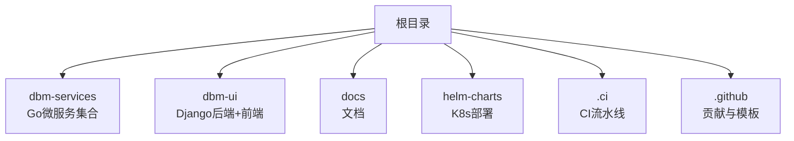
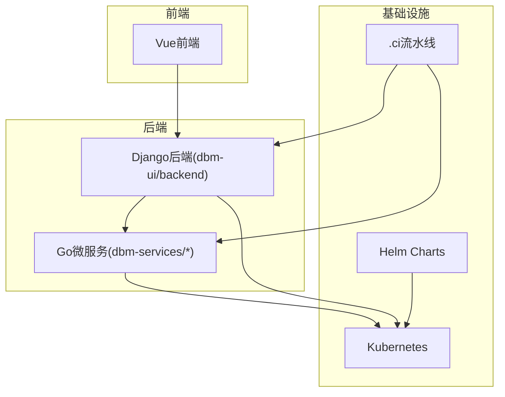
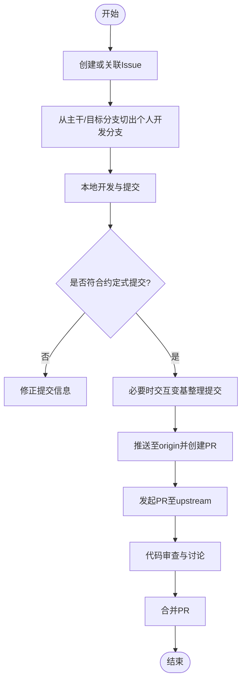
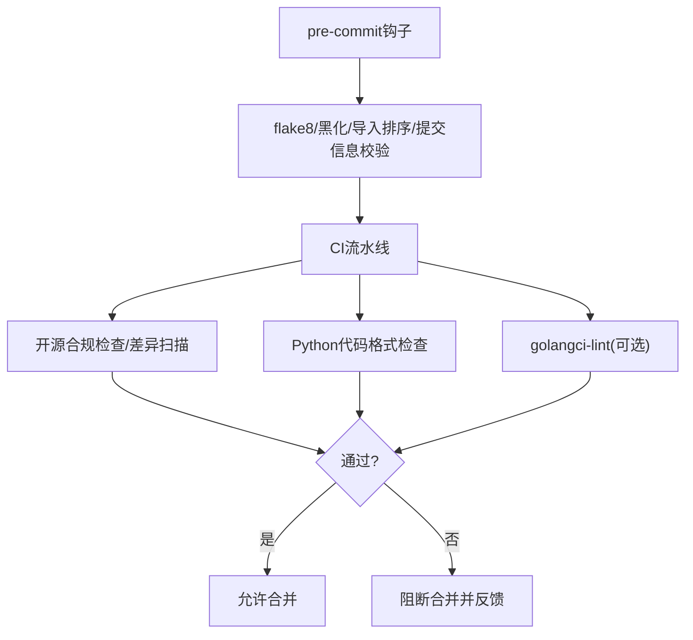
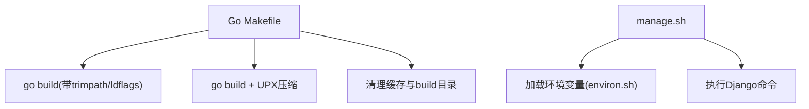
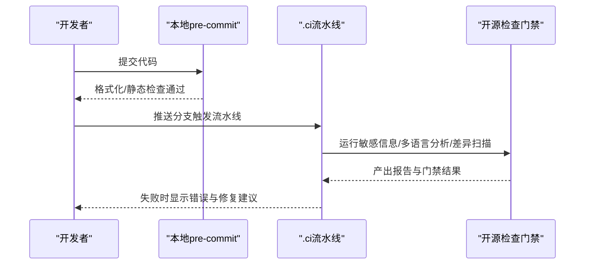
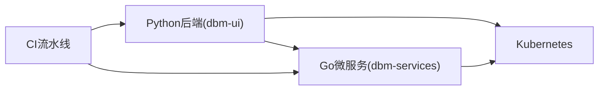

# 开发者指南

<cite>
**本文引用的文件**
- [readme.md](file://readme.md)
- [.github/CONTRIBUTING.md](file://.github/CONTRIBUTING.md)
- [.code.yml](file://.code.yml)
- [.pre-commit-config.yaml](file://.pre-commit-config.yaml)
- [dbm-ui/backend/.flake8](file://dbm-ui/backend/.flake8)
- [dbm-ui/.pylintrc](file://dbm-ui/.pylintrc)
- [.ci/open_source_check.yml](file://.ci/open_source_check.yml)
- [.ci/python_code_format.yml](file://.ci/python_code_format.yml)
- [dbm-services/common/db-resource/.golangci.yml](file://dbm-services/common/db-resource/.golangci.yml)
- [dbm-services/bigdata/db-tools/dbactuator/Makefile](file://dbm-services/bigdata/db-tools/dbactuator/Makefile)
- [dbm-services/mysql/db-tools/dbactuator/Makefile](file://dbm-services/mysql/db-tools/dbactuator/Makefile)
- [dbm-ui/bin/manage.sh](file://dbm-ui/bin/manage.sh)
</cite>

## 目录
1. [简介](#简介)
2. [项目结构](#项目结构)
3. [核心组件](#核心组件)
4. [架构总览](#架构总览)
5. [详细组件分析](#详细组件分析)
6. [依赖关系分析](#依赖关系分析)
7. [性能与质量考量](#性能与质量考量)
8. [故障排查指南](#故障排查指南)
9. [结论](#结论)
10. [附录](#附录)

## 简介
本指南面向DBM项目的开发者，提供从环境搭建、代码规范、贡献流程、Git工作流、分支管理、Pull Request规范，到代码质量工具配置、静态分析、自动化检查、测试与文档更新、团队协作与项目管理的完整说明。DBM是一个支持多数据库组件全生命周期管理的平台，后端包含Go微服务与Python Django后端，前端为Vue生态，CI/CD采用DevOps流水线。

## 项目结构
DBM采用多模块工程组织，主要分为：
- dbm-services：各数据库工具与服务的Go微服务集合（如MySQL、Redis、MongoDB、Kafka、HDFS、Oracle、SQLServer等子目录）
- dbm-ui：Django后端与前端工程，包含后端Python代码、前端资源、脚本与配置
- docs：API与资源文档
- helm-charts：Kubernetes部署Chart
- .ci：DevOps流水线模板与任务定义
- .github：Issue模板、贡献指南与配置

章节来源
- [readme.md:1-54](file://readme.md#L1-L54)

## 核心组件
- Go微服务：dbm-services下各子模块（如bigdata、common、mysql、mongodb、oracle、redis、riak、sqlserver等），包含独立的go.mod/go.sum、Makefile、.golangci.yml等
- Python后端：dbm-ui/backend，包含Django应用、组件、配置、脚本等
- 前端：dbm-ui前端资源与构建脚本
- CI/CD：.ci下的流水线模板与任务，配合GitHub Actions与DevOps平台
- 质量工具：pre-commit钩子、flake8、black、pylint、golangci-lint等

章节来源
- [readme.md:16-22](file://readme.md#L16-L22)
- [dbm-services/common/db-resource/.golangci.yml:1-103](file://dbm-services/common/db-resource/.golangci.yml#L1-L103)
- [dbm-ui/backend/.flake8:1-30](file://dbm-ui/backend/.flake8#L1-L30)
- [dbm-ui/.pylintrc:1-46](file://dbm-ui/.pylintrc#L1-L46)

## 架构总览
DBM整体采用“多微服务 + 统一前端 + CI/CD”的架构。后端服务通过API网关或直连方式对外提供能力；前端通过REST接口与后端交互；CI/CD负责代码质量门禁、构建与发布。

## 详细组件分析

### Git与分支管理
- 基于Issue驱动的开发流程，所有开发必须围绕Issue展开
- 使用 gtm 工具创建Issue并关联分支与PR
- 分支命名与合并建议遵循约定式提交与单一提交原则
- 提交信息需符合约定式提交规范，便于自动化与审计

章节来源
- [.github/CONTRIBUTING.md:1-67](file://.github/CONTRIBUTING.md#L1-L67)

### 代码规范与质量工具
- Python后端
  - 使用flake8进行静态检查，忽略部分冲突规则并排除迁移文件
  - 使用black进行代码格式化，结合isort导入排序
  - 使用pylint进行额外规则校验
- Go微服务
  - 使用golangci-lint进行静态分析，包含复杂度、未使用变量、导入顺序、vet等规则
  - 支持funlen、gocyclo、revive等规则集
- 通用
  - 使用pre-commit在本地拦截不符合规范的提交
  - CI中包含开源合规检查与Python代码格式检查任务

章节来源
- [.pre-commit-config.yaml:1-26](file://.pre-commit-config.yaml#L1-L26)
- [dbm-ui/backend/.flake8:1-30](file://dbm-ui/backend/.flake8#L1-L30)
- [dbm-ui/.pylintrc:1-46](file://dbm-ui/.pylintrc#L1-L46)
- [dbm-services/common/db-resource/.golangci.yml:1-103](file://dbm-services/common/db-resource/.golangci.yml#L1-L103)
- [.ci/open_source_check.yml:1-95](file://.ci/open_source_check.yml#L1-L95)
- [.ci/python_code_format.yml:1-38](file://.ci/python_code_format.yml#L1-L38)

### 构建与打包
- Go微服务
  - 大多数子模块提供Makefile，支持build、mini（含UPX压缩）、clean、gotool等目标
  - 编译时使用trimpath与ldflags注入版本与哈希
- Python后端
  - 提供manage.sh统一入口运行Django命令
  - 通过environ.sh加载环境变量

章节来源
- [dbm-services/bigdata/db-tools/dbactuator/Makefile:1-24](file://dbm-services/bigdata/db-tools/dbactuator/Makefile#L1-L24)
- [dbm-services/mysql/db-tools/dbactuator/Makefile:1-28](file://dbm-services/mysql/db-tools/dbactuator/Makefile#L1-L28)
- [dbm-ui/bin/manage.sh:1-8](file://dbm-ui/bin/manage.sh#L1-L8)

### 代码质量与静态分析配置
- Python
  - flake8：忽略W503/E203冲突、排除migrations与常见目录、针对特定文件放宽规则
  - black：统一格式化，与flake8共存
  - pylint：启用若干关键规则，限制最大行数与模块行数
- Go
  - golangci-lint：启用funlen、goconst、gocyclo、revive、gosimple、govet、errcheck等
  - 自定义include/exclude规则，兼顾团队实践与工具增强
- 通用
  - .code.yml：定义注释与函数规范、超大/超长函数检查等

章节来源
- [dbm-ui/backend/.flake8:1-30](file://dbm-ui/backend/.flake8#L1-L30)
- [dbm-ui/.pylintrc:1-46](file://dbm-ui/.pylintrc#L1-L46)
- [dbm-services/common/db-resource/.golangci.yml:1-103](file://dbm-services/common/db-resource/.golangci.yml#L1-L103)
- [.code.yml:1-74](file://.code.yml#L1-L74)

### 自动化检查与CI流程
- 开源检查流水线：镜像环境、敏感信息检查、多语言静态分析、差异扫描、MR评论与门禁
- Python代码格式检查：安装flake8与black，对dbm-ui/backend执行检查
- 建议在本地安装pre-commit，避免CI失败

章节来源
- [.ci/open_source_check.yml:1-95](file://.ci/open_source_check.yml#L1-L95)
- [.ci/python_code_format.yml:1-38](file://.ci/python_code_format.yml#L1-L38)

### 新功能开发流程
- 基于Issue拆解需求，明确范围与验收
- 本地开发：遵循代码规范与质量工具
- 提交与PR：保持单一提交、描述清晰、关联Issue
- CI与审查：确保流水线通过、至少一名Reviewer批准
- 合并与验证：合并后关注监控与回归

章节来源
- [.github/CONTRIBUTING.md:31-67](file://.github/CONTRIBUTING.md#L31-L67)

### 测试编写要求
- Python后端：遵循Django测试规范，尽量覆盖核心逻辑与边界条件
- Go微服务：单元测试与集成测试并重，注意mock与外部依赖隔离
- 建议在本地先运行测试，再提交PR

（本节为通用实践说明，不直接分析具体文件）

### 文档更新规范
- API文档：随接口变更同步更新
- 用户文档：README与Wiki保持一致
- 变更日志：版本发布时更新release文档

章节来源
- [readme.md:26-27](file://readme.md#L26-L27)

### 团队协作与项目管理
- Issue驱动：所有改动均应有对应Issue
- PR评审：遵循约定式提交与单一提交原则
- 工具链：gtm、pre-commit、CI流水线

章节来源
- [.github/CONTRIBUTING.md:1-67](file://.github/CONTRIBUTING.md#L1-L67)

## 依赖关系分析
- 语言与工具
  - Python：Django、flake8、black、pylint、pre-commit
  - Go：golangci-lint、go工具链
  - CI：DevOps流水线、GitHub Actions
- 模块间耦合
  - dbm-ui后端通过API与各dbm-services微服务交互
  - Helm Charts支撑Kubernetes部署

## 性能与质量考量
- Go微服务
  - 控制函数长度与圈复杂度，避免深层嵌套
  - 使用golangci-lint的errcheck、bodyclose等规则减少资源泄漏
- Python后端
  - 控制模块行数与行长度，避免过度复杂
  - 使用flake8与black统一风格，提升可读性
- CI门禁
  - 通过差异扫描与多工具组合，降低缺陷流入生产风险

章节来源
- [dbm-services/common/db-resource/.golangci.yml:1-103](file://dbm-services/common/db-resource/.golangci.yml#L1-L103)
- [dbm-ui/backend/.flake8:1-30](file://dbm-ui/backend/.flake8#L1-L30)
- [dbm-ui/.pylintrc:1-46](file://dbm-ui/.pylintrc#L1-L46)
- [.ci/open_source_check.yml:1-95](file://.ci/open_source_check.yml#L1-L95)

## 故障排查指南
- 本地pre-commit失败
  - 检查是否安装isort、black、flake8、commitlint
  - 确认配置文件路径正确（flake8、pyproject.toml）
- CI流水线失败
  - 查看开源检查报告与差异扫描结果
  - 修复敏感信息、格式问题与静态分析告警
- Go构建失败
  - 检查Makefile目标与ldflags参数
  - 确认trimpath与CGO_ENABLED设置
- Python命令执行
  - 使用manage.sh统一入口，确保environ.sh已加载

章节来源
- [.pre-commit-config.yaml:1-26](file://.pre-commit-config.yaml#L1-L26)
- [.ci/open_source_check.yml:1-95](file://.ci/open_source_check.yml#L1-L95)
- [dbm-services/bigdata/db-tools/dbactuator/Makefile:1-24](file://dbm-services/bigdata/db-tools/dbactuator/Makefile#L1-L24)
- [dbm-services/mysql/db-tools/dbactuator/Makefile:1-28](file://dbm-services/mysql/db-tools/dbactuator/Makefile#L1-L28)
- [dbm-ui/bin/manage.sh:1-8](file://dbm-ui/bin/manage.sh#L1-L8)

## 结论
本指南总结了DBM项目的开发规范、工具链与流程，建议开发者在本地严格遵守pre-commit与静态分析规则，在PR阶段充分沟通与评审，并通过CI门禁保障质量。对于多语言混合工程，统一的工具链与明确的职责划分是高质量交付的关键。

## 附录
- 快速检查清单
  - 本地安装并启用pre-commit
  - 遵循约定式提交与单一提交
  - 通过flake8/black/pylint/golangci-lint检查
  - CI流水线通过后再提交PR
- 参考文件
  - 贡献指南与Git工作流：[CONTRIBUTING.md:1-67](file://.github/CONTRIBUTING.md#L1-L67)
  - Python质量配置：[flake8:1-30](file://dbm-ui/backend/.flake8#L1-L30)、[pylintrc:1-46](file://dbm-ui/.pylintrc#L1-L46)
  - Go质量配置：[golangci.yml:1-103](file://dbm-services/common/db-resource/.golangci.yml#L1-L103)
  - 通用质量配置：[code.yml:1-74](file://.code.yml#L1-L74)
  - CI流水线：[open_source_check.yml:1-95](file://.ci/open_source_check.yml#L1-L95)、[python_code_format.yml:1-38](file://.ci/python_code_format.yml#L1-L38)
  - 构建脚本：[bigdata dbactuator Makefile:1-24](file://dbm-services/bigdata/db-tools/dbactuator/Makefile#L1-L24)、[mysql dbactuator Makefile:1-28](file://dbm-services/mysql/db-tools/dbactuator/Makefile#L1-L28)
  - Python命令入口：[manage.sh:1-8](file://dbm-ui/bin/manage.sh#L1-L8)