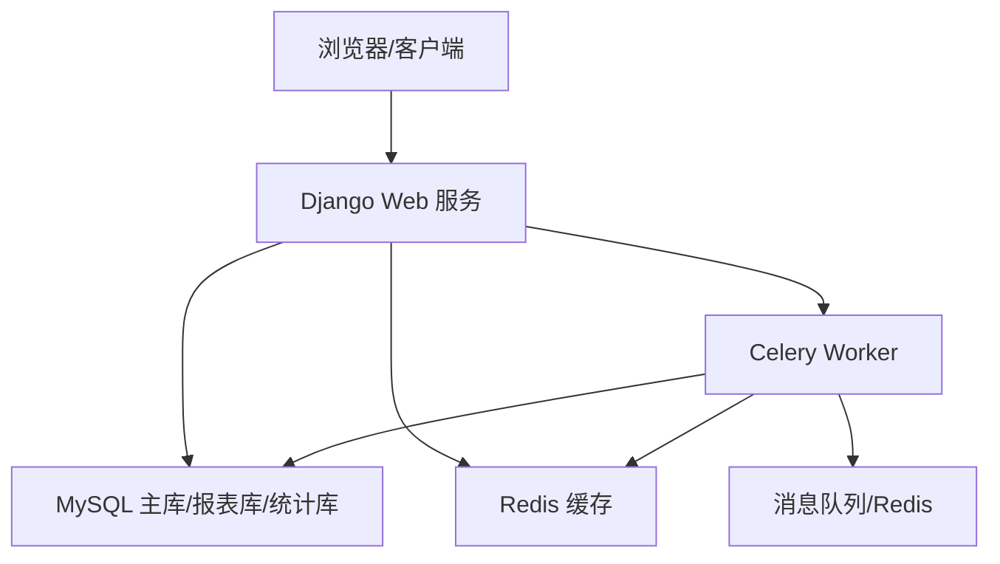
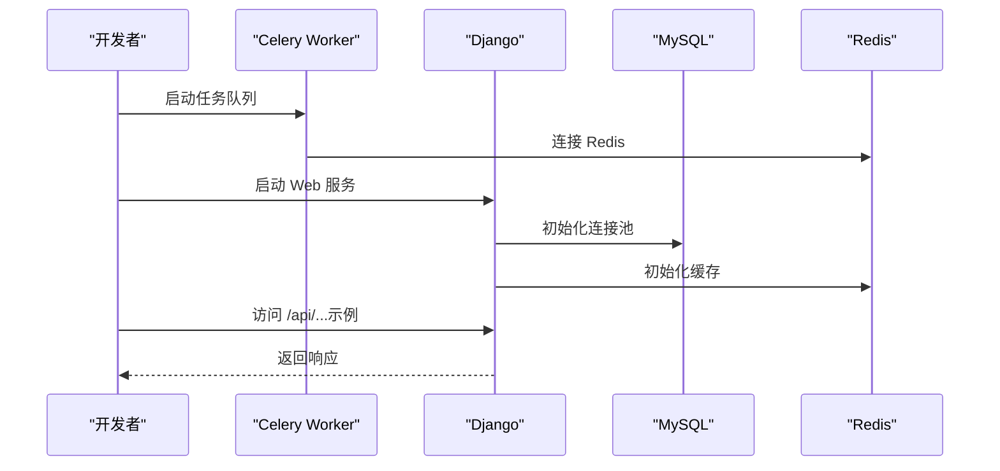
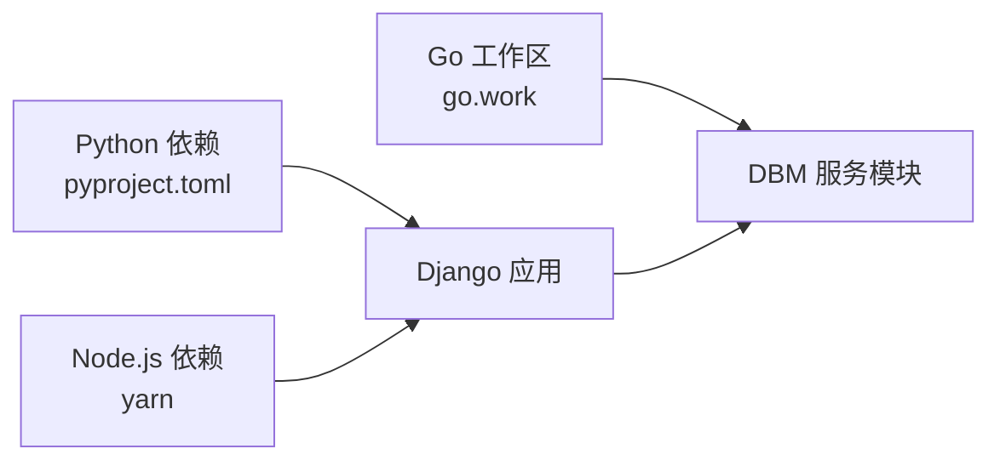

# 快速开始

<cite>
**本文引用的文件**
- [readme.md](file://readme.md)
- [DBM_README.md](file://dbm-ui\DBM_README.md)
- [pyproject.toml](file://dbm-ui\pyproject.toml)
- [manage.py](file://dbm-ui\manage.py)
- [config/default.py](file://dbm-ui\config\default.py)
- [config/dev.py](file://dbm-ui\config\dev.py)
- [config/prod.py](file://dbm-ui\config\prod.py)
- [bin/build_frontend.sh](file://dbm-ui\bin\build_frontend.sh)
- [bin/celery.sh](file://dbm-ui\bin\celery.sh)
- [bin/environ.sh](file://dbm-ui\bin\environ.sh)
- [bin/migrate.sh](file://dbm-ui\bin\migrate.sh)
- [bin/makemigrations.sh](file://dbm-ui\bin\makemigrations.sh)
- [bin/manage.sh](file://dbm-ui\bin\manage.sh)
- [dbm-services/go.work](file://dbm-services\go.work)
</cite>

## 目录
1. [简介](#简介)
2. [项目结构](#项目结构)
3. [核心组件](#核心组件)
4. [架构总览](#架构总览)
5. [详细组件分析](#详细组件分析)
6. [依赖分析](#依赖分析)
7. [性能考虑](#性能考虑)
8. [故障排查指南](#故障排查指南)
9. [结论](#结论)
10. [附录](#附录)

## 简介
本快速开始指南面向希望在本地快速搭建并运行 DBM（数据库管理平台）的开发者与运维人员。内容涵盖环境要求、依赖安装、数据库与缓存准备、服务启动与基本使用，以及常见初始化问题与解决方案。DBM 支持 MySQL、Redis、MongoDB、Kafka、HDFS、InfluxDB、Pulsar、Oracle、SQLServer 等多数据库组件的全生命周期管理，提供统一的后台服务与前端界面。

## 项目结构
DBM 采用前后端分离架构：
- 后端（Python/Django）位于 dbm-ui 目录，负责 API、任务调度、权限与配置管理等。
- 前端资源构建脚本位于 dbm-ui/bin 下，通过构建脚本产出静态资源供 Django 提供。
- 多数据库工具链与服务位于 dbm-services 目录，采用 Go 多模块工作区组织，便于独立扩展与维护。

```mermaid
graph TB
subgraph "前端"
FE["静态资源<br/>构建与收集"]
end
subgraph "后端"
DJ["Django 应用<br/>config.dev/prod/default"]
WSGI["WSGI 入口<br/>manage.py"]
CEL["Celery 任务队列<br/>bin/celery.sh"]
end
subgraph "基础设施"
MYSQL["MySQL 数据库<br/>默认库: bk_dbm / bk_dbm_report"]
REDIS["Redis 缓存<br/>默认端口: 6379"]
end
FE --> DJ
WSGI --> DJ
DJ <- --> MYSQL
DJ <- --> REDIS
CEL --> DJ
```

图表来源
- [manage.py:1-28](file://dbm-ui\manage.py#L1-L28)
- [config/default.py:227-286](file://dbm-ui\config\default.py#L227-L286)
- [config/dev.py:27-39](file://dbm-ui\config\dev.py#L27-L39)
- [config/prod.py:1-20](file://dbm-ui\config\prod.py#L1-L20)
- [bin/build_frontend.sh:1-16](file://dbm-ui\bin\build_frontend.sh#L1-L16)
- [bin/celery.sh:1-8](file://dbm-ui\bin\celery.sh#L1-L8)

章节来源
- [readme.md:1-54](file://readme.md#L1-L54)
- [DBM_README.md:72-230](file://dbm-ui\DBM_README.md#L72-L230)

## 核心组件
- Django 应用与配置
  - 默认配置、开发与生产配置分别位于 config/default.py、config/dev.py、config/prod.py。
  - manage.py 作为 Django 命令入口，设置默认配置模块为 config.prod。
- 数据库与缓存
  - 默认使用 MySQL 连接池（dj_db_conn_pool）与 Redis 缓存（django_redis），支持多数据库路由（report_db、stats_db）。
- 任务队列
  - Celery 通过 bin/celery.sh 启动，消费 er_execute、er_schedule 等队列。
- 前端构建
  - bin/build_frontend.sh 设置 npm registry、清理缓存、安装依赖并构建，随后收集静态资源。

章节来源
- [manage.py:10-23](file://dbm-ui\manage.py#L10-L23)
- [config/default.py:227-286](file://dbm-ui\config\default.py#L227-L286)
- [config/dev.py:27-39](file://dbm-ui\config\dev.py#L27-L39)
- [config/prod.py:14-16](file://dbm-ui\config\prod.py#L14-L16)
- [bin/celery.sh:7-7](file://dbm-ui\bin\celery.sh#L7-L7)
- [bin/build_frontend.sh:5-15](file://dbm-ui\bin\build_frontend.sh#L5-L15)

## 架构总览
DBM 的本地开发架构由 Django Web 服务、Celery 任务服务、MySQL 与 Redis 组成。Django 通过连接池访问主库与报表/统计库，Celery 从队列拉取任务执行流程与周期任务；前端静态资源由 Django 在开发模式下托管。



图表来源
- [config/default.py:227-286](file://dbm-ui\config\default.py#L227-L286)
- [config/dev.py:27-39](file://dbm-ui\config\dev.py#L27-L39)
- [bin/celery.sh:7-7](file://dbm-ui\bin\celery.sh#L7-L7)

## 详细组件分析

### 环境与依赖准备
- Python 环境
  - Python 版本要求：>=3.11.10 且 <3.12。
  - 使用 Poetry 管理依赖，安装命令：poetry install。
- 前端 Node.js 环境
  - 建议使用 Node.js v22.x，前端构建脚本会设置 npm registry 并清理缓存后安装依赖。
- 数据库与缓存
  - MySQL：版本建议 8.0，默认端口 3306；需创建数据库 bk_dbm 与 bk_dbm_report。
  - Redis：版本建议 7.2.x，默认端口 6379。

章节来源
- [DBM_README.md:90-111](file://dbm-ui\DBM_README.md#L90-L111)
- [DBM_README.md:82-89](file://dbm-ui\DBM_README.md#L82-L89)
- [pyproject.toml:9-9](file://dbm-ui\pyproject.toml#L9-L9)
- [bin/build_frontend.sh:5-8](file://dbm-ui\bin\build_frontend.sh#L5-L8)

### 数据库与缓存初始化
- 创建数据库
  - 在 MySQL 中创建数据库：bk_dbm 与 bk_dbm_report。
- 初始化迁移
  - 执行数据库迁移：python manage.py migrate；报表库迁移：python manage.py migrate db_report --database=report_db。
- 环境变量
  - 在环境变量文件中配置 DB_*、REPORT_DB_*、REDIS_* 等参数，确保 Django 读取正确。

章节来源
- [DBM_README.md:159-171](file://dbm-ui\DBM_README.md#L159-L171)
- [DBM_README.md:173-189](file://dbm-ui\DBM_README.md#L173-L189)
- [config/dev.py:27-39](file://dbm-ui\config\dev.py#L27-L39)
- [config/default.py:231-286](file://dbm-ui\config\default.py#L231-L286)

### 服务启动流程
- 启动 Celery
  - 执行 bin/celery.sh，启动 worker 并绑定 er_execute、er_schedule 队列。
- 启动 Django
  - 执行 bin/manage.sh runserver appdev.{BK_PAAS_HOST}:8000，使用开发域名访问。
- 前端构建与静态资源
  - 执行 bin/build_frontend.sh，构建前端并收集静态资源。



图表来源
- [bin/celery.sh:7-7](file://dbm-ui\bin\celery.sh#L7-L7)
- [bin/manage.sh:7-7](file://dbm-ui\bin\manage.sh#L7-L7)
- [config/default.py:227-286](file://dbm-ui\config\default.py#L227-L286)
- [config/dev.py:27-39](file://dbm-ui\config\dev.py#L27-L39)

章节来源
- [DBM_README.md:208-228](file://dbm-ui\DBM_README.md#L208-L228)
- [bin/celery.sh:7-7](file://dbm-ui\bin\celery.sh#L7-L7)
- [bin/manage.sh:7-7](file://dbm-ui\bin\manage.sh#L7-L7)
- [bin/build_frontend.sh:8-15](file://dbm-ui\bin\build_frontend.sh#L8-L15)

### 基本使用示例
- 访问地址
  - 使用浏览器访问 http://appdev.{BK_PAAS_HOST}:8000/。
- 常见操作
  - 登录后通过菜单进入各数据库组件的管理页面，提交任务并查看执行状态。
- API 调用
  - 可通过 /api/... 路径访问后端接口（具体接口以实际文档为准）。

章节来源
- [DBM_README.md:225-228](file://dbm-ui\DBM_README.md#L225-L228)

## 依赖分析
- Python 与 Django 生态
  - Django 4.2.27、Django REST Framework、Celery 5.4.0、django-celery-beat、django-redis、PyMySQL、requests 等。
- 前端构建
  - Node.js v22.x、yarn、构建产物拷贝至 Django static 目录。
- Go 工具链（后端服务）
  - dbm-services 采用 Go 1.24.2 工作区，包含多个数据库工具模块（如 MySQL、Redis、MongoDB、Oracle、SQLServer 等）。



图表来源
- [pyproject.toml:8-94](file://dbm-ui\pyproject.toml#L8-L94)
- [bin/build_frontend.sh:7-10](file://dbm-ui\bin\build_frontend.sh#L7-L10)
- [dbm-services/go.work:1-47](file://dbm-services\go.work#L1-L47)

章节来源
- [pyproject.toml:8-94](file://dbm-ui\pyproject.toml#L8-L94)
- [dbm-services/go.work:1-47](file://dbm-services\go.work#L1-L47)

## 性能考虑
- 数据库连接池
  - 默认使用 dj_db_conn_pool，可通过环境变量调整池大小与回收策略。
- 日志与追踪
  - 生产环境使用集中日志目录 BK_LOG_DIR；可按需开启 OpenTelemetry 追踪。
- 前端构建优化
  - 构建脚本设置 NODE_OPTIONS 并清理缓存，避免内存不足导致构建失败。

章节来源
- [config/default.py:244-284](file://dbm-ui\config\default.py#L244-L284)
- [config/prod.py:16-16](file://dbm-ui\config\prod.py#L16-L16)
- [bin/build_frontend.sh:6-6](file://dbm-ui\bin\build_frontend.sh#L6-L6)

## 故障排查指南
- Python 版本过高导致依赖安装失败
  - 现象：poetry 安装依赖时报错。
  - 解决：使用 pyenv 切换到 Python >=3.11.10 且 <3.12 的版本。
- 前端构建失败（内存不足）
  - 现象：yarn 安装或构建时报内存错误。
  - 解决：构建脚本已设置 NODE_OPTIONS，清理 node_modules/yarn.lock 后重试。
- Django 无法导入或未激活虚拟环境
  - 现象：提示无法导入 Django 或未激活虚拟环境。
  - 解决：确认已执行 poetry install 并在虚拟环境中运行 manage.py。
- 数据库连接失败
  - 现象：Django 启动时报数据库连接错误。
  - 解决：检查 DB_* 环境变量与 MySQL 服务状态；确认数据库已创建。
- Redis 连接失败
  - 现象：Celery 或 Django 报 Redis 连接错误。
  - 解决：确认 Redis 服务已启动且端口为 6379；检查 REDIS_URL 环境变量。
- Hosts 配置导致访问异常
  - 现象：浏览器无法访问 appdev.{BK_PAAS_HOST}。
  - 解决：在本机 hosts 中添加 127.0.0.1 dev.{BK_PAAS_HOST} 或 appdev.{BK_PAAS_HOST}。

章节来源
- [DBM_README.md:92-111](file://dbm-ui\DBM_README.md#L92-L111)
- [DBM_README.md:203-207](file://dbm-ui\DBM_README.md#L203-L207)
- [config/dev.py:27-39](file://dbm-ui\config\dev.py#L27-L39)
- [config/default.py:295-309](file://dbm-ui\config\default.py#L295-L309)
- [bin/build_frontend.sh:6-10](file://dbm-ui\bin\build_frontend.sh#L6-L10)

## 结论
通过本指南，您可以在本地完成 DBM 的环境准备、依赖安装、数据库与缓存初始化、服务启动与前端构建，并成功访问 Web 界面。建议在开发过程中结合日志与调试工具定位问题，逐步熟悉各组件的职责与交互方式。

## 附录
- 常用脚本
  - 前端构建：bin/build_frontend.sh
  - Celery 启动：bin/celery.sh
  - Django 管理：bin/manage.sh
  - 迁移数据库：bin/migrate.sh、bin/makemigrations.sh
- 环境变量模板
  - 在环境变量文件中添加 BK_LOG_DIR、BK_COMPONENT_API_URL、APP_TOKEN、DBA_APP_BK_BIZ_ID、DBCONFIG_APIGW_DOMAIN、BKREPO_*、BK_IAM_*、BKPAAS_*、BKLOG_*、DJANGO_SETTINGS_MODULE、BK_IAM_V3_*、BK_LOGIN_URL 等。

章节来源
- [DBM_README.md:114-137](file://dbm-ui\DBM_README.md#L114-L137)
- [DBM_README.md:191-195](file://dbm-ui\DBM_README.md#L191-L195)
- [bin/environ.sh:3-11](file://dbm-ui\bin\environ.sh#L3-L11)
- [bin/build_frontend.sh:1-16](file://dbm-ui\bin\build_frontend.sh#L1-L16)
- [bin/celery.sh:1-8](file://dbm-ui\bin\celery.sh#L1-L8)
- [bin/manage.sh:1-8](file://dbm-ui\bin\manage.sh#L1-L8)
- [bin/migrate.sh:1-5](file://dbm-ui\bin\migrate.sh#L1-L5)
- [bin/makemigrations.sh:1-4](file://dbm-ui\bin\makemigrations.sh#L1-L4)