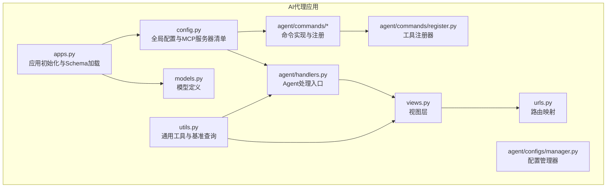
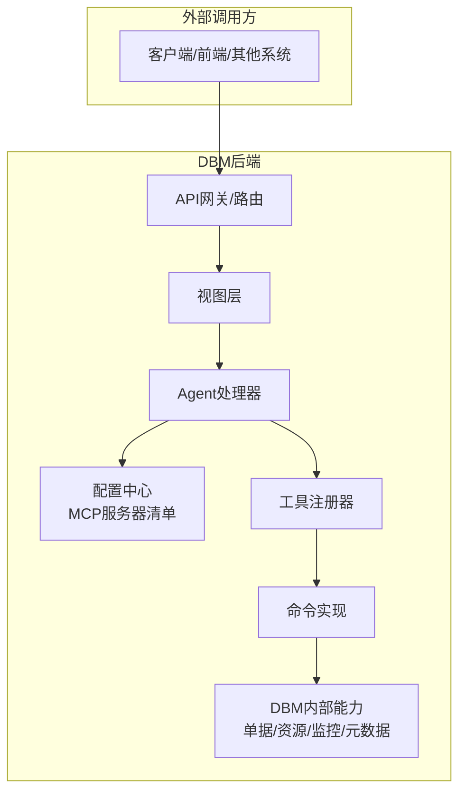
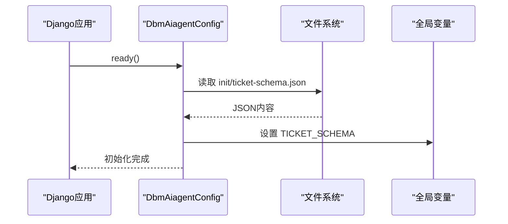
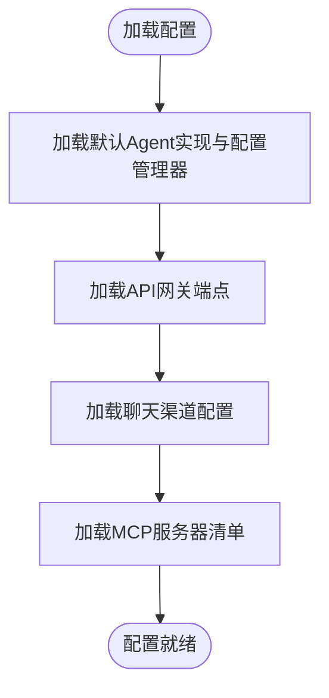
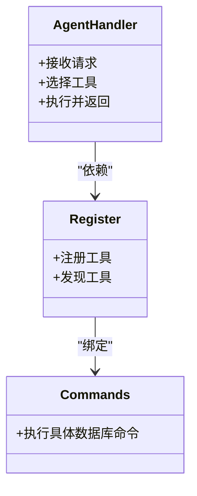
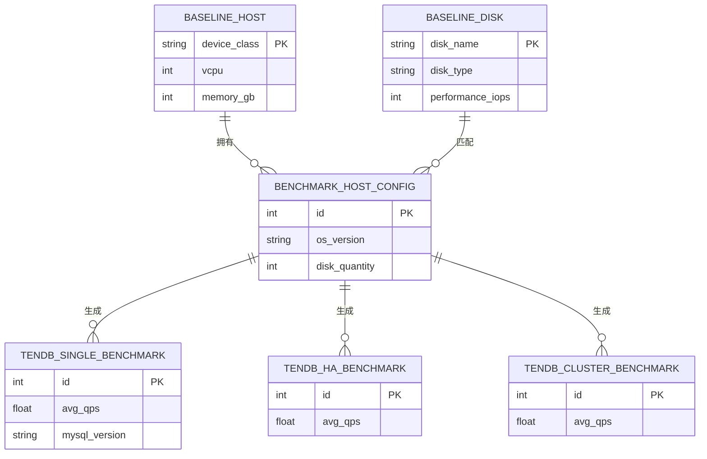
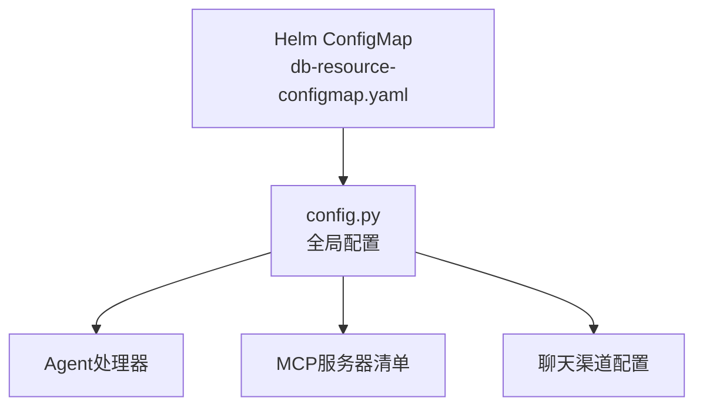

# AI智能代理集成

<cite>
**本文引用的文件**
- [apps.py](file://dbm-ui/backend/dbm_aiagent/apps.py)
- [config.py](file://dbm-ui/backend/dbm_aiagent/config.py)
- [utils.py](file://dbm-ui/backend/dbm_aiagent/utils.py)
- [handlers.py](file://dbm-ui/backend/dbm_aiagent/agent/handlers.py)
- [commands.py](file://dbm-ui/backend/dbm_aiagent/agent/commands/commands.py)
- [register.py](file://dbm-ui/backend/dbm_aiagent/agent/commands/register.py)
- [manager.py](file://dbm-ui/backend/dbm_aiagent/agent/configs/manager.py)
- [models.py](file://dbm-ui/backend/dbm_aiagent/models.py)
- [urls.py](file://dbm-ui/backend/dbm_aiagent/urls.py)
- [views.py](file://dbm-ui/backend/dbm_aiagent/views.py)
- [db-resource-configmap.yaml](file://helm-charts/bk-dbm/templates/configmaps/db-resource-configmap.yaml)
- [readme.md](file://readme.md)
</cite>

## 目录
1. [简介](#简介)
2. [项目结构](#项目结构)
3. [核心组件](#核心组件)
4. [架构总览](#架构总览)
5. [详细组件分析](#详细组件分析)
6. [依赖分析](#依赖分析)
7. [性能考虑](#性能考虑)
8. [故障排查指南](#故障排查指南)
9. [结论](#结论)
10. [附录](#附录)

## 简介
本文件面向DBM（蓝鲸智云-数据库管理系统）中的AI智能代理集成能力，系统化阐述AI代理的架构设计、提示工程与工具集成方法，以及如何开发AI代理插件、自定义提示模板与工具调用。文档还覆盖配置管理、性能优化、安全控制、与数据库管理流程的集成方法、测试验证与部署策略，并提供监控、日志与故障排查建议。

## 项目结构
DBM AI智能代理位于后端模块dbm-ui/backend/dbm_aiagent中，采用“应用注册+配置中心+命令与工具注册+Agent处理器”的分层组织方式；同时通过Django应用配置加载初始化数据（如单据schema），并通过API路由暴露对外接口。

**图表来源**
- [apps.py:25-33](file://dbm-ui/backend/dbm_aiagent/apps.py#L25-L33)
- [config.py:16-453](file://dbm-ui/backend/dbm_aiagent/config.py#L16-L453)
- [utils.py:12-14](file://dbm-ui/backend/dbm_aiagent/utils.py#L12-L14)
- [handlers.py](file://dbm-ui/backend/dbm_aiagent/agent/handlers.py)
- [commands.py](file://dbm-ui/backend/dbm_aiagent/agent/commands/commands.py)
- [register.py](file://dbm-ui/backend/dbm_aiagent/agent/commands/register.py)
- [manager.py](file://dbm-ui/backend/dbm_aiagent/agent/configs/manager.py)
- [models.py](file://dbm-ui/backend/dbm_aiagent/models.py)
- [urls.py](file://dbm-ui/backend/dbm_aiagent/urls.py)
- [views.py](file://dbm-ui/backend/dbm_aiagent/views.py)

**章节来源**
- [apps.py:21-33](file://dbm-ui/backend/dbm_aiagent/apps.py#L21-L33)
- [config.py:16-453](file://dbm-ui/backend/dbm_aiagent/config.py#L16-L453)
- [utils.py:12-14](file://dbm-ui/backend/dbm_aiagent/utils.py#L12-L14)

## 核心组件
- 应用初始化与Schema加载：在ready钩子中加载init目录下的ticket-schema.json，供后续流程校验与渲染使用。
- 全局配置与MCP服务器清单：集中定义Agent默认实现、配置管理器、API网关端点、聊天渠道开关、MCP服务器集合（含标签、授权app_code、工具自动发现占位等）。
- 工具与命令体系：commands目录下按数据库类型拆分命令实现，register负责工具注册与发现；manager提供Agent配置管理能力。
- 处理器与视图：handlers作为Agent处理入口，views结合URL路由对外提供API。
- 基准查询工具：utils提供基于基线主机、基线磁盘、性能基准配置的查询封装，支撑性能分析与容量规划。

**章节来源**
- [apps.py:25-33](file://dbm-ui/backend/dbm_aiagent/apps.py#L25-L33)
- [config.py:16-453](file://dbm-ui/backend/dbm_aiagent/config.py#L16-L453)
- [handlers.py](file://dbm-ui/backend/dbm_aiagent/agent/handlers.py)
- [commands.py](file://dbm-ui/backend/dbm_aiagent/agent/commands/commands.py)
- [register.py](file://dbm-ui/backend/dbm_aiagent/agent/commands/register.py)
- [manager.py](file://dbm-ui/backend/dbm_aiagent/agent/configs/manager.py)
- [utils.py:55-397](file://dbm-ui/backend/dbm_aiagent/utils.py#L55-L397)

## 架构总览
AI智能代理以“配置驱动 + 工具注册 + Agent处理”为核心，通过MCP服务器聚合多类数据库工具，统一由Agent进行提示工程与工具调用编排，最终与DBM单据、资源、监控、元数据等能力打通。

**图表来源**
- [config.py:30-438](file://dbm-ui/backend/dbm_aiagent/config.py#L30-L438)
- [handlers.py](file://dbm-ui/backend/dbm_aiagent/agent/handlers.py)
- [register.py](file://dbm-ui/backend/dbm_aiagent/agent/commands/register.py)
- [commands.py](file://dbm-ui/backend/dbm_aiagent/agent/commands/commands.py)

## 详细组件分析

### 应用初始化与配置加载
- ready钩子：启动时从init目录加载ticket-schema.json至全局变量，便于后续流程校验与渲染。
- 全局配置：定义Agent默认实现、配置管理器、API网关端点、聊天渠道开关、MCP服务器集合等。

**图表来源**
- [apps.py:25-33](file://dbm-ui/backend/dbm_aiagent/apps.py#L25-L33)

**章节来源**
- [apps.py:21-33](file://dbm-ui/backend/dbm_aiagent/apps.py#L21-L33)

### 配置管理与MCP服务器
- Agent默认实现与配置管理器：通过配置项指定Agent实现与配置管理器类。
- API网关端点：Agent调用外部服务的网关地址。
- 聊天渠道：支持企业微信等渠道的开关与人员配置。
- MCP服务器清单：按数据库类型划分多个MCP服务器，每台服务器包含名称、描述、标签、授权app_code、状态、是否公开、工具自动发现占位等字段。

**图表来源**
- [config.py:16-453](file://dbm-ui/backend/dbm_aiagent/config.py#L16-L453)

**章节来源**
- [config.py:16-453](file://dbm-ui/backend/dbm_aiagent/config.py#L16-L453)

### 工具注册与命令实现
- 命令实现：按数据库类型拆分命令（如MySQL、Redis、Kafka、MongoDB、Pulsar、HDFS、ES、Doris等），统一在commands目录下维护。
- 注册机制：register负责工具注册与发现，支持根据MCP服务器自动填充工具列表。
- Agent处理器：接收请求，解析提示与上下文，选择合适工具链路，执行并返回结果。

**图表来源**
- [commands.py](file://dbm-ui/backend/dbm_aiagent/agent/commands/commands.py)
- [register.py](file://dbm-ui/backend/dbm_aiagent/agent/commands/register.py)
- [handlers.py](file://dbm-ui/backend/dbm_aiagent/agent/handlers.py)

**章节来源**
- [commands.py](file://dbm-ui/backend/dbm_aiagent/agent/commands/commands.py)
- [register.py](file://dbm-ui/backend/dbm_aiagent/agent/commands/register.py)
- [handlers.py](file://dbm-ui/backend/dbm_aiagent/agent/handlers.py)

### 提示工程与模板
- 角色与提示：通过配置中心的角色提示文件（如role_prompts/readme.md）定义Agent角色、职责与提示模板，确保Agent在不同数据库场景下具备一致的上下文与输出风格。
- 模板扩展：可按数据库类型扩展提示模板，结合工具返回结果进行二次加工与呈现。

**章节来源**
- [config.py:16-453](file://dbm-ui/backend/dbm_aiagent/config.py#L16-L453)

### 数据模型与基准查询
- 模型：models.py定义Agent相关数据模型（如基线磁盘、基线主机、基准主机配置、TenDB系列基准等）。
- 基准查询工具：utils提供查询基线主机、基线磁盘、基准主机配置以及各TenDB系列（Single/HA/Cluster）的性能基准查询封装，支持按机型、磁盘类型、操作系统版本、并发线程等维度筛选。

**图表来源**
- [utils.py:17-24](file://dbm-ui/backend/dbm_aiagent/utils.py#L17-L24)
- [utils.py:55-397](file://dbm-ui/backend/dbm_aiagent/utils.py#L55-L397)

**章节来源**
- [utils.py:55-397](file://dbm-ui/backend/dbm_aiagent/utils.py#L55-L397)
- [models.py](file://dbm-ui/backend/dbm_aiagent/models.py)

### API与路由
- 路由：urls.py定义Agent相关API路由。
- 视图：views.py实现具体接口逻辑，结合Agent处理器与工具链路完成请求处理。

**章节来源**
- [urls.py](file://dbm-ui/backend/dbm_aiagent/urls.py)
- [views.py](file://dbm-ui/backend/dbm_aiagent/views.py)

## 依赖分析
- 组件内聚与耦合：Agent处理器与工具注册器松耦合，通过统一的命令接口交互；配置中心集中管理Agent与工具行为。
- 外部依赖：API网关端点、MCP服务器、聊天渠道配置等通过环境变量与配置文件注入。
- Helm部署：通过ConfigMap注入LLM与Agent相关配置，包括是否启用LLM、Provider、Agent迭代次数、超时、模型、最大tokens、温度等。

**图表来源**
- [config.py:16-453](file://dbm-ui/backend/dbm_aiagent/config.py#L16-L453)
- [db-resource-configmap.yaml:47-59](file://helm-charts/bk-dbm/templates/configmaps/db-resource-configmap.yaml#L47-L59)

**章节来源**
- [config.py:16-453](file://dbm-ui/backend/dbm_aiagent/config.py#L16-L453)
- [db-resource-configmap.yaml:33-59](file://helm-charts/bk-dbm/templates/configmaps/db-resource-configmap.yaml#L33-L59)

## 性能考虑
- Agent迭代次数与超时：通过配置限制Agent最大迭代次数与超时时间，避免长尾任务占用资源。
- LLM参数：合理设置模型、最大tokens与温度，平衡准确性与响应速度。
- 工具调用批量化：对多数据库类型的工具调用进行批量化与缓存，减少重复查询。
- 基准查询优化：利用过滤条件与排序字段（如按avg_qps降序）快速定位最优配置。

**章节来源**
- [config.py:47-52](file://dbm-ui/backend/dbm_aiagent/config.py#L47-L52)
- [utils.py:230-233](file://dbm-ui/backend/dbm_aiagent/utils.py#L230-L233)

## 故障排查指南
- 配置加载失败：确认init目录下ticket-schema.json存在且格式正确；检查应用ready钩子是否执行。
- MCP服务器不可用：核对MCP服务器状态、授权app_code与标签是否正确；确认API网关端点可达。
- 工具调用异常：检查工具注册器是否正确绑定命令实现；查看Agent处理器日志定位工具执行问题。
- 基准查询无结果：确认基线主机/磁盘是否存在；核对过滤条件（机型、磁盘类型、OS版本、并发线程等）是否合理。
- Helm部署参数：确认ConfigMap中LLM与Agent相关参数已正确注入。

**章节来源**
- [apps.py:25-33](file://dbm-ui/backend/dbm_aiagent/apps.py#L25-L33)
- [config.py:30-438](file://dbm-ui/backend/dbm_aiagent/config.py#L30-L438)
- [utils.py:55-397](file://dbm-ui/backend/dbm_aiagent/utils.py#L55-L397)
- [db-resource-configmap.yaml:47-59](file://helm-charts/bk-dbm/templates/configmaps/db-resource-configmap.yaml#L47-L59)

## 结论
DBM AI智能代理通过“配置驱动 + 工具注册 + Agent处理”的架构，实现了对多数据库类型的统一工具编排与提示工程。配合MCP服务器与外部API网关，Agent能够高效地完成数据库管理流程中的信息查询、配置变更、性能分析与故障诊断等任务。通过合理的配置管理、性能优化与安全控制，可稳定支撑生产环境的智能化运维需求。

## 附录
- 项目特性概览：DBM提供MySQL、Redis、ES、Kafka、HDFS、InfluxDB、Pulsar等多个DB组件管理服务，支持完整的DB工具箱与公共管理能力。

**章节来源**
- [readme.md:16-35](file://readme.md#L16-L35)