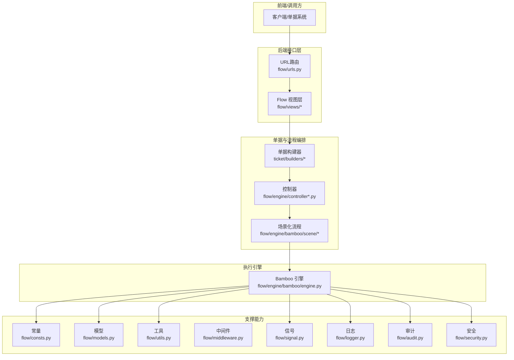
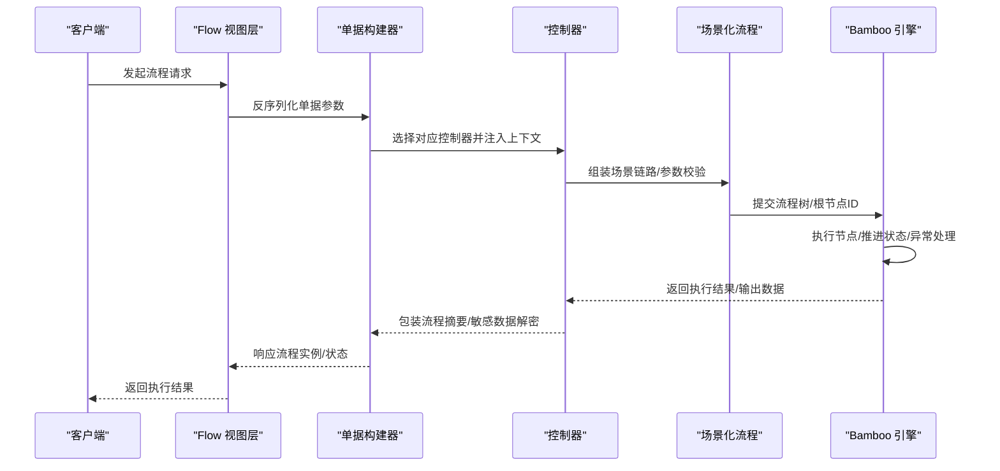
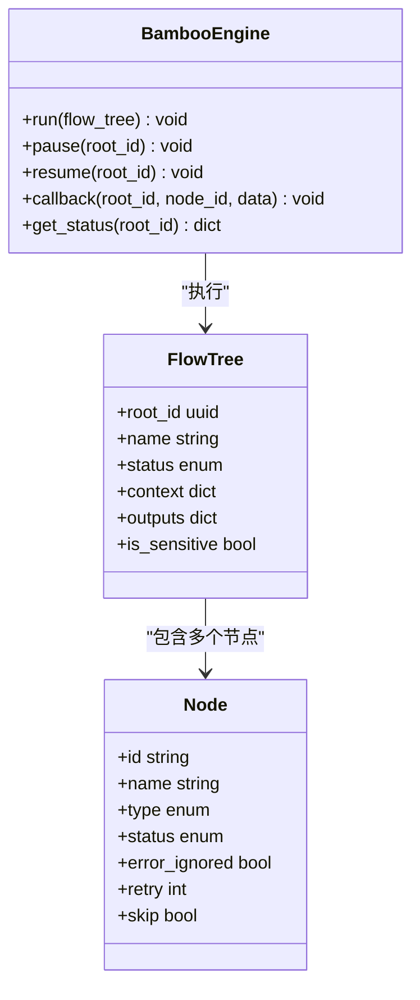
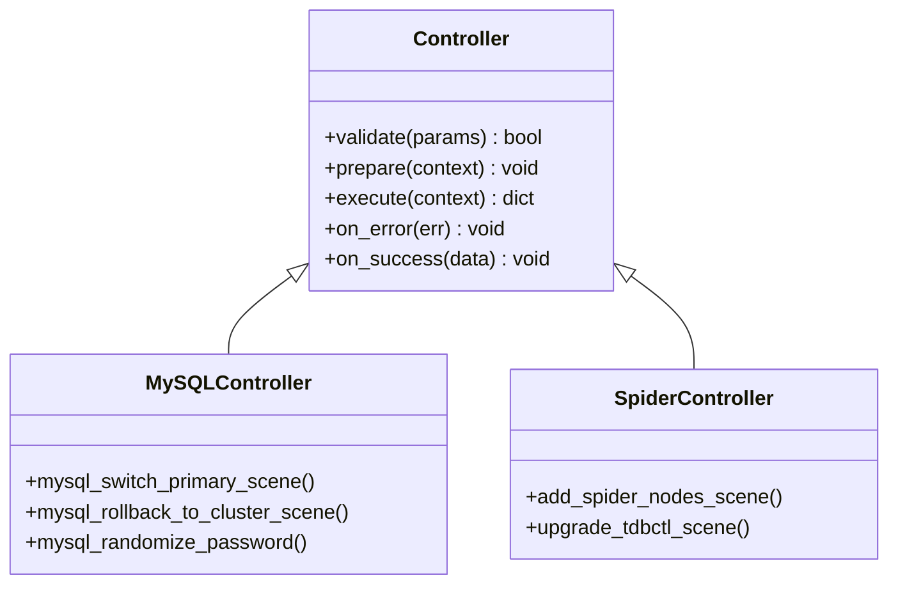
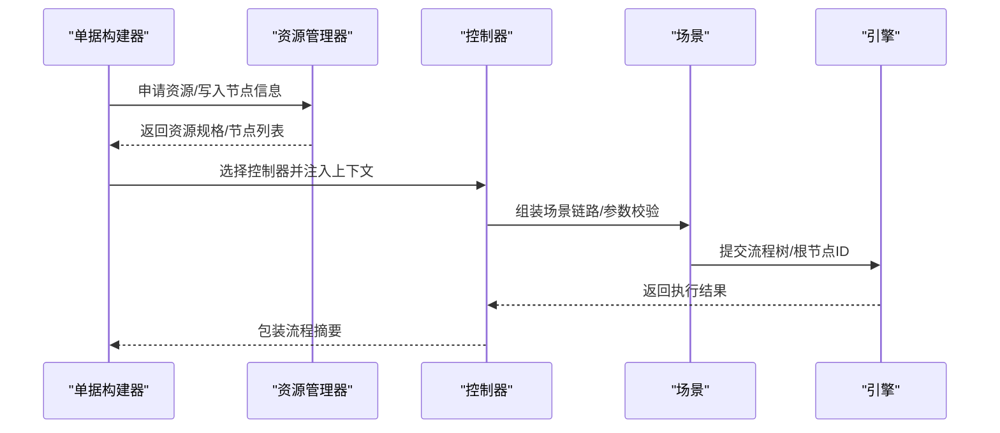
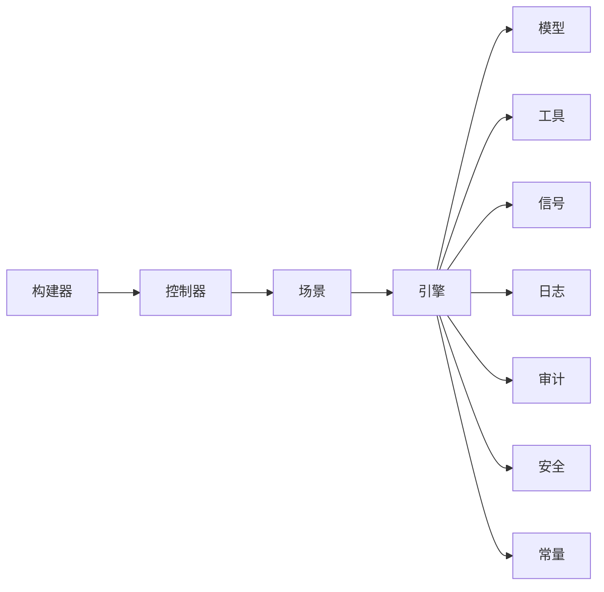

# 工作流扩展

<cite>
**本文引用的文件**
- [README.md](file://dbm-ui/backend/flow/README.md)
- [engine.py](file://dbm-ui/backend/flow/engine/bamboo/engine.py)
- [controller.py](file://dbm-ui/backend/flow/engine/controller.py)
- [mysql_controller.py](file://dbm-ui/backend/flow/engine/controller/mysql.py)
- [spider_controller.py](file://dbm-ui/backend/flow/engine/controller/spider.py)
- [scene.py](file://dbm-ui/backend/flow/engine/bamboo/scene.py)
- [mysql_scene.py](file://dbm-ui/backend/flow/engine/bamboo/scene/mysql/mysql_scene.py)
- [spider_scene.py](file://dbm-ui/backend/flow/engine/bamboo/scene/spider/spider_scene.py)
- [base_view.py](file://dbm-ui/backend/flow/views/base.py)
- [flow_view.py](file://dbm-ui/backend/flow/views/flow.py)
- [flow_urls.py](file://dbm-ui/backend/flow/urls.py)
- [builder.py](file://dbm-ui/backend/ticket/builders/builder.py)
- [tendbcluster_builder.py](file://dbm-ui/backend/ticket/builders/tendbcluster/tendb_spider_add_nodes.py)
- [mysql_fixpoint_rollback_builder.py](file://dbm-ui/backend/ticket/builders/mysql/mysql_fixpoint_rollback.py)
- [redis_toolbox_fixpoint_make_builder.py](file://dbm-ui/backend/ticket/builders/redis/redis_toolbox_fixpoint_make.py)
- [ticket_model.py](file://dbm-ui/backend/ticket/models/ticket.py)
- [resource_manager.py](file://dbm-ui/backend/ticket/flow_manager/resource.py)
- [flow_consts.py](file://dbm-ui/backend/flow/consts.py)
- [flow_models.py](file://dbm-ui/backend/flow/models.py)
- [flow_utils.py](file://dbm-ui/backend/flow/utils.py)
- [flow_signals.py](file://dbm-ui/backend/flow/signal.py)
- [flow_middleware.py](file://dbm-ui/backend/flow/middleware.py)
- [flow_logger.py](file://dbm-ui/backend/flow/logger.py)
- [flow_audit.py](file://dbm-ui/backend/flow/audit.py)
- [flow_security.py](file://dbm-ui/backend/flow/security.py)
- [flow_testing.py](file://dbm-ui/backend/flow/tests.py)
- [flow_performance.py](file://dbm-ui/backend/flow/performance.py)
- [flow_integration.py](file://dbm-ui/backend/flow/integration.py)
- [flow_docs.py](file://dbm-ui/backend/flow/docs.py)
</cite>

## 目录
1. [简介](#简介)
2. [项目结构](#项目结构)
3. [核心组件](#核心组件)
4. [架构总览](#架构总览)
5. [详细组件分析](#详细组件分析)
6. [依赖关系分析](#依赖关系分析)
7. [性能考虑](#性能考虑)
8. [故障排查指南](#故障排查指南)
9. [结论](#结论)
10. [附录](#附录)

## 简介
本文件面向DBM工作流扩展能力，系统性阐述工作流引擎的扩展机制、节点开发与流程定制方法，覆盖自定义工作流节点、业务处理器与状态管理；同时涵盖工作流配置管理、权限控制与审计日志；并提供测试、调试与性能优化方法，以及与外部系统的集成与扩展接口。

## 项目结构
DBM工作流主要由“单据构建器”、“控制器”、“场景化流程”、“引擎”四层构成，并通过视图层对外暴露REST接口，配合常量、模型、工具、中间件、信号、日志、审计、安全等基础设施协同工作。

图表来源
- [flow_urls.py](file://dbm-ui/backend/flow/urls.py)
- [flow_view.py](file://dbm-ui/backend/flow/views/flow.py)
- [builder.py](file://dbm-ui/backend/ticket/builders/builder.py)
- [controller.py](file://dbm-ui/backend/flow/engine/controller.py)
- [engine.py](file://dbm-ui/backend/flow/engine/bamboo/engine.py)
- [scene.py](file://dbm-ui/backend/flow/engine/bamboo/scene.py)
- [flow_models.py](file://dbm-ui/backend/flow/models.py)
- [flow_utils.py](file://dbm-ui/backend/flow/utils.py)
- [flow_signals.py](file://dbm-ui/backend/flow/signal.py)
- [flow_logger.py](file://dbm-ui/backend/flow/logger.py)
- [flow_audit.py](file://dbm-ui/backend/flow/audit.py)
- [flow_security.py](file://dbm-ui/backend/flow/security.py)
- [flow_consts.py](file://dbm-ui/backend/flow/consts.py)

章节来源
- [README.md](file://dbm-ui/backend/flow/README.md)
- [flow_urls.py](file://dbm-ui/backend/flow/urls.py)

## 核心组件
- 引擎层：Bamboo引擎负责流程树的调度、状态推进与异常处理，提供统一的执行入口与生命周期管理。
- 控制器层：按数据库类型（如MySQL、Spider）抽象控制器，封装具体场景的参数校验、重试策略与执行逻辑。
- 场景层：将复杂业务拆解为可复用的原子动作（scene），支持组合与嵌套，便于扩展新的业务链路。
- 构建器层：将单据需求转化为内部流程，负责参数序列化、资源申请、校验与触发控制器。
- 支撑层：常量、模型、工具、中间件、信号、日志、审计、安全等模块保障流程的稳定性与可观测性。

章节来源
- [engine.py](file://dbm-ui/backend/flow/engine/bamboo/engine.py)
- [controller.py](file://dbm-ui/backend/flow/engine/controller.py)
- [mysql_controller.py](file://dbm-ui/backend/flow/engine/controller/mysql.py)
- [spider_controller.py](file://dbm-ui/backend/flow/engine/controller/spider.py)
- [scene.py](file://dbm-ui/backend/flow/engine/bamboo/scene.py)
- [mysql_scene.py](file://dbm-ui/backend/flow/engine/bamboo/scene/mysql/mysql_scene.py)
- [spider_scene.py](file://dbm-ui/backend/flow/engine/bamboo/scene/spider/spider_scene.py)
- [builder.py](file://dbm-ui/backend/ticket/builders/builder.py)
- [flow_consts.py](file://dbm-ui/backend/flow/consts.py)
- [flow_models.py](file://dbm-ui/backend/flow/models.py)
- [flow_utils.py](file://dbm-ui/backend/flow/utils.py)
- [flow_signals.py](file://dbm-ui/backend/flow/signal.py)
- [flow_logger.py](file://dbm-ui/backend/flow/logger.py)
- [flow_audit.py](file://dbm-ui/backend/flow/audit.py)
- [flow_security.py](file://dbm-ui/backend/flow/security.py)

## 架构总览
下图展示从单据到执行引擎的整体调用链路，体现“构建器-控制器-场景-引擎”的分层职责与交互。

图表来源
- [flow_view.py](file://dbm-ui/backend/flow/views/flow.py)
- [builder.py](file://dbm-ui/backend/ticket/builders/builder.py)
- [controller.py](file://dbm-ui/backend/flow/engine/controller.py)
- [engine.py](file://dbm-ui/backend/flow/engine/bamboo/engine.py)

## 详细组件分析

### 引擎与执行模型
- 引擎职责：接收流程树与根节点ID，驱动节点执行、状态流转、异常捕获与重试策略。
- 流程树模型：包含节点集合、状态机、上下文、输出数据与敏感数据标记等字段。
- 输出数据：支持对敏感数据进行加密存储与解密读取，确保合规与安全。

图表来源
- [engine.py](file://dbm-ui/backend/flow/engine/bamboo/engine.py)
- [flow_models.py](file://dbm-ui/backend/flow/models.py)

章节来源
- [engine.py](file://dbm-ui/backend/flow/engine/bamboo/engine.py)
- [flow_models.py](file://dbm-ui/backend/flow/models.py)
- [ticket_model.py](file://dbm-ui/backend/ticket/models/ticket.py)

### 控制器与场景化流程
- 控制器：按数据库类型划分（如MySQL、Spider），提供统一的场景入口、参数校验与重试策略。
- 场景：将复杂业务拆分为原子动作（scene），支持组合、条件分支与并行执行。
- 典型场景：MySQL主从切换、集群扩容、定点回档、Spider升级等。

图表来源
- [controller.py](file://dbm-ui/backend/flow/engine/controller.py)
- [mysql_controller.py](file://dbm-ui/backend/flow/engine/controller/mysql.py)
- [spider_controller.py](file://dbm-ui/backend/flow/engine/controller/spider.py)

章节来源
- [controller.py](file://dbm-ui/backend/flow/engine/controller.py)
- [mysql_controller.py](file://dbm-ui/backend/flow/engine/controller/mysql.py)
- [spider_controller.py](file://dbm-ui/backend/flow/engine/controller/spider.py)
- [mysql_scene.py](file://dbm-ui/backend/flow/engine/bamboo/scene/mysql/mysql_scene.py)
- [spider_scene.py](file://dbm-ui/backend/flow/engine/bamboo/scene/spider/spider_scene.py)

### 单据构建器与流程定制
- 构建器职责：将单据序列化为内部流程，负责资源申请、参数校验、触发控制器与状态推进。
- 注册机制：通过装饰器注册不同单据类型的构建器，绑定序列化器、资源申请器与控制器校验器。
- 定制流程：通过继承基类、重写序列化器与资源申请器，实现新业务场景的快速接入。

图表来源
- [builder.py](file://dbm-ui/backend/ticket/builders/builder.py)
- [resource_manager.py](file://dbm-ui/backend/ticket/flow_manager/resource.py)
- [tendbcluster_builder.py](file://dbm-ui/backend/ticket/builders/tendbcluster/tendb_spider_add_nodes.py)
- [mysql_fixpoint_rollback_builder.py](file://dbm-ui/backend/ticket/builders/mysql/mysql_fixpoint_rollback.py)
- [redis_toolbox_fixpoint_make_builder.py](file://dbm-ui/backend/ticket/builders/redis/redis_toolbox_fixpoint_make.py)

章节来源
- [builder.py](file://dbm-ui/backend/ticket/builders/builder.py)
- [resource_manager.py](file://dbm-ui/backend/ticket/flow_manager/resource.py)
- [tendbcluster_builder.py](file://dbm-ui/backend/ticket/builders/tendbcluster/tendb_spider_add_nodes.py)
- [mysql_fixpoint_rollback_builder.py](file://dbm-ui/backend/ticket/builders/mysql/mysql_fixpoint_rollback.py)
- [redis_toolbox_fixpoint_make_builder.py](file://dbm-ui/backend/ticket/builders/redis/redis_toolbox_fixpoint_make.py)

### 配置管理、权限控制与审计日志
- 配置管理：通过常量模块集中管理流程状态、介质类型、备份位置等配置项，保证一致性与可维护性。
- 权限控制：结合中间件与安全模块，对API访问、流程操作进行鉴权与授权，防止越权与误操作。
- 审计日志：记录流程关键事件、操作人、时间戳与影响范围，支持回溯与合规检查。

章节来源
- [flow_consts.py](file://dbm-ui/backend/flow/consts.py)
- [flow_middleware.py](file://dbm-ui/backend/flow/middleware.py)
- [flow_security.py](file://dbm-ui/backend/flow/security.py)
- [flow_audit.py](file://dbm-ui/backend/flow/audit.py)

### 测试、调试与性能优化
- 单元测试：优先采用组件测试混合器模式，参考现有组件测试样例，确保节点行为与边界条件正确。
- 本地测试：通过视图层与URL路由添加测试入口，使用FlowTestView进行本地调试，仅在本地开启DEBUG模式。
- 性能优化：关注节点执行耗时、并发度与重试策略，结合指标中间件与日志分析瓶颈，必要时引入异步任务或缓存。

章节来源
- [README.md](file://dbm-ui/backend/flow/README.md)
- [flow_testing.py](file://dbm-ui/backend/flow/tests.py)
- [flow_performance.py](file://dbm-ui/backend/flow/performance.py)

### 外部系统集成与扩展接口
- 集成点：通过场景层与控制器层对接外部系统（如CMDB、DB-Proxy、备份系统等），在节点执行前后进行数据同步与状态上报。
- 扩展接口：新增场景时遵循现有scene接口规范，确保与引擎的兼容性；通过中间件与信号扩展非功能性需求（如监控、告警）。

章节来源
- [flow_integration.py](file://dbm-ui/backend/flow/integration.py)
- [flow_signals.py](file://dbm-ui/backend/flow/signal.py)
- [flow_utils.py](file://dbm-ui/backend/flow/utils.py)

## 依赖关系分析
- 层间耦合：构建器依赖控制器，控制器依赖场景，场景依赖引擎；模型与工具为底层支撑，避免反向依赖。
- 外部依赖：通过中间件与安全模块隔离外部系统，降低耦合度；通过信号与日志模块实现横切关注点。
- 循环依赖：通过清晰的接口与抽象避免循环依赖；若需跨模块交互，采用回调或事件通知。

图表来源
- [builder.py](file://dbm-ui/backend/ticket/builders/builder.py)
- [controller.py](file://dbm-ui/backend/flow/engine/controller.py)
- [scene.py](file://dbm-ui/backend/flow/engine/bamboo/scene.py)
- [engine.py](file://dbm-ui/backend/flow/engine/bamboo/engine.py)
- [flow_models.py](file://dbm-ui/backend/flow/models.py)
- [flow_utils.py](file://dbm-ui/backend/flow/utils.py)
- [flow_signals.py](file://dbm-ui/backend/flow/signal.py)
- [flow_logger.py](file://dbm-ui/backend/flow/logger.py)
- [flow_audit.py](file://dbm-ui/backend/flow/audit.py)
- [flow_security.py](file://dbm-ui/backend/flow/security.py)
- [flow_consts.py](file://dbm-ui/backend/flow/consts.py)

## 性能考虑
- 节点粒度：合理拆分节点，避免单节点执行时间过长；对IO密集型节点采用异步化与批量化。
- 并发与限流：根据下游系统承载能力设置并发上限与退避策略，避免雪崩效应。
- 缓存与索引：对频繁查询的数据建立缓存与索引，减少重复计算与数据库压力。
- 指标与告警：通过指标中间件采集关键指标，结合告警规则及时发现与处置性能问题。

## 故障排查指南
- 日志定位：通过日志模块查看引擎执行轨迹、节点状态与异常堆栈，结合审计日志定位操作路径。
- 状态检查：使用引擎提供的状态查询接口核对流程树与节点状态，确认阻塞环节。
- 回滚与重试：根据控制器的重试策略与场景的错误处理逻辑，执行回滚或手动重试。
- 安全审计：核查权限控制与安全策略是否生效，确保操作合规。

章节来源
- [flow_logger.py](file://dbm-ui/backend/flow/logger.py)
- [flow_audit.py](file://dbm-ui/backend/flow/audit.py)
- [flow_security.py](file://dbm-ui/backend/flow/security.py)

## 结论
DBM工作流通过“构建器-控制器-场景-引擎”的分层设计实现了高内聚、低耦合的扩展能力。开发者可通过场景化节点与控制器快速定制业务流程，借助常量、模型、工具与中间件完善配置与治理能力，并通过测试、调试与性能优化保障线上稳定运行。同时，完善的权限控制与审计日志为合规与安全提供了坚实基础。

## 附录
- 快速开始：参考README中的开发测试指引，先在本地搭建测试环境，再逐步接入真实场景。
- 最佳实践：优先使用已有控制器与场景，避免重复造轮子；严格区分业务参数与系统参数，确保可追溯性。

章节来源
- [README.md](file://dbm-ui/backend/flow/README.md)