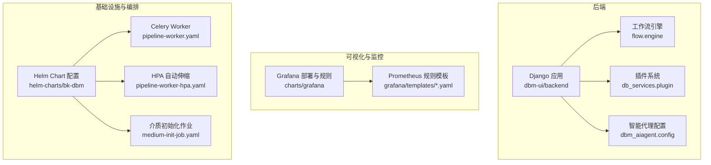
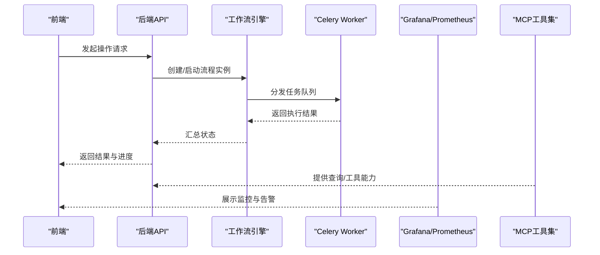
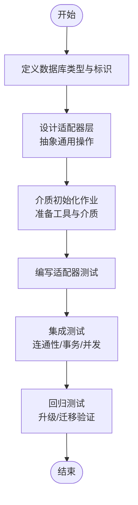
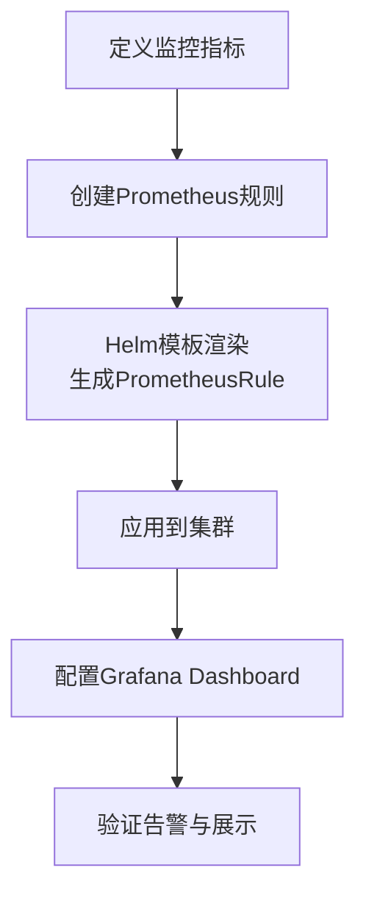
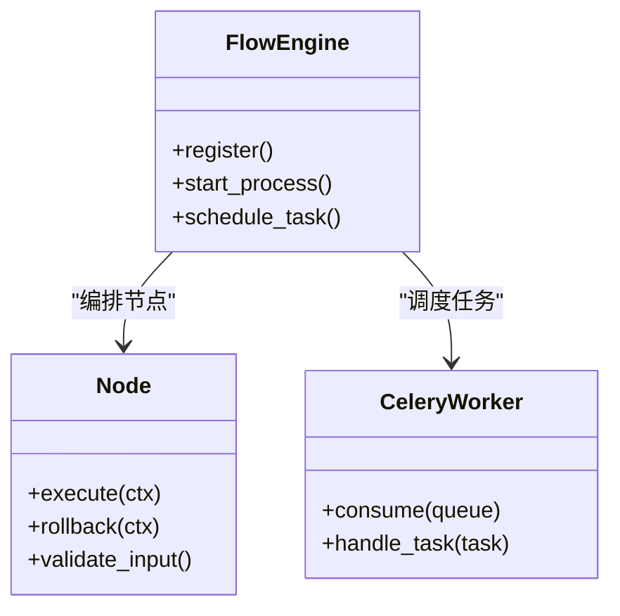
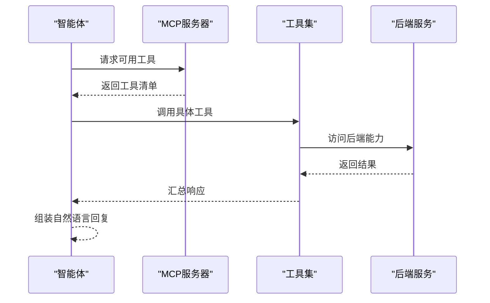
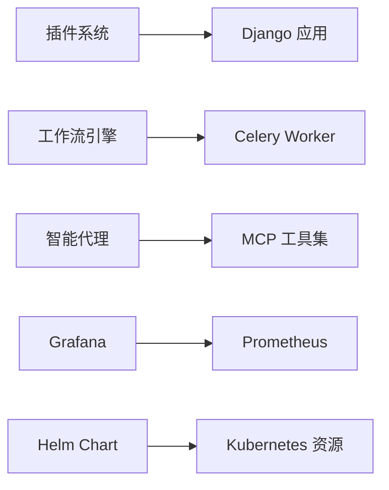

# 扩展与定制

<cite>
**本文引用的文件**
- [dbm-ui/backend/dbm_aiagent/config.py](file://dbm-ui/backend/dbm_aiagent/config.py)
- [dbm-ui/backend/flow/engine/__init__.py](file://dbm-ui/backend/flow/engine/__init__.py)
- [dbm-ui/backend/db_services/plugin/__init__.py](file://dbm-ui/backend/db_services/plugin/__init__.py)
- [helm-charts/bk-dbm/templates/configmaps/db-resource-configmap.yaml](file://helm-charts/bk-dbm/templates/configmaps/db-resource-configmap.yaml)
- [helm-charts/bk-dbm/charts/dbm/templates/deployments/celery/pipeline-worker.yaml](file://helm-charts/bk-dbm/charts/dbm/templates/deployments/celery/pipeline-worker.yaml)
- [helm-charts/bk-dbm/charts/dbm/templates/jobs/medium-init-job.yaml](file://helm-charts/bk-dbm/charts/dbm/templates/jobs/medium-init-job.yaml)
- [helm-charts/bk-dbm/charts/grafana/README.md](file://helm-charts/bk-dbm/charts/grafana/README.md)
- [helm-charts/bk-dbm/charts/grafana/templates/prometheusrules.yaml](file://helm-charts/bk-dbm/charts/grafana/templates/prometheusrules.yaml)
- [helm-charts/bk-dbm/charts/grafana/templates/image-renderer-prometheusrules.yaml](file://helm-charts/bk-dbm/charts/grafana/templates/image-renderer-prometheusrules.yaml)
- [helm-charts/bk-dbm/charts/grafana/templates/image-renderer-deployment.yaml](file://helm-charts/bk-dbm/charts/grafana/templates/image-renderer-deployment.yaml)
- [helm-charts/bk-dbm/charts/k8s-dbs/charts/common/README.md](file://helm-charts/bk-dbm/charts/k8s-dbs/charts/common/README.md)
- [helm-charts/bk-dbm/charts/dbm/templates/hpas/pipeline-worker-hpa.yaml](file://helm-charts/bk-dbm/charts/dbm/templates/hpas/pipeline-worker-hpa.yaml)
- [helm-charts/bk-dbm/templates/configmaps/db-celery-service-configmap.yaml](file://helm-charts/bk-dbm/templates/configmaps/db-celery-service-configmap.yaml)
- [helm-charts/bk-dbm/templates/configmaps/hadb-api-configmap.yaml](file://helm-charts/bk-dbm/templates/configmaps/hadb-api-configmap.yaml)
</cite>

## 目录
1. [简介](#简介)
2. [项目结构](#项目结构)
3. [核心组件](#核心组件)
4. [架构总览](#架构总览)
5. [详细组件分析](#详细组件分析)
6. [依赖关系分析](#依赖关系分析)
7. [性能考虑](#性能考虑)
8. [故障排查指南](#故障排查指南)
9. [结论](#结论)
10. [附录](#附录)

## 简介
本文件面向DBM的扩展与定制需求，系统化梳理插件开发、新数据库类型接入、自定义监控与告警、工作流引擎扩展、节点开发与流程定制，以及AI智能代理的集成与扩展路径。内容基于仓库中实际实现与配置进行归纳总结，并提供架构图与流程图帮助理解。

## 项目结构
DBM采用前后端分离与多模块协作的方式组织代码。后端以Django为核心，通过服务化模块承载不同数据库类型与能力；前端UI通过后端接口与可视化组件交互；监控与可视化依托Grafana与Prometheus；工作流引擎负责编排任务；AI智能代理通过MCP工具集与后端服务对接。

图表来源
- [dbm-ui/backend/flow/engine/__init__.py:1-12](file://dbm-ui/backend/flow/engine/__init__.py#L1-L12)
- [dbm-ui/backend/db_services/plugin/__init__.py:1-13](file://dbm-ui/backend/db_services/plugin/__init__.py#L1-L13)
- [dbm-ui/backend/dbm_aiagent/config.py:1-453](file://dbm-ui/backend/dbm_aiagent/config.py#L1-L453)
- [helm-charts/bk-dbm/charts/grafana/README.md:1-515](file://helm-charts/bk-dbm/charts/grafana/README.md#L1-L515)
- [helm-charts/bk-dbm/charts/grafana/templates/prometheusrules.yaml:1-24](file://helm-charts/bk-dbm/charts/grafana/templates/prometheusrules.yaml#L1-L24)
- [helm-charts/bk-dbm/charts/dbm/templates/deployments/celery/pipeline-worker.yaml:36-62](file://helm-charts/bk-dbm/charts/dbm/templates/deployments/celery/pipeline-worker.yaml#L36-L62)
- [helm-charts/bk-dbm/charts/dbm/templates/hpas/pipeline-worker-hpa.yaml:1-28](file://helm-charts/bk-dbm/charts/dbm/templates/hpas/pipeline-worker-hpa.yaml#L1-L28)
- [helm-charts/bk-dbm/charts/dbm/templates/jobs/medium-init-job.yaml:33-42](file://helm-charts/bk-dbm/charts/dbm/templates/jobs/medium-init-job.yaml#L33-L42)

章节来源
- [dbm-ui/backend/flow/engine/__init__.py:1-12](file://dbm-ui/backend/flow/engine/__init__.py#L1-L12)
- [dbm-ui/backend/db_services/plugin/__init__.py:1-13](file://dbm-ui/backend/db_services/plugin/__init__.py#L1-L13)
- [dbm-ui/backend/dbm_aiagent/config.py:1-453](file://dbm-ui/backend/dbm_aiagent/config.py#L1-L453)
- [helm-charts/bk-dbm/charts/grafana/README.md:1-515](file://helm-charts/bk-dbm/charts/grafana/README.md#L1-L515)

## 核心组件
- 插件系统：用于承载第三方接口或插件，便于在内部环境使用与扩展。
- 工作流引擎：通过应用配置注册，作为任务编排的核心。
- 智能代理与MCP：通过配置管理多个MCP服务器与工具集合，提供跨数据库与运维场景的统一工具入口。
- 可视化与监控：Grafana图表与Prometheus规则模板，支持自定义仪表盘与告警策略。
- 基础设施与编排：Helm Chart定义部署、HPA、Init Job等，支撑弹性与初始化流程。

章节来源
- [dbm-ui/backend/db_services/plugin/__init__.py:1-13](file://dbm-ui/backend/db_services/plugin/__init__.py#L1-L13)
- [dbm-ui/backend/flow/engine/__init__.py:1-12](file://dbm-ui/backend/flow/engine/__init__.py#L1-L12)
- [dbm-ui/backend/dbm_aiagent/config.py:1-453](file://dbm-ui/backend/dbm_aiagent/config.py#L1-L453)
- [helm-charts/bk-dbm/charts/grafana/README.md:1-515](file://helm-charts/bk-dbm/charts/grafana/README.md#L1-L515)

## 架构总览
下图展示从请求到执行的关键路径：前端通过后端接口触发工作流，工作流调度任务至Celery Worker；监控与可视化由Grafana/Prometheus提供；AI智能代理通过MCP工具集与后端服务交互。

图表来源
- [dbm-ui/backend/flow/engine/__init__.py:1-12](file://dbm-ui/backend/flow/engine/__init__.py#L1-L12)
- [helm-charts/bk-dbm/charts/dbm/templates/deployments/celery/pipeline-worker.yaml:36-62](file://helm-charts/bk-dbm/charts/dbm/templates/deployments/celery/pipeline-worker.yaml#L36-L62)
- [helm-charts/bk-dbm/charts/grafana/README.md:1-515](file://helm-charts/bk-dbm/charts/grafana/README.md#L1-L515)
- [dbm-ui/backend/dbm_aiagent/config.py:1-453](file://dbm-ui/backend/dbm_aiagent/config.py#L1-L453)

## 详细组件分析

### 插件开发与扩展点
- 目标：在内部环境使用第三方接口或插件，保持与主系统的解耦。
- 实践要点：
  - 在插件目录下新增模块，遵循现有命名与导入规范。
  - 通过配置或注册机制暴露接口，避免硬编码依赖。
  - 对外提供清晰的接口契约与错误处理，确保稳定性。
- 最佳实践：
  - 将插件能力封装为独立包，提供统一的初始化与关闭钩子。
  - 通过环境变量或配置中心动态开关插件，降低变更风险。
  - 编写单元测试与集成测试，覆盖正常与异常分支。

章节来源
- [dbm-ui/backend/db_services/plugin/__init__.py:1-13](file://dbm-ui/backend/db_services/plugin/__init__.py#L1-L13)

### 新数据库支持与适配器开发
- 接入流程建议：
  - 定义数据库类型常量与标识，确保全局一致性。
  - 设计适配器层，抽象连接、执行、回滚、备份等通用操作。
  - 提供初始化脚本与介质准备（参考介质初始化作业）。
  - 编写适配器测试，覆盖典型与边界场景。
- 介质与初始化：
  - 使用介质初始化作业统一安装与准备数据库相关工具与介质。
  - 通过Helm Values控制是否启用特定数据库的初始化步骤。
- 测试验证：
  - 单元测试：适配器方法的正确性与异常处理。
  - 集成测试：与真实数据库实例连通性、事务与并发场景。
  - 回归测试：升级与迁移过程中的兼容性验证。

图表来源
- [helm-charts/bk-dbm/charts/dbm/templates/jobs/medium-init-job.yaml:33-42](file://helm-charts/bk-dbm/charts/dbm/templates/jobs/medium-init-job.yaml#L33-L42)

章节来源
- [helm-charts/bk-dbm/charts/dbm/templates/jobs/medium-init-job.yaml:33-42](file://helm-charts/bk-dbm/charts/dbm/templates/jobs/medium-init-job.yaml#L33-L42)

### 自定义监控指标、告警规则与可视化定制
- 指标与规则：
  - Grafana通过Prometheus规则模板生成告警策略，支持按组件启用与命名空间隔离。
  - 可在规则中定义分组与告警条件，结合Grafana Dashboard进行可视化展示。
- 可视化定制：
  - 使用Grafana提供的Dashboard与Datasource机制，按需挂载ConfigMap与Secret。
  - 通过Helm模板渲染PrometheusRule对象，实现规则的集中管理与发布。
- 最佳实践：
  - 将规则与Dashboard分离，便于复用与维护。
  - 为不同环境设置独立的命名空间与标签，避免误触发。
  - 对关键指标设置多级阈值与静默窗口，减少噪声。

图表来源
- [helm-charts/bk-dbm/charts/grafana/templates/prometheusrules.yaml:1-24](file://helm-charts/bk-dbm/charts/grafana/templates/prometheusrules.yaml#L1-L24)
- [helm-charts/bk-dbm/charts/grafana/templates/image-renderer-prometheusrules.yaml:1-24](file://helm-charts/bk-dbm/charts/grafana/templates/image-renderer-prometheusrules.yaml#L1-L24)
- [helm-charts/bk-dbm/charts/grafana/README.md:503-515](file://helm-charts/bk-dbm/charts/grafana/README.md#L503-L515)

章节来源
- [helm-charts/bk-dbm/charts/grafana/templates/prometheusrules.yaml:1-24](file://helm-charts/bk-dbm/charts/grafana/templates/prometheusrules.yaml#L1-L24)
- [helm-charts/bk-dbm/charts/grafana/templates/image-renderer-prometheusrules.yaml:1-24](file://helm-charts/bk-dbm/charts/grafana/templates/image-renderer-prometheusrules.yaml#L1-L24)
- [helm-charts/bk-dbm/charts/grafana/README.md:503-515](file://helm-charts/bk-dbm/charts/grafana/README.md#L503-L515)

### 工作流引擎扩展、节点开发与流程定制
- 引擎注册：
  - 通过应用配置注册工作流引擎，确保在Django生命周期内可用。
- 节点开发：
  - 定义节点类，实现输入输出、执行逻辑与错误处理。
  - 节点间通过上下文传递参数，保证可组合与可复用。
- 流程定制：
  - 使用流程编辑器或DSL定义流程，支持条件分支、并行与回滚。
  - 通过HPA与资源限制保障执行稳定性与弹性。
- Celery集成：
  - 通过Celery Worker消费队列任务，支持多队列与优先级。
  - 设置最大任务数与时间限制，避免长时间占用。

图表来源
- [dbm-ui/backend/flow/engine/__init__.py:1-12](file://dbm-ui/backend/flow/engine/__init__.py#L1-L12)
- [helm-charts/bk-dbm/charts/dbm/templates/deployments/celery/pipeline-worker.yaml:36-62](file://helm-charts/bk-dbm/charts/dbm/templates/deployments/celery/pipeline-worker.yaml#L36-L62)
- [helm-charts/bk-dbm/charts/dbm/templates/hpas/pipeline-worker-hpa.yaml:1-28](file://helm-charts/bk-dbm/charts/dbm/templates/hpas/pipeline-worker-hpa.yaml#L1-L28)

章节来源
- [dbm-ui/backend/flow/engine/__init__.py:1-12](file://dbm-ui/backend/flow/engine/__init__.py#L1-L12)
- [helm-charts/bk-dbm/charts/dbm/templates/deployments/celery/pipeline-worker.yaml:36-62](file://helm-charts/bk-dbm/charts/dbm/templates/deployments/celery/pipeline-worker.yaml#L36-L62)
- [helm-charts/bk-dbm/charts/dbm/templates/hpas/pipeline-worker-hpa.yaml:1-28](file://helm-charts/bk-dbm/charts/dbm/templates/hpas/pipeline-worker-hpa.yaml#L1-L28)

### AI智能代理集成与扩展开发
- MCP服务器与工具集：
  - 通过配置定义多个MCP服务器，每个服务器绑定一组工具，支持按标签与权限控制。
  - 支持启用/停用、公开/私有等策略，便于灰度与治理。
- 智能体配置：
  - 默认Agent与配置管理器可通过环境变量或配置中心调整。
  - 支持开启MCP Server，自动发现并填充工具列表。
- 扩展开发：
  - 新增工具时，先在MCP服务器中注册，再在智能体侧绑定。
  - 为工具编写描述与约束，明确使用场景与权限要求。
- LLM与AI能力：
  - Helm配置中包含LLM与AI相关参数，可用于控制模型、温度、令牌上限等。
  - 结合后端服务实现工具调用与结果聚合。

图表来源
- [dbm-ui/backend/dbm_aiagent/config.py:1-453](file://dbm-ui/backend/dbm_aiagent/config.py#L1-L453)
- [helm-charts/bk-dbm/templates/configmaps/db-resource-configmap.yaml:47-59](file://helm-charts/bk-dbm/templates/configmaps/db-resource-configmap.yaml#L47-L59)

章节来源
- [dbm-ui/backend/dbm_aiagent/config.py:1-453](file://dbm-ui/backend/dbm_aiagent/config.py#L1-L453)
- [helm-charts/bk-dbm/templates/configmaps/db-resource-configmap.yaml:47-59](file://helm-charts/bk-dbm/templates/configmaps/db-resource-configmap.yaml#L47-L59)

## 依赖关系分析
- 组件耦合：
  - 工作流引擎与Celery Worker松耦合，通过消息队列通信。
  - 插件系统与主系统通过接口契约解耦，便于替换与扩展。
  - 智能代理与后端服务通过MCP协议解耦，支持多数据库与运维场景。
- 外部依赖：
  - Grafana与Prometheus用于监控与可视化。
  - Helm Chart用于Kubernetes资源编排与配置注入。
- 循环依赖：
  - 当前结构未见循环依赖迹象，各模块职责清晰。

图表来源
- [dbm-ui/backend/db_services/plugin/__init__.py:1-13](file://dbm-ui/backend/db_services/plugin/__init__.py#L1-L13)
- [dbm-ui/backend/flow/engine/__init__.py:1-12](file://dbm-ui/backend/flow/engine/__init__.py#L1-L12)
- [dbm-ui/backend/dbm_aiagent/config.py:1-453](file://dbm-ui/backend/dbm_aiagent/config.py#L1-L453)
- [helm-charts/bk-dbm/charts/grafana/README.md:1-515](file://helm-charts/bk-dbm/charts/grafana/README.md#L1-L515)

章节来源
- [dbm-ui/backend/db_services/plugin/__init__.py:1-13](file://dbm-ui/backend/db_services/plugin/__init__.py#L1-L13)
- [dbm-ui/backend/flow/engine/__init__.py:1-12](file://dbm-ui/backend/flow/engine/__init__.py#L1-L12)
- [dbm-ui/backend/dbm_aiagent/config.py:1-453](file://dbm-ui/backend/dbm_aiagent/config.py#L1-L453)
- [helm-charts/bk-dbm/charts/grafana/README.md:1-515](file://helm-charts/bk-dbm/charts/grafana/README.md#L1-L515)

## 性能考虑
- 弹性与伸缩：
  - 通过HPA对Pipeline Worker进行CPU/内存目标平均利用率伸缩，提升资源利用率与稳定性。
- 并发与限流：
  - Celery Worker设置最大任务数与时间限制，避免长耗时任务影响整体吞吐。
- 监控与告警：
  - 通过Prometheus规则与Grafana仪表盘，持续观测关键指标，及时发现性能瓶颈。
- 初始化与介质：
  - 使用Init Job统一准备介质，减少运行期等待与失败率。

章节来源
- [helm-charts/bk-dbm/charts/dbm/templates/hpas/pipeline-worker-hpa.yaml:1-28](file://helm-charts/bk-dbm/charts/dbm/templates/hpas/pipeline-worker-hpa.yaml#L1-L28)
- [helm-charts/bk-dbm/charts/dbm/templates/deployments/celery/pipeline-worker.yaml:36-62](file://helm-charts/bk-dbm/charts/dbm/templates/deployments/celery/pipeline-worker.yaml#L36-L62)
- [helm-charts/bk-dbm/charts/grafana/README.md:1-515](file://helm-charts/bk-dbm/charts/grafana/README.md#L1-L515)

## 故障排查指南
- 工作流与任务：
  - 检查Celery Worker日志与队列状态，确认任务是否被正确消费。
  - 关注HPA指标与资源限制，避免因资源不足导致任务堆积。
- 监控与可视化：
  - 校验Prometheus规则是否成功渲染并应用，确认Grafana数据源与Dashboard配置。
- 智能代理与MCP：
  - 校验MCP服务器配置与工具注册情况，确认权限与标签匹配。
  - 检查LLM与AI相关参数，确保模型与令牌上限符合预期。
- 数据库与介质：
  - 确认介质初始化作业执行成功，数据库工具与介质可用。
  - 检查数据库连接配置与凭据，避免认证失败。

章节来源
- [helm-charts/bk-dbm/charts/dbm/templates/deployments/celery/pipeline-worker.yaml:36-62](file://helm-charts/bk-dbm/charts/dbm/templates/deployments/celery/pipeline-worker.yaml#L36-L62)
- [helm-charts/bk-dbm/charts/grafana/templates/prometheusrules.yaml:1-24](file://helm-charts/bk-dbm/charts/grafana/templates/prometheusrules.yaml#L1-L24)
- [dbm-ui/backend/dbm_aiagent/config.py:1-453](file://dbm-ui/backend/dbm_aiagent/config.py#L1-L453)
- [helm-charts/bk-dbm/charts/dbm/templates/jobs/medium-init-job.yaml:33-42](file://helm-charts/bk-dbm/charts/dbm/templates/jobs/medium-init-job.yaml#L33-L42)

## 结论
DBM在插件系统、工作流引擎、监控可视化与智能代理方面提供了清晰的扩展点与集成接口。通过Helm Chart实现基础设施编排，结合Prometheus/Grafana与MCP工具集，能够快速扩展新的数据库类型、定制监控与告警策略，并灵活扩展工作流节点与流程。建议在扩展过程中遵循接口契约、配置驱动与测试先行的原则，确保系统的稳定性与可维护性。

## 附录
- Helm通用能力与辅助函数：
  - Chart提供通用能力与辅助函数，便于在模板中生成复杂配置与资源。
- 数据库连接配置：
  - 通过ConfigMap集中管理数据库连接信息，支持多数据库实例与环境切换。
- HA/DB API配置：
  - HA/DB API配置通过ConfigMap注入，便于统一管理与热更新。

章节来源
- [helm-charts/bk-dbm/charts/k8s-dbs/charts/common/README.md:42-66](file://helm-charts/bk-dbm/charts/k8s-dbs/charts/common/README.md#L42-L66)
- [helm-charts/bk-dbm/templates/configmaps/db-celery-service-configmap.yaml:1-24](file://helm-charts/bk-dbm/templates/configmaps/db-celery-service-configmap.yaml#L1-L24)
- [helm-charts/bk-dbm/templates/configmaps/hadb-api-configmap.yaml:1-25](file://helm-charts/bk-dbm/templates/configmaps/hadb-api-configmap.yaml#L1-L25)