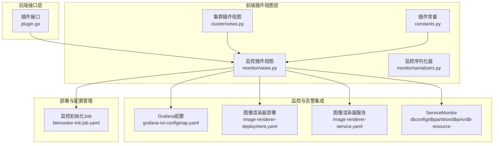
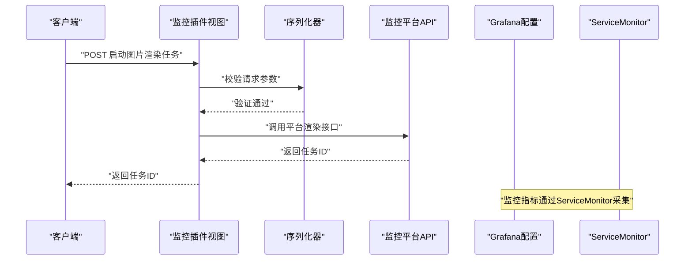
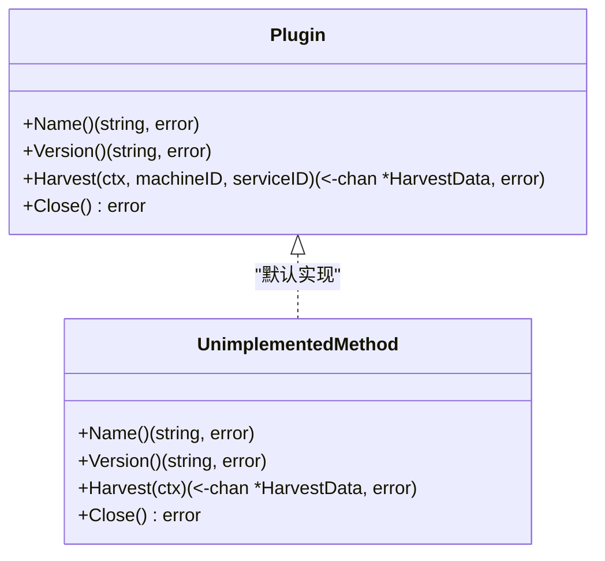
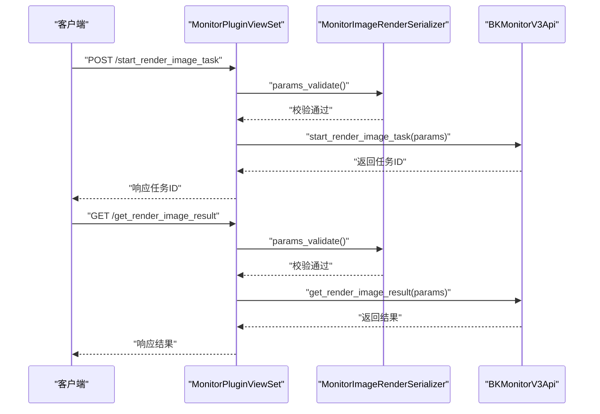
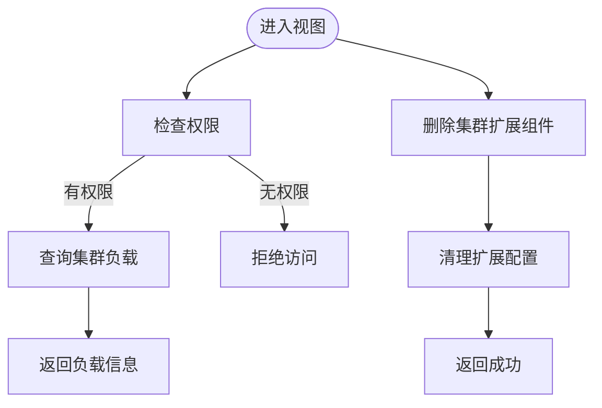
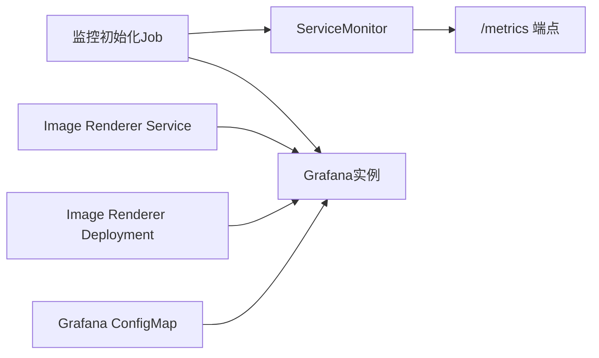
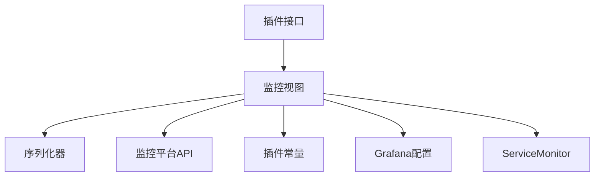

# 插件开发

<cite>
**本文引用的文件**
- [plugin.go](file://dbm-services/common/dbha-v2/internal/probe/harvester/plugin/plugin.go)
- [views.py](file://dbm-ui/backend/db_services/plugin/monitor/views.py)
- [serializers.py](file://dbm-ui/backend/db_services/plugin/monitor/serializers.py)
- [views.py](file://dbm-ui/backend/db_services/plugin/cluster/views.py)
- [constants.py](file://dbm-ui/backend/db_services/plugin/constants.py)
- [bkmonitor-init-job.yaml](file://helm-charts/bk-dbm/charts/dbm/templates/jobs/bkmonitor-init-job.yaml)
- [grafana-ini-configmap.yaml](file://helm-charts/bk-dbm/templates/configmaps/grafana-ini-configmap.yaml)
- [servicemonitor.yaml](file://helm-charts/bk-dbm/charts/dbconfig/templates/servicemonitor.yaml)
- [servicemonitor.yaml](file://helm-charts/bk-dbm/charts/dbpartition/templates/servicemonitor.yaml)
- [servicemonitor.yaml](file://helm-charts/bk-dbm/charts/dbpriv/templates/servicemonitor.yaml)
- [servicemonitor.yaml](file://helm-charts/bk-dbm/charts/db-resource/templates/servicemonitor.yaml)
- [image-renderer-deployment.yaml](file://helm-charts/bk-dbm/charts/grafana/templates/image-renderer-deployment.yaml)
- [image-renderer-service.yaml](file://helm-charts/bk-dbm/charts/grafana/templates/image-renderer-service.yaml)
- [__init__.py](file://dbm-ui/backend/db_services/plugin/__init__.py)
</cite>

## 目录
1. [简介](#简介)
2. [项目结构](#项目结构)
3. [核心组件](#核心组件)
4. [架构总览](#架构总览)
5. [组件详解](#组件详解)
6. [依赖关系分析](#依赖关系分析)
7. [性能与可维护性](#性能与可维护性)
8. [故障排查指南](#故障排查指南)
9. [结论](#结论)
10. [附录：开发最佳实践与模板](#附录开发最佳实践与模板)

## 简介
本文件面向DBM插件开发者，系统化阐述插件架构设计、扩展点与接口规范，覆盖数据库插件、监控插件与告警插件的开发流程；同时给出插件注册机制、生命周期管理、依赖注入方式、配置管理、版本兼容与升级策略、测试方法与最佳实践，帮助团队在统一框架下高效扩展与维护插件能力。

## 项目结构
DBM插件体系由“后端插件接口”“前端插件视图层”“监控与告警集成”“部署与配置管理”四部分组成：
- 后端接口层：定义插件抽象接口与默认实现，确保新增方法时的向后兼容。
- 前端插件视图层：通过Django REST Framework暴露OpenAPI，对接监控与告警平台。
- 监控与告警集成：通过Grafana、BK Monitor等组件完成可视化与告警下发。
- 部署与配置管理：通过Helm Charts统一管理ServiceMonitor、ConfigMap、初始化Job等资源。

**图表来源**
- [plugin.go:37-43](file://dbm-services/common/dbha-v2/internal/probe/harvester/plugin/plugin.go#L37-L43)
- [views.py:24-50](file://dbm-ui/backend/db_services/plugin/monitor/views.py#L24-L50)
- [serializers.py:15-37](file://dbm-ui/backend/db_services/plugin/monitor/serializers.py#L15-L37)
- [views.py:27-49](file://dbm-ui/backend/db_services/plugin/cluster/views.py#L27-L49)
- [constants.py:12-13](file://dbm-ui/backend/db_services/plugin/constants.py#L12-L13)
- [grafana-ini-configmap.yaml:41-67](file://helm-charts/bk-dbm/templates/configmaps/grafana-ini-configmap.yaml#L41-L67)
- [image-renderer-deployment.yaml:87-113](file://helm-charts/bk-dbm/charts/grafana/templates/image-renderer-deployment.yaml#L87-L113)
- [image-renderer-service.yaml:45-53](file://helm-charts/bk-dbm/charts/grafana/templates/image-renderer-service.yaml#L45-L53)
- [bkmonitor-init-job.yaml:1-33](file://helm-charts/bk-dbm/charts/dbm/templates/jobs/bkmonitor-init-job.yaml#L1-L33)

**章节来源**
- [plugin.go:37-43](file://dbm-services/common/dbha-v2/internal/probe/harvester/plugin/plugin.go#L37-L43)
- [views.py:24-50](file://dbm-ui/backend/db_services/plugin/monitor/views.py#L24-L50)
- [serializers.py:15-37](file://dbm-ui/backend/db_services/plugin/monitor/serializers.py#L15-L37)
- [views.py:27-49](file://dbm-ui/backend/db_services/plugin/cluster/views.py#L27-L49)
- [constants.py:12-13](file://dbm-ui/backend/db_services/plugin/constants.py#L12-L13)
- [grafana-ini-configmap.yaml:41-67](file://helm-charts/bk-dbm/templates/configmaps/grafana-ini-configmap.yaml#L41-L67)
- [image-renderer-deployment.yaml:87-113](file://helm-charts/bk-dbm/charts/grafana/templates/image-renderer-deployment.yaml#L87-L113)
- [image-renderer-service.yaml:45-53](file://helm-charts/bk-dbm/charts/grafana/templates/image-renderer-service.yaml#L45-L53)
- [bkmonitor-init-job.yaml:1-33](file://helm-charts/bk-dbm/charts/dbm/templates/jobs/bkmonitor-init-job.yaml#L1-L33)

## 核心组件
- 插件接口与默认实现（Go）
  - 定义统一的插件接口，包含名称、版本、采集数据与关闭方法；提供默认未实现方法，保证新增接口方法时的向后兼容。
- 监控插件视图（Python/Django REST Framework）
  - 暴露启动图片渲染任务与查询结果的OpenAPI，对接监控平台。
- 序列化器（Python/DRF）
  - 对请求参数进行校验与描述，确保调用一致性。
- 集群插件视图（Python/Django REST Framework）
  - 提供集群负载查询与扩展组件删除等能力。
- 插件常量（Python）
  - 统一OpenAPI标签，便于文档聚合与权限控制。
- Helm资源（ServiceMonitor、ConfigMap、初始化Job）
  - 统一监控指标采集、Grafana配置与初始化流程。

**章节来源**
- [plugin.go:37-43](file://dbm-services/common/dbha-v2/internal/probe/harvester/plugin/plugin.go#L37-L43)
- [views.py:24-50](file://dbm-ui/backend/db_services/plugin/monitor/views.py#L24-L50)
- [serializers.py:15-37](file://dbm-ui/backend/db_services/plugin/monitor/serializers.py#L15-L37)
- [views.py:27-49](file://dbm-ui/backend/db_services/plugin/cluster/views.py#L27-L49)
- [constants.py:12-13](file://dbm-ui/backend/db_services/plugin/constants.py#L12-L13)

## 架构总览
DBM插件体系采用“接口抽象 + 视图层编排 + 平台集成 + Helm治理”的分层架构：
- 接口抽象层：Go插件接口定义统一能力边界，避免上层对具体实现的耦合。
- 视图层编排：Django视图负责参数校验、权限控制与平台调用。
- 平台集成：通过Grafana、BK Monitor等组件完成可视化与告警下发。
- Helm治理：以声明式方式管理监控采集、配置与初始化作业。

**图表来源**
- [views.py:35-39](file://dbm-ui/backend/db_services/plugin/monitor/views.py#L35-L39)
- [serializers.py:15-37](file://dbm-ui/backend/db_services/plugin/monitor/serializers.py#L15-L37)
- [grafana-ini-configmap.yaml:41-67](file://helm-charts/bk-dbm/templates/configmaps/grafana-ini-configmap.yaml#L41-L67)
- [servicemonitor.yaml:1-21](file://helm-charts/bk-dbm/charts/dbconfig/templates/servicemonitor.yaml#L1-L21)

## 组件详解

### Go插件接口与默认实现
- 接口职责
  - Name/Version：标识插件身份与版本。
  - Harvest：异步采集数据通道，支持上下文取消。
  - Close：释放资源。
- 默认实现
  - 未实现方法返回明确错误，避免panic，保障扩展兼容性。

**图表来源**
- [plugin.go:37-67](file://dbm-services/common/dbha-v2/internal/probe/harvester/plugin/plugin.go#L37-L67)

**章节来源**
- [plugin.go:37-67](file://dbm-services/common/dbha-v2/internal/probe/harvester/plugin/plugin.go#L37-L67)

### 监控插件视图与序列化器
- 视图功能
  - 启动图片渲染任务：校验参数后调用监控平台API，返回任务ID。
  - 获取渲染结果：根据任务ID查询平台结果。
- 序列化器
  - 图片渲染参数：业务ID、仪表盘UID、面板ID、尺寸、变量、起止时间、缩放、是否显示面板标题等。
  - 结果查询参数：任务ID。

**图表来源**
- [views.py:35-50](file://dbm-ui/backend/db_services/plugin/monitor/views.py#L35-L50)
- [serializers.py:15-37](file://dbm-ui/backend/db_services/plugin/monitor/serializers.py#L15-L37)

**章节来源**
- [views.py:24-50](file://dbm-ui/backend/db_services/plugin/monitor/views.py#L24-L50)
- [serializers.py:15-37](file://dbm-ui/backend/db_services/plugin/monitor/serializers.py#L15-L37)

### 集群插件视图
- 功能
  - 查询集群负载：基于OpenAPI与权限控制，返回负载信息。
  - 删除集群扩展组件：清理扩展配置并返回空响应。
- 权限
  - 渲染图片任务需具备集群看板权限，其他接口按需配置。

**图表来源**
- [views.py:27-49](file://dbm-ui/backend/db_services/plugin/cluster/views.py#L27-L49)

**章节来源**
- [views.py:27-49](file://dbm-ui/backend/db_services/plugin/cluster/views.py#L27-L49)

### Helm资源与配置管理
- ServiceMonitor
  - 在启用全局与组件级开关时，自动创建ServiceMonitor，采集/metrics端点。
- Grafana配置
  - 通过ConfigMap设置Grafana数据库连接、端口、嵌入与统一告警等参数。
- 图像渲染器
  - 部署与服务暴露，支持环境变量与端口配置。
- 监控初始化Job
  - 首次安装或升级时执行，初始化监控告警与Grafana服务。

**图表来源**
- [servicemonitor.yaml:1-21](file://helm-charts/bk-dbm/charts/dbconfig/templates/servicemonitor.yaml#L1-L21)
- [servicemonitor.yaml:1-21](file://helm-charts/bk-dbm/charts/dbpartition/templates/servicemonitor.yaml#L1-L21)
- [servicemonitor.yaml:1-21](file://helm-charts/bk-dbm/charts/dbpriv/templates/servicemonitor.yaml#L1-L21)
- [servicemonitor.yaml:1-21](file://helm-charts/bk-dbm/charts/db-resource/templates/servicemonitor.yaml#L1-L21)
- [grafana-ini-configmap.yaml:41-67](file://helm-charts/bk-dbm/templates/configmaps/grafana-ini-configmap.yaml#L41-L67)
- [image-renderer-deployment.yaml:87-113](file://helm-charts/bk-dbm/charts/grafana/templates/image-renderer-deployment.yaml#L87-L113)
- [image-renderer-service.yaml:45-53](file://helm-charts/bk-dbm/charts/grafana/templates/image-renderer-service.yaml#L45-L53)
- [bkmonitor-init-job.yaml:1-33](file://helm-charts/bk-dbm/charts/dbm/templates/jobs/bkmonitor-init-job.yaml#L1-L33)

**章节来源**
- [servicemonitor.yaml:1-21](file://helm-charts/bk-dbm/charts/dbconfig/templates/servicemonitor.yaml#L1-L21)
- [servicemonitor.yaml:1-21](file://helm-charts/bk-dbm/charts/dbpartition/templates/servicemonitor.yaml#L1-L21)
- [servicemonitor.yaml:1-21](file://helm-charts/bk-dbm/charts/dbpriv/templates/servicemonitor.yaml#L1-L21)
- [servicemonitor.yaml:1-21](file://helm-charts/bk-dbm/charts/db-resource/templates/servicemonitor.yaml#L1-L21)
- [grafana-ini-configmap.yaml:41-67](file://helm-charts/bk-dbm/templates/configmaps/grafana-ini-configmap.yaml#L41-L67)
- [image-renderer-deployment.yaml:87-113](file://helm-charts/bk-dbm/charts/grafana/templates/image-renderer-deployment.yaml#L87-L113)
- [image-renderer-service.yaml:45-53](file://helm-charts/bk-dbm/charts/grafana/templates/image-renderer-service.yaml#L45-L53)
- [bkmonitor-init-job.yaml:1-33](file://helm-charts/bk-dbm/charts/dbm/templates/jobs/bkmonitor-init-job.yaml#L1-L33)

## 依赖关系分析
- 组件内聚与耦合
  - 视图层仅依赖序列化器与外部平台API，内聚度高、耦合度低。
  - 插件接口与默认实现独立于业务视图，便于扩展与替换。
- 外部依赖
  - 监控平台API（如BK Monitor）、Grafana、Kubernetes ServiceMonitor。
- 循环依赖
  - 当前结构清晰，未见循环依赖迹象。

**图表来源**
- [views.py:24-50](file://dbm-ui/backend/db_services/plugin/monitor/views.py#L24-L50)
- [serializers.py:15-37](file://dbm-ui/backend/db_services/plugin/monitor/serializers.py#L15-L37)
- [constants.py:12-13](file://dbm-ui/backend/db_services/plugin/constants.py#L12-L13)
- [grafana-ini-configmap.yaml:41-67](file://helm-charts/bk-dbm/templates/configmaps/grafana-ini-configmap.yaml#L41-L67)
- [servicemonitor.yaml:1-21](file://helm-charts/bk-dbm/charts/dbconfig/templates/servicemonitor.yaml#L1-L21)
- [plugin.go:37-43](file://dbm-services/common/dbha-v2/internal/probe/harvester/plugin/plugin.go#L37-L43)

**章节来源**
- [views.py:24-50](file://dbm-ui/backend/db_services/plugin/monitor/views.py#L24-L50)
- [serializers.py:15-37](file://dbm-ui/backend/db_services/plugin/monitor/serializers.py#L15-L37)
- [constants.py:12-13](file://dbm-ui/backend/db_services/plugin/constants.py#L12-L13)
- [grafana-ini-configmap.yaml:41-67](file://helm-charts/bk-dbm/templates/configmaps/grafana-ini-configmap.yaml#L41-L67)
- [servicemonitor.yaml:1-21](file://helm-charts/bk-dbm/charts/dbconfig/templates/servicemonitor.yaml#L1-L21)
- [plugin.go:37-43](file://dbm-services/common/dbha-v2/internal/probe/harvester/plugin/plugin.go#L37-L43)

## 性能与可维护性
- 异步采集与上下文取消
  - 插件采集通过通道与上下文，避免阻塞与资源泄漏。
- 参数校验前置
  - DRF序列化器在视图层集中校验，减少无效调用与平台压力。
- Helm声明式治理
  - 通过ServiceMonitor与ConfigMap统一管理监控与配置，降低运维复杂度。
- 版本兼容
  - 默认未实现方法返回明确错误，新增接口不会破坏现有插件。

[本节为通用建议，无需列出章节来源]

## 故障排查指南
- 监控初始化失败
  - 检查初始化Job日志与环境变量，确认监控平台接入参数正确。
- ServiceMonitor未生效
  - 校验全局与组件级开关、命名空间选择器与端点路径。
- 图片渲染任务无结果
  - 确认任务ID有效、起止时间合理、平台可用性正常。
- 权限不足
  - 确认调用方具备相应权限，必要时调整权限策略。

**章节来源**
- [bkmonitor-init-job.yaml:1-33](file://helm-charts/bk-dbm/charts/dbm/templates/jobs/bkmonitor-init-job.yaml#L1-L33)
- [servicemonitor.yaml:1-21](file://helm-charts/bk-dbm/charts/dbconfig/templates/servicemonitor.yaml#L1-L21)
- [views.py:35-50](file://dbm-ui/backend/db_services/plugin/monitor/views.py#L35-L50)

## 结论
DBM插件体系通过清晰的接口抽象、严谨的视图层编排与完善的平台集成，实现了数据库、监控与告警的统一扩展能力。遵循本文档的接口规范、注册机制、生命周期管理与配置策略，可快速开发高质量插件并保障长期演进的稳定性与可维护性。

[本节为总结，无需列出章节来源]

## 附录：开发最佳实践与模板

### 开发新数据库插件（Go）
- 实现插件接口
  - 完成名称、版本、采集与关闭方法；若新增方法，请在默认实现中补充。
- 生命周期管理
  - 在Harvest中使用上下文控制超时与取消；在Close中释放资源。
- 依赖注入
  - 将外部依赖（如存储、日志）通过构造函数注入，便于测试与替换。

**章节来源**
- [plugin.go:37-67](file://dbm-services/common/dbha-v2/internal/probe/harvester/plugin/plugin.go#L37-L67)

### 开发新监控插件（Python/DRF）
- 视图层
  - 使用SystemViewSet或自定义基类，定义动作与权限映射。
  - 通过序列化器严格校验请求参数，保持接口稳定。
- 平台集成
  - 通过组件封装调用监控平台API，统一错误处理与重试策略。
- 文档与标签
  - 使用插件常量中的标签统一OpenAPI分类，便于聚合展示。

**章节来源**
- [views.py:24-50](file://dbm-ui/backend/db_services/plugin/monitor/views.py#L24-L50)
- [serializers.py:15-37](file://dbm-ui/backend/db_services/plugin/monitor/serializers.py#L15-L37)
- [constants.py:12-13](file://dbm-ui/backend/db_services/plugin/constants.py#L12-L13)

### 开发新告警插件（Python/DRF）
- 视图层
  - 定义告警规则创建、查询与删除动作，结合权限控制。
- 平台集成
  - 通过组件封装调用告警平台API，确保幂等与可观测性。
- 配置管理
  - 通过Helm ConfigMap或环境变量管理告警阈值与通知渠道。

[本节为通用指导，无需列出章节来源]

### 插件注册机制与依赖注入
- 注册机制
  - 通过模块导入与路由注册，将插件视图纳入系统。
- 依赖注入
  - 使用构造函数注入外部依赖，便于单元测试与替换实现。

[本节为通用指导，无需列出章节来源]

### 配置管理、版本兼容与升级策略
- 配置管理
  - 使用Helm Values与ConfigMap管理运行时配置，确保变更可追踪。
- 版本兼容
  - 新增接口时保留默认实现，避免破坏既有插件行为。
- 升级策略
  - 采用灰度发布与回滚策略，结合ServiceMonitor与初始化Job保障平滑升级。

**章节来源**
- [bkmonitor-init-job.yaml:1-33](file://helm-charts/bk-dbm/charts/dbm/templates/jobs/bkmonitor-init-job.yaml#L1-L33)
- [plugin.go:45-67](file://dbm-services/common/dbha-v2/internal/probe/harvester/plugin/plugin.go#L45-L67)

### 测试方法
- 单元测试
  - 对序列化器与视图逻辑进行断言，覆盖正常与异常分支。
- 集成测试
  - 通过Mock平台API验证视图到平台的调用链路。
- 回归测试
  - 在升级前后对比ServiceMonitor与配置差异，确保指标采集与配置一致。

[本节为通用指导，无需列出章节来源]