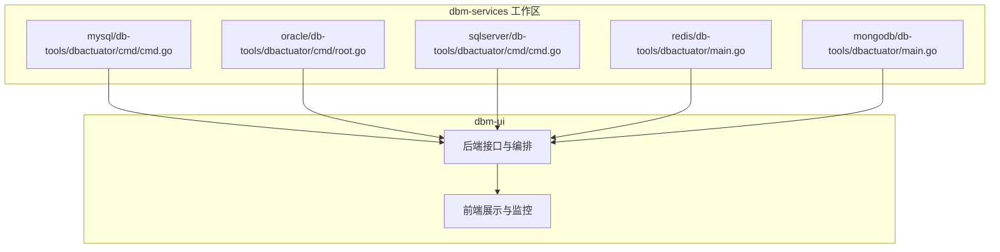
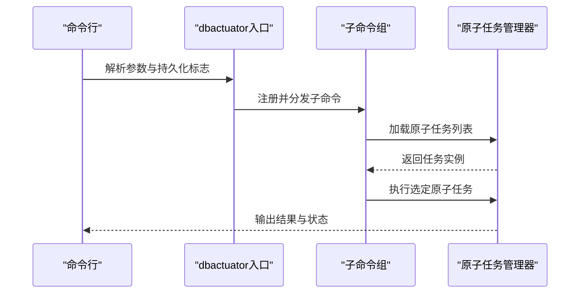
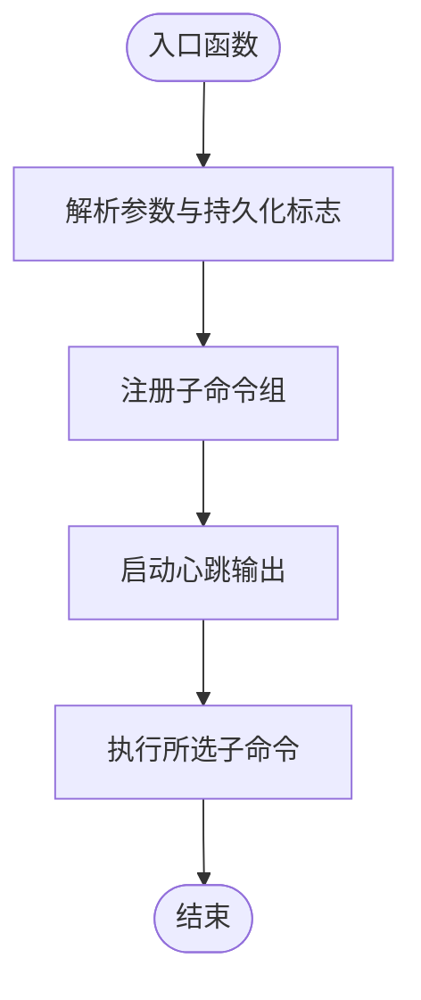
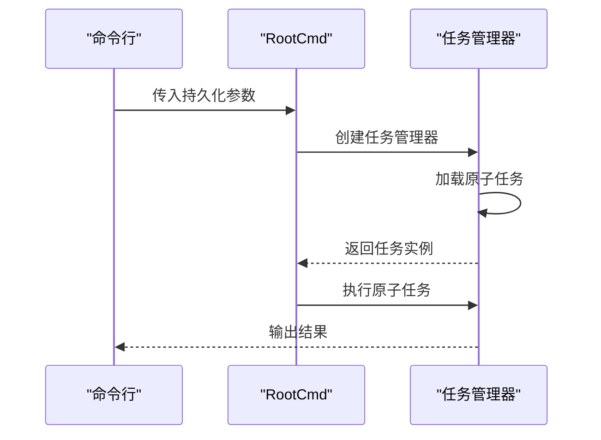
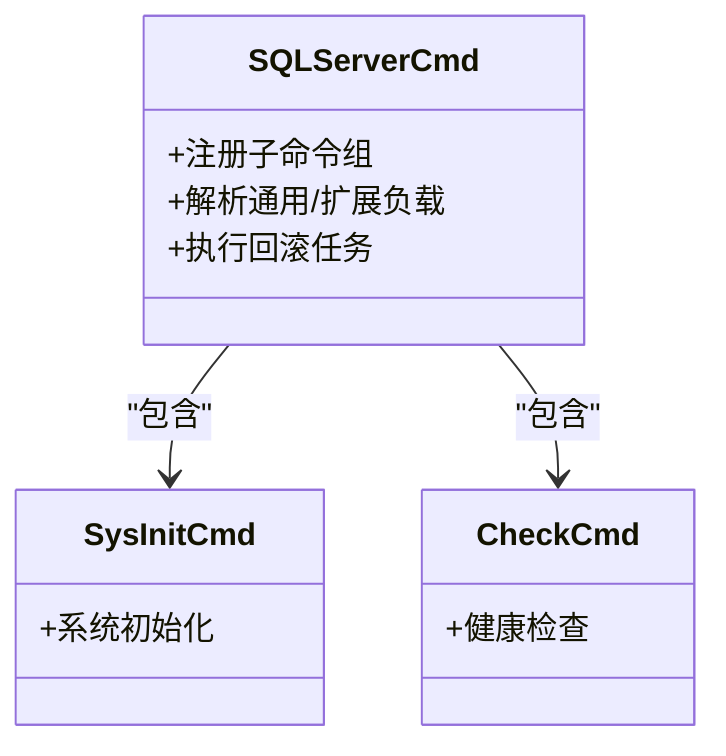
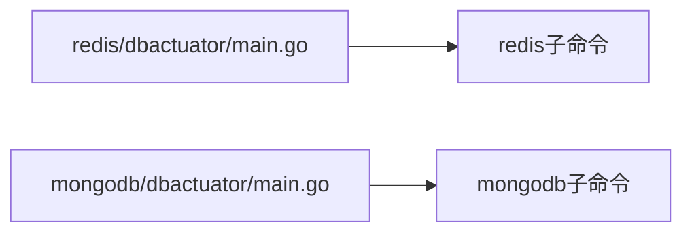
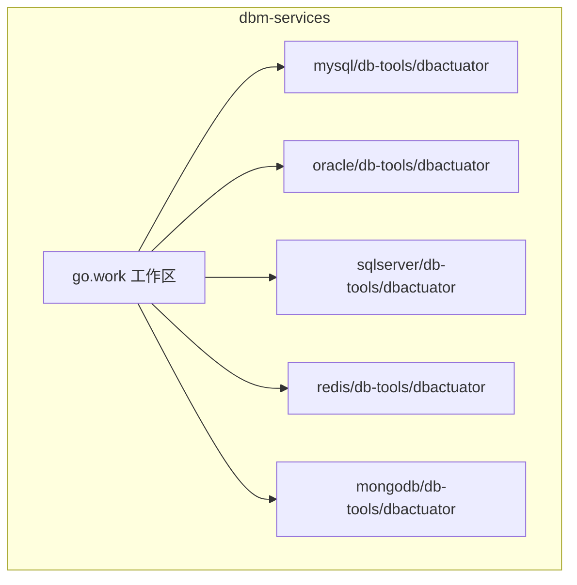

# 数据库扩展

<cite>
**本文引用的文件**
- [readme.md](file://readme.md)
- [dbm-services/go.work](file://dbm-services/go.work)
- [dbm-services/mysql/db-tools/dbactuator/cmd/cmd.go](file://dbm-services/mysql/db-tools/dbactuator/cmd/cmd.go)
- [dbm-services/oracle/db-tools/dbactuator/cmd/root.go](file://dbm-services/oracle/db-tools/dbactuator/cmd/root.go)
- [dbm-services/sqlserver/db-tools/dbactuator/cmd/cmd.go](file://dbm-services/sqlserver/db-tools/dbactuator/cmd/cmd.go)
- [dbm-services/redis/db-tools/dbactuator/main.go](file://dbm-services/redis/db-tools/dbactuator/main.go)
- [dbm-services/mongodb/db-tools/dbactuator/main.go](file://dbm-services/mongodb/db-tools/dbactuator/main.go)
</cite>

## 目录
1. [简介](#简介)
2. [项目结构](#项目结构)
3. [核心组件](#核心组件)
4. [架构总览](#架构总览)
5. [详细组件分析](#详细组件分析)
6. [依赖分析](#依赖分析)
7. [性能考虑](#性能考虑)
8. [故障排查指南](#故障排查指南)
9. [结论](#结论)
10. [附录](#附录)

## 简介
本文件面向DBM数据库扩展场景，围绕如何新增数据库类型（如MySQL、Redis、MongoDB、Oracle、SQLServer等）提供系统化指导。内容涵盖数据库适配器开发流程、工具链集成与配置管理、部署脚本、监控集成、权限管理实现、工具开发指南、测试验证与性能优化方法。目标是帮助读者在不改变现有架构的前提下，快速、稳定地接入新的数据库类型。

## 项目结构
DBM采用多模块工作区组织方式，dbm-services以Go工作区统一管理各数据库工具与适配器；dbm-ui提供前端与后端接口，承载业务编排与监控展示。数据库适配器（dbactuator）作为统一的命令行工具入口，按数据库类型拆分子模块，通过子命令组织具体操作。

- 工作区与模块关系
  - dbm-services/go.work定义了所有子模块的路径与替换规则，确保跨数据库工具的一致性与可维护性。
  - 各数据库工具（如mysql、oracle、sqlserver、redis、mongodb）分别在各自目录下提供dbactuator、dbmon、db-tools等组件。
- 命令行入口
  - 各数据库dbactuator的入口main.go统一调用对应cmd包的Execute()，形成一致的启动与参数解析模式。

**图表来源**
- [dbm-services/mysql/db-tools/dbactuator/cmd/cmd.go:56-70](file://dbm-services/mysql/db-tools/dbactuator/cmd/cmd.go#L56-L70)
- [dbm-services/oracle/db-tools/dbactuator/cmd/root.go:193-199](file://dbm-services/oracle/db-tools/dbactuator/cmd/root.go#L193-L199)
- [dbm-services/sqlserver/db-tools/dbactuator/cmd/cmd.go:60-65](file://dbm-services/sqlserver/db-tools/dbactuator/cmd/cmd.go#L60-L65)
- [dbm-services/redis/db-tools/dbactuator/main.go:10-12](file://dbm-services/redis/db-tools/dbactuator/main.go#L10-L12)
- [dbm-services/mongodb/db-tools/dbactuator/main.go:10-12](file://dbm-services/mongodb/db-tools/dbactuator/main.go#L10-L12)

**章节来源**
- [readme.md:16-21](file://readme.md#L16-L21)
- [dbm-services/go.work:3-42](file://dbm-services/go.work#L3-L42)

## 核心组件
- dbactuator（数据库适配器）
  - 统一命令行入口，负责参数解析、日志初始化、心跳输出、子命令注册与执行。
  - MySQL、Oracle、SQLServer、Redis、MongoDB各自提供独立的dbactuator入口与子命令组。
- 子命令与任务编排
  - MySQL通过模板化命令组组织操作集合；Oracle与SQLServer采用通用任务加载与执行模型；Redis/MongoDB遵循相同入口模式。
- 日志与心跳
  - 统一的心跳输出机制用于长时间任务的状态反馈，便于监控与排障。

**章节来源**
- [dbm-services/mysql/db-tools/dbactuator/cmd/cmd.go:72-195](file://dbm-services/mysql/db-tools/dbactuator/cmd/cmd.go#L72-L195)
- [dbm-services/oracle/db-tools/dbactuator/cmd/root.go:66-105](file://dbm-services/oracle/db-tools/dbactuator/cmd/root.go#L66-L105)
- [dbm-services/sqlserver/db-tools/dbactuator/cmd/cmd.go:67-143](file://dbm-services/sqlserver/db-tools/dbactuator/cmd/cmd.go#L67-L143)

## 架构总览
DBM的数据库扩展遵循“统一入口 + 类型隔离 + 子命令编排”的架构。各数据库适配器共享参数解析、日志与心跳机制，内部通过子命令组织具体操作，实现对不同数据库类型的差异化支持。

**图表来源**
- [dbm-services/mysql/db-tools/dbactuator/cmd/cmd.go:99-155](file://dbm-services/mysql/db-tools/dbactuator/cmd/cmd.go#L99-L155)
- [dbm-services/oracle/db-tools/dbactuator/cmd/root.go:90-104](file://dbm-services/oracle/db-tools/dbactuator/cmd/root.go#L90-L104)
- [dbm-services/sqlserver/db-tools/dbactuator/cmd/cmd.go:92-112](file://dbm-services/sqlserver/db-tools/dbactuator/cmd/cmd.go#L92-L112)

## 详细组件分析

### MySQL 适配器
- 入口与参数
  - 入口函数负责异常捕获、日志初始化、心跳输出与子命令注册。
  - 通过模板化的命令组将操作集合分类组织，便于扩展与维护。
- 子命令组织
  - 包含mysql、sysinit、crontab、proxy、common、download、spider、spiderctl、tbinlogdumper等子命令组。
- 参数持久化
  - 提供payload、uid、root_id、node_id、version_id、rollback、helper等通用参数，满足任务编排与回滚需求。

**图表来源**
- [dbm-services/mysql/db-tools/dbactuator/cmd/cmd.go:56-70](file://dbm-services/mysql/db-tools/dbactuator/cmd/cmd.go#L56-L70)
- [dbm-services/mysql/db-tools/dbactuator/cmd/cmd.go:99-155](file://dbm-services/mysql/db-tools/dbactuator/cmd/cmd.go#L99-L155)

**章节来源**
- [dbm-services/mysql/db-tools/dbactuator/cmd/cmd.go:72-195](file://dbm-services/mysql/db-tools/dbactuator/cmd/cmd.go#L72-L195)

### Oracle 适配器
- 任务加载与执行
  - 通过任务管理器加载原子任务列表并执行，支持调试命令列出任务与打印参数。
- 参数与环境
  - 支持数据目录、备份目录、用户与组、负载参数等配置项，便于在不同环境中运行。
- 版本信息
  - 输出版本信息用于问题定位与兼容性检查。

**图表来源**
- [dbm-services/oracle/db-tools/dbactuator/cmd/root.go:90-104](file://dbm-services/oracle/db-tools/dbactuator/cmd/root.go#L90-L104)

**章节来源**
- [dbm-services/oracle/db-tools/dbactuator/cmd/root.go:66-105](file://dbm-services/oracle/db-tools/dbactuator/cmd/root.go#L66-L105)

### SQLServer 适配器
- 子命令组织
  - 提供sysinit、sqlserver、check三类子命令组，覆盖初始化、SQLServer操作与校验。
- 参数与回滚
  - 支持通用负载、扩展负载文件、回滚负载、uid、root_id、node_id、version_id等参数，满足复杂任务场景。

**图表来源**
- [dbm-services/sqlserver/db-tools/dbactuator/cmd/cmd.go:92-112](file://dbm-services/sqlserver/db-tools/dbactuator/cmd/cmd.go#L92-L112)

**章节来源**
- [dbm-services/sqlserver/db-tools/dbactuator/cmd/cmd.go:67-143](file://dbm-services/sqlserver/db-tools/dbactuator/cmd/cmd.go#L67-L143)

### Redis 与 MongoDB 适配器
- 入口一致性
  - 两者均通过main.go导入对应cmd包并执行，保持与MySQL/Oracle/SQLServer一致的启动模式。
- 适配策略
  - Redis与MongoDB的dbactuator遵循相同的入口规范，便于后续扩展与统一管理。

**图表来源**
- [dbm-services/redis/db-tools/dbactuator/main.go:10-12](file://dbm-services/redis/db-tools/dbactuator/main.go#L10-L12)
- [dbm-services/mongodb/db-tools/dbactuator/main.go:10-12](file://dbm-services/mongodb/db-tools/dbactuator/main.go#L10-L12)

**章节来源**
- [dbm-services/redis/db-tools/dbactuator/main.go:10-12](file://dbm-services/redis/db-tools/dbactuator/main.go#L10-L12)
- [dbm-services/mongodb/db-tools/dbactuator/main.go:10-12](file://dbm-services/mongodb/db-tools/dbactuator/main.go#L10-L12)

## 依赖分析
- 工作区模块
  - dbm-services/go.work声明了所有数据库工具模块的路径与替换规则，确保跨数据库工具的一致性。
- 模块间关系
  - 各数据库适配器相互独立，共享公共包（如logger），避免耦合。
- 外部依赖
  - 使用cobra作为命令行框架，统一参数解析与帮助输出。

**图表来源**
- [dbm-services/go.work:3-42](file://dbm-services/go.work#L3-L42)

**章节来源**
- [dbm-services/go.work:3-42](file://dbm-services/go.work#L3-L42)

## 性能考虑
- 心跳输出
  - 统一的心跳输出机制有助于长时间任务的状态反馈，建议在关键步骤增加细粒度日志与进度提示。
- 子命令分组
  - 将相关操作归类到子命令组，减少参数解析开销，提升可维护性。
- 任务管理
  - 对于Oracle/SQLServer等采用任务管理器的适配器，建议在任务加载阶段进行缓存与预检，降低执行延迟。

## 故障排查指南
- 异常捕获与日志
  - MySQL适配器入口包含异常捕获与日志记录，便于定位错误堆栈。
- 调试命令
  - Oracle适配器提供调试命令，支持列出任务、打印参数与进程信息，辅助问题定位。
- 参数校验
  - SQLServer适配器提供通用/扩展负载与回滚负载参数，建议在执行前进行参数校验与格式检查。

**章节来源**
- [dbm-services/mysql/db-tools/dbactuator/cmd/cmd.go:56-70](file://dbm-services/mysql/db-tools/dbactuator/cmd/cmd.go#L56-L70)
- [dbm-services/oracle/db-tools/dbactuator/cmd/root.go:107-140](file://dbm-services/oracle/db-tools/dbactuator/cmd/root.go#L107-L140)
- [dbm-services/sqlserver/db-tools/dbactuator/cmd/cmd.go:115-139](file://dbm-services/sqlserver/db-tools/dbactuator/cmd/cmd.go#L115-L139)

## 结论
DBM通过统一的dbactuator入口与子命令编排，实现了对多种数据库类型的灵活扩展。新增数据库类型时，应遵循以下原则：
- 保持入口与参数解析的一致性；
- 将相关操作归类到子命令组；
- 利用任务管理器加载与执行原子任务；
- 提供调试与参数打印能力；
- 在工作区中正确声明模块路径与替换规则。

## 附录

### 新数据库类型接入清单
- 适配器入口
  - 在目标数据库目录下创建dbactuator入口main.go，导入对应cmd包并执行。
- 子命令组织
  - 参考MySQL/Oracle/SQLServer的子命令分组方式，将相关操作归类到子命令组。
- 参数与配置
  - 统一使用持久化标志，支持uid、root_id、node_id、version_id、payload等通用参数。
- 任务管理
  - 如需复杂任务编排，可参考Oracle/SQLServer的任务管理器模式。
- 工作区集成
  - 在dbm-services/go.work中添加模块路径与替换规则，确保构建与依赖一致。

**章节来源**
- [dbm-services/redis/db-tools/dbactuator/main.go:10-12](file://dbm-services/redis/db-tools/dbactuator/main.go#L10-L12)
- [dbm-services/mongodb/db-tools/dbactuator/main.go:10-12](file://dbm-services/mongodb/db-tools/dbactuator/main.go#L10-L12)
- [dbm-services/go.work:3-42](file://dbm-services/go.work#L3-L42)