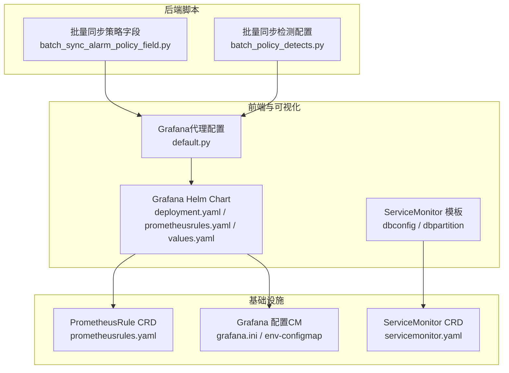
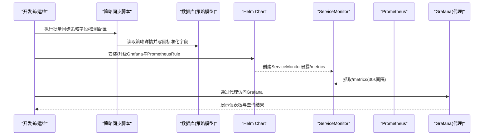
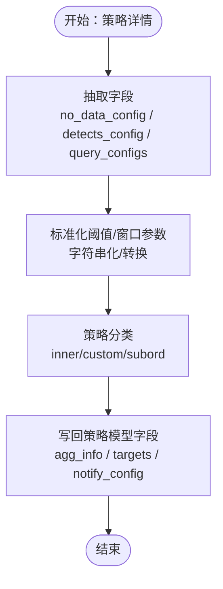
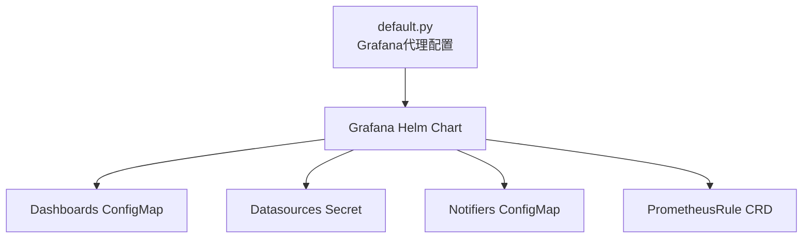
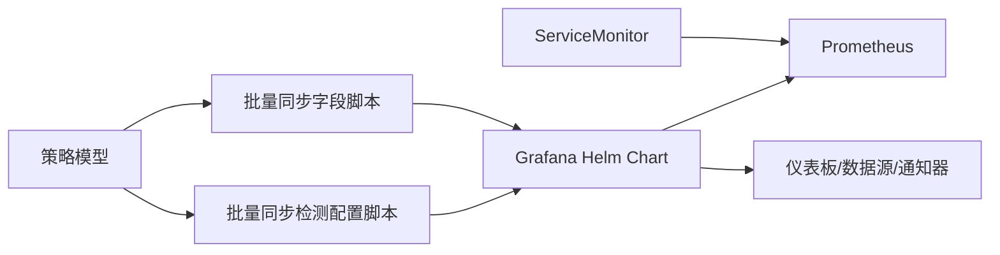

# 监控定制

<cite>
**本文引用的文件**
- [batch_sync_alarm_policy_field.py](file://dbm-ui/scripts/batch_sync_alarm_policy_field.py)
- [batch_policy_detects.py](file://dbm-ui/scripts/batch_policy_detects.py)
- [default.py](file://dbm-ui/config/default.py)
- [prometheusrules.yaml](file://helm-charts/bk-dbm/charts/grafana/templates/prometheusrules.yaml)
- [values.yaml](file://helm-charts/bk-dbm/charts/grafana/values.yaml)
- [deployment.yaml](file://helm-charts/bk-dbm/charts/grafana/templates/deployment.yaml)
- [servicemonitor.yaml（dbconfig）](file://helm-charts/bk-dbm/charts/dbconfig/templates/servicemonitor.yaml)
- [servicemonitor.yaml（dbpartition）](file://helm-charts/bk-dbm/charts/dbpartition/templates/servicemonitor.yaml)
- [README.md（grafana chart）](file://helm-charts/bk-dbm/charts/grafana/README.md)
- [grafana.ini（grafana 配置）](file://helm-charts/bk-dbm/templates/configmaps/grafana-ini-configmap.yaml)
- [grafana-env-configmap.yaml](file://helm-charts/bk-dbm/templates/configmaps/grafana-env-configmap.yaml)
- [test_clean_residual_exporter_exec.sh](file://dbm-ui/scripts/test_clean_residual_exporter_exec.sh)
</cite>

## 目录
1. [简介](#简介)
2. [项目结构](#项目结构)
3. [核心组件](#核心组件)
4. [架构总览](#架构总览)
5. [组件详解](#组件详解)
6. [依赖关系分析](#依赖关系分析)
7. [性能考量](#性能考量)
8. [故障排查指南](#故障排查指南)
9. [结论](#结论)
10. [附录](#附录)

## 简介
本文件面向DBM监控系统的定制化需求，围绕“自定义监控指标添加、监控规则配置与告警策略定制、监控数据采集/处理/存储扩展、监控可视化与仪表板配置、报表生成、监控插件开发、性能优化与故障排查、系统集成接口与扩展点”等主题，结合仓库中的脚本与配置，给出可操作的实践指南与架构视图。

## 项目结构
DBM监控相关能力主要分布在以下区域：
- 后端运维脚本：用于批量同步策略字段、检测配置与告警策略标签，便于统一治理与迁移。
- 前端与可视化：通过Grafana代理配置与Helm Chart进行可视化与仪表板/数据源/通知器挂载。
- Helm Charts：提供ServiceMonitor/PrometheusRule/ConfigMap等资源模板，支撑Prometheus采集与Grafana运行。
- 监控采集：通过ServiceMonitor暴露/metrics端点，Prometheus按30s间隔抓取。

图表来源
- [batch_sync_alarm_policy_field.py:57-146](file://dbm-ui/scripts/batch_sync_alarm_policy_field.py#L57-L146)
- [batch_policy_detects.py:22-46](file://dbm-ui/scripts/batch_policy_detects.py#L22-L46)
- [default.py:624-646](file://dbm-ui/config/default.py#L624-L646)
- [deployment.yaml:167-325](file://helm-charts/bk-dbm/charts/grafana/templates/deployment.yaml#L167-L325)
- [prometheusrules.yaml:1-24](file://helm-charts/bk-dbm/charts/grafana/templates/prometheusrules.yaml#L1-L24)
- [values.yaml:776-798](file://helm-charts/bk-dbm/charts/grafana/values.yaml#L776-L798)
- [servicemonitor.yaml（dbconfig）:1-21](file://helm-charts/bk-dbm/charts/dbconfig/templates/servicemonitor.yaml#L1-L21)
- [servicemonitor.yaml（dbpartition）:1-21](file://helm-charts/bk-dbm/charts/dbpartition/templates/servicemonitor.yaml#L1-L21)
- [grafana.ini（grafana 配置）:1-42](file://helm-charts/bk-dbm/templates/configmaps/grafana-ini-configmap.yaml#L1-L42)
- [grafana-env-configmap.yaml:1-24](file://helm-charts/bk-dbm/templates/configmaps/grafana-env-configmap.yaml#L1-L24)

章节来源
- [batch_sync_alarm_policy_field.py:32-146](file://dbm-ui/scripts/batch_sync_alarm_policy_field.py#L32-L146)
- [batch_policy_detects.py:22-46](file://dbm-ui/scripts/batch_policy_detects.py#L22-L46)
- [default.py:624-646](file://dbm-ui/config/default.py#L624-L646)
- [deployment.yaml:167-325](file://helm-charts/bk-dbm/charts/grafana/templates/deployment.yaml#L167-L325)
- [prometheusrules.yaml:1-24](file://helm-charts/bk-dbm/charts/grafana/templates/prometheusrules.yaml#L1-L24)
- [values.yaml:776-798](file://helm-charts/bk-dbm/charts/grafana/values.yaml#L776-L798)
- [servicemonitor.yaml（dbconfig）:1-21](file://helm-charts/bk-dbm/charts/dbconfig/templates/servicemonitor.yaml#L1-L21)
- [servicemonitor.yaml（dbpartition）:1-21](file://helm-charts/bk-dbm/charts/dbpartition/templates/servicemonitor.yaml#L1-L21)
- [grafana.ini（grafana 配置）:1-42](file://helm-charts/bk-dbm/templates/configmaps/grafana-ini-configmap.yaml#L1-L42)
- [grafana-env-configmap.yaml:1-24](file://helm-charts/bk-dbm/templates/configmaps/grafana-env-configmap.yaml#L1-L24)

## 核心组件
- 策略字段与检测配置同步脚本：负责从策略详情中抽取并写回no_data_config、detects_config、agg_info、targets等字段，同时根据父子策略差异标记策略类型与标签，便于统一治理。
- Grafana代理与可视化：通过后端配置将Grafana作为内部服务代理，支持权限、认证与仪表板注入。
- Helm Chart与CRD：通过ServiceMonitor暴露/metrics端点，Prometheus按固定间隔抓取；通过PrometheusRule CRD下发告警规则；通过ConfigMap/Secret挂载数据源与仪表板。
- 采集与存储：Prometheus作为采集与短期存储，Grafana作为可视化与查询入口。

章节来源
- [batch_sync_alarm_policy_field.py:57-146](file://dbm-ui/scripts/batch_sync_alarm_policy_field.py#L57-L146)
- [batch_policy_detects.py:22-46](file://dbm-ui/scripts/batch_policy_detects.py#L22-L46)
- [default.py:624-646](file://dbm-ui/config/default.py#L624-L646)
- [deployment.yaml:167-325](file://helm-charts/bk-dbm/charts/grafana/templates/deployment.yaml#L167-L325)
- [prometheusrules.yaml:1-24](file://helm-charts/bk-dbm/charts/grafana/templates/prometheusrules.yaml#L1-L24)
- [servicemonitor.yaml（dbconfig）:1-21](file://helm-charts/bk-dbm/charts/dbconfig/templates/servicemonitor.yaml#L1-L21)

## 架构总览
下图展示DBM监控定制的关键交互：后端脚本对策略进行标准化与归类；Helm Chart部署Grafana与PrometheusRule；ServiceMonitor暴露/metrics供Prometheus抓取；Grafana通过代理访问与可视化。

图表来源
- [batch_sync_alarm_policy_field.py:57-146](file://dbm-ui/scripts/batch_sync_alarm_policy_field.py#L57-L146)
- [batch_policy_detects.py:22-46](file://dbm-ui/scripts/batch_policy_detects.py#L22-L46)
- [deployment.yaml:167-325](file://helm-charts/bk-dbm/charts/grafana/templates/deployment.yaml#L167-L325)
- [prometheusrules.yaml:1-24](file://helm-charts/bk-dbm/charts/grafana/templates/prometheusrules.yaml#L1-L24)
- [servicemonitor.yaml（dbconfig）:1-21](file://helm-charts/bk-dbm/charts/dbconfig/templates/servicemonitor.yaml#L1-L21)
- [servicemonitor.yaml（dbpartition）:1-21](file://helm-charts/bk-dbm/charts/dbpartition/templates/servicemonitor.yaml#L1-L21)

## 组件详解

### 自定义监控指标与规则配置
- 指标来源与采集
  - 通过ServiceMonitor在命名空间内暴露/metrics端点，Prometheus按30s间隔抓取。
  - 可在对应Chart中启用ServiceMonitor以接入目标服务。
- 规则与告警
  - 通过PrometheusRule CRD下发告警规则；可在values中配置rules数组，或使用模板渲染。
  - Grafana Helm Chart支持挂载PrometheusRule资源，确保Prometheus发现并应用规则。
- 策略字段标准化
  - 脚本从策略details中抽取no_data_config、detects_config、query_configs等，写回到策略模型字段，便于统一治理与可视化。
  - 脚本还根据父子策略差异判断策略类型与标签，辅助策略分类管理。

图表来源
- [batch_sync_alarm_policy_field.py:57-146](file://dbm-ui/scripts/batch_sync_alarm_policy_field.py#L57-L146)
- [batch_policy_detects.py:22-46](file://dbm-ui/scripts/batch_policy_detects.py#L22-L46)

章节来源
- [servicemonitor.yaml（dbconfig）:1-21](file://helm-charts/bk-dbm/charts/dbconfig/templates/servicemonitor.yaml#L1-L21)
- [servicemonitor.yaml（dbpartition）:1-21](file://helm-charts/bk-dbm/charts/dbpartition/templates/servicemonitor.yaml#L1-L21)
- [prometheusrules.yaml:1-24](file://helm-charts/bk-dbm/charts/grafana/templates/prometheusrules.yaml#L1-L24)
- [values.yaml:776-798](file://helm-charts/bk-dbm/charts/grafana/values.yaml#L776-L798)
- [batch_sync_alarm_policy_field.py:57-146](file://dbm-ui/scripts/batch_sync_alarm_policy_field.py#L57-L146)
- [batch_policy_detects.py:22-46](file://dbm-ui/scripts/batch_policy_detects.py#L22-L46)

### 监控数据采集、处理与存储扩展
- 采集扩展
  - 在目标Chart中启用ServiceMonitor，设置抓取间隔与端点路径，即可将新服务纳入Prometheus采集。
- 处理扩展
  - 使用PromQL在Grafana中进行聚合与过滤；通过PrometheusRule定义检测逻辑与恢复条件。
- 存储扩展
  - Prometheus作为短期存储；如需长期存储，可在Prometheus配置中接入远端写入（需在Prometheus侧配置，不在当前仓库范围内）。

章节来源
- [deployment.yaml:167-325](file://helm-charts/bk-dbm/charts/grafana/templates/deployment.yaml#L167-L325)
- [prometheusrules.yaml:1-24](file://helm-charts/bk-dbm/charts/grafana/templates/prometheusrules.yaml#L1-L24)
- [values.yaml:776-798](file://helm-charts/bk-dbm/charts/grafana/values.yaml#L776-L798)

### 监控可视化定制与仪表板配置
- Grafana代理
  - 后端配置Grafana代理地址、前缀、认证与权限类，便于在DBM内部访问Grafana。
- 仪表板与数据源
  - Helm Chart支持通过ConfigMap挂载仪表板JSON，通过Secret挂载数据源配置；默认提供Provider以便自动加载。
- 通知器
  - 支持通过ConfigMap挂载通知器配置，实现告警通知渠道的统一管理。

图表来源
- [default.py:624-646](file://dbm-ui/config/default.py#L624-L646)
- [deployment.yaml:167-325](file://helm-charts/bk-dbm/charts/grafana/templates/deployment.yaml#L167-L325)
- [README.md（grafana chart）:503-515](file://helm-charts/bk-dbm/charts/grafana/README.md#L503-L515)

章节来源
- [default.py:624-646](file://dbm-ui/config/default.py#L624-L646)
- [deployment.yaml:167-325](file://helm-charts/bk-dbm/charts/grafana/templates/deployment.yaml#L167-L325)
- [README.md（grafana chart）:503-515](file://helm-charts/bk-dbm/charts/grafana/README.md#L503-L515)

### 报表生成
- 通过Grafana仪表板与查询PromQL导出数据，结合后端报表模块进行报表生成与分发（具体实现位于dbm-ui后端模块中，本文不展开代码细节）。

[本节为概念性说明，不直接分析具体文件，故无章节来源]

### 监控插件开发与集成接口
- Grafana插件
  - Helm Chart允许加载指定插件，且支持代理模式与无登录配置，便于在DBM环境中集成可视化插件。
- 导出器清理
  - 提供测试脚本验证导出器执行器残留清理流程，保障插件生命周期管理。

章节来源
- [deployment.yaml:167-325](file://helm-charts/bk-dbm/charts/grafana/templates/deployment.yaml#L167-L325)
- [grafana.ini（grafana 配置）:1-42](file://helm-charts/bk-dbm/templates/configmaps/grafana-ini-configmap.yaml#L1-L42)
- [test_clean_residual_exporter_exec.sh:1-56](file://dbm-ui/scripts/test_clean_residual_exporter_exec.sh#L1-L56)

## 依赖关系分析
- 策略同步脚本依赖后端策略模型与事务上下文，确保字段写回的一致性。
- Grafana Helm Chart依赖ServiceMonitor/PrometheusRule/ConfigMap/Secret等Kubernetes资源，形成完整的监控栈。
- Prometheus通过ServiceMonitor暴露的/metrics端点进行采集，Grafana通过代理访问并展示。

图表来源
- [batch_sync_alarm_policy_field.py:57-146](file://dbm-ui/scripts/batch_sync_alarm_policy_field.py#L57-L146)
- [batch_policy_detects.py:22-46](file://dbm-ui/scripts/batch_policy_detects.py#L22-L46)
- [deployment.yaml:167-325](file://helm-charts/bk-dbm/charts/grafana/templates/deployment.yaml#L167-L325)
- [servicemonitor.yaml（dbconfig）:1-21](file://helm-charts/bk-dbm/charts/dbconfig/templates/servicemonitor.yaml#L1-L21)

章节来源
- [batch_sync_alarm_policy_field.py:57-146](file://dbm-ui/scripts/batch_sync_alarm_policy_field.py#L57-L146)
- [batch_policy_detects.py:22-46](file://dbm-ui/scripts/batch_policy_detects.py#L22-L46)
- [deployment.yaml:167-325](file://helm-charts/bk-dbm/charts/grafana/templates/deployment.yaml#L167-L325)
- [servicemonitor.yaml（dbconfig）:1-21](file://helm-charts/bk-dbm/charts/dbconfig/templates/servicemonitor.yaml#L1-L21)

## 性能考量
- 抓取间隔与资源占用：ServiceMonitor默认30s抓取间隔，建议根据指标数量与目标实例规模调整，避免过度拉取导致Prometheus压力。
- 查询复杂度：PromQL聚合与过滤应避免高基数标签与过长时间窗口，减少查询开销。
- Grafana代理与持久化：合理配置Grafana持久化与插件加载，避免不必要的I/O与启动时间。

[本节为通用指导，不直接分析具体文件，故无章节来源]

## 故障排查指南
- Grafana无法访问
  - 检查后端Grafana代理配置是否正确，确认前缀与认证类设置。
  - 确认Helm Chart中Dashboards/数据源/通知器是否按要求挂载。
- 仪表板缺失或数据源错误
  - 按Helm Chart说明，使用ConfigMap挂载仪表板JSON，使用Secret挂载数据源配置。
- Prometheus未抓取到指标
  - 检查ServiceMonitor是否创建成功，确认/metrics端口与路径正确。
- 导出器残留问题
  - 使用导出器清理脚本进行验证与清理，确保插件安装/卸载后的环境整洁。

章节来源
- [default.py:624-646](file://dbm-ui/config/default.py#L624-L646)
- [deployment.yaml:167-325](file://helm-charts/bk-dbm/charts/grafana/templates/deployment.yaml#L167-L325)
- [README.md（grafana chart）:503-515](file://helm-charts/bk-dbm/charts/grafana/README.md#L503-L515)
- [servicemonitor.yaml（dbconfig）:1-21](file://helm-charts/bk-dbm/charts/dbconfig/templates/servicemonitor.yaml#L1-L21)
- [test_clean_residual_exporter_exec.sh:1-56](file://dbm-ui/scripts/test_clean_residual_exporter_exec.sh#L1-L56)

## 结论
DBM监控定制以“策略标准化 + Helm Chart + Prometheus + Grafana”为核心路径：通过脚本完成策略字段与检测配置的统一治理；通过Helm Chart部署Grafana与PrometheusRule，并借助ServiceMonitor暴露/metrics端点；通过Grafana代理与仪表板/数据源/通知器挂载实现可视化与告警闭环。按本文提供的流程与图示，可快速扩展自定义指标、规则与可视化，并在生产环境中稳定运行。

[本节为总结性内容，不直接分析具体文件，故无章节来源]

## 附录
- 关键配置项参考
  - Grafana代理：HOST、PREFIX、AUTHENTICATION_CLASSES、PERMISSION_CLASSES、PROVISIONING_CLASSES、PROVISIONING_PATH。
  - PrometheusRule：enabled、namespace、additionalLabels、rules。
  - Grafana Helm Chart：dashboardsConfigMaps、datasources.secretName、notifiers.configMapName、dashboardsProvider.enabled。

章节来源
- [default.py:624-646](file://dbm-ui/config/default.py#L624-L646)
- [values.yaml:776-798](file://helm-charts/bk-dbm/charts/grafana/values.yaml#L776-L798)
- [deployment.yaml:167-325](file://helm-charts/bk-dbm/charts/grafana/templates/deployment.yaml#L167-L325)