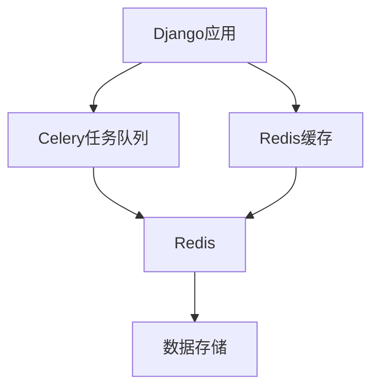

# 技术栈与依赖

<cite>
**本文档引用的文件**   
- [pyproject.toml](file://dbm-ui/pyproject.toml)
- [go.mod](file://dbm-services/bigdata/db-tools/dbactuator/go.mod)
- [go.mod](file://dbm-services/k8s-dbs/go.mod)
- [Chart.yaml](file://helm-charts/bk-dbm/Chart.yaml)
- [values.yaml](file://helm-charts/bk-dbm/values.yaml)
- [default.py](file://dbm-ui/config/default.py)
- [Dockerfile](file://dbm-ui/Dockerfile)
- [main.go](file://dbm-services/common/bkdata-kafka-consumer/main.go)
- [main.go](file://dbm-services/common/db-config/cmd/bkconfigsvr/main.go)
</cite>

## 目录
1. [技术栈概览](#技术栈概览)
2. [编程语言](#编程语言)
3. [框架与库](#框架与库)
4. [关键技术与基础设施](#关键技术与基础设施)
5. [依赖分析](#依赖分析)
6. [技术选型原因与权衡](#技术选型原因与权衡)
7. [开发环境设置](#开发环境设置)

## 技术栈概览

本项目采用Go和Python作为主要编程语言，构建了一个复杂的数据库管理系统。前端服务基于Python的Django框架，而后端服务则使用Go语言的Gin框架。项目利用Kubernetes进行容器编排，通过Helm进行应用部署管理。消息队列使用RabbitMQ，缓存系统采用Redis。这种技术组合旨在提供一个高性能、可扩展且易于维护的数据库管理平台。

## 编程语言

### Go语言
Go语言在本项目中主要用于后端服务的开发。从项目结构可以看出，`dbm-services`目录下的多个服务（如`k8s-dbs`、`bigdata/db-tools/dbactuator`等）都是使用Go语言编写的。Go的并发模型和高效的性能使其非常适合构建高性能的后端服务。

### Python语言
Python语言主要用于前端和Web服务的开发。`dbm-ui`目录下的代码表明，前端服务是基于Django框架构建的。Python的丰富生态系统和Django框架的强大功能使其成为构建复杂Web应用的理想选择。

**Section sources**
- [pyproject.toml](file://dbm-ui/pyproject.toml)
- [go.mod](file://dbm-services/bigdata/db-tools/dbactuator/go.mod)
- [go.mod](file://dbm-services/k8s-dbs/go.mod)

## 框架与库

### Django框架
Django是本项目前端服务的核心框架。从`pyproject.toml`文件中可以看到，项目依赖Django 4.2.23版本。Django提供了完整的Web开发解决方案，包括ORM、URL路由、模板引擎等，极大地提高了开发效率。

### Gin框架
Gin是本项目后端服务的主要Web框架。从`k8s-dbs/go.mod`文件中可以看到，项目依赖`github.com/gin-gonic/gin` v1.10.1版本。Gin是一个高性能的HTTP Web框架，以其轻量级和快速的路由匹配而闻名。

**Section sources**
- [pyproject.toml](file://dbm-ui/pyproject.toml)
- [go.mod](file://dbm-services/k8s-dbs/go.mod)

## 关键技术与基础设施

### Kubernetes
Kubernetes是本项目的核心容器编排平台。从`helm-charts/bk-dbm/Chart.yaml`文件中可以看到，项目使用Helm Chart来定义和部署Kubernetes应用。Kubernetes提供了强大的容器编排能力，包括自动伸缩、服务发现和负载均衡等。

### Helm
Helm是Kubernetes的包管理工具。项目使用Helm来管理应用的部署和配置。从`Chart.yaml`和`values.yaml`文件中可以看到，项目定义了多个Helm Chart，用于部署不同的服务组件。

### RabbitMQ
RabbitMQ是本项目的消息队列系统。从`dbm-ui/config/default.py`文件中可以看到，项目使用Celery作为任务队列，而Celery的broker_url配置为Redis。虽然直接使用的是Redis，但RabbitMQ作为可靠的消息队列系统，在类似架构中常被用作替代方案。

### Redis
Redis在本项目中扮演着多重角色。从`dbm-ui/config/default.py`文件中可以看到，Redis被用作缓存后端和Celery的任务队列。项目配置了Redis作为默认缓存，同时用于存储会话数据和任务队列。

**Diagram sources **
- [default.py](file://dbm-ui/config/default.py)

**Section sources**
- [Chart.yaml](file://helm-charts/bk-dbm/Chart.yaml)
- [values.yaml](file://helm-charts/bk-dbm/values.yaml)
- [default.py](file://dbm-ui/config/default.py)

## 依赖分析

### Go模块依赖
Go模块的依赖关系在`go.mod`文件中定义。以`k8s-dbs/go.mod`为例，项目依赖了多个关键库：
- `github.com/gin-gonic/gin`：Web框架
- `gorm.io/gorm`：ORM库
- `k8s.io/client-go`：Kubernetes客户端库
- `go.opentelemetry.io/contrib/instrumentation/github.com/gin-gonic/gin/otelgin`：OpenTelemetry集成

这些依赖表明项目需要与Kubernetes集群交互，同时需要监控和追踪功能。

### Python依赖
Python依赖在`pyproject.toml`文件中定义。关键依赖包括：
- `Django`：Web框架
- `celery`：任务队列
- `django-redis`：Redis集成
- `kafka-python`：Kafka客户端

这些依赖表明项目需要处理异步任务、缓存和消息队列。

**Section sources**
- [pyproject.toml](file://dbm-ui/pyproject.toml)
- [go.mod](file://dbm-services/k8s-dbs/go.mod)

## 技术选型原因与权衡

### 为什么选择Go和Python
选择Go和Python的组合是为了平衡性能和开发效率。Go语言的高性能和并发能力使其适合构建后端服务，而Python的丰富生态系统和Django框架的成熟度使其适合构建复杂的Web应用。这种组合允许团队在不同层次上使用最适合的工具。

### 为什么选择Django和Gin
Django提供了完整的Web开发解决方案，包括ORM、认证系统和管理界面，非常适合构建复杂的前端应用。Gin则提供了轻量级和高性能的Web服务框架，适合构建API后端。这种组合允许前端和后端独立发展，同时保持良好的性能。

### 为什么选择Kubernetes和Helm
Kubernetes提供了强大的容器编排能力，可以轻松管理大规模的容器化应用。Helm则简化了Kubernetes应用的部署和管理，通过Chart的方式定义应用的配置和依赖。这种组合使得应用的部署和升级变得更加可靠和可重复。

## 开发环境设置

### 软件版本要求
- Python 3.11.10
- Go 1.24.0
- Node.js 22.16.0
- Docker

### 配置步骤
1. 克隆项目仓库
2. 安装Python依赖：`poetry install`
3. 安装Node.js依赖：`yarn install`
4. 构建前端：`yarn build`
5. 启动Docker环境：`docker-compose up`

### 环境变量配置
项目使用环境变量来配置不同的运行环境。关键环境变量包括：
- `DJANGO_SETTINGS_MODULE`：Django配置模块
- `BROKER_URL`：Celery任务队列URL
- `REDIS_URL`：Redis连接URL

**Section sources**
- [Dockerfile](file://dbm-ui/Dockerfile)
- [pyproject.toml](file://dbm-ui/pyproject.toml)
- [default.py](file://dbm-ui/config/default.py)