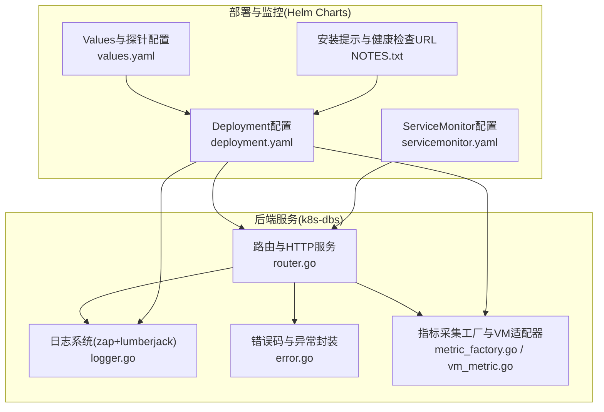
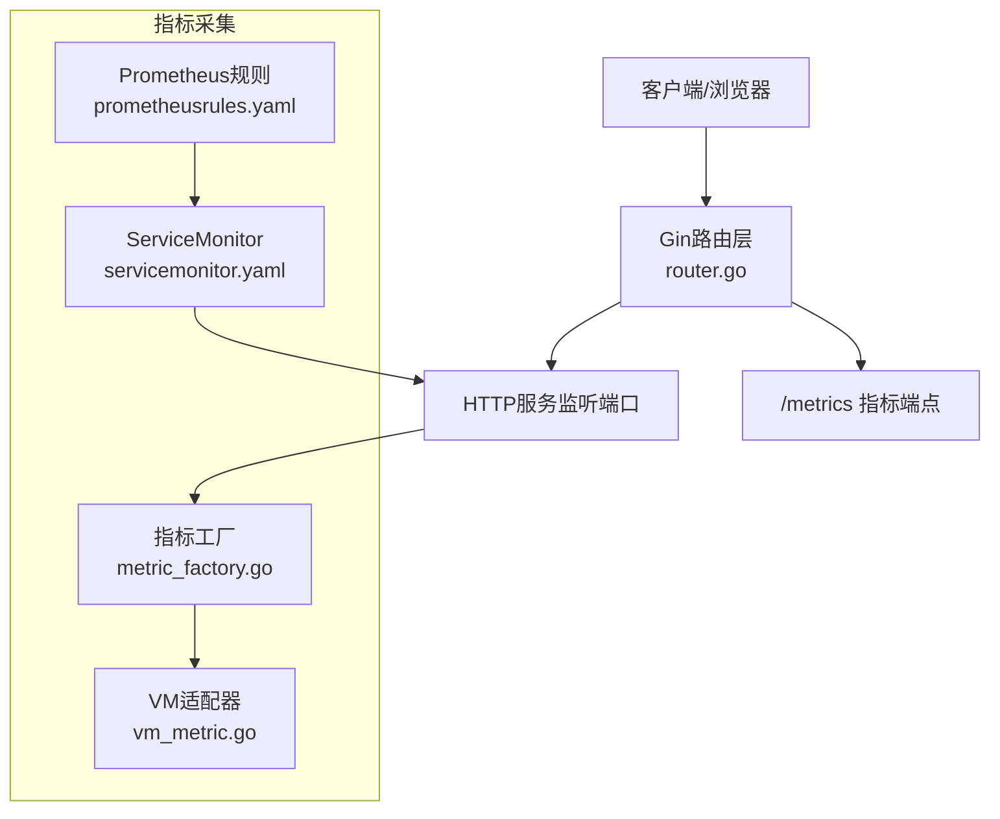
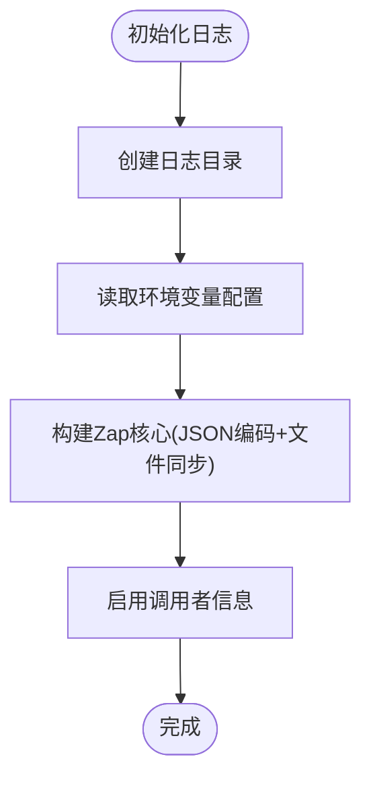
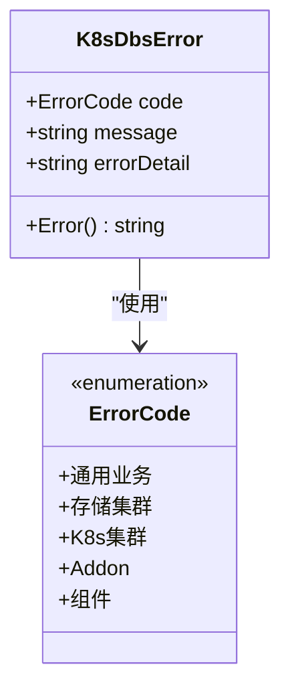
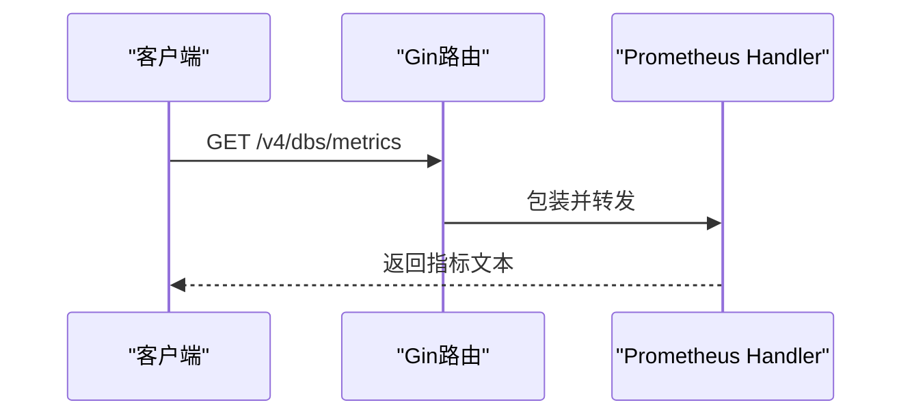
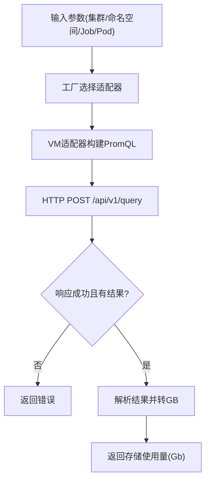
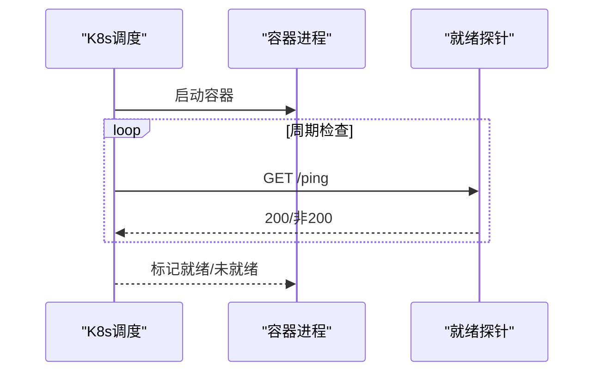
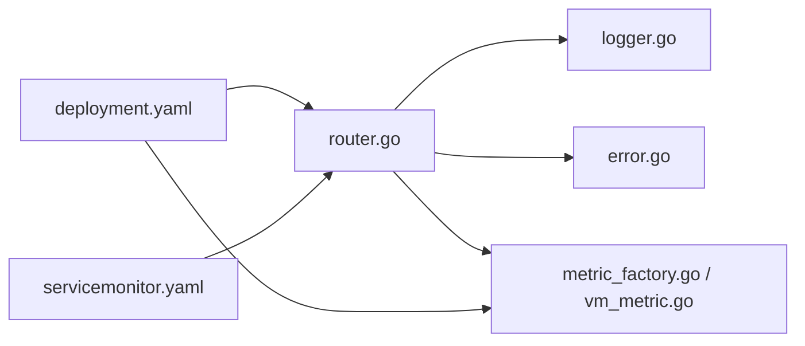

# 故障排除指南

<cite>
**本文引用的文件**   
- [logger.go](file://dbm-services/k8s-dbs/logger/logger.go)
- [error.go](file://dbm-services/k8s-dbs/errors/error.go)
- [router.go](file://dbm-services/k8s-dbs/router/router.go)
- [metric_factory.go](file://dbm-services/k8s-dbs/metric/metric_factory.go)
- [vm_metric.go](file://dbm-services/k8s-dbs/metric/vm_metric.go)
- [deployment.yaml](file://helm-charts/bk-dbm/charts/k8s-dbs/templates/deployment.yaml)
- [servicemonitor.yaml](file://helm-charts/bk-dbm/charts/k8s-dbs/templates/servicemonitor.yaml)
- [values.yaml](file://helm-charts/bk-dbm/charts/k8s-dbs/values.yaml)
- [NOTES.txt](file://helm-charts/bk-dbm/charts/k8s-dbs/templates/NOTES.txt)
- [deployment.yaml](file://helm-charts/bk-dbm/charts/db-resource/templates/deployment.yaml)
- [deployment.yaml](file://helm-charts/bk-dbm/charts/dbpartition/templates/deployment.yaml)
- [deployment.yaml](file://helm-charts/bk-dbm/charts/slow-query-parser-service/templates/deployment.yaml)
- [servicemonitor.yaml](file://helm-charts/bk-dbm/charts/db-simulation/templates/servicemonitor.yaml)
- [servicemonitor.yaml](file://helm-charts/bk-dbm/charts/db-resource/templates/servicemonitor.yaml)
- [servicemonitor.yaml](file://helm-charts/bk-dbm/charts/dbpartition/templates/servicemonitor.yaml)
- [servicemonitor.yaml](file://helm-charts/bk-dbm/charts/slow-query-parser-service/templates/servicemonitor.yaml)
- [prometheusrules.yaml](file://helm-charts/bk-dbm/charts/grafana/templates/prometheusrules.yaml)
- [servicemonitor.yaml](file://helm-charts/bk-dbm/charts/grafana/templates/servicemonitor.yaml)
- [test-connection.yaml](file://helm-charts/bk-dbm/charts/db-simulation/templates/tests/test-connection.yaml)
- [test-connection.yaml](file://helm-charts/bk-dbm/charts/db-resource/templates/tests/test-connection.yaml)
</cite>

## 目录
1. [简介](#简介)
2. [项目结构](#项目结构)
3. [核心组件](#核心组件)
4. [架构总览](#架构总览)
5. [详细组件分析](#详细组件分析)
6. [依赖关系分析](#依赖关系分析)
7. [性能考量](#性能考量)
8. [故障排除指南](#故障排除指南)
9. [结论](#结论)
10. [附录](#附录)

## 简介
本指南面向DBM项目的运维与开发人员，聚焦于系统运行期的故障定位与恢复。内容覆盖系统错误、网络连接、数据库连接、权限问题、日志分析、调试工具、性能诊断、监控指标异常识别与处理、健康检查清单、预防性维护以及紧急故障响应流程与问题升级机制。文档以实际代码与配置为依据，提供可操作的排查步骤与图示说明。

## 项目结构
DBM采用多模块分层设计，后端服务主要位于dbm-services目录，前端与后端交互通过API路由暴露；监控与指标采集通过Prometheus ServiceMonitor与Grafana规则实现；Kubernetes部署通过Helm Charts管理。

**图表来源**
- [router.go:47-54](file://dbm-services/k8s-dbs/router/router.go#L47-L54)
- [logger.go:44-84](file://dbm-services/k8s-dbs/logger/logger.go#L44-L84)
- [error.go:22-56](file://dbm-services/k8s-dbs/errors/error.go#L22-L56)
- [metric_factory.go:36-77](file://dbm-services/k8s-dbs/metric/metric_factory.go#L36-L77)
- [vm_metric.go:49-62](file://dbm-services/k8s-dbs/metric/vm_metric.go#L49-L62)
- [deployment.yaml:16-65](file://helm-charts/bk-dbm/charts/k8s-dbs/templates/deployment.yaml#L16-L65)
- [servicemonitor.yaml:1-28](file://helm-charts/bk-dbm/charts/k8s-dbs/templates/servicemonitor.yaml#L1-L28)
- [values.yaml:145-171](file://helm-charts/bk-dbm/charts/k8s-dbs/values.yaml#L145-L171)
- [NOTES.txt:3-4](file://helm-charts/bk-dbm/charts/k8s-dbs/templates/NOTES.txt#L3-L4)

**章节来源**
- [router.go:33-54](file://dbm-services/k8s-dbs/router/router.go#L33-L54)
- [deployment.yaml:16-65](file://helm-charts/bk-dbm/charts/k8s-dbs/templates/deployment.yaml#L16-L65)
- [servicemonitor.yaml:1-28](file://helm-charts/bk-dbm/charts/k8s-dbs/templates/servicemonitor.yaml#L1-L28)
- [values.yaml:145-171](file://helm-charts/bk-dbm/charts/k8s-dbs/values.yaml#L145-L171)
- [NOTES.txt:3-4](file://helm-charts/bk-dbm/charts/k8s-dbs/templates/NOTES.txt#L3-L4)

## 核心组件
- 日志系统：基于zap与lumberjack，支持环境变量控制日志级别、滚动策略与文件路径。
- 错误体系：统一错误码枚举与消息映射，便于标准化返回与排障。
- 路由与指标：HTTP服务暴露/metrics标准指标端点，集成Prometheus。
- 指标采集：通过工厂模式选择不同指标后端（当前支持VictoriaMetrics），封装PromQL查询与结果解析。
- 部署与探针：Kubernetes Deployment注入数据库与指标服务器环境变量，配置存活/就绪探针；ServiceMonitor采集/metrics。

**章节来源**
- [logger.go:44-101](file://dbm-services/k8s-dbs/logger/logger.go#L44-L101)
- [error.go:22-187](file://dbm-services/k8s-dbs/errors/error.go#L22-L187)
- [router.go:47-54](file://dbm-services/k8s-dbs/router/router.go#L47-L54)
- [metric_factory.go:36-77](file://dbm-services/k8s-dbs/metric/metric_factory.go#L36-L77)
- [vm_metric.go:49-119](file://dbm-services/k8s-dbs/metric/vm_metric.go#L49-L119)
- [deployment.yaml:38-65](file://helm-charts/bk-dbm/charts/k8s-dbs/templates/deployment.yaml#L38-L65)

## 架构总览
下图展示从客户端到后端服务、指标采集与监控的整体交互：

**图表来源**
- [router.go:47-54](file://dbm-services/k8s-dbs/router/router.go#L47-L54)
- [metric_factory.go:36-77](file://dbm-services/k8s-dbs/metric/metric_factory.go#L36-L77)
- [vm_metric.go:49-119](file://dbm-services/k8s-dbs/metric/vm_metric.go#L49-L119)
- [servicemonitor.yaml:1-28](file://helm-charts/bk-dbm/charts/k8s-dbs/templates/servicemonitor.yaml#L1-L28)
- [prometheusrules.yaml:1-24](file://helm-charts/bk-dbm/charts/grafana/templates/prometheusrules.yaml#L1-L24)

## 详细组件分析

### 日志系统（zap + lumberjack）
- 初始化流程：确保日志目录存在，读取环境变量配置滚动参数，构造JSON编码器与调用者信息，输出到文件。
- 关键环境变量：日志级别、单文件最大大小、保留备份数、最大保存天数、压缩开关。
- 建议：在生产环境固定日志级别与滚动策略，避免滚动标签带来的不确定性。

**图表来源**
- [logger.go:44-84](file://dbm-services/k8s-dbs/logger/logger.go#L44-L84)

**章节来源**
- [logger.go:44-101](file://dbm-services/k8s-dbs/logger/logger.go#L44-L101)

### 错误码与异常封装
- 统一错误结构体包含业务码、消息与详细错误描述。
- 错误码分组：通用业务、存储集群、K8s集群、Addon、组件等。
- 建议：对外统一返回错误码与消息，便于前端与监控系统识别。

**图表来源**
- [error.go:22-56](file://dbm-services/k8s-dbs/errors/error.go#L22-L56)

**章节来源**
- [error.go:22-187](file://dbm-services/k8s-dbs/errors/error.go#L22-L187)

### 路由与指标端点
- 路由基路径：/v4/dbs
- 暴露/metrics标准指标端点，供Prometheus抓取。
- 健康检查：通过健康路由与探针配合。

**图表来源**
- [router.go:47-54](file://dbm-services/k8s-dbs/router/router.go#L47-L54)

**章节来源**
- [router.go:33-54](file://dbm-services/k8s-dbs/router/router.go#L33-L54)

### 指标采集（工厂模式 + VM适配器）
- 工厂根据Addon类型选择具体实现，当前支持VictoriaMetrics、Qdrant等。
- VM适配器读取环境变量配置指标服务器地址与端口，构造PromQL查询PVC存储使用量，解析响应并转换为GB。
- 异常处理：空结果、格式不合法、HTTP错误等均会返回错误。

**图表来源**
- [metric_factory.go:36-77](file://dbm-services/k8s-dbs/metric/metric_factory.go#L36-L77)
- [vm_metric.go:83-119](file://dbm-services/k8s-dbs/metric/vm_metric.go#L83-L119)

**章节来源**
- [metric_factory.go:36-77](file://dbm-services/k8s-dbs/metric/metric_factory.go#L36-L77)
- [vm_metric.go:49-119](file://dbm-services/k8s-dbs/metric/vm_metric.go#L49-L119)

### 部署与探针配置
- Deployment注入数据库与指标服务器环境变量，设置容器端口与探针参数。
- 就绪探针默认周期、超时与阈值可配置，用于判断服务可用性。
- NOTES提示中提供集群内健康检查URL，便于快速验证。

**图表来源**
- [deployment.yaml:16-65](file://helm-charts/bk-dbm/charts/k8s-dbs/templates/deployment.yaml#L16-L65)
- [values.yaml:145-171](file://helm-charts/bk-dbm/charts/k8s-dbs/values.yaml#L145-L171)
- [NOTES.txt:3-4](file://helm-charts/bk-dbm/charts/k8s-dbs/templates/NOTES.txt#L3-L4)

**章节来源**
- [deployment.yaml:16-65](file://helm-charts/bk-dbm/charts/k8s-dbs/templates/deployment.yaml#L16-L65)
- [values.yaml:145-171](file://helm-charts/bk-dbm/charts/k8s-dbs/values.yaml#L145-L171)
- [NOTES.txt:3-4](file://helm-charts/bk-dbm/charts/k8s-dbs/templates/NOTES.txt#L3-L4)

## 依赖关系分析
- 路由层依赖日志与错误模块，负责统一输出与异常包装。
- 指标采集依赖工厂与VM适配器，通过环境变量与K8s客户端参数工作。
- 部署层通过环境变量与探针配置与监控系统对接。

**图表来源**
- [router.go:47-54](file://dbm-services/k8s-dbs/router/router.go#L47-L54)
- [logger.go:44-84](file://dbm-services/k8s-dbs/logger/logger.go#L44-L84)
- [error.go:22-56](file://dbm-services/k8s-dbs/errors/error.go#L22-L56)
- [metric_factory.go:36-77](file://dbm-services/k8s-dbs/metric/metric_factory.go#L36-L77)
- [vm_metric.go:49-119](file://dbm-services/k8s-dbs/metric/vm_metric.go#L49-L119)
- [deployment.yaml:16-65](file://helm-charts/bk-dbm/charts/k8s-dbs/templates/deployment.yaml#L16-L65)
- [servicemonitor.yaml:1-28](file://helm-charts/bk-dbm/charts/k8s-dbs/templates/servicemonitor.yaml#L1-L28)

**章节来源**
- [router.go:47-54](file://dbm-services/k8s-dbs/router/router.go#L47-L54)
- [metric_factory.go:36-77](file://dbm-services/k8s-dbs/metric/metric_factory.go#L36-L77)
- [vm_metric.go:49-119](file://dbm-services/k8s-dbs/metric/vm_metric.go#L49-L119)
- [deployment.yaml:16-65](file://helm-charts/bk-dbm/charts/k8s-dbs/templates/deployment.yaml#L16-L65)
- [servicemonitor.yaml:1-28](file://helm-charts/bk-dbm/charts/k8s-dbs/templates/servicemonitor.yaml#L1-L28)

## 性能考量
- 日志滚动参数：合理设置单文件大小、保留份数与最大保存天数，避免磁盘压力过大。
- 指标查询：PromQL应尽量精确，避免全量扫描；定期清理无用指标。
- 探针配置：就绪探针周期与超时需结合服务启动时间与负载调整，避免频繁重启。
- 数据库连接池：通过环境变量配置最大连接数、空闲连接与生命周期，防止连接泄漏或耗尽。

[本节为通用指导，无需“章节来源”]

## 故障排除指南

### 一、系统错误与异常处理
- 现象：接口返回统一错误码与消息，便于前端与监控识别。
- 排查步骤：
  - 查看接口返回的业务码与消息，对照错误码表定位类别。
  - 若包含详细错误描述，优先参考该描述定位根因。
- 建议：对外统一返回错误码，避免泄露内部堆栈细节。

**章节来源**
- [error.go:108-173](file://dbm-services/k8s-dbs/errors/error.go#L108-L173)
- [error.go:175-187](file://dbm-services/k8s-dbs/errors/error.go#L175-L187)

### 二、网络连接问题
- 症状：探针失败、健康检查URL不可达、ServiceMonitor无法抓取指标。
- 排查步骤：
  - 检查容器端口与Service暴露端口是否一致。
  - 校验就绪探针路径与返回码，确认服务已完全启动。
  - 使用测试Pod对服务端口进行连通性验证。
- 常见原因：端口不匹配、探针路径错误、服务未就绪、网络策略限制。
- 建议：在生产环境固定镜像标签，避免滚动标签导致的不可控行为。

**章节来源**
- [deployment.yaml:24-26](file://helm-charts/bk-dbm/charts/k8s-dbs/templates/deployment.yaml#L24-L26)
- [deployment.yaml:52-62](file://helm-charts/bk-dbm/charts/k8s-dbs/templates/deployment.yaml#L52-L62)
- [deployment.yaml:42-68](file://helm-charts/bk-dbm/charts/db-resource/templates/deployment.yaml#L42-L68)
- [deployment.yaml:35-55](file://helm-charts/bk-dbm/charts/dbpartition/templates/deployment.yaml#L35-L55)
- [deployment.yaml:35-62](file://helm-charts/bk-dbm/charts/slow-query-parser-service/templates/deployment.yaml#L35-L62)
- [test-connection.yaml:1-15](file://helm-charts/bk-dbm/charts/db-simulation/templates/tests/test-connection.yaml#L1-L15)
- [test-connection.yaml:1-15](file://helm-charts/bk-dbm/charts/db-resource/templates/tests/test-connection.yaml#L1-L15)

### 三、数据库连接问题
- 症状：服务启动失败、认证失败、连接池耗尽。
- 排查步骤：
  - 检查数据库主机、端口、用户名、密码、数据库名、TLS模式与连接池参数。
  - 确认网络可达与防火墙策略允许访问。
  - 观察日志中的连接错误与重试情况。
- 建议：在环境变量中显式配置连接池上限、空闲数与生命周期，避免默认值导致的资源争用。

**章节来源**
- [deployment.yaml:44-61](file://helm-charts/bk-dbm/charts/k8s-dbs/templates/deployment.yaml#L44-L61)
- [logger.go:44-84](file://dbm-services/k8s-dbs/logger/logger.go#L44-L84)

### 四、权限问题
- 症状：鉴权失败、权限不足、第三方API调用被拒。
- 排查步骤：
  - 检查鉴权相关环境变量与密钥配置。
  - 对照错误码表中“权限不足/鉴权失败”类错误，定位具体环节。
- 建议：统一使用Secret管理敏感信息，避免硬编码。

**章节来源**
- [error.go:108-173](file://dbm-services/k8s-dbs/errors/error.go#L108-L173)

### 五、日志分析方法
- 步骤：
  - 确认日志目录与文件是否存在，检查滚动参数是否合理。
  - 根据环境变量设置的日志级别过滤关键信息。
  - 结合调用者信息定位具体函数与上下文。
- 建议：生产环境固定日志级别，开启压缩与合理的保留策略。

**章节来源**
- [logger.go:44-101](file://dbm-services/k8s-dbs/logger/logger.go#L44-L101)

### 六、调试工具与性能诊断
- 指标端点：通过/metrics查看标准指标，结合ServiceMonitor与Prometheus抓取。
- 规则告警：通过PrometheusRule定义告警规则，提前发现异常。
- Grafana：通过ServiceMonitor暴露的/metrics在Grafana中可视化。
- 建议：定期审查规则与阈值，避免误报与漏报。

**章节来源**
- [router.go:52-53](file://dbm-services/k8s-dbs/router/router.go#L52-L53)
- [servicemonitor.yaml:1-28](file://helm-charts/bk-dbm/charts/k8s-dbs/templates/servicemonitor.yaml#L1-L28)
- [prometheusrules.yaml:1-24](file://helm-charts/bk-dbm/charts/grafana/templates/prometheusrules.yaml#L1-L24)
- [servicemonitor.yaml:1-50](file://helm-charts/bk-dbm/charts/grafana/templates/servicemonitor.yaml#L1-L50)

### 七、监控指标异常识别与处理
- 存储使用量异常：通过VM适配器查询PromQL，若返回空或格式不合法，检查指标服务器配置与查询条件。
- 健康检查：使用NOTES中提供的健康检查URL验证服务可用性。
- 建议：为关键指标设置阈值与告警，结合日志与指标综合判断。

**章节来源**
- [vm_metric.go:83-119](file://dbm-services/k8s-dbs/metric/vm_metric.go#L83-L119)
- [NOTES.txt:3-4](file://helm-charts/bk-dbm/charts/k8s-dbs/templates/NOTES.txt#L3-L4)

### 八、系统健康检查清单
- 服务状态：Deployment副本数、Pod就绪状态、重启次数。
- 探针状态：存活/就绪探针返回码与耗时。
- 网络连通：Service端口可达、跨命名空间访问策略。
- 指标采集：ServiceMonitor关联正确、Prometheus抓取成功。
- 日志与滚动：日志目录存在、滚动参数生效、无磁盘告警。
- 健康检查URL：集群内可访问健康检查接口。

**章节来源**
- [deployment.yaml:16-65](file://helm-charts/bk-dbm/charts/k8s-dbs/templates/deployment.yaml#L16-L65)
- [servicemonitor.yaml:1-28](file://helm-charts/bk-dbm/charts/k8s-dbs/templates/servicemonitor.yaml#L1-L28)
- [NOTES.txt:3-4](file://helm-charts/bk-dbm/charts/k8s-dbs/templates/NOTES.txt#L3-L4)

### 九、预防性维护建议
- 固定镜像标签，避免滚动标签在生产环境带来的不确定性。
- 定期评估日志滚动策略与磁盘容量，预留缓冲。
- 优化探针参数，平衡探测频率与服务负载。
- 审核指标规则与阈值，减少噪声并提升命中率。
- 对数据库连接池参数进行压测与调优，避免峰值抖动。

**章节来源**
- [deployment.yaml:16-20](file://helm-charts/bk-dbm/charts/k8s-dbs/templates/deployment.yaml#L16-L20)

### 十、紧急故障响应流程与问题升级机制
- 快速定位：结合错误码、日志级别、探针状态与健康检查URL快速判断故障范围。
- 降级与隔离：临时关闭高风险操作、限制连接池、暂停非关键任务。
- 扩容与回滚：必要时扩容副本或回滚至上一个稳定版本。
- 升级机制：通过Helm升级修复问题，升级前备份配置与数据，升级后验证健康检查与指标采集。
- 记录与复盘：记录故障现象、处理过程与根因，沉淀到知识库。

[本节为通用流程指导，无需“章节来源”]

## 结论
本指南基于DBM的实际代码与配置，提供了从日志、错误、路由、指标采集到部署与监控的全链路故障排除方法。建议在日常运维中结合健康检查清单与预防性维护，持续优化探针、日志与指标策略，确保系统稳定与可观测性。

[本节为总结性内容，无需“章节来源”]

## 附录

### A. 常见错误码分类与含义（节选）
- 通用业务：内部服务器错误、参数校验失败、权限不足等。
- 存储集群：集群查询/创建/删除/扩容/升级/重启/暴露服务等失败。
- K8s集群：命名空间创建/删除失败、Pod日志/详情获取失败、API Server超时、Helm安装失败等。
- Addon：插件安装/卸载/升级失败。
- 组件：组件查询/服务信息/实例列表获取失败。

**章节来源**
- [error.go:108-173](file://dbm-services/k8s-dbs/errors/error.go#L108-L173)

### B. 关键环境变量一览
- 日志：日志级别、单文件最大大小、保留备份数、最大保存天数、压缩开关。
- 数据库：认证与dbs库主机、端口、用户、密码、数据库名、TLS模式、连接池上限/空闲/生命周期。
- 指标：指标服务器主机与端口、时区。

**章节来源**
- [logger.go:44-101](file://dbm-services/k8s-dbs/logger/logger.go#L44-L101)
- [deployment.yaml:38-65](file://helm-charts/bk-dbm/charts/k8s-dbs/templates/deployment.yaml#L38-L65)